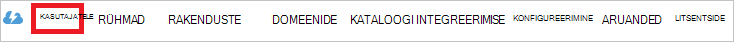

<properties
    pageTitle="Õpetus: Azure'i Active Directory integreerimine 8 x 8 Virtual Office | Microsoft Azure'i"
    description="Saate teada, kuidas konfigureerida ühekordse sisselogimise Azure Active Directory ja 8 x 8 virtuaalse Office vahel."
    services="active-directory"
    documentationCenter=""
    authors="jeevansd"
    manager="femila"
    editor=""/>

<tags
    ms.service="active-directory"
    ms.workload="identity"
    ms.tgt_pltfrm="na"
    ms.devlang="na"
    ms.topic="article"
    ms.date="10/10/2016"
    ms.author="jeedes"/>

# Õpetus: Azure'i Active Directory integreerimine 8 x 8 Virtual Office

Selle õpetuse eesmärk on näete 8 x 8 Virtual Office integreerimine Azure Active Directory (Azure AD) tehke järgmist.

8 x 8 integreerimine Azure AD virtuaalse Office pakub teile järgmised eelised:

- Saate määrata Azure AD, kellel on juurdepääs 8 x 8 Virtual Office
- Saate lubada Azure AD kontodega tema kasutajatele automaatselt saada allkirjastatud-on 8 x 8 Virtual Office (ühekordse sisselogimise)
- Saate hallata ühes keskses kohas – klassikaline Azure portaali konto

Kui soovite leida SaaS rakenduse integreerimine Azure AD kohta rohkem üksikasju, vaadake, [mis on rakenduse access ja ühekordse sisselogimise Azure Active Directory](active-directory-appssoaccess-whatis.md).

## Eeltingimused

8 x 8 Virtual Office Azure AD integreerimise konfigureerimiseks vajate järgmist:

- Tellimuse Azure AD
- On 8 x 8 virtuaalse Office ühekordse sisselogimise lubatud tellimuse

> [AZURE.NOTE] Selle õpetuse samme testimiseks me ei soovita tootmiskeskkonna abil.

Selle õpetuse samme testimiseks tuleks nende soovituste täitmisel:

- Ärge kasutage tootmiskeskkonnast, kui see on vajalik.
- Kui teil pole keskkonnas Azure AD prooviversiooni, saate on ühe kuu prooviversiooni [siin](https://azure.microsoft.com/pricing/free-trial/).

## Stsenaarium kirjeldus
Selle õpetuse eesmärk on teil testida testimiskeskkonnas Microsoft Azure AD ühekordse sisselogimise lubamiseks.

Stsenaarium, mis on kirjeldatud selles õpetuses koosneb kaks peamist:

1. 8 x 8 Virtual Office lisamine galeriist
2. Konfigureerimine ja Microsoft Azure AD ühekordse sisselogimise testimine

## 8 x 8 Virtual Office lisamine galeriist
8 x 8 Virtual Office integreerimine Azure AD konfigureerimiseks tuleb kõigepealt lisada 8 x 8 Virtual Office galeriist hallatavate SaaS rakenduste loendisse.

**8 x 8 Virtual Office galeriist lisamiseks tehke järgmist.**

1. **Azure'i klassikaline portaali**, klõpsake vasakpoolsel navigeerimispaanil nuppu **Active Directory**.

    ![Active Directory][1]

2. Valige loendist **Directory** kataloogi, mille jaoks soovite lubada kataloogi integreerimise.

3. Kuva rakendused directory vaate avamiseks klõpsake ülemises menüüs **rakendused** .
    
    ![Rakenduste][2]

4. Klõpsake lehe allosas **Lisa** .

    ![Rakenduste][3]

5. Klõpsake dialoogiboksis **soovitud teha,** klõpsake nuppu **Lisa rakendus galeriist**.

    ![Rakenduste][4]

6. Tippige otsinguväljale **8 x 8 Virtual Office**.

    
7. Tulemuste paanil valige **8 x 8 Virtual Office**, ja klõpsake rakenduse lisamiseks **valmis** .

    

##  Konfigureerimine ja Microsoft Azure AD ühekordse sisselogimise testimine
Selles jaotises eesmärk näitab teile, kuidas konfigureerida ja testida Microsoft Azure AD ühekordse sisselogimise 8 x 8 virtuaalse Office põhjal testkasutaja nimega "Britta Simon".

Ühekordse sisselogimise töötada, peab Azure AD teada, millised töölauafunktsioonid 8 x 8 virtuaalse Office Azure AD kasutaja on kasutaja. Teisisõnu, link seose Azure AD kasutaja ja kasutajale seotud 8 x 8 virtuaalse Office tuleb luua.

Selle lingi seos on loodud määramine Azure AD väärtuse 8 x 8 Virtual Office **kasutajanimi** **kasutajanimi** väärtus.

Microsoft Azure AD ühekordse sisselogimise 8 x 8 Virtual Office'iga testimiseks ja konfigureerimiseks, peate täitma järgmised koosteüksused:

1. **[Seadistamine Microsoft Azure AD ühekordse sisselogimise](#configuring-azure-ad-single-single-sign-on)** -, et kasutajad saaksid seda funktsiooni kasutada.
2. **[Azure AD loomise katse kasutaja](#creating-an-azure-ad-test-user)** - Microsoft Azure AD ühekordse sisselogimise Britta Siimoni testida.
3. **[8 x 8 virtuaalse Office testkasutaja loomine](#creating-a-8x8-virtual-office-test-user)** – töölauafunktsioonid Britta Simon on 8 x 8 Virtual Office Azure AD kujutis tema lingitud.
4. **[Määramine Azure AD testida kasutaja](#assigning-the-azure-ad-test-user)** - Britta Simon kasutada Microsoft Azure AD ühekordse sisselogimise lubamiseks.
5. **[Testimine ühekordse sisselogimise](#testing-single-sign-on)** - kontrollimaks, kas konfiguratsiooni töötab.

### Microsoft Azure'i AD ühekordse sisselogimise konfigureerimine

Selles jaotises saate Microsoft Azure AD ühekordse sisselogimise klassikaline portaalis lubamine ja konfigureerimine ühekordse sisselogimise 8 x 8 virtuaalse Office'i rakenduse.

**Microsoft Azure AD ühekordse sisselogimise 8 x 8 Virtual Office'iga konfigureerimiseks tehke järgmist.**

1. Klassikaline portaalis lehel **8 x 8 Virtual Office'i** rakenduste integreerimise nuppu **Konfigureeri ühekordse sisselogimise** **Konfigureerimine ühekordse sisselogimise** dialoogiboksi avamiseks.
     
    ![Ühekordse sisselogimise konfigureerimine][6] 

2. Lehel **Kuidas kas soovite kasutajaid 8 x 8 Virtual Office sisse logida** , valige **Microsoft Azure AD ühekordse sisselogimise**ja seejärel klõpsake nuppu **edasi**.

     

3. Lehel **Rakenduse sätete konfigureerimine** dialoogiboksi tegema järgmised toimingud ja klõpsake nuppu **Järgmine**:

    

    lisamine. Tippige tekstiväljale **Vastus URL-i** .`https://sso.8x8.com/saml2`

    b. Klõpsake nuppu **Järgmine**

4. Lehel **konfigureerimine ühekordse sisselogimise 8 x 8 Virtual kontoris** järgmiste toimingute ja klõpsake nuppu **Järgmine**:

    

    lisamine. Klõpsake **allalaadimine serti**ja seejärel salvestage fail oma arvutis.

    b. Klõpsake nuppu **edasi**.

5. Sisselogimine oma 8 x 8 virtuaalse Office rentniku administraatorina.
6. Valige **virtuaalse Office'i konto Mgr** rakenduse paani.

    

7. Valige **ettevõtte** konto haldamine ja klõpsake nuppu **Logi sisse** .

    

8. Klõpsake vahekaarti **kontod** loendis menüü.

    

9. Klõpsake **Ühekordse sisselogimise** asuv kontode loend.

    

10. Valige jaotises autentimise meetodit **Signle Logi sisse** ja klõpsake nuppu **SAML**.

    

11. **SAML SSO URL**, **ühe hüüdma teenuse URL-i** ja **väljaandja URL-i** **sisselogimise URL-i**, **URL-i välja logida** ja **väljaandja URL-i** 8 x 8 virtuaalse Office'is Azure AD kopeerida. 

    

    

12. Klõpsake **brauseri** nuppu laadige üles sert, mille saate alla laadida Azure AD.

13. Klõpsake nuppu **Salvesta** .

14. Klassikaline portaalis valige kinnituse ühekordse sisselogimise konfigureerimine ja klõpsake siis nuppu **edasi**.

    ![Azure'i AD ühekordse sisselogimise][10]

15. **Ühekordse sisselogimise kinnitamise** lehel nuppu **valmis**.  

    ![Azure'i AD ühekordse sisselogimise][11]

### Azure'i AD test kasutaja loomine
Selles jaotises eesmärk testi kasutaja nimega Britta Simon klassikaline portaali loomine.
    
![Azure'i AD kasutaja loomine][20]

**Azure AD testi kasutaja loomiseks tehke järgmist.**

1. **Azure'i klassikaline portaalis**, klõpsake vasakpoolsel navigeerimispaanil nuppu **Active Directory**.

    

2. Valige loendist **Directory** kataloogi, mille jaoks soovite lubada kataloogi integreerimise.

3. Menüü peal kasutajate loendi kuvamiseks klõpsake linki **Kasutajad**.
    
    

4. **Lisa kasutaja** dialoogiboksi avamiseks klõpsake tööriistariba allosas nuppu **Lisa kasutaja**.
    
    

5. Lehel **meile selle kasutaja kohta** dialoogiboksi, tehke järgmist.

    

    lisamine. Kasutaja tüüp, valige ettevõttes uue kasutaja.

    b. Tippige väljale Kasutajanimi **tekstivälja** **BrittaSimon**.

    c. Klõpsake nuppu **edasi**.

6.  **Kasutajaprofiili** dialoogiboks lehel tehke järgmist.
    
    

    lisamine. Tippige tekstiväljale **eesnimi** **Britta**.  

    b. Tekstiväljale **Perekonnanimi** tüüp, **Simon**.

    c. Tippige väljale **Kuvatav nimi** **Britta Simon**.

    d. Valige loendis **rolliga** **kasutaja**.

    e. Klõpsake nuppu **edasi**.

7. Klõpsake **saada ajutine parool** dialoogiboksis lehe **loomine**.
    
    

8. **Saada ajutine parool** dialoogiboksi lehel tehke järgmist.
    
    

    lisamine. Kirjutage üles väärtus **Uus parool**.

    b. Klõpsake nuppu **valmis**.   

### 8 x 8 virtuaalse Office testkasutaja loomine

Selle jaotise eesmärk on nimega Britta Simon 8 x 8 Virtual Office kasutaja loomiseks. 8 x 8 virtuaalse Office toetab just in time ettevalmistamise, mis on vaikimisi sisse lülitatud.

On teile selle jaotise pole toimingu toode. 8 x 8 Virtual Office juurde, kui see pole veel olemas katse ajal luuakse uus kasutaja. 

> [AZURE.NOTE] Kui teil on vaja rakendust käsitsi loomine, peate 8 x 8 virtuaalse Office tugimeeskonna poole.

### Azure AD testkasutaja määramine

Selles jaotises eesmärk Britta Simon kasutada Azure ühekordse sisselogimise 8 x 8 Virtual Office tema juurdepääsuõiguse andmise lubamine.
    
![Kasutaja määramine][200]

**8 x 8 Virtual Office Britta Simon määramiseks tehke järgmist.**

1. Klassikaline portaalis avamiseks Kuva rakendused kataloogi vaates, klõpsake **rakenduste** ülemises menüüs.

    ![Kasutaja määramine][201]

2. Valige **8 x 8 Virtual Office'i**rakenduste loendis.

    

3. Klõpsake menüü peal, **Kasutajad**.
    
    ![Kasutaja määramine][203]

4. Valige loendis kasutajate **Britta Simon**.

5. Klõpsake tööriistaribal allosas **määramine**.

    ![Kasutaja määramine][205]

### Ühekordse sisselogimise testimine

Selle jaotise eesmärk on testida oma Microsoft Azure AD ühekordse sisselogimise konfigureerimine Accessi juhtpaneeli kaudu.

Kui klõpsate paanil Accessi 8 x 8 virtuaalse Office'i paani, teil peaks saada automaatselt allkirjastatud-on 8 x 8 virtuaalse Office'i rakenduse.

## Lisaressursid

* [Õpetused kohta, kuidas integreerimine Azure Active Directory SaaS rakenduste loend](active-directory-saas-tutorial-list.md)
* [Mis on rakenduse access ja ühekordse sisselogimise Azure Active Directory?](active-directory-appssoaccess-whatis.md)

<!--Image references-->

[1]: ./media/active-directory-saas-8x8virtualoffice-tutorial/tutorial_general_01.png
[2]: ./media/active-directory-saas-8x8virtualoffice-tutorial/tutorial_general_02.png
[3]: ./media/active-directory-saas-8x8virtualoffice-tutorial/tutorial_general_03.png
[4]: ./media/active-directory-saas-8x8virtualoffice-tutorial/tutorial_general_04.png

[6]: ./media/active-directory-saas-8x8virtualoffice-tutorial/tutorial_general_05.png
[10]: ./media/active-directory-saas-8x8virtualoffice-tutorial/tutorial_general_06.png
[11]: ./media/active-directory-saas-8x8virtualoffice-tutorial/tutorial_general_07.png
[20]: ./media/active-directory-saas-8x8virtualoffice-tutorial/tutorial_general_100.png

[200]: ./media/active-directory-saas-8x8virtualoffice-tutorial/tutorial_general_200.png
[201]: ./media/active-directory-saas-8x8virtualoffice-tutorial/tutorial_general_201.png
[203]: ./media/active-directory-saas-8x8virtualoffice-tutorial/tutorial_general_203.png
[204]: ./media/active-directory-saas-8x8virtualoffice-tutorial/tutorial_general_204.png
[205]: ./media/active-directory-saas-8x8virtualoffice-tutorial/tutorial_general_205.png
