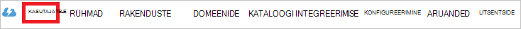

<properties
    pageTitle="Õpetus: Azure'i Active Directory integreerimine asetäitja | Microsoft Azure'i"
    description="Saate teada, kuidas konfigureerida ühekordse sisselogimise Azure Active Directory ja asendaja vahel."
    services="active-directory"
    documentationCenter=""
    authors="jeevansd"
    manager="femila"
    editor=""/>

<tags
    ms.service="active-directory"
    ms.workload="identity"
    ms.tgt_pltfrm="na"
    ms.devlang="na"
    ms.topic="article"
    ms.date="09/28/2016"
    ms.author="jeedes"/>

# Õpetus: Azure'i Active Directory integreerimine asetäitja

Selle õpetuse eesmärk näitavad, kuidas asetäitja integreerimine Azure Active Directory (Azure AD).

Asetäitja integreerimine Azure AD annab teile järgmised eelised:

- Saate määrata Azure AD, kellel on juurdepääs asetäitja
- Saate lubada automaatselt saada allkirjastatud-on asetäitja (ühekordse sisselogimise) Azure AD kontodega tema kasutajatele
- Saate hallata ühes keskses kohas – klassikaline Azure portaali konto

Kui soovite leida SaaS rakenduse integreerimine Azure AD kohta rohkem üksikasju, vaadake, [mis on rakenduse access ja ühekordse sisselogimise Azure Active Directory](active-directory-appssoaccess-whatis.md).

## Eeltingimused

Konfigureerimiseks integreerimine Azure AD asetäitja, peate järgmised üksused:

- Tellimuse Azure AD
- Mõne asetäitja ühekordse sisselogimise lubatud tellimuse

> [AZURE.NOTE] Selle õpetuse samme testimiseks me ei soovita tootmiskeskkonna abil.

Selle õpetuse samme testimiseks tuleks nende soovituste täitmisel:

- Ärge kasutage tootmiskeskkonnast, kui see on vajalik.
- Kui teil pole keskkonnas Azure AD prooviversiooni, saate on ühe kuu prooviversiooni [siin](https://azure.microsoft.com/pricing/free-trial/).

## Stsenaarium kirjeldus
Selle õpetuse eesmärk on teil testida testimiskeskkonnas Azure AD ühekordse sisselogimise lubamiseks.

Stsenaarium, mis on kirjeldatud selles õpetuses koosneb kaks peamist:

1. Lisamise asendaja Galerii
2. Konfigureerimine ja testimine Azure AD ühekordse sisselogimise

## Lisamise asendaja Galerii
Asetäitja integreerimine Azure AD konfigureerimiseks tuleb kõigepealt lisada asetäitja galeriist hallatavate SaaS rakenduste loendisse.

**Galeriist asetäitja lisamiseks tehke järgmist.**

1. **Azure'i klassikaline portaalis**, klõpsake vasakpoolsel navigeerimispaanil nuppu **Active Directory**. 

    ![Active Directory][1]

2. Valige loendist **Directory** kataloogi, mille jaoks soovite lubada kataloogi integreerimise.

3. Kuva rakendused directory vaate avamiseks klõpsake ülemises menüüs **rakendused** .
    
    ![Rakenduste][2]

4. Klõpsake lehe allosas **Lisa** .
    
    ![Rakenduste][3]

5. Klõpsake dialoogiboksis **soovitud teha,** klõpsake nuppu **Lisa rakendus galeriist**.

    ![Rakenduste][4]

6. Tippige otsinguväljale **asetäitja**.

    

7. Tulemuste paanil valige **asetäitja**ja klõpsake rakenduse lisamiseks **lõpuleviimine** .

    

##  Konfigureerimine ja testimine Azure AD ühekordse sisselogimise
Selles jaotises eesmärk näitab teile, kuidas konfigureerida ja testige Azure AD ühekordse sisselogimise asetäitja nimega "Britta Simon" testkasutaja põhjal.

Ühekordse sisselogimise töötada, peab Azure AD teada, mis on kasutajale Azure AD asetäitja töölauafunktsioonid kasutaja. Teisisõnu, link seose Azure AD kasutaja ja kasutajale seotud asetäitja tuleb luua.

Selle lingi seos on loodud määramine Azure AD **kasutajanimi** asetäitja väärtus **kasutaja nimi** väärtus.

Azure AD ühekordse sisselogimise koos asetäitja testimiseks ja konfigureerimiseks, peate täitma järgmised koosteüksuste:

1. **[Seadistamine Azure AD ühekordse sisselogimise](#configuring-azure-ad-single-single-sign-on)** -, et kasutajad saaksid seda funktsiooni kasutada.
2. **[Azure AD loomise katse kasutaja](#creating-an-azure-ad-test-user)** - Azure AD ühekordse sisselogimise Britta Siimoni testida.
3. **[Kasutaja loomise asendaja testimiseks](#creating-a-deputy-test-user)** – töölauafunktsioonid Britta Simon on lingitud Azure AD kujutis tema asetäitja.
4. **[Määramine Azure AD testida kasutaja](#assigning-the-azure-ad-test-user)** - Britta Simon kasutada Azure AD ühekordse sisselogimise lubamiseks.
5. **[Testimine ühekordse sisselogimise](#testing-single-sign-on)** - kontrollimaks, kas konfiguratsiooni töötab.

### Azure AD ühekordse sisselogimise konfigureerimine

Selles jaotises saate Azure AD ühekordse sisselogimise klassikaline portaalis lubamine ja konfigureerimine ühekordse sisselogimise asetäitja rakenduse.

**Konfigureerida Azure AD ühekordse sisselogimise asetäitja, tehke järgmist.**

1. Klassikaline portaalis lehel **asetäitja** rakenduse integreerimise nuppu **Konfigureeri ühekordse sisselogimise** **Konfigureerimine ühekordse sisselogimise** dialoogiboksi avamiseks.
     
    ![Ühekordse sisselogimise konfigureerimine][6] 

2. **Kuidas soovite kasutajad logida asetäitja** lehel Valige **Azure AD ühekordse sisselogimise**ja klõpsake nuppu **edasi**.
    
    

3. Lehel **Rakenduse sätete konfigureerimine** dialoogiboksi kui soovite konfigureerida rakendus **IDP algatatud režiimi**, tehke järgmist ja klõpsake nuppu **Järgmine**:

    

    lisamine. Tippige tekstiväljale **identifikaator** URL-i abil järgmist mustrit: `https://<your-subdomain>.<region>.deputy.com`.

    b. Tippige tekstiväljale **Vastus URL-i** URL-i abil järgmist mustrit: `https://<your-subdomain>.<region>.deputy.com/exec/devapp/samlacs`.

    c. Klõpsake nuppu **edasi**.

4. Kui soovite konfigureerida rakendus **SP algatatud režiimi** lehel **Rakenduse sätete konfigureerimine** dialoogiboksi, klõpsake **"Kuva täpsemad sätted (valikuline)"** ja sisestage **Logi sisse URL** ja klõpsake nuppu **edasi**.

    

    lisamine. Tippige tekstiväljale **Logi sisse URL-i** URL-i abil järgmist mustrit: `https://<your-subdomain>.<region>.deputy.com`.

    b. Klõpsake nuppu **edasi**.

    > [AZURE.NOTE] Asetäitja regiooni nime järelliide pole tähtaja või see peaks kasutama ühte järgmistest: au | na | EL | nimega | la | af | on | ent-au | ent-na | ent-EL | ent-nimega | Ent-la | Ent-af | Ent an

5. Lehel **Konfigureeri ühekordse sisselogimise veebisaidil asetäitja** järgmiste toimingute ja klõpsake nuppu **Järgmine**:

    

    lisamine. Klõpsake **allalaadimine serti**ja seejärel salvestage fail oma arvutis.

    
6. Liikuge järgmine URL: https://(your-subdomain).deputy.com/exec/config/system_config. Avage **Sätted** ja klõpsake nuppu **Redigeeri**.

    

7. Azure'i klassikaline portaalis, klõpsake selle konfigureerimine ühekordse sisselogimise asetäitja lehele, kopeerige SAML SSO URL. 

8. **Turbesätted** lehel teha all juhiseid.

    

    lisamine. Luba **Social Logi sisse**.

    b. Avage oma Base64 kodeeritud serdi Notepadis, kopeerige see sisu teie lõikelauale ja kleepige see **OpenSSL serdi** tekstiväli.

    c. Tippige väljale URL-i SAM SSO-d`https://<your subdomain>.deputy.com/exec/devapp/samlacs?dpLoginTo=<saml sso url>`
    
    d. Tekstiväljale URL-i SAM SSO asendamine `<your subdomain>` koos oma alamdomeen.

    e. Tekstiväljale URL-i SAM SSO asendamine `<saml sso url>` Azure klassikaline portaalist kopeerisite SAML SSO URL.

    f. Klõpsake nuppu **Salvesta sätted**.

9. Klassikaline portaalis valige kinnituse ühekordse sisselogimise konfigureerimine ja klõpsake siis nuppu **edasi**.
    
    ![Azure'i AD ühekordse sisselogimise][10]

10. **Ühekordse sisselogimise kinnitamise** lehel nuppu **valmis**.  
    
    ![Azure'i AD ühekordse sisselogimise][11]

### Azure'i AD testi kasutaja loomine
Selles jaotises eesmärk testi kasutaja nimega Britta Simon klassikaline portaali loomine.

![Azure'i AD kasutaja loomine][20]

**Azure AD testi kasutaja loomiseks tehke järgmist.**

1. **Azure'i klassikaline portaalis**, klõpsake vasakpoolsel navigeerimispaanil nuppu **Active Directory**.

    

2. Valige loendist **Directory** kataloogi, mille jaoks soovite lubada kataloogi integreerimise.

3. Menüü peal kasutajate loendi kuvamiseks klõpsake linki **Kasutajad**.
    
    

4. **Lisa kasutaja** dialoogiboksi avamiseks klõpsake tööriistariba allosas nuppu **Lisa kasutaja**.

    

5. Lehel **meile selle kasutaja kohta** dialoogiboksi, tehke järgmist.

    

    lisamine. Kasutaja tüüp, valige ettevõttes uue kasutaja.

    b. Tippige väljale Kasutajanimi **tekstivälja** **BrittaSimon**.

    c. Klõpsake nuppu **edasi**.

6.  **Kasutajaprofiili** dialoogiboksi lehe, tehke järgmist.
    
    

    lisamine. Tippige tekstiväljale **eesnimi** **Britta**.  

    b. Tekstiväljale **Perekonnanimi** tüüp, **Simon**.

    c. Tippige väljale **Kuvatav nimi** **Britta Simon**.

    d. Valige loendis **rolliga** **kasutaja**.

    e. Klõpsake nuppu **edasi**.

7. Klõpsake **saada ajutine parool** dialoogiboksis lehe **loomine**.
    
    

8. **Saada ajutine parool** dialoogiboksis lehel tehke järgmist.
    
    

    lisamine. Kirjutage üles väärtus **Uus parool**.

    b. Klõpsake nuppu **valmis**.   

### Asetäitja testkasutaja loomine

Selleks, et Azure AD kasutajate asetäitja sisse logida, nad peavad olema ettevalmistatud asetäitja. Puhul asendaja ettevalmistamise on käsitsi ülesanne.

####Kasutajakonto sätete, tehke järgmist.

1.  Logige oma saidile asetäitja ettevõtte administraatorina.

2.  Klõpsake ülemisel navigeerimispaanil nuppu **inimesed**.

    ![Inimesed] (./media/active-directory-saas-deputy-tutorial/tutorial_deputy_001.png "Inimesed")

3.  Klõpsake nuppu **Lisa inimesed** ja klõpsake nuppu **Lisa üks isik**.

    ![Inimeste lisamine] (./media/active-directory-saas-deputy-tutorial/tutorial_deputy_002.png "Inimeste lisamine")

4.  Järgmiste toimingute ja klõpsake nuppu **Salvesta ja kutsuda**.

    ![Uus kasutaja] (./media/active-directory-saas-deputy-tutorial/tutorial_deputy_003.png "Uus kasutaja")

    lisamine. Tippige väljale **nimi** **Britta** ja **Simon**.  

    b. Tippige tekstiväljale **e-posti** soovite ette valmistada Azure AD konto meiliaadress.

    c. Tippige tekstiväljale **töö** bussniess nimi.

    d. Klõpsake nuppu **Salvesta ja kutsuda** .

    >[AZURE.NOTE]AAD konto omanik saadetakse teile e-posti ja järgige oma konto kinnitada, kuni see muutub aktiivne link. Saate kasutada mis tahes muud asetäitja kasutaja konto loomise tööriistade või API-de osutavad asetäitja kasutajakontode AAD.

### Azure AD testkasutaja määramine

Selles jaotises eesmärk Britta Simon kasutada Azure ühekordse sisselogimise asetäitja tema juurdepääsuõiguse andmise lubamine.
    
![Kasutaja määramine][200]

**Asetäitja Britta Simon määramiseks tehke järgmist.**

1. Klassikaline portaalis avamiseks Kuva rakendused kataloogi vaates, klõpsake **rakenduste** ülemises menüüs.
    
    ![Kasutaja määramine][201]

2. Valige rakenduste loendis **asetäitja**.
    
    

3. Klõpsake menüü peal, **Kasutajad**.
    
    ![Kasutaja määramine][203]

4. Valige loendis kasutajate **Britta Simon**.

5. Klõpsake tööriistaribal allosas **määramine**.
    
    ![Kasutaja määramine][205]

### Ühekordse sisselogimise testimine

Selles jaotises eesmärk testida Azure AD ühekordse sisselogimise konfiguratsiooni Accessi juhtpaneeli kaudu.
 
Kui olete klõpsanud asetäitja paanil juurdepääsu, saate tuleks saada automaatselt allkirjastatud-on asetäitja rakenduse.

## Lisaressursid

* [Õpetused kohta, kuidas integreerimine Azure Active Directory SaaS rakenduste loend](active-directory-saas-tutorial-list.md)
* [Mis on rakenduse access ja ühekordse sisselogimise Azure Active Directory?](active-directory-appssoaccess-whatis.md)

<!--Image references-->

[1]: ./media/active-directory-saas-deputy-tutorial/tutorial_general_01.png
[2]: ./media/active-directory-saas-deputy-tutorial/tutorial_general_02.png
[3]: ./media/active-directory-saas-deputy-tutorial/tutorial_general_03.png
[4]: ./media/active-directory-saas-deputy-tutorial/tutorial_general_04.png

[6]: ./media/active-directory-saas-deputy-tutorial/tutorial_general_05.png
[10]: ./media/active-directory-saas-deputy-tutorial/tutorial_general_06.png
[11]: ./media/active-directory-saas-deputy-tutorial/tutorial_general_07.png
[20]: ./media/active-directory-saas-deputy-tutorial/tutorial_general_100.png

[200]: ./media/active-directory-saas-deputy-tutorial/tutorial_general_200.png
[201]: ./media/active-directory-saas-deputy-tutorial/tutorial_general_201.png
[203]: ./media/active-directory-saas-deputy-tutorial/tutorial_general_203.png
[204]: ./media/active-directory-saas-deputy-tutorial/tutorial_general_204.png
[205]: ./media/active-directory-saas-deputy-tutorial/tutorial_general_205.png
