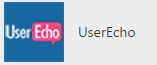
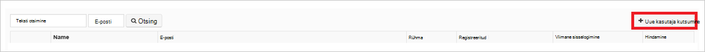

<properties
    pageTitle="Õpetus: Azure'i Active Directory integreerimine UserEcho | Microsoft Azure'i"
    description="Saate teada, kuidas konfigureerida ühekordse sisselogimise Azure Active Directory ja UserEcho vahel."
    services="active-directory"
    documentationCenter=""
    authors="jeevansd"
    manager="femila"
    editor=""/>

<tags
    ms.service="active-directory"
    ms.workload="identity"
    ms.tgt_pltfrm="na"
    ms.devlang="na"
    ms.topic="article"
    ms.date="10/20/2016"
    ms.author="jeedes"/>

# Õpetus: Azure'i Active Directory integreerimine UserEcho

Selle õpetuse eesmärk näitavad, kuidas UserEcho integreerimine Azure Active Directory (Azure AD).  
UserEcho integreerimine Azure AD annab teile järgmised eelised: 

- Saate määrata Azure AD, kellel on juurdepääs UserEcho 
- Saate lubada automaatselt saada allkirjastatud-on UserEcho (ühekordse sisselogimise) Azure AD kontodega tema kasutajatele
- Saate hallata ühes keskses kohas – klassikaline Azure portaali konto

Kui soovite leida SaaS rakenduse integreerimine Azure AD kohta rohkem üksikasju, vaadake, [mis on rakenduse access ja ühekordse sisselogimise Azure Active Directory](active-directory-appssoaccess-whatis.md).

## Eeltingimused 

Konfigureerimiseks integreerimine Azure AD UserEcho, peate järgmised üksused:

- Tellimuse Azure AD
- Mõne UserEcho ühekordse sisselogimise lubatud tellimuse

> [AZURE.NOTE] Selle õpetuse samme testimiseks me ei soovita tootmiskeskkonna abil.

Selle õpetuse samme testimiseks tuleks nende soovituste täitmisel:

- Ärge kasutage tootmiskeskkonnast, kui see on vajalik.
- Kui teil pole keskkonnas Azure AD prooviversiooni, saate on ühe kuu prooviversiooni [siin](https://azure.microsoft.com/pricing/free-trial/). 

 
## Stsenaarium kirjeldus
Selle õpetuse eesmärk on teil testida testimiskeskkonnas Azure AD ühekordse sisselogimise lubamiseks.  
Stsenaarium, mis on kirjeldatud selles õpetuses koosneb kaks peamist:

1. UserEcho lisamine galeriist 
2. Konfigureerimine ja testimine Azure AD ühekordse sisselogimise

## UserEcho lisamine galeriist
UserEcho integreerimine Azure AD konfigureerimiseks tuleb kõigepealt lisada UserEcho galeriist hallatavate SaaS rakenduste loendisse.

**Galeriist UserEcho lisamiseks tehke järgmist.**

1. **Azure'i klassikaline portaalis**, klõpsake vasakpoolsel navigeerimispaanil nuppu **Active Directory**. 

    ![Active Directory][1]

2. Valige loendist **Directory** kataloogi, mille jaoks soovite lubada kataloogi integreerimise.

3. Kuva rakendused directory vaate avamiseks klõpsake ülemises menüüs **rakendused** .

    ![Rakenduste][2]

4. Klõpsake lehe allosas **Lisa** .

    ![Rakenduste][3]

5. Klõpsake dialoogiboksis **soovitud teha,** klõpsake nuppu **Lisa rakendus galeriist**.

    ![Rakenduste][4]

6. Tippige otsinguväljale **UserEcho**.

    

7. Tulemuste paanil valige **UserEcho**, ja klõpsake rakenduse lisamiseks **lõpuleviimine** .

    

##  Konfigureerimine ja testimine Azure AD ühekordse sisselogimise
Selles jaotises eesmärk näitab teile, kuidas konfigureerida ja testige Azure AD ühekordse sisselogimise UserEcho nimega "Britta Simon" testkasutaja põhjal.

Ühekordse sisselogimise töötada, peab Azure AD teada, mis on kasutajale Azure AD UserEcho töölauafunktsioonid kasutaja. Teisisõnu, link seose Azure AD kasutaja ja kasutajale seotud UserEcho tuleb luua.  
Selle lingi seos on loodud määramine Azure AD **kasutajanimi** UserEcho väärtus **kasutaja nimi** väärtus.
 
Azure AD ühekordse sisselogimise koos UserEcho testimiseks ja konfigureerimiseks, peate täitma järgmised koosteüksuste:

1. **[Seadistamine Azure AD ühekordse sisselogimise](#configuring-azure-ad-single-single-sign-on)** -, et kasutajad saaksid seda funktsiooni kasutada.
2. **[Azure AD loomise katse kasutaja](#creating-an-azure-ad-test-user)** - Azure AD ühekordse sisselogimise Britta Siimoni testida.
4. **[Kasutaja loomise mõne UserEcho testida](#creating-a-userecho-test-user)** - olema töölauafunktsioonid Britta Simon UserEcho Azure AD kujutis tema lingitud.
5. **[Määramine Azure AD testida kasutaja](#assigning-the-azure-ad-test-user)** - Britta Simon kasutada Azure AD ühekordse sisselogimise lubamiseks.
5. **[Testimine ühekordse sisselogimise](#testing-single-sign-on)** - kontrollimaks, kas konfiguratsiooni töötab.

### Azure'i AD ühekordse sisselogimise konfigureerimine

Selle jaotise eesmärk on Azure AD ühekordse sisselogimise Azure klassikaline portaalis lubamiseks ja konfigureerimiseks ühekordse sisselogimise UserEcho rakenduse. 

**Konfigureerida Azure AD ühekordse sisselogimise UserEcho, tehke järgmist.**

1. Azure'i klassikaline portaalis lehel **UserEcho** rakenduse integreerimise nuppu **Konfigureeri ühekordse sisselogimise** **Konfigureerimine ühekordse sisselogimise** dialoogiboksi avamiseks.

    ![Ühekordse sisselogimise konfigureerimine][6] 

2. **Kuidas soovite kasutajad logida UserEcho** lehel Valige **Azure AD ühekordse sisselogimise**ja klõpsake nuppu **edasi**.

     

3. **Rakenduse sätete konfigureerimine** dialoogiboksi lehel tehke järgmist.

     

    lisamine. **Logige sisse URL-i** tekstivälja, tippige URL, mida kasutatakse teie kasutajad logida UserEcho rakenduse (nt: *https://fabrikam.UserEcho.com/*).

    b. Klõpsake nuppu **edasi**.
 
 
4. Lehel **Konfigureeri ühekordse sisselogimise UserEcho veebisaidil** , tehke järgmist:

     

    lisamine. Klõpsake **allalaadimine serti**ja seejärel salvestage fail oma arvutis.

    b. Klõpsake nuppu **edasi**.

1. Mõnes muus brauseriaknas, logige sisse saidile UserEcho ettevõtte administraatorina.

1. Ülaosas tööriistaribal nuppu oma kasutajanimi, et laiendada menüü ja klõpsake **häälestus**.

     

1. Klõpsake **integratsioon**.

     

1. Klõpsake **veebisaidi**ja klõpsake **ühekordse sisselogimise (SAML2)**.

     

1. Klõpsake lehel **ühekordse sisselogimise (SAML)** tehke järgmist.

     

    lisamine. Kui **SAML lubatud**, valige **Jah**. 

    b. Azure'i klassikaline portaalis, klõpsake selle konfigureerimine ühekordse sisselogimise UserEcho dialoogiboksi lehele, kopeerige **Ühekordse sisselogimise teenuse URL-i** väärtus ja seejärel kleepige tekstiväljale **SAML SSO URL-i** .

    c. Azure'i klassikaline portaalis, klõpsake selle konfigureerimine ühekordse sisselogimise UserEcho dialoogiboksi lehele, kopeerige **Remote välju URL-i** väärtus ja seejärel kleepige see **Remote logoout URL-i** tekstiväli. 

    d. Avage oma allalaaditud serdi Notepadis, kopeerige sisu ja seejärel kleepige **x.509 vastav sert** tekstiväli.    

    e. Klõpsake nuppu **Salvesta**.

6. Azure'i klassikaline portaalis valige ühekordse sisselogimise konfigureerimine kinnituse, ja seejärel klõpsake nuppu **edasi**. 

    ![Azure'i AD ühekordse sisselogimise][10]

7. **Ühekordse sisselogimise kinnitamise** lehel nuppu **valmis**.  

    ![Azure'i AD ühekordse sisselogimise][11]

### Azure'i AD testi kasutaja loomine
Selle jaotise eesmärk on Azure klassikaline portaalis nimega Britta Simon test kasutaja loomiseks.

![Azure'i AD kasutaja loomine][20]

**Azure AD testi kasutaja loomiseks tehke järgmist.**

1. **Azure'i klassikaline portaalis**, klõpsake vasakpoolsel navigeerimispaanil nuppu **Active Directory**.

      

2. Valige loendist **Directory** kataloogi, mille jaoks soovite lubada kataloogi integreerimise.

3. Menüü peal kasutajate loendi kuvamiseks klõpsake linki **Kasutajad**.

     
 
4. **Lisa kasutaja** dialoogiboksi avamiseks klõpsake tööriistariba allosas nuppu **Lisa kasutaja**. 

     

5. Lehel **meile selle kasutaja kohta** dialoogiboksi, tehke järgmist. 

      

    lisamine. Kasutaja tüüp, valige ettevõttes uue kasutaja.

    b. Tippige väljale Kasutajanimi **tekstivälja** **BrittaSimon**.

    c. Klõpsake nuppu **edasi**.

6.  **Kasutajaprofiili** dialoogiboksi lehe, tehke järgmist. 

     
 
    lisamine. Tippige tekstiväljale **eesnimi** **Britta**.  

    b. Tekstiväljale **Perekonnanimi** tüüp, **Simon**.

    c. Tippige väljale **Kuvatav nimi** **Britta Simon**.

    d. Valige loendis **rolliga** **kasutaja**.
    e. Klõpsake nuppu **edasi**.

7. Klõpsake **saada ajutine parool** dialoogiboksis lehe **loomine**.

     
 
8. **Saada ajutine parool** dialoogiboksis lehel tehke järgmist.

     
  
    lisamine. Kirjutage üles väärtus **Uus parool**.

    b. Klõpsake nuppu **valmis**.   

  
 
### UserEcho testkasutaja loomine

Selle jaotise eesmärk on nimega Britta Simon UserEcho kasutaja loomiseks.

**Nimega Britta Simon UserEcho kasutaja loomiseks tehke järgmist.**

1. Sisselogimise saidile UserEcho ettevõtte administraatorina.

1. Ülaosas tööriistaribal nuppu oma kasutajanimi, et laiendada menüü ja klõpsake **häälestus**.

     

1. Klõpsake linki **Kasutajad**, **kasutajate** jaotise laiendamiseks.

     

1. Klõpsake nuppu **Kasutajad**.

     

1. Klõpsake nuppu **Kutsu uus kasutaja**.

    

1. Klõpsake dialoogiboksis **Uus kasutaja kutsuda** tehke järgmist.

     

    lisamine. Tippige väljale **nimi** **Britta Simon**.

    b. Tippige tekstiväljale **e-posti** Azure klassikaline portaalis Britta isiku meiliaadress.

    c. Klõpsake nuppu **Kutsu**.

Kutse saadetakse Britta, mis võimaldab tema UserEcho kasutamise alustamine. 

### Azure AD testkasutaja määramine

Selles jaotises eesmärk Britta Simon kasutada Azure ühekordse sisselogimise UserEcho tema juurdepääsuõiguse andmise lubamine.

![Kasutaja määramine][200] 

**UserEcho Britta Simon määramiseks tehke järgmist.**

1. Azure'i klassikaline portaalis avamiseks Kuva rakendused kataloogi vaates, klõpsake **rakenduste** ülemises menüüs.

    ![Kasutaja määramine][201] 

2. Valige rakenduste loendis **UserEcho**.

     

1. Klõpsake menüü peal, **Kasutajad**.

    ![Kasutaja määramine][203] 

1. Valige loendis kasutajate **Britta Simon**.

2. Klõpsake tööriistaribal allosas **määramine**.

    ![Kasutaja määramine][205]

### Ühekordse sisselogimise testimine

Selles jaotises eesmärk testida Azure AD ühekordse sisselogimise konfiguratsiooni Accessi juhtpaneeli kaudu.  
Kui olete klõpsanud UserEcho paanil juurdepääsu, saate tuleks saada automaatselt allkirjastatud-on UserEcho rakenduse.

## Lisaressursid

* [Õpetused kohta, kuidas integreerimine Azure Active Directory SaaS rakenduste loend](active-directory-saas-tutorial-list.md)
* [Mis on rakenduse access ja ühekordse sisselogimise Azure Active Directory?](active-directory-appssoaccess-whatis.md)

<!--Image references-->

[1]: ./media/active-directory-saas-userecho-tutorial/tutorial_general_01.png
[2]: ./media/active-directory-saas-userecho-tutorial/tutorial_general_02.png
[3]: ./media/active-directory-saas-userecho-tutorial/tutorial_general_03.png
[4]: ./media/active-directory-saas-userecho-tutorial/tutorial_general_04.png

[6]: ./media/active-directory-saas-userecho-tutorial/tutorial_general_05.png
[10]: ./media/active-directory-saas-userecho-tutorial/tutorial_general_06.png
[11]: ./media/active-directory-saas-userecho-tutorial/tutorial_general_07.png
[20]: ./media/active-directory-saas-userecho-tutorial/tutorial_general_100.png

[200]: ./media/active-directory-saas-userecho-tutorial/tutorial_general_200.png
[201]: ./media/active-directory-saas-userecho-tutorial/tutorial_general_201.png
[203]: ./media/active-directory-saas-userecho-tutorial/tutorial_general_203.png
[204]: ./media/active-directory-saas-userecho-tutorial/tutorial_general_204.png
[205]: ./media/active-directory-saas-userecho-tutorial/tutorial_general_205.png

