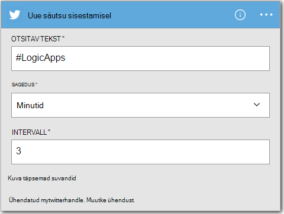
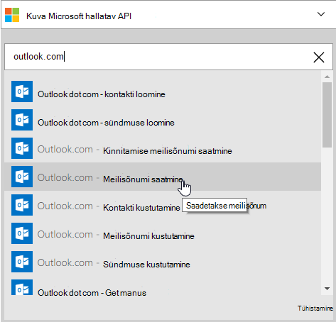
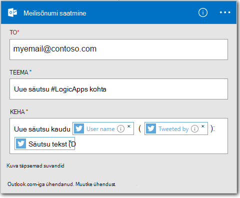

<properties
    pageTitle="Loogika rakenduse loomine | Microsoft Azure'i"
    description="Saate teada, kuidas luua ühenduse SaaS teenuste loogika rakenduse"
    authors="jeffhollan"
    manager="dwrede"
    editor=""
    services="logic-apps"
    documentationCenter=""/>

<tags
    ms.service="logic-apps"
    ms.workload="na"
    ms.tgt_pltfrm="na"
    ms.devlang="na"
    ms.topic="get-started-article"
    ms.date="10/18/2016"
    ms.author="jehollan"/>

# Uue loogika rakenduse SaaS teenuste ühenduse loomine

See teema näitab, kuidas, vaid paari minutiga saate alustamisel [Azure'i loogika](app-service-logic-what-are-logic-apps.md)rakendustega. Juhendame lihtsa töövoo, mis võimaldab saata meili huvitavamaks tweets.

Selle stsenaariumi kasutamiseks on vaja:

- Azure'i tellimuse
- Twitteri konto
- Outlook.com-i või majutatud Office 365 postkasti

## E-posti saate tweets loogika uue rakenduse loomine

1. [Azure portaali armatuurlaud](https://portal.azure.com), klõpsake nuppu **Uus**. 
2. Otsinguriba, otsida 'loogika rakenduse' ja seejärel valige **Loogika rakendus**. Saate valige **Uus** **Web + Mobile**, ja valige **Loogika rakendus**. 
3. Sisestage oma loogika rakenduse nimi, valige asukoht, ressursirühm ja valige **Loo**.  Kui valite **Kinnita armatuurlaua** loogika rakenduse avab automaatselt kord juurutatud.  
4. Pärast esimest korda loogika rakenduse avamisel saate valida malli põhjal alustada.  Nüüd klõpsake **Tühja loogika rakenduse** ehitada nullist. 
1. Peate looma esimese üksuse on käivitada.  See on hakkavad teie loogika rakenduse soovitud sündmus.  Otsige **Twitteri** päästik otsinguväljale ja valige see.
7. Nüüd kuvatakse tippige otsitav termin käivitamiseks klõpsake.  **Sagedus** ja **intervalli** määrab, kui sageli loogika rakenduse kontrollib uue tweets (ja ajastada kõik tweets ajal mis ajavahemiku tagasi).
    

5. Klõpsake nuppu **uus samm** ja seejärel valige **Lisa toimingu** või **Lisa tingimus**
6. Kui valite **toimingu lisa**, saate otsida [saadaval konnektorid](../connectors/apis-list.md) toimingu valimiseks. Näiteks võite valida **Outlook.com - saatmine e-posti** saatmine e-posti aadressi Outlook.com-i kaudu:  
    

7. Nüüd on teil täitmiseks e-posti soovitud parameetrid:  

8. Lõpetuseks, saate valida **salvestamine** teha rakenduse loogika live.

## Pärast loomist loogika rakenduse haldamine

Nüüd on teie loogika rakenduse tööks. See kontrollib perioodiliselt tweets koos sisestatud. Kui see leiab säutsu sobitamine, see saadab teile meilisõnumi. Lõpetuseks, saate teada, kuidas keelata kogu rakenduse või näha, kuidas see teeb.

1. [Azure'i portaal](https://portal.azure.com)

1. Klõpsake ekraani vasakus servas **Sirvi** ja valige **Loogika rakendused**.

2. Klõpsake uue loogika rakendust vastloodud praeguse oleku ja üldist teavet kuvamiseks.

3. Uus rakendus loogika redigeerimiseks klõpsake nuppu **Redigeeri**.

5. Rakenduse väljalülitamiseks klõpsake **keelamine** käsuriba.

1. Jälgida oma loogika rakenduse käivitamisel Käivita ja päästik ajaloo kuvamine  Võite klõpsata **värskendada** , kui soovite vaadata värskeimaid andmeid.

Vähem kui 5 minuti teil oli võimalus luua lihtsa loogika rakendus, mis töötab pilveteenuses. Loogika rakenduste funktsioonide kasutamise kohta leiate lisateavet teemast [kasutada loogika rakenduse funktsioone]. Loogika rakenduse määratlused ise kohta leiate teemast [Autor loogika rakenduse määratlusi](app-service-logic-author-definitions.md).

<!-- Shared links -->
[Azure portal]: https://portal.azure.com
[Loogika appi funktsioonide kasutamine]: app-service-logic-create-a-logic-app.md
