<properties
    pageTitle="Luua, konfigureerimine ja PHP web appi Azure juurutamine"
    description="Õppeteema, mis näitab, kuidas teha PHP (Laravel) web appi teenuses Azure rakenduse käivitada. Siit saate teada, kuidas konfigureerida rakenduse Azure'i teenus, valite PHP raames nõuetele vastavuse."
    services="app-service\web"
    documentationCenter="php"
    authors="cephalin"
    manager="wpickett"
    editor=""
    tags="mysql"/>

<tags
    ms.service="app-service-web"
    ms.workload="web"
    ms.tgt_pltfrm="na"
    ms.devlang="PHP"
    ms.topic="article"
    ms.date="06/03/2016" 
    ms.author="cephalin"/>

# Luua, konfigureerimine ja PHP web appi Azure juurutamine

[AZURE.INCLUDE [tabs](../../includes/app-service-web-get-started-nav-tabs.md)]

Selles õpetuses näete, kuidas luua, konfigureerimine ja juurutada PHP web appi Azure ja oma PHP veebirakenduse nõuetele vastavuse Azure'i rakendust Service konfigureerimine. Selle õppeteema lõpus on teil töö [Laravel](https://www.laravel.com/) web appi reaalajas teenuses [Azure rakendus](../app-service/app-service-value-prop-what-is.md)töötab.

PHP arendaja, saate tuua oma lemmik PHP framework Azure. Selle õpetuse kasutab Laravel lihtsalt konkreetse rakenduse näide. Saate: 

- Kasutades giti juurutamine
- Seadmine PHP versioon
- Alusta faili, mis ei ole juurkaust rakenduse kasutamine
- Accessi keskkonna kohased muutujad
- Värskendada oma rakenduse Azure

Saate rakendada õpitu meeles siin muud PHP veebirakenduste juurutamist Azure.

>[AZURE.INCLUDE [app-service-linux](../../includes/app-service-linux.md)] 

## Eeltingimused

- Installige [PHP 5.6.x](http://php.net/downloads.php) (PHP 7 tugi on beeta)
- Installige [helilooja](https://getcomposer.org/download/)
- Installige [Azure'i CLI](../xplat-cli-install.md)
- Installige [Git](http://www.git-scm.com/downloads)
- Microsoft Azure'i konto. Kui teil pole kontot, saate [tasuta prooviversiooni kasutajaks](/pricing/free-trial/?WT.mc_id=A261C142F) või [aktiveerida oma Visual Studio abonendi eelised](/pricing/member-offers/msdn-benefits-details/?WT.mc_id=A261C142F).

>[AZURE.NOTE] Teemast veebirakenduse tegelikkuses. [Proovige rakenduse teenuse](http://go.microsoft.com/fwlink/?LinkId=523751) kohe ja lühiajaline starter rakenduse loomine – pole vaja krediitkaarti, kohustusi.

## Teie arvutisse arendaja PHP (Laravel) rakenduse loomine

1. Avage uus Windowsi Käsuviip PowerShelli aknas Linuxi shelli või OS X terminal. Käivitage järgmine käsk ning veenduge, et nõutavad tööriistad on õigesti teie arvutisse installitud. 

        php --version
        composer --version
        azure --version
        git --version

    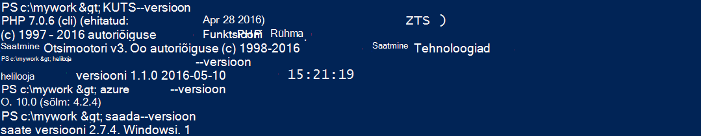

    Kui teil pole installitud tööriistu, lugege teemat [eeltingimuste](#Prerequisites) linke.
    
2. Installi Laravel, näiteks nii:

        composer global require "laravel/installer

3. `CD`töötamine kataloogi ja luua uue Laravel rakenduse näiteks nii:

        cd <working_directory>
        laravel new <app_name>

4. `CD`sisse äsja loodud `<app_name>` directory ja testige rakendust, näiteks nii:

        cd <app_name>
        php artisan serve
        
    Mida peaks oskama nüüd http://localhost:8000 brauseris liikuda ja vaadata Laravel käivitusekraan.
    
    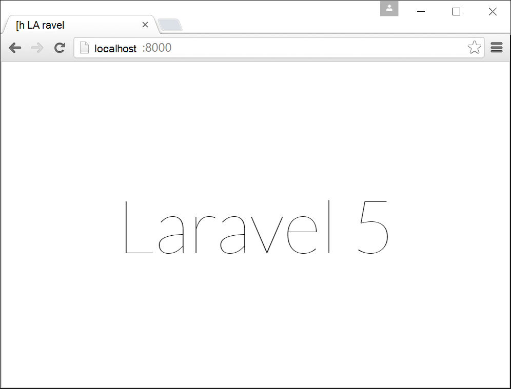
    
Nii palju, vaid tavaline Laravel töövoog ja teil ei ole siin <a href="https://laravel.com/docs/5.2" rel="nofollow">Laravel</a>õppida. Vaatame nii liikuda.

## Azure'i web rakenduse loomine ja häälestamine Git juurutamine

>[AZURE.NOTE] "Oota! Mida teha, kui tahan FTP juurutada?" Seal on [FTP õpetuse](web-sites-php-mysql-deploy-use-ftp.md) teie vajadustele. 

Azure'i CLI, kus saate luua teenuses Azure rakenduse web app ja häälestama Git juurutus, nii et käsk üks rida. Vaatame seda teha.

1. ASM režiimi muutmine ja Azure sisse logida.

        azure config mode asm
        azure login
    
    Järgige abi sõnumi login jätkata.
    
    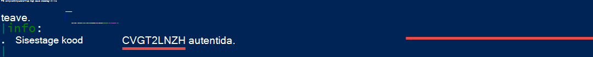

4. Käivitage käsk Git juurutamise Azure veebirakenduse loomine. Kui küsitakse, määrake soovitud piirkond arv.

        azure site create --git <app_name>
    
    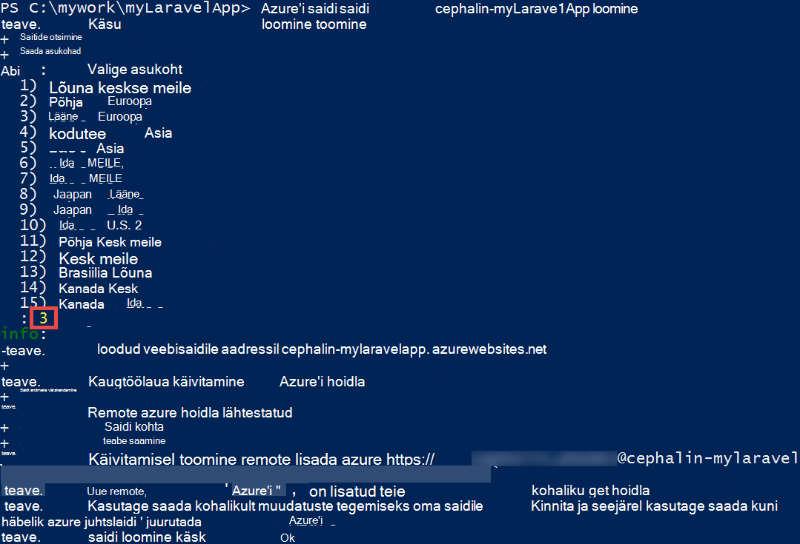
    
    >[AZURE.NOTE] Kui juurutamise identimisteabe olete häälestanud kunagi Azure tellimuse jaoks, palutakse teil nende loomiseks. Neid mandaate ei Azure'i konto identimisteave, kasutatakse rakendust Service ainult Git juurutuste ja FTP sisselogimise jaoks. 
    
    See käsk loob uue Git hoidla praeguse kataloogi (koos `git init`) ja ühendub hoidla Azure nimega Git remote (koos `git remote add`).

<a name="configure"/>
## Azure'i web appi konfigureerimine

Azure'i tööle Laravel rakenduse peate tähelepanu pöörama mitmest tegurist. See samasugune saab teha oma PHP Framework valik.

- Konfigureerimine PHP 5.5.9 või uuem. Nõuded serverile kogu loendi leiate [Uusima Laravel 5.2 nõuded serverile](https://laravel.com/docs/5.2#server-requirements) . Ülejäänud loend on juba lubatud Azure PHP installide laiendid. 
- Määrake keskkonna muutujate rakenduse vajab. Laravel kasutab funktsiooni `.env` faili lihtne sätte keskkonna muutujate. Kuna see ei peaks olema kinnitatud andmeallika juhtelementi (vt [Laravel keskkonna konfiguratsioon](https://laravel.com/docs/5.2/configuration#environment-configuration)seate oma Azure veebirakenduse sätete rakenduse asemel.
- Veenduge, et käsk Laravel rakenduse kirje, `public/index.php`, laaditakse esmalt. Vt [Laravel elutsükli ülevaade](https://laravel.com/docs/5.2/lifecycle#lifecycle-overview). Teisisõnu, peate määrama web appi juurkausta URL-i osutamiseks on `public` kataloogi.
- Luba helilooja laiend Azure, kuna teil on composer.json. Nii saate lasta muretsema saamiseks oma nõutav paketid koos juurutamisel helilooja `git push`. See on mugavuse küsimus. Kui te ei luba helilooja automaatika, vaid peate eemaldama `/vendor` kaudu soovitud `.gitignore` faili nii, et Git sisaldab ("un-ignoreerib") kõik selle `vendor` directory toime kui juurutamine kood.

Konfigureerige järgmised toimingud järjekorras.

4. Määrake oma Laravel rakenduse jaoks on vaja PHP versiooni.

        azure site set --php-version 5.6

    Olete valmis seadmine PHP versiooni! 
    
4. Loo uus `APP_KEY` oma Azure web app ja määrake selle rakenduse sätteks Azure veebirakenduse jaoks.

        php artisan key:generate --show
        azure site appsetting add APP_KEY="<output_of_php_artisan_key:generate_--show>"

4. Samuti lülitage Laravel silumine selleks, et ennetada igal Mõistatusliku `Whoops, looks like something went wrong.` lehe.

        azure site appsetting add APP_DEBUG=true

    Sätte keskkonna muutujate olete valmis!
    
    >[AZURE.NOTE] Oodake, vaatame natuke aeglane ja selgitada, mida tähendab Laravel ja Azure tähendab siin. Laravel kasutab funktsiooni `.env` faili juurkaust esitama keskkonna muutujad rakendus, kust leiate joone `APP_DEBUG=true` (ja ka `APP_KEY=...`). Muutuja on kättesaadav `config/app.php` kood     `'debug' => env('APP_DEBUG', false),`. [ENV()](https://laravel.com/docs/5.2/helpers#method-env) on Laravel helper meetod, mis kasutab PHP [getenv()](http://php.net/manual/en/function.getenv.php) all hõlmab.
    >
    >Siiski `.env` ignoreeritakse Git, kuna seda nimetatakse poolt soovitud `.gitignore` faili juurkaustas. Lihtsalt öeldes `.env`  
 teie kohaliku Git hoidla on lükata Azure ülejäänud failid. Muidugi, saate eemaldada ainult et joon `.gitignore`, kuid me olete juba loonud, et selle faili toime andmeallika juhtelementi ei ole soovitatav. Siiski vajate siiski võimalus määrata nende keskkonna muutujate Azure. 
    >
    >Hea Uudised on, et rakenduse sätete teenuses Azure rakendus toetab [getenv()](http://php.net/manual/en/function.getenv.php)  
 php. Nii saate kasutada FTP või muul viisil käsitsi üleslaadimiseks on `.env` faili sisse Azure, saate lihtsalt määrata soovite muutujate Azure rakenduse sätete ilma mõne `.env` Azure, nagu te just ei. Lisaks, kui muutuja on nii on `.env` fail ja Azure rakenduse sätetes säte Azure rakenduse võitis.     

4. Viimase kahe toimingu (virtuaalne kataloog määramise ja helilooja lubamine) on vaja [Azure portaali](https://portal.azure.com), seega logige sisse [portaali](https://portal.azure.com) Azure kontos.

4. Alates vasakpoolses menüüs nuppu **Rakenduse teenuste** > **&lt;app_name >** > **Tööriistad**.

    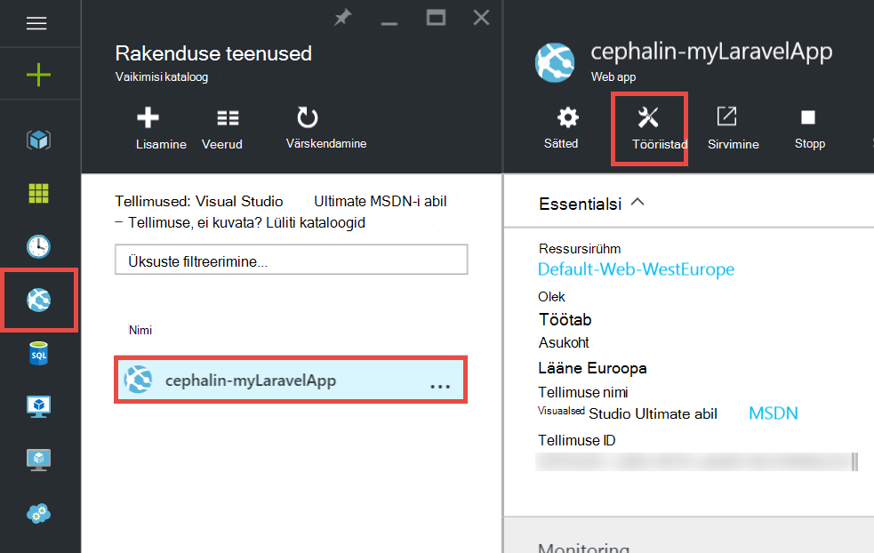
    
    >[AZURE.TIP] Kui klõpsate nuppu **sätted** asemel **Tööriistad**, saate küll **Rakenduse sätete** juurde pääseda 
 teravik, mis võimaldab teil määrata PHP versioonide rakenduse sätted ja virtuaalkaustad nagu lihtsalt ei. 
    
4. Klõpsake **laiendid** > **Lisa** laiendit lisada.

4. Valige **helilooja** **Valige laiend** [blade](../azure-portal-overview.md) (*blade*: portaal, mis avab horisontaalselt).

4. **Aktsepteeri juriidilistele termineid** tera, klõpsake nuppu **OK** . 

5. **Lisa laiend** tera, klõpsake nuppu **OK** .

    Kui on tehtud Azure'i lisamise laiendamine, peaksite nägema sõbralik hüpikaknas kuvatakse nurgas, samuti  **helilooja** loetletud **laiendid** tera.

    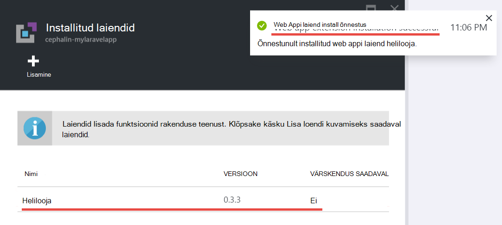

    Olete valmis, mis võimaldab helilooja!
    
4. Tagasi oma veebirakenduse tera, klõpsake nuppu **sätted** > **Rakenduse sätted**.

    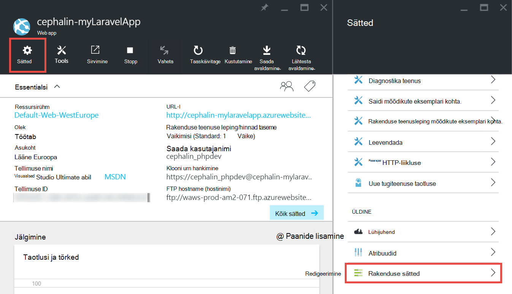

    **Rakenduse sätted** tera, arvestage PHP versiooni, saate määrata varasemas versioonis.

    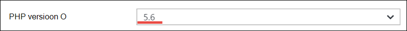

    ja rakenduse sätete lisamist.
    
    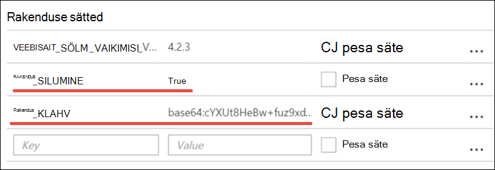

4. Liikuge kerides tera ja muutke virtuaalne juurkaust osutamiseks **site\wwwroot\public** asemel **site\wwwroot**.

    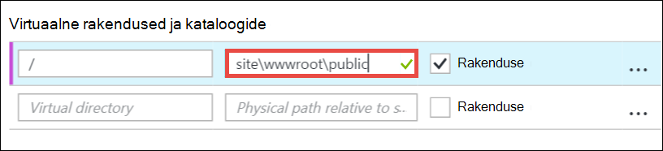

4. Klõpsake nuppu **Salvesta** tera ülaosas.

    Olete valmis seadmine virtuaalne kataloog! 

## Juurutada oma veebirakenduse Git (ja keskkonna muutujate seadmine)

Olete valmis kasutama oma kood kohe. Saate teha nii tagasi oma Käsuviip või terminalis.

4. Kõigi muudatuste kinnitamiseks ja Juurutage oma koodi Azure web appi Git hoidlas, mis tahes samamoodi, nagu:

        git add .
        git commit -m "Hurray! My first commit for my Azure app!"
        git push azure master 

    Kui `git push`, palutakse teil Git juurutamise parooli sisestama. Kui teil palutakse luua juurutamise mandaadi `azure site create` varasemas versioonis, tippige parool, mida kasutasite.
    
5. Vaatame seda töötavad brauseris selle käsu abil:

        azure site browse

    Brauseri peaks kuva Laravel käivitusekraan.
    
    
    
    Palju õnne, nüüd kasutate Laravel web appi Azure.
             
## Levinud tõrgete tõrkeotsing

Järgnevalt mõned tõrked võivad tekkida, kui pärast selle õpetuse.

- [Azure'i CLI näitab "" site"pole azure käsu käivitava"](#clierror)
- [Veebirakenduse tõrketeadet HTTP 403](#http403)
- [Web app kuvatakse "Oih, paistab, et midagi läks valesti"](#whoops)
- [Web app kuvatakse "Pole toetatud krüptija leitud."](#encryptor)

### Azure'i CLI näitab "'saidi' ei ole azure käsu käivitava"

Kui töötab `azure site *` käsurea terminalis, kuvatakse tõrge`error:   'site' is not an azure command. See 'azure help'.` 

See on tavaliselt tulemus vahetamisest "ARM" (Azure'i ressursihaldur) režiim. Probleemi lahendamiseks liikumine tagasi "ASM" (Azure'i teenuste haldamine) režiimis üheks käivitades `azure config mode asm`.

### Veebirakenduse tõrketeadet HTTP 403

Olete juurutanud oma veebirakenduse Azure edukalt, kuid sirvides oma Azure web appi, saate mõne `HTTP 403` või`You do not have permission to view this directory or page.`

See on kõige tõenäolisemad, sest web app ei leia sisenemiskoha Laravel rakendus. Veenduge, et olete muutnud virtuaalse juurkaust osutamiseks `site\wwwroot\public`, kus Laravel's `index.php` (vt [Azure web appi konfigureerimine](#configure)).

### Web app kuvatakse "Oih, paistab, et midagi läks valesti"

Olete juurutanud oma veebirakenduse Azure edukalt, kuid sirvides oma Azure web appi, saate peidetud sõnum`Whoops, looks like something went wrong.`

Rohkem kirjeldavat tõrketeate, kui soovite lubada Laravel silumine seadmisega `APP_DEBUG` keskkonnas muutujat `true` (vt teemat [Azure web appi konfigureerimine](#configure)).

### Web app kuvatakse "Pole toetatud krüptija leitud."

Olete juurutanud oma veebirakenduse Azure edukalt, kuid sirvides oma Azure web appi, saate kuvatakse tõrketeade:

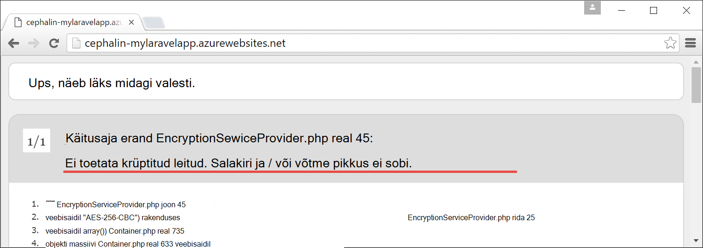
    
Mis on vastik viga, kuid vähemalt ei ole peidetud, kuna lülitasite Laravel silumine. Põgus otsing Laravel Foorumid stringi tõrge kuvatakse selle põhjuseks seadmine pole selle APP_KEY `.env`, või teie puhul, kellel ei ole `.env` Azure üldse. Saate määrata see säte lisamisega `APP_KEY` Azure rakenduse seadmine (vt teemat [Azure web appi konfigureerimine](#configure)).
    
## Järgmised sammud

Saate teada, kuidas andmete lisamiseks rakenduse [loomine MySQL-i andmebaasi Azure](../store-php-create-mysql-database.md). Ka, vaadake lisateavet kasulikud lingid PHP Azure allpool:

- [PHP Arenduskeskus](/develop/php/).
- [Luua veebirakenduse Azure'i turuplatsilt](app-service-web-create-web-app-from-marketplace.md)
- [Azure'i rakendust Service veebirakendustes PHP konfigureerimine](web-sites-php-configure.md)
- [WordPress teisendamine mitmes kohas Azure rakenduse teenus](web-sites-php-convert-wordpress-multisite.md)
- [Azure'i rakenduse teenuse äriklassi WordPress](web-sites-php-enterprise-wordpress.md)
