<properties 
    pageTitle="Azure'i rakendust Service Azure'i CDN kasutamine" 
    description="Õppeteema, mis õpetab juurutamise web appi Azure'i rakenduse teenus, mis pakub sisu integreeritud Azure CDN lõpp" 
    services="app-service\web,cdn" 
    documentationCenter=".net" 
    authors="cephalin" 
    manager="wpickett" 
    editor="jimbe"/>

<tags 
    ms.service="app-service" 
    ms.workload="tbd" 
    ms.tgt_pltfrm="na" 
    ms.devlang="dotnet" 
    ms.topic="article" 
    ms.date="07/01/2016" 
    ms.author="cephalin"/>


# <a name="use-azure-cdn-in-azure-app-service"></a>Azure'i rakendust Service Azure'i CDN kasutamine

[Rakenduse teenuse](http://go.microsoft.com/fwlink/?LinkId=529714) saab integreerida [Azure'i CDN](/services/cdn/), lisamine globaalne skaleerimise võimaluste omast [Rakenduse teenuse veebirakenduste](http://go.microsoft.com/fwlink/?LinkId=529714) abil oma rakenduse veebisisu globaalselt serveri sõlmed lähedal oma klientidele serveeritakse (kõik praeguse sõlm asukohtade värskendatud loendi leiate [allpool](http://msdn.microsoft.com/library/azure/gg680302.aspx)). Stsenaariumid, nt serveeritakse staatilisi pilte, selle integreerimine võivad oluliselt suurendada Azure'i rakenduse teenuse Web Apps jõudlus ja parandab oluliselt oma veebirakenduse kasutuskogemus kogu maailmas. 

Veebirakenduste integreerimine Azure CDN annab teile järgmised eelised:

- Sisujuurutustöö (pilte, skripte ja laadilehte) integreerida oma veebirakenduse [pidev juurutamise](app-service-continuous-deployment.md) käigus
- Hõlpsasti uuendada oma veebirakenduse Azure'i rakenduse teenus, nt jQuery või Bootstrap versioonide NuGet-paketid 
- Sama Visual Studio kasutajaliidese kaudu oma veebirakenduse ja CDN-kätte sisu haldamine
- ASP.net-i komplekteerimine ja minification integreerimine Azure CDN-ID

[AZURE.INCLUDE [app-service-web-to-api-and-mobile](../../includes/app-service-web-to-api-and-mobile.md)] 

## <a name="what-you-will-build"></a>Mis on koostamine ##

Saate juurutada web appi Azure'i rakendust Service Visual Studio Vaikimisi ASP.net-i MVC malli abil, teenida sisu on integreeritud Azure CDN, nt pilt, domeenikontrolleri toimingu tulemuste ja vaikimisi JavaScript ja CSS-failid: koodi lisamine ja ka kirjutada koodi konfigureerida taandepäringud süsteem teenusepakettide serveeritud juhuks, kui on CDN on ühenduseta.

## <a name="what-you-will-need"></a>Mida on vaja ##

Selles õpetuses on järgmine kohustuslik tarkvara.

-   [Microsoft Azure'i konto](/account/) aktiivne
-   Visual Studio 2015 [Azure'i SDK .net-i jaoks](http://go.microsoft.com/fwlink/p/?linkid=323510&clcid=0x409). Kui kasutate Visual Studios, vajalikud toimingud võivad erineda.

> [AZURE.NOTE] Peate selle õpetuse lõpuleviimiseks Azure'i konto.
> + Saate [avada Azure'i konto tasuta](/pricing/free-trial/) – saate krediiti abil saate proovida makstud Azure'i teenuste ja isegi juhul, kui neid kasutatakse hoiate konto ja kasutamine tasuta Azure teenuseid, näiteks Web Apps.
> + Saate [aktiveerida Visual Studio abonendi kasu](/pricing/member-offers/msdn-benefits-details/) – teie Visual Studio tellimuse annab teile krediiti iga kuu makstud Azure'i teenuste kasutatavad.
>
> Kui soovite alustada Azure'i rakendust Service enne Azure'i konto kasutajaks, minge [Proovige rakenduse teenus](http://go.microsoft.com/fwlink/?LinkId=523751), kus saate kohe luua lühiajaline starter web app rakenduse teenus. Nõutav; krediitkaardid kohustusi.

## <a name="deploy-a-web-app-to-azure-with-an-integrated-cdn-endpoint"></a>Juurutada Azure web appi koos integreeritud CDN lõpp ##

Selles jaotises kuvatakse vaikimisi ASP.net-i MVC rakenduse malli Visual Studio 2015 juurutada rakendust Service ja seejärel integreerida uue CDN lõpp-punkti. Järgige alltoodud juhiseid:

1. Visual Studio 2015 luua uue ASP.net-i veebirakenduse menüü minnes **Fail > uus > projekti > Web > ASP.net-i veebirakenduse**. Pange nimi ja klõpsake nuppu **OK**.

    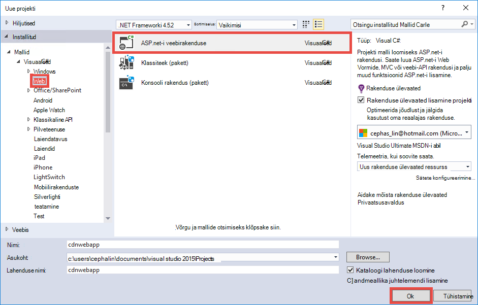

3. Valige **MVC** ja klõpsake nuppu **OK**.

    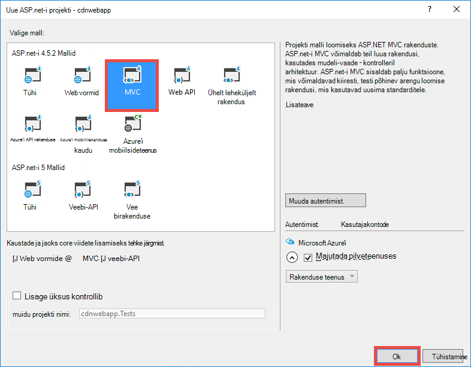

4. Kui te pole seda veel Azure'i kontosse loginud, klõpsake paremas ülanurgas ikooni kontoga ja järgige dialoogiboksis Azure'i kontosse sisse logida. Kui olete lõpetanud, konfigureerida rakenduse, nagu allpool näidatud ja seejärel nuppu **Uus** , et luua oma rakenduse uus rakendus teenuse leping.  

    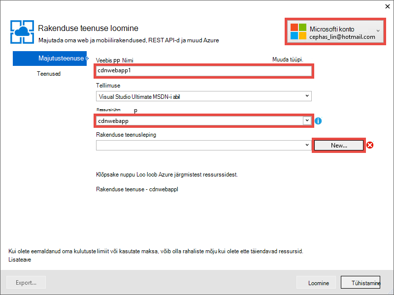

5. Dialoogiboksis Uus rakendus teenusleping konfigureerimine, nagu allpool näidatud ja klõpsake nuppu **OK**. 

    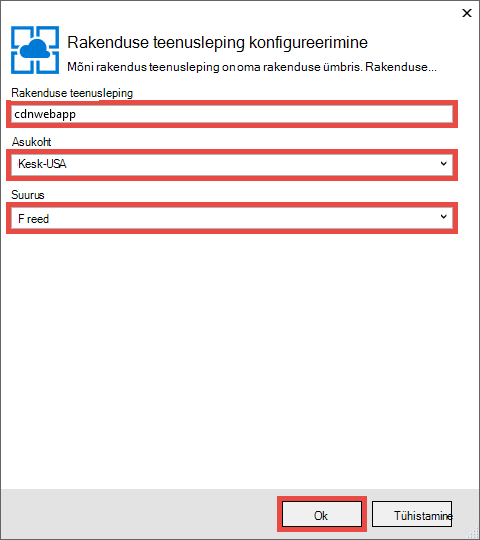

8. Klõpsake nuppu **Loo** veebirakenduse loomine.

    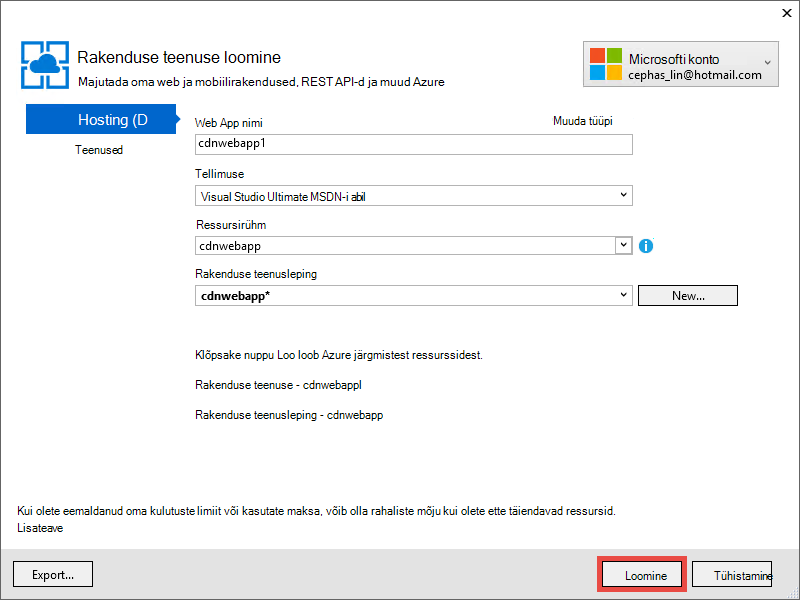

9. Kui teie ASP.net-i rakendused on loodud, selle avaldada Azure'i Azure rakenduse tegevuse paanil, klõpsates **Avalda `<app name>` Web Appi nüüd**. Klõpsake nuppu **Avalda** lõpule viia.

    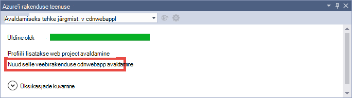

    Kui avaldamine on lõpule jõudnud, kuvatakse teie avaldatud web Appis brauseris. 

1. Logige [Azure portaali](https://portal.azure.com)on CDN lõpp-punkti loomiseks. 
2. Valige **+ Uus** > **Media + CDN** > **CDN**.

    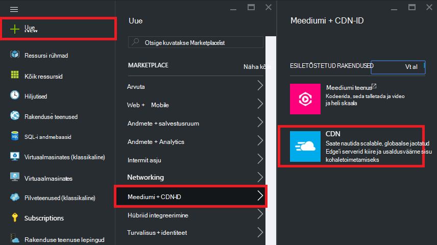

3. **CDN-ID**, **asukoht**, **ressursirühm**, **hinnakirjad taseme**määramine ja seejärel klõpsake nuppu **Loo**

    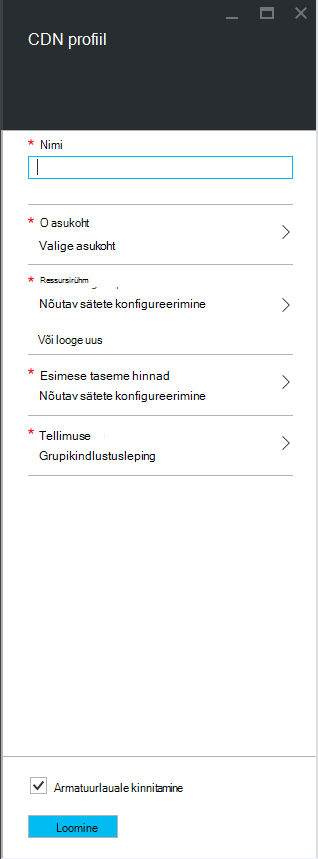   

4. **CDN profiili** blade klõpsake nuppu **+ lõpp-punkti** . Sellele nime panna, valige **Web App** **Origin tüüp** ripploendit ja **Origin hostname** rippmenüüst oma veebirakenduse ja seejärel klõpsake nuppu **Lisa**.  

    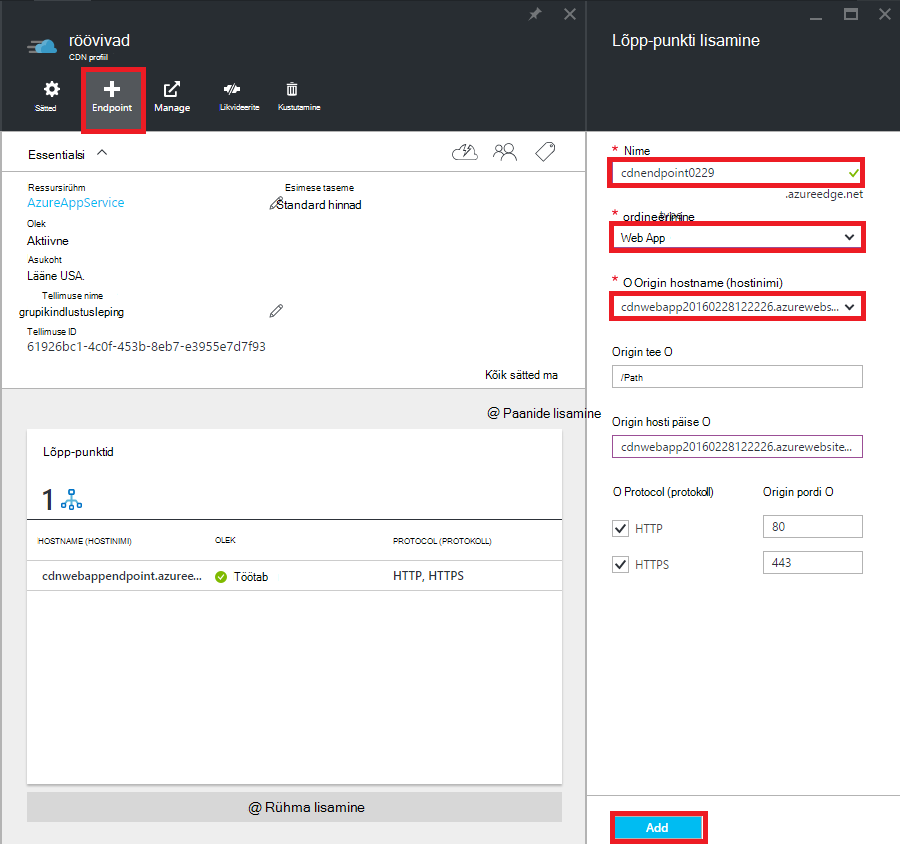


    > [AZURE.NOTE] Kui teie CDN lõpp-punkti on loodud, **lõpp-punkti** tera kuvatakse CDN URL-i ja see on integreeritud origin domeeni. Siiski võib kuluda aega uue CDN endpoint konfigureerimine täielikult paljundada kõik CDN sõlm asukohad. 

3. Tagasi **lõpp-punkti** tera, klõpsake äsja loodud CDN lõpp-punkti nimi.

    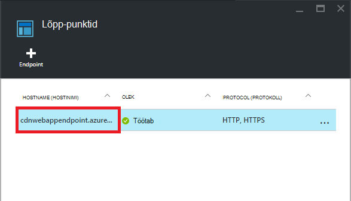

3. Klõpsake nuppu **Konfigureeri** . **Konfigureerimine** tera, valige **iga kordumatu URL-i vahemälu** **päringu stringi vahemällu käitumise** rippmenüü ja seejärel klõpsake nuppu **Salvesta** .


    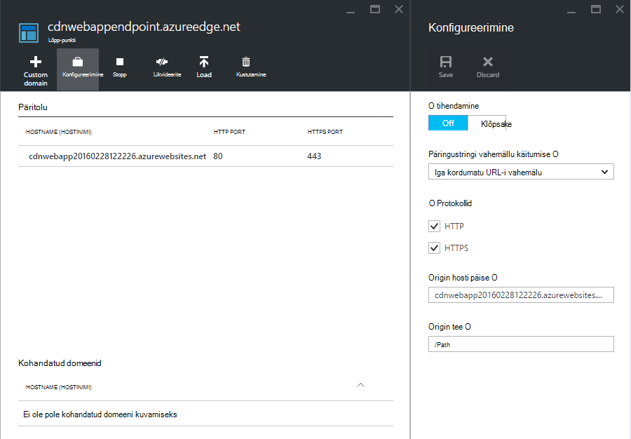

Kui lubate seda, kuvatakse sama link, mis on kättesaadav eri päringus vahemällu eraldi kirjet.

>[AZURE.NOTE] Ajal lubada päringu stringi ei ole vaja kuueosalisest paigutamise, soovite selleks varakult võimalikult mugavuse alates muudatuste siin aega võtab aega kajastuma CDN sõlmi ning te ei soovi, mis tahes mitte-päringu-string-lubatud sisu ummistada üles CDN vahemälu (värskendamine CDN sisu arutatakse hiljem).

2. Nüüd, liikuge CDN lõpp-punkti aadress. Kui lõpp-punkti on valmis, peaksite nägema oma veebirakenduse kuvada. Kui teil tekib **HTTP 404** viga, ei ole CDN lõpp-punkti valmis. Kui peate ootama kuni tund CDN konfiguratsioon, serva sõlmi paljundada. 

    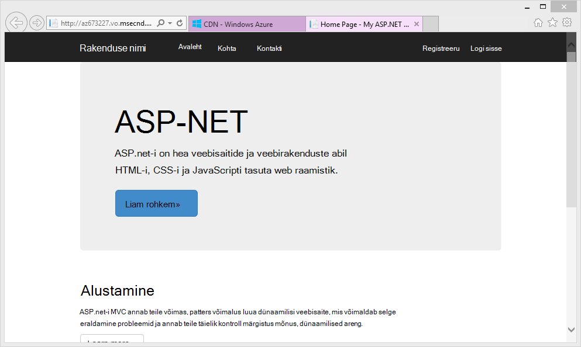

1. Seejärel proovige juurde pääseda **~/Content/bootstrap.css** faili ASP.net-i projekti. Brauseriaknas, liikuge * *http://*&lt;cdnName >*.azureedge.net/Content/bootstrap.css**. Minu häälestus see URL on:

        http://az673227.azureedge.net/Content/bootstrap.css

    Mis vastab veebisaidil CDN lõpp-punkti järgmine origin URL:

        http://cdnwebapp.azurewebsites.net/Content/bootstrap.css

    Kui saate liikuda * *http://*&lt;cdnName >*.azureedge.net/Content/bootstrap.css**, teil palutakse alla laadida bootstrap.css, mis oli Azure web Appist. 

    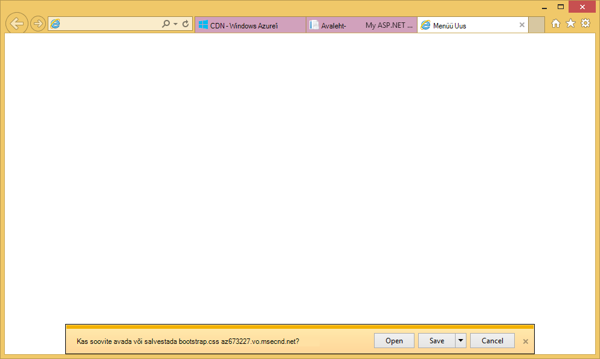

Pääsete sarnaselt mis tahes avalikult juurdepääsetava URL-i veebisaidil * *http://*&lt;teenuse nimi >*.cloudapp.net/** otse oma CDN lõpp-punkti. Näiteks:

-   Js faili tee /Script
-   Mis tahes sisu emajaotises faili tee
-   Mis tahes kontrolleril/toiming 
-   Kui päringu string on lubatud teie CDN lõpp-punkti, mis tahes URL päringus
-   Kogu Azure web appi, kui kogu sisu on avalik

Pange tähele, et ei pruugi alati on hea mõte (või üldiselt on hea mõte) teenida kogu Azure veebirakenduse kaudu Azure'i CDN. Mõned piirangud on:

-   Seda moodust nõuab terve saidi on avalikud, kuna Azure'i CDN ei saa olla mis tahes tundliku sisuga.
-   Kui mingil põhjusel läheb ühenduseta CDN lõpp-punkti, kas ajastatud hooldustööd või kasutaja viga, kogu oma veebirakenduse läheb ühenduseta juhul, kui kliendid saate suunata origin URL-i * *http://*&lt;sitename >*.azurewebsites.net/**. 
-   Isegi kui tasute kohandatud olla sätted (vt [konfigureerimine vahemällu suvandite staatilisi faile oma Azure web Appis](#configure-caching-options-for-static-files-in-your-azure-web-app)), on CDN lõpp-punkti parandada väga dünaamiline sisu. Kui olete proovinud avalehe laadida oma CDN lõpp-punkti nagu eespool näidatud teade, mis kulus vähemalt 5 sekundit laadida vaikimisi avalehe esimest korda, mis on üsna lihtne leht. Kujutage ette, mis juhtub klientide programmikasutuskogemuse, kui see leht sisaldab dünaamilise sisu, mis tuleb värskendada iga minut. Dünaamiline sisu CDN lõpp serveeritakse nõuab lühike vahemälu aegumise, mis tähendab, et sagedased vahemälu jätab veebisaidil CDN lõpp-punkti. See valus oma Azure veebirakenduse jõudlus ja kaotustest CDN-ID eesmärk.

Teise võimalusena on määratleda, millist sisu oma Azure web Appis eraldi: Azure'i CDN kätte. Selleks on juba kuidas pääseda juurde üksikuid sisu faile CDN lõpp näinud. Ma näitab teile, kuidas teenida teatud kontrolleril toimingu CDN lõpp-punkti kaudu [sisu kontrolleril toimingud kaudu Azure'i CDN kaudu](#serve-content-from-controller-actions-through-azure-cdn).

## <a name="configure-caching-options-for-static-files-in-your-azure-web-app"></a>Staatilise failide vahemällu suvandid saate konfigureerida oma Azure web Appis ##

Azure'i CDN integratsiooniga oma Azure web Appis saate määrata, kuidas soovite staatilisi sisu kopeerida CDN lõpp-punkti. Selle tegemiseks *Web.config* avamine ASP.net-i projekti (nt **cdnwebapp**) ja lisage soovitud `<staticContent>` elemendi `<system.webServer>`. XML-i allpool konfigureerib vahemälu 3 päeva pärast aegumist.  

    <system.webServer>
      <staticContent>
        <clientCache cacheControlMode="UseMaxAge" cacheControlMaxAge="3.00:00:00"/>
      </staticContent>
      ...
    </system.webServer>

Pärast seda, kõik staatilise failid teie Azure web Appis järgib sama reeglit CDN vahemälu. Täpsema võimalusi vahemälusätete lisada faili *Web.config* kausta ja lisage oma sätteid seal. Näiteks lisada faili *Web.config* *\Content* kausta ja asendage sisu järgmine XML-i.

    <?xml version="1.0"?>
    <configuration>
      <system.webServer>
        <staticContent>
          <clientCache cacheControlMode="UseMaxAge" cacheControlMaxAge="15.00:00:00"/>
        </staticContent>
      </system.webServer>
    </configuration>

Selle sätte valimisel staatilise kõik failid kausta *\Content* 15 päeva jooksul kopeerida.

Lisateavet selle kohta, kuidas konfigureerida selle `<clientCache>` element, lugege teemat [Kliendi vahemälu &lt;clientCache >](http://www.iis.net/configreference/system.webserver/staticcontent/clientcache).

Järgmise jaotise ma ka kuvatakse kuidas seadistada vahemälusätete kontrolleril toimingu tulemuste CDN vahemälu.

## <a name="serve-content-from-controller-actions-through-azure-cdn"></a>Selle domeenikontrolleri toimingutest kaudu Azure'i CDN sisu ##

Kui veebirakenduste integreerimine Azure CDN on üsna lihtne sisu kaudu kontrolleril toimingud kaudu Azure'i CDN. Uuesti, kui te ei soovi olla kogu Azure veebirakenduse kaudu oma CDN-ID, ei pea seda teha üldse, kuna selle domeenikontrolleri toimingud on kättesaadav, kuni soovitud CDN juba. Kuid ma juba märkinud [Deploy Azure web app koos integreeritud CDN lõpp](#deploy-a-web-app-to-azure-with-an-integrated-cdn-endpoint)huvides võib otsustada selle vastu ja valige selle asemel soovite olla: Azure'i CDN kontrolleril toimingu valimiseks. [Maarten Balliauw](https://twitter.com/maartenballiauw) näitab, kuidas seda teha lõbus MemeGenerator domeenikontrolleri sisse [vähendamine latentsus Azure'i CDN veebis](http://channel9.msdn.com/events/TechDays/Techdays-2014-the-Netherlands/Reducing-latency-on-the-web-with-the-Windows-Azure-CDN). Ma lihtsalt paljundada see siin.

Oletame, et teie web Appis soovite luua memes põhjal on young Chuck Norris pilt ( [Hele Alan](http://www.flickr.com/photos/alan-light/218493788/)foto) umbes järgmine:


Teil on lihtne `Index` toiming, mis võimaldab kliente, määrake soovitud ülivõrrete pilt, loob Meem, kui nad postitada toiming. Kuna see on Chuck Norris, ootate saada metsikult populaarne globaalselt sellelt lehelt. See on hea näide serveeritakse koos Azure CDN pooleldi dünaamiline sisu. 

Järgige eespool häälestamine kontrolleril toimingut:

1. Klõpsake kaustas *\Controllers* nimega *MemeGeneratorController.cs* .cs uue faili loomine ja asendage sisu järgmine kood. Asendada oma failitee `~/Content/chuck.bmp` ja CDN-ID nimi oma `yourCDNName`.


        using System;
        using System.Collections.Generic;
        using System.Diagnostics;
        using System.Drawing;
        using System.IO;
        using System.Net;
        using System.Web.Hosting;
        using System.Web.Mvc;
        using System.Web.UI;

        namespace cdnwebapp.Controllers
        {
          public class MemeGeneratorController : Controller
          {
            static readonly Dictionary<string, Tuple<string ,string>> Memes = new Dictionary<string, Tuple<string, string>>();

            public ActionResult Index()
            {
              return View();
            }

            [HttpPost, ActionName("Index")]
            public ActionResult Index_Post(string top, string bottom)
            {
              var identifier = Guid.NewGuid().ToString();
              if (!Memes.ContainsKey(identifier))
              {
                Memes.Add(identifier, new Tuple<string, string>(top, bottom));
              }

              return Content("<a href=\"" + Url.Action("Show", new {id = identifier}) + "\">here's your meme</a>");
            }

            [OutputCache(VaryByParam = "*", Duration = 1, Location = OutputCacheLocation.Downstream)]
            public ActionResult Show(string id)
            {
              Tuple<string, string> data = null;
              if (!Memes.TryGetValue(id, out data))
              {
                return new HttpStatusCodeResult(HttpStatusCode.NotFound);
              }

              if (Debugger.IsAttached) // Preserve the debug experience
              {
                return Redirect(string.Format("/MemeGenerator/Generate?top={0}&bottom={1}", data.Item1, data.Item2));
              }
              else // Get content from Azure CDN
              {
                return Redirect(string.Format("http://<yourCDNName>.azureedge.net/MemeGenerator/Generate?top={0}&bottom={1}", data.Item1, data.Item2));
              }
            }

            [OutputCache(VaryByParam = "*", Duration = 3600, Location = OutputCacheLocation.Downstream)]
            public ActionResult Generate(string top, string bottom)
            {
              string imageFilePath = HostingEnvironment.MapPath("~/Content/chuck.bmp");
              Bitmap bitmap = (Bitmap)Image.FromFile(imageFilePath);

              using (Graphics graphics = Graphics.FromImage(bitmap))
              {
                SizeF size = new SizeF();
                using (Font arialFont = FindBestFitFont(bitmap, graphics, top.ToUpperInvariant(), new Font("Arial Narrow", 100), out size))
                {
                    graphics.DrawString(top.ToUpperInvariant(), arialFont, Brushes.White, new PointF(((bitmap.Width - size.Width) / 2), 10f));
                }
                using (Font arialFont = FindBestFitFont(bitmap, graphics, bottom.ToUpperInvariant(), new Font("Arial Narrow", 100), out size))
                {
                    graphics.DrawString(bottom.ToUpperInvariant(), arialFont, Brushes.White, new PointF(((bitmap.Width - size.Width) / 2), bitmap.Height - 10f - arialFont.Height));
                }
              }
              MemoryStream ms = new MemoryStream();
              bitmap.Save(ms, System.Drawing.Imaging.ImageFormat.Png);
              return File(ms.ToArray(), "image/png");
            }

            private Font FindBestFitFont(Image i, Graphics g, String text, Font font, out SizeF size)
            {
              // Compute actual size, shrink if needed
              while (true)
              {
                size = g.MeasureString(text, font);

                // It fits, back out
                if (size.Height < i.Height &&
                     size.Width < i.Width) { return font; }

                // Try a smaller font (90% of old size)
                Font oldFont = font;
                font = new Font(font.Name, (float)(font.Size * .9), font.Style);
                oldFont.Dispose();
              }
            }
          }
        }

2. Paremklõpsake vaikimisi `Index()` toiming ja valige **Lisa vaade**.

    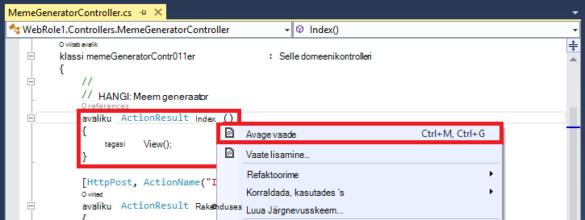

3.  Nõustuge järgmisi sätteid ja klõpsake nuppu **Lisa**.

    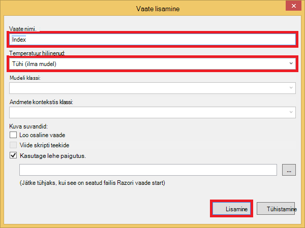

4. Avage uus *Views\MemeGenerator\Index.cshtml* ja asendage sisu järgmine lihtne HTML on ülivõrrete esitamise:

        <h2>Meme Generator</h2>
        
        <form action="" method="post">
            <input type="text" name="top" placeholder="Enter top text here" />
            <br />
            <input type="text" name="bottom" placeholder="Enter bottom text here" />
            <br />
            <input class="btn" type="submit" value="Generate meme" />
        </form>

5. Avaldamine Azure web appi uuesti ja liikuge * *http://*&lt;teenuse nimi >*.cloudapp.net/MemeGenerator/Index** brauseris. 

Kui edastate vormi väärtused asukohta `/MemeGenerator/Index`, `Index_Post` toimingu meetod tagastab link on `Show` vastav Sisestuskeel identifikaatoriga toimingu meetod. Kui klõpsate linki, jõuate järgmine kood:  

    [OutputCache(VaryByParam = "*", Duration = 1, Location = OutputCacheLocation.Downstream)]
    public ActionResult Show(string id)
    {
      Tuple<string, string> data = null;
      if (!Memes.TryGetValue(id, out data))
      {
        return new HttpStatusCodeResult(HttpStatusCode.NotFound);
      }

      if (Debugger.IsAttached) // Preserve the debug experience
      {
        return Redirect(string.Format("/MemeGenerator/Generate?top={0}&bottom={1}", data.Item1, data.Item2));
      }
      else // Get content from Azure CDN
      {
        return Redirect(string.Format("http://<yourCDNName>.azureedge.net/MemeGenerator/Generate?top={0}&bottom={1}", data.Item1, data.Item2));
      }
    }

Kui teie kohaliku Silur on ühendatud, siis saate tavalise silumine kogemus kohaliku suunata. Kui see töötab Azure web Appis, siis see suunab ümber:

    http://<yourCDNName>.azureedge.net/MemeGenerator/Generate?top=<formInput>&bottom=<formInput>

Mis vastab järgmine origin URL veebisaidil oma CDN lõpp-punkt:

    http://<yourSiteName>.azurewebsites.net/cdn/MemeGenerator/Generate?top=<formInput>&bottom=<formInput>

Pärast URL-i ümberkirjutamine rakendanud reegel, on tegelik fail, mille saab vahemälus talletatud teie CDN lõpp-punkti.

    http://<yourSiteName>.azurewebsites.net/MemeGenerator/Generate?top=<formInput>&bottom=<formInput>

Seejärel saate soovitud `OutputCacheAttribute` atribuut klõpsake soovitud `Generate` meetodi abil saate määrata, kuidas toimingu tulem peaks olema vahemälus talletatud, mis Azure'i CDN au. Alljärgnev kood Määrake vahemälu aegumise on 1 tund (3600 sekundit).

    [OutputCache(VaryByParam = "*", Duration = 3600, Location = OutputCacheLocation.Downstream)]

Samuti saab olla mis tahes kontrolleril toimingu sisu üles oma Azure web Appis kaudu oma Azure'i CDN, koos vahemällu soovitud suvand.

Järgmise jaotise ma näitab teile, kuidas kogumisse seotud ja minified skripte ja CSS-i kaudu Azure'i CDN. 

## <a name="integrate-aspnet-bundling-and-minification-with-azure-cdn"></a>ASP.net-i komplekteerimine ja minification integreerimine Azure CDN-ID ##

Skripte ja CSS-i laadilehte muuta harva ja peamine, saavad Azure'i CDN vahemälu. Lihtsaim viis komplekteerimine ja minification integreerimine Azure CDN serveeritakse kogu veebirakenduse kaudu oma Azure'i CDN on. Siiski nagu võib valida vastu seda moodust [integreerida sisuga oma Azure web app ja serve staatiline: Azure'i CDN veebilehtede lõpp Azure'i CDN](#deploy-a-web-app-to-azure-with-an-integrated-cdn-endpoint)kirjeldatud põhjustel, ma näitab teile, kuidas seda teha säilitades soovitud develper kogemusi ja ASP.net-i komplekteerimine minification, näiteks:

-   Hea silumine režiimi kogemus
-   Sujuv juurutamine
-   Kohe värskenduste klientidele skripti/CSS-i versiooni uuendamine
-   Kui teie CDN lõpp-punkti nurjub taandepäringud süsteem
-   Minimeerida koodi muutmine

ASP.net-i projekti [integreerida sisuga oma Azure web app ja serve staatiline: Azure'i CDN veebilehtede lõpp Azure'i CDN](#deploy-a-web-app-to-azure-with-an-integrated-cdn-endpoint)loodud, avage *App_Start\BundleConfig.cs* ja Heitke pilk selle `bundles.Add()` meetodi kutsed.

    public static void RegisterBundles(BundleCollection bundles)
    {
        bundles.Add(new ScriptBundle("~/bundles/jquery").Include(
                    "~/Scripts/jquery-{version}.js"));
        ...
    }

Esimene `bundles.Add()` lause lisab skripti komplekt virtuaalse Directory `~/bundles/jquery`. Avage *Views\Shared\_Layout.cshtml* näha, kuidas skripti komplekt silt on muutunud. Peaks saama otsimine Razori kood järgmine rida.

    @Scripts.Render("~/bundles/jquery")

Järgmine kood Razori käitamisel Azure web Appis muudab on `<script>` sildi skript koguhinna umbes järgmine: 

    <script src="/bundles/jquery?v=FVs3ACwOLIVInrAl5sdzR2jrCDmVOWFbZMY6g6Q0ulE1"></script>

Juhul, kui see töötab Visual Studios, tippides `F5`, see muudab iga skriptifail kogumisse eraldi (ülaltoodud juhul ainult üks skriptifail on kogumisse):

    <script src="/Scripts/jquery-1.10.2.js"></script>

See võimaldab teil oma arenduskeskkond JavaScripti koodi silumine ajal vähendada samaaegseid klientrakenduse kaudu (liitmine) ja parandada faili alla laadida jõudluse (minification) valmistamisel. See on suurepärane funktsioon Azure'i CDN integreerimise säilitada. Lisaks sulatatud komplekt sisaldab juba automaatselt loodud versioon on string, soovite ise funktsioone, et iga kord, kui värskendate oma jQuery versiooni kaudu Nugeti, värskendatakse seda kliendipoolse nii kiiresti kui võimalik.

Järgige allpool integreerimine ASP.net-i komplekteerimine ja minification koos oma CDN lõpp-punkti.

1. Olles tagasi kohas *App_Start\BundleConfig.cs*, muuta selle `bundles.Add()` meetodit kasutada eri [komplekt konstruktori](http://msdn.microsoft.com/library/jj646464.aspx), mis määrab CDN meiliaadressi. Selle tegemiseks asendada selle `RegisterBundles` meetod määratlus järgmine kood:  
    
        public static void RegisterBundles(BundleCollection bundles)
        {
          bundles.UseCdn = true;
          var version = System.Reflection.Assembly.GetAssembly(typeof(Controllers.HomeController))
            .GetName().Version.ToString();
          var cdnUrl = "http://<yourCDNName>.azureedge.net/{0}?" + version;

          bundles.Add(new ScriptBundle("~/bundles/jquery", string.Format(cdnUrl, "bundles/jquery")).Include(
                "~/Scripts/jquery-{version}.js"));

          bundles.Add(new ScriptBundle("~/bundles/jqueryval", string.Format(cdnUrl, "bundles/jqueryval")).Include(
                "~/Scripts/jquery.validate*"));

          // Use the development version of Modernizr to develop with and learn from. Then, when you're
          // ready for production, use the build tool at http://modernizr.com to pick only the tests you need.
          bundles.Add(new ScriptBundle("~/bundles/modernizr", string.Format(cdnUrl, "bundles/modernizr")).Include(
                "~/Scripts/modernizr-*"));

          bundles.Add(new ScriptBundle("~/bundles/bootstrap", string.Format(cdnUrl, "bundles/bootstrap")).Include(
                "~/Scripts/bootstrap.js",
                "~/Scripts/respond.js"));

          bundles.Add(new StyleBundle("~/Content/css", string.Format(cdnUrl, "Content/css")).Include(
                "~/Content/bootstrap.css",
                "~/Content/site.css"));
        }


    Asendage `<yourCDNName>` oma Azure'i CDN nimi.

    Lihtsate sõnadega, saate määrata `bundles.UseCdn = true` ja hoolikalt CDN URL-i lisatakse iga komplekt. Näiteks esimese ehitaja kood:

        new ScriptBundle("~/bundles/jquery", string.Format(cdnUrl, "bundles/jquery"))

    sama, mis on: 

        new ScriptBundle("~/bundles/jquery", string.Format(cdnUrl, "http://<yourCDNName>.azureedge.net/bundles/jquery?<W.X.Y.Z>"))

    Seda konstruktorit ütleb ASP.net-i komplekteerimine ja minification renderdada üksikute skripti faile, kui kohalik silumisel, kuid juurdepääs kõnealuse skripti määratud CDN aadress abil. Pange tähele kahte olulist omadused seda hoolikalt koostatud CDN URL:
    
    - Seda URL-i CDN pärineb `http://<yourSiteName>.azurewebsites.net/bundles/jquery?<W.X.Y.Z>`, mis on tegelikult teie veebirakenduse kogumi skripti virtuaalne kataloog.
    - Kuna kasutate CDN konstruktori, sisaldab CDN skripti sildi koguhinna enam automaatselt loodud versioon stringi sulatatud URL-is. Iga kord, kui skript kogumisse on muudetud jõustamine veebisaidil oma Azure'i CDN vahemälu vahele, tuleb ainulaadne versiooni stringi käsitsi luua. Samal ajal kordumatu versioon stringile tuleb need ei muutu elu maksimeerimiseks Vahemälutabamusi veebisaidil oma Azure'i CDN pärast kogumisse juurutamist juurutamise kaudu.

3. Päringu string `<W.X.Y.Z>` tõmbab *Properties\AssemblyInfo.cs* ASP.net-i projekti. Teil võib olla juurutamise töövoo, mis sisaldab suurendades komplekti versioon iga kord, kui avaldate Azure. Või saate muuta ainult *Properties\AssemblyInfo.cs* automaatselt inkrementida stringi versioon iga kord, kui koostate Metamärgi projektis "*". Näiteks muuta `AssemblyVersion` nagu allpool näidatud:
    
        [assembly: AssemblyVersion("1.0.0.*")]
    
    Mis tahes muud strateegia loomisel kordumatu stringi elu juurutuse täiustamiseks töötab siin.

3. ASP.net-i rakendus uuesti avaldada ja kasutada avalehele.
 
4. Saate vaadata lehe HTML-koodi. Peaks olema näeksid renderdamise stringiga kordumatu versioon iga kord, kui avaldate muudatused Azure veebirakendusse CDN URL. Näiteks:  
    
        ...
        <link href="http://az673227.azureedge.net/Content/css?1.0.0.25449" rel="stylesheet"/>
        <script src="http://az673227.azureedge.net/bundles/modernizer?1.0.0.25449"></script>
        ...
        <script src="http://az673227.azureedge.net/bundles/jquery?1.0.0.25449"></script>
        <script src="http://az673227.azureedge.net/bundles/bootstrap?1.0.0.25449"></script>
        ...

5. Visual Studio silumine ASP.net-i rakenduse Visual Studios, tippides `F5`., 

6. Saate vaadata lehe HTML-koodi. Näete iga skriptifail eraldi muudetakse nii, et olete ühtsete silumine, kogemusi Visual Studio.  
    
        ...
        <link href="/Content/bootstrap.css" rel="stylesheet"/>
        <link href="/Content/site.css" rel="stylesheet"/>
        <script src="/Scripts/modernizr-2.6.2.js"></script>
        ...
        <script src="/Scripts/jquery-1.10.2.js"></script>
        <script src="/Scripts/bootstrap.js"></script>
        <script src="/Scripts/respond.js"></script>
        ...    

## <a name="fallback-mechanism-for-cdn-urls"></a>Taandepäringud süsteem CDN URL-id ##

Kui teie Azure'i CDN lõpp-punkti ei õnnestu mingil põhjusel, soovite olla piisavalt tark, et juurdepääsu oma origin veebiserver taandepäringud laadimine JavaScripti või alglaaduri suvandi teie veebilehele. See on raske, pildid oma veebirakenduse CDN andnud, kuid palju raskem kaotada oluline lehe funktsioonid oma skripte ja laadilehte tõttu kaotsi minna.

Klassi [komplekt](http://msdn.microsoft.com/library/system.web.optimization.bundle.aspx) sisaldab [CdnFallbackExpression](http://msdn.microsoft.com/library/system.web.optimization.bundle.cdnfallbackexpression.aspx) , mille abil saate konfigureerida taandepäringud süsteem CDN rikkumise atribuudi. Kasutatav atribuut, tehke järgmist.

1. ASP.net-i projekti, avage *App_Start\BundleConfig.cs*, kuhu lisasite CDN URL-i iga [kogumi ehitaja](http://msdn.microsoft.com/library/jj646464.aspx), ja lisage `CdnFallbackExpression` kood neljas kohas, nagu on näidatud lisamiseks vaikimisi kimbud taandepäringud süsteem.  
    
        public static void RegisterBundles(BundleCollection bundles)
        {
          var version = System.Reflection.Assembly.GetAssembly(typeof(BundleConfig))
            .GetName().Version.ToString();
          var cdnUrl = "http://cdnurl.azureedge.net/.../{0}?" + version;
          bundles.UseCdn = true;

          bundles.Add(new ScriptBundle("~/bundles/jquery", string.Format(cdnUrl, "bundles/jquery")) 
                { CdnFallbackExpression = "window.jquery" }
                .Include("~/Scripts/jquery-{version}.js"));

          bundles.Add(new ScriptBundle("~/bundles/jqueryval", string.Format(cdnUrl, "bundles/jqueryval")) 
                { CdnFallbackExpression = "$.validator" }
                .Include("~/Scripts/jquery.validate*"));

          // Use the development version of Modernizr to develop with and learn from. Then, when you're
          // ready for production, use the build tool at http://modernizr.com to pick only the tests you need.
          bundles.Add(new ScriptBundle("~/bundles/modernizr", string.Format(cdnUrl, "bundles/modernizer")) 
                { CdnFallbackExpression = "window.Modernizr" }
                .Include("~/Scripts/modernizr-*"));

          bundles.Add(new ScriptBundle("~/bundles/bootstrap", string.Format(cdnUrl, "bundles/bootstrap"))     
                { CdnFallbackExpression = "$.fn.modal" }
                .Include(
                        "~/Scripts/bootstrap.js",
                        "~/Scripts/respond.js"));

          bundles.Add(new StyleBundle("~/Content/css", string.Format(cdnUrl, "Content/css")).Include(
                "~/Content/bootstrap.css",
                "~/Content/site.css"));
        }

    Kui `CdnFallbackExpression` on pole tühi skript süstitakse HTML-i kontrollida, kas kogumisse on edukalt laaditud ja kui pole, juurdepääs kogumisse otse origin veebiserver. Atribuut peab olema seatud JavaScripti avaldis, mis kontrollib, kas vastav CDN kogumisse laaditakse õigesti. Avaldis, mis on vaja testida iga kogumi kleepimistoimingud sõltuvad sisu. Vaikimisi teenusepakettide ülaltoodud:
    
    - `window.jquery`on määratletud JS jquery-{versioon}
    - `$.validator`on määratletud jquery.validate.js
    - `window.Modernizr`on määratletud JS modernizer-{versioon}
    - `$.fn.modal`on määratletud bootstrap.js
    
    Te olete märganud, et mul pole määratud CdnFallbackExpression jaoks soovitud `~/Cointent/css` komplekt. See on, kuna seal on praegu [System.Web.Optimization viga](https://aspnetoptimization.codeplex.com/workitem/104) , mis serveripoolse on `<script>` sildi taandepäringud CSS asemel eeldatud `<link>` sildi.
    
    Siiski on hea [Laadi komplekt Fall](https://github.com/EmberConsultingGroup/StyleBundleFallback) pakutud [Hõõguvas nõustamisteenuseid rühma](https://github.com/EmberConsultingGroup). 

2. CSS-i lahendus kasutamiseks luua uue .cs faili ASP.net-i projekti *App_Start* kaust nimega *StyleBundleExtensions.cs*ja asendada selle sisu [GitHub koodi](https://github.com/EmberConsultingGroup/StyleBundleFallback/blob/master/Website/App_Start/StyleBundleExtensions.cs). 

4. *App_Start\StyleFundleExtensions.cs*, Nimeta ümber nimeruumi nimeruumi ASP.net-i rakendused (nt **cdnwebapp**). 

3. Minge tagasi `App_Start\BundleConfig.cs` ja asendada Viimane `bundles.Add` lause järgmine kood:  

        bundles.Add(new StyleBundle("~/Content/css", string.Format(cdnUrl, "Content/css"))
          .IncludeFallback("~/Content/css", "sr-only", "width", "1px")
          .Include(
            "~/Content/bootstrap.css",
            "~/Content/site.css"));

    Uue laiendi meetodi kasutab sama idee sisestab skript HTML kontrollida DOM jaoks soovitud kattuvad ainekursuse nime, reegli nimi ja reegli väärtus määratletud CSS-i komplekt ja langeb tagasi origin veebiserver, kui ta ei leia soovitud vaste.

4. Avaldada oma Azure veebirakenduse uuesti ja juurdepääs avalehele. 
5. Saate vaadata lehe HTML-koodi. Tuleks leida paigutatud skriptide umbes järgmine:    
    
    ```
    ...
    <link href="http://az673227.azureedge.net/Content/css?1.0.0.25474" rel="stylesheet"/>
<script>(function() {
                var loadFallback,
                    len = document.styleSheets.length;
                for (var i = 0; i < len; i++) {
                    var sheet = document.styleSheets[i];
                    if (sheet.href.indexOf('http://az673227.azureedge.net/Content/css?1.0.0.25474') !== -1) {
                        var meta = document.createElement('meta');
                        meta.className = 'sr-only';
                        document.head.appendChild(meta);
                        var value = window.getComputedStyle(meta).getPropertyValue('width');
                        document.head.removeChild(meta);
                        if (value !== '1px') {
                            document.write('<link href="/Content/css" rel="stylesheet" type="text/css" />');
                        }
                    }
                }
                return true;
            }())||document.write('<script src="/Content/css"><\/script>');</script>

    <script src="http://az673227.azureedge.net/bundles/modernizer?1.0.0.25474"></script>
    <script>(window.Modernizr)||document.write('<script src="/bundles/modernizr"><\/script>');</script>
    ... 
    <script src="http://az673227.azureedge.net/bundles/jquery?1.0.0.25474"></script>
    <script>(window.jquery)||document.write('<script src="/bundles/jquery"><\/script>');</script>

    <script src="http://az673227.azureedge.net/bundles/bootstrap?1.0.0.25474"></script>
    <script>($.fn.modal)||document.write('<script src="/bundles/bootstrap"><\/script>');</script>
    ...
    ```

    Pange tähele, et paigutatud koguhinna CSS-i skripti sisaldab endiselt Hairahtunut jäänuk on `CdnFallbackExpression` atribuudi real:

        }())||document.write('<script src="/Content/css"><\/script>');</script>

    Kuid kuna esimene osa on || avaldis tagastab alati väärtuse true (Klõpsake joont selle kohal), mitte kunagi kestab document.write() funktsiooni.

6. Testimiseks taandepäringud script ei tööta, minge tagasi on CDN endpoint blade ja klõpsake nuppu **Lõpeta**.

    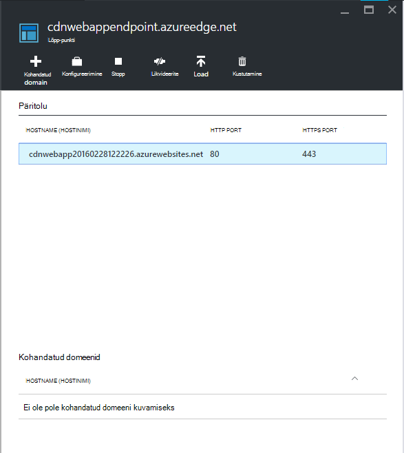

7. Värskendage oma brauseriakna Azure web app. Nüüd peaks nähtaval olema kõik skripte ja laadilehte õigesti laaditud.

## <a name="more-information"></a>Lisateave 
- [Azure'i Sisuedastusvõrgud (CDN) ülevaade](../cdn/cdn-overview.md)
- [Azure'i CDN abil](../cdn/cdn-create-new-endpoint.md)
- [Pilveteenus integreerimine Azure CDN-ID](../cdn/cdn-cloud-service-with-cdn.md)
- [ASP.net-i komplekteerimine ja Minification](http://www.asp.net/mvc/tutorials/mvc-4/bundling-and-minification)

