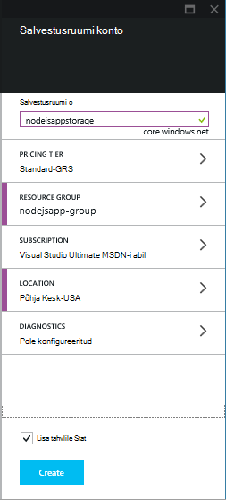
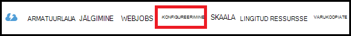
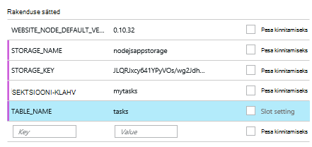

<properties
    pageTitle="Node.js web Appi abil Azure'i tabeli teenus"
    description="Selle õpetuse õpetab, kuidas Azure'i tabeli teenust kasutada Azure rakenduse teenuse veebirakendustes Node.js rakendusest, mis on majutatud andmete talletamiseks."
    tags="azure-portal"
    services="app-service\web, storage"
    documentationCenter="nodejs"
    authors="rmcmurray"
    manager="wpickett"
    editor=""/>

<tags
    ms.service="storage"
    ms.workload="storage"
    ms.tgt_pltfrm="na"
    ms.devlang="nodejs"
    ms.topic="article"
    ms.date="08/11/2016"
    ms.author="robmcm"/>

# Node.js web Appi abil Azure'i tabeli teenus

## Ülevaade

Selle õpetuse näidatakse, kuidas kasutada tabeli teenust Azure andmehaldus talletada ja pääsevad andmetele juurde majutatud [Azure'i rakendust Service](http://go.microsoft.com/fwlink/?LinkId=529714) veebirakendustes [sõlm] rakendusest. Selle õpetuse eeldab, et teil on mõni eelnev kogemus sõlm ja [Git]abil.

Saate:

* Kuidas kasutada npm (sõlm paketi manager) installida sõlm moodulid

* Azure'i tabeli teenuse töötamine

* Kuidas luua veebirakenduse Azure'i CLI abil.

Selle õpetuse järgides koostate veebipõhine lihtne "Ülesandeloend" rakendus, mis võimaldab loomise, allalaadimise ja ülesannete. Tööülesanded on talletatud tabeli teenus.

Siin on täidetud.

![Veebilehe kuvamine mõnda tühja tasklist][node-table-finished]

>[AZURE.NOTE] Kui soovite alustada Azure'i rakendust Service enne Azure'i konto kasutajaks, minge [Proovige rakenduse teenus](http://go.microsoft.com/fwlink/?LinkId=523751), kus saate kohe luua lühiajaline starter web app rakenduse teenus. Nõutav; krediitkaardid kohustusi.

## Eeltingimused

Enne selle artikli juhiste, veenduge, et teil on installitud järgmine:

* [sõlm] versioon 0.10.24 või uuem versioon

* [Git]

[AZURE.INCLUDE [create-account-and-websites-note](../../includes/create-account-and-websites-note.md)]

## Salvestusruumi konto loomine

Looge konto Azure salvestusruumi. Rakendus kasutab selle konto ülesandeloendi üksuste talletamiseks.

1.  Logige [Azure portaali](https://portal.azure.com/).

2. **Uus** ikoon portaali all vasakul, klõpsake käsku **andmete + salvestusruumi** > **salvestusruumi**. Pange salvestusruumi konto kordumatu nimi ja selle jaoks looma uue [Ressursirühma](../azure-resource-manager/resource-group-overview.md) .

    

    Salvestusruumi konto loomisel kuvatakse nupp **teatised** flash roheline **edu** ja salvestusruumi konto blade on avatud, et olete loonud uue ressursirühma kuulub kuvamiseks.

5. Salvestusruumi konto tera, klõpsake nuppu **sätted** > **võtmed**. Esmane kiirklahv kopeerimine lõikelauale.

    ![Kiirklahv][portal-storage-access-keys]

##Installige moodulid ja luua tellingud

Selles jaotises luua uue rakenduse sõlm ja npm abil saate lisada mooduli paketid. Selle rakenduse jaoks kasutate [kiire] ja [Azure] moodulid. Express mooduli raamistik mudeli vaate kontrolleril sõlme, Azure moodulid pakub ühenduvuse tabeli teenusega.

### Installige express ja luua tellingud

1. Käsurea, looge uus kaust nimega **tasklist** ning vahetage ilmnes tõrge.  

2. Sisestage järgmine käsk Express mooduli installimiseks.

        npm install express-generator@4.2.0 -g

    Sõltuvalt operatsioonisüsteemi, peate panna sudo' enne käsu:

        sudo npm install express-generator@4.2.0 -g

    Väljundisse kuvatakse sarnaselt järgmises näites:

        express-generator@4.2.0 /usr/local/lib/node_modules/express-generator
        ├── mkdirp@0.3.5
        └── commander@1.3.2 (keypress@0.1.0)

    > [AZURE.NOTE] Funktsiooni "-g" parameeter installib mooduli globaalselt. Nii saate kasutame **kiire** luua web appi tellingud täiendavad tee teave tippimata.

4. Sisestage tellinguid rakenduse loomiseks **kiire** käsk.

        express

    Selle käsu väljund kuvatakse sarnaselt järgmises näites:

           create : .
           create : ./package.json
           create : ./app.js
           create : ./public
           create : ./public/images
           create : ./routes
           create : ./routes/index.js
           create : ./routes/users.js
           create : ./public/stylesheets
           create : ./public/stylesheets/style.css
           create : ./views
           create : ./views/index.jade
           create : ./views/layout.jade
           create : ./views/error.jade
           create : ./public/javascripts
           create : ./bin
           create : ./bin/www

           install dependencies:
             $ cd . && npm install

           run the app:
             $ DEBUG=my-application ./bin/www

    Nüüd on teil mitu uut kataloogide ja failide kataloogis **tasklist** .

### Täiendavad moodulid installimine

Ühe faili selle **kiire** loob on **package.json**. See fail sisaldab mooduli sõltuvused loendi. Hiljem juurutamisel rakendus App teenuse veebirakenduste, määratleb selle faili, millised moodulid tuleb installida Azure.

Käsurea, sisestage järgmine käsk installida moodulid kirjeldatud **package.json** faili. Kui peate kasutama "sudo".

    npm install

Selle käsu väljund kuvatakse sarnaselt järgmises näites:

    debug@0.7.4 node_modules\debug

    cookie-parser@1.0.1 node_modules\cookie-parser
    ├── cookie-signature@1.0.3
    └── cookie@0.1.0

    [...]

Seejärel sisestage installida [azure], [sõlm-uuid], [nconf] ja [asünkroonse] moodulid järgmine käsk:

    npm install azure-storage node-uuid async nconf --save

Funktsiooni **--salvestamine** lipuga need moodulid kirjed lisatakse **package.json** faili.

Selle käsu väljund kuvatakse sarnaselt järgmises näites:

    async@0.9.0 node_modules\async

    node-uuid@1.4.1 node_modules\node-uuid

    nconf@0.6.9 node_modules\nconf
    ├── ini@1.2.1
    ├── async@0.2.9
    └── optimist@0.6.0 (wordwrap@0.0.2, minimist@0.0.10)

    [...]

## Rakenduse loomine

Nüüd olete valmis looma rakendus.

### Andmemudeli loomine

*Mudeli* on objekti, mis tähistab rakenduse andmeid. Rakenduse, ainult mudel on tööülesande objekti, mis tähistab üksuse Ülesandeloend. Ülesanded on järgmised väljad:

- PartitionKey
- RowKey
- nimi (stringi)
- kategooria (stringi)
- lõpetatud (kahendmuutuja)

**PartitionKey** ja **RowKey** kasutatakse tabeli teenus võttis tabeli võtmed. Lisateavet leiate teemast [tabeli teenuse andmemudeli mõistmine](https://msdn.microsoft.com/library/azure/dd179338.aspx).

1. **Tasklist** kataloogi, looge uus kaust nimega **mudelid**.

2. Kataloogis **mudelite** **task.js**nimega uue faili loomine. See fail sisaldab mudeli jaoks loodud rakenduse tööülesanded.

3. Lisada **task.js** faili alguses viitamiseks nõutav teekide järgmine kood:

        var azure = require('azure-storage');
        var uuid = require('node-uuid');
        var entityGen = azure.TableUtilities.entityGenerator;

4. Lisage järgmine kood määratlemine ja tööülesande objekti. See objekt on tabel ühenduse.

        module.exports = Task;

        function Task(storageClient, tableName, partitionKey) {
          this.storageClient = storageClient;
          this.tableName = tableName;
          this.partitionKey = partitionKey;
          this.storageClient.createTableIfNotExists(tableName, function tableCreated(error) {
            if(error) {
              throw error;
            }
          });
        };

5. Lisage järgmine kood määratleda täiendavad meetodite tööülesande objekti, mis võimaldavad suhtlust tabelis talletatud andmed:

        Task.prototype = {
          find: function(query, callback) {
            self = this;
            self.storageClient.queryEntities(this.tableName, query, null, function entitiesQueried(error, result) {
              if(error) {
                callback(error);
              } else {
                callback(null, result.entries);
              }
            });
          },

          addItem: function(item, callback) {
            self = this;
            // use entityGenerator to set types
            // NOTE: RowKey must be a string type, even though
            // it contains a GUID in this example.
            var itemDescriptor = {
              PartitionKey: entityGen.String(self.partitionKey),
              RowKey: entityGen.String(uuid()),
              name: entityGen.String(item.name),
              category: entityGen.String(item.category),
              completed: entityGen.Boolean(false)
            };
            self.storageClient.insertEntity(self.tableName, itemDescriptor, function entityInserted(error) {
              if(error){  
                callback(error);
              }
              callback(null);
            });
          },

          updateItem: function(rKey, callback) {
            self = this;
            self.storageClient.retrieveEntity(self.tableName, self.partitionKey, rKey, function entityQueried(error, entity) {
              if(error) {
                callback(error);
              }
              entity.completed._ = true;
              self.storageClient.updateEntity(self.tableName, entity, function entityUpdated(error) {
                if(error) {
                  callback(error);
                }
                callback(null);
              });
            });
          }
        }

6. Salvestage ja sulgege fail **task.js** .

### Mõne selle domeenikontrolleri loomine

*Selle domeenikontrolleri* tegeleb HTTP päringuid ja muudab HTML-i vastus.

1. **Tasklist/marsruudib** kataloogi, looge uus fail nimega **tasklist.js** ja avage see tekstiredaktoris.

2. Lisage järgmine kood **tasklist.js**. See laadib azure ja asünkroonse moodulid, mida kasutatakse **tasklist.js**. See määratleb ka **TaskList** funktsioon, mis on näiteks **tööülesande** objekti, mida me varem määratletud:

        var azure = require('azure-storage');
        var async = require('async');

        module.exports = TaskList;

3. Määratleda **TaskList** objekti.

        function TaskList(task) {
          this.task = task;
        }

4. Lisage **TaskList**järgmistest meetoditest.

        TaskList.prototype = {
          showTasks: function(req, res) {
            self = this;
            var query = new azure.TableQuery()
              .where('completed eq ?', false);
            self.task.find(query, function itemsFound(error, items) {
              res.render('index',{title: 'My ToDo List ', tasks: items});
            });
          },

          addTask: function(req,res) {
            var self = this;
            var item = req.body.item;
            self.task.addItem(item, function itemAdded(error) {
              if(error) {
                throw error;
              }
              res.redirect('/');
            });
          },

          completeTask: function(req,res) {
            var self = this;
            var completedTasks = Object.keys(req.body);
            async.forEach(completedTasks, function taskIterator(completedTask, callback) {
              self.task.updateItem(completedTask, function itemsUpdated(error) {
                if(error){
                  callback(error);
                } else {
                  callback(null);
                }
              });
            }, function goHome(error){
              if(error) {
                throw error;
              } else {
               res.redirect('/');
              }
            });
          }
        }

### App.js muutmine

1. Kataloogist **tasklist** **app.js** faili avada. See fail on varem loodud **kiire** käsu.

2. Lisage faili alguses laadida azure mooduli, seada tabeli nime, sektsiooni võti, ja salvestusruumi, selles näites kasutatakse mandaati seada järgmine tekst:

        var azure = require('azure-storage');
        var nconf = require('nconf');
        nconf.env()
             .file({ file: 'config.json', search: true });
        var tableName = nconf.get("TABLE_NAME");
        var partitionKey = nconf.get("PARTITION_KEY");
        var accountName = nconf.get("STORAGE_NAME");
        var accountKey = nconf.get("STORAGE_KEY");

    > [AZURE.NOTE] NConf laaditakse väärtuste määramine, kas keskkonna muutujate või **config.json** fail, mille loome hiljem.

3. App.js faili, liikuge kerides allapoole, kus on kuvatud järgmine rida:

        app.use('/', routes);
        app.use('/users', users);

    Asendage kood allpool ülaltoodud read. <strong>Tööülesande</strong> eksemplariga salvestusruumi kontoga ühenduse lähtestada. See on <strong>TaskList</strong>, mis kasutab seda suhelda tabeli teenuse edastatakse:

        var TaskList = require('./routes/tasklist');
        var Task = require('./models/task');
        var task = new Task(azure.createTableService(accountName, accountKey), tableName, partitionKey);
        var taskList = new TaskList(task);

        app.get('/', taskList.showTasks.bind(taskList));
        app.post('/addtask', taskList.addTask.bind(taskList));
        app.post('/completetask', taskList.completeTask.bind(taskList));

4. Salvestage fail **app.js** .

### Registri vaate muutmine

1. Avage tekstiredaktoris **tasklist/views/index.jade** fail.

2. Järgmine kood kogu sisu faili asendada. See määratleb vaade, milles kuvatakse olemasoleva tööülesanded ja sisaldab lisada uusi tööülesandeid ja olemasolevate märkimine lõpuleviiduks vorm.

        extends layout

        block content
          h1= title
          br

          form(action="/completetask", method="post")
            table.table.table-striped.table-bordered
              tr
                td Name
                td Category
                td Date
                td Complete
              if (typeof tasks === "undefined")
                tr
                  td
              else
                each task in tasks
                  tr
                    td #{task.name._}
                    td #{task.category._}
                    - var day   = task.Timestamp._.getDate();
                    - var month = task.Timestamp._.getMonth() + 1;
                    - var year  = task.Timestamp._.getFullYear();
                    td #{month + "/" + day + "/" + year}
                    td
                      input(type="checkbox", name="#{task.RowKey._}", value="#{!task.completed._}", checked=task.completed._)
            button.btn(type="submit") Update tasks
          hr
          form.well(action="/addtask", method="post")
            label Item Name:
            input(name="item[name]", type="textbox")
            label Item Category:
            input(name="item[category]", type="textbox")
            br
            button.btn(type="submit") Add item

3. Salvestage ja sulgege **index.jade** fail.

### Globaalne paigutuse muutmine

**Vaadete** kataloogis **layout.jade** fail on globaalmall muude **.jade** failide jaoks. Selles etapis tuleb saab seda kasutada [Alglaaduri Twitteri](https://github.com/twbs/bootstrap), mis on tööriistakomplekt, mis hõlbustab kujundamine kena ilmega web app muuta.

Laadige alla ja ekstraktimiseks failide jaoks [Twitteri alglaaduri](http://getbootstrap.com/). Kopeerige fail **bootstrap.min.css** kaustast Bootstrap **CSS-i** rakenduse kataloogi **avaliku/laadilehte** .

**Vaadete** kaustast, avage **layout.jade** ja asendage kogu sisu järgmist:

    doctype html
    html
      head
        title= title
        link(rel='stylesheet', href='/stylesheets/bootstrap.min.css')
        link(rel='stylesheet', href='/stylesheets/style.css')
      body.app
        nav.navbar.navbar-default
          div.navbar-header
          a.navbar-brand(href='/') My Tasks
        block content

### Otsingukonfiguratsiooni faili loomine

Rakenduse käivitamiseks, saate Panime Azure Storage identimisteabe config faili. Fail nimega * *config.json* *koos järgmised JSON loomiseks tehke järgmist.

    {
        "STORAGE_NAME": "<storage account name>",
        "STORAGE_KEY": "<storage access key>",
        "PARTITION_KEY": "mytasks",
        "TABLE_NAME": "tasks"
    }

Asendage **salvestusruumikonto nimi** varem loodud salvestusruumi konto nime, ja **salvestusruumi kiirklahv** esmane kiirklahv salvestusruumi konto jaoks. Näiteks:

    {
        "STORAGE_NAME": "nodejsappstorage",
        "STORAGE_KEY": "KG0oDd..."
        "PARTITION_KEY": "mytasks",
        "TABLE_NAME": "tasks"
    }

Salvestage see fail *kataloogi kõrgema taseme* kui **tasklist** kataloogi, umbes järgmine:

    parent/
      |-- config.json
      |-- tasklist/

Selle põhjuseks on vältimiseks kontrollimine config faili andmeallika juhtelementi, kus see saada avaliku. Kui me rakendust juurutada Azure, kasutame keskkonna muutujate asemel config faili.

## Käivitage rakendus kohalikult

Testige oma kohalikus arvutis rakenduse, tehke järgmist.

1. Käsurea, muuta kataloogide **tasklist** kataloogi.

2. Käivitage rakendus kohalikult järgmise käsu abil:

        npm start

3. Avage veebibrauser ja liikuge http://127.0.0.1:3000.

    Veebilehele, mis sarnaneb järgmises näites kuvatakse.

    ![Veebilehe kuvamine mõnda tühja tasklist][node-table-finished]

4. Uue ülesande üksuse loomine, sisestage soovitud nimi ja kategooria ja klõpsake nuppu **Lisa üksus**. 

6. Tööülesande lõpetatuks märkida, märkige ruut **täielik** ja klõpsake nuppu **Värskenda tööülesandeid**.

    ![Loendis tööülesanded uue üksuse pilt][node-table-list-items]

Isegi juhul, kui rakendus töötab kohalikult, on see teenuses Azure tabeli andmete säilitamise.

## Azure'i rakenduse juurutamine

Selle jaotise juhised Azure käsurea tööriistade abil saate luua uue veebirakenduse rakenduse teenuses ja juurutada rakendust Git abil. Nende juhiste täitmiseks peab teil olema Azure tellimuse.

> [AZURE.NOTE] Need juhised täita ka [Azure portaali](https://portal.azure.com/)kaudu. Vaadata, [luua ja juurutada Node.js veebirakenduse teenuses Azure rakendus].
>
> Kui see on esimene web appi olete loonud, peate kasutama Azure'i portaal selle rakenduse juurutamiseks.

Alustamine, installige [Azure'i CLI] sisestades käsureale järgmine käsk:

    npm install azure-cli -g

### Importimine avaldamise sätted

Selles etapis tuleb Allalaaditava faili, mis sisaldab teavet teie tellimus.

1. Sisestage järgmine käsk:

        azure account download

    See käsk käivitab brauseri ja viib allalaadimise lehelt. Kui palutakse, logige Azure tellimusega seostatud kontoga.

    <!-- ![The download page][download-publishing-settings] -->

    Faili allalaadimise alustab automaatselt; kui seda ei ole, võite klõpsata linki faili käsitsi allalaadimiseks lehe alguses. Salvestage fail üles ja kirjutage faili tee.

2. Sisestage järgmine käsk sätted importida.

        azure account import <path-to-file>

    Määrake eelmises etapis sätted avaldamise allalaaditud faili tee ja faili nimi.

3. Pärast sätted on imporditud, kustutage avalda sätete fail. See pole enam vaja, ja see sisaldab tundlikku teavet Azure tellimuse.

### Rakenduse web App teenuse loomine

1. Käsurea, muuta kataloogide **tasklist** kataloogi.

2. Järgmise käsu abil saate luua uue veebirakenduse.

        azure site create --git

    Teil palutakse web rakenduse nimi ja asukoht. Sisestage kordumatu nimi ja valige konto Azure Storage sama geograafilise asukoha.

    Funktsiooni `--git` parameeter loob Git hoidla Azure'i see web app. Lisaks lähtestab Git hoidla praegust kausta, kui pole olemas, ja lisab [Git remote] nimega "azure", rakenduse Azure avaldamiseks kasutatava. Lõpetuseks, loob see **web.config** faili, mis sisaldab kasutada Azure hosti sõlm rakenduste sätted. Kui argument on `--git` parameeter, kuid kataloogi sisaldab Git hoidla, käsk veel loob 'azure' remote.

    Kui see käsk on lõpule jõudnud, kuvatakse väljund sarnaneb järgmisega. Pange tähele, et rea alguseni **loodud** veebisait sisaldab veebirakenduse URL-i.

        info:   Executing command site create
        help:   Need a site name
        Name: TableTasklist
        info:   Using location southcentraluswebspace
        info:   Executing `git init`
        info:   Creating default .gitignore file
        info:   Creating a new web site
        info:   Created web site at  tabletasklist.azurewebsites.net
        info:   Initializing repository
        info:   Repository initialized
        info:   Executing `git remote add azure https://username@tabletasklist.azurewebsites.net/TableTasklist.git`
        info:   site create command OK

    > [AZURE.NOTE] Kui see on esimene rakenduse teenuse web appi tellimuse, juhendatakse Azure portaali loomine web Appi abil. Lisateavet leiate teemast [luua ja juurutada Node.js veebirakenduse teenuses Azure rakenduse].

### Seadmine keskkonna muutujad

Selles etapis tuleb lisada oma web appi konfigureerimine Azure keskkonna muutujate.
Käsurea, sisestage järgmine:

    azure site appsetting add
        STORAGE_NAME=<storage account name>;STORAGE_KEY=<storage access key>;PARTITION_KEY=mytasks;TABLE_NAME=tasks

Asendage **<storage account name>** talletamist nimi konto, mille varem loodud ja asendada **<storage access key>** esmane Accessi võti salvestusruumi konto jaoks. (Kasutada samad väärtused varem loodud config.json failina.)

Teise võimalusena saate määrata keskkonna muutujate [Azure portaali](https://portal.azure.com/).

1.  Avage web appi blade, klõpsates nuppu **Sirvi** > **Veebirakenduste** > teie web rakenduse nimi.

1.  Oma veebirakenduse tera, valige **Kõik sätted** > **Rakenduse sätted**.

    <!--  -->

1.  Liikuge kerides jaotiseni **rakenduse sätted** ja lisage /-väärtuse paarideks.

    

1. Klõpsake nuppu **Salvesta**.

### Rakenduse avaldamine

Rakenduse avaldamiseks Kinnita koodi failide git ja seejärel vajutage azure/juhtslaid.

1. Määrake juurutamise mandaat.

        azure site deployment user set <name> <password>

2. Lisage ja kinnita taotlus failide.

        git add .
        git commit -m "adding files"

3. Tõuketeatised kinnitus rakenduse teenuse web appi:

        git push azure master

    Kasutage **juhtslaidi** target haru. Juurutamise lõpus kuvatakse märge sarnane järgmises näites:

        To https://username@tabletasklist.azurewebsites.net/TableTasklist.git
         * [new branch]      master -> master

4. Kui tõuketeatised toiming on lõpule jõudnud, liikuge sirvides varem tagastatud web appi URL on `azure create site` käsk vaadata rakenduse.

## Järgmised sammud

Kuigi selles artiklis antud juhiseid kirjeldavad tabeli teenuse abil saate talletada teavet, saate kasutada ka [MongoDB](https://mlab.com/azure/). 

## Lisaressursid

[Azure'i CLI]

## Mis on muutunud
* Muuda juhend veebisaitide rakenduse teenusega leiate: [Azure'i rakendust Service ja selle mõju olemasoleva Azure'i teenused](http://go.microsoft.com/fwlink/?LinkId=529714)

<!-- URLs -->

[Luua ja juurutada Node.js veebirakenduse teenuses Azure rakendus]: web-sites-nodejs-develop-deploy-mac.md
[Azure Developer Center]: /develop/nodejs/

[sõlm]: http://nodejs.org
[Git]: http://git-scm.com
[Express]: http://expressjs.com
[for free]: http://windowsazure.com
[Git remote]: http://git-scm.com/docs/git-remote

[Azure'i CLI]: ../xplat-cli-install.md

[Azure'i]: https://github.com/Azure/azure-sdk-for-node
[sõlm-uuid]: https://www.npmjs.com/package/node-uuid
[NConf]: https://www.npmjs.com/package/nconf
[asünkroonse]: https://www.npmjs.com/package/async

[Azure Portal]: https://portal.azure.com

[Create and deploy a Node.js application to an Azure Web Site]: web-sites-nodejs-develop-deploy-mac.md
 
<!-- Image References -->

[node-table-finished]: ./media/storage-nodejs-use-table-storage-web-site/table_todo_empty.png
[node-table-list-items]: ./media/storage-nodejs-use-table-storage-web-site/table_todo_list.png
[download-publishing-settings]: ./media/storage-nodejs-use-table-storage-web-site/azure-account-download-cli.png
[portal-new]: ./media/storage-nodejs-use-table-storage-web-site/plus-new.png
[portal-storage-account]: ./media/storage-nodejs-use-table-storage-web-site/new-storage.png
[portal-quick-create-storage]: ./media/storage-nodejs-use-table-storage-web-site/quick-storage.png
[portal-storage-access-keys]: ./media/storage-nodejs-use-table-storage-web-site/manage-access-keys.png
[go-to-dashboard]: ./media/storage-nodejs-use-table-storage-web-site/go_to_dashboard.png
[web-configure]: ./media/storage-nodejs-use-table-storage-web-site/sql-task-configure.png
[app-settings-save]: ./media/storage-nodejs-use-table-storage-web-site/savebutton.png
[app-settings]: ./media/storage-nodejs-use-table-storage-web-site/storage-tasks-appsettings.png
