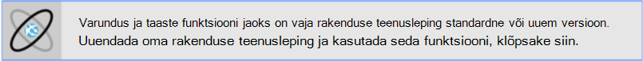
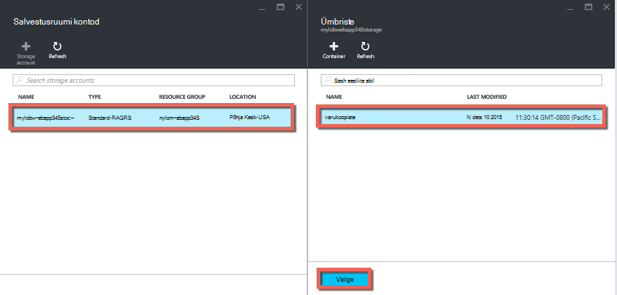
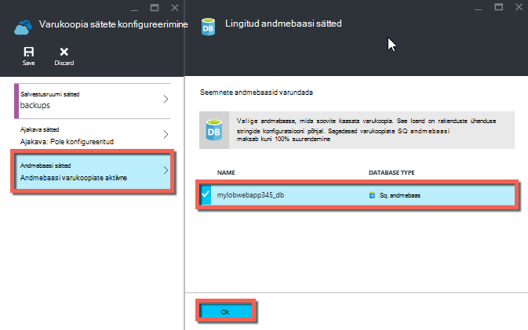
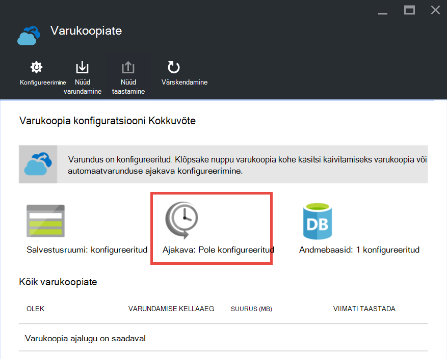

<properties 
    pageTitle="Rakenduse Azure varundamine" 
    description="Saate teada, kuidas teie rakendused teenuses Azure rakenduse varundamiseks." 
    services="app-service" 
    documentationCenter="" 
    authors="cephalin" 
    manager="wpickett" 
    editor="jimbe"/>

<tags 
    ms.service="app-service" 
    ms.workload="na" 
    ms.tgt_pltfrm="na" 
    ms.devlang="na" 
    ms.topic="article" 
    ms.date="07/06/2016" 
    ms.author="cephalin"/>

# Rakenduse Azure varundamine

[Azure'i rakendust Service](../app-service/app-service-value-prop-what-is.md) varundus ja taaste funktsiooni abil saate hõlpsalt luua rakenduse varukoopiaid automaatselt või käsitsi. Saate rakenduse eelmise oleku taastada või luua uue rakenduse ühe algse rakenduse varukoopiate põhjal. 

Rakenduse varukoopia põhjal taastamise kohta leiate teemast [rakenduse Azure taastamine](web-sites-restore.md).

## Mida saab varundada 
Rakenduse teenuse saab varundada järgmine teave:

* Rakenduse konfigureerimine
* Faili sisu
* Mis tahes Azure SQL-i andmebaasid või (ClearDB) Azure'i MySQL-i andmebaaside ühendatud rakenduse (soovi korral saate need, mida soovite varundada)

See teave on varundatud Azure storage konto ja teie määratud ümbrises. 

> [AZURE.NOTE] Iga varundus on täielik ühenduseta koopia rakenduste korral pole suureneva värskendust.

## Nõuded ja piirangud

* Varundus ja taaste funktsiooni jaoks on vaja rakenduse teenusleping olema **Standard** taseme või uuem versioon. Rakenduse teenusleping kasutada jõudmine skaleerimist kohta leiate lisateavet teemast [üles rakendus Azure skaala](web-sites-scale.md). Pange tähele, et **Premium** taseme võimaldab igapäevane varukoopiate suuremat arvu kui **normaliseeritud** taseme.
* Peate Azure storage konto ja container sama tellimuse rakendusena, mida soovite varundada. Teemast Azure storage kontode kohta leiate lisateavet käesoleva artikli lõpus [lingid](#moreaboutstorage) .
* Varukoopiate võib olla kuni 10GB rakendus ja andmebaasi sisu. Saate tõrke, kui varukoopia maht ületab selle piirmäära. 

## Käsitsi varukoopia loomine

2. [Azure portaali](https://portal.azure.com), liikuge oma rakenduse blade, valige **sätted**ja seejärel **varukoopiad**. **Varukoopiate** tera kuvatakse.
    
    ![Varukoopiate leht][ChooseBackupsPage]

    >[AZURE.NOTE]Kui näete teadet, mis on allpool, klõpsake seda uuendada oma rakenduse teenusleping enne jätkamist varukoopiad.
Lisateabe saamiseks vaadake [üles rakendus Azure skaala](web-sites-scale.md) .  
    >

3. **Varukoopiate** tera, klõpsake **salvestusruumi: pole konfigureeritud** salvestusruumi konto konfigureerimine.

    ![Salvestusruumi konto valimine][ChooseStorageAccount]
    
4. Valige oma varukoopia sihtkoht **Salvestusruumi konto** ja **ümbrises**. Salvestusruumi konto peab kuuluma ühe tellimuse rakendusena, mida soovite varundada. Soovi korral saate luua uue salvestusruumi konto või uue container vastav labad. Kui olete lõpetanud, klõpsake nuppu **Vali**.
    
    
    
5. **Varundus sätete konfigureerimine** tera, mis on ikka avatud, **Andmebaasi**sätted, seejärel valige andmebaase, mida soovite kaasata varukoopiate (SQL-andmebaasi või MySQL-i), siis nuppu **OK**.  

    

    > [AZURE.NOTE]  Selles loendis kuvada andmebaasi kuuluma oma ühendusstring **ühendusstringi** jaotises **rakenduse sätted** tera oma rakenduse.

6. **Varundus sätete konfigureerimine** tera, klõpsake nuppu **Salvesta**.  

7. **Varukoopiate** tera käsuriba, klõpsake nuppu **Varundus kohe**.
    
    ![BackUpNow nupp][BackUpNow]
    
    Varunduse ajal kuvatakse poolelioleva sõnumi.

Kui olete konfigureerinud salvestusruumi konto ja container varufailide, saate teha käsitsi varukoopia igal ajal.  

## Automaatse varundamise funktsiooni konfigureerimine

1. **Varukoopiate** tera, klõpsake **ajakava: pole konfigureeritud**. 

    
    
1. Enne **Ajakava varundussätted** , määratud **Ajastatud varukoopia** **kohta**, konfigureerida varunduse ajakava vastavalt soovile ja klõpsake nuppu **OK**.
    
    ![Automaatse varundamise funktsiooni lubamine][SetAutomatedBackupOn]
    
4. **Varukoopia sätete konfigureerimine** tera, mis on ikka avatud, klõpsake nuppu **Talletusmahu**ja seejärel valige soovitud **Salvestusruumi konto** ja **Container**varukoopia sihtkoht. Salvestusruumi konto peab kuuluma ühe tellimuse rakendusena, mida soovite varundada. Soovi korral saate luua uue salvestusruumi konto või uue container vastav labad. Kui olete lõpetanud, klõpsake nuppu **Vali**.
    
    
    
5. **Varundamise sätete konfigureerimine** tera, **Andmebaasi**sätted, seejärel valige andmebaase, mida soovite kaasata varukoopiate (SQL-andmebaasi või MySQL-i), siis nuppu **OK**.  

    

    > [AZURE.NOTE]  Selles loendis kuvada andmebaasi kuuluma oma ühendusstring **ühendusstringi** jaotises **rakenduse sätted** tera oma rakenduse.

6. **Varundus sätete konfigureerimine** tera, klõpsake nuppu **Salvesta**.  

## Varukoopia lihtsalt osa rakenduse

Mõnikord ei soovi varundada kõik teie rakendus. Siin on mõned näited:

-   Saate [nädala varukoopiate häälestamine](web-sites-backup.md#configure-automated-backups) rakenduse, mis sisaldab staatiliseks sisuks, mis kunagi muutub, nt vana ajaveebipostituste või pilte.
-   Rakenduse on üle 10GB sisu (mis on maksimaalne summa, saate korraga varundada).
-   Te ei soovi logifailide varundada.

Osalise varukoopiate võimaldab teil valida täpselt, milliseid faile, mida soovite varundada.

### Varukoopia failide välistamine

Failide ja kaustade välistamine varukoopiate salvestamiseks luua mõne `_backup.filter` salvestage oma rakenduse D:\home\site\wwwroot kausta ja määrake loendi failid ja kaustad, mille soovite välistada seal. Lihtne sellele on [Kudu konsooli](https://github.com/projectkudu/kudu/wiki/Kudu-console)kaudu. 

Oletame, et teil on rakendus, mis sisaldab logifailid ja staatilised pildid viimase aasta, mis on ei muutu. Teil on juba täielik varukoopia rakendus, mis sisaldab vanu pilte. Nüüd soovite varundada rakenduse iga päev, kuid te ei soovi logifailid või staatilise pildi failid, mis ei muutu kunagi talletamise eest maksta.

![Logib kausta][LogsFolder]
![kausta Pildid.][ImagesFolder]
    
Selle all juhiseid kuvamine, kuidas soovite välistada need failid varukoopia.

1. Minge `http://{yourapp}.scm.azurewebsites.net/DebugConsole` ja tuvastada, kaustad, mida soovite oma varukoopiate põhjal välja jätta. Selles näites oleks soovite välistada järgmised failid ja kaustad, mis on selle Kasutajaliidese näidatud:

        D:\home\site\wwwroot\Logs
        D:\home\LogFiles
        D:\home\site\wwwroot\Images\2013
        D:\home\site\wwwroot\Images\2014
        D:\home\site\wwwroot\Images\brand.png

    [AZURE.NOTE] Viimane rida näitab, et jätta üksikisikute faile kui ka kaustu.

2. Looge fail nimega `_backup.filter` ja sellele ülaltoodud loendis faili, kuid eemaldada `D:\home`. Loendist ühe kausta või faili rea kohta. Nii, et faili sisu peaks olema:

    \site\wwwroot\Logs \LogFiles \site\wwwroot\Images\2013 \site\wwwroot\Images\2014 \site\wwwroot\Images\brand.png

3. Kui soovite seda faili üles laadida soovitud `D:\home\site\wwwroot\` kataloog [ftp](web-sites-deploy.md#ftp) või mõne muu meetodi abil teie saidile. Soovi korral saate luua faili otse `http://{yourapp}.scm.azurewebsites.net/DebugConsole` ja seal sisu lisada.

4. Varukoopiate samal viisil soovite tavaliselt teha seda, [automaatselt](#configure-automated-backups)või [käsitsi](#create-a-manual-backup) käivitamine

Nüüd, mis tahes faile ja kaustu, mis on määratud `_backup.filter` välistatakse varukoopia. Selles näites logifailid ja pildifaile 2013 – 2014 enam varundatakse, samuti brand.png.

>[AZURE.NOTE] Saate taastada osalise varukoopiate saidi samamoodi [taastamine regulaarse varundamise](web-sites-restore.md)samal viisil. Taastamine tuleb teha õigesti.
>
>Täielik varukoopia taastamisel asendatakse kõik, mis on varukoopia kogu saidi sisu. Kui fail on saidil, kuid mitte varukoopia saab kustutada. Kuid osalise varukoopia taastamisel mis tahes sisu, mis asub ühes musta nimekirja kantud kataloogide või mis tahes musta nimekirja kantud fail on veel jäänud on.

## Kuidas salvestatakse varukoopiate

Kui olete teinud varukoopiate ühe või mitme oma rakenduse, varukoopiaid **ümbriste** enne konto talletusmahu kui ka rakenduse nähtav. Salvestusruumi konto, koosneb iga varukoopia ZIP-faili, mis sisaldab varundatud andmete ja XML-faili, mis sisaldab transiidideklaratsioonina ZIP-faili sisu. Saate pakkige see lahti ja nende failide sirvimine, kui soovite juurde ilma tegelikult on rakenduse taastamine varukoopiate salvestamiseks.

Andmebaasi varundamine rakenduse talletatakse juurkaustas ZIP-faili. SQL-andmebaasi, on BACPAC faili (faili laiend) ja seda saab importida. Uue SQL-andmebaasi põhjal BACPAC ekspordi loomiseks vaadake teemat [kasutaja uue andmebaasi loomiseks BACPAC faili importimine](http://technet.microsoft.com/library/hh710052.aspx).

> [AZURE.WARNING] Faile oma **websitebackups** ümbrises muutmata, võivad põhjustada sobimatu ja seetõttu mitte-tagastatav varukoopia.

## Järgmised sammud
Rakenduse varukoopia põhjal taastamise kohta leiate teemast [rakenduse Azure taastamine](web-sites-restore.md). Te saate ka varundus ja taaste rakendust Service rakenduste abil REST API-ga (vt [Kasutamine ülejäänud varundamine ja taastamine rakenduse rakendused](websites-csm-backup.md)).

>[AZURE.NOTE] Kui soovite alustada Azure'i rakendust Service enne Azure'i konto kasutajaks, minge [Proovige rakenduse teenus](http://go.microsoft.com/fwlink/?LinkId=523751), kus saate kohe luua lühiajaline starter web app rakenduse teenus. Nõutav; krediitkaardid kohustusi.

<!-- IMAGES -->
[ChooseBackupsPage]: ./media/web-sites-backup/01ChooseBackupsPage.png
[ChooseStorageAccount]: ./media/web-sites-backup/02ChooseStorageAccount.png
[IncludedDatabases]: ./media/web-sites-backup/03IncludedDatabases.png
[BackUpNow]: ./media/web-sites-backup/04BackUpNow.png
[BackupProgress]: ./media/web-sites-backup/05BackupProgress.png
[SetAutomatedBackupOn]: ./media/web-sites-backup/06SetAutomatedBackupOn.png
[Frequency]: ./media/web-sites-backup/07Frequency.png
[StartDate]: ./media/web-sites-backup/08StartDate.png
[StartTime]: ./media/web-sites-backup/09StartTime.png
[SaveIcon]: ./media/web-sites-backup/10SaveIcon.png
[ImagesFolder]: ./media/web-sites-backup/11Images.png
[LogsFolder]: ./media/web-sites-backup/12Logs.png
[GhostUpgradeWarning]: ./media/web-sites-backup/13GhostUpgradeWarning.png
 
