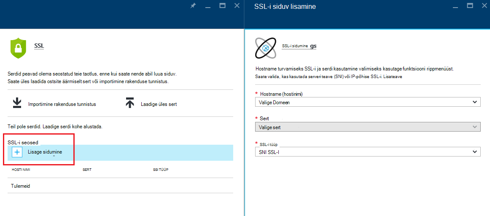
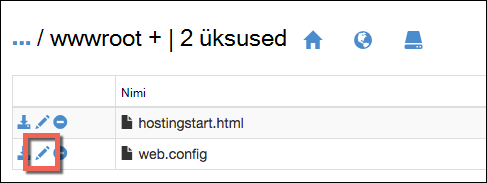

<properties
    pageTitle="Secure oma rakenduse kohandatud domeeni HTTPS | Microsoft Azure'i"
    description="Siit saate teada, kui turvaliseks kohandatud domeeninime oma rakenduse teenuses Azure rakenduse konfigureerimine on SSL-serdi sidumine. Samuti saate teada, kuidas saada SSL-serdi mitme tööriistad."
    services="app-service"
    documentationCenter=".net"
    authors="cephalin"
    manager="wpickett"
    editor="jimbe"
    tags="top-support-issue"/>

<tags
    ms.service="app-service"
    ms.workload="na"
    ms.tgt_pltfrm="na"
    ms.devlang="na"
    ms.topic="article"
    ms.date="08/08/2016"
    ms.author="cephalin"/>

# Secure oma rakenduse kohandatud domeeni https-iga

> [AZURE.SELECTOR]
- [SSL-i cert Azure ostmine](web-sites-purchase-ssl-web-site.md)
- [Kasutage SSL cert mujalt](web-sites-configure-ssl-certificate.md)

Selles artiklis kirjeldatakse web appi, mobiilirakenduse kirjutamata või [Azure'i rakendust Service](../app-service/app-service-value-prop-what-is.md) , mis kasutab kohandatud domeeninime API rakenduse HTTPS lubamise kohta. See hõlmab ainult serveri autentimine. Kui vajate vastastikune autentimine (sh kliendi autentimine), lugege teemat [Kuidas soovite konfigureerida TLS vastastikune autentimine teenuse rakendus](app-service-web-configure-tls-mutual-auth.md).

Turvaline https-iga rakendus, mis sisaldab kohandatud domeeninime, lisage domeeninime sert. Vaikimisi Azure'i tagab soovitud ** \*. azurewebsites.net** ühe SSL-serdi, et teie kliendid pääsevad juba rakenduse juures domeeni metamärkide * *https://*&lt;rakendusenimi >*. azurewebsites.net**. Aga kui te ei soovi kohandatud domeeni kasutada, nagu **contoso.com**; **www.contoso.com**, ja ** \*. contoso.com**, vaikimisi serti ei saa tagada, et. Lisaks kõik [metamärkide serdid](https://casecurity.org/2014/02/26/pros-and-cons-of-single-domain-multi-domain-and-wildcard-certificates/), nt vaikimisi serti ei ole turvaliseks kohandatud domeeni, kasutades kohandatud domeeni ja sert.   

>[AZURE.NOTE] Saate igal ajal sisse [Azure Foorumid](https://azure.microsoft.com/support/forums/)Azure eksperdid abi. Rohkem isikupärastatud toe saamiseks minge [Azure tugiteenuste](https://azure.microsoft.com/support/options/) ja klõpsake nuppu **Saada toetavad**.

## Mida on vaja
Oma kohandatud domeeninime HTTPS turvamiseks seote kohandatud SSL-serdi Azure kohandatud domeeni. Köitmine kohandatud sert, peate tegema järgmist:

- **Kohandatud domeeni konfigureerimine** - rakenduse teenuse laseb domeeni nimi, mis on juba konfigureeritud rakenduse serdi lisamine. Lisateabe saamiseks vaadake [kaarti Azure rakendusele kohandatud domeeninime](web-sites-custom-domain-name.md). 
- **Skaala kuni lihtsa taseme või uuem versioon** Rakenduse plaanide määras hinnakirjad ei toeta kohandatud SSL-sertide. Juhised leiate teemast [üles rakendus Azure skaala](web-sites-scale.md). 
- **SSL-serdi hankimine** – kui teil pole veel üks, vajate ühte usaldusväärne [sertimiskeskus](http://en.wikipedia.org/wiki/Certificate_authority) (CA). Serdi peab vastama järgmistele nõuetele.

    - See on allkirjastatud usaldusväärse CA (pole privaatne CA serverid).
    - See sisaldab privaatvõti.
    - See on loodud võtme Exchange'i ja eksporditud lisamine. PFX-fail.
    - Seda kasutatakse vähemalt 2048-bitine krüptimine.
    - Selle teema nimi vastab kohandatud domeeni, tuleb tagada. Tagada ühe serdiga mitu domeeni, peate kasutama metamärkide nimi (nt ** \*. contoso.com**) või subjectAltName väärtuste määramiseks.
    - See on ühendatud teie poolt kasutatud kõik **[vahe serdid](http://en.wikipedia.org/wiki/Intermediate_certificate_authorities)** . Muul juhul võite käivitada kordumatus interoperability probleeme osa kliente.

        >[AZURE.NOTE] Lihtsaim viis saada SSL-sert, mis vastab kõigile on         [ostmise Azure otse portaalis](web-sites-purchase-ssl-web-site.md). Selles artiklis kirjeldatakse, kuidas seda teha käsitsi ja seejärel siduda see oma kohandatud domeeni rakenduse teenuses.
        >   
        > **Elliptiline kõver krüptograafia (ECC) sertide** saate töötada rakenduse teenusega, kuid selles artiklis väljapoole. Töötada oma CA täpsed juhised ECC sertifikaatide loomiseks.

## Samm 1. SSL-serdi hankimine

Kuna CAs pakuvad SSL-i serdi erinevate hind punktides, tuleks Alustuseks otsustada, millist tüüpi SSL-serdi osta. Ühe domeeni nimi (**www.contoso.com**) kaitsta, peate lihtsa sert. Mitme domeeninime turvamiseks (**contoso.com** *ning* **www.contoso.com** 
*ning* **mail.contoso.com**), peate kas [metamärgiga serdi](http://en.wikipedia.org/wiki/Wildcard_certificate) või [Teema alternatiivne nimi](http://en.wikipedia.org/wiki/SubjectAltName) serti (`subjectAltName`).

Kui teate, milline SSL-serdi osta, saadate on serdi allkirjastamise taotlemine (CSR) on ca. Kui teile kuvatakse sertifikaat tagasi CA, saate luua seejärel pfx-fail sert. Saate teha järgmist teie valitud tööriista abil. Siit leiate juhised levinud Tööriistad:

- [Certreq.exe juhiseid](#bkmk_certreq) - Windows kasuliku serdi taotlusi loomise kohta. See on osa Windows alates Windows XP ja Windows Server 2000.
- [IIS-i halduri juhiseid](#bkmk_iismgr) - valik, kui olete juba tuttav seda tööriista.
- [OpenSSL juhiseid](#bkmk_openssl) - on [avatud lähtekoodi, mitu platvormi tööriista](https://www.openssl.org). Selle abil saate aitavad teil SSL-serdi mis tahes platvormi.
- [subjectAltName juhiseid kasutades OpenSSL](#bkmk_subjectaltname) - toimingud saada `subjectAltName` serdid.

Kui soovite testida häälestamine rakenduse teenuses enne ostmist sert, saate luua [iseallkirjastatud sert](https://en.wikipedia.org/wiki/Self-signed_certificate). Selle õpetuse annab teile luua kaks võimalust:

- [Iseallkirjastatud serdi Certreq.exe järgmiselt.](#bkmk_sscertreq)
- [Iseallkirjastatud serdi OpenSSL järgmiselt.](#bkmk_ssopenssl)

### Hankige sert Certreq.exe abil

1. Luua faili (nt **myrequest.txt**), kopeerige see järgmine tekst ja salvestage see töötavat kausta. Asendada selle `<your-domain>` kohatäite rakenduse kohandatud domeeni nime.

        [NewRequest]
        Subject = "CN=<your-domain>"  ; E.g. "CN=www.contoso.com", or "CN=*.contoso.com" for a wildcard certificate
        Exportable = TRUE
        KeyLength = 2048              ; Required minimum is 2048
        KeySpec = 1
        KeyUsage = 0xA0
        MachineKeySet = True
        ProviderName = "Microsoft RSA SChannel Cryptographic Provider"
        ProviderType = 12
        HashAlgorithm = SHA256

        [EnhancedKeyUsageExtension]
        OID=1.3.6.1.5.5.7.3.1         ; Server Authentication

    Selle CSR suvandid ja muude saadaolevate suvandite kohta leiate lisateavet teemast [Certreq dokumentides](https://technet.microsoft.com/library/dn296456.aspx).

4. Tippige käsuviibas, `CD` oma töötavat kausta ja Käivita järgmine käsk on CSR loomiseks:

        certreq -new myrequest.txt myrequest.csr

    **myrequest.CSR** on loodud oma praegust töötavat kausta.

5. Esitage **myrequest.csr** CA, saada SSL-sert. Saate laadige fail üles või kopeerige sisu tekstiredaktoris veebivormi.

    Usaldusväärsed Microsoft CAs loendi leiate teemast [Microsofti usaldusväärsed juursertide programmis: osalejate][cas].

6. Kui CA on vastanud teie sertifikaadiga (. CER) faili, salvestage see oma töötavat kausta. Käivitage järgmine käsk ootel CSR lõpuleviimiseks.

        certreq -accept -user <certificate-name>.cer

    See käsk salvestab lõpetanud serdi sert Windowsi poest.

6. Kui teie CA kasutab vahe serdid, installige need enne jätkamist. Tavaliselt neis on eraldi allalaadimiseks oma ca ja muu web serveritüübid mitu vormid. Valige Microsoft IIS versioon.

    Kui olete alla serdid, paremklõpsake iga toote Windows Exploreris ja valige  **serdi installimine**. **Serdi impordiviisardi**kasutamine vaikeväärtused ja jätkata, valides **edasi** kuni importimine on lõpule viidud.

7. SSL-serdi eksportimine certificate store, vajutage `Win` + `R` ja Käivita **tekst certmgr.msc** serdi halduri käivitada. Valige **isiklike** > **serdid**. Veerus **Välja** peaksite nägema oma kohandatud domeeni nimi ja serdi **Väljaandja järgi** veeru genereerimiseks kasutatud CA kirje.

    ![pildi cert halduri siin][certmgr]

9. Paremklõpsake seda serti ja valige käsk **Kõik tööülesanded** > **eksportida**. **Serdi ekspordiviisardi**klõpsake nuppu **edasi**, valige **Jah, ekspordi privaatvõti**, ja klõpsake nuppu **edasi** uuesti.

    ![Ekspordi privaatvõti][certwiz1]

10. Valige **Isikliku teabe vahetus – PKCS #12**, **kaasata kõik serdid sert tee võimalusel**ja **Ekspordi kõik laiendatud atribuudid**. Klõpsake nuppu **edasi**.

    ![Kõik certs ja laiendatud atribuudid][certwiz2]

11. Valige **parool**, sisestage ja kinnitage parool. Klõpsake nuppu **edasi**.

    ![parooli määramine][certwiz3]

12. Eksporditud serdi laiend **pfx**ette tee ja faili nimi. Klõpsake nuppu **Järgmine** lõpuleviimiseks.

    ![faili tee][certwiz4]

Nüüd olete valmis rakenduse teenuse eksporditud PFX-fail üles laadida. Vt [etappi 2. Üles- ja kohandatud SSL-serdi siduda](#bkmk_configuressl).

### Hankige sert IIS-i halduri abil

1. Luua vastutuse koos IIS-i halduri CA saata. Vastutuse loomise kohta leiate lisateavet teemast [taotlemine Interneti-Serveri sert (IIS 7)][iiscsr].

3. Esitage oma CSR CA, saada SSL-sert. Usaldusväärsed Microsoft CAs loendi leiate teemast [Microsofti usaldusväärsed juursertide programmis: osalejate][cas].

3. Täitke CSR sertifikaadiga, mis CA saadab teile. Funktsiooni CSR lõpuleviimine kohta leiate lisateavet teemast [installida Interneti-Serveri sert (IIS 7)][installcertiis].

4. Kui teie CA kasutab vahe serdid, installige need enne jätkamist. Tavaliselt neis on eraldi allalaadimiseks oma ca ja muu web serveritüübid mitu vormid. Valige Microsoft IIS versioon.

    Kui olete alla serdid, paremklõpsake iga toote Windows Exploreris ja valige **serdi installimine**. 
    **Serdi impordiviisardi**kasutamine vaikeväärtused ja jätkata, valides **edasi** kuni importimine on lõpule viidud.

4. SSL-serdi eksportida IIS-i haldur. Serdi eksportimise kohta leiate lisateavet teemast [eksportida Server (IIS 7)][exportcertiis]. 

    >[AZURE.IMPORTANT] **Serdi ekspordiviisardi**veenduge, et valite **Jah, ekspordi privaatvõti**  
    >
    >![Ekspordi privaatvõti][certwiz1]  
    >
    > Valige ka **Isikuandmete vahetus – PKCS #12**, **kaasata kõik serdid sert tee võimalusel**ja     **Ekspordi kõik laiendatud atribuudid**.
    >
    >![Kõik certs ja laiendatud atribuudid][certwiz2]

Nüüd olete valmis rakenduse teenuse eksporditud PFX-fail üles laadida. Vt [etappi 2. Üles- ja kohandatud SSL-serdi siduda](#bkmk_configuressl).

### Hankige sert OpenSSL abil

1. Mõne käsurea terminalis `CD` töötamise kataloogi luua privaatvõti ja CSR, käivitage järgmine käsk:

        openssl req -sha256 -new -nodes -keyout myserver.key -out server.csr -newkey rsa:2048

2. Küsimise korral sisestage asjakohane teave. Näiteks:

        Country Name (2 letter code)
        State or Province Name (full name) []: Washington
        Locality Name (eg, city) []: Redmond
        Organization Name (eg, company) []: Microsoft
        Organizational Unit Name (eg, section) []: Azure
        Common Name (eg, YOUR name) []: www.microsoft.com
        Email Address []:

        Please enter the following 'extra' attributes to be sent with your certificate request

        A challenge password []:

    Kui olete lõpetanud, peaksite on kaks faili kataloogis töötamine: **myserver.key** ja **server.csr**. 
    **Server.csr** sisaldab selle CSR ja **myserver.key** hiljem vaja.

3. Esitage oma CSR CA, saada SSL-sert. Usaldusväärsed Microsoft CAs loendi leiate teemast [Microsofti usaldusväärsed juursertide programmis: osalejate][cas].

4. Kui CA saadab teile taotletud serti, salvestage fail nimega **myserver.crt** kataloogis töötamine. Kui teie CA pakub seda teksti vormingus, lihtsalt Kopeerige sisu **myserver.crt** tekstiredaktoris ja salvestage see. Faili peaks välja nägema umbes selline:

        -----BEGIN CERTIFICATE-----
        MIIDJDCCAgwCCQCpCY4o1LBQuzANBgkqhkiG9w0BAQUFADBUMQswCQYDVQQGEwJV
        UzELMAkGA1UECBMCV0ExEDAOBgNVBAcTB1JlZG1vbmQxEDAOBgNVBAsTB0NvbnRv
        c28xFDASBgNVBAMTC2NvbnRvc28uY29tMB4XDTE0MDExNjE1MzIyM1oXDTE1MDEx
        NjE1MzIyM1owVDELMAkGA1UEBhMCVVMxCzAJBgNVBAgTAldBMRAwDgYDVQQHEwdS
        ZWRtb25kMRAwDgYDVQQLEwdDb250b3NvMRQwEgYDVQQDEwtjb250b3NvLmNvbTCC
        ASIwDQYJKoZIhvcNAQEBBQADggEPADCCAQoCggEBAN96hBX5EDgULtWkCRK7DMM3
        enae1LT9fXqGlbA7ScFvFivGvOLEqEPD//eLGsf15OYHFOQHK1hwgyfXa9sEDPMT
        3AsF3iWyF7FiEoR/qV6LdKjeQicJ2cXjGwf3G5vPoIaYifI5r0lhgOUqBxzaBDZ4
        xMgCh2yv7NavI17BHlWyQo90gS2X5glYGRhzY/fGp10BeUEgIs3Se0kQfBQOFUYb
        ktA6802lod5K0OxlQy4Oc8kfxTDf8AF2SPQ6BL7xxWrNl/Q2DuEEemjuMnLNxmeA
        Ik2+6Z6+WdvJoRxqHhleoL8ftOpWR20ToiZXCPo+fcmLod4ejsG5qjBlztVY4qsC
        AwEAATANBgkqhkiG9w0BAQUFAAOCAQEAVcM9AeeNFv2li69qBZLGDuK0NDHD3zhK
        Y0nDkqucgjE2QKUuvVSPodz8qwHnKoPwnSrTn8CRjW1gFq5qWEO50dGWgyLR8Wy1
        F69DYsEzodG+shv/G+vHJZg9QzutsJTB/Q8OoUCSnQS1PSPZP7RbvDV9b7Gx+gtg
        7kQ55j3A5vOrpI8N9CwdPuimtu6X8Ylw9ejWZsnyy0FMeOPpK3WTkDMxwwGxkU3Y
        lCRTzkv6vnHrlYQxyBLOSafCB1RWinN/slcWSLHADB6R+HeMiVKkFpooT+ghtii1
        A9PdUQIhK9bdaFicXPBYZ6AgNVuGtfwyuS5V6ucm7RE6+qf+QjXNFg==
        -----END CERTIFICATE-----

5. Käsurea terminalis, **myserver.pfx** eksportimine **myserver.key** ja **myserver.crt**järgmine käsk:

        openssl pkcs12 -export -out myserver.pfx -inkey myserver.key -in myserver.crt

    Vastava viiba kuvamisel määratleda parooli secure pfx-fail.

    > [AZURE.NOTE] Kui teie CA kasutab vahe serdid, peate lisama neile on `-certfile` parameeter. Tavaliselt neis on eraldi allalaadimiseks oma ca ja muu web serveritüübid mitu vormid. Valige versioon, kus on `.pem` laiendamine.
    >
    > Teie `openssl -export` käsk peaks välja nägema järgmine näide, mis loob pfx faili, mis sisaldab vahe serdid **vahelink – cets.pem** failist:
    >  
    > `openssl pkcs12 -chain -export -out myserver.pfx -inkey myserver.key -in myserver.crt -certfile intermediate-cets.pem`

Nüüd olete valmis rakenduse teenuse eksporditud PFX-fail üles laadida. Vt [etappi 2. Üles- ja kohandatud SSL-serdi siduda](#bkmk_configuressl).

### Hankige sert SubjectAltName OpenSSL abil

1. Looge fail nimega **sancert.cnf**, kopeerige see järgmine tekst ja salvestage see töötavat kausta:

        # -------------- BEGIN custom sancert.cnf -----
        HOME = .
        oid_section = new_oids
        [ new_oids ]
        [ req ]
        default_days = 730
        distinguished_name = req_distinguished_name
        encrypt_key = no
        string_mask = nombstr
        req_extensions = v3_req # Extensions to add to certificate request
        [ req_distinguished_name ]
        countryName = Country Name (2 letter code)
        countryName_default =
        stateOrProvinceName = State or Province Name (full name)
        stateOrProvinceName_default =
        localityName = Locality Name (eg, city)
        localityName_default =
        organizationalUnitName  = Organizational Unit Name (eg, section)
        organizationalUnitName_default  =
        commonName              = Your common name (eg, domain name)
        commonName_default      = www.mydomain.com
        commonName_max = 64
        [ v3_req ]
        subjectAltName=DNS:ftp.mydomain.com,DNS:blog.mydomain.com,DNS:*.mydomain.com
        # -------------- END custom sancert.cnf -----

    Joon, mis algab `subjectAltName`, asendage väärtus väärtusega soovite kõik domeeninimed (lisaks  `commonName`). Näiteks:

        subjectAltName=DNS:sales.contoso.com,DNS:support.contoso.com,DNS:fabrikam.com

    Teil pole vaja muuta mõne muu välja, sh `commonName`. Teil palutakse nende toimingutega määramiseks.

1. Mõne käsurea terminalis `CD` oma töötavat kausta ja Käivita järgmine käsk:

        openssl req -sha256 -new -nodes -keyout myserver.key -out server.csr -newkey rsa:2048 -config sancert.cnf

2. Küsimise korral sisestage asjakohane teave. Näiteks:

        Country Name (2 letter code) []: US
        State or Province Name (full name) []: Washington
        Locality Name (eg, city) []: Redmond
        Organizational Unit Name (eg, section) []: Azure
        Your common name (eg, domain name) []: www.microsoft.com

    Kui olete lõpetanud, peaksite on kaks faili kataloogis töötamine: **myserver.key** ja **server.csr**. 
    **Server.csr** sisaldab selle CSR, ja **myserver.key** hiljem vaja.

3. Esitage oma CSR CA, saada SSL-sert. Usaldusväärsed Microsoft CAs loendi leiate teemast [Microsofti usaldusväärsed juursertide programmis: osalejate][cas].

4. Kui CA saadab teile taotletud serti, salvestage fail nimega **myserver.crt**. Kui teie CA pakub seda teksti vormingus, lihtsalt Kopeerige sisu **myserver.crt** tekstiredaktoris ja salvestage see. Faili peaks välja nägema umbes selline:

        -----BEGIN CERTIFICATE-----
        MIIDJDCCAgwCCQCpCY4o1LBQuzANBgkqhkiG9w0BAQUFADBUMQswCQYDVQQGEwJV
        UzELMAkGA1UECBMCV0ExEDAOBgNVBAcTB1JlZG1vbmQxEDAOBgNVBAsTB0NvbnRv
        c28xFDASBgNVBAMTC2NvbnRvc28uY29tMB4XDTE0MDExNjE1MzIyM1oXDTE1MDEx
        NjE1MzIyM1owVDELMAkGA1UEBhMCVVMxCzAJBgNVBAgTAldBMRAwDgYDVQQHEwdS
        ZWRtb25kMRAwDgYDVQQLEwdDb250b3NvMRQwEgYDVQQDEwtjb250b3NvLmNvbTCC
        ASIwDQYJKoZIhvcNAQEBBQADggEPADCCAQoCggEBAN96hBX5EDgULtWkCRK7DMM3
        enae1LT9fXqGlbA7ScFvFivGvOLEqEPD//eLGsf15OYHFOQHK1hwgyfXa9sEDPMT
        3AsF3iWyF7FiEoR/qV6LdKjeQicJ2cXjGwf3G5vPoIaYifI5r0lhgOUqBxzaBDZ4
        xMgCh2yv7NavI17BHlWyQo90gS2X5glYGRhzY/fGp10BeUEgIs3Se0kQfBQOFUYb
        ktA6802lod5K0OxlQy4Oc8kfxTDf8AF2SPQ6BL7xxWrNl/Q2DuEEemjuMnLNxmeA
        Ik2+6Z6+WdvJoRxqHhleoL8ftOpWR20ToiZXCPo+fcmLod4ejsG5qjBlztVY4qsC
        AwEAATANBgkqhkiG9w0BAQUFAAOCAQEAVcM9AeeNFv2li69qBZLGDuK0NDHD3zhK
        Y0nDkqucgjE2QKUuvVSPodz8qwHnKoPwnSrTn8CRjW1gFq5qWEO50dGWgyLR8Wy1
        F69DYsEzodG+shv/G+vHJZg9QzutsJTB/Q8OoUCSnQS1PSPZP7RbvDV9b7Gx+gtg
        7kQ55j3A5vOrpI8N9CwdPuimtu6X8Ylw9ejWZsnyy0FMeOPpK3WTkDMxwwGxkU3Y
        lCRTzkv6vnHrlYQxyBLOSafCB1RWinN/slcWSLHADB6R+HeMiVKkFpooT+ghtii1
        A9PdUQIhK9bdaFicXPBYZ6AgNVuGtfwyuS5V6ucm7RE6+qf+QjXNFg==
        -----END CERTIFICATE-----

5. Käsurea terminalis, **myserver.pfx** eksportimine **myserver.key** ja **myserver.crt**järgmine käsk:

        openssl pkcs12 -export -out myserver.pfx -inkey myserver.key -in myserver.crt

    Vastava viiba kuvamisel määratleda parooli secure pfx-fail.

    > [AZURE.NOTE] Kui teie CA kasutab vahe serdid, peate lisama neile on `-certfile` parameeter. Tavaliselt neis on eraldi allalaadimiseks oma ca ja muu web serveritüübid mitu vormid. Valige versioon, kus on `.pem` laiend).
    >
    > Teie `openssl -export` käsk peaks välja nägema järgmine näide, mis loob pfx faili, mis sisaldab vahe serdid **vahelink – cets.pem** failist:
    >  
    > `openssl pkcs12 -chain -export -out myserver.pfx -inkey myserver.key -in myserver.crt -certfile intermediate-cets.pem`

Nüüd olete valmis rakenduse teenuse eksporditud PFX-fail üles laadida. Vt [etappi 2. Üles- ja kohandatud SSL-serdi siduda](#bkmk_configuressl).

### Luua iseallkirjastatud serdi Certreq.exe abil ###

>[AZURE.IMPORTANT] Iseallkirjastatud serdid on ainult katsetamiseks. Enamiku brauserite tagasi vigu, kui mõni veebileht, mis on tagatud iseallkirjastatud sert. Mõnes brauseris võib isegi keelduda liikuge sellele saidile. 

1. Luua tekstifaili (nt **mycert.txt**), kopeerige see järgmine tekst ja töötavat kausta faili salvestada. Asendada selle `<your-domain>` kohatäite rakenduse kohandatud domeeni nime.

        [NewRequest]
        Subject = "CN=<your-domain>"  ; E.g. "CN=www.contoso.com", or "CN=*.contoso.com" for a wildcard certificate
        Exportable = TRUE
        KeyLength = 2048              ; KeyLength can be 2048, 4096, 8192, or 16384 (required minimum is 2048)
        KeySpec = 1
        KeyUsage = 0xA0
        MachineKeySet = True
        ProviderName = "Microsoft RSA SChannel Cryptographic Provider"
        ProviderType = 12
        HashAlgorithm = SHA256
        RequestType = Cert            ; Self-signed certificate
        ValidityPeriod = Years
        ValidityPeriodUnits = 1

        [EnhancedKeyUsageExtension]
        OID=1.3.6.1.5.5.7.3.1         ; Server Authentication

    Oluline parameeter on `RequestType = Cert`, mis määrab iseallkirjastatud sert. 
    Selle CSR suvandid ja muude saadaolevate suvandite kohta leiate lisateavet teemast [Certreq dokumentides](https://technet.microsoft.com/library/dn296456.aspx).

4. Käsuviip, `CD` töötavat kausta ja Käivita järgmine käsk:

        certreq -new mycert.txt mycert.crt
    
    Teie uus iseallkirjastatud sert on installitud serdi poest.

7. Serdi eksportimine certificate store, vajutage `Win` + `R` ja Käivita **tekst certmgr.msc** serdi halduri käivitada. Valige **isiklike** > **serdid**. Veerus **Välja** peaksite nägema oma kohandatud domeeni nimi ja serdi **Väljaandja järgi** veeru genereerimiseks kasutatud CA kirje.

    ![pildi cert halduri siin][certmgr]

9. Paremklõpsake seda serti ja valige käsk **Kõik tööülesanded** > **eksportida**. **Serdi ekspordiviisardi**klõpsake nuppu **edasi**, valige **Jah, ekspordi privaatvõti**, ja klõpsake nuppu **edasi** uuesti.

    ![Ekspordi privaatvõti][certwiz1]

10. Valige **Isikliku teabe vahetus – PKCS #12**, **kaasata kõik serdid sert tee võimalusel**ja **Ekspordi kõik laiendatud atribuudid**. Klõpsake nuppu **edasi**.

    ![Kõik certs ja laiendatud atribuudid][certwiz2]

11. Valige **parool**, sisestage ja kinnitage parool. Klõpsake nuppu **edasi**.

    ![parooli määramine][certwiz3]

12. Eksporditud serdi laiend **pfx**ette tee ja faili nimi. Klõpsake nuppu **Järgmine** lõpuleviimiseks.

    ![faili tee][certwiz4]

Nüüd olete valmis rakenduse teenuse eksporditud PFX-fail üles laadida. Vt [etappi 2. Üles- ja kohandatud SSL-serdi siduda](#bkmk_configuressl).

###Luua iseallkirjastatud serdi OpenSSL abil ###

>[AZURE.IMPORTANT] Iseallkirjastatud serdid on ainult katsetamiseks. Enamiku brauserite tagasi vigu, kui mõni veebileht, mis on tagatud iseallkirjastatud sert. Mõnes brauseris võib isegi keelduda liikuge sellele saidile. 

1. Luua tekstifaili nimega **serverauth.cnf**, seejärel järgmine sisu kopeerida, ja seejärel salvestage see töötavat kausta:

        [ req ]
        default_bits           = 2048
        default_keyfile        = privkey.pem
        distinguished_name     = req_distinguished_name
        attributes             = req_attributes
        x509_extensions        = v3_ca

        [ req_distinguished_name ]
        countryName         = Country Name (2 letter code)
        countryName_min         = 2
        countryName_max         = 2
        stateOrProvinceName     = State or Province Name (full name)
        localityName            = Locality Name (eg, city)
        0.organizationName      = Organization Name (eg, company)
        organizationalUnitName      = Organizational Unit Name (eg, section)
        commonName          = Common Name (eg, your app's domain name)
        commonName_max          = 64
        emailAddress            = Email Address
        emailAddress_max        = 40

        [ req_attributes ]
        challengePassword       = A challenge password
        challengePassword_min       = 4
        challengePassword_max       = 20

        [ v3_ca ]
         subjectKeyIdentifier=hash
         authorityKeyIdentifier=keyid:always,issuer:always
         basicConstraints = CA:false
         keyUsage=nonRepudiation, digitalSignature, keyEncipherment
         extendedKeyUsage = serverAuth

2. Mõne käsurea terminalis `CD` oma töötavat kausta ja Käivita järgmine käsk:

        openssl req -sha256 -x509 -nodes -days 365 -newkey rsa:2048 -keyout myserver.key -out myserver.crt -config serverauth.cnf

    See käsk loob kaks faili: **myserver.crt** (iseallkirjastatud sert) ja **myserver.key** (privaatvõti), võttes aluseks **serverauth.cnf**sätteid.

3. Serdi eksportimine pfx-fail, käivitage järgmine käsk:

        openssl pkcs12 -export -out myserver.pfx -inkey myserver.key -in myserver.crt

    Vastava viiba kuvamisel määratleda parooli secure pfx-fail.

Nüüd olete valmis rakenduse teenuse eksporditud PFX-fail üles laadida. Vt [etappi 2. Üles- ja kohandatud SSL-serdi siduda](#bkmk_configuressl).

## Samm 2. Üles- ja kohandatud SSL-serdi sidumine

Enne, kui liigute, [mida on vaja](#bkmk_domainname) jaotises ja veenduge, et:

- teil on kohandatud domeen, mille Azure rakenduse kaardid
- teie rakendus töötab **lihtsa** taseme või suurem, ja
- teil on kohandatud domeeni lisamine ca SSL-sert.

1. Brauseris avada selle ** [Azure portaali.](https://portal.azure.com/)**
2.  Klõpsake lehe vasakus servas **Rakenduse teenuse** suvandit.
3.  Klõpsake selle nime, millele soovite määrata selle serdi rakenduse. 
4.  **Sätted**, klõpsake **SSL-sertide**
5.  Klõpsake **serdi üleslaadimine**
6.  Valige eksporditud pfx-fail [Samm 1](#bkmk_getcert) ja määrake parool, mida loote enne. Klõpsake **üles** laadige üles sert. Nüüd näete oma üles laaditud serdi uuesti sisse tera **SSL-sert** .
7. **SSL-i sidumiste** lahtris klõpsake **sidumiste lisamine**
8. **Lisada SSL-i Köitmine** tera domeeninime turvamiseks SSL-i ja serdi, et kasutada valimiseks kasutage funktsiooni rippmenüüst. Saate valida, kas kasutada **[Serveri teave (SNI)](http://en.wikipedia.org/wiki/Server_Name_Indication)** või IP-põhise SSL-i.

    

       •    IP based SSL associates a certificate with a domain name by mapping the dedicated public IP address of the server to the domain name. This requires each domain name (contoso.com, fabricam.com, etc.) associated with your service to have a dedicated IP address. This is the traditional          method of associating SSL certificates with a web server.
       •    SNI based SSL is an extension to SSL and **[Transport Layer Security](http://en.wikipedia.org/wiki/Transport_Layer_Security)** (TLS) that allows multiple domains to share the same IP address, with separate security certificates for each domain. Most modern browsers (including Internet Explorer, Chrome, Firefox and Opera) support SNI, however older browsers may not support SNI. For more information on SNI, see the **[Server Name Indication](http://en.wikipedia.org/wiki/Server_Name_Indication)** article on Wikipedia.
     
9. Klõpsake muudatuste salvestamiseks ja lubada SSL-i **Lisamine Köitmine** .

## Samm 3. Muutke oma domeeni nimevastendus (IP vastavalt SSL-i ainult)

Kui kasutate ainult **SNI SSL-i** sidumiste, selle sammu vahele. Mitme **SNI SSL-i** sidumiste saate koos töötada olemasolevate ühiskasutusega IP-aadressi määratud rakenduse kohta. Siiski on **IP-põhise SSL-i** sidumine loomisel rakenduse teenus loob sidumine eriotstarbeline IP-aadress Kuna **IP-põhise SSL-i** jaoks on vaja üht. Ainult üks eesmärk on jätkuvalt IP aadressi saab luua, seetõttu tuleb lisada ainult üks **IP-põhise SSL-i** siduv.

Tõttu selle eriotstarbeline IP-aadress, peate konfigureerida rakenduse edasi, kui:

- Saate [kasutada oma kohandatud domeeni vastendamiseks A-kirje](web-sites-custom-domain-name.md#a) Azure rakenduse, ja äsja lisatud on **IP-põhise SSL-i** sidumine. Selle stsenaariumi korral peab teil Kaardistage uuesti olemasoleva kirje osutamiseks eriotstarbeline IP-aadress järgmiste juhiste järgi.

    1. Kui olete konfigureerinud IP-põhise SSL-i sidumine, eriotstarbeline IP-aadress on määratud rakenduse. **Kohandatud domeeni** lehel jaotises sätted rakenduse **hostinimed** jaotise kohal leiate IP-aadress. See kirjas **Välise IP-aadress**
    
        

    2. [Kaardistage uuesti A-kirje oma kohandatud domeeni nime uus IP-aadress](web-sites-custom-domain-name.md#a).

- Teil on juba üks või mitu **SNI SSL-i** sidumiste rakenduse ja äsja lisatud on **IP-põhise SSL-i** sidumine. Kui sidumine on lõpule jõudnud, teie * &lt;rakendusenimi >*. azurewebsites.net domeeni nimi osutab IP-aadress. Seetõttu kõik olemasolevad [kohandatud domeeni CNAME vastenduse](web-sites-custom-domain-name.md#cname) * &lt;rakendusenimi >*. azurewebsites.net, sealhulgas need, mis **SNI SSL-i** secure, saab ka uus aadress, mis on loodud selle **IP-põhise SSL-i** ainult liiklust. Selle stsenaariumi korral peate saatma **SNI SSL** -liikluse naasmiseks algse ühiskasutusega IP-aadressi järgmiste juhiste järgi:

    1. Leidke kõik [kohandatud domeeni CNAME vastendused](web-sites-custom-domain-name.md#cname) rakenduse, mis sisaldab mõnda **SNI SSL-i** sidumine.

    2. Kaardistage uuesti iga CNAME-kirje **sni.** &lt;rakendusenimi >. azurewebsites.net asemel &lt;rakendusenimi >. azurewebsites.net.

## Samm 4. Kohandatud domeeni testi HTTPS

Nüüd on kõik, mis on jäänud teha veenduge, et HTTPS töötab teie kohandatud domeeni. Erinevate brauserites, liikuge sirvides `https://<your.custom.domain>` esitab rakenduse kuvamiseks.

- Kui teie rakendus annab saate serdi valideerimise tõrkeid, kasutate ilmselt iseallkirjastatud serdi.

- Kui, mis ei ole teil võib aega välja vahe serdid oma pfx serdi eksportimisel. Minge tagasi [vajalik](#bkmk_domainname) veenduge, et teie CSR vastab kõik rakenduse teenus.

## Jõusta HTTPS-i rakenduse kohta

Kui soovite rakenduse HTTP juurdepääsu lubamine, selle sammu vahele jätta. Rakenduse teenus ei *ole* Jõusta HTTPS-i nii, et külastajad pääsete endiselt juurde oma rakenduse HTTP kaudu. Kui soovite rakendada oma rakenduse HTTPS-i, saate määratleda ümberkirjutamine reegel on `web.config` faili oma rakenduse. Iga rakenduse teenuse rakendus on selle faili sõltumata rakenduse keele raames.

> [AZURE.NOTE] On Keelekohased ümbersuunamine taotlused. ASP.net-i MVC saate kasutada [RequireHttps](http://msdn.microsoft.com/library/system.web.mvc.requirehttpsattribute.aspx) filtri asemel ümberkirjutamine `web.config` (vt [Deploy turvaline ASP.net-i MVC 5 rakenduse web appi](web-sites-dotnet-deploy-aspnet-mvc-app-membership-oauth-sql-database.md)).

Tehke järgmist.

1. Liikuge oma rakenduse Kudu silumine konsooli. Selle aadress on `https://<appname>.scm.azurewebsites.net/DebugConsole`.

2. Konsooli silumine CD `D:\home\site\wwwroot`.

3. Avatud `web.config` , klõpsates nuppu pliiats.

    

    Kui juurutate oma rakenduse Visual Studio või Git, rakenduse teenus loob automaatselt vastava `web.config` oma .NET, PHP, Node.js või Python rakenduse rakenduse root. 
    Kui `web.config` pole olemas, käivitage `touch web.config` veebipõhine käsuviipa selle loomiseks. Või saate luua selle kohaliku projekti ja Juurutage uuesti oma kood.

4. Kui oleksite loomiseks on `web.config`, kopeerige see järgmine kood ja salvestage see. Kui saate avada mõne olemasoleva web.config, siis peate kopeerida kogu `<rule>` sildistamine sisse oma `web.config`'s `configuration/system.webServer/rewrite/rules` element.

        <?xml version="1.0" encoding="UTF-8"?>
        <configuration>
          <system.webServer>
            <rewrite>
              <rules>
                <!-- BEGIN rule TAG FOR HTTPS REDIRECT -->
                <rule name="Force HTTPS" enabled="true">
                  <match url="(.*)" ignoreCase="false" />
                  <conditions>
                    <add input="{HTTPS}" pattern="off" />
                  </conditions>
                  <action type="Redirect" url="https://{HTTP_HOST}/{R:1}" appendQueryString="true" redirectType="Permanent" />
                </rule>
                <!-- END rule TAG FOR HTTPS REDIRECT -->
              </rules>
            </rewrite>
          </system.webServer>
        </configuration>

    See reegel tagastab HTTP 301 (püsiv ümbersuunamine) HTTPS-protokolli iga kord, kui kasutaja taotleb lehe HTTP kaudu. See suunab http://contoso.com https://contoso.com.

    >[AZURE.IMPORTANT] Kui seal on juba muud `<rule>` silte oma `web.config`, viige kopeeritud `<rule>` enne teise sildi `<rule>` sildid.

4. Salvestage fail Kudu konsooli silumine. See peaks muudatuste jõustumiseks kohe ümber suunata kõik kutsed HTTPS.

IIS-i URL-i ümberkirjutamine mooduli kohta leiate lisateavet teemast dokumentatsiooni [URL-i ümberkirjutamine](http://www.iis.net/downloads/microsoft/url-rewrite) .

## Veel ressursse ##
- [Microsoft Azure'i usalduskeskuses](/support/trust-center/security/)
- [Lukustamata Azure veebisaitide konfigureerimine suvandid](/blog/2014/01/28/more-to-explore-configuration-options-unlocked-in-windows-azure-web-sites/)
- [Diagnostikalogimise lubamiseks](web-sites-enable-diagnostic-log.md)
- [Veebirakenduste Azure'i rakendust Service konfigureerimine](web-sites-configure.md)
- [Azure'i haldusportaal](https://manage.windowsazure.com)

>[AZURE.NOTE] Kui soovite alustada Azure'i rakendust Service enne Azure'i konto kasutajaks, minge [Proovige rakenduse teenus](http://go.microsoft.com/fwlink/?LinkId=523751), kus saate kohe luua lühiajaline starter rakendus App teenuses. Nõutav; krediitkaardid kohustusi.

[customdomain]: web-sites-custom-domain-name.md
[iiscsr]: http://technet.microsoft.com/library/cc732906(WS.10).aspx
[cas]: http://social.technet.microsoft.com/wiki/contents/articles/31634.microsoft-trusted-root-certificate-program-participants-v-2016-april.aspx
[installcertiis]: http://technet.microsoft.com/library/cc771816(WS.10).aspx
[exportcertiis]: http://technet.microsoft.com/library/cc731386(WS.10).aspx
[openssl]: http://www.openssl.org/
[portal]: https://manage.windowsazure.com/
[tls]: http://en.wikipedia.org/wiki/Transport_Layer_Security
[staticip]: ./media/web-sites-configure-ssl-certificate/staticip.png
[website]: ./media/web-sites-configure-ssl-certificate/sslwebsite.png
[scale]: ./media/web-sites-configure-ssl-certificate/sslscale.png
[standard]: ./media/web-sites-configure-ssl-certificate/sslreserved.png
[pricing]: /pricing/details/
[configure]: ./media/web-sites-configure-ssl-certificate/sslconfig.png
[uploadcert]: ./media/web-sites-configure-ssl-certificate/ssluploadcert.png
[uploadcertdlg]: ./media/web-sites-configure-ssl-certificate/ssluploaddlg.png
[sslbindings]: ./media/web-sites-configure-ssl-certificate/sslbindings.png
[sni]: http://en.wikipedia.org/wiki/Server_Name_Indication
[certmgr]: ./media/web-sites-configure-ssl-certificate/waws-certmgr.png
[certwiz1]: ./media/web-sites-configure-ssl-certificate/waws-certwiz1.png
[certwiz2]: ./media/web-sites-configure-ssl-certificate/waws-certwiz2.png
[certwiz3]: ./media/web-sites-configure-ssl-certificate/waws-certwiz3.png
[certwiz4]: ./media/web-sites-configure-ssl-certificate/waws-certwiz4.png

