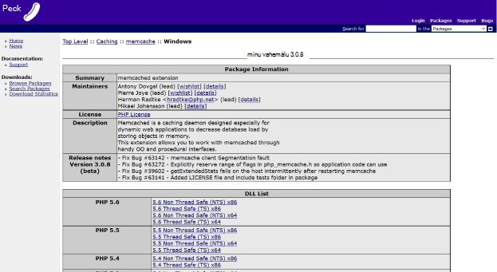

<properties
    pageTitle="Azure'i rakendust Service veebirakenduse ühenduse Redis vahemälu Memcache protokolli | Microsoft Azure'i"
    description="Veebirakenduse teenuses Azure rakenduse ühenduse Redis vahemälu Memcache protokolli abil"
    services="app-service\web"
    documentationCenter="php"
    authors="SyntaxC4"
    manager="wpickett"
    editor="riande"/>

<tags
    ms.service="app-service-web"
    ms.devlang="php"
    ms.topic="get-started-article"
    ms.tgt_pltfrm="windows"
    ms.workload="na"
    ms.date="02/29/2016"
    ms.author="cfowler"/>

# <a name="connect-a-web-app-in-azure-app-service-to-redis-cache-via-the-memcache-protocol"></a>Azure'i rakendust Service veebirakenduse ühenduse Redis vahemälu kaudu Memcache Protocol (protokoll)

Sellest artiklist saate teada, kuidas [Azure'i rakendust Service](http://go.microsoft.com/fwlink/?LinkId=529714) WordPress veebirakenduse ühenduse [Azure'i Redis vahemälu] [ 12] abil [Memcache] [ 13] Protocol (protokoll). Kui teil on olemasolevaid web appi-mälu vahemällu Memcached serverit kasutava, saate migreerida Azure'i rakendust Service ja abil saate esimese vahemällu lahenduse Microsoft Azure või ei muuda oma rakenduse koodi. Lisaks saate oma olemasolevad Memcache teadmiste loomiseks väga paindlik jaotatud rakenduste Azure rakenduse teenuses Azure Redis vahemälu ja-mälu vahemällu, nt .NET, PHP, Node.js, Java ja Python populaarsed rakenduse raamistiku kasutamise ajal.  

Rakenduse teenuse Web Apps võimaldab selle rakenduse stsenaariumi koos Web Appsi Memcache vaheleht, mis on kohalik Memcached server, mis toimib Memcache puhverserveri vahemällu kõned Azure'i Redis vahemälu. See võimaldab mõnda rakendust edastab Redis vahemälu Memcache protokolli vahemälu andmete kasutamine. See Memcache vaheleht töötab tasemel Protocol (protokoll) nii, et seda saab kasutada mis tahes rakenduse või rakenduste raamistik seni, kuni ta suhtleb Memcache protokolli abil.

[AZURE.INCLUDE [app-service-web-to-api-and-mobile](../../includes/app-service-web-to-api-and-mobile.md)] 

## <a name="prerequisites"></a>Eeltingimused

Web Appsi Memcache vaheleht saab kasutada mistahes rakendusega eeldusel, et see edastab Memcache protokolli abil. Selles näites on viite rakendus Scalable WordPress saidi, mis võivad ette valmistatud Azure'i turuplatsilt.

Järgige kirjeldatud järgmistest artiklitest:

* [Azure'i Redis vahemälu teenuse eksemplari ettevalmistamine][0]
* [Skaleeritav WordPress saidi Azure juurutamine][1]

Kui teil on juurutatud Scalable WordPress saidi ja Redis vahemälu eksemplari, ette valmistatud saab jätkamiseks lubamine Memcache vaheleht Azure'i rakenduse teenuse veebirakendustes valmis.

## <a name="enable-the-web-apps-memcache-shim"></a>Web Appsi Memcache vaheleht lubamine

Memcache vaheleht konfigureerimiseks tuleb teil luua kolm rakenduse sätted. Seda saab teha mitmesuguseid viise, sh [Azure portaali](http://go.microsoft.com/fwlink/?LinkId=529715), [klassikaline portaali]kaudu[3], [Azure PowerShelli cmdlet-käskude] [ 5] või [Azure käsurea liides][5]. Selleks et see postitus, ma kasutada [Azure portaali] [ 4] rakenduse sätete määramiseks. Järgmised väärtused saate vormilt **sätted** blade oma Redis vahemälu astme.


### <a name="add-redishost-app-setting"></a>Säte REDIS_HOST rakenduse lisamine

Esimese rakenduse säte, peate looma on selle **REDIS\_HOST** rakenduse säte. See säte määrab sihtkoha, millele see vaheleht edastab vahemälu teavet. Nõutava REDIS_HOST rakenduse sätte saab tuua oma Redis vahemälu eksemplari keelest **Atribuudid** .


Määrake sätte rakenduse, et võti **REDIS\_HOST** väärtuse ja rakenduse säte **hostname** Redis vahemälu astme.


### <a name="add-rediskey-app-setting"></a>Säte REDIS_KEY rakenduse lisamine

Teine rakendus säte, peate looma on selle **REDIS\_klahvi** rakenduse säte. See säte pakub autentimise luba nõutav turvaline juurdepääs Redis vahemälu eksemplari. Väärtus, mis on nõutav säte REDIS_KEY rakenduse eksemplari Redis vahemälu keelest **kiirklahvide** jaoks saate alla laadida.


Määrake sätte rakenduse, et võti **REDIS\_klahv** ja rakenduse sätte Redis vahemälu eksemplari **Primaarvõtme** väärtus.


### <a name="add-memcacheshimredisenable-app-setting"></a>Säte MEMCACHESHIM_REDIS_ENABLE rakenduse lisamine

Viimane säte rakenduse lubamiseks Memcache vaheleht veebirakendustes, mis kasutab REDIS_HOST ja REDIS_KEY ühenduse Azure'i Redis vahemälu ja edasisaatmine vahemälu kasutatakse kõned. Määrake sätte rakenduse, et võti **MEMCACHESHIM\_REDIS\_lubada** ja väärtuse **True**.


Kui olete teinud lisamise kolme (3) rakenduse sätted, klõpsake nuppu **Salvesta**.

## <a name="enable-memcache-extension-for-php"></a>PHP Memcache pikendamise lubamine

Selleks rakenduse rääkima Memcache Protocol (protokoll), on vaja installida Memcache laiend php – saidile WordPress keele raames.

### <a name="download-the-phpmemcache-extension"></a>Laadige alla php_memcache laiend

Liikuge sirvides [PECL][6]. Klõpsake jaotises vahemällu kategooria, [memcache][7]. Klõpsake jaotises allalaaditavad failid veeru DLL linki.


Allalaadimislink mitte-jutulõnga ohutu (NTS) x86 lubatud veebirakendustes PHP versiooni jaoks. (Vaikimisi PHP 5.4)



### <a name="enable-the-phpmemcache-extension"></a>Php_memcache laiendamiseks

Pärast faili alla laadida pakkige see lahti ja laadige üles soovitud **php\_memcache.dll** sisse selle **d:\\home\\saidi\\wwwroot\\prügikasti\\ext\\ ** kataloogi. Pärast selle php_memcache.dll laaditakse veebirakenduse, peate laiendamiseks PHP Runtime. Memcache laiend Azure'i portaalis lubamiseks Avage **Rakenduse sätted** tera web app ja seejärel lisage uus rakendus säte, võti **PHP\_laiendid** ja väärtuse **prügikasti\\ext\\php_memcache.dll**.


> [AZURE.NOTE] Kui veebirakenduse peab laadimise mitme PHP laiendid, tuleks PHP_EXTENSIONS väärtus komaeraldusega loendi suhteline teed DLL-failid.


Kui olete lõpetanud, klõpsake nuppu **Salvesta**.

## <a name="install-memcache-wordpress-plugin"></a>Memcache WordPress lisandmooduli installimine

> [AZURE.NOTE] Saate alla laadida ka [Memcached objekti vahemälu lisandmooduli](https://wordpress.org/plugins/memcached/) WordPress.org.

Klõpsake lehel WordPress lisandmoodulid nuppu **Lisa uus**.


Väljale Otsi tippige **memcached** , ja vajutage sisestusklahvi **Enter**.


Otsige loendist üles **Memcached objekti vahemälu** ja seejärel klõpsake nuppu **Installi kohe**.


### <a name="enable-the-memcache-wordpress-plugin"></a>Lubage lisandmoodul Memcache WordPress

>[AZURE.NOTE] Järgige selles blogis [lubamine saidi laiend veebirakendustes] [ 8] installimiseks Visual Studio Team Services.

Klõpsake soovitud `wp-config.php` faili, lisage järgmine kood kohal Peata redigeerimine kommentaari faili lõpus.

```php
$memcached_servers = array(
    'default' => array('localhost:' . getenv("MEMCACHESHIM_PORT"))
);
```

Kui see kood on kleepida, monaco dokumendi automaatselt salvestada.

Järgmise sammuna objekti vahemälu lisandmooduli lubada. Selleks lohistamine **objekti – cache.php** **wp-sisu lisandmoodulid memcached** kaustast **wp-sisu** kausta Memcache objekti vahemälu funktsiooni lubamiseks.


Nüüd, **objekti-cache.php** fail on **wp-sisu** kausta, Memcached objektivahemälu on nüüd lubatud.


## <a name="verify-the-memcache-object-cache-plugin-is-functioning"></a>Veenduge, et lisandmoodul Memcache objekti vahemälu toimib

Kõik toimingute Web Appsi Memcache vaheleht on nüüd valmis. Veenduge, et andmed on ilma vaevata luua oma Redis vahemälu eksemplari on ainus.

### <a name="enable-the-non-ssl-port-support-in-azure-redis-cache"></a>Mitte-SSL-port toe Azure'i Redis vahemälus

>[AZURE.NOTE] Käesoleva artikli kirjutamise ajal ei toeta Redis CLI SSL-i ühenduvuse, seega on vaja järgmist.

Azure'i portaalis, liikuge selle web app loodud Redis vahemälu eksemplari. Kui soovitud vahemälu blade on avatud, klõpsake nuppu **sätted** .


Valige loendist **Accessi pordid** .


Klõpsake nuppu **ei** **Luba**juurdepääsu ainult SSL-i kaudu.


Näete, mitte-SSL-pordi on nüüd määratud. Klõpsake nuppu **Salvesta**.


### <a name="connect-to-azure-redis-cache-from-redis-cli"></a>Ühenduse Azure'i Redis vahemälu redis-cli kaudu

>[AZURE.NOTE] Selles juhises eeldatakse, et see redis on kohalik arengu arvutisse installitud. [Installige Redis kohalikult abil neid juhiseid][9].

Avage oma käsurea konsooli valik ja tippige järgmine käsk:

```shell
redis-cli –h <hostname-for-redis-cache> –a <primary-key-for-redis-cache> –p 6379
```

Asendada selle ** &lt;hostname-jaoks-redis vahemälu&gt; ** koos tegelik xxxxx.redis.cache.windows.net hostname ja ** &lt;primaarne-klahv-jaoks-redis-vahemälu&gt; ** vahemälu kiirklahv, vajutage sisestusklahvi **Enter**. Kui CLI on ühendatud Redis vahemälu eksemplari, probleemi redis käsk. Pildil, olete otsustanud loendis võtmed.


Kõne suunamine loendis toodud klahvid peaks tagastama väärtuse. Kui ei, siis veebirakenduse liikumine ja proovige uuesti.

## <a name="conclusion"></a>Kokkuvõte

Palju õnne! WordPress rakendus on nüüd tsentraliseeritud-mälu vahemälu läbilaskevõime suurendamisel abi. Pidage meeles, et Web Appsi Memcache vaheleht saab kasutada mis tahes Memcache kliendi olenemata programmeerimiskeel või rakenduse raamistiku. Anda tagasisidet või esitada küsimusi Web Appsi Memcache vaheleht, postitamine [MSDN-i] foorumites[ 10] või [Stackoverflow][11].

>[AZURE.NOTE] Kui soovite alustada Azure'i rakendust Service enne Azure'i konto kasutajaks, minge [Proovige rakenduse teenus](http://go.microsoft.com/fwlink/?LinkId=523751), kus saate kohe luua lühiajaline starter web app rakenduse teenus. Nõutav; krediitkaardid kohustusi.

## <a name="whats-changed"></a>Mis on muutunud
* Muuda juhend veebisaitide rakenduse teenusega leiate: [Azure'i rakendust Service ja Azure olemasolevad teenused mõju](http://go.microsoft.com/fwlink/?LinkId=529714)


[0]: ../redis-cache/cache-dotnet-how-to-use-azure-redis-cache.md#create-a-cache
[1]: http://bit.ly/1t0KxBQ
[2]: http://manage.windowsazure.com
[3]: http://portal.azure.com
[4]: ../powershell-install-configure.md
[5]: /downloads
[6]: http://pecl.php.net
[7]: http://pecl.php.net/package/memcache
[8]: http://blog.syntaxc4.net/post/2015/02/05/how-to-enable-a-site-extension-in-azure-websites.aspx
[9]: http://redis.io/download#installation
[10]: https://social.msdn.microsoft.com/Forums/home?forum=windowsazurewebsitespreview
[11]: http://stackoverflow.com/questions/tagged/azure-web-sites
[12]: /services/cache/
[13]: http://memcached.org
