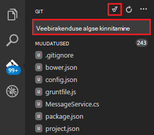

<properties
   pageTitle="ASP.net-i 5 web rakenduse Visual Studio koodi loomine"
   description="Selles õpetuses on näidatud, kuidas luua ASP.net-i 5 web Appi abil Visual Studio kood."
   services="app-service\web"
   documentationCenter=".net"
   authors="erikre"
   manager="wpickett"
   editor="jimbe"/>

<tags
    ms.service="app-service-web" 
    ms.workload="web" 
    ms.tgt_pltfrm="dotnet" 
    ms.devlang="na" 
    ms.topic="article" 
    ms.date="02/26/2016" 
    ms.author="cephalin"/>

# ASP.net-i 5 web rakenduse Visual Studio koodi loomine

## Ülevaade

Selle õpetuse näidatakse, kuidas luua ASP.net-i 5 web Appi abil [Visual Studio kood (VS kood)](http://code.visualstudio.com//Docs/whyvscode) ja selle juurutama [Azure'i rakendust Service](../app-service/app-service-value-prop-what-is.md). 

> [AZURE.NOTE] Kuigi see artikkel viitab veebirakenduste, see kehtib ka API ja Mobile'i rakendused. 

ASP.net-i 5 on oluline plaani ASP.net-i. ASP.net-i 5 on avatud lähtekoodi ja platvormidel raamistikku koostamise tänapäevane pilvepõhist web Appsi .net-i abil. Lisateavet leiate teemast [Sissejuhatus ASP.net-i 5](http://docs.asp.net/en/latest/conceptual-overview/aspnet.html). Azure'i rakendust Service veebirakenduste kohta leiate teemast [Web Apps ülevaade](app-service-web-overview.md).

[AZURE.INCLUDE [app-service-web-try-app-service.md](../../includes/app-service-web-try-app-service.md)]

## Eeltingimused  

* Installige [VS kood](http://code.visualstudio.com/Docs/setup).
* Installi [Node.js](http://nodejs.org) - Node.js on kiire ja scalable serveri rakenduste JavaScripti platvorm. Sõlm on käitusaja (sõlme) ja [npm](http://www.npmjs.com/) on sõlm moodulid paketi ülemus. Kasutage npm tellingud ASP.net-i 5 web app selles õpetuses.
* Installige Git – saate selle installida järgmiste kohtade kaudu: [Chocolatey](https://chocolatey.org/packages/git) või [git-scm.com](http://git-scm.com/downloads). Kui olete kasutanud Git, valige [git-scm.com](http://git-scm.com/downloads) , ja valige suvand **Kasuta**git Windowsi Käsuviip. Kui olete installinud Git, peate samuti seadmine Git kasutajanimi ja e-posti, kui see on nõutav hiljem õpetuse (kui läbimiseks on Kinnita VS kood).  

## ASP.net-i 5 ja DNX installimine
ASP.net-i 5/DNX (.NET täitmise keskkond) on lahja .NET virnas tänapäevane ja veebirakenduste, mis töötavad OS X, Linuxi ja Windowsi. See on loodud maa luua optimeeritud arengu raamistik rakendused, mis on pilv juurutatud või kohapealse käivitada. Koosneb muutuv komponente minimaalsete pea kohal, nii saate säilitada paindlikkust ajal ehitamine oma lahendusi.

Selle õpetuse eesmärk on võite alustada rakenduste arendamise uusimad ASP.net-i 5 ja DNX koos loomine. Järgmised juhised kehtivad teatud Windowsi. Üksikasjalikumat installimisjuhised OS X, Windows ja Linux, vt [installimist ASP.net-i 5 ja DNX](https://code.visualstudio.com/Docs/ASPnet5#_installing-aspnet-5-and-dnx). 

1. Installige Windows .net-i versioon Manager (DNVM), avage käsuviip ja käivitage järgmine käsk.

        @powershell -NoProfile -ExecutionPolicy unrestricted -Command "&{$Branch='dev';iex ((new-object net.webclient).DownloadString('https://raw.githubusercontent.com/aspnet/Home/dev/dnvminstall.ps1'))}"

    See DNVM skripti alla laadida ning panna selle kasutaja profiili kataloogi. 

2. **Taaskäivitage Windows** DNVM installimise lõpuleviimiseks. 

    Pärast taaskäivitamist Windows, saate avada Käsuviip DNVM asukoha kinnitamiseks, sisestades järgmist:

        where dnvm

    Käsuviip kuvatakse järgmise sisuga tee.

    

3. Nüüd, kui teil on DNVM, saate seda kasutada alla laadida rakenduste käivitamiseks DNX. Käivitage järgmine käsk:

        dnvm upgrade

    Veenduge, et teie DNVM ja vaadata aktiivse käitusaja sisestage käsuviibale järgmine:

        dnvm list

    Käsuviip kuvatakse aktiivse käitusaja üksikasju.

    

    Kui loendis on rohkem kui üks DNX käitusaja, saate sisestada järgmiselt (või uuemat versiooni) määramiseks active DNX käitusaja käsuviibale. Määrake selle sama versiooni, mida kasutatakse ASP.net-i 5 generaator loomisel oma veebirakenduse hiljem selles õpetuses. *Peate pole aktiivne käitusaja muuta, kui see on seatud väärtusele viimaste.*

        dnvm use 1.0.0-update1 –p

> [AZURE.NOTE] Vt täpsemat installimisjuhised OS X, Windows ja Linux [ASP.net-i installimine 5 ja DNX](https://code.visualstudio.com/Docs/ASPnet5#_installing-aspnet-5-and-dnx). 

## Veebirakenduse loomine 

Selles jaotises kirjeldatakse, kuidas uue rakenduse ASP.net-i veebirakenduse tellingud. Sõlm paketi manager (npm) kasutate [Yeoman](http://yeoman.io/) installimiseks (rakendus tellingud tööriist - VS kood võrdub Visual Studio **Fail > uus projekt** toiming), [Grunt](http://gruntjs.com/) (JavaScripti tööülesande jooksja) ja [Bower](http://bower.io/) (klient küljel paketi manager). 

1. Avage käsuviip administraatori õigustega ja liikuge asukohta, kuhu soovite oma ASP.net-i projekti loomine. Näiteks luua C: juurtasemel *vscodeprojects* kataloog\.

2. Sisestage käsuviibale installida Yeoman ja täiendavad tööriistad.

        npm install -g yo grunt-cli generator-aspnet bower

    > [AZURE.NOTE] Võite saada hoiatus, mis näitab, et teie npm versioon on aegunud. Hoiatus ei mõjuta selles õpetuses.

3. Sisestage käsuviibale projekti kausta loomiseks ja tellingud rakendus.

        yo aspnet

4. ASP.net-i 5 generaator menüüst, ja vajutage **Web rakenduse lihtsa** tüübi valimiseks kasutage NOOLEKLAHVE ** &lt;Enter >**.

    

5. ASP.net-i uue veebirakenduse nime määramine **SampleWebApp**. Nagu kogu õpetuse, kasutatakse selle nime, kui valite mõne muu nimega, peate **SampleWebApp**iga esinemiskorra asendamiseks. Kui vajutate ** &lt;Enter >**, Yeoman loob uue kausta nimega **SampleWebApp** ja vajalikud failid uus rakendus.

6. Käsuviip, muutke kataloogide uue projekti kausta:

        cd SampleWebApp

7. Ka Käsuviip, installimiseks vajalikud Nugeti pakettide rakenduse käivitamiseks, sisestage järgmine käsk:

        dnu restore

8. Avatud VS kood sisestage käsuviibale järgmine:

        code .

## Veebirakenduse kohalik käivitamine

Nüüd, kui olete loonud web appi ja tuua Nugeti pakettide rakenduse, võite käivitada veebirakenduse kohalikult.

1. Sisestage **Käsk värvipaleti** VS koodi kaudu saadaval Käivita käsk Suvandid kuvamiseks järgmist:

        dnx: Run Command

    > [AZURE.NOTE] Kui Omnisharp server praegu ei tööta, see käivitub. Sisestage eeltoodud käsu uuesti.

    Seejärel valige oma veebirakenduse käivitage järgmine käsk:
        
        dnx web - (SampleWebApp)

    Käsuviiba aken kuvatakse, et rakendus käivitas. Kui käsuviiba aken ei kuva seda teadet, märkige soovitud alumises vasakus corning VS koodi projektis tõrkeid.
    
    > [AZURE.NOTE]Emissiooni käsu kaudu **Käsk värvipaleti** nõuab on **>** märk käsurea alguses. Saate vaadata failis *project.json* käsk **web** seotud üksikasjad.   
    > Kui käsk ei kuvata või pole saadaval, võib-olla peate installima laiend C#. Käivitage `>Extensions: Install Extension` ning `ext install c#` installimiseks C# laiendid.

2. Avage brauser ja avage järgmine URL.

    **http://localhost:5000**

    Vaikimisi lehe veebirakenduse kuvatakse järgmiselt.

    

3. Sulgege brauser. **Käsuviiba aken**, vajutage **Klahvikombinatsiooni Ctrl + C** rakenduse sulgema ja sulgege **Käsuviiba aken**. 

## Luua veebirakenduse Azure'i portaalis

Järgmised toimingud juhendab teid Azure portaali veebirakenduse loomine.

1. [Azure'i portaali](https://portal.azure.com)sisse logida.

2. Klõpsake nuppu **Uus** ülaosas vasak portaali.

3. Klõpsake **veebirakendusi > Web Appi**.

    

4. Sisestage **nimi**, nt **SampleWebAppDemo**väärtus. Pange tähele, et see nimi peab olema kordumatu ja portaali on jõustada, et kui proovite Sisestage soovitud nimi. Seetõttu, kui valite mõne muu väärtuse enter, peate selle väärtuse jaoks iga esinemiskorra **SampleWebAppDemo** , mida näete selles õpetuses asendada. 

5. Märkige mõne olemasoleva **Rakenduse teenuse leping** või looge uus. Kui loote uue lepingu, valige hinnakirjad taseme, asukohta ja muud suvandid. Rakenduse teenuse lepingute kohta leiate lisateavet artiklist, [Azure'i rakendust Service lepingute põhjalik ülevaade](../app-service/azure-web-sites-web-hosting-plans-in-depth-overview.md).

    

6. Klõpsake nuppu **Loo**.

    

## Uue veebirakenduse jaoks Git avaldamise lubamine

Git on jaotatud versiooni kontrolli süsteem, mille abil saate kasutada oma Azure'i rakendust Service web app. Salvestate kirjutamise kohaliku Git hoidla veebirakenduse jaoks koodi ja kuvatakse teie koodi abil serveri hoidla Azure juurutamine.   

1. Logige [Azure portaali](https://portal.azure.com).

2. Klõpsake nuppu **Sirvi**.

3. Valige **Veebirakenduste** Azure tellimusega seostatud veebirakenduste loendi kuvamine.

4. Valige veebirakenduse loodud selles õpetuses.

5. Web appi tera, klõpsake nuppu **sätted** > **pideva**. 

    

6. Klõpsake **Andmeallika valimine > kohaliku Git hoidla**.

7. Klõpsake nuppu **OK**.

    

8. Kui te pole varem juurutamise mandaat avaldamise web Appi kui ka muid rakenduse teenuse rakenduse häälestamine, nende häälestamiseks nüüd:

    * Klõpsake nuppu **sätted** > **juurutamise mandaat**. **Juurutamise identimisteabe määramine** tera kuvatakse.

    * Looge kasutajanimi ja parool.  Peate selle parooli hiljem Git häälestamisel.

    * Klõpsake nuppu **Salvesta**.

9. Oma veebirakenduse tera, klõpsake **Sätted > Atribuudid**. URL-i serveri Git hoidla juurutamist abil kuvatakse jaotises **GIT URL-i**.

10. Kopeerige õpetuse **GIT URL-i** väärtus hilisemaks kasutamiseks.

    

## Azure'i rakendust Service oma veebirakenduse avaldamine

Selles jaotises loote kohaliku Git hoidla ning tõuketeatised selle hoidla juurutada oma veebirakenduse Azure'i Azure.

1. VS koodi, klõpsake raadionuppu **Git** vasakpoolsel navigeerimisribal.

    

2. Valige **lähtestada git hoidla** veendumaks, et teie tööruum on git allikas kontrolli all. 

    

3. Avage käsuviiba aken ja muuta oma veebirakenduse kataloogi kataloogide. Sisestage järgmine käsk:

        git config core.autocrlf false

    See käsk takistab probleemi kohta, kus CRLF lõpud ja LF lõpud on kaasatud teksti.

4. VS koodi, saate lisada sõnumi kinnitamine ja klõpsake ikooni **Kinnita kõik** sisse.

    

5. Pärast Git töötlemine on lõpule viidud, näete, et puuduvad failid loetletud Git akna jaotises **muudatused**. 

    

6. Muutke tagasi käsuviiba aken kus Käsuviip osutab kataloogi kus asub teie web Appis.

7. Saate luua remote viite jaoks lükkamine värskendused oma web Appi abil Git URL (mis lõppevad ".git"), mis varem kopeeritud.

        git remote add azure [URL for remote repository]

8. Konfigureerige Git salvestada oma kasutajanimi ja parool, et neid lisatakse automaatselt teie loodud VS koodi tõuketeatised käske.

        git config credential.helper store

9. Vajutage muudatuste Azure'i sisestage järgmine käsk. Pärast selle algse tõuketeatised Azure, on võimalik teha kõik käsud tõuketeatised VS kood. 

        git push -u azure master

    Küsitakse eelnevalt kirjeldatud Azure'i loodud parooli. **Märkus: Parool ei ole nähtaval.**

    Eeltoodud käsu väljund lõpeb juurutamise õnnestumise sõnumiga.

        remote: Deployment successful.
        To https://user@testsite.scm.azurewebsites.net/testsite.git
        [new branch]      master -> master

> [AZURE.NOTE] Kui muudate oma rakenduse, saate uuesti avaldada otse koodis VS ruudu **Kinnita kõik** **Push** valik, millele järgneb sisseehitatud Git funktsioonide abil. Leiate **Push** suvand saadaval rippmenüü kõrval nuppe **Kinnita kõik** ja **värskendada** .

Kui teil on vaja koostöö projekti kallal, kaaluge lükkamine github vahepeal Azure lükkamine.

## Käivitage rakendus Azure
Nüüd, kui olete oma veebirakenduse juurutanud, vaatame käivitage rakendus ajal majutatud Azure. 

Seda saab teha kahel viisil:

* Avage brauser ja sisestage oma veebirakenduse nimi järgmiselt.   

        http://SampleWebAppDemo.azurewebsites.net
 
* Azure'i portaal, otsige web appi tera veebirakenduse jaoks, ja klõpsake nuppu **Sirvi** rakenduse kuvamiseks 
* Vaikimisi brauseris.

## Kokkuvõte
Selles õpetuses te teada, kuidas luua veebirakenduse VS koodi ja juurutada Azure. VS koodi kohta leiate lisateavet artiklist, [miks Visual Studio kood?](https://code.visualstudio.com/Docs/) Rakenduse teenuse veebirakenduste kohta leiate teavet teemast [Web Appsi ülevaade](app-service-web-overview.md). 
