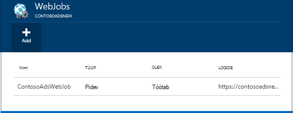
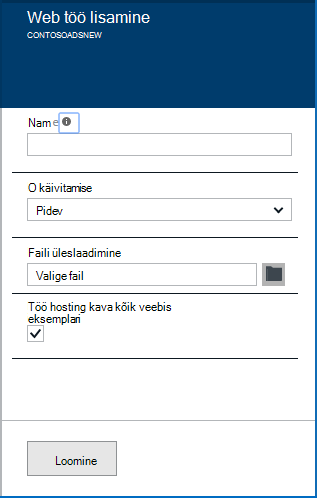
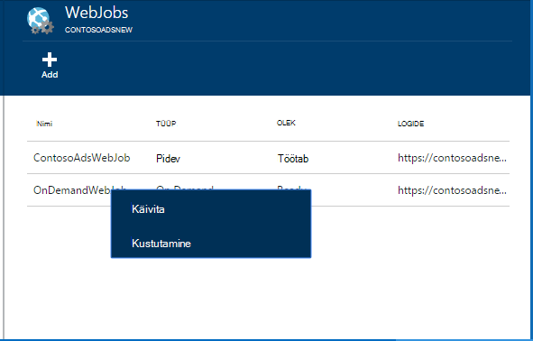
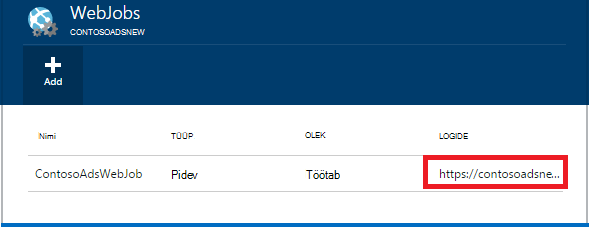

<properties 
    pageTitle="Käivitage tausttoimingud WebJobs" 
    description="Saate teada, kuidas käivitada Azure veebirakendustes tausttoimingud." 
    services="app-service" 
    documentationCenter="" 
    authors="tdykstra" 
    manager="wpickett" 
    editor="jimbe"/>

<tags 
    ms.service="app-service" 
    ms.workload="na" 
    ms.tgt_pltfrm="na" 
    ms.devlang="na" 
    ms.topic="article" 
    ms.date="04/27/2016" 
    ms.author="tdykstra"/>

# <a name="run-background-tasks-with-webjobs"></a>Käivitage tausttoimingud WebJobs

## <a name="overview"></a>Ülevaade

Saate kasutada programmide või skriptide WebJobs oma [Rakenduse teenuse](http://go.microsoft.com/fwlink/?LinkId=529714) web Appis on kolm võimalust: nõudmisel pidevalt, või ajakava. On täiendavaid tasuta WebJobs kasutama.

Selles artiklis kirjeldatakse juurutamise WebJobs [Azure portaali](https://portal.azure.com)kaudu. Visual Studio või pidev kohaletoimetamise protsess abil juurutamise kohta leiate teemast [veebirakenduste Azure'i WebJobs juurutamine](websites-dotnet-deploy-webjobs.md).

Azure'i WebJobs SDK lihtsustab palju WebJobs programmeerimisega tööülesanded. Lisateavet leiate teemast [mis on WebJobs SDK](websites-dotnet-webjobs-sdk.md).

 Azure'i funktsioonid (praegu eelvaade) on teine võimalus programmide ja skriptide käitamiseks teenuses Azure rakenduse. Lisateavet leiate teemast [Azure funktsioonide ülevaade](../azure-functions/functions-overview.md).

[AZURE.INCLUDE [app-service-web-to-api-and-mobile](../../includes/app-service-web-to-api-and-mobile.md)] 

## <a name="acceptablefiles"></a>Faili tüüpi skriptide või programmid

Aktsepteeritakse järgmisi failitüüpe:

* cmd, .bat, .exe (abil Windowsi cmd)
* .ps1 (PowerShelli abil)
* .sh (kasutades bash)
* .php (kasutades php)
* .py (kasutades python)
* JS (abil sõlm)
* laiendid (kasutades java)

## <a name="CreateOnDemand"></a>Nõudmisel WebJob portaali loomine

1. Klõpsake **Veebirakenduse** tera [Azure portaali](https://portal.azure.com), **Kõik sätted > WebJobs** **WebJobs** tera kuvamiseks.
    
    
    
5. Klõpsake nuppu **Lisa**. Kuvatakse dialoogiboks **Lisamine WebJob** .
    
    
    
2. Sisestage **nimi**on WebJob nimi. Nimi peab algama tähe või arvu ja ei tohi sisaldada erimärke, välja arvatud "-" ja "_".
    
4. Valige dialoogiboksis **Käivita kuidas** **nõudmisel käivitada**.
    
3. Klõpsake väljal **Faili üleslaadimine** kausta ikooni ja liikuge sirvides zip-fail, mis sisaldab teie skript. Zip-fail peaks sisaldama teie täitmisfaili (.exe cmd .bat .sh .php .py js), mis tahes täiendavaid faile, mis on vaja käivitada programmi või skripti.
    
5. Märkige üles laadida skripti oma veebirakenduse **loomine** . 
    
    Teie määratud jaoks soovitud WebJob nimi kuvatakse loendis **WebJobs** enne.
    
6. Funktsiooni WebJob käivitamiseks paremklõpsake selle nime loendis ja klõpsake nuppu **Käivita**.
    
    
    
## <a name="CreateContinuous"></a>Pidevalt töötava WebJob loomine

1. Pidevalt täidesaatva WebJob loomiseks järgige sama loomiseks on WebJob, et käivitatakse üks kord, kuid väljale **Käivita kuidas** valida **pidev**.

2. Alustamine või lõpetamine pidev WebJob, paremklõpsake WebJob loendist ja klõpsake käsku **Alustamine** või **lõpetamine**.
    
> [AZURE.NOTE] Kui teie web app töötab mitu eksemplari, pidevalt töötava WebJob töötab kõik teie eksemplarid. Nõudmisel ja ajastatud WebJobs käivitada ühekordsest valitud laadi järgi Microsoft Azure'i tasakaalustamiseks.
    
> Pidev WebJobs käivitamiseks usaldusväärselt ja kõik eksemplarid, jaoks lubamiseks on alati * Otsingukonfiguratsiooni säte web appi muidu nad ei saa peatada, kui SCM hosti saidil on liiga kauaks jõude olnud.

## <a name="CreateScheduledCRON"></a>Ajastatud WebJob, kasutades CRON avaldise loomine

Selle meetodi veebirakenduste Basic, Standard või Premium režiimis saadaval on ja nõuab **Alati** olema lubatud rakendus.

Muuta mõne linna nõudmisel WebJob ajastatud WebJob, lihtsalt sisaldada soovitud `settings.job` faili juurtasemel WebJob zip-fail. Peaks sisaldama selle JSON-faili lisamine `schedule` atribuut on [CRON avaldis](https://en.wikipedia.org/wiki/Cron), kohta järgmises näites.

CRON Avaldis koosneb 6 väljad: `{second} {minute} {hour} {day} {month} {day of the week}`.

Näiteks, et käivitada oma WebJob iga 15 minuti järel oma `settings.job` oleks:

```json
{
    "schedule": "0 */15 * * * *"
}
``` 

Teised CRON ajakava näited:

- Iga tunni (st kui minutite arv on 0):`0 0 * * * *` 
- Iga tunni 9 EL-17:`0 0 9-17 * * *` 
- Kell 9:30 iga päev:`0 30 9 * * *`
- Kell 9:30 nädala iga päev:`0 30 9 * * 1-5`

**Märkus**: juurutamisel on WebJob Visual Studio, veenduge, et märkida oma `settings.job` faili koopiana"kui uuem" atribuudid.


## <a name="CreateScheduled"></a>Ajastatud WebJob, kasutades Azure ajasti loomine

Järgmine alternatiivne meetod kasutab Azure ajasti. Sel juhul ei ole oma WebJob otsese teadmisi ajakava. Selle asemel Azure'i ajasti saab konfigureerida oma ajakava WebJob käivitamine. 

Azure'i portaal ei ole veel võimalus luua ajastatud WebJob, kuid, kuni see funktsioon on lisatud, saate seda teha, kasutades [klassikaline portaali](http://manage.windowsazure.com).

1. Minge lehele WebJob [klassikaline portaali](http://manage.windowsazure.com) ja klõpsake nuppu **Lisa**.

1. Valige dialoogiboksis **Käivita kuidas** **töötab ajakava**.
    
    ![Uue ajastatud töö][NewScheduledJob]
    
2. Valige **Scheduler piirkond** oma töö ja seejärel klõpsake parempoolses allnurgas dialoogiboksi jätkamiseks järgmisel kuval klõpsake noolt.

3. Valige dialoogiboksis **Loomine töö** **Korduvus** soovitud tüüpi: **korduva**või **ühekordse töö** .
    
    ![Ajakava Korduvus][SchdRecurrence]
    
4. Valida ka **alustades** aja: **kohe** või **kindlal ajal**.
    
    ![Ajakava alguskellaaeg][SchdStart]
    
5. Kui soovite teatud ajal käivitada, valige oma aja algväärtusi jaotises **Alates**.
    
    ![Ajakava Start kindlal ajal][SchdStartOn]
    
6. Kui valisite korduva töö, on teil selle **Recur iga** võimalus määrata sagedus esinemiskord ja **Lõpeb klõpsake** suvandit määrata ka lõppaeg.
    
    ![Ajakava Korduvus][SchdRecurEvery]
    
7. Kui valite **nädalat**, saate valida väljal **Sisse ka teatud ajakava** ja määrata nädalapäevade, mida soovite tööd käitada.
    
    ![Ajakava nädalapäevad][SchdWeeksOnParticular]
    
8. Kui valite **kuu** ja märkige ruut **Sisse ka teatud ajakava** , saate töö käivitamiseks kindla nummerdatud **päeva** , kuu. 
    
    ![Ajakava kindla kuupäeva kuu][SchdMonthsOnPartDays]
    
9. Kui valite **Nädalapäevade**, saate valida millise päeva või nädalapäevade soovite käivitada töö kuu.
    
    ![Kindla nädala päeva kuus plaanimine][SchdMonthsOnPartWeekDays]
    
10. Lõpetuseks, samuti saate **juhud** suvandi valimiseks mis nädala, kuu (esimene, teine, kolmas jne) soovite käivitada määratud töönädala päevade töö.
    
    ![Kindla nädalapäevade kindla nädala, kuu plaanimine][SchdMonthsOnPartWeekDaysOccurences]
    
11. Pärast ühe või mitu tööd on loodud, kuvatakse nende nimed WebJobs menüü nende oleku, ajakava tüüp ja muud teavet. Ajalooliste teabe viimase 30 WebJobs säilitatakse.
    
    ![Loend][WebJobsListWithSeveralJobs]
    
### <a name="Scheduler"></a>Ajastatud tööd ja Azure ajasti

Ajastatud tööd saab konfigureerida täiendavaid [klassikaline portaalis](http://manage.windowsazure.com)Azure ajasti lehtedel.

1.  Klõpsake lehel WebJobs linki projekti **ajakava** Azure'i Scheduler portaali lehele liikumiseks. 
    
    ![Azure'i Scheduler link][LinkToScheduler]
    
2. Klõpsake lehel ajasti töö.
    
    ![Töö Scheduler portaali lehel][SchedulerPortal]
    
3. Avaneb **töö toimingu** leht, kus saate konfigureerida täiendavaid töö. 
    
    ![Töö toimingu PageInScheduler][JobActionPageInScheduler]
    
## <a name="ViewJobHistory"></a>Töö ajaloo kuvamine

1. Töökoht, WebJobs SDK, loodud töökohtade täitmise ajaloo kuvamiseks linki oma vastavate WebJobs tera veerus **logid** . (Saate ikooni lõikelauale kopeerimiseks log faili lehe URL lõikelauale, kui soovite.)
    
    
        
2. Lingi klõpsamisel avatakse üksikasjade lehe jaoks soovitud WebJob. Sellel lehel kuvatakse käsu nimi käivitate, selle viimase kellaaegu ja selle teavitab õnnestumisest või nurjumisest. Klõpsake jaotises **tehtud töö töötab**, aeg, et näha rohkem üksikasju.
    
    ![WebJobDetails][WebJobDetails]
    
3. **WebJob käivitada üksikasjade** lehel kuvatakse. Klõpsake nuppu **Lülita väljundi** Logi sisu teksti. Väljundi Logi on tekstivormingus. 
    
    ![Web töö üksikasjad][WebJobRunDetails]
    
4. Väljundi teksti eraldi brauseriaknas kuvamiseks klõpsake linki **alla laadida** . Allalaadimiseks tekst, paremklõpsake linki ja salvestage faili sisu oma brauseri suvandite abil.
    
    ![Log väljundi allalaadimine][DownloadLogOutput]
    
5. Klõpsake lehe ülaosas linki **WebJobs** pakub mugavam WebJobs armatuurlaual ajaloo loendi avamiseks.
    
    ![WebJobs loendiga linkimine][WebJobsLinkToDashboardList]
    
    ![WebJobs loendis ajalugu armatuurlaud][WebJobsListInJobsDashboard]
    
    Klõpsake ühte järgmistest linkidest suunab teid teie valitud töö WebJob üksikasjade lehe.


## <a name="WHPNotes"></a>Märkmete
    
- Veebirakenduste tasuta režiimis saate ajalõpuni pärast 20 minutit, kui seal on mitte taotlusi scm (juurutus) saidile ja web appi portaalis on Azure ei saa avada. Tegelik saidi taotluste lähtestab pole see.
- Pidev töö koodi peab olema kirjutatud lõputu tsükli käivitamiseks.
- Pidev käitatakse pidevalt ainult siis, kui on veebirakenduse.
- Tavaline ja Standard režiimide pakkumine on alati funktsioon, kui lubatud, takistab veebirakenduste muutumas jõude.
- Mida saab ainult silumine pidevalt töötab WebJobs. Plaanitud või nõudmisel WebJobs silumine ei toetata.

## <a name="NextSteps"></a>Järgmised sammud
 
Lisateavet leiate [Azure'i WebJobs soovitatav ressurssidest][WebJobsRecommendedResources].

[PSonWebJobs]:http://blogs.msdn.com/b/nicktrog/archive/2014/01/22/running-powershell-web-jobs-on-azure-websites.aspx
[WebJobsRecommendedResources]:http://go.microsoft.com/fwlink/?LinkId=390226

[OnDemandWebJob]: ./media/web-sites-create-web-jobs/01aOnDemandWebJob.png
[WebJobsList]: ./media/web-sites-create-web-jobs/02aWebJobsList.png
[NewContinuousJob]: ./media/web-sites-create-web-jobs/03aNewContinuousJob.png
[NewScheduledJob]: ./media/web-sites-create-web-jobs/04aNewScheduledJob.png
[SchdRecurrence]: ./media/web-sites-create-web-jobs/05SchdRecurrence.png
[SchdStart]: ./media/web-sites-create-web-jobs/06SchdStart.png
[SchdStartOn]: ./media/web-sites-create-web-jobs/07SchdStartOn.png
[SchdRecurEvery]: ./media/web-sites-create-web-jobs/08SchdRecurEvery.png
[SchdWeeksOnParticular]: ./media/web-sites-create-web-jobs/09SchdWeeksOnParticular.png
[SchdMonthsOnPartDays]: ./media/web-sites-create-web-jobs/10SchdMonthsOnPartDays.png
[SchdMonthsOnPartWeekDays]: ./media/web-sites-create-web-jobs/11SchdMonthsOnPartWeekDays.png
[SchdMonthsOnPartWeekDaysOccurences]: ./media/web-sites-create-web-jobs/12SchdMonthsOnPartWeekDaysOccurences.png
[RunOnce]: ./media/web-sites-create-web-jobs/13RunOnce.png
[WebJobsListWithSeveralJobs]: ./media/web-sites-create-web-jobs/13WebJobsListWithSeveralJobs.png
[WebJobLogs]: ./media/web-sites-create-web-jobs/14WebJobLogs.png
[WebJobDetails]: ./media/web-sites-create-web-jobs/15WebJobDetails.png
[WebJobRunDetails]: ./media/web-sites-create-web-jobs/16WebJobRunDetails.png
[DownloadLogOutput]: ./media/web-sites-create-web-jobs/17DownloadLogOutput.png
[WebJobsLinkToDashboardList]: ./media/web-sites-create-web-jobs/18WebJobsLinkToDashboardList.png
[WebJobsListInJobsDashboard]: ./media/web-sites-create-web-jobs/19WebJobsListInJobsDashboard.png
[LinkToScheduler]: ./media/web-sites-create-web-jobs/31LinkToScheduler.png
[SchedulerPortal]: ./media/web-sites-create-web-jobs/32SchedulerPortal.png
[JobActionPageInScheduler]: ./media/web-sites-create-web-jobs/33JobActionPageInScheduler.png
 
