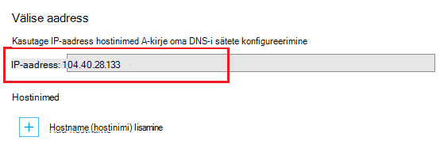

<properties
    pageTitle="Kohandatud domeeninime vastendamine Azure rakendus"
    description="Saate teada, kuidas vastendada rakenduse Azure'i rakendust Service kohandatud domeeni nime (edevus Domeen)."
    services="app-service"
    documentationCenter=""
    authors="cephalin"
    manager="wpickett"
    editor="jimbe"
    tags="top-support-issue"/>

<tags
    ms.service="app-service"
    ms.workload="na"
    ms.tgt_pltfrm="na"
    ms.devlang="na"
    ms.topic="article"
    ms.date="07/27/2016"
    ms.author="cephalin"/>

# Kohandatud domeeninime vastendamine Azure rakendus

[AZURE.INCLUDE [web-selector](../../includes/websites-custom-domain-selector.md)]

Selles artiklis kirjeldatakse, kuidas käsitsi vastendamiseks kohandatud domeeninime oma veebirakenduse, mobiilirakenduse kirjutamata või API rakenduse [Azure'i rakendust Service](../app-service/app-service-value-prop-what-is.md). 

Rakenduse juba on kordumatu alamdomeen azurewebsites.net. Näiteks kui rakenduse nimi on **contoso**, siis selle domeeni nimi on **contoso.azurewebsites.net**. Siiski saate vastendada kohandatud domeeni nime rakendusse nii mis selle URL, näiteks `www.contoso.com`, kajastab kaubamärgi.

>[AZURE.NOTE] Pöörduge abi saamiseks [Azure'i Foorumid](https://azure.microsoft.com/support/forums/)Azure eksperdid. Isegi kõrgema taseme tugi, [Azure tugiteenuste sait](https://azure.microsoft.com/support/options/) ja klõpsake nuppu **Saada toetavad**.

[AZURE.INCLUDE [introfooter](../../includes/custom-dns-web-site-intro-notes.md)]

## Azure'i portaalis uue kohandatud domeeni ostmine

Kui te pole seda juba ostnud kohandatud domeeninime, saate osta ja hallata otse oma rakenduse sätted [Azure portaali](https://portal.azure.com). See suvand on lihtne vastendamiseks kohandatud domeeni oma rakenduste kohta, kas teie rakendus kasutab [Azure liikluse haldur](web-sites-traffic-manager-custom-domain-name.md) või mitte. 

Juhised leiate teemast [rakenduse teenuse jaoks kohandatud domeeninime ostmine](custom-dns-web-site-buydomains-web-app.md).

## Kohandatud domeeni ostsite väliselt vastendamine

Kui olete juba ostnud kohandatud domeeni [Azure'i DNS-i](https://azure.microsoft.com/services/dns/) või muu pakkuja kaudu, on kolm põhitoimingut vastendamiseks kohandatud domeeni rakenduse.

1. [ *(Ainult mõne kirje)* hankimine rakenduse IP-aadress](#vip).
2. [Map rakendusse oma domeeni DNS-kirjete loomine](#createdns). 
    - **Kus**: oma domeeni nimeservereid domeenregistraatori halduse tööriista (nt Azure DNS-i, GoDaddy jne).
    - **Miks**: nii, et teie domeeniregistraator teab annab tulemiks Azure rakenduse soovitud kohandatud domeeni.
1. [Azure'i rakenduse kohandatud domeeni nime](#enable).
    - **Kus**: [Azure'i portaalis](https://portal.azure.com).
    - **Miks**: nii rakenduse teab vastata taotlusi kohandatud domeeni nimi.
3. [Kontrollige DNS paljundamine](#verify).

### Saate domeene tüübid

Azure'i rakendust Service võimaldab teil rakenduse kohandatud domeenide järgmisi vastendada.

- **Juurdomeeni** – saate reserveeritud domeeniregistraatori juures domeeni domeeni nimi (tähistab soovitud `@` hosti kirje tavaliselt). Nt **contoso.com**.
- **Alamdomeen** - mis on teie juurdomeeni domeene. Näiteks **www.contoso.com** (tähistab soovitud `www` hosti kirje).  Saate erinevate alamdomeenide sama juurdomeeni erinevate rakenduste Azure vastendada.
- **Metamärkide domeeni** - [mis tahes alamdomeen, mille vasakpoolse DNS-i silt on `*` ](https://en.wikipedia.org/wiki/Wildcard_DNS_record) (nt hosti kirjed `*` ja `*.blogs`). Näiteks ** \*. contoso.com**.

### Saate kasutada DNS-i kirjete tüübid

Sõltuvalt oma vaja, saate kasutada kaht erinevat tüüpi standardse DNS-i kirjete vastendamiseks kohandatud domeeni: 

- [A](https://en.wikipedia.org/wiki/List_of_DNS_record_types#A) - oma kohandatud domeeni nime Azure rakenduse virtuaalse IP aadress otse kaardid. 
- [CNAME](https://en.wikipedia.org/wiki/CNAME_record) - kaartide oma kohandatud domeeni nimi oma rakenduse Azure domeeninime * *&lt;*rakendusenimi*>. azurewebsites.net**. 

Samuti on see eelis, CNAME, et see ei lahene üle IP-aadress muutub. Kui kustutate ja rakenduse uuesti luua või muuta hinnakirjad jõudmine tagasi **ühiskasutuses** taseme oma rakenduse virtuaalse IP-aadress võib muutuda. Läbi muutmine, CNAME-kirje on endiselt olemas, A-kirje on vaja värskendust. 

Õpetuse näete juhiseid A-kirje kasutamise kohta ning samuti CNAME-kirje abil.

>[AZURE.IMPORTANT] Looge CNAME-kirje oma juurdomeeni (nt "juurkausta kirje"). Lisateabe saamiseks lugege teemat [miks ei saa CNAME-kirje kasutada ka juurdomeeni](http://serverfault.com/questions/613829/why-cant-a-cname-record-be-used-at-the-apex-aka-root-of-a-domain).
Vastendage juurdomeeni Azure rakenduse, kasutage selle asemel A-kirje.

## Samm 1. *(Ainult mõne kirje)* Saada rakenduse IP-aadress
Kohandatud domeeninime kasutamine A-kirje vastendamiseks peate Azure rakenduse IP-aadress. Kui vastendate CNAME-kirjet selle asemel kasutada, jätke see juhis vahele ja peale järgmise jaotise teisaldamine.

1.  [Azure'i portaali](https://portal.azure.com)sisse logida.

2.  Klõpsake vasakul menüüs **Rakenduse teenused** .

4.  Klõpsake rakenduse ja seejärel klõpsake nuppu **kohandatud domeenid**.

6.  Võtke teadmiseks IP-aadressi hostinimed jaotise kohal.

    

7.  Selle portaali blade lahti jätta. Jõuate tagasi selle kui loote DNS-i kirjed.

## Samm 2. Looge DNS-i kirjeid

Logige sisse oma domeeniregistraatori ja nende tööriista abil saate lisada A-kirje või CNAME-kirje. Iga domeeniregistraatori UI on veidi teistsugused, pöörduge oma pakkuja dokumentatsioonist. Aga siin on mõned üldised juhised.

1.  Otsige DNS-i kirjete haldamise leht. Otsige linke või alade nimega **Domeeni nimi**, **DNS-i**või **Name Server Management**saidile. Sageli leiate lingi Kontoteabe vaatamiseks ja seejärel otsin lingi, nt **Minu Domeenid**.
2.  Otsige linki, mis võimaldab teil DNS-i kirjete lisamine või redigeerimine. See võib olla **tsoonifail** või **DNS-i kirjeid** või mõne **Täpsemalt** konfiguratsiooni link.
3.  Kirjet luua ja salvestada muudatused.
    - [Siin on juhised A-kirje](#a).
    - [Siin on juhised CNAME-kirje](#cname).

### A-kirje loomine

A-kirje vastendamiseks Azure rakenduse IP-aadressi kasutamiseks peate tegelikult nii A-kirje ja TXT-kirje loomine. A-kirje on ise DNS-i eraldusvõime ja TXT-kirje on Azure nimi kohandatud domeeni omandiõiguse kinnitamiseks. 

A-kirje konfigureerimine järgmiselt (@ tavaliselt tähistab juurdomeeni nime kujul):
 
<table cellspacing="0" border="1">
  <tr>
    <th>FQDN näide</th>
    <th>Host</th>
    <th>Väärtus</th>
  </tr>
  <tr>
    <td>contoso.com (juur)</td>
    <td>@</td>
    <td>IP-aadressi <a href="#vip">samm 1</a></td>
  </tr>
  <tr>
    <td>www.contoso.com (all)</td>
    <td>www</td>
    <td>IP-aadressi <a href="#vip">samm 1</a></td>
  </tr>
  <tr>
    <td>*. contoso.com (metamärkide)</td>
    <td>*</td>
    <td>IP-aadressi <a href="#vip">samm 1</a></td>
  </tr>
</table>

Täiendavad TXT-kirje, et kaarte võtab &lt; *alamdomeen*>. &lt; *rootdomain*> abil &lt; *rakendusenimi*>. azurewebsites.net. TXT-kirje konfigureerimine järgmiselt:

<table cellspacing="0" border="1">
  <tr>
    <th>FQDN näide</th>
    <th>TXT Host</th>
    <th>TXT-väärtus</th>
  </tr>
  <tr>
    <td>contoso.com (juur)</td>
    <td>@</td>
    <td>&lt;<i>rakendusenimi</i>>. azurewebsites.net</td>
  </tr>
  <tr>
    <td>www.contoso.com (all)</td>
    <td>www</td>
    <td>&lt;<i>rakendusenimi</i>>. azurewebsites.net</td>
  </tr>
  <tr>
    <td>*. contoso.com (metamärkide)</td>
    <td>*</td>
    <td>&lt;<i>rakendusenimi</i>>. azurewebsites.net</td>
  </tr>
</table>

###CNAME-kirje

Kui kasutate vastendamiseks Azure rakenduse vaikedomeeninime CNAME-kirje, ei pea te TXT lisakirje midagi teha A-kirje. 

>[AZURE.IMPORTANT] Looge CNAME-kirje oma juurdomeeni (nt "juurkausta kirje"). Lisateabe saamiseks lugege teemat [miks ei saa CNAME-kirje kasutada ka juurdomeeni](http://serverfault.com/questions/613829/why-cant-a-cname-record-be-used-at-the-apex-aka-root-of-a-domain).
Vastendage juurdomeeni Azure rakenduse, kasutage selle asemel on [A-kirje](#a) .

Teie CNAME-kirje konfigureerimine järgmiselt (@ tavaliselt tähistab juurdomeeni nime kujul):

<table cellspacing="0" border="1">
  <tr>
    <th>FQDN näide</th>
    <th>CNAME-i hosti</th>
    <th>CNAME-i väärtus</th>
  </tr>
  <tr>
    <td>www.contoso.com (all)</td>
    <td>www</td>
    <td>&lt;<i>rakendusenimi</i>>. azurewebsites.net</td>
  </tr>
  <tr>
    <td>*. contoso.com (metamärkide)</td>
    <td>*</td>
    <td>&lt;<i>rakendusenimi</i>>. azurewebsites.net</td>
  </tr>
</table>

##Samm 3. Lubage oma rakenduse kohandatud domeeni nimi

Uuesti sisse, kui **Kohandatud domeenide** tera Azure'i portaalis (vt [Samm 1](#vip)), peate lisama oma kohandatud domeeni täielikult täielik domeeninimi (FQDN) loend.

1.  Kui te pole seda veel teinud, [Azure portaali](https://portal.azure.com)sisselogimine.

2.  Azure'i portaalis, klõpsake vasakul menüüs **Rakenduse teenused** .

3.  Rakenduse ja seejärel käsku **kohandatud domeenide** > **Lisa hostname (hostinimi)**.

4.  Lisada kohandatud domeeni FQDN loendi (nt **www.contoso.com**).

    

    >[AZURE.NOTE] Azure'i proovib kontrollida domeeni nimi, mida saate kasutada siin. Olla kindel, et see on sama domeeninime lõite DNS-i kirje [Samm](#createdns)2. 

5.  Klõpsake nuppu **Valideeri**.

6.  Pärast **kontrolli** Azure'i klõpsates kuvatakse võrgukoosolekuga domeeni kinnitamise töövoog. See otsida domeeni omandiõiguse kui ka Hostname kättesaadavus ja aruande edu või tõrke üksikasjalik koos asemel arendus kohta, kuidas parandada viga.    

7.  **Lisa hostname** eduka kinnitamisel muutub nupp aktiivne ja saab hostname määramine. 

8.  Kui Azure lõpetab konfigureerimine oma uue kohandatud domeeni nimi, liikuge brauseris oma kohandatud domeeni nime. Brauseris avatakse teie Azure rakendus, mis tähendab, et teie kohandatud domeeni nimi on õigesti konfigureeritud.

> [AZURE.NOTE] Kui DNS-i kirje on juba (active domain kus pakutakse liikluse stsenaarium) kasutada, ja teil on vaja sisaldab ennatlikult siduda oma veebirakenduse selle domeeni kinnitamiseks, siis lihtsalt luua TXT-kirjed näitena järgmises tabelis. Täiendavad TXT-kirje, et kaarte võtab &lt; *alamdomeen*>. &lt; *rootdomain*> abil &lt; *rakendusenimi*>. azurewebsites.net. 
> <table cellspacing="0" border="1">
  <tr>
    <th>FQDN näide</th>
    <th>TXT Host</th>
    <th>TXT-väärtus</th>
  </tr>
  <tr>
    <td>contoso.com (juur)</td>
    <td>awverify.contoso.com</td>
    <td>&lt;<i>rakendusenimi</i>>. azurewebsites.net</td>
  </tr>
  <tr>
    <td>www.contoso.com (all)</td>
    <td>awverify.www.contoso.com</td>
    <td>&lt;<i>rakendusenimi</i>>. azurewebsites.net</td>
  </tr>
    <tr>
    <td>*. contoso.com (all)</td>
    <td>awverify.*.contoso.com</td>
    <td>&lt;<i>rakendusenimi</i>>. azurewebsites.net</td>
  </tr>
</table>
Kui DNS-kirje on loodud, minge tagasi Azure portaali ja lisada oma kohandatud domeeni nimi oma veebirakenduse.
 

##Veenduge, et DNS paljundamine

Kui olete lõpetanud konfigureerimise juhised, võib kuluda aega muudatuste levitamine, sõltuvalt teie DNS-i pakkuja. Saate kontrollida, et DNS paljundamine ei tööta oodatud viisil, kasutades [http://digwebinterface.com/](http://digwebinterface.com/). Kui te liikuge sirvides saidini, määrake soovitud hostinimed tekstiväljale ja klõpsake **tõrkeid**. Kontrollige tulemused kui tehtud muudatused on jõustunud kinnitamiseks.  

> [AZURE.NOTE] DNS-i kirjed ning võib kuluda kuni 48 tundi (mõnikord enam). Kui kõik on õigesti konfigureeritud, peate endiselt paljundamine õnnestub ootamine.

## Järgmised sammud
Saate teada, kuidas turvaline [SSL-serdi Azure ostmise](web-sites-purchase-ssl-web-site.md) või [kasutades SSL-serdi mujalt](web-sites-configure-ssl-certificate.md)HTTPS-i abil kohandatud domeeninime.

>[AZURE.NOTE] Kui soovite alustada Azure'i rakendust Service enne Azure'i konto kasutajaks, minge [Proovige rakenduse teenus](http://go.microsoft.com/fwlink/?LinkId=523751), kus saate kohe luua lühiajaline starter web app rakenduse teenus. Nõutav; krediitkaardid kohustusi.

[Azure'i DNS-i kasutamise alustamine](../dns/dns-getstarted-create-dnszone.md)  
[Luua kohandatud domeeni DNS-i kirjete web app](../dns/dns-web-sites-custom-domain.md)  
[Volitatud esindaja Azure DNS-i domeeni](../dns/dns-domain-delegation.md)

<!-- Images -->
[subdomain]: media/web-sites-custom-domain-name/azurewebsites-subdomain.png
