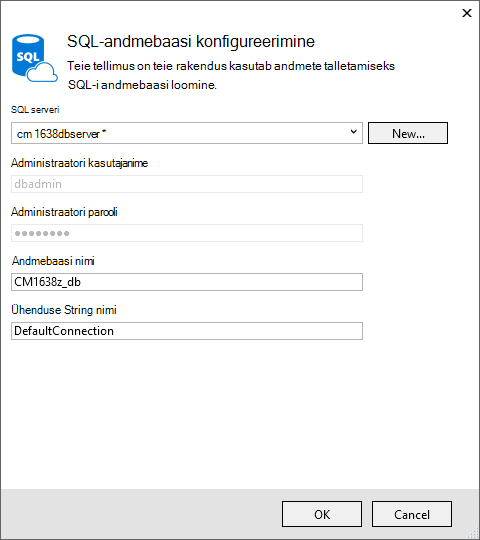
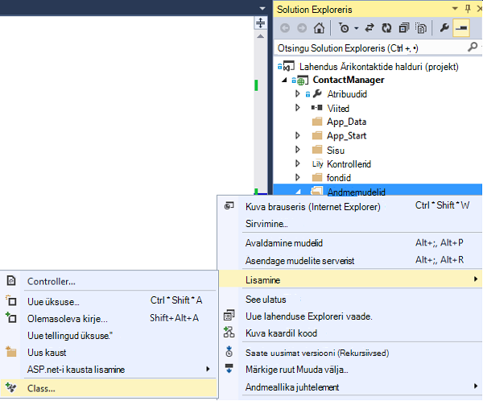
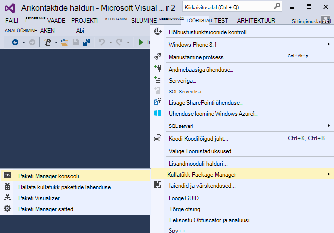

<properties 
    pageTitle="ASP.net-i MVC rakenduse auth ja SQL-i DB loomine ja juurutamine Azure'i rakendust Service" 
    description="Saate teada, kuidas töötada koos SQL-andmebaasi tagaandmebaas rakenduse ASP.net-i MVC 5, lisage autentimise ja luba ja selle juurutama Azure." 
    services="app-service\web" 
    documentationCenter=".net" 
    authors="Rick-Anderson" 
    writer="Rick-Anderson" 
    manager="wpickett" 
    editor=""/>

<tags 
    ms.service="app-service-web" 
    ms.workload="web" 
    ms.tgt_pltfrm="na" 
    ms.devlang="dotnet" 
    ms.topic="article" 
    ms.date="03/21/2016" 
    ms.author="riande"/> 

# ASP.net-i MVC rakenduse auth ja SQL-i DB loomine ja juurutamine Azure'i rakendust Service

Selle õpetuse näitab, kuidas luua turvalist ASP.net-i MVC 5 web appi võimaldab kasutajad Logi mandaadid Facebookist või Google. Rakendus on lihtne kontakti loend, mis kasutab ADO.net-i üksuse raames Accessi andmebaasi. [Azure'i rakendust Service](http://go.microsoft.com/fwlink/?LinkId=529714)kuvatakse rakenduse juurutamiseks. 

Lõpuleviimise õpetuse, siis on teil turvaline Andmepõhiste veebirakenduse üles ja pilves ja kasutades cloud andmebaasi. Järgmisel joonisel on täidetud taotluse sisselogimise leht.

![sisselogimislehe][rxb]

Saate teada:

* Kuidas luua turvalist ASP.net-i MVC 5 web projekti Visual Studios.
* Kuidas autentimiseks ja logige sisse oma Google'i või Facebooki kontode (social pakkuja autentimist kasutades [OAuth 2.0](http://oauth.net/2 "http://oauth.net/2")) mandaadi kasutajarühma autoriseerida.
* Kuidas autentimiseks ja lubada kasutajad, kes registri andmebaasi haldab rakendus (kohaliku autentimist kasutades [ASP.net-i identiteedi](http://asp.net/identity/)).
* Kuidas kasutada ADO.NET olemi Framework 6 kood esmalt andmete lugemine ja kirjutamine SQL-andmebaasis.
* Kuidas kasutada andmebaasi juurutamiseks üksus Framework koodi esimese migratsioon.
* Kuidas säilitada relatsiooniliste andmete pilves, kasutades Azure SQL-andmebaas.
* Kuidas web projekt, mis kasutab andmebaasi või [veebirakenduse](http://go.microsoft.com/fwlink/?LinkId=529714) teenuses Azure rakenduse juurutamine.

>[AZURE.NOTE] See on pikk õpetus. Kui soovite Azure'i rakendust Service ja Visual Studio web projektide tutvustuse, lugege teemat [loomine Azure'i rakendust Service ASP.net-i web app](web-sites-dotnet-get-started.md). Tõrkeotsingu teave, leiate jaotisest [tõrkeotsing](#troubleshooting) .
>
>Või kui soovite alustada Azure'i rakendust Service enne Azure'i konto kasutajaks, [Proovige rakenduse teenus](http://go.microsoft.com/fwlink/?LinkId=523751), kus saate kohe luua lühiajaline starter web app rakenduse teenus. Nõutav; krediitkaardid kohustusi.

## Eeltingimused

Selle õpetuse tegemiseks on vaja Microsoft Azure'i kontosse. Kui teil pole kontot, saate [aktiveerida oma Visual Studio abonendi kasu](/pricing/member-offers/msdn-benefits-details/?WT.mc_id=A261C142F) või [tasuta prooviversiooni kasutajaks](/pricing/free-trial/?WT.mc_id=A261C142F).

Häälestada oma arenduskeskkond, tuleb teil installida [Visual Studio 2013 värskenduse 5](http://go.microsoft.com/fwlink/?LinkId=390521) või uuem versioon, ja [Azure SDK .net-i](http://go.microsoft.com/fwlink/?linkid=324322&clcid=0x409)uusim versioon. Selles artiklis on kirjutatud Visual Studio värskenduse 4 ja SDK 2.8.1. Sama juhiseid töö Visual Studio 2015 uusim [Azure SDK .net-i](http://go.microsoft.com/fwlink/?linkid=518003&clcid=0x409) installitud, kuid mõned ekraanid erineb illustratsioonid prindituna välja näeb.

## ASP.net-i MVC 5 rakenduse loomine

### Projekti loomine

1. Klõpsake menüü **fail** käsku **Uus projekt**.

    

1. Dialoogiboksis **Uus projekt** laiendamine **C#** ja valige **Web** jaotises **Installitud Mallid**ja valige **ASP.net-i veebirakenduse**. **ContactManager**rakenduse nimi ja seejärel klõpsake nuppu **OK**.

    
 
    **Märkus:** Veenduge, et sisestate "ContactManager". Koodi plokid, mida te kopeerimine hiljem eeldab, et projekti nime ei ContactManager. 

1. Valige dialoogiboksis **Uue ASP.net-i projekti** **MVC** mall. Kontrollige **autentimine** on seatud **Üksikute kasutajakontode**, **Host pilveteenuses** on märgitud ja **Rakenduse teenus** on valitud.

    

1. Klõpsake nuppu **OK**.

1. Kuvatakse dialoogiboks **Microsoft Azure'i Web Appi sätete konfigureerimine** . Kui peate sisse logida, kui te pole seda juba teinud, või sisestage oma mandaat, kui teie sisselogimise on aegunud.

1. Valikuline – muutmine **veebirakenduse nimi** väärtus väljal (vt pilti allpool).

    Veebirakenduse URL on {nimi} .azurewebsites .net-i, et nimi peab olema kordumatu azurewebsites.net domeeni. Konfiguratsiooniviisardi soovitab kordumatu nimi, lisades arvu projekti nimi "ContactManager" ja see on hea selles õpetuses.

5. **Ressursirühm** valige rippmenüüst olemasolevasse rühma või **luua uue ressursirühma**(vt pilti allpool). 

    Soovi korral võite valida ressursirühm, mida teil on juba olemas. Kuid kui loote uue ressursirühma ja kasutage seda ainult selles õpetuses, on lihtne kustutada kõik Azure ressursse, mis on loodud õpetuse, kui olete lõpetanud nendega. Ressursi rühmade kohta leiate teemast [Azure ressursihaldur ülevaade](../azure-resource-manager/resource-group-overview.md). 

5. **Rakenduse teenusleping** valige rippmenüüst Vali olemasolev leping või **Loo uus rakendus teenuse kavandamine**(vt pilti allpool).

    Soovi korral võite valida rakenduse teenuse leping, millele teil juba on. Vt rakenduse teenuse lepingute kohta leiate [Azure'i rakendust Service lepingute põhjalik ülevaade](../app-service/azure-web-sites-web-hosting-plans-in-depth-overview.md). 

1. Puudutage käsku **Uuri Azure lisateenuse** SQL-andmebaasi lisada.

    

1. Koputage soovitud **+** SQL-andmebaasi lisamiseks ikooni.

    

1. Puudutage valikuid **Uus** dialoogiboksis **SQL-andmebaasi konfigureerimine** :

    

1. Sisestage nimi administraator ja keeruka parooli.

    

    Serveri nimi peab olema kordumatu. See võib sisaldada sidekriipse väiketähed tähed ja kahekohalise arvuna. See ei tohi sisaldada sidekriipsu lõpunullid. Kasutajanimi ja parool on uue loote uue serveri identimisteavet. 

    Kui teil on juba andmebaasiserveri, võite valida mis ühte loomise asemel. Andmebaasi serverid on väärtuslik vahend, ja soovite üldiselt mitut andmebaasi loomine sama serveri testimine ja kui loomine andmebaasiserveriga andmebaasi kohta. Siiski selles õpetuses ainult peate server ajutiselt ja luues serveri sama ressursirühm veebisaiti, mida teha lihtne kustutada nii web app ja andmebaasi ressursid kustutades ressursirühma, kui olete lõpetanud õpetuse. 

    Kui valite olemasoleva andmebaasi serveri, veenduge, et teie web appi ja andmebaas on samas piirkonnas.

    

4. Koputage nuppu **Loo**.

    Visual Studio loob ContactManager web projekt, ressursirühm ja rakenduse teenusleping, mille määrasite, loob ja loob teenuses Azure rakenduse web appi, mille teie määratud nimi.

### Määrake lehe päis ja jalus

1. Avage **Solution** Exploreris *Layout.cshtml* fail *Views\Shared* kausta.

    ![_Layout.cshtml Solution Exploreris][newapp004]

1. Järgmine kood ActionLink *Layout.cshtml* faili asendada.

    @Html.ActionLink("CMDemo","Index","Kontaktid"uus {ala =" "}, uus { @class ="navigeerimisriba Mark"})
                   

    Veenduge, et saate muuta kolmanda parameetri "Kodus", "Kontaktid". Ülaltoodud märgistus loob lingi "Kontaktid" register meetod kontaktide kontrolleril igale leheküljele. Muuta rakenduse nimi päise ja jaluse rakendusest"minu ASP.net-i" ja "Rakenduse nimi", "Ärikontaktide halduri" ja "CM Demo". 
 
### Käivitage rakendus kohalikult

1. Vajutage klahvikombinatsiooni CTRL + F5 rakenduse käivitamiseks.

    Rakenduse avalehele kuvatakse vaikimisi brauser.

    

See on kõik, mida peate tegema nüüd juurutamist Azure rakenduse loomiseks. 

## Azure'i rakenduse juurutamine

1. Visual Studios, paremklõpsake **Solution** Exploreris projekt ja valige kontekstimenüüst **Avalda** .

    
    
    Avatakse viisard **Avaldamine veebis** .

1. Klõpsake dialoogiboksis **Veebis avaldamine** nuppu **Avalda**.

    

    Olete loonud rakendus töötab nüüd pilveteenuses. Järgmine kord, kui rakenduse, ainult muudetud (või uue) faile juurutatud.

    

## Projekti SSL-i lubamine ##

1. **Solution Exploreris** **ContactManager** projekt, klõpsake käsku **Atribuudid** akna avamiseks klahvi F4.

3. Muuta **SSL-i lubatud** väärtuseks **True**. 

4. Kopeerige **SSL-i URL-i**.

    SSL-i URL-i saab https://localhost:44300 / juhul, kui olete varem loonud SSL-i veebirakenduste.

    ![SSL-i lubamine][rxSSL]
 
1. **Ärikontaktide halduri** projekti Paremklõpsake **Solution Exploreris**, ja klõpsake käsku **Atribuudid**.

1. Klõpsake vahekaarti **Veeb** .

1. Saate muuta **Projekti URL-i** kasutada **SSL-i URL-i** ja salvestage seejärel leht (juhtelemendi S).

    
 
1. Veenduge, et Internet Explorer oleks brauserit, mis käivitab Visual Studios, nagu on näidatud järgmisel pildil.

    

    Brauseri Vaateselektori saate määrata käivitab Visual Studio brauseris. Saate valida mitme brauserid ja värskendada iga brauseris, kui muudate Visual Studio on. Lisateabe saamiseks vaadake teemat [Visual Studio 2013 abil brauseri Link](http://www.asp.net/visual-studio/overview/2013/using-browser-link).

    

1. Vajutage klahvikombinatsiooni CTRL + F5 rakenduse käivitamiseks. Klõpsake nuppu **Jah** alustamiseks usaldusväärsed iseallkirjastatud sert, mida IIS-i kiire on loodud.

     

1. Dialoogiboks **Turbehoiatus** lugemine ja klõpsake nuppu **Jah** , kui soovite installida tähistav **localhost**sert.

    

1. IE kuvatakse lehe *Avaleht* ja on SSL-i hoiatusi pole.

     

     Internet Explorer on hea valik, kui kasutate SSL-i, sest see aktsepteerib serti ja kuvatakse hoiatus ilma HTTPS-i sisu. Microsoft Edge ja Google Chrome vastu ka sert. Firefoxi kasutab oma serdi talletamine, nii, et see kuvatakse hoiatus.

     

## Andmebaasi lisamine rakendusse

Järgmiseks tuleb värskendada rakenduse lisamiseks võimalus kuvada ja värskendada kontaktid ja salvestab andmed andmebaasis. Rakendus kasutab üksus Framework (EF) andmebaasi loomine ja lugemine ja andmete värskendamine.

### Andmete mudel tunnid kontaktide lisamine

Kõigepealt luua lihtsa andmemudeli koodi.

1. **Lahenduste Explorer**, paremklõpsake kausta mudelid, nuppu **Lisa**ja seejärel **ainekursuse**.

    

2. Dialoogiboksis **Lisa uus üksus** uue ainekursuse *Contact.cs*-faili nimi ja seejärel klõpsake nuppu **Lisa**.

    ![Dialoogiboks uue üksuse lisamine][adddb002]

3. Järgmine kood Contact.cs faili sisu asendada.

        using System.ComponentModel.DataAnnotations;
        using System.Globalization;
        namespace ContactManager.Models
        {
            public class Contact
            {
                public int ContactId { get; set; }
                public string Name { get; set; }
                public string Address { get; set; }
                public string City { get; set; }
                public string State { get; set; }
                public string Zip { get; set; }
                [DataType(DataType.EmailAddress)]
                public string Email { get; set; }
            }
        }
**Pöörduge** klassi määratleb salvestate iga kontakti pluss primaarvõtme *ContactID*, mis on vajalik andmebaasi andmeid.

### Luua veebilehti, mis rakenduse kasutajad saaksid selle kontaktidega töötamine

ASP.net-i MVC tellingute funktsioon saab automaatselt genereerida koodi, mis sooritavad loomine, lugemine, värskendamine ja kustutamine (CRUD) toimingud. 

1. Koostada projekt **(Ctrl + Shift + B)**. (Tuleb ehitada projekt enne kasutamist tellingud.)
 
1. **Lahenduste Explorer**, paremklõpsake kausta kontrollerid ja klõpsake nuppu **Lisa**ja klõpsake **kontrolleril**.

    ![Lisage selle domeenikontrolleri kontrollerid kaust kontekstimenüü][addcode001]

5. Dialoogiboksis **Tellingud lisamiseks** valige **MVC 5 kontrolleril abil EF vaatega** ja seejärel klõpsake nuppu **Lisa**.
    
    

1. Valige väljal **mudeli klassi** ripploend **kontakti (ContactManager.Models)**. (Vt allpool olevat pilti).

1. Valige **andmete kontekstis klassi** **ApplicationDbContext (ContactManager.Models)**. **ApplicationDbContext** kasutatakse nii liikmete DB ja meie kontaktandmed.

    

1. Klõpsake nuppu **Lisa**.

   Visual Studio loob mõne selle domeenikontrolleri meetodite ja vaadete CRUD andmebaasi toimingute jaoks **kontakti** objektid.

## Luba migratsioon, luua andmebaasi, näidisandmed ja andmete initializer lisamine ##

Järgmise ülesande on [Koodi esimese migratsioon](http://msdn.microsoft.com/library/hh770484.aspx) funktsiooni lubamine Andmebaasitabelite põhjal loodud andmemudel loomiseks.

1. Valige menüü **Tööriistad** **Nugeti Package Manager** ja seejärel **Package Manager konsooli**.

    

2. **Paketi Manager konsooli** aknas, sisestage järgmine käsk:

        enable-migrations

    Käsk **Luba-migratsioon** loob *migratsioon* kausta ja paigutab selle selles kaustas *Configuration.cs* faili, mida saate redigeerida seeme andmebaas ja konfigureerimiseks migratsioon. 

2. **Paketi Manager konsooli** aknas, sisestage järgmine käsk:

        add-migration Initial

    Käsk **Lisa migreerimise algne** genereeritud fail nimega ** &lt;date_stamp&gt;algse** *migratsioon* kausta. Koodi selle faili loob andmebaasi tabelid. Esimese parameetrina ( **algse** ) saab luua faili nimi. Saate vaadata uue klassi faile **Solution**Exploreris.

    **Algne** klassi **üles** meetod loob tabeli kontaktid ja **alla** meetod (kui soovite naasta eelmisele olek) langeb see.

3. Avage fail *Migrations\Configuration.cs* . 

4. Lisage järgmine `using` lause. 

         using ContactManager.Models;

5. Asendage *seemne* meetod järgmine kood:

        protected override void Seed(ContactManager.Models.ApplicationDbContext context)
        {
            context.Contacts.AddOrUpdate(p => p.Name,
               new Contact
               {
                   Name = "Debra Garcia",
                   Address = "1234 Main St",
                   City = "Redmond",
                   State = "WA",
                   Zip = "10999",
                   Email = "debra@example.com",
               },
                new Contact
                {
                    Name = "Thorsten Weinrich",
                    Address = "5678 1st Ave W",
                    City = "Redmond",
                    State = "WA",
                    Zip = "10999",
                    Email = "thorsten@example.com",
                },
                new Contact
                {
                    Name = "Yuhong Li",
                    Address = "9012 State st",
                    City = "Redmond",
                    State = "WA",
                    Zip = "10999",
                    Email = "yuhong@example.com",
                },
                new Contact
                {
                    Name = "Jon Orton",
                    Address = "3456 Maple St",
                    City = "Redmond",
                    State = "WA",
                    Zip = "10999",
                    Email = "jon@example.com",
                },
                new Contact
                {
                    Name = "Diliana Alexieva-Bosseva",
                    Address = "7890 2nd Ave E",
                    City = "Redmond",
                    State = "WA",
                    Zip = "10999",
                    Email = "diliana@example.com",
                }
                );
        }

    Järgmine kood lähtestab (seemned) andmebaas koos kontaktteabega. Külv andmebaasi kohta leiate lisateavet teemast [Seeding ja DBs silumine üksus Framework (EF)](http://blogs.msdn.com/b/rickandy/archive/2013/02/12/seeding-and-debugging-entity-framework-ef-dbs.aspx). Luua projekti kinnitamiseks kompileerida vigu pole.

6. Sisestage **Paketi Manager konsooli** käsk:

        update-database

    ![Paketi halduri konsooli käsud][addcode009]

    **Update-andmebaasi** töötab esimest migreerimise, mis loob andmebaasi. Vaikimisi andmebaas on loodud SQL Server Express LocalDB andmebaasi. 

7. Vajutage klahvikombinatsiooni CTRL + F5, käivitage rakendus ja klõpsake seejärel linki **CM Demo** ; või liikuge https://localhost:(port#)/Cm. 

    Rakenduse seemne andmed kuvatakse ja Redigeeri, üksikasjad ja Kustuta lingid. Saate luua, redigeerida, kustutada ja andmete kuvamiseks.

    ![MVC andmete kuvamine][rx2]

## Mõne OAuth2 pakkuja lisamine

>[AZURE.NOTE] Üksikasjalikud juhised selle kohta, kuidas kasutada Google ja Facebook arendaja portaalisaitide, see kuueosalisest õppeteemade lingid ASP.net-i saidil. Siiski Google ja Facebook muuta nende saitide sagedamini need õpetused on värskendatud ja need on nüüd aegunud. Kui teil on probleeme, siis järgige, lugege esiletõstetud Disqus kommentaari selle õpetuse, mis on muutunud loendi lõpus. 

[OAuthi] (http://oauth.net/ "http://OAuth.net/") on lihtne ja standardse veebi mobiil- ja lauaarvutite rakendustest meetod turvaline autoriseerimine võimaldava avatud protokoll. ASP.net-i MVC internet Mall kasutab OAuthi esitamist Facebooki, Twitteri, Google ja Microsoft autentimisteenuse pakkujate. Kuigi see õpetus kasutab ainult Google pakkuja autentimine, saab hõlpsasti muuta koodi kasutada mõne loetletud teenusepakkuja. Muude teenusepakkujate kasutusele juhiseid on väga sarnased näete selle õpetuse juhised. Kasuta Facebooki autentimisteenuse pakkuja, leiate [MVC 5 rakenduse Facebooki, Twitteri, LinkedIni ja Google OAuth2 sisselogimise ](http://www.asp.net/mvc/tutorials/mvc-5/create-an-aspnet-mvc-5-app-with-facebook-and-google-oauth2-and-openid-sign-on).

Lisaks autentimine, kasutab selles õpetuses rakendada autoriseerimine rollid. Ainult need kasutajad, et lisate *canEdit* roll, on võimalik muuta andmete (st loomine, redigeerimine või kustutamine kontaktid).

1. Järgige [MVC 5 rakenduse Facebooki, Twitteri, LinkedIni ja Google OAuth2 sisselogimise](http://www.asp.net/mvc/tutorials/mvc-5/create-an-aspnet-mvc-5-app-with-facebook-and-google-oauth2-and-openid-sign-on#goog) jaotise **loomine Google rakenduse OAuthi 2 Google rakenduse OAuth2 jaoks häälestamiseks**.

3. Käivita ja testida rakenduse kinnitamaks, et saate sisse logida Google autentimist kasutades.

2. Kui soovite luua social login nupud teenusepakkuja kohased ikoonid, lugege teemat [päris social login nupud ASP.net-i MVC 5](http://www.jerriepelser.com/blog/pretty-social-login-buttons-for-asp-net-mvc-5)

## Liikmete API kasutamine

Selles jaotises tuleb lisada kohalik kasutaja ja *canEdit* rolli liikmelisuse andmebaas. Andmete redigeerimiseks on võimalik ainult need kasutajad *canEdit* roll. Hea tava on nimi rollid, toimingud, mida nad saavad teha, nii, et *canEdit* eelistatakse nimetatakse *administraatori*rollid. Kui teie taotlus areneb, saate lisada uue rollid, nt *canDeleteMembers* , mitte vähem kirjeldav *superAdmin*.

1. Avage fail *migrations\configuration.cs* ja lisage järgmine `using` laused:

        using Microsoft.AspNet.Identity;
        using Microsoft.AspNet.Identity.EntityFramework;

1. Saate lisada klassi **AddUserAndRole** järgmisel viisil:

        bool AddUserAndRole(ContactManager.Models.ApplicationDbContext context)
        {
            IdentityResult ir;
            var rm = new RoleManager<IdentityRole>
                (new RoleStore<IdentityRole>(context));
            ir = rm.Create(new IdentityRole("canEdit"));
            var um = new UserManager<ApplicationUser>(
                new UserStore<ApplicationUser>(context));
            var user = new ApplicationUser()
            {
                UserName = "user1@contoso.com",
            };
            ir = um.Create(user, "P_assw0rd1");
            if (ir.Succeeded == false)
                return ir.Succeeded;
            ir = um.AddToRole(user.Id, "canEdit");
            return ir.Succeeded;
        }

1. Uue meetodi helistada **seemne** meetod.

        protected override void Seed(ContactManager.Models.ApplicationDbContext context)
        {
            AddUserAndRole(context);
            context.Contacts.AddOrUpdate(p => p.Name,
                // Code removed for brevity
        }

    Järgmistel piltidel on kuvatud *seemne* meetod muudatustest.

    

    Järgmine kood loob uue nimega *canEdit*rolli, luuakse uus kohalik kasutaja *user1@contoso.com*, ja lisab *user1@contoso.com* *canEdit* rolli. Lisateabe saamiseks vt [ASP.net-i identiteedi õpetused](http://www.asp.net/identity/overview/features-api) ASP.net-i saidile.

## Lisa uus Social Login kasutajad ajutine koodi abil canEdit roll  ##

Selles jaotises te ajutiselt muuta konto kontrolleril lisada uusi kasutajaid registreerimisel *canEdit* rolli pakkujaga OAuthi **ExternalLoginConfirmation** meetod. Loodame pakkuda tööriista sarnane [WSAT](http://msdn.microsoft.com/library/ms228053.aspx) tulevikus mis võimaldab teil luua ja redigeerida Kasutajakontod ja rollid. Seni saate täita sama funktsiooni ajutine koodi abil.

1. Avage fail **Controllers\AccountController.cs** ja liikuge **ExternalLoginConfirmation** meetod.

1. Lisage järgmise kõne **AddToRoleAsync** just enne **SignInAsync** kõne.

        await UserManager.AddToRoleAsync(user.Id, "canEdit");

   Ülaltoodud kood lisab äsja registreeritud kasutaja "canEdit" roll, mis annab neile juurdepääsu toimingu viise, mida muuta andmete (Redigeeri). Järgmised koodilõigu kuvatakse uus rida koodi kontekstis.

          // POST: /Account/ExternalLoginConfirmation
          [HttpPost]
          [AllowAnonymous]
          [ValidateAntiForgeryToken]
          public async Task ExternalLoginConfirmation(ExternalLoginConfirmationViewModel model, string returnUrl)
          {
             if (User.Identity.IsAuthenticated)
             {
                return RedirectToAction("Index", "Manage");
             }
             if (ModelState.IsValid)
             {
                // Get the information about the user from the external login provider
                var info = await AuthenticationManager.GetExternalLoginInfoAsync();
                if (info == null)
                {
                   return View("ExternalLoginFailure");
                }
                var user = new ApplicationUser { UserName = model.Email, Email = model.Email };
                var result = await UserManager.CreateAsync(user);
                if (result.Succeeded)
                {
                   result = await UserManager.AddLoginAsync(user.Id, info.Login);
                   if (result.Succeeded)
                   {
                      await UserManager.AddToRoleAsync(user.Id, "canEdit");
                      await SignInManager.SignInAsync(user, isPersistent: false, rememberBrowser: false);
                      return RedirectToLocal(returnUrl);
                   }
                }
                AddErrors(result);
             }
             ViewBag.ReturnUrl = returnUrl;
             return View(model);
          }

Allpool olevat õpetuse juurutamist Azure, kus teil on sisselogimiseks Google või muude tootjate autentimise teenusepakkuja rakendus. See lisab teie konto registreerunud *canEdit* roll. Igaüks, kes leiab oma veebirakenduse URL-i ja on Google ID saate registreerida ja värskendage oma andmebaasi. Saate takistada teistel seda, saate peatada saidile. Saate küll kontrollida, kes on *canEdit* roll uurides andmebaasi.

**Paketi Manager konsooli** tabas värskendatud NOOLEKLAHVI avab järgmine käsk:

        Update-Database

Käivitatakse käsk **Update andmebaasi** **seemne** meetodit ja varem lisatud **AddUserAndRole** meetod, mis töötab. **AddUserAndRole** meetod loob kasutaja *user1@contoso.com* ja lisab tema *canEdit* roll.

## SSL-i ja atribuudi Autoriseerin taotluse kaitsmine ##

Selles jaotises rakendate [Autoriseerin](http://msdn.microsoft.com/library/system.web.mvc.authorizeattribute.aspx) atribuut juurdepääsu piiramiseks toimingu meetoditest. Anonüümsete kasutajate jaoks saab vaadata ainult **registri** toimingu home kontrolleril. Registreeritud kasutajad saaksid kontaktandmed ( **Index** ja **üksikasjad** lehtedelt kontrolleril Cm), lehel teave ja kontakti lehe kuvamiseks. Accessi toimingu viise, mida andmeid muuta saab ainult need kasutajad, *canEdit* roll.

1. Avage fail *App_Start\FilterConfig.cs* ja Asendage *RegisterGlobalFilters* meetod (mis liidab kaks filtrid) järgmist:

        public static void RegisterGlobalFilters(GlobalFilterCollection filters)
        {
            filters.Add(new HandleErrorAttribute());
            filters.Add(new System.Web.Mvc.AuthorizeAttribute());
            filters.Add(new RequireHttpsAttribute());
        }
        
    Järgmine kood lisab rakenduse [Autoriseerin](http://msdn.microsoft.com/library/system.web.mvc.authorizeattribute.aspx) filtri ja [RequireHttps](http://msdn.microsoft.com/library/system.web.mvc.requirehttpsattribute.aspx) filter. Filtri [Autoriseerin](http://msdn.microsoft.com/library/system.web.mvc.authorizeattribute.aspx) takistab anonüümsete kasutajate juurdepääs rakenduse kõik meetodid. Kasutage [AllowAnonymous](http://blogs.msdn.com/b/rickandy/archive/2012/03/23/securing-your-asp-net-mvc-4-app-and-the-new-allowanonymous-attribute.aspx) atribuut loobuda autoriseerimine nõue paar meetodit, et anonüümsed kasutajad saate sisse logida ja saate vaadata avalehel. [RequireHttps](http://msdn.microsoft.com/library/system.web.mvc.requirehttpsattribute.aspx) nõuab kõigi access web appi HTTPS-i kaudu.

    Alternatiivne lähenemine on iga domeenikontrolleri [Autoriseerin](http://msdn.microsoft.com/library/system.web.mvc.authorizeattribute.aspx) atribuudi ja atribuudi [RequireHttps](http://msdn.microsoft.com/library/system.web.mvc.requirehttpsattribute.aspx) lisada, kuid see peetakse rakendamiseks kogu rakenduse levinud. Lisab globaalselt, iga uue domeenikontrolleri ja toimingu meetod lisamist on automaatselt kaitstud - te ei pea meeles pidada, et nende rakendamist. Lisateavet [rakenduse ASP.net-i MVC ja uus AllowAnonymous atribuut](http://blogs.msdn.com/b/rickandy/archive/2012/03/23/securing-your-asp-net-mvc-4-app-and-the-new-allowanonymous-attribute.aspx). 

1. Atribuut [AllowAnonymous](http://blogs.msdn.com/b/rickandy/archive/2012/03/23/securing-your-asp-net-mvc-4-app-and-the-new-allowanonymous-attribute.aspx) lisada Avaleht kontrolleril **register** meetod. Atribuut [AllowAnonymous](http://blogs.msdn.com/b/rickandy/archive/2012/03/23/securing-your-asp-net-mvc-4-app-and-the-new-allowanonymous-attribute.aspx) võimaldab teil valge loendisse meetodid, mida soovite loobuda autoriseerimine. 

        public class HomeController : Controller
        {
          [AllowAnonymous]
          public ActionResult Index()
          {
             return View();
          }

    Kui te ei tee globaalne otsimine *AllowAnonymous*, näete, et see on kasutusel konto lehel sisselogimine ja liitumine meetodid.

1. Lisage *CmController.cs*, `[Authorize(Roles = "canEdit")]` HttpGet ja HttpPost meetodid, mida muuta *Cm* kontrolleril andmeid (loomine, redigeerimine, kustutamine, iga toimingu meetod, välja arvatud Index ja üksikasjad). Täidetud koodi osa on allpool näidatud: 

        // GET: Cm/Create
        [Authorize(Roles = "canEdit")]
        public ActionResult Create()
        {
           return View(new Contact { Address = "123 N 456 W",
            City="Great Falls", Email = "ab@cd.com", Name="Joe Smith", State="MT",
           Zip = "59405"});
        }
        // POST: Cm/Create
        // To protect from overposting attacks, please enable the specific properties you want to bind to, for 
        // more details see http://go.microsoft.com/fwlink/?LinkId=317598.
        [HttpPost]
        [ValidateAntiForgeryToken]
         [Authorize(Roles = "canEdit")]
        public ActionResult Create([Bind(Include = "ContactId,Name,Address,City,State,Zip,Email")] Contact contact)
        {
            if (ModelState.IsValid)
            {
                db.Contacts.Add(contact);
                db.SaveChanges();
                return RedirectToAction("Index");
            }
            return View(contact);
        }
        // GET: Cm/Edit/5
        [Authorize(Roles = "canEdit")]
        public ActionResult Edit(int? id)
        {
            if (id == null)
            {
                return new HttpStatusCodeResult(HttpStatusCode.BadRequest);
            }
            Contact contact = db.Contacts.Find(id);
            if (contact == null)
            {
                return HttpNotFound();
            }
            return View(contact);
        }
        
1. Vajutage klahvikombinatsiooni CTRL + F5 rakenduse käivitamiseks.

1. Kui te ikka eelmise seansi loginud, tabas linki **Logi välja** .

1. Klõpsake **kohta,** või **pöörduge** lingid. Teid suunatakse ümber sisselogimislehele, kuna anonüümsed kasutajad ei saa vaadata nende lehtede.

1. Klõpsake linki **Uus kasutajaks** ja lisage kohalik kasutaja e-posti *joe@contoso.com*. Veenduge, et *Joe* saate vaadata Avaleht, teave ja lehtede poole. 

    

1. Klõpsake linki *CM Demo* ja kinnitage, et teie andmed.

1. Klõpsake nuppu Redigeeri linki, lehel, teid suunatakse lehele login (Kuna uus kohalik kasutaja ei lisata *canEdit* roll).

1. Logige *user1@contoso.com* parooliga, "P_assw0rd1" ("0" "sõna" on null). Teid suunatakse ümber lehele redigeerimine valitud. 
2. 

    Kui te ei saa seda kontot ja parooli, proovige parool lähtekoodi kopeerides ja kleepides see sisse logida. Kui te ikka ei saa sisse logida, märkige ruut **kasutajanimi** veerg **AspNetUsers** tabeli kinnitamiseks *user1@contoso.com* on lisatud. 

1. Kontrollige, kas saate andmeid muuta.

## Azure'i rakenduse juurutamine

1. Visual Studios, paremklõpsake **Solution** Exploreris projekt ja valige kontekstimenüüst **Avalda** .

    ![Projekti kontekstimenüüs avaldamine][firsdeploy003]

    Avatakse viisard **Avaldamine veebis** .

1. Vasakus servas **Veebis avaldamine** dialoogiboksi vahekaarti **sätted** . 

2. Valige jaotises **ApplicationDbContext** projekti loomisel loodud andmebaas.
   

1. Valige jaotises **ContactManagerContext**, **Käivitada koodi esimese migratsioon**.

    

1. Klõpsake nuppu **Avalda**.

1. Logige *user1@contoso.com* (parooliga "P_assw0rd1") ja kontrollige, kas saate andmeid redigeerida.

1. Logi välja.

1. Avage [Google arendajatele Console](https://console.developers.google.com/) ja **mandaadi** menüü update redirect URI-d ja JavaScripti Orgins kasutama Azure'i URL-i.

1. Logige sisse Google'i või Facebooki abil. Mis on Google'i või Facebooki konto lisamine **canEdit** roll. Kui kuvatakse tõrketeade HTTP 400 sõnumiga *redirect URI taotluse: https://contactmanager {minu version}.azurewebsites.net/signin-google ei ühti registreeritud suunata URI.*, peate ootama kuni teie tehtud muudatused on levitatud. Kui kuvatakse see tõrketeade rohkem kui mõne minuti pärast, veenduge, et soovitud URI-d on õiged.

### Veebirakenduse, et takistada teistel registreerimisel peatamine  

1. **Server Explorer**, liikuge **Azure > rakenduse teenus > {ressursirühma} > {oma veebirakenduse}**.

4. Paremklõpsake web appi ja valige **Peata**. 

    Teise võimalusena [Azure portaali](https://portal.azure.com/), saate minge web appi tera, siis tera ülaservas ikooni **Lõpeta** .

    

### Eemaldage AddToRoleAsync, avaldamine ja testimine

1. Kommentaar välja või **ExternalLoginConfirmation** meetod domeenikontrolleri konto eemaldamine järgmine kood:

        await UserManager.AddToRoleAsync(user.Id, "canEdit");

1. Koostada projekt (mis faili muudatused salvestatakse ja kinnitab, et teil pole vigu kompileerida).

5. Paremklõpsake **Solution** Exploreris projekt ja valige käsk **Avalda**.

       
    
4. Klõpsake nuppu **Käivita eelvaade** . Kasutatakse ainult failid, mis on vaja uuendada.

5. Käivitage veebirakenduse Visual Studio või portaali kaudu. **Te ei saa avaldada veebirakenduse on peatatud**.

    

5. Minge tagasi Visual Studio ja klõpsake nuppu **Avalda**.

3. Azure'i rakenduse avab vaikimisi brauseris. Kui olete sisse logitud, logige nii, et saate vaadata avalehel anonüümse kasutajana.  

4. Klõpsake linki **kohta** . Teid suunatakse ümber Logi leheküljel.

5. Logi lehel linki **registreerida** ja luua kohaliku konto. Kasutame selle kohaliku konto kinnitamiseks pääsete loetuks ainult lehed, kuid te ei pääse lehti, et muuta andmete (mis on kaitstud *canEdit* roll). Hiljem õpetuses eemaldate kohaliku konto juurdepääsu. 

    

1. Veenduge, et saate liikuda *kohta* ja *kontakti* lehed.

    

1. Klõpsake linki **CM Demo** **Cm** kontrolleril liikumiseks. Teise võimalusena saate lisada URL-i *Cm* . 

    
 
1. Redigeeri linki. 

    Teid suunatakse ümber sisselogimise lehele. 

2. Jaotises **kasutada mõnes muus teenuses sisse logida**, klõpsake Google või Facebook ja Logi sisse kontoga, mida eelnevalt registreeritud. (Kui töötate kiiresti ja teie seansi küpsis on aegunud, saate automaatselt logitakse Google või Facebooki kontoga, mida olete varem kasutanud.)

2. Veenduge, et saate redigeerimise ajal sisse loginud selle konto andmed.

    **Märkus:** Te ei saa välja logite Google see rakendus ja logige erinevate google kontole koos samas brauseris. Kui kasutate ühte brauseri, on teil liikuge Google ja Logi välja. Saate logida sisse teise kontoga sama kolmanda osapoole Autentija (nt Google) kaudu, kasutades mõnda muud brauserit.

    Kui te pole täitnud Google kontoteabe esimese ja viimase nimi, ilmneb mõni NullReferenceException.

## Uurida SQL Azure'i DB ##

1. **Server Explorer**, liikuge **Azure > SQL andmebaase > {andmebaasi}**

2. Paremklõpsake oma andmebaasi, ja seejärel valige käsk **Ava Exploreris SQL serveri objekti**.
 
    
 
3. Kui te pole varem selle andmebaasiga ühendatud, võidakse teil paluda praeguse IP-aadressi juurdepääsu lubamiseks tulemüüri reegli lisamine. IP-aadress on täidetud. Klõpsake lihtsalt nuppu **Lisa tulemüüri reegel** juurdepääsu lubamiseks.

    

3. Andmebaasi kasutajanime ja parooli, kui olete loonud andmebaasiserveri määratud sisse logida. 
 
1. Paremklõpsake tabelit **AspNetUsers** ja valige **Andmete kuvamine**.

    
 
1. Pange tähele **canEdit** roll olema registreerunud Google'i kontolt Id ja ID-d *user1@contoso.com*. Need peaks olema ainult kasutajate **canEdit** roll. (Te saate veenduge, et järgmise juhise juurde.)

    
 
2. **SQL serveri objekti Explorer**, paremklõpsake **AspNetUserRoles** ja valige **Andmete kuvamine**.

    
 
3. Veenduge, et **kasutajanimi** on *user1@contoso.com* ja Google konto registreeritud. 

## Tõrkeotsing

Kui teil tekib probleeme, siis siin on mõned soovitused, mida proovida.

* Tõrgete ettevalmistamise SQL-i andmebaasi – veenduge, et teil on installitud praeguse SDK. Enne 2.8.1 versioonid on viga, mis on mõnel juhul põhjustab tõrkeid, kui VS proovib andmebaasiserveri või andmebaasi loomine.
* Tõrketeade "toimingut ei toetata teie tellimuse pakkumise tüübist" kui loomine Azure ressursid – sama nagu eespool kirjeldatud.
* Tõrgete juurutamisel - vool läbi artikkel [lihtsa ASP.net-i juurutamist](web-sites-dotnet-get-started.md) . Et juurutamise stsenaarium on lihtsam ja kui teil on sama probleem see võib olla lihtsam eristada. Näiteks mõned enterprise keskkonnas ettevõtte tulemüüri võivad takistada Web juurutada erinevaid ühendusi Azure'i, mis eeldab.
* Võimalus valida ühendusstringi viisardis veebis avaldamine, kui juurutate – kui muu meetodi abil luua oma Azure ressursse (nt soovite võtta kasutusele veebirakenduse ja SQL-andmebaasi loodud portaalis), ei pruugi SQL-andmebaasi seostatud web appi. Lihtsaim lahendus on luua uue veebirakenduse ja andmebaasi VS abil, nagu on näidatud õpetuse. Teil pole üle õpetuse sammudega - veebis avaldamine viisardis saate valida, kas uue veebirakenduse loomine ja sama Azure ressursi loomise dialoog, mida saate projekti loomisel saate.
* Juhised Google või Facebook arendaja portaalis on aegunud – vaadake esiletõstetud Disqus kommentaari õppeteema lõpus.

## Järgmised sammud

Olete loonud lihtsa ASP.net-i MVC veebirakendus, mis autendib kasutajad. Põhitoimingud autentimist ja kuidas hoida tundliku loomuga andmete turvalist kohta leiate lisateavet teemast järgmised õppetükid.

- [Luua turvalist ASP.net-i MVC 5 web appi sisse logida, e-posti kinnituse ja parooli lähtestamine](http://www.asp.net/mvc/overview/getting-started/create-an-aspnet-mvc-5-web-app-with-email-confirmation-and-password-reset)
- [ASP.net-i MVC 5 rakenduse SMS ja e-posti kahekordne autentimine](http://www.asp.net/mvc/overview/getting-started/aspnet-mvc-5-app-with-sms-and-email-two-factor-authentication)
- [ASP.net-i ja Azure paroole ja muud delikaatset teavet juurutamine head tavad](http://www.asp.net/identity/overview/features-api/best-practices-for-deploying-passwords-and-other-sensitive-data-to-aspnet-and-azure) 
- [ASP.net-i MVC 5 Facebooki ja Google OAuth2 rakenduse loomine](http://www.asp.net/mvc/tutorials/mvc-5/create-an-aspnet-mvc-5-app-with-facebook-and-google-oauth2-and-openid-sign-on ) See hõlmab juhised, kuidas kasutaja registreerimise DB ja üksikasjalikke juhiseid kasutades Facebooki autentimisteenuse pakkuja profiili andmete lisamiseks.
- [ASP.net-i MVC 5 töötamise alustamine](http://www.asp.net/mvc/tutorials/mvc-5/introduction/getting-started)

Täpsemaid õpetuses üksuse raames kasutamise kohta leiate [EF ja MVC töötamise alustamine](http://www.asp.net/mvc/tutorials/getting-started-with-ef-using-mvc/creating-an-entity-framework-data-model-for-an-asp-net-mvc-application).

Selles õpetuses on kirjutatud [Rick Anderson](http://blogs.msdn.com/b/rickandy/) (Twitteri [@RickAndMSFT](https://twitter.com/RickAndMSFT)) abiga Tom Dykstra ja Barry Dorrans (Twitteri [@blowdart](https://twitter.com/blowdart)). 

***Palun tagasisidet*** , mis teile meeldinud või soovite näha täiustatud, mitte ainult enda õpetuse kohta, vaid ka toodete kohta, mis seda näitab. Teie tagasiside aitab tähtsuse täiustused. Saate taotleda ja uue teemade [Kuva minu kuidas koos](http://aspnet.uservoice.com/forums/228522-show-me-how-with-code)Code hääletada.

## Mis on muutunud

* Muuda juhend veebisaitide rakenduse teenusega leiate: [Azure'i rakendust Service ja selle mõju olemasoleva Azure'i teenused](http://go.microsoft.com/fwlink/?LinkId=529714)

<!-- bookmarks -->
[Add an OAuth Provider]: #addOauth
[Using the Membership API]:#mbrDB
[Create a Data Deployment Script]:#ppd
[Update the Membership Database]:#ppd2

[setupwindowsazureenv]: #bkmk_setupwindowsazure
[createapplication]: #bkmk_createmvc4app
[deployapp1]: #bkmk_deploytowindowsazure1
[deployapp11]: #bkmk_deploytowindowsazure11
[adddb]: #bkmk_addadatabase

<!-- images-->
[rx2]: ./media/web-sites-dotnet-deploy-aspnet-mvc-app-membership-oauth-sql-database/rx2.png

[rx5]: ./media/web-sites-dotnet-deploy-aspnet-mvc-app-membership-oauth-sql-database-vs2013/rx5.png
[rx6]: ./media/web-sites-dotnet-deploy-aspnet-mvc-app-membership-oauth-sql-database-vs2013/rx6.png
[rx7]: ./media/web-sites-dotnet-deploy-aspnet-mvc-app-membership-oauth-sql-database-vs2013/rx7.png
[rx8]: ./media/web-sites-dotnet-deploy-aspnet-mvc-app-membership-oauth-sql-database-vs2013/rx8.png
[rx9]: ./media/web-sites-dotnet-deploy-aspnet-mvc-app-membership-oauth-sql-database-vs2013/rx9.png

[rxb]: ./media/web-sites-dotnet-deploy-aspnet-mvc-app-membership-oauth-sql-database/rxb.png

[rxSSL]: ./media/web-sites-dotnet-deploy-aspnet-mvc-app-membership-oauth-sql-database/rxSSL.png

[rxNOT]: ./media/web-sites-dotnet-deploy-aspnet-mvc-app-membership-oauth-sql-database-vs2013/rxNOT.png
[rxNOT2]: ./media/web-sites-dotnet-deploy-aspnet-mvc-app-membership-oauth-sql-database-vs2013/rxNOT2.png

[rxNOT]: ./media/web-sites-dotnet-deploy-aspnet-mvc-app-membership-oauth-sql-database-vs2013/rxNOT.png
[rxNOT]: ./media/web-sites-dotnet-deploy-aspnet-mvc-app-membership-oauth-sql-database-vs2013/rxNOT.png
[rxNOT]: ./media/web-sites-dotnet-deploy-aspnet-mvc-app-membership-oauth-sql-database-vs2013/rxNOT.png
[rr1]: ./media/web-sites-dotnet-deploy-aspnet-mvc-app-membership-oauth-sql-database-vs2013/rr1.png

[rxPrevDB]: ./media/web-sites-dotnet-deploy-aspnet-mvc-app-membership-oauth-sql-database-vs2013/rxPrevDB.png

[rxWSnew]: ./media/web-sites-dotnet-deploy-aspnet-mvc-app-membership-oauth-sql-database-vs2013/rxWSnew2.png
[rxCreateWSwithDB]: ./media/web-sites-dotnet-deploy-aspnet-mvc-app-membership-oauth-sql-database-vs2013/rxCreateWSwithDB.png

[setup007]: ./media/web-sites-dotnet-deploy-aspnet-mvc-app-membership-oauth-sql-database-vs2013/dntutmobile-setup-azure-site-004.png

[newapp004]: ./media/web-sites-dotnet-deploy-aspnet-mvc-app-membership-oauth-sql-database/dntutmobile-createapp-004.png

[firsdeploy003]: ./media/web-sites-dotnet-deploy-aspnet-mvc-app-membership-oauth-sql-database/dntutmobile-deploy1-publish-001.png

[adddb002]: ./media/web-sites-dotnet-deploy-aspnet-mvc-app-membership-oauth-sql-database/dntutmobile-adddatabase-002.png
[addcode001]: ./media/web-sites-dotnet-deploy-aspnet-mvc-app-membership-oauth-sql-database/dntutmobile-controller-add-context-menu.png

[addcode008]: ./media/web-sites-dotnet-deploy-aspnet-mvc-app-membership-oauth-sql-database-vs2013/dntutmobile-migrations-package-manager-menu.png
[addcode009]: ./media/web-sites-dotnet-deploy-aspnet-mvc-app-membership-oauth-sql-database/dntutmobile-migrations-package-manager-console.png

[Important information about ASP.NET in Azure web apps]: #aspnetwindowsazureinfo
[Next steps]: #nextsteps

[ImportPublishSettings]: ./media/web-sites-dotnet-deploy-aspnet-mvc-app-membership-oauth-sql-database-vs2013/ImportPublishSettings.png
 
