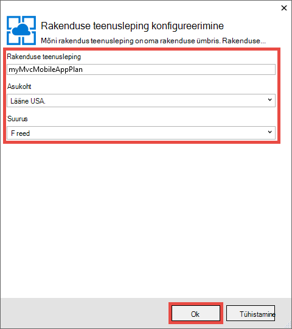
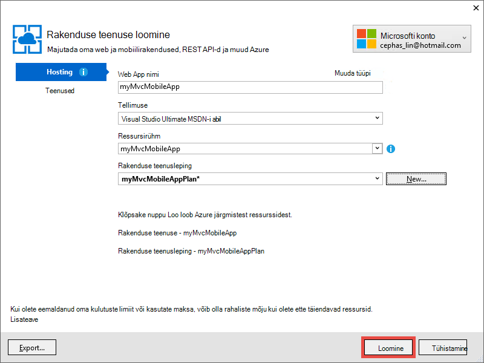

<properties 
    pageTitle="ASP.net-i MVC 5 mobiilsideseadmete web Appis Azure'i rakendust Service juurutamine" 
    description="Õppeteema, mis õpetab juurutamise web appi Azure'i rakendust Service ASP.net-i MVC 5 veebirakenduse mobiilsideseadmete funktsioonide abil." 
    services="app-service" 
    documentationCenter=".net" 
    authors="cephalin" 
    manager="wpickett" 
    editor="jimbe"/>

<tags 
    ms.service="app-service" 
    ms.workload="na" 
    ms.tgt_pltfrm="na" 
    ms.devlang="dotnet" 
    ms.topic="article" 
    ms.date="01/12/2016" 
    ms.author="cephalin;riande"/>

# ASP.net-i MVC 5 mobiilsideseadmete web Appis Azure'i rakendust Service juurutamine

Selle õpetuse õpetab põhiteavet ASP.net-i MVC 5 web appi, mis on mobile luua ja juurutada Azure'i rakendust Service. Selles õpetuses peate [Visual Studio Express 2013 Web] [ Visual Studio Express 2013] või Visual Studio, kui teil juba on professionaalse väljaannet. Saate kasutada [Visual Studio 2015] , kuid ekraanipilt on erinevad ja kasutage ASP.net-i 4.x mallid.

[AZURE.INCLUDE [create-account-and-websites-note](../../includes/create-account-and-websites-note.md)]

## Mida saate suurendada

Selles õpetuses mõeldud lisate mobiilsideseadmete funktsioonide lihtne konverentsi-kirjet rakendus, mis on toodud [starter projekti][StarterProject]. Järgmine pilt kuvatakse ASP.net-i seansid täidetud, nagu on näha emulaator brauserit Internet Explorer 11 F12 Arendaja tööriistad.

![][FixedSessionsByTag]

Saate kasutada Internet Explorer 11 F12 Arendaja tööriistad ja [viiuldaja tööriista] [ Fiddler] silumine rakenduse abil. 

## Saate teada, oskused

Siit saate teada.

-   Kuidas oma veebirakenduse otse web appi avaldamine teenuses Azure rakenduse Visual Studio 2013 abil.
-   ASP.net-i MVC 5 mallide kasutamise CSS-i alglaaduri raames parandada Kuva mobiilsideseadmetes
-   Suunata teatud Mobiilibrauserid, nt iPhone'i ja Android mobile kohased vaadete loomise kohta
-   Kuidas luua reageeri vaadete (vaateid, mis vastavad eri brauserite seadmetes)

## Arengu keskkonna häälestamine

Häälestada oma arenduskeskkond, installides Azure'i SDK .net-i 2.5.1 või uuem versioon. 

1. Installige Azure'i SDK .net-i jaoks, klõpsake linki. Kui te pole veel installinud Visual Studio 2013, installitakse see link. Selle õpetuse nõuab Visual Studio 2013. [Azure'i SDK Visual Studio 2013][AzureSDKVs2013]
1. Web platvormi Installeri aknas, klõpsake nuppu **Installi** ja installimist jätkata.

Samuti peate mobiilibrauseri emulaator. Töö ühte järgmistest:

-   [Internet Explorer 11 F12 arendaja] Tööriistad brauseri emulaator[ EmulatorIE11] (kasutatakse kogu mobiilibrauseri kuvatõmmised). Kasutaja agent string valmiskombinatsioonid on Windows Phone 8, Windows Phone 7 ja Apple iPadis.
-   Brauseri emulaator rakenduses [Google Chrome DevTools][EmulatorChrome]. See sisaldab arvukalt Androidi seadmete, kui ka Apple iPhone, Apple iPadis ja Amazon Kindle Fire valmiskombinatsioonid. See ka emuleerib ühendust sündmused.
-   [Opera Mobile Emulator][EmulatorOpera]

Visual Studio projektid c\# lähtekoodi on saadaval selle teema juurde:

-   [Starteri projekti allalaadimine][StarterProject]
-   [Lõpetatud projekti allalaadimine][CompletedProject]

##Juurutage starter projekt Azure web app

1.  Konverentsi-kirjet rakendus [starter projekti]allalaadimine[StarterProject].

2.  Seejärel Windows Exploreris, paremklõpsake alla ZIP-fail ja valige *Atribuudid*.

3.  Dialoogiboksis **Atribuudid** klõpsake nuppu **Aktiveeri** . (Tühjendamine takistab turbehoiatus, mis ilmneb siis, kui proovite kasutada *ZIP* -faili veebisaidilt allalaaditud.)

4.  Paremklõpsake ZIP-fail ja valige **Ekstrakti kõik** faili lahti. 

5.  Visual Studio, avage *C#\Mvc5Mobile.sln* fail.

6.  Lahenduste Explorer, paremklõpsake projekti ja klõpsake nuppu **Avalda**.

    ![][DeployClickPublish]

7.  Klõpsake veebi avaldamine **Microsoft Azure'i rakendust Service**.

    ![][DeployClickWebSites]

8.  Kui te pole seda juba sisse logitud rakendusse Azure, klõpsake käsku **Lisa konto**.

    ![][DeploySignIn]

9.  Järgige viipasid Azure'i kontosse sisse logida.

11. Rakenduse teenuse dialoogiboks peaks nüüd näitab teile, nagu on sisse logitud. Klõpsake nuppu **Uus**.

    ![][DeployNewWebsite]  

12. Määrake välja **Web Appi nimi** kordumatu rakenduse nime eesliide. Teie nõuetele täielikult vastav web appi nimi * &lt;eesliite >*. azurewebsites.net. Lisaks, valige või määrake uue ressursi rühma nimi **Ressursi**jaotises. Klõpsake nuppu **Uus** , et luua uue rakenduse teenusleping.

    ![][DeploySiteSettings]

13. Konfigureerige uus rakendus teenusleping ja klõpsake nuppu **OK**. 

    

13. Uuesti luua rakenduse teenuse dialoogiboksis nuppu **Loo**.

     

13. Pärast soovitud Azure'i ressursid on loodud, dialoogiboksi täidetakse uue rakenduse sätete avaldamine veebis. Klõpsake nuppu **Avalda**.

    ![][DeployPublishSite]

    Kui Visual Studio lõpetab starter projekti avaldamine Azure web appi, avaneb töölaua brauseri reaalajas veebirakenduse kuvamiseks.

14. Käivitage oma mobiilibrauseri emulaator, kopeerige URL konverentsi rakenduse (*<prefix>*. azurewebsites.net) emulaator, ja seejärel klõpsake paremas ülanurgas nuppu ja valige **sirvimine sildi järgi**. Kui kasutate Internet Explorer 11 vaikebrauseriks, peate lihtsalt tippida `F12`, siis `Ctrl+8`, ja seejärel muuta profiili brauseris **Windows Phone**. Alloleval pildil on näha *AllTags* vaate vertikaalpaigutus režiimis (alates valimine **sirvimine sildi järgi**).

    ![][AllTags]

>[AZURE.TIP] Ajal saate silumine oma MVC 5 rakenduse Visual Studio sees, saate oma veebirakenduse avaldada Azure reaalajas veebirakenduse otse oma mobiilibrauseri või brauseri emulaator kinnitamiseks uuesti.

Ekraan on väga loetav mobiilsideseadmes. Näete ka juba mõne visuaalseid efekte, mida alglaaduri CSS-i raames.
**ASP.net-i** linki.

![][SessionsByTagASP.NET]

ASP.net-i sildi vaade on Suum paigaldatud kuvale, kus alglaaduri teeb teie jaoks automaatselt. Siiski saate parandada see vaade paremini vastaks mobiilse veebibrauseri. Näiteks veeru **kuupäev** on raske lugeda. Allpool olevat õpetuse muudate *AllTags* vaate mobile sõbralik teha.

##Bootstrap CSS-i raames

Uus MVC 5 mall on Bootstrap tugi. Juba on näha, kuidas see kohe parandab oma rakenduse eri vaadetes. Navigeerimisriba kohal on näiteks automaatselt ahendatavad, kui brauseri laius on väiksem. Töölaua brauseris, proovige brauseriakna suuruse muutmine ja vaadake, kuidas navigeerimisriba muutub ilme ja käitumise. See on reageeri web kujundus, mis on ehitatud alglaaduri.

Kuidas veebirakenduse näeks ilma alglaaduri vaatamiseks avage *rakenduse\_käivitamine\\BundleConfig.cs* ja kommentaari read, mis sisaldavad *bootstrap.js* ja *bootstrap.css*välja. Järgmine kood kuvatakse kaks viimast soovitud `RegisterBundles` meetod pärast muudatuse:

     bundles.Add(new ScriptBundle("~/bundles/bootstrap").Include(
              //"~/Scripts/bootstrap.js",
              "~/Scripts/respond.js"));

    bundles.Add(new StyleBundle("~/Content/css").Include(
              //"~/Content/bootstrap.css",
              "~/Content/site.css"));

Vajutage `Ctrl+F5` rakenduse käivitamiseks.

Kinni ahendatavad navigeerimisriba on nüüd lihtsalt tavaliste Järjestamata loend. Klõpsake **Sirvi sildi alusel** uuesti ja seejärel klõpsake **ASP.net-i**.
Mobiilsideseadmete emulaator vaates, näete nüüd, kui see pole enam Suum paigaldatud kuvale ja peab kerige horisontaalselt selleks, et näha paremal küljel tabelit.

![][SessionsByTagASP.NETNoBootstrap]

Muudatuste tagasivõtmiseks ja värskendage mobiilibrauseri mobile sõbralik Kuva taastatud kinnitamiseks.

Alglaaduri ei ole eriti ASP.net-i MVC 5 ja saate ära need funktsioonid, mis tahes veebirakenduses. Kuid see on nüüd sisse ehitatud ASP.net-i MVC 5 projekti malli, et MVC 5 veebirakenduse saate ära alglaaduri vaikimisi.

Alglaaduri kohta lisateabe saamiseks külastage [alglaaduri] [ BootstrapSite] saidi.

Järgmises jaotises näete, kuidas anda Mobiil-brauseri teatud vaadete.

##Vaadete, paigutusi ja osaline vaadete alistamine

Mis tahes vaates (sh paigutusi ja osaline vaated) saate alistada Mobiilibrauserid üldiselt on üksikud mobiilibrauseri või mis tahes kindla brauseri jaoks. Anda mobile kohased vaate, saate vaate faili kopeerimine ja *lisada. Mobile* faili nimi. Näiteks mobiilivaade *registri* loomiseks saate kopeerida *vaadete\\Home\\Index.cshtml* et *vaadete\\Home\\Index.Mobile.cshtml*.

Selles jaotises saate luua faili mobile kohased paigutus.

Alustamiseks kopeerimine *vaadete\\jagatud\\\_Layout.cshtml* abil *vaadete\\jagatud\\\_Layout.Mobile.cshtml*. Avatud * \_Layout.Mobile.cshtml* ja pealkirja muutmine **MVC5** rakendusest **MVC5 rakenduse (mobiil)**.

Iga `Html.ActionLink` helistamine navigeerimisriba, eemaldage "Sirvimine järgi", iga lingi *ActionLink*. Järgmine kood kuvatakse täidetud `<ul class="nav navbar-nav">` sildi Mobiiliversiooni paigutust faili.

    <ul class="nav navbar-nav">
        <li>@Html.ActionLink("Home", "Index", "Home")</li>
        <li>@Html.ActionLink("Date", "AllDates", "Home")</li>
        <li>@Html.ActionLink("Speaker", "AllSpeakers", "Home")</li>
        <li>@Html.ActionLink("Tag", "AllTags", "Home")</li>
    </ul>

Kopeerige soovitud *vaadete\\Avaleht\\AllTags.cshtml* faili *vaadete\\Avaleht\\AllTags.Mobile.cshtml*. Uue faili avada ja muuta selle `<h2>` elemendi "Sildid" kuni "silte (M)":

    <h2>Tags (M)</h2>

Liikuge lehele siltide töölaua brauseris ja mobiilibrauseri emulaator abil. Mobiilibrauseri emulaator kuvatakse kaks teie tehtud muudatused (pealkiri * \_Layout.Mobile.cshtml* ja *AllTags.Mobile.cshtml*pealkiri).

![][AllTagsMobile_LayoutMobile]

Seevastu töölaual on muutunud (pealkirju: * \_Layout.cshtml* ja *AllTags.cshtml*).

![][AllTagsMobile_LayoutMobileDesktop]

##Brauserist-vaadete loomine

Lisaks mobile kohased ja töölaua kohased vaateid, saate luua ka üksikute brauseri vaated. Näiteks saate luua vaateid, mis on iPhone või Androidi brauseris. Selles jaotises saate luua paigutuse iPhone brauser ja iPhone'i versiooni *AllTags* vaade.

Avage fail *Global.asax* ja lisage järgmine kood lõppu selle `Application_Start` meetod.

    DisplayModeProvider.Instance.Modes.Insert(0, new DefaultDisplayMode("iPhone")
    {
        ContextCondition = (context => context.GetOverriddenUserAgent().IndexOf
            ("iPhone", StringComparison.OrdinalIgnoreCase) >= 0)
    });

See määratleb uute kuvamise režiim nimega "iPhone", mis sobitatakse iga sissetuleva taotluse vastu. Sissetuleva taotluse vastab tingimus määratletud (st kui kasutaja agent sisaldab stringi "iPhone"), otsib ASP.net-i MVC vaated, mille nimi sisaldab järelliite "iPhone".

>[AZURE.NOTE] Lisamisel mobiilsideseadmete brauserist-kuvamise viise, nagu iPhone'i ja Android kindlasti seatud esimese argumendi `0` (lisada loendi ülaosas) veendumaks, et brauserist-režiimis alistab mobiilsideseadmete mall (*. Mobile.cshtml). Kui mobiilsideseadmete Mall pole loendi ülaosas selle asemel, see valitakse üle ettenähtud Kuva režiimi (esimene match võidab ja mobiilsideseadmete mall vastab kõik Mobiilibrauserid). 

Kood, paremklõpsake `DefaultDisplayMode`, valige **lahenda**ja seejärel valige `using System.Web.WebPages;`. Sellega lisatakse viide on `System.Web.WebPages` nimeruumi, mis on koht, kus on `DisplayModeProvider` ja `DefaultDisplayMode` tüübid on määratletud.

![][ResolveDefaultDisplayMode]

Teise võimalusena võite lihtsalt käsitsi lisada järgmine rida on `using` osa faili.

    using System.Web.WebPages;

Salvestage muudatused. Kopeeri soovitud *vaadete\\jagatud\\\_Layout.Mobile.cshtml* faili *vaadete\\jagatud\\\_Layout.iPhone.cshtml*. Avage uus fail ja seejärel muutke pealkiri `MVC5 Application (Mobile)` et `MVC5 Application (iPhone)`.

Kopeeri selle *vaadete\\Home\\AllTags.Mobile.cshtml* faili *vaadete\\Home\\AllTags.iPhone.cshtml*. Uue faili, muuta selle `<h2>` "Sildid (iPhone)" elemendi kaudu "silte (M)".

Käivitage rakendus. Mobiilibrauseri emulaator käivitada, veenduge, et selle kasutajaagendi on määratud "iPhone" ja liikuge sirvides *AllTags* vaade. Kui kasutate Internet Explorer 11 F12 Arendaja tööriistad emulaator, konfigureerida imiteerimist järgmine:

-   Brauseri profiili = **Windows Phone**
-   Kasutajaagendi stringi = **kohandatud**
-   Kohandatud stringi = **õuna-iPhone5C1/1001.525**

Järgmine pilt kuvatakse *AllTags* vaate renderdamise emulaator rakenduses Internet Explorer 11 F12 Arendaja tööriistad koos kohandatud kasutajaagendi stringi (see on iPhone 5 C kasutaja kasutajaagendi stringi).

![][AllTagsIPhone_LayoutIPhone]

Mobiilibrauseri, valige **kõlarite** link. Kuna seal pole mobiilivaade (*AllSpeakers.Mobile.cshtml*), kõlarite vaikevaade (*AllSpeakers.cshtml*) muutub mobiilsideseadmete küljendivaates (*\_Layout.Mobile.cshtml*). Nagu allpool näha, pealkirja **MVC5 rakenduse (mobiil)** on määratletud * \_Layout.Mobile.cshtml*.

![][AllSpeakers_LayoutMobile]

Seadmisega saate keelata globaalselt (mitte-mobiili) vaikevaade kaudu renderdamise sees Mobiiliversiooni paigutust `RequireConsistentDisplayMode` abil `true` sisse selle *vaadete\\\_ViewStart.cshtml* faili umbes järgmine:

    @{
        Layout = "~/Views/Shared/_Layout.cshtml";
        DisplayModeProvider.Instance.RequireConsistentDisplayMode = true;
    }

Kui `RequireConsistentDisplayMode` on määratud `true`, Mobiiliversiooni paigutust (*\_Layout.Mobile.cshtml*) kasutatakse ainult Mobiilvaadete (st kui vaade fail on vormi * **ViewName**. Mobile.cshtml*). Võite määrata `RequireConsistentDisplayMode` et `true` kui ka teie mitte-mobiili vaatega ei tööta teie Mobiiliversiooni paigutust. Pildil kujutatud *kõlarite* lehe renderduse Millal `RequireConsistentDisplayMode` on seatud `true` (ilma string "(mobiil)" navigeerimise riba ülaosas).

![][AllSpeakers_LayoutMobileOverridden]

Saate keelata ühtsete Kuva režiimi kindla vaate, seades `RequireConsistentDisplayMode` et `false` failis vaade. Järgmised märgistuse soovitud *vaadete\\Home\\AllSpeakers.cshtml* faili komplekti `RequireConsistentDisplayMode` abil `false`:

    @model IEnumerable<string>

    @{
        ViewBag.Title = "All speakers";
        DisplayModeProvider.Instance.RequireConsistentDisplayMode = false;
    }

Selles jaotises oleme näinud Mobiiliversiooni paigutust ja vaadete loomise kohta ja paigutusi ja nagu iPhone kindlate seadmete jaoks vaadete loomise kohta.
Peamine eelis alglaaduri CSS-i raames aga reageeri paigutust, mis tähendab, et ühe stylesheet saab rakendada kogu töölaud, telefoni ja tahvelarvuti brauserid luua ühtse ilme ja olemus. Järgmises jaotises näete, kuidas võimendada alglaaduri mobile sõbralik vaadete loomiseks.

##Parandada kõlarite loend

Kui teile kuvatud, *kõlarid* on loetav, kuid linkide on väikesed ja on raske koputage mobiilsideseadmes. Selles jaotises teete *AllSpeakers* vaate mobile sõbralik, mis kuvatakse suur, lihtne puudutage lingid ning sisaldab kõlarite kiireks leidmiseks otsinguvälja.

Bootstrap [lingitud loendi rühma][] stiil abil saate parandada *kõlarite* vaade. Klõpsake *vaadete\\Avaleht\\AllSpeakers.cshtml*, asendage kood allpool Razori faili sisu.

     @model IEnumerable<string>

    @{
        ViewBag.Title = "All Speakers";
    }

    <h2>Speakers</h2>

    

        @foreach (var speaker in Model)
        {
            @Html.ActionLink(speaker, "SessionsBySpeaker", new { speaker }, new { @class = "list-group-item" })
        }
    

Funktsiooni `class="list-group"` atribuuti on `
` sildi kehtib Bootstrap loendi stiil, ja `class="input-group-item"` atribuut Bootstrap loendis üksuse stiil kehtib iga lingi.

Mobiilse veebibrauseri värskendada. Värskendatud vaate näeb välja umbes järgmine:

![][AllSpeakersFixed]

Bootstrap [jaotises lingitud loendi][] stiil muudab kogu ruut iga lingi klõpsatava, mis on palju hõlpsamini. Töölaua vaate aktiveerimine ja jälgida ühtse ilme ja olemus.

![][AllSpeakersFixedDesktop]

Kuigi mobiilibrauseri vaade on paranenud, on raske liikuda kõlarite pikk loendit. Alglaaduri ei paku otsingu filter funktsioonid välja-,-the-boksi, kuid saate selle lisada mitu rida koodi. Teil esmalt otsinguvälja lisamine vaade ning seejärel JavaScripti koodi funktsiooni filter seome. Rakenduses *vaadete\\Avaleht\\AllSpeakers.cshtml*, lisada mõne \<vormi\> sildistamine kohe pärast selle \<h2\> tag, nagu allpool näidatud:

    @model IEnumerable<string>

    @{
        ViewBag.Title = "All Speakers";
    }

    <h2>Speakers</h2>

    <form class="input-group">
        
        <input type="text" class="form-control" placeholder="Search speaker">
    </form>
     
    

        @foreach (var speaker in Model)
        {
            @Html.ActionLink(speaker, 
                             "SessionsBySpeaker", 
                             new { speaker }, 
                             new { @class = "list-group-item" })
        }
    

Pange tähele, et selle `<form>` ja `<input>` sildid nii on rakendatud Bootstrap laade. Funktsiooni `` elemendi Bootstrap [glyphicon][] lisatakse väljale Otsing.

Klõpsake kaustas *skriptide* lisada JavaScripti fail nimega *filter.js*. Avage fail ja kleepige see järgmine kood:

    $(function () {

        // reset the search form when the page loads
        $("form").each(function () {
            this.reset();
        });

        // wire up the events to the <input> element for search/filter
        $("input").bind("keyup change", function () {
            var searchtxt = this.value.toLowerCase();
            var items = $(".list-group-item");

            // show all speakers that begin with the typed text and hide others
            for (var i = 0; i < items.length; i++) {
                var val = items[i].text.toLowerCase();
                val = val.substring(0, searchtxt.length);
                if (val == searchtxt) {
                    $(items[i]).show();
                }
                else {
                    $(items[i]).hide();
                }
            }
        });
    });

Samuti peate oma registreeritud kimbud filter.js kaasamine. Avatud *rakenduse\_käivitamine\\BundleConfig.cs* ja muuta esimese kimbud. Esimene muutmine `bundles.Add` (avalduse **jquery** kogumisse) kaasata *skriptide\\filter.js*, järgmiselt:

     bundles.Add(new ScriptBundle("~/bundles/jquery").Include(
                "~/Scripts/jquery-{version}.js",
                "~/Scripts/filter.js"));

Vaikimisi juba muudab **jquery** kogumisse * \_paigutuse* vaade. Hiljem saab kasutada muude loendivaadete filtri funktsioonide rakendamiseks sama JavaScripti koodi.

Mobiilse veebibrauseri värskendada ja avage *AllSpeakers* vaade. Tippige otsinguväljale "sc". Nüüd tuleb filtreerida kõlarite loendis vastavalt teie otsingustring.

![][AllSpeakersFixedSearchBySC]

##Siltide loendi täiustada

*Kõlarite* vaadet, nt *Sildid* vaade on loetav, kuid lingid on väikesed ja raskesti koputage mobiilsideseadmes. Saate määrata *siltide* kuvamine ühtemoodi, saate parandada *kõlarite* vaadet, kui kasutate eespool kirjeldatud koodi muudatusi, kuid järgmine `Html.ActionLink` meetod süntaks *vaadete\\Home\\AllTags.cshtml*:

    @Html.ActionLink(tag, 
                     "SessionsByTag", 
                     new { tag }, 
                     new { @class = "list-group-item" })

Värskendatud töölauabrauseri näeb välja järgmine:

![][AllTagsFixedDesktop]

Ja värskendatud mobiilibrauseri näeb välja järgmine: 

![][AllTagsFixed]

>[AZURE.NOTE] Kui märkate, et algse vormingu loend on ikka olemas mobiilse veebibrauseri ja ei tea oma kena Bootstrap stiil on kadunud, see on teie varasema toimingu Mobiilvaadete teatud loomiseks. Nüüd, kui kasutate alglaaduri CSS-i raames luua reageeri web design, avage juht ja need mobile kohased vaated ja mobile kohased paigutus vaadete eemaldamine. Kui te olete teinud, kuvatakse värskendatud mobiilibrauseri Bootstrap stiil.

##Parandada kuupäevade loend

Saate parandada *kuupäevade* kuvamine nagu saate täiustatud *kõlarite* ja *siltide* vaadete, kui kasutate koodi muudatusi eespool kirjeldatud, kuid järgmine `Html.ActionLink` meetod süntaks *vaadete\\Home\\AllDates.cshtml*:

    @Html.ActionLink(date.ToString("ddd, MMM dd, h:mm tt"), 
                     "SessionsByDate", 
                     new { date }, 
                     new { @class = "list-group-item" })

Saate värskendada mobiilibrauserivaate umbes järgmine:

![][AllDatesFixed]

*Kuupäevade* kuvamine parandamiseks täpsemaks korraldamine kuupäeva / kellaaja väärtuste kuupäeva järgi. Seda saab teha Bootstrap [paanid][] stiil. Sisu asendada selle *vaadete\\Home\\AllDates.cshtml* faili järgmine kood:

    @model IEnumerable<DateTime>

    @{
        ViewBag.Title = "All Dates";
    }

    <h2>Dates</h2>

    @foreach (var dategroup in Model.GroupBy(x=>x.Date))
    {
        

            

                @dategroup.Key.ToString("ddd, MMM dd")
            

            

                @foreach (var date in dategroup)
                {
                    @Html.ActionLink(date.ToString("h:mm tt"), 
                                     "SessionsByDate", 
                                     new { date }, 
                                     new { @class = "list-group-item" })
                }
            

        

    }

Järgmine kood loob eraldi `
` sildi iga erinevate kuupäevale loendis ja kasutab [lingitud loendi rühma][] vastavate linkide nagu enne. Siin on mobiilse veebibrauseri näeb kui käivitatakse järgmine kood:

![][AllDatesFixed2]

Töölaua brauserile üle minema. Klõpsake uuesti Märkus ühtse välimuse.

![][AllDatesFixed2Desktop]

##Parandada SessionsTable vaade

Selles jaotises saate muuta *SessionsTable* vaate mobiil-sõbralik. See muudatus on keerulisem varem tehtud muudatused.

Mobiilibrauseri, koputage nuppu **silt** ja seejärel sisestage `asp` otsinguväljale.

![][AllTagsFixedSearchByASP]

Koputage **ASP.net-i** link.

![][SessionsTableTagASP.NET]

Nagu näete, Kuva on vormindatud tabelina, mis on praegu mõeldud töölauabrauseri vaadata. See on natuke raske lugeda mobiilibrauseri. Selle probleemi lahendamiseks avage *vaadete\\Home\\SessionsTable.cshtml* ja asendage faili sisu järgmine kood:

    @model IEnumerable<Mvc5Mobile.Models.Session>

    <h2>@ViewBag.Title</h2>

    

        

            @foreach (var session in Model)
            {
                

                    

                        @Html.ActionLink(session.Title, 
                                         "SessionByCode", 
                                         new { session.Code }, 
                                         new { @class="list-group-item active" })
                        

                            

                                @Html.Partial("_SpeakersLinks", session)
                            

                            

                                @session.DateText
                            

                            

                                @Html.Partial("_TagsLinks", session)
                            

                        

                    

                

            }
        

    

Kood ei 3 asju:

-   kasutab Bootstrap [kohandatud lingitud loendi rühma][] vormindamiseks seansi teabe vertikaalselt, nii, et kõik see teave on loetav mobiilse veebibrauseri (abil tunnid, nt loend jaotises üksuse tekst)
-   [koordinaatvõrgu süsteemi][] kehtib paigutust, nii, et seansi üksuste flow horisontaalselt töölauabrauseri ja vertikaalselt mobiilsideseadmete brauseris (abil klassi veerg-md-4)
-   kasutab [reageeri Utiliidid][] peitmiseks seansi sildid kui mobiilsideseadmete brauseris (abil peidetud xs klassi)

Võite ka puudutada lingi pealkiri avage vastav seanss. Alloleval pildil kajastab koodi muudatusi.

![][FixedSessionsByTag]

Bootstrap ruudustiku süsteemi automaatselt rakendatud korraldab seansid vertikaalselt mobiilsideseadmete brauseris. Pange tähele, et silte ei kuvata. Töölaua brauserile üle minema.

![][SessionsTableFixedTagASP.NETDesktop]

Töölauabrauseri, Pange tähele, et Sildid kuvatakse nüüd. Samuti saate vaadata, et teie rakendatud Bootstrap ruudustiku süsteemi korraldab seansi üksuste kaks veergu. Kui teil suurendada brauseri, näete, et paigutus muutub kolme veergu.

##Parandada SessionByCode vaade

Lisaks saate parandamine *SessionByCode* vaate teha mobile sõbralik.

Mobiilibrauseri, koputage nuppu **silt** ja seejärel sisestage `asp` otsinguväljale.

![][AllTagsFixedSearchByASP]

Koputage **ASP.net-i** link. ASP.net-i sildi seansid kuvatakse.

![][FixedSessionsByTag]

Valige **koostamise ühe lehe rakenduse ASP.net-i ja AngularJS** link.

![][SessionByCode3-644]

Töölaua vaikevaade on hea, kuid saate parandada ilmet hõlpsalt abil teatud alglaaduri GUI komponendid.

Avatud *vaadete\\Home\\SessionByCode.cshtml* ja asendage sisu järgmine märgistus:

    @model Mvc5Mobile.Models.Session

    @{
        ViewBag.Title = "Session details";
    }
    <h3>@Model.Title (@Model.Code)</h3>
    

        <strong>@Model.DateText</strong> in <strong>@Model.Room</strong>
    

    

        

            Speakers
        

        @foreach (var speaker in Model.Speakers)
        {
            @Html.ActionLink(speaker, 
                             "SessionsBySpeaker", 
                             new { speaker }, 
                             new { @class="panel-body" })
        }
    

    
@Model.Abstract

    

        

            Tags
        

        @foreach (var tag in Model.Tags)
        {
            @Html.ActionLink(tag, 
                             "SessionsByTag", 
                             new { tag }, 
                             new { @class = "panel-body" })
        }
    

Uue märgistuse kasutab Bootstrap paanid stiil soovitud mobiilivaade parandamiseks. 

Mobiilse veebibrauseri värskendada. Järgmisel pildil kajastab lihtsalt tehtud muudatused kood:

![][SessionByCodeFixed3-644]

## Kokkuvõte ja vaadake üle

Selles õpetuses on näidatud ASP.net-i MVC 5 arendada mobile sõbralik veebirakenduste kasutamise kohta. Järgmised:

-   Rakenduse teenuse web app rakenduse ASP.net-i MVC 5 juurutamine
-   Alglaaduri abil saate luua oma MVC 5 rakenduse reageeri veebivaade
-   Tühistavad paigutus, vaadete ja osalist vaadet, nii globaalselt ja üksikute vaate
-   Juhtelemendi paigutus ja osaline alistada, et täitmise abil soovitud `RequireConsistentDisplayMode` atribuut
-   Mis on suunatud teatud brauserites, nt iPhone brauser vaadete loomine
-   Bootstrap otsingukeskusi Razori koodi rakendamine

## Vt ka

-   [reageeri web kujundus 9 põhitõed](http://blog.froont.com/9-basic-principles-of-responsive-web-design/)
-   [Alglaaduri][BootstrapSite]
-   [Ametlik Bootstrap ajaveeb][]
-   [Twitteri Bootstrap õpetuse õpetuse Vabariik][]
-   [Bootstrap mänguväljak][]
-   [W3C soovitus mobiil rakenduse head tavad][]
-   [W3C testversiooni soovitus media päringud][]

## Mis on muutunud
* Muuda juhend veebisaitide rakenduse teenusega leiate: [Azure'i rakendust Service ja selle mõju olemasoleva Azure'i teenused](http://go.microsoft.com/fwlink/?LinkId=529714)

<!-- Internal Links -->
[Deploy the starter project to an Azure web app]: #bkmk_DeployStarterProject
[Bootstrap CSS Framework]: #bkmk_bootstrap
[Override the Views, Layouts, and Partial Views]: #bkmk_overrideviews
[Create Browser-Specific Views]:#bkmk_browserviews
[Improve the Speakers List]: #bkmk_Improvespeakerslist
[Improve the Tags List]: #bkmk_improvetags
[Improve the Dates List]: #bkmk_improvedates
[Improve the SessionsTable View]: #bkmk_improvesessionstable
[Improve the SessionByCode View]: #bkmk_improvesessionbycode

<!-- External Links -->
[Visual Studio Express 2013]: http://www.visualstudio.com/downloads/download-visual-studio-vs#d-express-web
[Visual Studio 2015]: https://www.visualstudio.com/downloads/download-visual-studio-vs
[AzureSDKVs2013]: http://go.microsoft.com/fwlink/p/?linkid=323510&clcid=0x409
[Fiddler]: http://www.fiddler2.com/fiddler2/
[EmulatorIE11]: http://msdn.microsoft.com/library/ie/dn255001.aspx
[EmulatorChrome]: https://developers.google.com/chrome-developer-tools/docs/mobile-emulation
[EmulatorOpera]: http://www.opera.com/developer/tools/mobile/
[StarterProject]: http://go.microsoft.com/fwlink/?LinkID=398780&clcid=0x409
[CompletedProject]: http://go.microsoft.com/fwlink/?LinkID=398781&clcid=0x409
[BootstrapSite]: http://getbootstrap.com/
[WebPIAzureSdk23NetVS13]: ./media/web-sites-dotnet-deploy-aspnet-mvc-mobile-app/WebPIAzureSdk23NetVS13.png
[lingitud loendi rühm]: http://getbootstrap.com/components/#list-group-linked
[glyphicon]: http://getbootstrap.com/components/#glyphicons
[paneelid]: http://getbootstrap.com/components/#panels
[kohandatud lingitud loendi rühm]: http://getbootstrap.com/components/#list-group-custom-content
[Koordinaatvõrgu süsteemi]: http://getbootstrap.com/css/#grid
[reageeri Utiliidid]: http://getbootstrap.com/css/#responsive-utilities
[Ametlik Bootstrap ajaveeb]: http://blog.getbootstrap.com/
[Twitteri Bootstrap õpetuse õpetuse Vabariik]: http://www.tutorialrepublic.com/twitter-bootstrap-tutorial/
[Bootstrap mänguväljak]: http://www.bootply.com/
[W3C soovitus mobiil rakenduse head tavad]: http://www.w3.org/TR/mwabp/
[W3C testversiooni soovitus media päringud]: http://www.w3.org/TR/css3-mediaqueries/

<!-- Images -->
[DeployClickPublish]: ./media/web-sites-dotnet-deploy-aspnet-mvc-mobile-app/deploy-to-azure-website-1.png
[DeployClickWebSites]: ./media/web-sites-dotnet-deploy-aspnet-mvc-mobile-app/deploy-to-azure-website-2.png
[DeploySignIn]: ./media/web-sites-dotnet-deploy-aspnet-mvc-mobile-app/deploy-to-azure-website-3.png
[DeployUsername]: ./media/web-sites-dotnet-deploy-aspnet-mvc-mobile-app/deploy-to-azure-website-4.png
[DeployPassword]: ./media/web-sites-dotnet-deploy-aspnet-mvc-mobile-app/deploy-to-azure-website-5.png
[DeployNewWebsite]: ./media/web-sites-dotnet-deploy-aspnet-mvc-mobile-app/deploy-to-azure-website-6.png
[DeploySiteSettings]: ./media/web-sites-dotnet-deploy-aspnet-mvc-mobile-app/deploy-to-azure-website-7.png
[DeployPublishSite]: ./media/web-sites-dotnet-deploy-aspnet-mvc-mobile-app/deploy-to-azure-website-8.png
[MobileHomePage]: ./media/web-sites-dotnet-deploy-aspnet-mvc-mobile-app/mobile-home-page.png
[FixedSessionsByTag]: ./media/web-sites-dotnet-deploy-aspnet-mvc-mobile-app/SessionsByTag-ASP.NET-Fixed.png
[AllTags]: ./media/web-sites-dotnet-deploy-aspnet-mvc-mobile-app/AllTags.png
[SessionsByTagASP.NET]: ./media/web-sites-dotnet-deploy-aspnet-mvc-mobile-app/SessionsByTag-ASP.NET.png
[SessionsByTagASP.NETNoBootstrap]: ./media/web-sites-dotnet-deploy-aspnet-mvc-mobile-app/SessionsByTag-ASP.NET-NoBootstrap.png
[AllTagsMobile_LayoutMobile]: ./media/web-sites-dotnet-deploy-aspnet-mvc-mobile-app/AllTagsMobile-_LayoutMobile.png
[AllTagsMobile_LayoutMobileDesktop]: ./media/web-sites-dotnet-deploy-aspnet-mvc-mobile-app/AllTagsMobile-_LayoutMobile-Desktop.png
[ResolveDefaultDisplayMode]: ./media/web-sites-dotnet-deploy-aspnet-mvc-mobile-app/Resolve-DefaultDisplayMode.png
[AllTagsIPhone_LayoutIPhone]: ./media/web-sites-dotnet-deploy-aspnet-mvc-mobile-app/AllTagsIPhone-_LayoutIPhone.png
[AllSpeakers_LayoutMobile]: ./media/web-sites-dotnet-deploy-aspnet-mvc-mobile-app/AllSpeakers-_LayoutMobile.png
[AllSpeakers_LayoutMobileOverridden]: ./media/web-sites-dotnet-deploy-aspnet-mvc-mobile-app/AllSpeakers-_LayoutMobile-Overridden.png
[AllSpeakersFixed]: ./media/web-sites-dotnet-deploy-aspnet-mvc-mobile-app/AllSpeakers-Fixed.png
[AllSpeakersFixedDesktop]: ./media/web-sites-dotnet-deploy-aspnet-mvc-mobile-app/AllSpeakers-Fixed-Desktop.png
[AllSpeakersFixedSearchBySC]: ./media/web-sites-dotnet-deploy-aspnet-mvc-mobile-app/AllSpeakers-Fixed-SearchBySC.png
[AllTagsFixedDesktop]: ./media/web-sites-dotnet-deploy-aspnet-mvc-mobile-app/AllTags-Fixed-Desktop.png 
[AllTagsFixed]: ./media/web-sites-dotnet-deploy-aspnet-mvc-mobile-app/AllTags-Fixed.png
[AllDatesFixed]: ./media/web-sites-dotnet-deploy-aspnet-mvc-mobile-app/AllDates-Fixed.png
[AllDatesFixed2]: ./media/web-sites-dotnet-deploy-aspnet-mvc-mobile-app/AllDates-Fixed2.png
[AllDatesFixed2Desktop]: ./media/web-sites-dotnet-deploy-aspnet-mvc-mobile-app/AllDates-Fixed2-Desktop.png
[AllTagsFixedSearchByASP]: ./media/web-sites-dotnet-deploy-aspnet-mvc-mobile-app/AllTags-Fixed-SearchByASP.png
[SessionsTableTagASP.NET]: ./media/web-sites-dotnet-deploy-aspnet-mvc-mobile-app/SessionsTable-Tag-ASP.NET.png
[SessionsTableFixedTagASP.NETDesktop]: ./media/web-sites-dotnet-deploy-aspnet-mvc-mobile-app/SessionsTable-Fixed-Tag-ASP.NET-Desktop.png
[SessionByCode3-644]: ./media/web-sites-dotnet-deploy-aspnet-mvc-mobile-app/SessionByCode-3-644.png
[SessionByCodeFixed3-644]: ./media/web-sites-dotnet-deploy-aspnet-mvc-mobile-app/SessionByCode-Fixed-3-644.png
 
