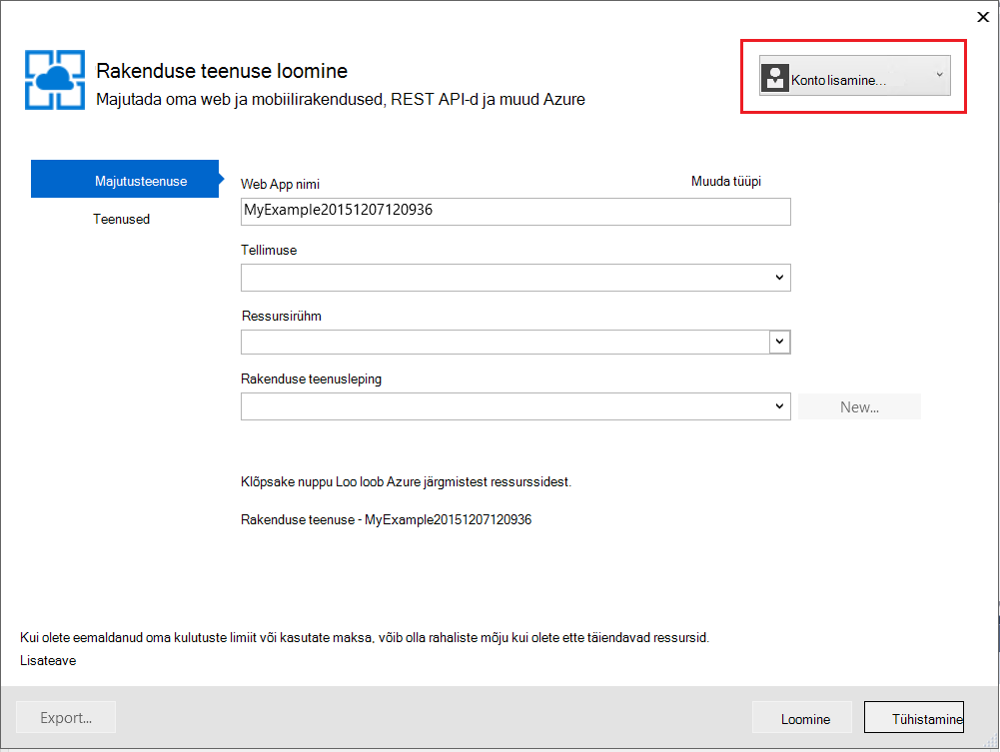
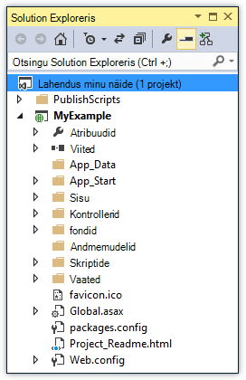

<properties
    pageTitle="ASP.net-i rakenduse juurutamiseks Azure'i rakendust Service Visual Studio abil | Microsoft Azure'i"
    description="Saate teada, kuidas mõnda ASP.net-i web projekti juurutama uue veebirakenduse Azure'i rakenduse teenus, Visual Studio abil."
    services="app-service\web"
    documentationCenter=".net"
    authors="tdykstra"
    manager="wpickett"
    editor=""/>

<tags
    ms.service="app-service-web"
    ms.workload="web"
    ms.tgt_pltfrm="na"
    ms.devlang="dotnet"
    ms.topic="get-started-article"
    ms.date="07/22/2016"
    ms.author="rachelap"/>

# ASP.net-i web app juurutama Azure'i rakendust Service, Visual Studio abil

[AZURE.INCLUDE [tabs](../../includes/app-service-web-get-started-nav-tabs.md)]

## Ülevaade

Selle õpetuse kujutatakse ASP.net-i veebirakenduse, [veebirakenduse teenuses Azure rakenduse](app-service-web-overview.md) juurutamine Visual Studio 2015 abil.

Õpetuse eeldab, et teil on ASP.net-i arendaja, kellel on eelmise kogemused Azure'i abil. Kui olete lõpetanud, siis on teil lihtne veebirakenduse üles ja töötab pilveteenuses.

Saate teada:

* Kuidas luua uue rakenduse teenuse veebirakenduse ajal saate luua uue web projekti Visual Studio.
* Kuidas võtta kasutusele rakenduse teenuse web app web projekti, Visual Studio abil.

Diagramm näitab, kuidas õpetuse.

Õpetuse lõpus [tõrkeotsingu](#troubleshooting) jaotis annab ideid, mida teha, kui midagi ei tööta ja jaotist [järgmised toimingud](#next-steps) on toodud lingid muude õpetusi, mis lähevad põhjalikumalt Azure'i rakendust Service kasutamise kohta.

See on töötamise alustamine õpetuse, see näitab, kuidas juurutada web projekti on lihtne mis ei kasuta andmebaasi ja ei autentimist või luba. Täpsemate juurutamise teemade lingid, vaadake [teemat juurutamine Azure web app](web-sites-deploy.md).

Selles õpetuses võtab aega, et installida Azure SDK .net-i jaoks, välja arvatud lõpuleviimiseks umbes 10 – 15 minutit.

## Eeltingimused

* Õpetuse eeldab, et te olete töötanud ASP.net-i MVC ja Visual Studio. Kui teil on vaja tutvustus, lugege teemat [Alustamine ASP.net-i MVC 5](http://www.asp.net/mvc/overview/getting-started/introduction/getting-started).

* Teil on vaja Azure kontot. Saate [tasuta Azure'i konto avamise](/pricing/free-trial/?WT.mc_id=A261C142F) või [aktiveerimine Visual Studio abonendi eelised](/pricing/member-offers/msdn-benefits-details/?WT.mc_id=A261C142F). 

    Kui soovite alustada Azure'i rakendust Service enne Azure'i konto kasutajaks, minge [Proovige rakenduse teenus](http://go.microsoft.com/fwlink/?LinkId=523751). Seal saate luua lühiajaline starter rakenduse rakendust Service – pole vaja krediitkaarti ja kohustusi.

## Arengu keskkonna häälestamine

Õpetuse on kirjutatud Visual Studio 2015 [Azure'i SDK .net-i](../dotnet-sdk.md) 2.9 või uuem versioon. 

* [Laadige uusimad Azure'i SDK Visual Studio 2015](http://go.microsoft.com/fwlink/?linkid=518003). SDK installib Visual Studio 2015, kui te pole seda veel.

    >[AZURE.NOTE] Sõltuvalt sellest, mitu SDK sõltuvused on juba teie arvutis, SDK installimine võib võtta kaua aega, minutid pool tundi või rohkem.

Kui teil on Visual Studio 2013 ja soovite kasutada, saate [alla laadida uusima Azure'i SDK Visual Studio 2013](http://go.microsoft.com/fwlink/?LinkID=324322). Mõned ekraanid võivad olla teistsugused illustratsioonid.

## Uue projekti web konfigureerimine

Järgmisena on web projekti Visual Studio ja Azure'i rakendust Service veebirakenduse loomine. Selles jaotises õpetuse Konfigureerige uus web projekt. 

1. Avage Visual Studio 2015.

2. Klõpsake **Fail > uus > projekti**.

3. Klõpsake dialoogiboksis **Uus projekt** **Visual C# > Web > ASP.net-i veebirakenduse**.

3. Veenduge, et **.NET Frameworki 4.5.2** on valitud eesmärgi raames.

4.  [Azure'i rakenduse ülevaated](../application-insights/app-insights-overview.md) jälgib oma veebirakenduse olemasolu, jõudlus ja kasutamine. **Lisage rakenduse ülevaated projekti** ruut vaikimisi esimest korda web projekti loomine pärast installimist Visual Studio abil. Tühjendage ruut, kui see on valitud, kuid te ei soovi proovige rakenduse ülevaated.

4. **MyExample**rakenduse nimi ja seejärel klõpsake nuppu **OK**.

    

5. Dialoogiboksis **Uue ASP.net-i projekti** valige **MVC** Mall ja seejärel klõpsake nuppu **Muuda autentimist**.

    Selles õpetuses mõeldud juurutamist mõnda ASP.net-i MVC web projekti. Kui soovite teada, kuidas Juurutage ASP.net-i veebi-API-projekt, vaadake [järgmist](#next-steps) jaotist. 

    

6. Dialoogiboksis **Muuda autentimist** **Ei autentimise**nuppu ja seejärel klõpsake nuppu **OK**.

    

    Selle õpetuse alustamine – juurutamist lihtne rakendus, mis ei kasutaja Logi sisse.

5. Dialoogiboksi **Uus ASP.net-i projekt** jaotises **Microsoft Azure'i** veenduge, et **majutada pilveteenuses** valitud ja et **Rakenduse teenus** on valitud rippmenüü loendi.

    

    Nende sätete otse Visual Studio web projekti Azure web app loomiseks.

6. Klõpsake nuppu **OK**

## Azure'i ressursid uue veebirakenduse konfigureerimine

Nüüd saate räägi Visual Studio Azure ressursse, mida soovite seda luua.

5. Dialoogiboksis **Loomine rakenduse teenuse** klõpsake käsku **Lisa konto**ja seejärel logige sisse Azure'i ID ja parool, mille abil saate hallata Azure tellimuse.

    

    Kui te juba sisse logitud varem samas arvutis, võidakse kuvada pole nupp **Lisa konto** . Sel juhul võite selle sammu vahele jätta või peate sisestama oma mandaadi.
 
3. Sisestage **Web Appi nimi** , mis on kordumatu *azurewebsites.net* domeeni. Näiteks saate nimi see MyExample paremale, et see oleks kordumatu, nt MyExample810 arvudega. Kui vaikenimi on teie jaoks loodud, oleks kordumatu ja mida saate kasutada.

    Kui keegi teine on juba sisestatud nimi, kuvatakse punane hüüumärk paremale asemel roheline märge ja teil on juba kasutusel.

    Rakenduse URL on selle nimi pluss *. azurewebsites.net*. Näiteks kui nimi on `MyExample810`, URL on `myexample810.azurewebsites.net`.

    Samuti saate kohandatud domeeni Azure web app abil. Lisateavet leiate teemast [konfigureerimine teenuses Azure rakenduse kohandatud domeeninime](web-sites-custom-domain-name.md).

6. **Ressursirühm** välja kõrval nuppu **Uus** ja sisestage "MyExample" või mõne muu nimi, soovi korral. 

    

    Ressursirühma on Azure ressursse, nt veebirakendusi, andmebaasid ja VMs kogum. Õpetuse, on üldiselt parem, kuna mis hõlbustab kustutada sammhaaval Azure ressursse, juhend on loodud uue ressursirühma loomiseks. Lisateavet leiate teemast [Azure ressursihaldur ülevaade](../azure-resource-manager/resource-group-overview.md).

4. **Rakenduse teenuse leping** rippmenüüst kõrval nuppu **Uus** .

    

    Kuvatakse dialoogiboks **Konfigureerida rakendus teenuse kavandamine** .

    

    Järgmistes juhistes, saate konfigureerida uue ressursirühma rakenduse teenusleping. Mõni rakendus teenusleping määrab Arvuta ressursse, mis töötab teie web Appis. Näiteks kui valite tasuta taseme, API rakenduse töötab ühiskasutusega VMs ajal mõned tasuliseks astme töötab see sihtotstarbeline VMs. Lisateavet leiate teemast [rakenduse teenuse lepingute ülevaade](../app-service/azure-web-sites-web-hosting-plans-in-depth-overview.md).

5. Dialoogiboksis **Konfigureerida rakendus teenuse leping** sisestage "MyExamplePlan" või mõne muu nimi, soovi korral.

5. Valige ripploendist **asukoht** asukoht, mis on teile.

    See säte määrab, mis töötavad rakenduse Azure andmekeskuse. Selles õppetükis saate valida mis tahes piirkond ja seda ei tee märgatav erinevus. Kuid tootmise rakenduse, võite soovida oma serveri olla võimalikult lähedal klientidele, mis on juurdepääs selle minimeerimiseks [latentsus](http://www.bing.com/search?q=web%20latency%20introduction&qs=n&form=QBRE&pq=web%20latency%20introduction&sc=1-24&sp=-1&sk=&cvid=eefff99dfc864d25a75a83740f1e0090).

5. Klõpsake **suurus** rippmenüü **tasuta**.

    Selles õpetuses annab tasuta hinnakirjad taseme hea piisavalt jõudlust.

6. Klõpsake dialoogiboksis **Konfigureerida rakendus teenuse leping** nuppu **OK**.

7. Klõpsake dialoogiboksis **Rakenduse teenuse loomine** nuppu **Loo**.

## Visual Studio loob projekti ja web app

Lühike kellaaeg tavaliselt vähem kui minutiga, loob Visual Studio web project ja web app.  

**Lahendus Exploreri** aknas kuvatakse uue projekti faile ja kaustu.

**Azure'i rakenduse tegevuse** kuvatakse veebirakenduse loodud.

**Pilveteenuse Exploreri** aknas saate vaadata ja hallata Azure ressursse, sh äsja loodud uue veebirakenduse.

    
## Web project juurutada Azure web app

Selles jaotises juurutamist web project web appi.

1. **Lahenduste Explorer**, paremklõpsake projekti ja valige käsk **Avalda**.

    

    Mõne sekundi, kuvatakse viisardi **Avaldamine veebis** . Avaneb viisard on *avaldada profiili* mis sätted on web project uus web Appi kasutamise kohta.

    Avalda profiil sisaldab kasutajanime ja parooli juurutamiseks.  Neid mandaate on loodud, saate ja teil pole vaja neid sisestada. Parool on krüptitud peidetud kindla kasutaja faili selle `Properties\PublishProfiles` kausta.
 
8. **Veebis avaldamine** viisardi vahekaardil **ühendus** , klõpsake nuppu **edasi**.

    

    Järgmine on vahekaarti **sätted** . Siin saate muuta Koosta konfiguratsiooni silumine Koosta [Kaug](../app-service-web/web-sites-dotnet-troubleshoot-visual-studio.md#remotedebug)silumine juurutamiseks. Menüü pakub mitu [Faili Avaldamissuvandid](https://msdn.microsoft.com/library/dd465337.aspx#Anchor_2).

10. Klõpsake vahekaardil **sätted** nuppu **edasi**.

    

    Vahekaart **Eelvaade** on järgmine. Siin on võimalus näha, mida failide kavatsete projekti API rakendusse kopeerida. Kui juurutamist projekti API rakendus, mida te juba juurutatud varasemas versioonis, kopeeritakse ainult muudetud failid. Kui soovite näha loendit mis kopeeritakse, saate klõpsata nuppu **Käivita eelvaade** .

11. Klõpsake menüü **Eelvaade** nuppu **Avalda**.

    

    Kui klõpsate nuppu **Avalda**, Visual Studio hakkab protsessi Azure serverisse failide kopeerimine. See võib kuluda mõni minut.

    **Väljundi** kohtumistele ja **Azure rakendus** windows kuvada, milliseid toiminguid juurutamise võeti ja edukaks juurutamise teatada.

    

    Juurutamise, vaikebrauseriks avab automaatselt juurutatud veebirakenduse URL ja loodud rakendus töötab nüüd pilveteenuses. URL brauseri aadressiribale näitab, et veebirakenduse laaditakse Interneti kaudu.

    

    > [AZURE.TIP]Saate lubada kiirülevaate juurutamiseks tööriistariba **Web ühe nuppu Avalda** . Klõpsake **Vaade > Tööriistaribad**, ja seejärel valige **Web ühe nuppu Avalda**. Tööriistariba abil saate profiili valimise kohta, klõpsake nuppu Avalda või klõpsake nuppu **Avalda veebis** viisardi avamiseks.
    > 

## Tõrkeotsing

Kui tekib probleem, nagu läbida selles õpetuses, veenduge, et, et kasutate .net-i Azure SDK uusim versioon. Lihtsaim viis seda teha on [Azure SDK Visual Studio 2015 alla laadida](http://go.microsoft.com/fwlink/?linkid=518003). Kui teil on installitud praegune versioon, Web platvormi Installer annab teile teada, et ei installi on vaja.

Kui olete ettevõtte võrgus ja proovite võtta kasutusele Azure'i rakendust Service läbi tulemüüri, veenduge, et pordid 443 ja 8172 on avatud Web juurutamine. Kui te ei saa avada need pordid, järgmised järgmisest jaotisest juhiseid juurutamise muid võimalusi.

Kui olete oma ASP.net-i veebirakenduse teenuses Azure rakendus töötab, võite Lisateavet Visual Studio funktsioonid, mis lihtsustavad tõrkeotsing. Logimise kohta leiate teavet teemast Kaug silumine ja muud, [tõrkeotsingu Azure'i veebirakenduste Visual Studio](web-sites-dotnet-troubleshoot-visual-studio.md).

## Järgmised sammud

Selles õpetuses olete näha, kuidas luua lihtsa veebirakenduse ja selle juurutama Azure web app. Siin on mõned seotud teemade ja Azure rakenduse teenuse kohta rohkem ressursse:

* Saate jälgida ja hallata oma veebirakenduse [Azure portaali](https://portal.azure.com/). 

    Lisateabe saamiseks vt [ülevaate Azure portaali](/services/management-portal/) ja [Azure'i rakendust Service konfigureerimine web apps](web-sites-configure.md).

* Olemasoleva projekti web juurutada uue veebirakenduse Visual Studio abil

    Paremklõpsake **Solution**Exploreris projekt ja seejärel klõpsake nuppu **Avalda**. Valige **Microsoft Azure'i rakenduse teenus** , mis Sihtvaluuta avalda ja seejärel klõpsake nuppu **Uus**. Funktsiooni dialoogid on seejärel sama, mida olete näinud selles õpetuses.

* Andmeallika juhtelemendi web projekti juurutamine

    [Andmeallika juhtelement süsteemi](http://www.asp.net/aspnet/overview/developing-apps-with-windows-azure/building-real-world-cloud-apps-with-windows-azure/source-control) [automatiseerimine juurutamise](http://www.asp.net/aspnet/overview/developing-apps-with-windows-azure/building-real-world-cloud-apps-with-windows-azure/continuous-integration-and-continuous-delivery) kohta leiate artiklist [teenuses Azure rakenduse web Appsi kasutamise alustamine](app-service-web-get-started.md) ja [juurutamise Azure web app](web-sites-deploy.md).

* API rakendusse Azure rakenduse teenus on ASP.net-i veebi-API juurutamine

    Näete, kuidas luua eksemplari Azure'i rakenduse teenus, mis on mõeldud peamiselt on veebisait. Rakenduse teenus pakub hosting Web API-d, näiteks CORS toetavad funktsioonid ja API metaandmete tugi kliendi koodi loomine. Saate kasutada funktsioone API web Appis, kuid kui soovite peamiselt majutada API rakenduse teenuse eksemplariga, **API rakenduse** oleks parem valik. Lisateavet leiate teemast [API rakendused ja ASP.net-i teenuses Azure rakenduse kasutamise alustamine](../app-service-api/app-service-api-dotnet-get-started.md). 

* Kohandatud domeeni nimi ja SSL-i lisamine

    SSL-i ja oma domeen (nt www.contoso.com asemel contoso.azurewebsites.net) kasutamise kohta leiate lisateavet leiate järgmistest teemadest.

    * [Kohandatud domeeninime Azure'i rakendust Service konfigureerimine](web-sites-custom-domain-name.md)
    * [Azure'i veebisait HTTPS-i lubamine](web-sites-configure-ssl-certificate.md)

* Ressursirühm, mis sisaldab teie web app ja mis tahes Azure'i seotud ressursid, kui olete lõpetanud nendega kustutada.

    Azure'i portaalis ressursi levirühmadega töötamise kohta leiate artiklist [Deploy ressursid ressursihaldur mallide ja Azure portaali](../resource-group-template-deploy-portal.md).   

*   Veel näiteid rakenduse teenus on ASP.net-i veebirakenduse loomine, lugege teemat [loomine ja juurutamine ASP.net-i web app Azure'i rakendust Service](https://github.com/Microsoft/HealthClinic.biz/wiki/Create-and-deploy-an-ASP.NET-web-app-in-Azure-App-Service) ja [loomine ja juurutamine mobiilirakenduse teenuses Azure rakenduse](https://github.com/Microsoft/HealthClinic.biz/wiki/Create-and-deploy-a-mobile-app-in-Azure-App-Service) [HealthClinic.biz](https://github.com/Microsoft/HealthClinic.biz) 2015 ühendamine [demo](https://blogs.msdn.microsoft.com/visualstudio/2015/12/08/connectdemos-2015-healthclinic-biz/). Lisateavet quickstarts HealthClinic.biz demo, leiate [Azure'i Arendaja tööriistad Quickstarts](https://github.com/Microsoft/HealthClinic.biz/wiki/Azure-Developer-Tools-Quickstarts).
