<properties 
    pageTitle="Ärivaldkonna Azure rakenduse loomine AD FS-i autentimise | Microsoft Azure'i" 
    description="Saate teada, kuidas luua ärivaldkonna rakenduse Azure'i rakenduse teenus, mis autendib koos kohapealne STS. Selle õpetuse eesmärgid AD FS-i kohapealne STS nimega." 
    services="app-service\web" 
    documentationCenter=".net" 
    authors="cephalin" 
    manager="wpickett" 
    editor=""/>

<tags 
    ms.service="app-service-web" 
    ms.devlang="dotnet" 
    ms.topic="article" 
    ms.tgt_pltfrm="na" 
    ms.workload="web" 
    ms.date="08/31/2016" 
    ms.author="cephalin"/>

# AD FS-i autentimise ärivaldkonna Azure rakenduse loomine

Selles artiklis näidatakse, kuidas luua rakenduse ASP.net-i MVC ärivaldkonna teenuses [Azure rakenduse](../app-service/app-service-value-prop-what-is.md) kasutamine on kohapealse [Active Directory Federation Services](http://technet.microsoft.com/library/hh831502.aspx) identiteedipakkuja juures. Sel juhul saate töötada, kui soovite luua ärivaldkonna rakenduste teenuses Azure rakenduse, kuid teie asutuse jaoks on vaja directory andmete talletamise kohapeal.

>[AZURE.NOTE] Ülevaate erinevate enterprise autentimise ja luba suvandid Azure'i rakendust Service, leiate [Azure'i rakenduse kohapealse Active Directory autentimise](web-sites-authentication-authorization.md).

## Mis on koostamine ##

Teid ehitada ASP.net-i taotluse Azure'i rakenduse teenuse veebirakendustes järgmised funktsioonid:

- Autendib kasutajad, AD FS-i
- Kasutab `[Authorize]` lubada kasutajate erinevaid toiminguid
- Staatilise konfiguratsioon nii silumine Visual Studio ja avaldamine rakenduse teenuse veebirakenduste (konfigureerida üks kord, silumine ja avaldada igal ajal)  

## Mida on vaja ##

[AZURE.INCLUDE [free-trial-note](../../includes/free-trial-note.md)]

Teil on vaja selle õpetuse lõpetamiseks järgmist:

- Kohapealses AD FS-i juurutamise (-lõpuni ülevaadet test lab selles õpetuses kasutanud, leiate teemast [testimine Lab: autonoomse STS AD FS-i Azure VM (katsetamiseks ainult) koos](https://blogs.msdn.microsoft.com/cephalin/2014/12/21/test-lab-standalone-sts-with-ad-fs-in-azure-vm-for-test-only/))
- Õiguste loomiseks, tuginedes osapoole loodab AD FS-i haldus
- Visual Studio 2013 värskenduse 4 või uuem versioon
- [Azure'i SDK 2.8.1](http://go.microsoft.com/fwlink/p/?linkid=323510&clcid=0x409) või uuem versioon

## Valimi rakendust ärivaldkonna Mall ##

Selles õpetuses valimi rakenduse [Web Appis-WSFederation-DotNet)](https://github.com/AzureADSamples/WebApp-WSFederation-DotNet), on loodud Azure Active Directory meeskond. Kuna AD FS-i toetab oli-Federation, saate selle mallina lihtsalt ärivaldkonna rakenduste loomiseks. See on järgmised funktsioonid.

- Kasutab [Oli-Federation](http://msdn.microsoft.com/library/bb498017.aspx) autentimiseks asutusesisese AD FS-i juurutamine
- Sisselogimine ja väljunud funktsioonid
- Kasutab [Microsoft.Owin](http://www.asp.net/aspnet/overview/owin-and-katana/an-overview-of-project-katana) (mitte Windows Identity Foundation), mis on tulevaste ASP.net-i ja lihtsam autentimise ja luba kui WIF häälestamiseks

## Valimi rakenduste häälestamine ##

2.  Klooni või valimi lahendus veebisaidil [Web Appis-WSFederation-DotNet](https://github.com/AzureADSamples/WebApp-WSFederation-DotNet) kohaliku kataloogi alla laadida.

    > [AZURE.NOTE] Juhiseid [README.md](https://github.com/AzureADSamples/WebApp-WSFederation-DotNet/blob/master/README.md) näitavad, kuidas häälestada rakendus Azure Active Directory. Kuid selles õpetuses AD FS-i abil häälestada, seega täitke hoopis siin toodud juhistest.

3.  Avage lahendus, ja seejärel Controllers\AccountController.cs **Solution Exploreris**.

    Näete, et koodi lihtsalt küsimusi mõne autentimise ülesanne oli-Federation abil autentida. Kõik autentimine on konfigureeritud App_Start\Startup.Auth.cs.

4.  Avage App_Start\Startup.Auth.cs. Klõpsake soovitud `ConfigureAuth` meetod Märkus rea:

        app.UseWsFederationAuthentication(
            new WsFederationAuthenticationOptions
            {
                Wtrealm = realm,
                MetadataAddress = metadata                                      
            });

    OWIN maailmas, on see koodilõigu tõesti tühjal miinimum, peate oli-Federation autentimise konfigureerimine. See on palju lihtsam ja rohkem elegantne kui WIF, kus Web.config süstitakse XML-i kogu koht. Ainult andmed, mida vajate on tuginedes poole (RP) identifikaator ja AD FS-i teenus metaandmete faili URL. Siin on näide:

    -   RP identifikaator:`https://contoso.com/MyLOBApp`
    -   Metaandmete aadress:`http://adfs.contoso.com/FederationMetadata/2007-06/FederationMetadata.xml`

5.  App_Start\Startup.Auth.cs, muutke järgmisi staatilise string.  
    <pre class="prettyprint">
    Privaatne staatilise stringi Domeen = ConfigurationManager.AppSettings["ida:<mark>RPIdentifier</mark>"]; <mark><del>Privaatne staatilise stringi aadInstance = ConfigurationManager.AppSettings["ida:AADInstance"];</del></mark> 
     <mark><del>Privaatne staatilise stringi rentniku = ConfigurationManager.AppSettings["ida:Tenant"];</del></mark> 
     <mark><del>Privaatne staatilise stringi metaandmete = string. Vorming ("{0} / {1} /federationmetadata/2007-06/federationmetadata.xml", aadInstance, rentniku);</del></mark> 
     <mark>Privaatne staatilise stringi metaandmete = string. Vorming ("https:// {0} /federationmetadata/2007-06/federationmetadata.xml", ConfigurationManager.AppSettings["ida:ADFS"]);</mark>

    <mark><del>asutuse string = String.Format (CultureInfo.InvariantCulture, aadInstance, rentniku);</del></mark>
    </pre>

6.  Nüüd teha vastavad muudatused Web.config. Web.config avada ja muuta rakenduse järgmised sätted:  
    <pre class="prettyprint">
    &lt;appSettings&gt;
    &lt;add key="webpages:Version" value="3.0.0.0" /&gt;
    &lt;add key="webpages:Enabled" value="false" /&gt;
    &lt;add key="ClientValidationEnabled" value="true" /&gt;
    &lt;add key="UnobtrusiveJavaScriptEnabled" value="true" /&gt;
      <mark><del>&lt;add key="ida:Wtrealm" value="[Enter the App ID URI of WebApp-WSFederation-DotNet https://contoso.onmicrosoft.com/WebApp-WSFederation-DotNet]" /&gt;</del></mark>
      <mark><del>&lt;add key="ida:AADInstance" value="https://login.windows.net" /&gt;</del></mark>
      <mark><del>&lt;add key="ida:Tenant" value="[Enter tenant name, e.g. contoso.onmicrosoft.com]" /&gt;</del></mark>
      <mark>&lt;add key="ida:RPIdentifier" value="[Enter the relying party identifier AD FS-i, nt https://localhost:44320 konfigureeritud /] "/&gt;</mark>
      <mark>&lt;lisada võti ="ida: ADFS-i"väärtus ="[Sisestage AD FS-i teenus, nt adfs.contoso.com FQDN]"/&gt; </mark>        

    &lt;/appSettings&gt;
    </pre>

    Võtme põhjal vastav keskkonna väärtuste sisestamiseks.

7.  Veenduge, et vigu pole rakenduse koostamine.

See on õige. Nüüd on valmis töötamine AD FS-i valimi rakendus. Peate mõne RP usalda selle rakenduse hiljem AD FS-i konfigureerimine.

## Azure'i rakenduse teenuse veebirakenduste valimi rakenduse juurutamine

Siin avaldate rakenduse web appi rakenduse teenuse veebirakendustes säilitades silumine keskkonnas. Pange tähele, et te ei kavatse rakenduse avaldada, enne kui see on mõne RP usalda AD FS-i abil autentimise ikka ei tööta veel. Juhul, kui te ei tee seda nüüd võib olla web appi URL, mille abil saate konfigureerida hiljem RP usalda.

1. Paremklõpsake oma projekti ja valige käsk **Avalda**.

    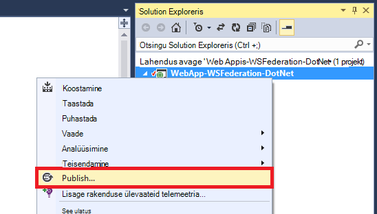

2. Valige **Microsoft Azure'i rakendust Service**.
3. Kui te pole sisse logitud, Azure, klõpsake nuppu **Logi sisse** ja logige sisse Microsofti konto Azure tellimuse abil.
4. Kui olete sisse loginud, klõpsake nuppu **Uus** , et luua veebirakenduse.
5. Täitke kõik nõutavad väljad. Te ei kavatse ühenduse kohapealne andmeid hiljem, seega pole see web appi andmebaasi loomine.

    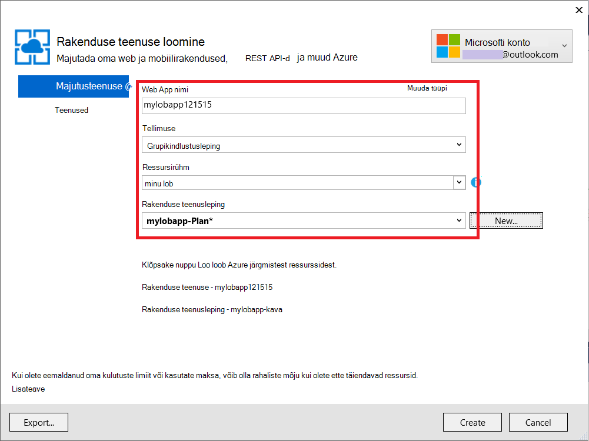

6. Klõpsake nuppu **Loo**. Kui veebirakenduse on loodud, avatakse dialoogiboks veebis avaldamine.
7. **Sihtkoha URL-i**, muutke **http** **HTTPS-i**. Kopeerige kogu URL-i tekstiredaktoris hilisemaks kasutamiseks. Klõpsake nuppu **Avalda**.

    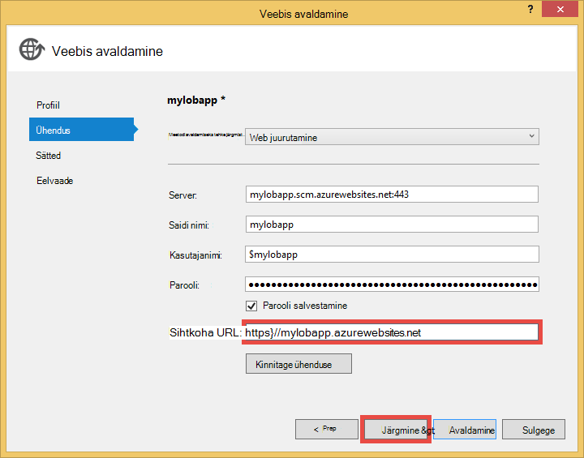

11. Visual Studio, avage **Web.Release.config** projektis. Sisestage järgmine XML-i sisse selle `<configuration>` sildistada ja võtmeväärtuse asendamine oma avalda veebirakenduse URL-i.  
    <pre class="prettyprint">
&lt;appSettings&gt;
   &lt;lisada võti = "ida: RPIdentifier" väärtus = "<mark>[nt https://mylobapp.azurewebsites.net/]</mark>" xdt:Transform = "SetAttributes" xdt:Locator="Match(key)" /&gt;
&lt;/appSettings&gt;</pre>

Kui olete lõpetanud, on teil kaks RP identifikaatorite projekti, ühes silumine keskkonna Visual Studios, ja Azure avaldatud veebirakenduse jaoks konfigureeritud. Iga AD FS-i kahes keskkonnas kas häälestamine on RP usalda. Ajal silumine, on rakenduse sätted on Web.config saab teha oma **silumine** konfigureerimine AD FS-i töötamine. Kui see on avaldatud (vaikimisi **väljaanne** konfigureerimine on avaldatud), ümber Web.config on üles laaditud, mis sisaldab rakenduse sätete muudatused Web.Release.config.

Kui soovite manustada avaldatud veebirakenduse Azure, et siluri (st peab üleslaadimine silumine sümbolid teie avaldatud web Appis kood), saate luua klooni silumine konfiguratsiooni Azure silumine, kuid oma kohandatud Web.config transformatsioon (nt Web.AzureDebug.config) mis kasutab rakenduse sätete kaudu Web.Release.config. See võimaldab teil säilitada staatilise konfiguratsiooni üle erinevate keskkonnas.

## Tuginedes peo loodab AD FS-i halduse konfigureerimine ##

Nüüd tuleb konfigureerida ka AD FS-i halduse RP usaldus enne saate kasutada rakenduse valimi ja tegelikult autentimiseks AD FS-i. Peate kahte eraldi RP usalduste, üks silumine keskkonna ja üks avaldatud veebirakenduse jaoks häälestamiseks.

> [AZURE.NOTE] Veenduge, et nii teie keskkonnas korrata järgmist.

4.  AD FS-i serverisse sisse logida identimisteavet, mida on AD FS-i haldamise õigused.
5.  Avatud AD FS-i haldus. Paremklõpsake **AD FS\Trusted Relationships\Relying tootja loodab** ja valige **Lisa tuginedes poole usaldada**.

    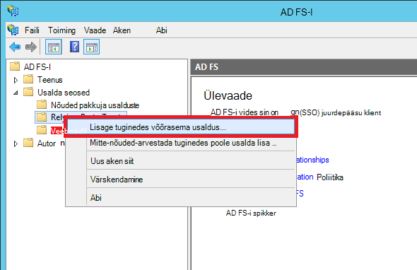

5.  Valige lehel **Andmeallika valimine** **osalise andmeid käsitsi sisestada**. 

    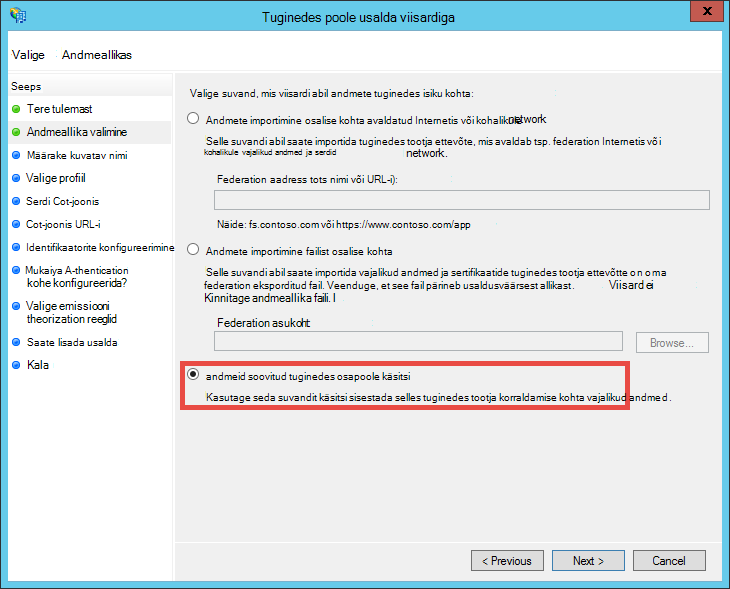

6.  **Määramiseks nimi kuvatakse** lehe tippige rakenduse kuvatav nimi ja klõpsake nuppu **edasi**.
7.  Klõpsake lehel **Valige Protocol (protokoll)** klõpsake nuppu **edasi**.
8.  **Serdi konfigureerimine** lehel klõpsake nuppu **edasi**.

    > [AZURE.NOTE] Kuna siis tuleks kasutada HTTPS juba, krüptitud sõned on valikuline. Kui soovite krüptida sõnet sellel lehel AD FS-i, peate lisama ka luba dekrüptimine loogika koodi. Lisateavet leiate teemast [OWIN oli-Federation vahevara käsitsi konfigureerimine ja nõustumine krüptitud sõned](http://chris.59north.com/post/2014/08/21/Manually-configuring-OWIN-WS-Federation-middleware-and-accepting-encrypted-tokens.aspx).
  
5.  Enne, kui teisaldate peale järgmise juhise juurde, peate osa teabest Visual Studio projekti. Projekti atribuutide, Pange tähele **SSL-i URL-i** rakendus. 

    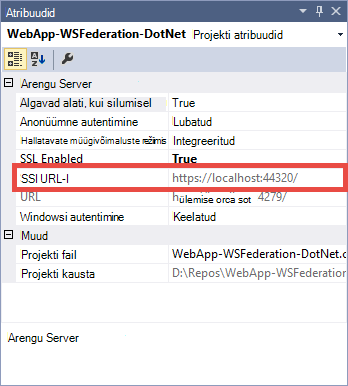

6.  Tagasi AD FS-i halduse **Konfigureerimine URL-i** lehel **Tuginedes tootja usaldada viisardit**, valige **Luba oli-Federation passiivne protokolli tugi** ja tippige SSL-i URL-i, mis eelmises toimingus Visual Studio projekti. Klõpsake nuppu **edasi**.

    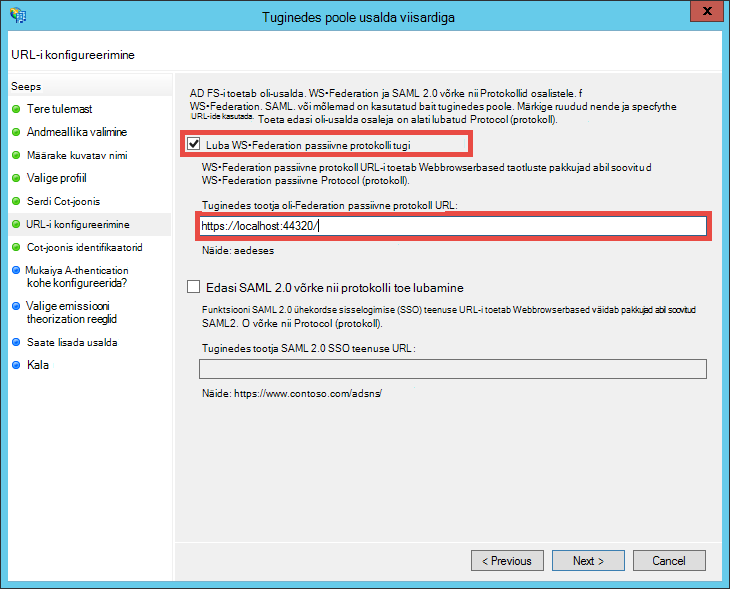

    > [AZURE.NOTE] URL-i määrab, kuhu saata kliendi pärast autentimist õnnestus. Silumine keskkonnas, peaks olema <code>https://localhost:&lt;port&gt;/</code>. Avaldatud web appi, peaks olema web appi URL.

7.  **Identifikaatorite konfigureerimine** lehel, veenduge, et SSL-i URL-i projekti on juba loetletud ja klõpsake nuppu **edasi**. Klõpsake nuppu **edasi** täiesti vaikimisi valikute viisardi lõpuni.

    > [AZURE.NOTE] Visual Studio projekti App_Start\Startup.Auth.cs, klõpsake selle identifikaator sobib vastu väärtus <code>WsFederationAuthenticationOptions.Wtrealm</code> ühendatud autentimisel. Vaikimisi lisatakse rakenduse URL-i eelmises juhises identifikaatori RP.

8.  Nüüd olete lõpetanud oma projekti RP rakenduse konfigureerimine AD FS-i. Järgmisena saate konfigureerida selle rakenduse saata nõutud rakenduse nõuded. Dialoogiboks **Redigeeri nõude reeglid** avatakse vaikimisi teile viisardi lõpus nii, et saate kohe alustada. Konfigureerige vähemalt järgmised nõuded (koos skeemi sulgudes):

    -   ASP.net-i abil hüdraat kasutatav nimi (http://schemas.xmlsoap.org/ws/2005/05/identity/claims/name) - `User.Identity.Name`.
    -   Kasutaja turvasubjektinimi (http://schemas.xmlsoap.org/ws/2005/05/identity/claims/upn) – kordumatult tuvastada organisatsiooni kasutajad.
    -   Saab kasutada rühmaliikmeid nimega rollid (http://schemas.microsoft.com/ws/2008/06/identity/claims/role) - `[Authorize(Roles="role1, role2,...")]` viimistlus lubada kontrollerid/toimingud. Tegelikult ei pruugi see lähenemine enamik kiire rolli luba. Kui teie AD kasutajad sadu turberühmad, muutuvad need sadu rolli nõuete SAML luba. Alternatiivne lähenemine on kindla rolliga taotluste tingimuslikult sõltuvalt kasutaja liikmelisuse teatud rühmale saata. Siiski Jälgi seda lihtsat selles õpetuses mõeldud.
    -   Nimi (http://schemas.xmlsoap.org/ws/2005/05/identity/claims/nameidentifier) ID - saab kasutada anti võltsimist valideerimine. Lisateavet selle kohta, kuidas töötada koos anti võltsimist valideerimise [loomine lisamine –-ärivaldkonna Azure rakenduse Azure Active Directory autentimise](web-sites-dotnet-lob-application-azure-ad.md#bkmk_crud)jaotisest **Lisa ärivaldkonna funktsioonid** .

    > [AZURE.NOTE] Nõude tüübid, tuleb teil konfigureerida rakenduse määrab teie taotlus vajadustele. Azure Active Directory rakenduste (nt RP usalduste) ei toeta taotluste loendi leiate teemast näiteks [toetatud Turbeloa ja taotluste tüübid](http://msdn.microsoft.com/library/azure/dn195587.aspx).

8.  Klõpsake dialoogiboksis Redigeeri nõude reeglid nuppu **Lisa reegel**.
9.  Konfigureerige nimi, UPN-i ja rolli taotluste nagu pildil näha, ja klõpsake nuppu **valmis**.

    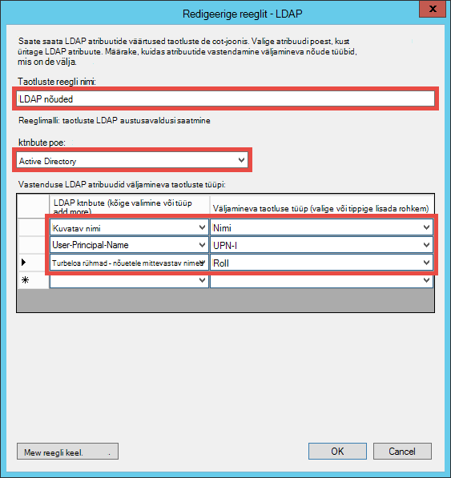

    Järgmiseks loote ID nõude kasutamise juhised on näidatud [Nimi identifikaatorite SAML kinnitused](http://blogs.msdn.com/b/card/archive/2010/02/17/name-identifiers-in-saml-assertions.aspx)siirdamiseks nimi.

9.  Klõpsake uuesti nuppu **Lisa reegel** .
10. Valige **kohandatud reegli abil taotluste saata** , ja klõpsake nuppu **edasi**.
11. Kleepige väljale **kohandatud reegli** järgmist reeglit keele **Kohta seansi identifikaator** reegli nimi ja klõpsake nuppu **valmis**.  
    <pre class="prettyprint">
    C1: [tüüp == "http://schemas.microsoft.com/ws/2008/06/identity/claims/windowsaccountname"] &amp; &amp; 
    c2: [tüüp == "http://schemas.microsoft.com/ws/2008/06/identity/claims/authenticationinstant"] = > Lisa (talletada = "_OpaqueIdStore" tüüpi = ("<mark>http://contoso.com/internal/sessionid</mark>"), päringu = "{0}; {} 1}; {2}; {3}; {4} ", param ="useEntropy"param = c1. Väärtus, param = c1. OriginalIssuer param = "", param = c2. Väärtus);
    </pre>

    Kohandatud reegli peaks välja nägema selle kuvatõmmis.

    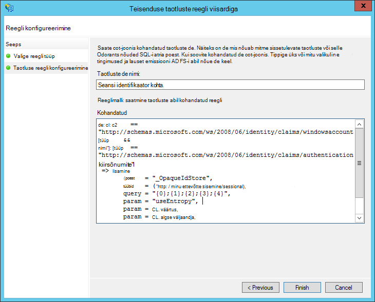

9.  Klõpsake uuesti nuppu **Lisa reegel** .
10. Valige **muuta mõne sissetulevate taotluste** ja klõpsake nuppu **edasi**.
11. Konfigureerige reegel, nagu pildil näha (abil loodud kohandatud reegli taotluse tüüp) ja klõpsake nuppu **valmis**.

    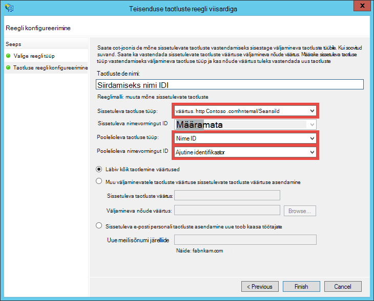

    Juhised siirdamiseks nimi ID taotluste kohta leiate üksikasjalikumat teavet teemast [SAML kinnitused identifikaatorite nimi](http://blogs.msdn.com/b/card/archive/2010/02/17/name-identifiers-in-saml-assertions.aspx).

12. Dialoogiboksis **Taotluste reeglite redigeerimiseks** klõpsake nuppu **Rakenda** . See peaks nüüd välja nägema järgmine pilt:

    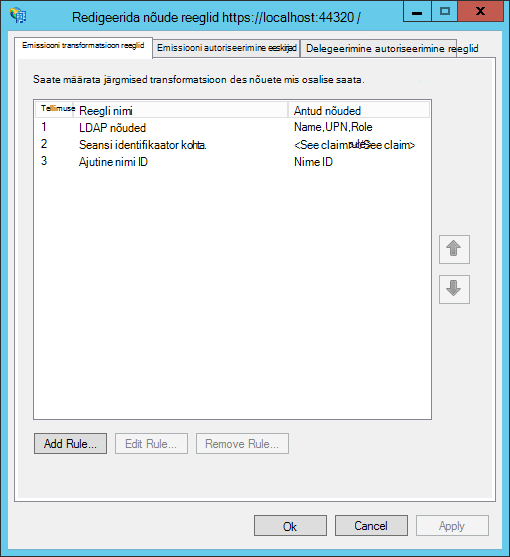

    > [AZURE.NOTE] Uuesti, veenduge, et nende toimingute kordamist silumine keskkonna ja avaldatud web appi.

## Väline autentimist rakenduse testimine

Olete valmis, et testida rakenduse autentimise loogika vastu AD FS-i. Minu AD FS-i lab keskkonnas, mul on testkasutaja, mis kuulub testi rühma Active Directory (AD).

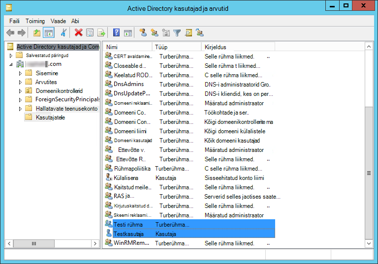

Testimiseks siluris autentimise kõik peate tegema nüüd on tippige `F5`. Kui soovite testida autentimise avaldatud web Appis, liikuge URL-i.

Pärast veebirakenduse laadib, klõpsake nuppu **Logi sisse**. Nüüd saate kas kasutajaloendiga dialoog või kätte AD FS-i, sõltuvalt valitud AD FS-i abil autentimise sisselogimise lehele. Siin on, mida ma saan Internet Explorer 11.

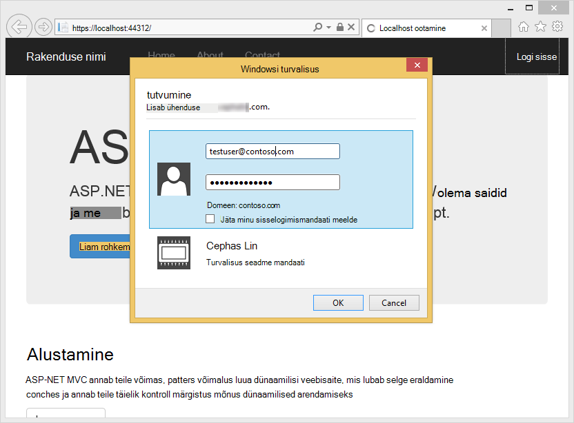

Kui logite sisse AD FS-i juurutamise AD domeeni kasutaja, näete nüüd kodulehele uuesti koos **Tere, <User Name>!** nurgas. Siin on, mida ma saan.

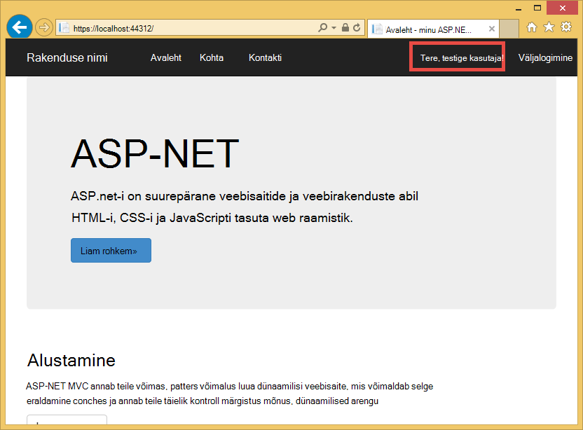

Nii palju, on teil õnnestus järgmisel viisil:

- Teie taotlus on jõudnud edukalt AD FS-i ja vastavaid RP identifikaator on leitud AD FS-i andmebaas
- AD FS-i on edukalt autenditud kasutaja AD- ja redirect teid tagasi rakenduse Avaleht
- Nimega AD FS-i saadetud nimi nõude (http://schemas.xmlsoap.org/ws/2005/05/identity/claims/name) rakenduse, nagu näidatud asjaolu, et kasutaja nimi kuvatakse nurgas. 

Kui taotluste nimi on puudu, mida oleks näinud **Tere,!**. Kui vaatate Views\Shared\_LoginPartial.cshtml, leiate, et see kasutab `User.Identity.Name` kasutajanimi kuvamiseks. Nagu varem mainitud kui autenditud kasutaja nimi nõude on saadaval SAML luba hüdraadid ASP.net-i see atribuut. Nõuded, mis on saadetud AD FS-i vaatamiseks panna katkestuspunkti Controllers\HomeController.cs, Index toimingu meetod. Pärast seda, kui kasutaja on autenditud, kontrolli selle `System.Security.Claims.Current.Claims` saidikogumi.

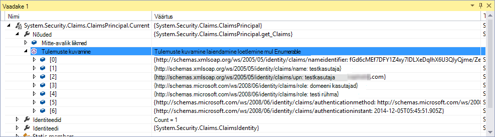 

## Lubada kasutajate jaoks teatud kontrollerid või toimingud

Kuna olete lisanud rühmaliikmeid nagu rolli teie RP usalda konfiguratsiooni, nüüd saate need otse soovitud `[Authorize(Roles="...")]` viimistlus kontrollerite ja toimingud. Loo lugemine Update Kustuta (CRUD) mustriga ärivaldkonna rakenduses, saate lubada teatud rollide juurde pääseda iga toimingu. Nüüd, kuvatakse ainult proovida see funktsioon kontrolleril olemasoleva Avaleht.

1. Avage Controllers\HomeController.cs.
2. Kaunistamine on `About` ja `Contact` toimingu meetodite umbes järgmine kood, kasutades turvalisus rühmitamine liikmelisused, mis sisaldab teie autenditud kasutaja.  
    <pre class="prettyprint">
    <mark>[Autoriseerida (rollid = "Testi jaotises")]</mark> 
    avaliku ActionResult About() {ViewBag.Message = "Oma rakenduse kirjelduse lehe.";

        return View();
    }

    <mark>[Autoriseerida (rollid = "Domain Admins")]</mark> 
    avaliku ActionResult Contact() {ViewBag.Message = "Teie kontaktide leht.";

        return View();
    }  </pre>

    Kuna lisamist **Testida kasutaja** **Testi jaotises** minu AD FS-i lab keskkonnas, ma kasutada testi jaotises luba testimiseks klõpsake `About`. Jaoks `Contact`, ma test negatiivne puhul **Domain Admins**, millele ei kuulu **Kasutaja testida** .

3. Käivitage siluri, tippides `F5` ja logige sisse ja seejärel klõpsake käsku **teave**. Teil peaks nüüd vaadata selle `~/About/Index` lehel edukalt, kui teie autenditud kasutaja selle toimingu jaoks lubatud.
4. Nüüd klõpsake **kontakti**, mis on minu puhul tuleks lubada **Testkasutaja** toimingute jaoks. Siiski brauseri on ümber AD FS-i, mis näitab lõpuks teade:

    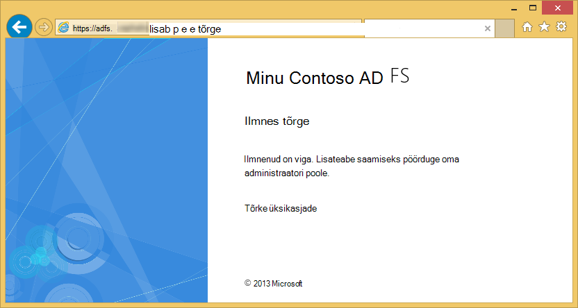

    Kui see viga Sündmusevaatur AD FS server uurimiseks näete erandi teade:  
    <pre class="prettyprint">
   Microsoft.IdentityServer.Web.InvalidRequestException: MSIS7042: <mark>sama kliendi brauseriseansi on muutnud "6" taotlusi viimati 11 sekundites.</mark> Lisateavet, võtke ühendust oma administraatoriga.
   veebisaidil Microsoft.IdentityServer.Web.Protocols.PassiveProtocolHandler.UpdateLoopDetectionCookie (WrappedHttpListenerContext seoses) juures Microsoft.IdentityServer.Web.Protocols.WSFederation.WSFederationProtocolHandler.SendSignInResponse (WSFederationContext konteksti, MSISSignInResponse vastuse) Microsoft.IdentityServer.Web.PassiveProtocolListener.ProcessProtocolRequest (ProtocolContext protocolContext, PassiveProtocolHandler protocolHandler) Microsoft.IdentityServer.Web.PassiveProtocolListener.OnGetContext (WrappedHttpListenerContext seoses) </pre>

    Selle tõrke põhjuseks on, et vaikimisi MVC tagastab 401 volitamata kui kasutaja rollid ei ole lubatud. See käivitab Taasautentimine taotluse identiteedipakkuja (AD FS). Kuna on juba autenditud kasutaja, AD FS-i tagastab sama leht, siis probleemid teise 401, loomise redirect tsükkel. Saate alistab AuthorizeAttribute's `HandleUnauthorizedRequest` lihtsa loogika kuvamiseks midagi, selle asemel, redirect tsükkel loogilisemas meetod.

5. Faili nimega AuthorizeAttribute.cs projekti loomine ja kleepige see järgmine kood.

        using System;
        using System.Web.Mvc;
        using System.Web.Routing;
        
        namespace WebApp_WSFederation_DotNet
        {
            [AttributeUsage(AttributeTargets.Class | AttributeTargets.Method, Inherited = true, AllowMultiple = true)]
            public class AuthorizeAttribute : System.Web.Mvc.AuthorizeAttribute
            {
                protected override void HandleUnauthorizedRequest(AuthorizationContext filterContext)
                {
                    if (filterContext.HttpContext.Request.IsAuthenticated)
                    {
                        filterContext.Result = new System.Web.Mvc.HttpStatusCodeResult((int)System.Net.HttpStatusCode.Forbidden);
                    }
                    else
                    {
                        base.HandleUnauthorizedRequest(filterContext);
                    }
                }
            }
        }

    Alista kood saadab HTTP 403 (keelatud) asemel HTTP 401 (volitamata) autenditud, kuid volitamata juhtudel.

6. Käivitage uuesti siluri `F5`. Klõpsake **kontakti** nüüd kuvatakse veel tähenduslik (ehkki ebameeldiv) tõrketeade:

    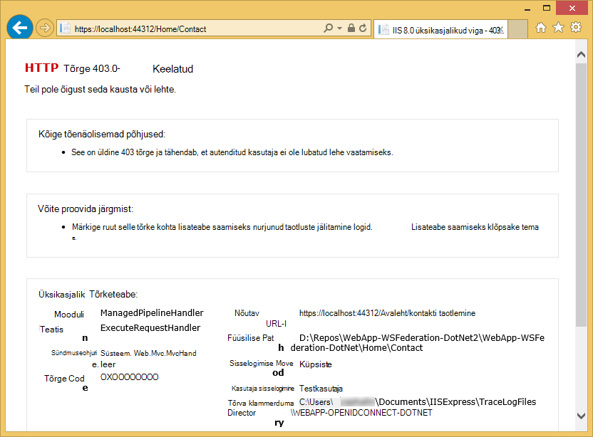

7. Avaldamine rakenduse Azure'i rakenduse teenuse veebirakenduste uuesti ja testige reaalajas rakenduse toimimist.

## Kohapealse andmetega ühenduse loomine

Põhjus, kelle soovite rakendada ka ärivaldkonna rakenduse AD FS asemel Azure Active Directory on vastavuse probleemid säilitamise ettevõtte andmed välja – eeldusel. See võib ka tähendab, et oma veebirakenduse Azure peab juurdepääs kohapealne andmebaase, kuna teil pole õigust kasutada [SQL-andmebaasi](/services/sql-database/) andmete taseme oma web apps.

Azure'i rakenduse teenuse veebirakenduste toetab juurdepääs kohapealne andmebaasid kahel viisil: [Hübriid ühendusi](../biztalk-services/integration-hybrid-connection-overview.md) ja [Virtuaalse võrgu](web-sites-integrate-with-vnet.md). Lisateabe saamiseks vt [abil VNET integreerimine ja hübriid ühendused Azure'i rakenduse teenuse Web Apps](https://azure.microsoft.com/blog/2014/10/30/using-vnet-or-hybrid-conn-with-websites/).

## Veel ressursse

- [SSL-i ja atribuudi Autoriseerin taotluse kaitsmine](web-sites-dotnet-deploy-aspnet-mvc-app-membership-oauth-sql-database.md#protect-the-application-with-ssl-and-the-authorize-attribute)
- [Kohapealse Active Directory Azure rakenduse autentida](web-sites-authentication-authorization.md)
- [Azure Active Directory autentimise ärivaldkonna Azure rakenduse loomine](web-sites-dotnet-lob-application-azure-ad.md)
- [ASP.net-i Visual Studio 2013 Asutusesisese organisatsiooni autentimise suvandit (ADFS) kasutamine](http://www.cloudidentity.com/blog/2014/02/12/use-the-on-premises-organizational-authentication-option-adfs-with-asp-net-in-visual-studio-2013/)
- [Migreerimine WIF VS2013 Web projekti Katana](http://www.cloudidentity.com/blog/2014/09/15/MIGRATE-A-VS2013-WEB-PROJECT-FROM-WIF-TO-KATANA/)
- [Active Directory Federation Services ülevaade](http://technet.microsoft.com/library/hh831502.aspx)
- [OLI-Federation 1.1 määratlus](http://download.boulder.ibm.com/ibmdl/pub/software/dw/specs/ws-fed/WS-Federation-V1-1B.pdf?S_TACT=105AGX04&S_CMP=LP)

