<properties 
    pageTitle="Ärivaldkonna Azure rakenduse loomine Azure Active Directory autentimise | Microsoft Azure'i" 
    description="Siit saate teada, kuidas luua rakenduse ASP.net-i MVC ärivaldkonna Azure'i rakenduse teenus, mis autendib Azure Active Directory" 
    services="app-service\web, active-directory" 
    documentationCenter=".net" 
    authors="cephalin" 
    manager="wpickett" 
    editor=""/>

<tags 
    ms.service="app-service-web" 
    ms.devlang="dotnet" 
    ms.topic="article" 
    ms.tgt_pltfrm="na" 
    ms.workload="web" 
    ms.date="09/01/2016" 
    ms.author="cephalin"/>

# Azure Active Directory autentimise ärivaldkonna Azure rakenduse loomine #

Selles artiklis kirjeldatakse, kuidas [Azure'i rakenduse teenuse Web Appsi](http://go.microsoft.com/fwlink/?LinkId=529714) kasutamise .NET ärivaldkonna rakenduse loomine soovitud [autentimine / autoriseerimine](../app-service/app-service-authentication-overview.md) funktsiooni. Samuti näitab [Azure Active Directory Graph API](https://msdn.microsoft.com/Library/Azure/Ad/Graph/api/api-catalog) directory andmepäringuid rakenduse kasutamise kohta.

Azure Active Directory rentniku, mida kasutate võib olla ka ainult Azure kataloogi. Või see võib olla [teie kohapealne Active Directoryga sünkroonitud](../active-directory/active-directory-aadconnect.md) töötajate, mis on kohapealse ja remote ühekordse sisselogimise teenuse loomiseks. Selles artiklis kasutab vaikekataloogi Azure'i kontosse.

## Mis on koostamine ##

Saate luua lihtne ärivaldkonna Loo lugemine Update Kustuta (CRUD) rakendus App teenuse veebirakendustes jälitab tööüksusi järgmisi funktsioone:

- Autendib kasutajad, Azure Active Directory
- Päringute directory kasutajad ja rühmad [Azure Active Directory Graph API](http://msdn.microsoft.com/library/azure/hh974476.aspx) kasutamine
- ASP.net-i MVC *Ei autentimise* malli kasutamine

Kui vajate oma ärivaldkonna rakenduse Azure Rollipõhine juurdepääsu reguleerimine (RBAC), lugege teemat [Järgmise juhisega](#next).

## Mida on vaja ##

[AZURE.INCLUDE [free-trial-note](../../includes/free-trial-note.md)]

Teil on vaja selle õpetuse lõpetamiseks järgmist:

- Azure Active Directory rentnikku eri rühmade kasutajatega
- Õiguste luua rakendusi Azure Active Directory rentniku kohta
- Visual Studio 2013 värskenduse 4 või uuem versioon
- [Azure'i SDK 2.8.1 või uuem versioon](https://azure.microsoft.com/downloads/)

## Luua ja juurutada Azure web app ##

1. Visual Studio, klõpsake **faili** > **Uus** > **projekti**.

2. Valige **ASP.net-i veebirakenduse**, projekti nimi ja klõpsake nuppu **OK**.

3. Valige **MVC** Mall ja seejärel muuta autentimine **Ei autentimist**. Veenduge, et **pilveteenuses Host** oleks märgitud, ja klõpsake nuppu **OK**.

    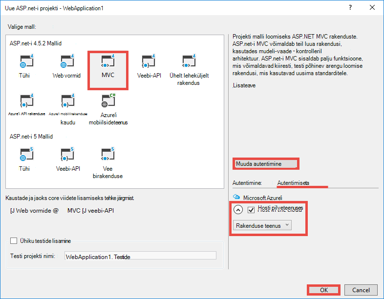

4. Dialoogiboksis **Loomine rakenduse teenuse** nuppu **konto lisamine** (ja seejärel **Lisa konto** rippmenüüst) Azure'i kontosse sisse logida.

5. Kui sisse loginud oma web appi konfigureerimine. Nupu **Uus** vastava ressursirühma ja uue rakenduse teenusleping loomine. Klõpsake käsku **Uuri Azure lisateenuse** jätkata.

    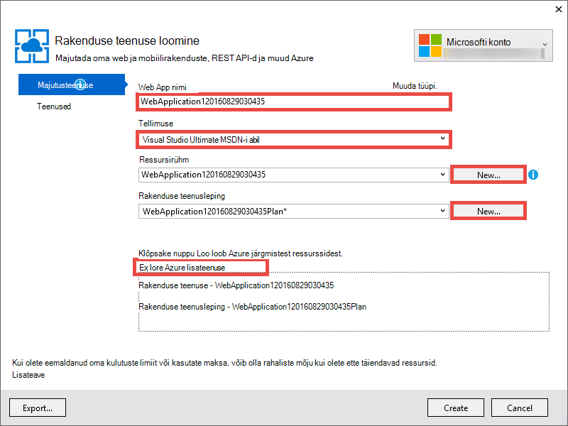

6. Klõpsake vahekaardil **teenused** **+** lisada oma rakenduse SQL-andmebaasi. 

    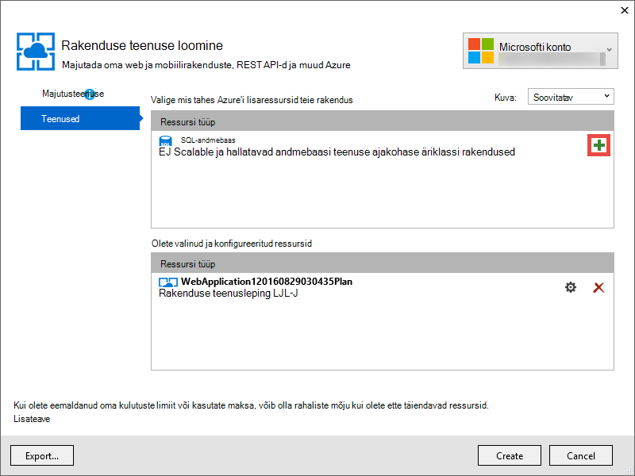

7. **SQL-andmebaasi konfigureerimine**, klõpsake nuppu **Uus** loomine SQL serveri eksemplar.

8. **Konfigureerimine SQL serveri**konfigureerima SQL serveri eksemplar. Seejärel klõpsake nuppu **OK**, **OK**ja **loomine** rakenduse loomine Azure võrgukoosolekuga.

9. **Azure'i rakenduse tegevuse**, näete, kui rakenduse loomisel on lõpule jõudnud. Klõpsake * *Avalda &lt; *rakendusenimi*> selles veebirakenduse now**seejärel klõpsake nuppu **avalda **. 

    Kui Visual Studio lõpetab, avab avalda rakendus brauseris. 

    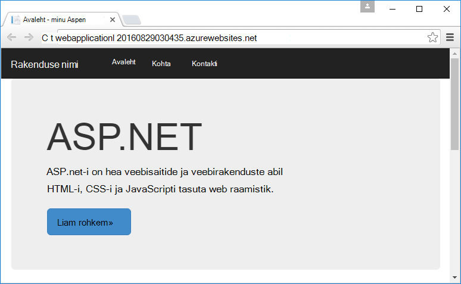

## Autentimis- ja directory access konfigureerimine

1. [Azure'i portaali](https://portal.azure.com)sisse logida.

2. Klõpsake vasakpoolses menüüs **Rakenduse teenuste** > **&lt;*rakendusenimi*>** > **autentimine / autoriseerimine **.

    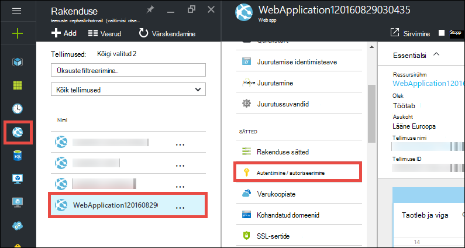

3. Lülitage sisse Azure Active Directory autentimine, **klõpsates** > **Azure Active Directory** > **Express** > **OK**.

    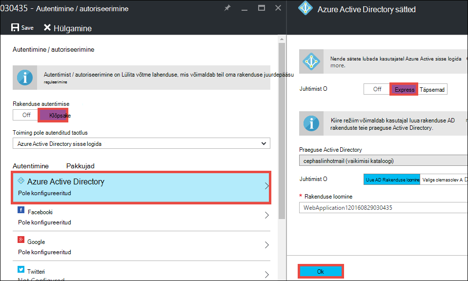

4. Käsk ribal nuppu **Salvesta** .

    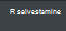

    Kui autentimissätted on salvestatud, proovige uuesti brauseris rakenduse liikumine. Vaikesätteid rakendada kogu rakenduse autentimist. Kui te pole veel sisse loginud, suunatakse teid sisselogimise ekraani. Kui sisse loginud, näete rakenduse turvatud HTTPS-i. Järgmiseks peate kataloogi andmetele juurdepääsu lubamine. 

5. Liikuge [klassikaline portaalis](https://manage.windowsazure.com).

6. Klõpsake vasakpoolses menüüs **Active Directory** > **Vaikimisi kataloogi** > **rakenduste** > **&lt;*rakendusenimi*> **.

    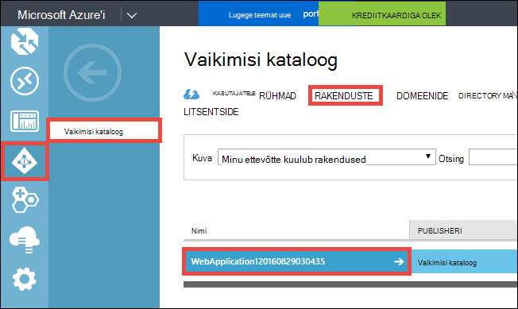

    See on teie jaoks loodud rakenduse teenuse Azure Active Directory rakenduse lubamiseks luba / autentimise funktsioon.

7. Klõpsake nuppu **Kasutajad** ja **rühmad** veenduge, et kataloogi on mõned kasutajad ja rühmad. Kui ei, luua mõne testi kasutajad ja rühmad.

    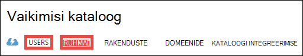

7. Klõpsake nuppu **Konfigureeri** selle rakenduse konfigureerimiseks.

8. Liikuge kerides jaotiseni **võtmed** ja lisage võti, valides kestus. Seejärel klõpsake nuppu **Delegeeritud õigused** ja valige **kataloogi andmete lugemine**. Klõpsake nuppu **Salvesta**.

    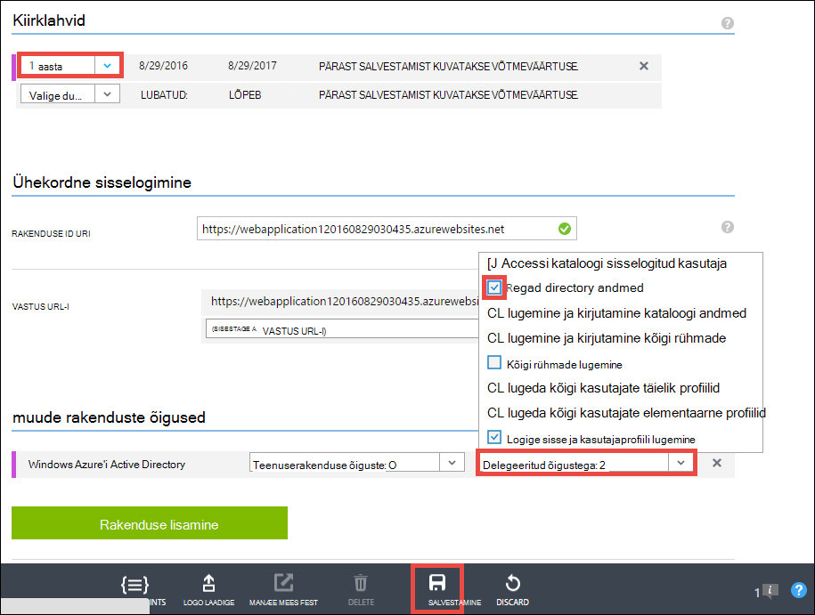

8. Kui salvestatakse teie sätted, liikuge tagasi registriredaktori **klahvid** jaotis ja klõpsake nuppu **Kopeeri** kopeerimiseks kliendi võti. 

    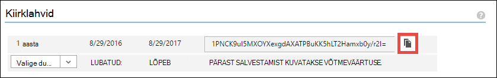

    >[AZURE.IMPORTANT] Kui liigute lehelt kohe, ei saa selle kliendi klahvi kunagi juurde.

9. Järgmiseks peate oma veebirakenduse konfigureerimine see võti. [Azure'i Resource Explorer](https://resources.azure.com) Azure kontoga sisse logida.

10. Klõpsake lehe ülaosas **Lugemis-ja kirjutamisõigusega** Azure'i ressursi Exploreris muudatusi teha.

    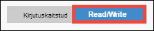

11. Leida oma rakenduse, mis asub tellimuste autentimissätted > * *&lt;*subscriptionname*>** > **resourceGroups** > **&lt;*resourcegroupname*>** > **pakkujad** > **Microsoft.Web** > **saitide** > **&lt;*rakendusenimi*>** > **config** > **authsettings **.

12. Klõpsake nuppu **Redigeeri**.

    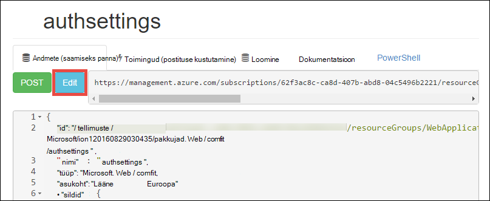

13. Redigeerimise paanil määrake soovitud `clientSecret` ja `additionalLoginParams` atribuudid järgmiselt.

        ...
        "clientSecret": "<client key from the Azure Active Directory application>",
        ...
        "additionalLoginParams": ["response_type=code id_token", "resource=https://graph.windows.net"],
        ...

14. Muutuste edastamiseks ülaosas nuppu **panna** .

    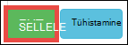

14. Nüüd, kui teil on luba luba juurdepääsu Azure Active Directory Graph API testimiseks lihtsalt liikuda * *https://&lt;*rakendusenimi*>.azurewebsites.net/.auth/me** brauseris. Kui te kõik õigesti konfigureeritud, peaksite nägema selle `access_token` atribuudi JSON vastus.

    Funktsiooni `~/.auth/me` URL-tee haldab rakenduse autentimise autoriseerimine teile kogu teabe nendega seotud autenditud seansi. Lisateavet leiate teemast [autentimise ja luba teenuses Azure rakenduse](../app-service/app-service-authentication-overview.md).

    >[AZURE.NOTE] Funktsiooni `access_token` on kuvamisperioodi. Siiski rakenduse autentimise ja luba pakub Turbeloa värskendamise funktsiooni abil `~/.auth/refresh`. Lisateavet selle kohta, kuidas seda kasutada, leiate teemast     [Teenuse luba Rakendusepoest](https://cgillum.tech/2016/03/07/app-service-token-store/).

Järgmiseks tuleb teha midagi kasulikku directory andmetega.

## Rakenduse ärivaldkonna funktsioonide lisamine

Nüüd saate luua lihtsa CRUD töö üksuste jälgimine.  

5.  Kaustas ~\Models klassi fail nimega WorkItem.cs loomine ja asendada `public class WorkItem {...}` järgmine kood:

        using System.ComponentModel.DataAnnotations;

        public class WorkItem
        {
            [Key]
            public int ItemID { get; set; }
            public string AssignedToID { get; set; }
            public string AssignedToName { get; set; }
            public string Description { get; set; }
            public WorkItemStatus Status { get; set; }
        }

        public enum WorkItemStatus
        {
            Open,
            Investigating,
            Resolved,
            Closed
        }

7.  Luua projekti hõlbustamiseks uue mudelisse tellingud loogika Visual Studios.

8.  Scaffolded uue üksuse lisamiseks `WorkItemsController` ~\Controllers kausta (Paremklõpsake **kontrollerid**, osutage käsule **Lisa**ja valige **Uus scaffolded üksus**). 

9.  Valige **MVC 5 kontrolleril abil üksuse raames vaatega** ja klõpsake nuppu **Lisa**.

10. Valige mudel, mis on loodud, siis klõpsake **+** ja seejärel **Lisa** andmete kontekstis lisada, ja seejärel klõpsake nuppu **Lisa**.

    

14. ~\Views\WorkItems\Create.cshtml (automaatselt scaffolded kirje), otsige soovitud `Html.BeginForm` helper meetod ja teha esiletõstetud järgmisi muudatusi:  
<pre class="prettyprint">
    @modelWebApplication1.Models.WorkItem

    @{ViewBag.Title = &quot;loomine&quot;; }

    &lt;H2&gt;Loo&lt;/h2&gt;

    @using(Html.BeginForm (<mark>&quot;Loo&quot;, &quot;WorkItems&quot;, FormMethod.Post uus {id = &quot;põhi-vormi&quot; }</mark>)) {@Html.AntiForgeryToken()

        &lt;div class=&quot;form-horizontal&quot;&gt;
            &lt;h4&gt;WorkItem&lt;/h4&gt;
            &lt;hr /&gt;
            @Html.ValidationSummary(true, &quot;&quot;, new { @class = &quot;text-danger&quot; })
            &lt;div class=&quot;form-group&quot;&gt;
                @Html.LabelFor(model =&gt; model.AssignedToID, htmlAttributes: new { @class = &quot;control-label col-md-2&quot; })
                &lt;div class=&quot;col-md-10&quot;&gt;
                    @Html.EditorFor(model =&gt; model.AssignedToID, new { htmlAttributes = new { @class = &quot;form-control&quot;<mark>, @type = &quot;hidden&quot;</mark> } })
                    @Html.ValidationMessageFor(model =&gt; model.AssignedToID, &quot;&quot;, new { @class = &quot;text-danger&quot; })
                &lt;/div&gt;
            &lt;/div&gt;

            &lt;div class=&quot;form-group&quot;&gt;
                @Html.LabelFor(model =&gt; model.AssignedToName, htmlAttributes: new { @class = &quot;control-label col-md-2&quot; })
                &lt;div class=&quot;col-md-10&quot;&gt;
                    @Html.EditorFor(model =&gt; model.AssignedToName, new { htmlAttributes = new { @class = &quot;form-control&quot; } })
                    @Html.ValidationMessageFor(model =&gt; model.AssignedToName, &quot;&quot;, new { @class = &quot;text-danger&quot; })
                &lt;/div&gt;
            &lt;/div&gt;

            &lt;div class=&quot;form-group&quot;&gt;
                @Html.LabelFor(model =&gt; model.Description, htmlAttributes: new { @class = &quot;control-label col-md-2&quot; })
                &lt;div class=&quot;col-md-10&quot;&gt;
                    @Html.EditorFor(model =&gt; model.Description, new { htmlAttributes = new { @class = &quot;form-control&quot; } })
                    @Html.ValidationMessageFor(model =&gt; model.Description, &quot;&quot;, new { @class = &quot;text-danger&quot; })
                &lt;/div&gt;
            &lt;/div&gt;

            &lt;div class=&quot;form-group&quot;&gt;
                @Html.LabelFor(model =&gt; model.Status, htmlAttributes: new { @class = &quot;control-label col-md-2&quot; })
                &lt;div class=&quot;col-md-10&quot;&gt;
                    @Html.EnumDropDownListFor(model =&gt; model.Status, htmlAttributes: new { @class = &quot;form-control&quot; })
                    @Html.ValidationMessageFor(model =&gt; model.Status, &quot;&quot;, new { @class = &quot;text-danger&quot; })
                &lt;/div&gt;
            &lt;/div&gt;

            &lt;div class=&quot;form-group&quot;&gt;
                &lt;div class=&quot;col-md-offset-2 col-md-10&quot;&gt;
                    &lt;input type=&quot;submit&quot; value=&quot;Create&quot; class=&quot;btn btn-default&quot;<mark> id=&quot;submit-button&quot;</mark> /&gt;
                &lt;/div&gt;
            &lt;/div&gt;
        &lt;/div&gt;
    }

    &lt;DIV&gt;
    @Html.ActionLink(&quot;tagasi loendisse&quot;, &quot;Index&quot;) &lt;/div    &gt;

    @sectionSkriptide { @Scripts.Render( &quot;~/bundles/jqueryval&quot;)     <mark> &lt;skript&gt; 
     / / inimeste või rühmade valija kood var maxResultsPerPage = 14;         var sisendit = document.getElementById (&quot;AssignedToName&quot;);

            // Access token from request header, and tenantID from claims identity
            var token = &quot;@Request.Headers[&quot;X-MS-TOKEN-AAD-ACCESS-TOKEN&quot;]&quot;;
            var tenant =&quot;@(System.Security.Claims.ClaimsPrincipal.Current.Claims
                            .Where(c => c.Type == &quot;http://schemas.microsoft.com/identity/claims/tenantid&quot;)
                            .Select(c => c.Value).SingleOrDefault())&quot;;

            var picker = new AadPicker(maxResultsPerPage, input, token, tenant);

            // Submit the selected user/group to be asssigned.
            $(&quot;#submit-button&quot;).click({ picker: picker }, function () {
                if (!picker.Selected())
                    return;
                $(&quot;#main-form&quot;).get()[0].elements[&quot;AssignedToID&quot;].value = picker.Selected().objectId;
            });
        &lt;/script&gt;</mark>
    }
    </pre>
    
    Pange tähele, et `token` ja `tenant` kasutatakse funktsiooni `AadPicker` objekti Azure Active Directory Graph API kõnede tegemiseks. Saate lisada `AadPicker` hiljem.   
    
    >[AZURE.NOTE] Saate ka lihtsalt `token` ja `tenant` kliendi poolel koos `~/.auth/me`, kuid see oleks täiendavad tegemine. Näiteks:
    >  
    >     $.ajax({
    >         dataType: "json",
    >         url: "/.auth/me",
    >         success: function (data) {
    >             var token = data[0].access_token;
    >             var tenant = data[0].user_claims
    >                             .find(c => c.typ === 'http://schemas.microsoft.com/identity/claims/tenantid')
    >                             .val;
    >         }
    >     });
    
15. Sama muudatused koos ~ \Views\WorkItems\Edit.cshtml.

15. Funktsiooni `AadPicker` objekt on määratletud skripti, mille soovite lisada projekti. Paremklõpsake ~\Scripts kausta, osutage käsule **Lisa**ja valige **JavaScripti fail**. Tippige `AadPickerLibrary` faili nimi ja klõpsake nuppu **OK**.

16. Kopeerige sisu [siin](https://raw.githubusercontent.com/cephalin/active-directory-dotnet-webapp-roleclaims/master/WebApp-RoleClaims-DotNet/Scripts/AadPickerLibrary.js) üheks ~ \Scripts\AadPickerLibrary.js.

    Skript, on `AadPicker` objekti nõuab [Azure Active Directory Graph API](https://msdn.microsoft.com/Library/Azure/Ad/Graph/api/api-catalog) kasutajad ja rühmad, mis vastavad sisend otsida.  

17. ~\Scripts\AadPickerLibrary.js kasutab ka [jQuery UI automaatteksti vidina](https://jqueryui.com/autocomplete/). Seega peate jQuery UI lisamine projekti. Paremklõpsake oma projekti ja klõpsake nuppu **Halda NuGet-paketid**.

18. Klõpsake Nugeti paketi Manager, klõpsake nuppu Sirvi, tippige **jquery-ui** riba otsing, ja klõpsake nuppu **jQuery.UI.Combined**.

    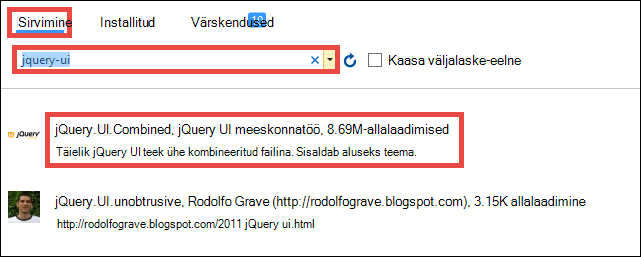

19. Klõpsake parempoolsel paanil klõpsake nuppu **Installi**ja seejärel jätkamiseks klõpsake nuppu **OK** .

19. Avage ~\App_Start\BundleConfig.cs ja esiletõstetud järgmised muudatused.  
    <pre class="prettyprint">
    avaliku staatilise kehtetu RegisterBundles(BundleCollection bundles) {kimbud. Lisage (uus ScriptBundle (&quot;~/bundles/jquery&quot;). Kaasata ( &quot;~/Scripts/jquery-{version}.js&quot;<mark>, &quot;~/Scripts/jquery-ui-{version}.js&quot;, &quot;~/Scripts/AadPickerLibrary.js&quot;</mark>));

        bundles.Add(new ScriptBundle(&quot;~/bundles/jqueryval&quot;).Include(
                    &quot;~/Scripts/jquery.validate*&quot;));

        // Use the development version of Modernizr to develop with and learn from. Then, when you&#39;re
        // ready for production, use the build tool at http://modernizr.com to pick only the tests you need.
        bundles.Add(new ScriptBundle(&quot;~/bundles/modernizr&quot;).Include(
                    &quot;~/Scripts/modernizr-*&quot;));

        bundles.Add(new ScriptBundle(&quot;~/bundles/bootstrap&quot;).Include(
                    &quot;~/Scripts/bootstrap.js&quot;,
                    &quot;~/Scripts/respond.js&quot;));

        bundles.Add(new StyleBundle(&quot;~/Content/css&quot;).Include(
                    &quot;~/Content/bootstrap.css&quot;,
                    &quot;~/Content/site.css&quot;<mark>,
                    &quot;~/Content/themes/base/jquery-ui.css&quot;</mark>));
    }
    </pre>

    On kiire lisavõimalused rakenduse JavaScript ja CSS-failide haldamine. Siiski jaoks lihtne lihtsalt kavatsete kontreiler kimbud, mis laaditakse iga vaade.

12. Lõpuks klõpsake ~ \Global.asax, lisage kood on `Application_Start()` meetod. `Ctrl`+`.`iga nime eraldusvõime tõrketeade seda parandada.

        AntiForgeryConfig.UniqueClaimTypeIdentifier = ClaimTypes.NameIdentifier;
    
    > [AZURE.NOTE] Teil on vaja seda, kuna MVC vaikemalli kasutab <code>[ValidateAntiForgeryToken]</code> viimistlus mõned toimingud. Kirjeldatud [Brock Allen](https://twitter.com/BrockLAllen)     [MVC 4, AntiForgeryToken](http://brockallen.com/2012/07/08/mvc-4-antiforgerytoken-and-claims/) ja taotluste tõttu HTTP postituse võib nurjuda anti võltsimist Turbeloa valideerimine, kuna:

    > - Azure Active Directory ei saada http://schemas.microsoft.com/accesscontrolservice/2010/07/claims/identityprovider, mis on vaikimisi luba anti võltsimist.
    > - Kui Azure Active Directory on sünkroonitud AD FS-i kataloogi, AD FS-i usalda vaikimisi ei saada http://schemas.microsoft.com/accesscontrolservice/2010/07/claims/identityprovider taotluste, kuigi saate saata selle nõude AD FS-i käsitsi konfigureerida.

    > `ClaimTypes.NameIdentifies`määrab nõude `http://schemas.xmlsoap.org/ws/2005/05/identity/claims/nameidentifier`, mis varustavad Azure Active Directory.  

20. Nüüd, avaldada oma muudatused. Paremklõpsake oma projekti ja klõpsake nuppu **Avalda**.

21. Klõpsake nuppu **sätted**, veenduge, et ühendusstringi SQL-andmebaasiga, valige **Update andmebaasi** skeemi oma mudeli muudatused ja klõpsake nuppu **Avalda**.

    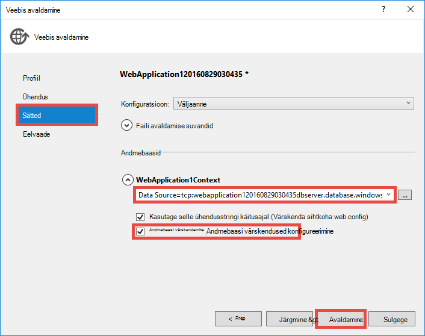

22. Liikuge brauseris https://&lt;*rakendusenimi*>.azurewebsites.net/workitems ja klõpsake nuppu **Loo uus**.

23. Klõpsake väljal **AssignedToName** . Nüüd peaks nähtaval kasutajad ja rühmad oma Azure Active Directory rentnikust on ripploendis. Tippige filtreerimiseks või kasutage funktsiooni `Up` või `Down` sisestage või valige selle kasutaja või rühma. 

    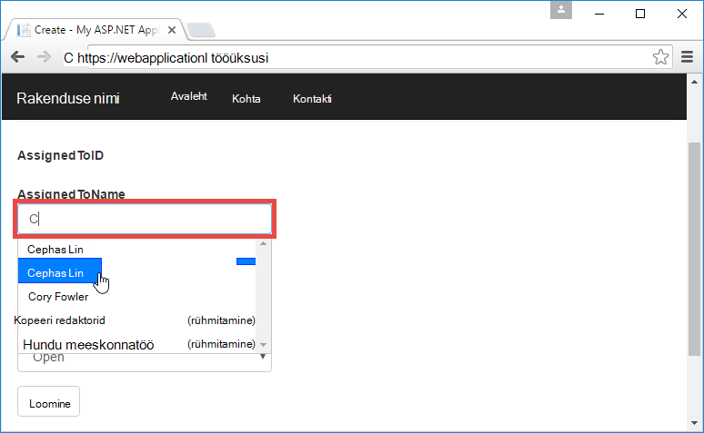

24. Klõpsake nuppu **Loo** muudatused salvestada. Klõpsake **redigeerimine** loodud töö üksuse jälgida sama käitumist.

Palju õnne, nüüd kasutate ärivaldkonna rakenduse Azure directory access! On palju saate teha Graph API-ga. Teemast [Azure AD Graph API juhend](https://msdn.microsoft.com/library/azure/ad/graph/api/api-catalog).

## Järgmise juhise juurde

Kui vajate oma ärivaldkonna rakenduse Azure Rollipõhine juurdepääsu reguleerimine (RBAC), vt [Web Appis-RoleClaims-DotNet](https://github.com/Azure-Samples/active-directory-dotnet-webapp-roleclaims) Azure Active Directory meeskond. See näitab, kuidas lubada Azure Active Directory rakenduse rollid, ja seejärel lubada kasutajad, kellel on `[Authorize]` viimistlus.

Kui teie ärivaldkonna rakendus peab kohapealse andmetele juurdepääsu, lugege teemat [Accessi kohapealse hübriid ühendused teenuses Azure rakenduse abil](web-sites-hybrid-connection-get-started.md).

## Veel ressursse

- [Autentimise ja luba teenuses Azure rakendus](../app-service/app-service-authentication-overview.md)
- [Kohapealse Active Directory Azure rakenduse autentida](web-sites-authentication-authorization.md)
- [Ärivaldkonna rakenduse loomine Azure AD FS-i autentimise](web-sites-dotnet-lob-application-adfs.md)
- [Rakenduse teenuse Auth ja Azure AD graafik API](https://cgillum.tech/2016/03/25/app-service-auth-aad-graph-api/)
- [Microsoft Azure Active Directory näidiseid ja dokumentatsioon](https://github.com/AzureADSamples)
- [Azure Active Directory toetatud luba ja taotluste tüübid](http://msdn.microsoft.com/library/azure/dn195587.aspx)

[Protect the Application with SSL and the Authorize Attribute]: web-sites-dotnet-deploy-aspnet-mvc-app-membership-oauth-sql-database.md#protect-the-application-with-ssl-and-the-authorize-attribute
