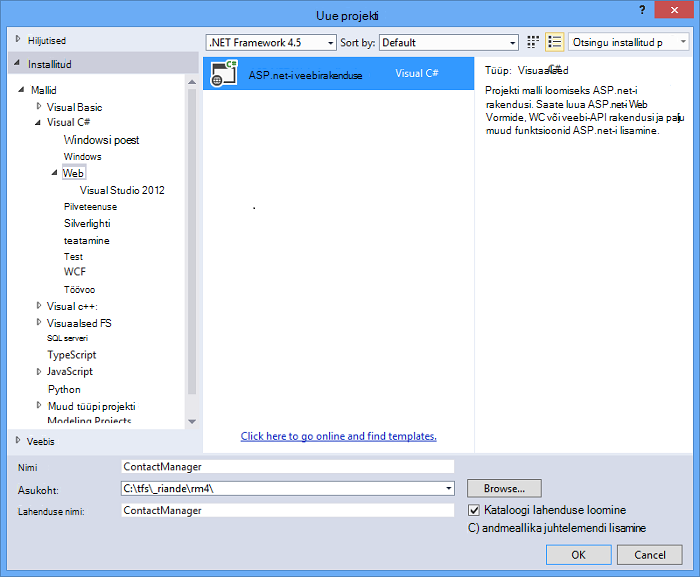
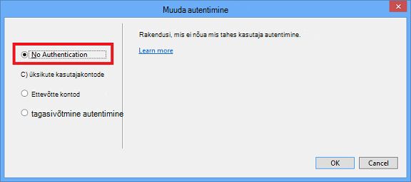
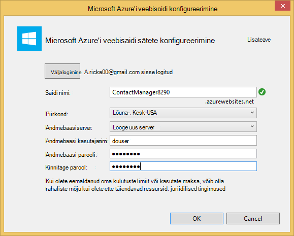
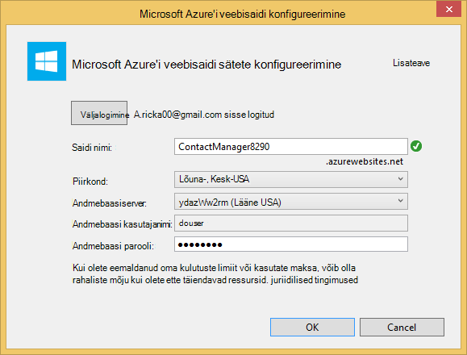
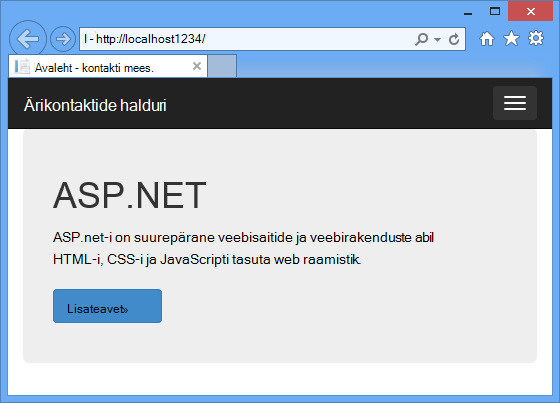
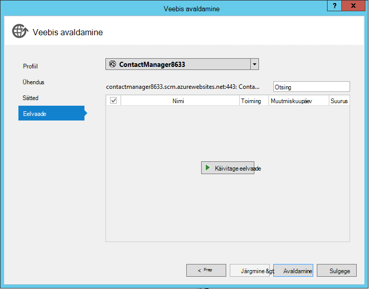
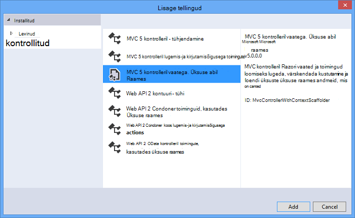
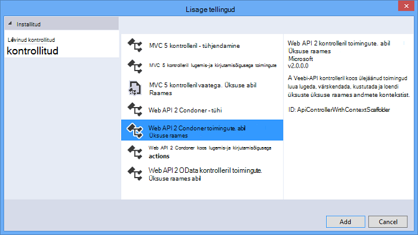
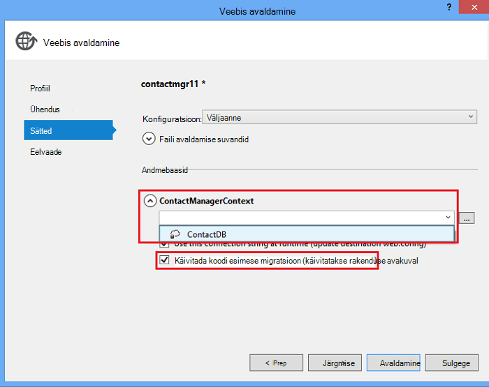

<properties 
    pageTitle="ASP.net-i veebi-API ja SQL-andmebaasi kasutamine Azure'i rakendust Service ülejäänud teenuse loomine" 
    description="Õppeteema, mis õpetab juurutamise rakendus, mis kasutab ASP.net-i Web API Azure web app Visual Studio abil." 
    services="app-service\web" 
    documentationCenter=".net" 
    authors="Rick-Anderson" 
    writer="Rick-Anderson" 
    manager="wpickett" 
    editor=""/>

<tags 
    ms.service="app-service-web" 
    ms.workload="web" 
    ms.tgt_pltfrm="na" 
    ms.devlang="dotnet" 
    ms.topic="article" 
    ms.date="02/29/2016" 
    ms.author="riande"/>

# ASP.net-i veebi-API ja SQL-andmebaasi kasutamine Azure'i rakendust Service ülejäänud teenuse loomine

Selle õpetuse kuvatakse juurutamise ASP.net-i web app [Azure'i rakendust Service](http://go.microsoft.com/fwlink/?LinkId=529714) Visual Studio 2013 või Visual Studio 2013 ühenduse Edition veebis avaldamine viisardi abil. 

Saate avada Azure'i konto tasuta ja kui teil pole veel Visual Studio 2013 SDK installib automaatselt Visual Studio 2013 Web Express. Nii saate alustada arendamise Azure jaoks täiesti tasuta.

Selle õpetuse eeldab, et teil on eelneva kogemus Azure'i abil. Lõpuleviimise selles õpetuses, siis on teil lihtne veebirakenduse üles ja töötab pilveteenuses.
 
Saate teada:

* Kuidas lubada Azure arengu arvuti, installides Azure'i SDK.
* Kuidas Visual Studio ASP.net-i MVC 5 projekti loomine ja avaldamine Azure rakendus.
* Kuidas kasutada ASP.net-i veebi-API lubamiseks rahulik API kõned.
* Kuidas kasutada andmete talletamiseks Azure SQL-andmebaasi.
* Kuidas avaldada Azure rakenduse värskendused.

Saate koostada lihtsaid kontaktiloendi veebirakendus, mis põhineb ASP.net-i MVC 5 ja kasutab ADO.net-i üksuse raames Accessi andmebaasi. Järgmisel joonisel on täidetud:

![kuvatõmmis – veebisait][intro001]

<!-- the next line produces the "Set up the development environment" section as see at http://azure.microsoft.com/documentation/articles/web-sites-dotnet-get-started/ -->
[AZURE.INCLUDE [create-account-and-websites-note](../../includes/create-account-and-websites-note.md)]

### Projekti loomine

1. Visual Studio 2013 käivitada.
1. Klõpsake menüü **fail** käsku **Uus projekt**.
3. Dialoogiboksis **Uus projekt** laiendamine **Visual C#** ja valige **Web** ja seejärel valige **ASP.net-i veebirakenduse**. **ContactManager** rakenduse nimi ja klõpsake nuppu **OK**.

    

1. Dialoogiboksis **Uue ASP.net-i projekti** valige mall **MVC** , märkige ruut **Veebi-API** ja klõpsake **Muuda autentimist**.

1. Dialoogiboksi **Muuda autentimist** klõpsake **Ei autentimine**ning seejärel klõpsake nuppu **OK**.

    

    Valimi rakenduse loomisel ei pea funktsioone, mis nõuavad logida. Kuidas rakendada autentimise ja luba funktsioonide kohta leiate jaotisest [Järgmised toimingud](#nextsteps) õppeteema lõpus. 

1. Dialoogiboksis **Uue ASP.net-i projekti** veenduge, et **pilveteenuses Host** on märgitud, ja klõpsake nuppu **OK**.

Kui te pole eelnevalt Azure, palutakse teil sisse logida.

1. Konfiguratsiooniviisardi soovitab põhjal *ContactManager* kordumatu nimi (vt allpool olevat pilti). Valige ala lähedal. Saate [azurespeed.com](http://www.azurespeed.com/ "AzureSpeed.com") otsimiseks alumise latentsus data Centeri kaudu. 
2. Kui te pole loonud enne andmebaasiserveri, valige **Loo uus server**, sisestage andmebaasi kasutajanimi ja parool.

    

Kui teil on andmebaasiserveri, mille abil saate luua uue andmebaasi. Andmebaasi serverid on väärtuslik vahend ning soovite üldiselt mitut andmebaasi loomine sama serveri testimine ja kui loomine andmebaasiserveriga andmebaasi kohta. Veenduge, et teie veebisait ja andmebaas on sama piirkonna.

### Määrake lehe päis ja jalus

1. **Solution Exploreris**, laiendage kausta *Views\Shared* ja *_Layout.cshtml* faili avada.

    ![_Layout.cshtml Solution Exploreris][newapp004]

1. Asendage *Views\Shared_Layout.cshtml* faili sisu järgmine kood:

        <!DOCTYPE html>
        <html lang="en">
        <head>
            <meta charset="utf-8" />
            <title>@ViewBag.Title - Contact Manager</title>
            <link href="~/favicon.ico" rel="shortcut icon" type="image/x-icon" />
            <meta name="viewport" content="width=device-width" />
            @Styles.Render("~/Content/css")
            @Scripts.Render("~/bundles/modernizr")
        </head>
        <body>
            <header>
                

                    

                        
@Html.ActionLink("Contact Manager", "Index", "Home")

                    

                

            </header>
            

                @RenderSection("featured", required: false)
                <section class="content-wrapper main-content clear-fix">
                    @RenderBody()
                </section>
            

            <footer>
                

                    

                        
&copy; @DateTime.Now.Year - Contact Manager

                    

                

            </footer>
            @Scripts.Render("~/bundles/jquery")
            @RenderSection("scripts", required: false)
        </body>
        </html>
            
Märgistuse kohal muudab rakenduse nime "Minu ASP.net-i App" "Ärikontaktide halduri" ja see eemaldab ** **Avaleht**, **kohta** ja**linke.

### Käivitage rakendus kohalikult

1. Vajutage klahvikombinatsiooni CTRL + F5 rakenduse käivitamiseks.
Rakenduse avalehele kuvatakse vaikimisi brauser.
    

See on kõik, mida peate tegema nüüd juurutamist Azure rakenduse loomiseks. Hiljem saate lisada andmebaasi funktsioone.

## Azure'i rakenduse juurutamine

1. Visual Studios, paremklõpsake **Solution** Exploreris projekt ja valige kontekstimenüüst **Avalda** .

    ![Projekti kontekstimenüüs avaldamine][PublishVSSolution]

    Avatakse viisard **Avaldamine veebis** .

12. Klõpsake nuppu **Avalda**.

Visual Studio hakkab protsessi failide kopeerimine Azure serveriga. **Väljundi** aknas näitab, milliseid toiminguid juurutamise võeti ja aruanded eduka juurutamise lõppu.

14. Vaikebrauseriks avab automaatselt juurutatud saidi URL.

    Olete loonud rakendus töötab nüüd pilveteenuses.
    
    ![Tehke loendis kodulehele Azure'i töötab?][rxz2]

## Andmebaasi lisamine rakendusse

Järgmiseks tuleb värskendada MVC rakenduse võimalus kuvada ja värskendada kontaktid ja salvestab andmed andmebaasi lisada. Rakendus kasutab üksuse raames andmebaasi loomine ja lugemine ja andmebaasi andmete värskendamine.

### Andmete mudeli tunnid kontaktide lisamine

Kõigepealt luua lihtsa andmemudeli koodi.

1. **Lahenduste Explorer**, paremklõpsake kausta mudelid, nuppu **Lisa**ja seejärel **ainekursuse**.

    ![Lisada klassi mudelite kaust kontekstimenüü][adddb001]

2. Dialoogiboksis **Lisa uus üksus** uue ainekursuse faili *Contact.cs*nimi ja seejärel klõpsake nuppu **Lisa**.

    ![Dialoogiboks uue üksuse lisamine][adddb002]

3. Järgmine kood Contacts.cs faili sisu asendada.

        using System.Globalization;
        namespace ContactManager.Models
        {
            public class Contact
            {
                public int ContactId { get; set; }
                public string Name { get; set; }
                public string Address { get; set; }
                public string City { get; set; }
                public string State { get; set; }
                public string Zip { get; set; }
                public string Email { get; set; }
                public string Twitter { get; set; }
                public string Self
                {
                    get { return string.Format(CultureInfo.CurrentCulture,
                         "api/contacts/{0}", this.ContactId); }
                    set { }
                }
            }
        }

**Pöörduge** klassi määratleb salvestate iga kontakti pluss primaarvõtme ContactID, mis on vajalik andmebaasi andmeid. Saate lisateavet andmemudelite [Järgmised toimingud](#nextsteps) jaotises õppeteema lõpus.

### Luua veebilehti, mis rakenduse kasutajad saaksid selle kontaktidega töötamine

ASP.net-i MVC tellingute funktsiooni automaatselt genereerida koodi, mis sooritavad loomine, lugemine, värskendamine ja kustutamine (CRUD) toimingud.

## Mõne selle domeenikontrolleri ja nende andmete vaate lisamine

1. Laiendage **Solution Exploreris**kontrollerid kausta.

3. Koostada projekt **(Ctrl + Shift + B)**. (Tuleb ehitada projekt enne kasutamist tellingute süsteem.) 

4. Paremklõpsake kausta kontrollerid ja klõpsake nuppu **Lisa**ja klõpsake **selle domeenikontrolleri**.

    ![Lisage selle domeenikontrolleri kontrollerid kaust kontekstimenüü][addcode001]

1. Dialoogiboksis **Lisa tellingud** valige **MVC kontrolleril abil üksuse raames vaatega** ja klõpsake nuppu **Lisa**.

 

6. Saate seada **HomeController**domeenikontrolleri nimi. Valige **kontakti** mudeli tunni. Klõpsake nuppu **Uus andmete konteksti** ja nõustuge vaikevalikuga "ContactManager.Models.ContactManagerContext" **uue andmetüübi kontekstis**. Klõpsake nuppu **Lisa**.

    Dialoogiboks, mis palub teil: "faili nimi HomeController juba suletakse. Kas soovite asendada? ". Klõpsake nuppu **Jah**. Meil on ülekirjutamise soovitud Avaleht kontrolleril, mis on loodud uue projekti. Kasutame uue Avaleht kontrolleril meie kontaktiloendisse.

    Visual Studio loob kontrolleril meetodite ja vaadete CRUD andmebaasi toimingute jaoks **kontakti** objektid.

## Luba migratsioon, luua andmebaasi, näidisandmed ja andmete initializer lisamine ##

Järgmise ülesande on selleks, et luua andmebaasi põhjal loodud andmemudel [Koodi esimese migratsioon](http://curah.microsoft.com/55220) funktsiooni lubamiseks.

1. Valige menüü **Tööriistad** **Teegi paketi haldur** ja seejärel **Package Manager konsooli**.

    ![Package Manager konsooli menüüs Tööriistad][addcode008]

2. **Paketi Manager konsooli** aknas, sisestage järgmine käsk:

        enable-migrations 
  
    Käsk **Luba-migratsioon** loob *migratsioon* kausta ja see paneb selles kaustas *Configuration.cs* faili, mida saate redigeerida konfigureerida migratsioon. 

2. **Paketi Manager konsooli** aknas, sisestage järgmine käsk:

        add-migration Initial

    Käsk **Lisa migreerimise algne** genereeritud klassi nimega ** &lt;date_stamp&gt;algse** , mis loob andmebaasi. Esimese parameetrina ( *algse* ) on suvaline ja faili nimi loomiseks kasutatud. Saate vaadata uue klassi faile **Solution**Exploreris.

    **Algne** klassi **üles** meetod loob tabeli kontaktid ja **alla** meetod (kui soovite naasta eelmisele olek) langeb see.

3. Avage fail *Migrations\Configuration.cs* . 

4. Lisage järgmised nimeruumid. 

         using ContactManager.Models;

5. Asendage *seemne* meetod järgmine kood:
        
        protected override void Seed(ContactManager.Models.ContactManagerContext context)
        {
            context.Contacts.AddOrUpdate(p => p.Name,
               new Contact
               {
                   Name = "Debra Garcia",
                   Address = "1234 Main St",
                   City = "Redmond",
                   State = "WA",
                   Zip = "10999",
                   Email = "debra@example.com",
                   Twitter = "debra_example"
               },
                new Contact
                {
                    Name = "Thorsten Weinrich",
                    Address = "5678 1st Ave W",
                    City = "Redmond",
                    State = "WA",
                    Zip = "10999",
                    Email = "thorsten@example.com",
                    Twitter = "thorsten_example"
                },
                new Contact
                {
                    Name = "Yuhong Li",
                    Address = "9012 State st",
                    City = "Redmond",
                    State = "WA",
                    Zip = "10999",
                    Email = "yuhong@example.com",
                    Twitter = "yuhong_example"
                },
                new Contact
                {
                    Name = "Jon Orton",
                    Address = "3456 Maple St",
                    City = "Redmond",
                    State = "WA",
                    Zip = "10999",
                    Email = "jon@example.com",
                    Twitter = "jon_example"
                },
                new Contact
                {
                    Name = "Diliana Alexieva-Bosseva",
                    Address = "7890 2nd Ave E",
                    City = "Redmond",
                    State = "WA",
                    Zip = "10999",
                    Email = "diliana@example.com",
                    Twitter = "diliana_example"
                }
                );
        }

    Järgmine kood ülaltoodud lähtestada andmebaas koos kontaktteabega. Külv andmebaasi kohta leiate lisateavet teemast [DBs silumine üksus Framework (EF)](http://blogs.msdn.com/b/rickandy/archive/2013/02/12/seeding-and-debugging-entity-framework-ef-dbs.aspx).

1. Sisestage **Paketi Manager konsooli** käsk:

        update-database

    ![Paketi halduri konsooli käsud][addcode009]

    **Update-andmebaasi** töötab esimest migreerimise, mis loob andmebaasi. Vaikimisi andmebaas on loodud SQL Server Express LocalDB andmebaasi.

1. Vajutage klahvikombinatsiooni CTRL + F5 rakenduse käivitamiseks. 

Rakenduse seemne andmed kuvatakse ja Redigeeri, üksikasjad ja Kustuta lingid.

![MVC andmete kuvamine][rxz3]

## Vaate redigeerimine

1. Avage fail *Views\Home\Index.cshtml* . Järgmise sammuna me asendab loodud märgistuse koodi, mis kasutab [jQuery](http://jquery.com/) ja [Knockout.js](http://knockoutjs.com/). See uus kood toob kontaktiloendisse web API ja JSON abil ning seejärel seob kontaktandmete kasutamine knockout.js UI. Lisateavet leiate jaotisest [Järgmised toimingud](#nextsteps) õppeteema lõpus. 

2. Asendage faili sisu järgmine kood.

        @model IEnumerable<ContactManager.Models.Contact>
        @{
            ViewBag.Title = "Home";
        }
        @section Scripts {
            @Scripts.Render("~/bundles/knockout")
            
        }
        <ul id="contacts" data-bind="foreach: contacts">
            <li class="ui-widget-content ui-corner-all">
                <h1 data-bind="text: Name" class="ui-widget-header"></h1>
                

                

                    ,
                    
                    
                

                

                
Email?

                

                
Twitter?

                
<a data-bind="attr: { href: Self }, click: $root.removeContact" class="removeContact ui-state-default ui-corner-all">Remove</a>

            </li>
        </ul>
        <form id="addContact" data-bind="submit: addContact">
            <fieldset>
                <legend>Add New Contact</legend>
                <ol>
                    <li>
                        <label for="Name">Name</label>
                        <input type="text" name="Name" />
                    </li>
                    <li>
                        <label for="Address">Address</label>
                        <input type="text" name="Address" >
                    </li>
                    <li>
                        <label for="City">City</label>
                        <input type="text" name="City" />
                    </li>
                    <li>
                        <label for="State">State</label>
                        <input type="text" name="State" />
                    </li>
                    <li>
                        <label for="Zip">Zip</label>
                        <input type="text" name="Zip" />
                    </li>
                    <li>
                        <label for="Email">E-mail</label>
                        <input type="text" name="Email" />
                    </li>
                    <li>
                        <label for="Twitter">Twitter</label>
                        <input type="text" name="Twitter" />
                    </li>
                </ol>
                <input type="submit" value="Add" />
            </fieldset>
        </form>

3. Paremklõpsake kausta sisu ja klõpsake nuppu **Lisa**ja seejärel nuppu **Uus üksus …**.

    ![Lisage laadilehe sisu kausta kontekstimenüü][addcode005]

4. Dialoogiboksis **Lisa uus üksus** sisestage paremas ülaservas otsinguväljale **laad** ja valige **Laadileht**.
    ![Dialoogiboks uue üksuse lisamine][rxStyle]

5. *Contacts.css* faili nimi ja klõpsake nuppu **Lisa**. Asendage faili sisu järgmine kood.
    
        .column {
            float: left;
            width: 50%;
            padding: 0;
            margin: 5px 0;
        }
        form ol {
            list-style-type: none;
            padding: 0;
            margin: 0;
        }
        form li {
            padding: 1px;
            margin: 3px;
        }
        form input[type="text"] {
            width: 100%;
        }
        #addContact {
            width: 300px;
            float: left;
            width:30%;
        }
        #contacts {
            list-style-type: none;
            margin: 0;
            padding: 0;
            float:left;
            width: 70%;
        }
        #contacts li {
            margin: 3px 3px 3px 0;
            padding: 1px;
            float: left;
            width: 300px;
            text-align: center;
            background-image: none;
            background-color: #F5F5F5;
        }
        #contacts li h1
        {
            padding: 0;
            margin: 0;
            background-image: none;
            background-color: Orange;
            color: White;
            font-family: Trebuchet MS, Tahoma, Verdana, Arial, sans-serif;
        }
        .removeContact, .viewImage
        {
            padding: 3px;
            text-decoration: none;
        }

    Kasutame selle laadilehe paigutuse, värvide ja laade kasutatakse rakenduses Ärikontaktide haldur.

6. Avage fail *App_Start\BundleConfig.cs* .

7. Lisage järgmine kood registreerida [Knockout](http://knockoutjs.com/index.html "KO") lisandmoodul.

        bundles.Add(new ScriptBundle("~/bundles/knockout").Include(
                    "~/Scripts/knockout-{version}.js"));
    See näide knockout abil lihtsustada dünaamiline Kuva Mallid JavaScripti koodi.

8. Muutke sisu/CSS-i kirje *contacts.css* laadilehe registreerimiseks. Järgmine rida muutmiseks tehke järgmist.

                 bundles.Add(new StyleBundle("~/Content/css").Include(
                   "~/Content/bootstrap.css",
                   "~/Content/site.css"));
Kui soovite:

        bundles.Add(new StyleBundle("~/Content/css").Include(
                   "~/Content/bootstrap.css",
                   "~/Content/contacts.css",
                   "~/Content/site.css"));

1. Konsooli paketi Manager, käivitage järgmine käsk Knockout installimiseks.

        Install-Package knockoutjs

## Kontrolleril, Web API rahulik kasutajaliidese lisamine

1. **Solution Exploreris**, paremklõpsake kontrollerid ja klõpsake nuppu **Lisa** ja seejärel **selle domeenikontrolleri...** 

1. Dialoogiboksis **Lisa tellingud** Sisestage **Web API 2 kontrolleril toimingute, kasutades üksuse raames** ja seejärel klõpsake nuppu **Lisa**.

    

4. Sisestage dialoogiboksis **Lisamine kontrolleril** domeenikontrolleri nime "ContactsController". Valige "Kontakt (ContactManager.Models)" **mudeli klassi**.  Säilita **andmete kontekstis klassi**vaikeväärtus. 

6. Klõpsake nuppu **Lisa**.

### Käivitage rakendus kohalikult

1. Vajutage klahvikombinatsiooni CTRL + F5 rakenduse käivitamiseks.

    ![Index leht][intro001]

2. Sisestage kontakt ja klõpsake nuppu **Lisa**. Rakendus annab avalehele ja kuvab lisatud kontakti.

    ![Index leht, millel on ülesande loendiüksusi][addwebapi004]

3. Lisage brauseris URL-i **/api/contacts** .

    Tulemuseks URL sarnaneb http://localhost:1234/api/kontaktid. Rahulik web API lisatud tagastab salvestatud kontaktid. Firefoxis ja Chrome'is kuvatakse andmed XML-vormingus.

    ![Index leht, millel on ülesande loendiüksusi][rxFFchrome]
    

    ST palub teil avada või salvestada kontaktid.

    ![Veebi-API salvestamine dialoogiboks][addwebapi006]
    
    
    Tagastatud kontaktid saate Notepadis või brauseris avada.
    
    Selle väljundi saab tarbitud mõni muu rakendus, nt mobiilsideseadmete veebilehe või rakenduse.

    ![Veebi-API salvestamine dialoogiboks][addwebapi007]

    **Turbehoiatus**: sel hetkel on rakenduse ebaturvalise ja CSRF rünnak. Allpool olevat õpetuse me eemaldatakse see probleem. Lisateabe saamiseks vaadake [vältimine saitidevaheline taotlemine võltsimist (CSRF) ründab][prevent-csrf-attacks].
## XSRF kaitse lisamine

Saitidevaheline taotluse võltsimist (nimetatakse ka XSRF või CSRF) on veebis majutatud rakendused, millega ründetarkvara võivad mõjutada kliendi brauser ja brauseri usaldusväärne veebisaidi omavaheliste vastu. Nende eest on võimalik, kuna veebibrauserid saadab autentimine märkide automaatselt alati taotlusega veebisaidile. Kanoonilise näide on autentimine küpsise, nt ASP. NET vormide autentimist Piletite. Siiski saate nende eest, suunata veebisaidid, mis kasutavad püsivate autentimise kord (nagu Windowsi autentimine, Basic, jne).

XSRF rünnak erineb õngevõtmiskatset. Andmepüügi eest vaja suhtluse ohvriks. Õngevõtmiskatset, pahatahtlik veebisait on jäljendada target veebisaidi ja ohvriks on petta ründaja tundliku teabe. XSRF rünnaku on sageli ei ole vaja ohvriks. Pigem tugineb ründaja brauseri saatmist automaatselt kõik oluline küpsised siht-veebisaidile.

Lisateavet leiate teemast [Avatud Web rakenduste Turve projekt](https://www.owasp.org/index.php/Main_Page) (OWASP) [XSRF](https://www.owasp.org/index.php/Cross-Site_Request_Forgery_(CSRF)).

1. **Lahenduste Explorer**, paremklõpsake **ContactManager** projekti ja klõpsake nuppu **Lisa** ja seejärel klõpsake **klassi**.

2. *ValidateHttpAntiForgeryTokenAttribute.cs* faili nimi ja lisage järgmine kood:

        using System;
        using System.Collections.Generic;
        using System.Linq;
        using System.Net;
        using System.Net.Http;
        using System.Web.Helpers;
        using System.Web.Http.Controllers;
        using System.Web.Http.Filters;
        using System.Web.Mvc;
        namespace ContactManager.Filters
        {
            public class ValidateHttpAntiForgeryTokenAttribute : AuthorizationFilterAttribute
            {
                public override void OnAuthorization(HttpActionContext actionContext)
                {
                    HttpRequestMessage request = actionContext.ControllerContext.Request;
                    try
                    {
                        if (IsAjaxRequest(request))
                        {
                            ValidateRequestHeader(request);
                        }
                        else
                        {
                            AntiForgery.Validate();
                        }
                    }
                    catch (HttpAntiForgeryException e)
                    {
                        actionContext.Response = request.CreateErrorResponse(HttpStatusCode.Forbidden, e);
                    }
                }
                private bool IsAjaxRequest(HttpRequestMessage request)
                {
                    IEnumerable<string> xRequestedWithHeaders;
                    if (request.Headers.TryGetValues("X-Requested-With", out xRequestedWithHeaders))
                    {
                        string headerValue = xRequestedWithHeaders.FirstOrDefault();
                        if (!String.IsNullOrEmpty(headerValue))
                        {
                            return String.Equals(headerValue, "XMLHttpRequest", StringComparison.OrdinalIgnoreCase);
                        }
                    }
                    return false;
                }
                private void ValidateRequestHeader(HttpRequestMessage request)
                {
                    string cookieToken = String.Empty;
                    string formToken = String.Empty;
                    IEnumerable<string> tokenHeaders;
                    if (request.Headers.TryGetValues("RequestVerificationToken", out tokenHeaders))
                    {
                        string tokenValue = tokenHeaders.FirstOrDefault();
                        if (!String.IsNullOrEmpty(tokenValue))
                        {
                            string[] tokens = tokenValue.Split(':');
                            if (tokens.Length == 2)
                            {
                                cookieToken = tokens[0].Trim();
                                formToken = tokens[1].Trim();
                            }
                        }
                    }
                    AntiForgery.Validate(cookieToken, formToken);
                }
            }
        }

1. Lause *abil* lisada lepingute kontrolleril nii, et teil on juurdepääs **[ValidateHttpAntiForgeryToken]** atribuut.

        using ContactManager.Filters;

1. **[ValidateHttpAntiForgeryToken]** atribuut lisada postitusse meetodid **ContactsController** XSRF ohtude kaitsmiseks. Saate lisada see toiming kasutatavate "PutContact", "PostContact" ja **DeleteContact** .

        [ValidateHttpAntiForgeryToken]
            public IHttpActionResult PutContact(int id, Contact contact)
            {

1. Värskendage *Views\Home\Index.cshtml* faili lisada koodi saada XSRF sõned *skriptide* osas.

         @section Scripts {
            @Scripts.Render("~/bundles/knockout")
            
         }

## Azure'i ja SQL-andmebaasi rakenduse värskendus avaldamine

Avaldada rakendus, mida Korrake seda toimingut järgisite varasemas versioonis.

1. **Lahenduste Explorer**, paremklõpsake projekti ja valige **Avalda**.

    ![Avaldamine][rxP]

5. Klõpsake vahekaarti **sätted** .
    

1. Klõpsake **ContactsManagerContext(ContactsManagerContext)**, muuta *Remote ühendusstringi* kontakti andmebaasi ühendusstringi ikooni **v** . Klõpsake **ContactDB**.

    

7. Märkige ruut **Käivitada koodi esimese migratsioon (käivitatakse rakenduse avakuval)**.

1. Klõpsake nuppu **edasi** ja seejärel nuppu **Eelvaade**. Visual Studio kuvatakse failid, mis on lisatud või uuendatud.

8. Klõpsake nuppu **Avalda**.
Pärast juurutamise on lõpule jõudnud, avaneb brauseri avalehele rakenduse.

    ![Registri lehest, kus pole kontaktid][intro001]

    Visual Studio avaldamine protsessi automaatselt konfigureeritud ühendusstringi *juurutatud fail osutama SQL-andmebaasiga* . See on konfigureeritud ka koodi esimese migratsioon automaatselt uuendada andmebaasi uusim versioon rakendus kasutab andmebaasi juurutamise pärast esimest korda.

    Selle konfiguratsiooni tulemusena koodi esimene andmebaasi abil loodud koodi **algse** klassi varem loodud. See ei see rakendus proovis andmebaasile juurde pääseda juurutamise pärast esimest korda.

9. Sisestage kontakti samamoodi kui käivitasite rakenduse kohalik, kinnitamaks, et andmebaasi juurutamise õnnestus.

Kui näete, et sisestate üksuse salvestatakse ja kuvatakse lehel Ärikontaktide haldur, teate salvestatud andmebaasi.

![Esilehele kontaktidega][addwebapi004]

Rakendus töötab nüüd pilves, SQL-andmebaasi abil saate talletada oma andmeid. Kui olete lõpetanud, testimisel Azure, kustutage see. Rakendus on avalikud ja pole juurdepääsu piiramiseks süsteem.

>[AZURE.NOTE] Kui soovite alustada Azure'i rakendust Service enne Azure'i konto kasutajaks, minge [Proovige rakenduse teenus](http://go.microsoft.com/fwlink/?LinkId=523751), kus saate kohe luua lühiajaline starter web app rakenduse teenus. Nõutav; krediitkaardid kohustusi.

## Järgmised sammud

Päris rakenduse nõuab autentimist ja autoriseerimine ja liikmelisuse andmebaasi kasutaks selleks. [Secure ASP.net-i MVC rakenduse OAuthi, liikmete ja SQL-andmebaasi juurutamine](web-sites-dotnet-deploy-aspnet-mvc-app-membership-oauth-sql-database.md) õpetuse põhineb selles Õpetuses ja kuvab juurutamise veebirakenduse liikmelisuse andmebaasi.

Teine viis andmete talletamiseks Azure rakendus on kasutada Azure salvestusruumi,-relatsiooniliste andmete talletusruumi plekid ja tabelid, mis näevad. Järgmised lingid pakuvad lisateavet veebi-API, ASP.net-i MVC ja Azure aken.
 

* [Üksuse raames MVC kasutamise alustamine][EFCodeFirstMVCTutorial]
* [ASP.net-i MVC 5 Sissejuhatus](http://www.asp.net/mvc/tutorials/mvc-5/introduction/getting-started)
* [Oma esimese ASP.net-i veebi-API](http://www.asp.net/web-api/overview/getting-started-with-aspnet-web-api/tutorial-your-first-web-api)
* [WAWS silumine](web-sites-dotnet-troubleshoot-visual-studio.md)

Selle õpetuse- ja valimi rakendus on kirjutatud [Rick Anderson](http://blogs.msdn.com/b/rickandy/) (Twitteri [@RickAndMSFT](https://twitter.com/RickAndMSFT)) abiga Tom Dykstra Barry Dorrans (Twitteri [@blowdart](https://twitter.com/blowdart)). 

Palun täiustatud lahku tagasisidet, mis teile meeldinud või soovite vaadata, mitte ainult enda õpetuse kohta, vaid ka toodete kohta, mis seda näitab. Teie tagasiside aitab tähtsuse täiustused. Meil on eriti huvitatud teada saada, kui palju on veel automatiseerimise protsessi konfigureerimist ja juurutamine liikmelisuse andmebaasi huvi. 

## Mis on muutunud
* Muuda juhend veebisaitide rakenduse teenusega leiate: [Azure'i rakendust Service ja selle mõju olemasoleva Azure'i teenused](http://go.microsoft.com/fwlink/?LinkId=529714)

<!-- bookmarks -->
[Add an OAuth Provider]: #addOauth
[Add Roles to the Membership Database]:#mbrDB
[Create a Data Deployment Script]:#ppd
[Update the Membership Database]:#ppd2
[setupdbenv]: #bkmk_setupdevenv
[setupwindowsazureenv]: #bkmk_setupwindowsazure
[createapplication]: #bkmk_createmvc4app
[deployapp1]: #bkmk_deploytowindowsazure1
[adddb]: #bkmk_addadatabase
[addcontroller]: #bkmk_addcontroller
[addwebapi]: #bkmk_addwebapi
[deploy2]: #bkmk_deploydatabaseupdate

<!-- links -->
[EFCodeFirstMVCTutorial]: http://www.asp.net/mvc/tutorials/getting-started-with-ef-using-mvc/creating-an-entity-framework-data-model-for-an-asp-net-mvc-application
[dbcontext-link]: http://msdn.microsoft.com/library/system.data.entity.dbcontext(v=VS.103).aspx

<!-- images-->
[rxE]: ./media/web-sites-dotnet-rest-service-aspnet-api-sql-database/rxE.png
[rxP]: ./media/web-sites-dotnet-rest-service-aspnet-api-sql-database/rxP.png
[rx22]: ./media/web-sites-dotnet-rest-service-aspnet-api-sql-database/
[rxb2]: ./media/web-sites-dotnet-rest-service-aspnet-api-sql-database/rxb2.png
[rxz]: ./media/web-sites-dotnet-rest-service-aspnet-api-sql-database/rxz.png
[rxzz]: ./media/web-sites-dotnet-rest-service-aspnet-api-sql-database/rxzz.png
[rxz2]: ./media/web-sites-dotnet-rest-service-aspnet-api-sql-database/rxz2.png
[rxz3]: ./media/web-sites-dotnet-rest-service-aspnet-api-sql-database/rxz3.png
[rxStyle]: ./media/web-sites-dotnet-rest-service-aspnet-api-sql-database/rxStyle.png
[rxz4]: ./media/web-sites-dotnet-rest-service-aspnet-api-sql-database/rxz4.png
[rxz44]: ./media/web-sites-dotnet-rest-service-aspnet-api-sql-database/rxz44.png
[rxNewCtx]: ./media/web-sites-dotnet-rest-service-aspnet-api-sql-database/rxNewCtx.png
[rxPrevDB]: ./media/web-sites-dotnet-rest-service-aspnet-api-sql-database/rxPrevDB.png
[rxOverwrite]: ./media/web-sites-dotnet-rest-service-aspnet-api-sql-database/rxOverwrite.png
[rxPWS]: ./media/web-sites-dotnet-rest-service-aspnet-api-sql-database/rxPWS.png
[rxNewCtx]: ./media/web-sites-dotnet-rest-service-aspnet-api-sql-database/rxNewCtx.png
[rxAddApiController]: ./media/web-sites-dotnet-rest-service-aspnet-api-sql-database/rxAddApiController.png
[rxFFchrome]: ./media/web-sites-dotnet-rest-service-aspnet-api-sql-database/rxFFchrome.png
[intro001]: ./media/web-sites-dotnet-rest-service-aspnet-api-sql-database/dntutmobil-intro-finished-web-app.png
[rxCreateWSwithDB]: ./media/web-sites-dotnet-rest-service-aspnet-api-sql-database/rxCreateWSwithDB.png
[setup007]: ./media/web-sites-dotnet-rest-service-aspnet-api-sql-database/dntutmobile-setup-azure-site-004.png
[setup009]: ../Media/dntutmobile-setup-azure-site-006.png
[newapp002]: ./media/web-sites-dotnet-rest-service-aspnet-api-sql-database/dntutmobile-createapp-002.png
[newapp004]: ./media/web-sites-dotnet-rest-service-aspnet-api-sql-database/dntutmobile-createapp-004.png
[firsdeploy007]: ./media/web-sites-dotnet-rest-service-aspnet-api-sql-database/dntutmobile-deploy1-publish-005.png
[firsdeploy009]: ./media/web-sites-dotnet-rest-service-aspnet-api-sql-database/dntutmobile-deploy1-publish-007.png
[adddb001]: ./media/web-sites-dotnet-rest-service-aspnet-api-sql-database/dntutmobile-adddatabase-001.png
[adddb002]: ./media/web-sites-dotnet-rest-service-aspnet-api-sql-database/dntutmobile-adddatabase-002.png
[addcode001]: ./media/web-sites-dotnet-rest-service-aspnet-api-sql-database/dntutmobile-controller-add-context-menu.png
[addcode002]: ./media/web-sites-dotnet-rest-service-aspnet-api-sql-database/dntutmobile-controller-add-controller-dialog.png
[addcode004]: ./media/web-sites-dotnet-rest-service-aspnet-api-sql-database/dntutmobile-controller-modify-index-context.png
[addcode005]: ./media/web-sites-dotnet-rest-service-aspnet-api-sql-database/dntutmobile-controller-add-contents-context-menu.png
[addcode007]: ./media/web-sites-dotnet-rest-service-aspnet-api-sql-database/dntutmobile-controller-modify-bundleconfig-context.png
[addcode008]: ./media/web-sites-dotnet-rest-service-aspnet-api-sql-database/dntutmobile-migrations-package-manager-menu.png
[addcode009]: ./media/web-sites-dotnet-rest-service-aspnet-api-sql-database/dntutmobile-migrations-package-manager-console.png
[addwebapi004]: ./media/web-sites-dotnet-rest-service-aspnet-api-sql-database/dntutmobile-webapi-added-contact.png
[addwebapi006]: ./media/web-sites-dotnet-rest-service-aspnet-api-sql-database/dntutmobile-webapi-save-returned-contacts.png
[addwebapi007]: ./media/web-sites-dotnet-rest-service-aspnet-api-sql-database/dntutmobile-webapi-contacts-in-notepad.png
[Add XSRF Protection]: #xsrf
[WebPIAzureSdk20NetVS12]: ./media/web-sites-dotnet-rest-service-aspnet-api-sql-database/WebPIAzureSdk20NetVS12.png
[Add XSRF Protection]: #xsrf
[ImportPublishSettings]: ./media/web-sites-dotnet-rest-service-aspnet-api-sql-database/ImportPublishSettings.png
[ImportPublishProfile]: ./media/web-sites-dotnet-rest-service-aspnet-api-sql-database/ImportPublishProfile.png
[PublishVSSolution]: ./media/web-sites-dotnet-rest-service-aspnet-api-sql-database/PublishVSSolution.png
[ValidateConnection]: ./media/web-sites-dotnet-rest-service-aspnet-api-sql-database/ValidateConnection.png
[WebPIAzureSdk20NetVS12]: ./media/web-sites-dotnet-rest-service-aspnet-api-sql-database/WebPIAzureSdk20NetVS12.png
[prevent-csrf-attacks]: http://www.asp.net/web-api/overview/security/preventing-cross-site-request-forgery-(csrf)-attacks
 
