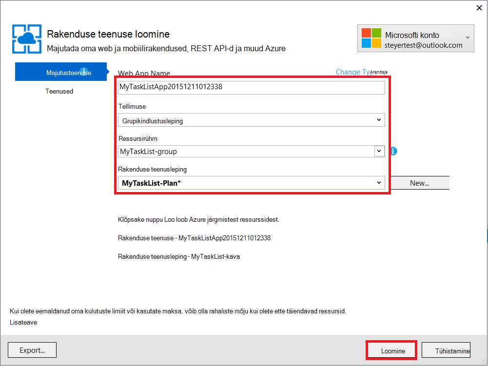
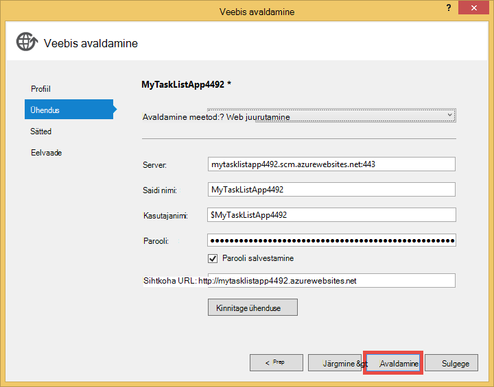

<properties 
    pageTitle="Luua veebirakenduse Azure, mis ühendab MongoDB töötavate virtuaalse masina" 
    description="Õppeteema, mis õpetab, kuidas kasutada Git Azure'i rakendust Service rakenduse ASP.net-i juurutamiseks ühendatud MongoDB kohta on Azure virtuaalse masina."
    tags="azure-portal" 
    services="app-service\web, virtual-machines" 
    documentationCenter=".net" 
    authors="cephalin" 
    manager="wpickett" 
    editor=""/>

<tags 
    ms.service="app-service-web" 
    ms.workload="web" 
    ms.tgt_pltfrm="na" 
    ms.devlang="dotnet" 
    ms.topic="article" 
    ms.date="02/29/2016" 
    ms.author="cephalin"/>

# Luua veebirakenduse Azure, mis ühendab MongoDB töötavate virtuaalse masina

Git saate juurutada Azure rakenduse teenuse veebirakenduste ASP.net-i rakenduse. Selles õpetuses saate koostada lihtsaid ees ASP.NET MVC tööülesannete loendi rakendus, mis ühendab MongoDB andmebaasi Azure virtuaalse masina töötab.  [MongoDB] [ MongoDB] on suure jõudlusega NoSQL andmebaasi, populaarsed avatud allikas. Pärast töötab ja testimine ASP.net-i rakenduste arendamise arvutisse, üles laadida rakenduse App teenuse Web Appsi kasutamise Git.

>[AZURE.NOTE] Kui soovite alustada Azure'i rakendust Service enne Azure'i konto kasutajaks, minge [Proovige rakenduse teenus](http://go.microsoft.com/fwlink/?LinkId=523751), kus saate kohe luua lühiajaline starter web app rakenduse teenus. Nõutav; krediitkaardid kohustusi.

## Tausta teadmisi ##

Selles õpetuses küll ei pea on kasulik teadmisi järgmist:

* C# MongoDB draiver. C# vastu MongoDB rakenduste arendamise kohta leiate lisateavet teemast MongoDB [CSharp keele keskmist][MongoC#LangCenter]. 
* Web rakenduse ASP .NET Frameworki. Kõik selle [veebisaidi ASP.net-i]kohta leiate teavet teemast[ASP.NET].
* ASP .NET MVC web rakenduse raames. Kõik selle [ASP.net-i MVC veebisaidi]kohta leiate teavet teemast[MVCWebSite].
* Azure'i. Saate alustada lugemine [Azure'i][WindowsAzure].

## Eeltingimused ##

- [Visual Studio Express 2013 Web]  [ VSEWeb] või [Visual Studio 2013] [VSUlt]
- [Azure'i SDK .net-i jaoks](http://go.microsoft.com/fwlink/p/?linkid=323510&clcid=0x409)
- Microsoft Azure'i aktiivne tellimus

[AZURE.INCLUDE [create-account-and-websites-note](../../includes/create-account-and-websites-note.md)]

 
## Luua virtuaalse masina ja installige MongoDB ##

Selle õpetuse eeldab, et olete loonud virtuaalse masina Azure. Kui olete loonud virtuaalse masina peate installima MongoDB virtual arvutisse:

* Luua Windowsi virtuaalse masina ja installida MongoDB, leiate teemast [Installida MongoDB kohta töötab Windows Server Azure'i][InstallMongoOnWindowsVM].

Pärast seda, kui olete loonud virtuaalse masina Azure ja installitud MongoDB, kindlasti MongoDB lõpp-punkti määratud DNS-i nimi virtuaalse masina ("testlinuxvm.cloudapp.net", näiteks) ja välise pordi meeles pidada.  Teil tuleb see teave hiljem õpetuse.

## Rakenduse loomine ##

Selles jaotises luua ASP.net-i rakenduse nimega "Minu tööülesannete loend" Visual Studio abil ja teha ka algse juurutamise Azure'i rakenduse teenuse veebirakenduste. Käivitate rakenduse kohalik, kuid see ühenduse Azure virtuaalne arvuti ja kasutada seal MongoDB eksemplari, mille lõite.

1. Visual Studio, klõpsake nuppu **Uus projekt**.

    ![Lehe uue projekti alustamine][StartPageNewProject]

1. **Uue projekti** aknas vasakul paanil valige **Visual C#**ja valige **Web**. Valige keskmisel paanil **ASP.net-i veebirakenduse**. Allosas "MyTaskListApp" projekti nime ja seejärel klõpsake nuppu **OK**.

    ![Uue projekti dialoogiboks][NewProjectMyTaskListApp]

1. Dialoogiboksis **Uue ASP.net-i projekti** valige **MVC**, ja seejärel klõpsake nuppu **OK**.

    ![Valige MVC Mall][VS2013SelectMVCTemplate]

1. Kui te pole veel sisse logitud rakendusse Microsoft Azure'i, palutakse teil sisse logida. Järgige viipasid Azure'i sisse logida.
2. Kui olete sisse logitud, saate alustada oma veebirakenduse rakendust Service konfigureerimine. Määrake **veebirakenduse nimi**, **rakenduse teenusleping**, **ressursirühm**ja **piirkond**ja seejärel klõpsake nuppu **Loo**.

    

1. Pärast projekti loomise lõpule jõudnud, oodake veebirakenduse Azure'i rakendust Service **Azure'i rakenduse tegevuse** aknas näidatud luua. Klõpsake **Selle veebirakenduse kohe MyTaskListApp avaldada**.

1. Klõpsake nuppu **Avalda**.

    

    Kui teie vaikimisi ASP.net-i rakendused on avaldatud Azure'i rakenduse teenuse veebirakenduste, käivitub see brauseris.

## Installige MongoDB C# draiver

MongoDB pakub kliendipoolne tugi C# rakenduste kaudu juht, mis on vaja kohaliku arengu arvutisse installida. C# draiver on saadaval Nugeti kaudu.

MongoDB C# draiveri installimiseks tehke järgmist.

1. **Lahenduste Explorer**, paremklõpsake **MyTaskListApp** projekti ja valige **NuGetPackages haldamine**.

    ![Nugeti pakettide haldamine][VS2013ManageNuGetPackages]

2. Klõpsake aknas **Nugeti pakettide haldamine** vasakpoolsel paanil **Online**. **Otsingu Online** paremal, tippige "mongodb.driver".  Klõpsake draiveri installimiseks **installida** .

    ![Otsige MongoDB C# draiver][SearchforMongoDBCSharpDriver]

3. Klõpsake nuppu **nõustun** aktsepteerimiseks 10gen, sh litsentsitingimused.

4. Klõpsake nuppu **Sule** , kui juhil on installitud.
    ![MongoDB C# draiver installitud][MongoDBCsharpDriverInstalled]

MongoDB C# draiver on installitud.  Viited **MongoDB.Bson**, **MongoDB.Driver**ja **MongoDB.Driver.Core** teekide on lisatud projekt.

![MongoDB C# draiver viited][MongoDBCSharpDriverReferences]

## Mudeli lisamine ##
**Lahenduste Explorer**, paremklõpsake kausta *mudelite* ja **Lisa** uus **klassi** ja pange sellele *TaskModel.cs*.  *TaskModel.cs*, asendage olemasolevat järgmine kood:

    using System;
    using System.Collections.Generic;
    using System.Linq;
    using System.Web;
    using MongoDB.Bson.Serialization.Attributes;
    using MongoDB.Bson.Serialization.IdGenerators;
    using MongoDB.Bson;
    
    namespace MyTaskListApp.Models
    {
        public class MyTask
        {
            [BsonId(IdGenerator = typeof(CombGuidGenerator))]
            public Guid Id { get; set; }
    
            [BsonElement("Name")]
            public string Name { get; set; }
    
            [BsonElement("Category")]
            public string Category { get; set; }
    
            [BsonElement("Date")]
            public DateTime Date { get; set; }
    
            [BsonElement("CreatedDate")]
            public DateTime CreatedDate { get; set; }
    
        }
    }

## Accessi andmete layer lisamine ##
Paremklõpsake **Solution Exploreris** *MyTaskListApp* projekti ja **Lisa** **Uus kaust** nimega *DAL*.  Paremklõpsake kausta *DAL* ja **Lisa** uus **klassi**. Klassi faili *Dal.cs*nimi.  *Dal.cs*, asendage olemasolevat järgmine kood:

    using System;
    using System.Collections.Generic;
    using System.Linq;
    using System.Web;
    using MyTaskListApp.Models;
    using MongoDB.Driver;
    using MongoDB.Bson;
    using System.Configuration;
    
    
    namespace MyTaskListApp
    {
        public class Dal : IDisposable
        {
            private MongoServer mongoServer = null;
            private bool disposed = false;
    
            // To do: update the connection string with the DNS name
            // or IP address of your server. 
            //For example, "mongodb://testlinux.cloudapp.net"
            private string connectionString = "mongodb://mongodbsrv20151211.cloudapp.net";
    
            // This sample uses a database named "Tasks" and a 
            //collection named "TasksList".  The database and collection 
            //will be automatically created if they don't already exist.
            private string dbName = "Tasks";
            private string collectionName = "TasksList";
    
            // Default constructor.        
            public Dal()
            {
            }
    
            // Gets all Task items from the MongoDB server.        
            public List<MyTask> GetAllTasks()
            {
                try
                {
                    var collection = GetTasksCollection();
                    return collection.Find(new BsonDocument()).ToList();
                }
                catch (MongoConnectionException)
                {
                    return new List<MyTask>();
                }
            }
    
            // Creates a Task and inserts it into the collection in MongoDB.
            public void CreateTask(MyTask task)
            {
                var collection = GetTasksCollectionForEdit();
                try
                {
                    collection.InsertOne(task);
                }
                catch (MongoCommandException ex)
                {
                    string msg = ex.Message;
                }
            }
    
            private IMongoCollection<MyTask> GetTasksCollection()
            {
                MongoClient client = new MongoClient(connectionString);
                var database = client.GetDatabase(dbName);
                var todoTaskCollection = database.GetCollection<MyTask>(collectionName);
                return todoTaskCollection;
            }
    
            private IMongoCollection<MyTask> GetTasksCollectionForEdit()
            {
                MongoClient client = new MongoClient(connectionString);
                var database = client.GetDatabase(dbName);
                var todoTaskCollection = database.GetCollection<MyTask>(collectionName);
                return todoTaskCollection;
            }
    
            # region IDisposable
    
            public void Dispose()
            {
                this.Dispose(true);
                GC.SuppressFinalize(this);
            }
    
            protected virtual void Dispose(bool disposing)
            {
                if (!this.disposed)
                {
                    if (disposing)
                    {
                        if (mongoServer != null)
                        {
                            this.mongoServer.Disconnect();
                        }
                    }
                }
    
                this.disposed = true;
            }
    
            # endregion
        }
    }

## Lisage soovitud domeenikontrolleri ##
Avage fail, *Controllers\HomeController.cs* **Solution** Exploreris ja asendage olemasolevat järgmist:

    using System;
    using System.Collections.Generic;
    using System.Linq;
    using System.Web;
    using System.Web.Mvc;
    using MyTaskListApp.Models;
    using System.Configuration;
    
    namespace MyTaskListApp.Controllers
    {
        public class HomeController : Controller, IDisposable
        {
            private Dal dal = new Dal();
            private bool disposed = false;
            //
            // GET: /MyTask/
    
            public ActionResult Index()
            {
                return View(dal.GetAllTasks());
            }
    
            //
            // GET: /MyTask/Create
    
            public ActionResult Create()
            {
                return View();
            }
    
            //
            // POST: /MyTask/Create
    
            [HttpPost]
            public ActionResult Create(MyTask task)
            {
                try
                {
                    dal.CreateTask(task);
                    return RedirectToAction("Index");
                }
                catch
                {
                    return View();
                }
            }
    
            public ActionResult About()
            {
                return View();
            }
    
            # region IDisposable
    
            new protected void Dispose()
            {
                this.Dispose(true);
                GC.SuppressFinalize(this);
            }
    
            new protected virtual void Dispose(bool disposing)
            {
                if (!this.disposed)
                {
                    if (disposing)
                    {
                        this.dal.Dispose();
                    }
                }
    
                this.disposed = true;
            }
    
            # endregion
    
        }
    }

## Laade häälestamine ##
Klõpsake lehe ülaservas tiitli muutmiseks avage soovitud *Views\Shared\\_Layout.cshtml* **Solution** Exploreris fail ja asendada "Rakenduse nimi" navigeerimisriba päises "Minu tööülesannete loendist rakendus" nii, et see näeb välja umbes järgmine:

    @Html.ActionLink("My Task List Application", "Index", "Home", null, new { @class = "navbar-brand" })

Selleks, et häälestada ülesandeloendi menüü, avage fail *\Views\Home\Index.cshtml* ja asendage olemasolevat järgmine kood:
    
    @model IEnumerable<MyTaskListApp.Models.MyTask>
    
    @{
        ViewBag.Title = "My Task List";
    }
    
    <h2>My Task List</h2>
    
    <table border="1">
        <tr>
            <th>Task</th>
            <th>Category</th>
            <th>Date</th>
            
        </tr>
    
    @foreach (var item in Model) {
        <tr>
            <td>
                @Html.DisplayFor(modelItem => item.Name)
            </td>
            <td>
                @Html.DisplayFor(modelItem => item.Category)
            </td>
            <td>
                @Html.DisplayFor(modelItem => item.Date)
            </td>
            
        </tr>
    }
    
    </table>
    
  @Html.Partial("Create", new MyTaskListApp.Models.MyTask())

Võimalus luua uue tööülesande lisamiseks paremklõpsake soovitud *Views\Home\\ * kausta ja **Lisa** **Vaade**.  Vaate *loomine*nimi. Asendage kood järgmist:

    @model MyTaskListApp.Models.MyTask
    
    
    
    
    
    @using (Html.BeginForm("Create", "Home")) {
        @Html.ValidationSummary(true)
        <fieldset>
            <legend>New Task</legend>
    
            

                @Html.LabelFor(model => model.Name)
            

            

                @Html.EditorFor(model => model.Name)
                @Html.ValidationMessageFor(model => model.Name)
            

    
            

                @Html.LabelFor(model => model.Category)
            

            

                @Html.EditorFor(model => model.Category)
                @Html.ValidationMessageFor(model => model.Category)
            

    
            

                @Html.LabelFor(model => model.Date)
            

            

                @Html.EditorFor(model => model.Date)
                @Html.ValidationMessageFor(model => model.Date)
            

    
            

                <input type="submit" value="Create" />
            

        </fieldset>
    }

**Solution Exploreris** peaks välja nägema umbes järgmine:

![Solution Exploreris][SolutionExplorerMyTaskListApp]

## Ühendusstringi MongoDB seadmine ##
Avage **Solution Exploreris** *DAL/Dal.cs* faili. Järgmine rida koodi leidmiseks tehke järgmist.

    private string connectionString = "mongodb://<vm-dns-name>";

Asendage `<vm-dns-name>` virtuaalse masina töötab MongoDB DNS-i nimi selle õpetuse [luua virtuaalse masina ja installige MongoDB][] juhises loodud.  DNS-i nimi oma virtuaalse masina leiate jaotisest valige portaali Azure'i **Virtuaalmasinates**ja otsige üles **DNS-i nimi**.

Kui DNS-i virtuaalse masina nimi on "testlinuxvm.cloudapp.net" ja MongoDB on kuulamine vaikeport 27017, näeb ühenduse stringi rida koodi:

    private string connectionString = "mongodb://testlinuxvm.cloudapp.net";

Kui virtuaalse masina lõpp-punkti määratud muu välise pordi MongoDB, saate täpsustage ühendusstring pordi:

    private string connectionString = "mongodb://testlinuxvm.cloudapp.net:12345";

MongoDB ühendusstringi kohta leiate lisateavet teemast [ühendused][MongoConnectionStrings].

## Kohaliku juurutamise ##

Arvuti arengu rakenduse käivitamiseks valige **silumine** menüüst käsk **Käivita silumine** või vajutage **klahvi F5**. IIS-i kiire käivitub ja brauseris avatakse ja käivitab rakenduse avalehel.  Saate lisada uue ülesande, mis lisatakse MongoDB andmebaasi Azure virtuaalne arvutis töötab.

![Tööülesannete loendi avaldus][TaskListAppBlank]

## Azure'i rakendust Service veebirakenduste avaldamine

Selles jaotises avaldate muudatuste Azure'i rakenduse teenuse veebirakenduste.

1. Lahenduste Explorer, paremklõpsake **MyTaskListApp** uuesti ja klõpsake nuppu **Avalda**.
2. Klõpsake nuppu **Avalda**.

    Nüüd näete oma veebirakenduse teenuses Azure rakendus töötab ja MongoDB andmebaasi Azure'i Virtuaalmasinates juurdepääs.

## Kokkuvõte ##

Nüüd edukalt juurutatud ASP.net-i rakenduse Azure'i rakenduse teenuse veebirakenduste. Veebirakenduse vaatamiseks tehke järgmist.

1. Logige Azure portaali.
2. Klõpsake nuppu **Web apps**. 
3. Valige oma veebirakenduse **Veebirakenduste** loendist.

C# vastu MongoDB rakenduste arendamise kohta leiate lisateavet teemast [CSharp keele keskmist][MongoC#LangCenter]. 

[AZURE.INCLUDE [app-service-web-whats-changed](../../includes/app-service-web-whats-changed.md)]
 

<!-- HYPERLINKS -->

[AzurePortal]: http://manage.windowsazure.com
[WindowsAzure]: http://www.windowsazure.com
[MongoC#LangCenter]: http://docs.mongodb.org/ecosystem/drivers/csharp/
[MVCWebSite]: http://www.asp.net/mvc
[ASP.NET]: http://www.asp.net/
[MongoConnectionStrings]: http://www.mongodb.org/display/DOCS/Connections
[MongoDB]: http://www.mongodb.org
[InstallMongoOnWindowsVM]: ../virtual-machines/virtual-machines-windows-classic-install-mongodb.md
[VSEWeb]: http://www.microsoft.com/visualstudio/eng/2013-downloads#d-2013-express
[VSUlt]: http://www.microsoft.com/visualstudio/eng/2013-downloads

<!-- IMAGES -->

[StartPageNewProject]: ./media/web-sites-dotnet-store-data-mongodb-vm/NewProject.png
[NewProjectMyTaskListApp]: ./media/web-sites-dotnet-store-data-mongodb-vm/NewProjectMyTaskListApp.png
[VS2013SelectMVCTemplate]: ./media/web-sites-dotnet-store-data-mongodb-vm/VS2013SelectMVCTemplate.png
[VS2013DefaultMVCApplication]: ./media/web-sites-dotnet-store-data-mongodb-vm/VS2013DefaultMVCApplication.png
[VS2013ManageNuGetPackages]: ./media/web-sites-dotnet-store-data-mongodb-vm/VS2013ManageNuGetPackages.png
[SearchforMongoDBCSharpDriver]: ./media/web-sites-dotnet-store-data-mongodb-vm/SearchforMongoDBCSharpDriver.png
[MongoDBCsharpDriverInstalled]: ./media/web-sites-dotnet-store-data-mongodb-vm/MongoDBCsharpDriverInstalled.png
[MongoDBCSharpDriverReferences]: ./media/web-sites-dotnet-store-data-mongodb-vm/MongoDBCSharpDriverReferences.png
[SolutionExplorerMyTaskListApp]: ./media/web-sites-dotnet-store-data-mongodb-vm/SolutionExplorerMyTaskListApp.png
[TaskListAppBlank]: ./media/web-sites-dotnet-store-data-mongodb-vm/TaskListAppBlank.png
[WAWSCreateWebSite]: ./media/web-sites-dotnet-store-data-mongodb-vm/WAWSCreateWebSite.png
[WAWSDashboardMyTaskListApp]: ./media/web-sites-dotnet-store-data-mongodb-vm/WAWSDashboardMyTaskListApp.png
[Image9]: ./media/web-sites-dotnet-store-data-mongodb-vm/RepoReady.png
[Image10]: ./media/web-sites-dotnet-store-data-mongodb-vm/GitInstructions.png
[Image11]: ./media/web-sites-dotnet-store-data-mongodb-vm/GitDeploymentComplete.png

<!-- TOC BOOKMARKS -->
[Luua virtuaalse masina ja installige MongoDB]: #virtualmachine
[Create and run the My Task List ASP.NET application on your development computer]: #createapp
[Create an Azure web site]: #createwebsite
[Deploy the ASP.NET application to the web site using Git]: #deployapp
 