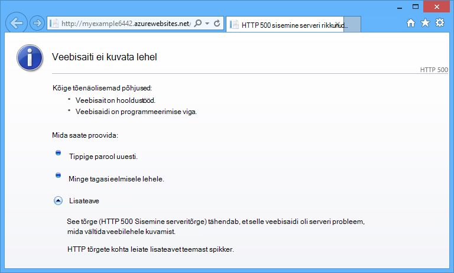
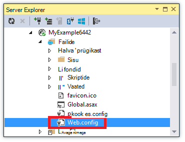
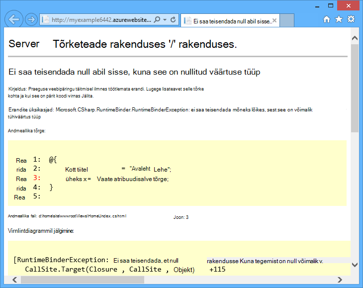
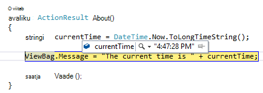
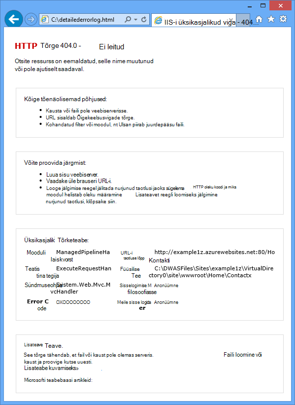
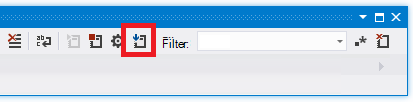
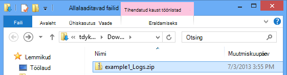
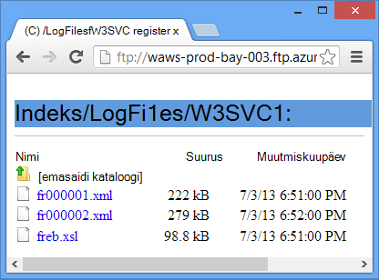

<properties 
    pageTitle="Veebirakenduse teenuses Azure rakenduse Visual Studio abil tõrkeotsing" 
    description="Saate teada, kuidas tõrkeotsing Azure web app Kaug silumine, jälgimine ja logimine tööriistu, mis on sisse ehitatud Visual Studio 2013 abil." 
    services="app-service" 
    documentationCenter=".net" 
    authors="tdykstra" 
    manager="wpickett" 
    editor=""/>

<tags 
    ms.service="app-service" 
    ms.workload="na" 
    ms.tgt_pltfrm="na" 
    ms.devlang="dotnet" 
    ms.topic="article" 
    ms.date="08/29/2016" 
    ms.author="rachelap"/>

# Veebirakenduse teenuses Azure rakenduse Visual Studio abil tõrkeotsing

## Ülevaade

Selle õpetuse näitab, kuidas kasutada Visual Studio tööriistu, mis aitavad silumine web app [Rakenduse teenus](http://go.microsoft.com/fwlink/?LinkId=529714), käivitades [silumine režiimi](http://www.visualstudio.com/get-started/debug-your-app-vs.aspx) kaugühenduse teel või logid ja web logid kuvamine.

[AZURE.INCLUDE [app-service-web-to-api-and-mobile](../../includes/app-service-web-to-api-and-mobile.md)]

Saate teada:

* Millised Azure web appi haldusfunktsioonid on saadaval Visual Studios.
* Kuidas kasutada Visual Studio serveri vaade remote web Appis kiiresti muuta.
* Kaugühenduse teel ajal projekti silumine režiimis käivitamise töötab Azure'i web appi ja jaoks soovitud WebJob.
* Jälita logid loomise ja vaadata neid samal ajal rakendus on luua neid.
* Kuidas vaadata web logid, sh üksikasjalikud tõrketeated ja taotluste jälitamine nurjus.
* Kuidas saada diagnostikalogid, mis on Azure Storage konto ja vaadata neid seal.

Kui teil on Visual Studio Ultimate, saate kasutada ka [IntelliTrace](http://msdn.microsoft.com/library/vstudio/dd264915.aspx) silumine. Selles õpetuses IntelliTrace ei käsitleta.

## Eeltingimused

Selles õpetuses töötab arenduskeskkond, web projekti ja Azure veebirakenduse häälestate [Azure'i ja ASP.net-i kasutamise alustamine][GetStarted]. WebJobs jaotisi, peate rakenduse [Kasutamise alustamine – Azure WebJobs SDK]loodavad[GetStartedWJ].

Koodinäiteid, mis on näidatud selles õpetuses on C# MVC veebirakenduse, kuid tõrkeotsingu on samad Visual Basicu ja Web Forms rakenduste.

Õpetuse eeldab, et kasutate Visual Studio 2015 või 2013. Kui kasutate Visual Studio 2013, WebJobs funktsioonide jaoks on vaja [Update 4](http://go.microsoft.com/fwlink/?LinkID=510314) või uuem versioon. 

Streaming logid funktsioon toimib ainult rakendusi, mis on suunatud .NET Framework 4 või uuem versioon.

## Web Appi konfigureerimine ja haldamine

Visual Studios annab juurdepääsu web app halduse funktsioonide ja [Azure portaali](http://go.microsoft.com/fwlink/?LinkId=529715)konfiguratsioonisätted alamhulga. Selles jaotises näete, mis on saadaval **Serveri Exploreri**kaudu. Leiate Azure'i integreerimine uusimaid funktsioone, proovige **Cloud Explorer** ka. Saate avada nii windows menüüst **Vaade** . 

1. Kui te pole juba sisse logitud Azure Visual Studios, nuppu **Loo ühendus Azure'i** **Server**Explorer.

    Teine võimalus on installida management sert, mis lubab juurdepääsu oma kontole. Kui valite serdi installimiseks, Paremklõpsake sõlme **Azure'i** **Server**Explorer, ja klõpsake kontekstimenüüs **haldamine ja Filter tellimuste** . Dialoogiboksis **Azure'i tellimuste haldamine** klõpsake vahekaarti **serdid** ja seejärel nuppu **impordi**. Järgige alla laadida ja seejärel (nimetatakse ka *.publishsettings* faili) tellimuse faili importimine Azure'i kontosse.

    > [AZURE.NOTE]
    > Kui laadite faili tellimus, salvestage see kausta, mis on väljaspool oma source code kataloogide (nt kaustas allalaaditavad failid) ja seejärel kustutage see kui importimine on lõppenud. Pahatahtlik kasutaja saab juurdepääsu tellimuse faili redigeerimine, loomine ja kustutamine Azure'i teenuste.

    Visual Studio Azure ressursid ühenduse loomise kohta leiate lisateavet teemast [kontode haldamine, tellimused ja administraatorirollid](http://go.microsoft.com/fwlink/?LinkId=324796#BKMK_AccountVCert).

2. **Server Explorer**, laiendage **Azure** ja **Rakenduse teenuse**laiendamine.

3. Laiendage ressursirühm, mis sisaldab web appi [kasutamise alustamine Azure'i ja ASP.net-i]loodud[GetStarted], seejärel paremklõpsake sõlme web app ja nuppu **Vaate sätted**.

    

    Kuvatakse menüü **Azure Web App** ja saate vaadata web app haldus ja konfigureerimine ülesandeid, mis on saadaval Visual Studio.

    

    Selles õppetükis saate kasutame logimine ja jälgimine rippvalikute. Saate kasutada ka remote silumine, kuid saate kasutada mõnda muud meetodit selle taas lubada.
   
    Selles aknas väljad rakenduse sätete ja ühendusstringi kohta leiate teavet teemast [Azure veebirakenduste: Kuidas rakenduse stringide ja ühenduse stringide töö](http://blogs.msdn.com/b/windowsazure/archive/2013/07/17/windows-azure-web-sites-how-application-strings-and-connection-strings-work.aspx).

    Kui soovite teha web appi halduse tööülesande, mida ei saa teha selles aknas, klõpsake brauseriaknas Azure portaali avamiseks **avage haldusportaal** .

## Access web app faile Server Explorer

Tavaliselt juurutamist web projekti soovitud `customErrors` lipu määratud fail `On` või `RemoteOnly`, mis tähendab, et te ei saa kasulik tõrketeade, kui midagi valesti läheb. Palju tõrkeid on kõik teile leht umbes üks järgmistest.

**Serveritõrge rakenduses '/' rakenduses**

**Ilmnes tõrge:**

**Veebisaiti ei kuvata lehel**

Sageli on kõige lihtsam viis tõrke põhjuse on lubamiseks üksikasjaliku tõrketeated, mis eelmises kuvatõmmised esimene selgitab, kuidas teha. Selleks on vaja muudatuste juurutatud fail. Võib redigeerimine *projekti fail* ja Juurutage uuesti projekti või [Web.config muuta](http://www.asp.net/mvc/tutorials/deployment/visual-studio-web-deployment/web-config-transformations) loomine ja juurutamine silumine koostamine, kuid on ka kiirem viis: **Solution** Exploreris te saate otse failide kuvamiseks ja redigeerimiseks remote web Appis *Serveri vaade* funktsiooni abil.

1. **Server Explorer**laiendamine **Azure**, laiendage **Rakenduse teenuse**, ressursirühm, mis asub oma veebirakenduse laiendamine ja seejärel laiendage veebirakenduse jaoks.

    Näete sõlmed, mis annab teile juurdepääsu web appi sisu failid ja logifailid.

2. Laiendage **failid** ja topeltklõpsake *fail* .

    

    Visual Studio remote web Appist fail avatakse ja kuvatakse [Remote] tiitliribal faili nime kõrval.

3. Lisage järgmine rida on `system.web` elementi:

    `<customErrors mode="Off"></customErrors>`

    

4. Värskendage brauserit, mis on kuvatud kasutu tõrketeade ja nüüd kuvatakse üksikasjalik tõrketeade, nagu järgmises näites:

    

    (Näidatud tõrke loodi, lisades esitatud *Views\Home\Index.cshtml*punase joone).

Redigeerimine fail on ainult üks näide, kus võimalus lugeda ja redigeerida faile oma Azure veebirakenduse veenduge, et tõrkeotsingu hõlbustamiseks stsenaariumid.

## Remote silumine veebirakendustes

Üksikasjalik tõrketeade ei anna piisavalt teavet, kui ei saa uuesti luua kohalikult viga, on teine võimalus tõrkeotsing silumine režiimis käivitamise kaugühenduse teel. Saate murdepunkte, töödelda mälu otse, läbi koodi ja isegi muuta koodi tee. 

Remote silumine ei tööta Visual Studio Express versioonides.

Selles jaotises näitab, kuidas silumine tekstsõnumi abil loodud [Alustamine Azure ja ASP.net-i]projekti[GetStarted].

1. Avage web projekti [Alustamine Azure ja ASP.net-i]loodud[GetStarted].

1. Avage *Controllers\HomeController.cs*.

2. Kustuta selle `About()` meetod ning sisestage järgmine kood oma kohale.

        public ActionResult About()
        {
            string currentTime = DateTime.Now.ToLongTimeString();
            ViewBag.Message = "The current time is " + currentTime;
            return View();
        }

2. [Määrake katkestuspunkti](http://www.visualstudio.com/get-started/debug-your-app-vs.aspx) soovitud `ViewBag.Message` joon.

1. **Solution Exploreris**projekti paremklõpsake ja klõpsake nuppu **Avalda**.

2. Valige ripploendist **profiili** sama profiili, mida kasutasite [Alustamine Azure ja ASP.net-i][GetStarted].

3. Vahekaardil **sätted** nuppu **silumine** **konfiguratsiooni** muuta ja seejärel klõpsake nuppu **Avalda**.

    

4. Pärast juurutuse viimistluse ja brauseri avab oma veebirakenduse Azure'i URL-i, sulgege brauser.

5. **Server Explorer**, paremklõpsake oma veebirakenduse ja seejärel nuppu **Manusta Silur**. 

    

    Brauseris avatakse automaatselt avalehe Azure töötab. Peate oodake, kuni 20 sekundit või nii Azure'i häälestab server silumine. See viivitus juhtub ainult esimest korda, kui käivitate web appi silumine režiimis. Kui hakkate silumine uuesti seal järgmise 48 tunni jooksul järgmiste aegade ei saa viivituse.

    **Märkus:** Kui teil on probleeme, alustades siluri, proovige teha **Serveri Exploreri**asemel **Cloud Exploreri** kaudu.

6. Klõpsake menüü **teave** .

    Visual Studio peatub katkestuspunkt ja koodi Azure, pole teie kohalikus arvutis töötab.

7. Libistage kursoriga üle soovitud `currentTime` muutuja ajaväärtuse kuvamiseks.

    

    Kuvatakse aeg on Azure serveri aeg, mis võivad olla erinevad ajavööndi kui kohalikus arvutis.

8. Sisestage uus väärtus on `currentTime` muutuv, näiteks "Nüüd töötab Azure".

5. Vajutage klahvi F5 Jätka.

    Töötab Azure'i lehel teave kuvatakse uus väärtus, mille te olete sisestanud currentTime muutujana.

    

## Remote silumine WebJobs

Selles jaotises kirjeldatakse silumine kaugühenduse teel rakendusega project ja web loote [Alustamine Azure'i WebJobs SDK](websites-dotnet-webjobs-sdk.md)tehke järgmist. 

Sellesse lahtrisse funktsioonid on saadaval ainult Visual Studio 2013 värskenduse 4 või uuem. 

Remote silumine töötab ainult pidev WebJobs. Ajastatud ja vajadusel WebJobs ei toeta silumine.

1. Avage web projekti [Alustamine Azure'i WebJobs SDK]loodud[GetStartedWJ].

1. Avage Projectis ContosoAdsWebJob *Functions.cs*.

2. [Katkestuspunkti seadmine](http://www.visualstudio.com/get-started/debug-your-app-vs.aspx) rakenduses esimene lause on `GnerateThumbnail` meetod.

    

1. **Solution Exploreris**, paremklõpsake web projekt (mitte WebJob projekt) ja klõpsake nuppu **Avalda**.

2. Valige ripploendist **profiili** sama profiili, mida kasutasite [Azure'i WebJobs SDK alustamine](websites-dotnet-webjobs-sdk.md).

3. Vahekaardil **sätted** nuppu **silumine** **konfiguratsiooni** muuta ja seejärel klõpsake nuppu **Avalda**.

    Visual Studio kasutab veebi ja WebJob projektide ja Azure URL-i oma veebirakenduse avaneb teie brauser.

5. Laiendage **Server Explorer** **Azure > rakenduse teenus > ressursirühma > oma veebirakenduse > WebJobs > pidev**, ja seejärel paremklõpsake **ContosoAdsWebJob**.

7. Klõpsake nuppu **Manusta Silur**. 

    

    Brauseris avatakse automaatselt avalehe Azure töötab. Peate oodake, kuni 20 sekundit või nii Azure'i häälestab server silumine. See viivitus juhtub ainult esimest korda, kui käivitate web appi silumine režiimis. Järgmine kord, kui manustate siluri olemas, ei saa viivituse, kui te ei tee seda tunni jooksul.

6. Contoso reklaamid avalehele avatakse veebibrauseris, looge uus ad. 

    Loomise reklaami põhjustab järjekorda sõnumi loonud, mis on WebJob kätte ja töödeldud. Kui WebJobs SDK funktsioon töödelda järjekorda sõnumi, tabab kood oma Murdepunkt.

7. Kui siluri piirid veebisaidil oma katkestuspunkt, saate uurida ja muuta muutujaga programmi töötamise pilve. Järgmisel pildil kuvatakse siluri blobInfo objekti, mis võeti vastu GenerateThumbnail meetodiga sisu.

    
 
5. Vajutage klahvi F5 Jätka.

    GenerateThumbnail meetodit lõppemist loomise pisipilti.

6. Brauseri värskendamine esilehele ja näete pisipilti.

6. Visual Studio, klahvikombinatsiooni SHIFT + F5 silumine lõpetada.

7. **Server Explorer**, Paremklõpsake sõlme ContosoAdsWebJob ja valige **Vaate armatuurlaud**.

8. Logige sisse oma Azure kasutajanimi ja parool ja klõpsake minna lehele oma WebJob WebJob nimi. 

    

    Armatuurlaua näitab, et käivitada viimati GenerateThumbnail funktsiooni.

    (Järgmine kord, kui klõpsate **Armatuurlaua vaade**, pole teil vaja sisse logida ja brauseri läheb otse lehele oma WebJob.)

9. Klõpsake funktsiooni nime funktsiooni täitmise üksikasjade kuvamiseks.

    

Kui teie funktsioon [kirjutas logid](websites-dotnet-webjobs-sdk-storage-queues-how-to.md#logs), võite klõpsata nuppu **ToggleOutput** neid näha.

## Märkmete kohta Kaug silumine

* Valmistamisel silumine režiimis pole soovitatav. Kui teie tootmise web Appis suurust pole muudetud välja mitme serveri eksemplarides, silumine takistada veebiserver vastata teiste. Kui teil on mitu web serveri eksemplari, kui manustate siluri kuvatakse juhusliku eksemplari ning teil on kuidagi tagamaks, et edaspidised brauseri taotlusi läheb selle eksemplari. Lisaks tavaliselt ei juurutate silumine Koosta tootmisele ja koostaja optimeerimine väljaanne järgud võib oleks võimalik kuvada, mis toimub rea oma lähtekoodi. Tootmise tõrkeotsing teie parim ressurss on rakenduse jälgimise ja web logid.

* Vältige pikk peatub katkestuspunktid kui Kaug silumine. Azure'i käsitleb protsess, mis on rohkem kui paar minutit, kui mõni ei reageeri protsess on peatatud ja see sulgub.

* Kui te kasutate silumine, saadab server Visual Studio, mis võivad mõjutada läbilaskevõime kulude andmeid. Läbilaskevõime määra kohta leiate teavet teemast [Azure hinnad](/pricing/calculator/).

* Veenduge, et selle `debug` atribuut on `compilation` *fail* element on seatud väärtusele tõene. See on seatud tõene vaikimisi silumine Koosta konfiguratsiooni avaldamisel.

        <system.web>
          <compilation debug="true" targetFramework="4.5" />
          <httpRuntime targetFramework="4.5" />
        </system.web>

* Kui leiate, et siluri ei samm kood, mida soovite silumine, peate ainult minu koodi sätet muuta.  Lisateabe saamiseks lugege teemat [piira hetkeks ainult minu koodi](http://msdn.microsoft.com/library/vstudio/y740d9d3.aspx#BKMK_Restrict_stepping_to_Just_My_Code).

* Mõne käivitub serveris kui Kaug silumine funktsiooni ja 48 tundi pärast funktsiooni lülitatakse automaatselt välja. Selle piirmäära 48 tundi tehakse turbe- ja põhjustel. Saate hõlpsalt uuesti sisse lülitada funktsiooni nii mitu korda, kui soovite. Soovitatav on keelatud, kui teil on aktiivselt silumine jättes.

* Saate käsitsi manustada siluri käigus, mitte ainult web appi protsessi (w3wp.exe). Visual Studio silumine režiimi kasutamise kohta leiate lisateavet teemast [silumine Visual Studios](http://msdn.microsoft.com/library/vstudio/sc65sadd.aspx).

## Diagnostikalogide ülevaade

ASP.net-i rakendus, mis töötab Azure web app saate luua järgmist tüüpi logid.

* **Logid jälgimine** 
  Rakendus loob need logid helistades meetodite [System.Diagnostics.Trace](http://msdn.microsoft.com/library/system.diagnostics.trace.aspx) klassi.
* **Web logid** 
  Veebiserver loob logikirjet iga HTTP taotluse web appi.
* **Tõrke üksikasjalik logid** 
  Veebiserver loob HTML-lehele mõned täiendavad andmed nurjunud HTTP-päringud, (need, mis annavad tulemuseks olekukoodi 400 või suurem). 
* **Taotluse jälgimine logid nurjus** 
  Veebiserver loob XML-faili jälgimine üksikasjalikku teavet nurjunud HTTP-päringud. Veebiserver pakub XSL-faili vormindamiseks XML-i brauseris.
  
Logimise mõjutab web appi jõudluse tagamiseks nii, et Azure'i pakub teile võimalust lubada või keelata igat tüüpi log vastavalt vajadusele. Logid, saate määrata, et ainult teatud raskusaste kõrgema logid tuleb kirjutada. Kui loote uue veebirakenduse vaikimisi kõik logimine on keelatud.

Logide kirjutada oma veebirakenduse failisüsteemi *LogFiles* kausta failide ja juurdepääsetavat FTP. Web logid ja logid saate kirjutada Azure Storage konto. Saate säilitada suurem mahus logide salvestusruumi konto, kui see on võimalik failisüsteemis. Olete piiratud maksimaalselt 100 MB logide failisüsteemi kasutamisel. (Faili süsteemi logid on ainult lühiajaline säilitus. Azure'i kustutab vana logifailid teha ruumi uutele pärast jõudmisel.)  

## Saate luua ja vaadata Jälita logid

Selles jaotises saate teha järgmisi toiminguid:

* Jälgimine laused lisada web projekti [Alustamine Azure ja ASP.net-i]loodud[GetStarted].
* Saate vaadata logide projekti kohalikult käivitamisel.
* Saate vaadata logid, nagu need on loodud Azure rakendus. 

Teavet selle kohta, kuidas luua rakenduse logib WebJobs, leiate teemast [töötamise Azure järjekorda salvestusruumi WebJobs SDK - kirjutamist logide abil](websites-dotnet-webjobs-sdk-storage-queues-how-to.md#logs). Logide vaatamise ja kontrollida, kuidas need on talletatud Azure'i järgmised juhised kehtivad ka loodud WebJobs logid. 

### Rakenduse jälgimise laused lisamine

1. *Controllers\HomeController.cs*avamine ja asendada selle `Index`, `About`, ning `Contact` meetodid, et lisada järgmine kood `Trace` laused ning `using` avalduse `System.Diagnostics`:

        public ActionResult Index()
        {
            Trace.WriteLine("Entering Index method");
            ViewBag.Message = "Modify this template to jump-start your ASP.NET MVC application.";
            Trace.TraceInformation("Displaying the Index page at " + DateTime.Now.ToLongTimeString());
            Trace.WriteLine("Leaving Index method");
            return View();
        }
        
        public ActionResult About()
        {
            Trace.WriteLine("Entering About method");
            ViewBag.Message = "Your app description page.";
            Trace.TraceWarning("Transient error on the About page at " + DateTime.Now.ToShortTimeString());
            Trace.WriteLine("Leaving About method");
            return View();
        }
        
        public ActionResult Contact()
        {
            Trace.WriteLine("Entering Contact method");
            ViewBag.Message = "Your contact page.";
            Trace.TraceError("Fatal error on the Contact page at " + DateTime.Now.ToLongTimeString());
            Trace.WriteLine("Leaving Contact method");
            return View();
        }       

2. Lisage soovitud `using System.Diagnostics;` lause fail üles.
                
### Kohalik jälgimine väljundi kuvamine

3. Vajutage klahvi F5, käivitage rakendus silumine režiimis.

    Vaikimisi Jälita kuulajale kirjutab kõik jälgimise väljund koos muude silumine väljundi aknas **väljund** . Järgmisel joonisel on kujutatud väljund Jälita laused, mille lisasite selle `Index` meetod.

    

    Järgmised toimingud näitab, kuidas vaadata jälgimise väljund veebilehele, ilma koostamise silumine režiimis.

2. Avage rakenduse fail (üks projekti kaustas) ja lisage soovitud `<system.diagnostics>` elemendi just enne faili lõpus `</configuration>` elementi:

        <system.diagnostics>
            <trace>
              <listeners>
                <add name="WebPageTraceListener"
                    type="System.Web.WebPageTraceListener, 
                    System.Web, 
                    Version=4.0.0.0, 
                    Culture=neutral,
                    PublicKeyToken=b03f5f7f11d50a3a" />
              </listeners>
            </trace>
          </system.diagnostics>

    Funktsiooni `WebPageTraceListener` saate vaadata jälgi väljundi sirvides `/trace.axd`.

3. Lisage <a href="http://msdn.microsoft.com/library/vstudio/6915t83k(v=vs.100).aspx">elemendi</a> all `<system.web>` faili Web.config, nagu järgmises näites:

        <trace enabled="true" writeToDiagnosticsTrace="true" mostRecent="true" pageOutput="false" />

3. Vajutage klahvikombinatsiooni CTRL + F5 rakenduse käivitamiseks.

4. *Trace.axd* lisamine URL-i brauseriakna aadressiribale ja vajutage sisestusklahvi (URL-i on sarnane http://localhost:53370/trace.axd).

5. Klõpsake lehel **Rakenduste jälgimine** (mitte BrowserLink joont) esimesel real **Kuva üksikasjad** .

    

    **Taotleda üksikasjade** lehel kuvatakse ja jaotises **Jälita teave** kuvatakse väljund Jälita laused, mille lisasite selle `Index` meetod.

    

    Vaikimisi `trace.axd` on saadaval ainult kohalikult. Kui soovite kalendriüksusi kättesaadavaks remote web appi kaudu, võite lisada `localOnly="false"` abil soovitud `trace` element *fail, nagu on näidatud järgmises näites* :

        <trace enabled="true" writeToDiagnosticsTrace="true" localOnly="false" mostRecent="true" pageOutput="false" />

    Siiski, mis võimaldab `trace.axd` on valmistamisel veebirakenduse üldjuhul soovitatav turvalisuse põhjustel ning järgmistes lõikudes näete lihtsam viis lugeda jälgimine logid Azure web app.

### Azure'i jälgimine väljundi kuvamine

1. Paremklõpsake web project **Solution Exploreris**, ja klõpsake nuppu **Avalda**.

2. Klõpsake dialoogiboksis **Veebis avaldamine** nuppu **Avalda**.

    Pärast Visual Studio avaldab värskendamist, avab brauseriaknas avalehe (eeldades, et te ei tühjendage vahekaardil **ühendus** **Sihtkoha URL** ).

3. **Server Explorer**, paremklõpsake oma veebirakenduse ja valige käsk **Vaata Streaming logid**. 

    

    **Väljundi** aknas kuvatakse ühendatud log streaming teenuse ja lisab rea teatis iga minut, mis läheb ilma Logi kuvamiseks.

    

4. Näitab avalehe rakenduste brauseriaknas nuppu **Kontakt**.

    Mõne sekundi tõrke taseme väljund jälgida, saate lisada soovitud `Contact` **väljundi** aknas kuvatakse meetod.

    

    Visual Studio on kuvatud ainult tõrke taseme jälgi, kuna see on vaikimisi, kui lubate jälgimise teenuse Logi. Kui loote uue Azure veebirakenduse, kõik logimine on keelatud vaikimisi, nagu on kuvatud lehel sätted varasemas versioonis avamisel:

    

    Kuid **Vaate Streaming logid**valimisel Visual Studio automaatselt muuta **Rakenduse Logging(File System)** **tõrge**, mis tähendab, et saada tõrke taseme logid teatatud. Selleks, et näha kõiki oma jälgimine logid, siis saate seda sätet **Verbose**. Kui valite raskusaste tõrge madalamale tasemele, teatatud ka kõik logisid kõrgem raskusaste. Nii Paljusõnaline valimisel kuvatakse ka teave, hoiatused ja Tõrkelogide.  

4. **Server Explorer**, paremklõpsake web appi ja seejärel nuppu **Vaate sätted** , nagu nagu varem.

5. Muuta **Verbose** **Rakenduse logimine (failisüsteemi)** ja klõpsake siis nuppu **Salvesta**.
 
    

6. Brauseriaknas, mis on nüüd kuvatud oma **kontakti** lehele, klõpsake menüüd **Avaleht**ja seejärel käsku **teave**ja klõpsake **kontaktide**.

    Mõne sekundi, **väljundi** aknas kuvatakse kõigi teie jälgimise väljund.

    

    Selles jaotises lubatud ja keelatud logimine Azure web appi sätete abil. Saate lubamine ja keelamine Jälita kuulajatele muutes fail. Siiski fail muutmine põhjustab rakenduse domeeni prügikasti, samal ajal lubada logimine konfiguratsiooni web appi kaudu ei seda teha. Kui probleem võtab kaua aega paljundada, või on katkendlik, rakenduse domeeni ringlussevõtu võib "Paranda" ja mida oodata, kuni see juhtub uuesti jõustada. Lubada Azure diagnostika ei selleks, et saate alustada hõivamine tõrketeabe kohe.

### Väljundi aknas funktsioonid

**Azure'i logid** vahekaarti **väljundi** aknas on mitmeid nuppe ja tekstivälja.

Need teha järgmised funktsioonid:

* Tühjendage **väljundi** aknas.
* Lubada või keelata Murra.
* Alustamine või lõpetamine, jälgimine logid.
* Määrake, mis logib jälgimine.
* Laadige alla logid.
* Filtreerida logides otsingustring või tavalise avaldis.
* Sulgege aken **väljundi** .

Kui sisestate otsingustring või Lihtavaldise, Visual Studio filtreerib logiteabe kliendis. Mida tähendab, et saate sisestada kriteeriumid pärast **väljundi** aknas kuvatakse logid ja filtreerimise kriteerium saate muuta ilma taastada logid.

## Vaata veebis logid

Web logid salvestada kõik HTTP tegevuse web app. Selleks, et näha need **väljundi** aknas tuleb web appi lubamine ja Visual Studio, mida soovite jälgida neid kindlaks teha. 

1. Avatud Explorerist **Server** **Azure'i Web Appi konfigureerimine** klõpsake menüüs muuta Web serveri logimine **sisse**ja klõpsake siis nuppu **Salvesta**.

    

2. **Väljundi** aknas nuppu **võite määrata, millised Azure'i logib jälgimiseks** .
    
    

3. **Azure'i logimine suvandid** dialoogiboksis valige **Web logid**ja seejärel klõpsake nuppu **OK**.

    

4. Brauseriaknas, mis kuvatakse veebirakenduse, klõpsake menüüd **Avaleht**ja seejärel käsku **teave**ja klõpsake **kontaktide**.

    Rakenduse logid ilmuvad tavaliselt esmalt järgneb web logid. Peate ootama aega logid kuvada. 

    

Vaikimisi, kui lubate esmalt web logid Visual Studio abil Azure'i kirjutab logid failisüsteemis. Teise võimalusena saate määrata selle veebiserverisse logid tuleks alati kirjutada, et bloobimälu container salvestusruumi konto Azure portaali.

Kui kasutada portaali lubamiseks Azure storage kontole logimine veebiserver ning seejärel keelata logimise Visual Studios, kui lubate uuesti Visual Studio logimise salvestusruumi Kontosätete taastatakse. 

## Üksikasjalikud sõnumi Tõrkelogide kuvamine

Üksikasjalik Tõrkelogide teavet mõned täiendavad HTTP-päringud tulemuseks tõrkekoodid vastuse (400 või rohkem). Selleks, et näha need **väljundi** aknas, peate web appi lubamine ja Visual Studio, mida soovite jälgida neid kindlaks teha.

1. Avatud Explorerist **Server** **Azure'i Web Appi konfigureerimine** klõpsake menüüs muuta **Üksikasjalik tõrketeadete** **kohta**ja klõpsake siis nuppu **Salvesta**.

    

2. **Väljundi** aknas nuppu **võite määrata, millised Azure'i logib jälgimiseks** .

3. **Azure'i logimine suvandid** dialoogiboksis nuppu **kõik logid**ja seejärel klõpsake nuppu **OK**.

    

4. Brauseriakna aadressiribal lisada mõne eest laadi põhjustada tõrge nr 404 URL-i (nt `http://localhost:53370/Home/Contactx`), ja vajutage sisestusklahvi Enter.

    Mitme sekundi pärast Visual Studio **väljundi** aknas kuvatakse üksikasjalik tõrkelogi.

    

    CTRL + klõpsake linki Logi väljundi kuvamiseks vormindatud brauseris:

    

## Laadige alla fail süsteemi logid

Mis tahes logid, mida saate jälgida **väljundi** aknas saab alla *ZIP* -faili. 

1. Klõpsake aknas **väljundi** **Streaming logid alla laadida**.

    

    File Exploreris avaneb allalaaditud faili valitud *allalaaditavate failide* kausta.

    

2. Ekstrakti *ZIP* -faili ning kuvatakse järgmised kausta ülesehitust:

    

    * Rakenduste jälgimine logid on *LogFiles\Application* kausta *txt* -faile.
    * Web logid on kaustas *LogFiles\http\RawLogs* *.log* faile. Tööriist, näiteks [Log parseri](http://www.microsoft.com/download/details.aspx?displaylang=en&id=24659) abil saate vaadata ja neid faile.
    * Üksikasjalik Tõrkelogide sõnum on *HTML* failid *LogFiles\DetailedErrors* kaustas.

    ( *Juurutuste* kaust on failide loodud andmeallika juhtelemendi avaldamise; see ei pea midagi seotud Visual Studio avaldamine. *Git* kausta, mis on seotud andmeallika juhtelemendi jälgi avaldamine ja Logi faili streaming teenuse.)  

## Vaate salvestusruumi logid

Rakenduste jälgimine logisid saab saata ka Azure storage konto ja saate neid vaadata Visual Studios. Selleks, et saate salvestusruumi konto loomine, salvestusruumi logid klassikaline portaalis lubada, ja vaadata neid **logide** vahekaardil **Azure'i veebirakenduse** akna.

Logid saata või kõigi kolme sihtkohta:

* Failisüsteemis.
* Salvestusruumi tabelid.
* Salvestusruumi konto plekid.

Saate määrata eri raskusaste taseme igasse sihtkohta. 

Tabelid hõlbustavad logid võrgus üksikasjade kuvamiseks ja need toetavad; saate päringu logide tabelid ja nende loomisel, lugege teemat uue logid. Plekid võimaldavad hõlpsalt logide faile alla laadida ja analüüsida neid abil Hdinsightiga, sest Hdinsightiga teab, kuidas töötada bloobimälu. Lisateavet leiate teemast **Hadoopi ja MapReduce** [Andmete talletamise võimalused (Building tegelike pilve rakendused Azure)](http://www.asp.net/aspnet/overview/developing-apps-with-windows-azure/building-real-world-cloud-apps-with-windows-azure/data-storage-options).

Teil on faili süsteemi logid määratud Paljusõnaline tase; järgmised toimingud sõelub häälestamise teabe taseme logide avamiseks salvestusruumi tabelid. Tase teabe – kõik logid helistades loodud `Trace.TraceInformation`, `Trace.TraceWarning`, ja `Trace.TraceError` kuvatakse, kuid mitte logid loodud helistades `Trace.WriteLine`.

Salvestusruumi kontod pakuvad rohkem mäluruumi ja pikemaks säilituspoliitikate logide võrreldes failisüsteemis. Teine eelis jälgimine logid saata salvestusruumi on, et saate iga Logi, mida te ei saa faili süsteemi logid saada lisateavet.

5. **Paremklõpsake Azure sõlme all** ja seejärel nuppu **Loo salvestusruumi konto**.

3. Sisestage dialoogiboksis **Talletusmahu konto loomine** salvestusruumi konto nimi. 

    Nimi peab olema peab olema kordumatu (muu Azure storage konto võib olla sama nimi). Kui sisestate nimi on juba kasutusel, saate seda muuta võimalus.

    URL-i salvestusruumi kontole juurdepääsuks on *{nimi}*. core.windows.net. 

5. Määrake **piirkonnas või osaleja** ripploendist alale teile.

    See säte määrab, millist Azure andmekeskuse kuvatakse majutada konto salvestusruumi. Selles õpetuses mõeldud tehtud valikust ei märgatav midagi muuta, kuid tootmise web appi soovite oma veebiserverisse ja konto salvestusruumi olema sama piirkonna latentsus ja andmete sealt kulude minimeerimiseks. Veebirakenduse (mille saate luua hiljem) peaks töötama piirkonnas juurdepääs oma veebirakenduse latentsus minimeerimiseks brauseritega võimalikult lähedalt.

6. Seadke **Dispersioonanalüüs** ripploendist **kohalikult liigsed**. 

    Geo-dispersioonanalüüs lubamisel salvestusruumi konto talletatud sisu on kopeeritud sekundaarse andmekeskuse Tõrkesiirde sinna korral katastroof esmane asukohta. Geo-dispersioonanalüüs saate tasulised. Katse- ja kontode puhul üldiselt ei soovi geo-dispersioonanalüüs eest maksta. Lisateavet leiate teemast [loomine, haldamine, või salvestusruumi konto kustutada](../storage-create-storage-account/#replication-options).

5. Klõpsake nuppu **Loo**. 

      

1. Visual Studio **Azure Web App** akna **logid** vahekaarti ja klõpsake **Haldusportaali logimine konfigureerimine**.

    <!-- todo:screenshot of new portal if the VS page link goes to new portal -->
    

    Selle tegemisel avaneb menüü **konfigureerimine** klassikaline portaali veebirakenduse jaoks.

2. Klassikaline portaali **konfigureerimine** menüü, liikuge kerides jaotiseni rakenduse diagnostika ning muutke seejärel **sees** **Rakenduse logimine (Tabelimälu)** .

3. **Logimistaseme** muutmiseks **teavet**.

4. Klõpsake **tabeli salvestusruumi haldamine**.

    

    Klõpsake väljal **haldamine tabelimälu rakenduse diagnostika** saate valida konto salvestusruumi kui teil on rohkem kui üks. Saate uue tabeli loomine või olemasoleva kasutamiseks.

    

6. Klõpsake väljal **haldamine tabelimälu rakenduse diagnostika** märge dialoogiboksi sulgemiseks.

6. Klassikaline portaali **konfigureerimine** vahekaardil, klõpsake nuppu **Salvesta**.

7. Brauseriaknas, mis kuvab rakenduse web appi, klõpsake menüüd **Avaleht**ja siis käsku **teave**ja klõpsake **kontaktide**.

    Logiteave toodetud nende veebilehtede sirvimise kirjutatakse salvestusruumi kontole.

8. **Azure'i veebirakenduse** akna Visual Studio **logid** menüüs nuppu **Värskenda** jaotises **Diagnostika Kokkuvõte**.

    

    Jaotises **Diagnostika Kokkuvõte** kuvatakse vaikimisi logid viimase 15 minutit. Saate muuta perioodi kuvamiseks rohkem logid. 

    (Kui kuvatakse tõrketeade "tabeli ei leitud", kontrollige liikuda lehed, mida teha jälgida pärast märkisite **Rakenduse logimine (salvestusruumi)** ja klõpsasite nuppu **Salvesta**.)

    

    Pange tähele, et selles vaates kuvatakse **Protsessi ID** ja **Jutulõnga** iga Logi, mida te ei saa faili süsteemi logisid. Saate vaadata täiendavaid välju vaatamise Azure storage tabel otse.

8. Klõpsake nuppu **Kuva kõik logid**.

    Jälita Logi tabel kuvatakse Azure storage tabeli vaaturis.
   
    (Kui saate tõrketeate "jada sisaldab punkte", avage **Server Explorer**, laiendage jaotises sõlme **Azure'i** konto salvestusruumi ja seejärel paremklõpsake **tabelid** ja klõpsake **värskendamine**.)

    

    Siin kuvatakse lisaväljade te ei näe muudes vaadetes. See vaade võimaldab teil filtreerimiseks logid teisiti Query Builder UI ehitamine päringu abil. Lisateabe saamiseks vt tabeli ressursid - [Sirvimise salvestusruumi ressursid Server Explorer](http://msdn.microsoft.com/library/ff683677.aspx)üksuste filtreerimine töötamise.

7. Ühe rea üksikasjad vaadata, topeltklõpsake rida.

    

## Nurjunud taotluste jälitamine logide kuvamine

Nurjunud taotluste jälitamine logid on kasulik, kui teil on vaja mõista, kuidas on IIS-i töötlemise HTTP-päring, stsenaariumid nagu URL-i ümberkirjutamine või autentimist probleemide üksikasjad. 

Azure'i veebirakenduste kasutada sama nurjunud taotluste jälitamine funktsiooni, mis on saadaval 7.0 IIS-i ja uuemad versioonid. Teil pole juurdepääsu konfigureerimine, millised tõrked logitakse siiski IIS-i sätted. Kui lubate nurjunud taotluste jälitamine, on jäädvustatud kõik vead. 

Visual Studio abil saate lubada nurjunud taotluste jälitamine, kuid te ei saa vaadata neid rakenduses Visual Studio. Need logid on XML-failid. Streaming Logi teenuse jälgib ainult faile, mis on loetav Lihttekst režiimis: *.txt*, *HTML*ja *.log* faile.

Saate vaadata nurjunud taotluste jälitamine logid brauseris otse FTP või kohalikult pärast kohalikku arvutisse allalaadimiseks FTP-tööriista abil. Selles jaotises saate kuvatakse brauseri kaudu vaadata neid otse.

1. **Azure'i veebirakenduse** akna **Serveri**Exploreris avatud vahekaarti **konfigureerimine** muutmine **Nurjus taotlemine jälgimise** **kohta**ja klõpsake siis nuppu **Salvesta**.

    

4. Brauseriaknas, mis kuvatakse veebirakenduse aadressiribale lisada mõne eest laadi URL ja klõpsake nuppu Enter, et põhjustada tõrge nr 404.

    See põhjustab nurjunud taotluste jälitamine samamoodi, et luua ja järgmist näitab, kuidas vaadata või Logi alla.

2. Visual Studio **konfiguratsiooni** **Azure Web App** akna menüüs nuppu **avatud haldusportaal**.

3. Veebirakenduse jaoks tera [Azure portaali](https://portal.azure.com) **sätted** , klõpsake **juurutamise mandaat**ja seejärel sisestage uue kasutajanime ja parooli.

    

    ** Kui logite, peate kasutama web app nimega eelkinnitatud selle täielik kasutajanimi. Näiteks kui sisestate "myid" kasutajanime ja sait on "myexample", logite "myexample\myid".

5. Avage uus brauseriaken, URL, mis kuvatakse **Veebirakenduse** tera veebirakenduse jaoks **FTP hostname** või **FTPS hostname (hostinimi)** . 

6. Logige sisse varasemas versioonis (sh web appi nime eesliide kasutajanime) loodud FTP mandaadi abil.

    Brauseris kuvatakse veebirakenduse juurkausta.

6. Avage kaust *logifailidele* .

    

7. Avage kaust nimega W3SVC pluss arvulise väärtuse.

    

    Kaust sisaldab XML-failid, kui olete lubanud nurjunud taotluste jälitamine logitud tõrkeid, ja xsl-fail, mille brauseri abil saate vormindada XML-i.

    

8. Klõpsake nuppu XML-failis nurjunud taotlus, mida soovite jälgimise teabe kuvamiseks.

    Järgmisel joonisel on osa jälgimise teavet valimi tõrke.

    

## Järgmised sammud

Näete, kuidas Visual Studio on lihtne vaadata Azure web app loodud logid. Järgmised jaotised sisaldavad seotud ressursside linke:

* Azure'i web appi tõrkeotsing
* Visual Studio silumine 
* Remote Azure silumine
* ASP.net-i rakenduste jälgimine
* Analüüsimine web logid
* Analüüsimine nurjus taotluse jälgimine logid
* Pilveteenustega silumine

### Azure'i web appi tõrkeotsing

Veebirakenduste teenuses Azure rakenduse tõrkeotsingu kohta leiate lisateavet leiate järgmistest teemadest.

* [Kuidas jälgida veebirakendustes](/manage/services/web-sites/how-to-monitor-websites/)
* [Uurib mälulekete Azure veebirakendustes Visual Studio 2013 abil](http://blogs.msdn.com/b/visualstudioalm/archive/2013/12/20/investigating-memory-leaks-in-azure-web-sites-with-visual-studio-2013.aspx). Microsoft ALM ajaveebipostitus analüüsimiseks hallatavate mälumahuga seotud probleemid Visual Studio funktsioonide kohta.
* [Azure'i web Appsi võrgutööriistad peaks teadma](/blog/2014/03/28/windows-azure-websites-online-tools-you-should-know-about-2/). Ajaveebipostitus Amit Apple.

Teatud tõrkeotsingu küsimus abi saamiseks alustada teemat ühte järgmistest Foorumid:

* [ASP.net-i saidil the Azure'i Foorum](http://forums.asp.net/1247.aspx/1?Azure+and+ASP+NET).
* [The Azure'i Foorum MSDN-is](http://social.msdn.microsoft.com/Forums/windowsazure/).
* [StackOverflow.com](http://www.stackoverflow.com).

### Visual Studio silumine 

Visual Studio silumine režiimi kasutamise kohta leiate lisateavet teemast [silumine Visual Studio](http://msdn.microsoft.com/library/vstudio/sc65sadd.aspx) MSDN-i teema ja [Silumine näpunäited koos Visual Studio 2010](http://weblogs.asp.net/scottgu/archive/2010/08/18/debugging-tips-with-visual-studio-2010.aspx).

### Remote Azure silumine

Leiate Azure'i veebirakenduste ja WebJobs Kaug silumine kohta leiate lisateavet järgmistest teemadest.

* [Remote silumine Azure'i rakendust Service Web Apps tutvustus](/blog/2014/05/06/introduction-to-remote-debugging-on-azure-web-sites/).
* [Remote silumine Azure'i rakenduse teenuse Web Appsi osa 2 - sees Kaug silumine tutvustus](/blog/2014/05/07/introduction-to-remote-debugging-azure-web-sites-part-2-inside-remote-debugging/)
* [Remote silumine Sissejuhatus Azure'i rakenduse teenuse veebirakenduste osa 3 – mitme eksemplari keskkonna ja GIT](/blog/2014/05/08/introduction-to-remote-debugging-on-azure-web-sites-part-3-multi-instance-environment-and-git/)
* [WebJobs silumine (video)](https://www.youtube.com/watch?v=ncQm9q5ZFZs&list=UU_SjTh-ZltPmTYzAybypB-g&index=1)

Kui oma veebirakenduse kasutab mõni Azure Web API või Mobile teenuste tagaandmebaas ja silumine, mida soovite, lugege teemat [Silumine .NET Taustväärtus Visual Studio](http://blogs.msdn.com/b/azuremobile/archive/2014/03/14/debugging-net-backend-in-visual-studio.aspx).

### ASP.net-i rakenduste jälgimine

Interneti-ühendusega arvutid on saadaval pole põhjalik ja ajakohane asustamise ASP.net-i jälgimine. Parim, mida saate teha on alustamine vana tutvustavad materjalid kirjutatud Web vormide Kuna MVC pole veel olemas ja täiendada, mis koos uuem ajaveebi postituste mis keskenduvad konkreetsete teemade kohta. Hea kohati alustamiseks on järgmistest allikatest:

* [Jälgimine ja telemeetria (Building tegelike pilve rakendused Azure)](http://www.asp.net/aspnet/overview/developing-apps-with-windows-azure/building-real-world-cloud-apps-with-windows-azure/monitoring-and-telemetry).  E-raamat Peatükk soovitustega jälgida Azure pilveteenuse rakendustes.
* [ASP.net-i jälgimine](http://msdn.microsoft.com/library/ms972204.aspx) 
  Vana, kuid ikka hea ressurss lihtne Sissejuhatus teema.
* [Jälita kuulajatele](http://msdn.microsoft.com/library/4y5y10s7.aspx) 
  Jälita kuulajatele teavet, kuid ei mainita [WebPageTraceListener](http://msdn.microsoft.com/library/system.web.webpagetracelistener.aspx).
* [Juhend: ASP.net-i jälgimine integreerimise System.Diagnostics jälgimine](http://msdn.microsoft.com/library/b0ectfxd.aspx) 
  See liiga vana, kuid sisaldab täiendavat teavet sissejuhatav artikkel ei sisalda.
* [ASP.net-i MVC Razori vaadetes jälitamine](http://blogs.msdn.com/b/webdev/archive/2013/07/16/tracing-in-asp-net-mvc-razor-views.aspx) 
  Lisaks jälitamine Razori vaateid, postituse ka selgitab, kuidas kuvatakse tõrge filter kõik töötlemata erandid sisselogimiseks MVC rakenduse loomiseks. Lisateavet selle kohta, kuidas logida kõik töötlemata erandid rakenduses Web Forms kohta leiate teemast Global.asax näide [täieliku](http://msdn.microsoft.com/library/bb397417.aspx) näites tõrge käitlejate MSDN-is. MVC või Web vormid, kui soovite teatud erandid sisse logida, kuid lasta töötlemise jõustub nende jaoks vaikimisi raames saate jaole juba ja rethrow, nagu järgmises näites:

        try
        {
           // Your code that might cause an exception to be thrown.
        }
        catch (Exception ex)
        {
            Trace.TraceError("Exception: " + ex.ToString());
            throw;
        } 

* [Streaming diagnostika Jälita logimine: Azure'i käsurea (pluss kiire ülevaade!)](http://www.hanselman.com/blog/StreamingDiagnosticsTraceLoggingFromTheAzureCommandLinePlusGlimpse.aspx) 
  Käsurea abil, mis selle õpetuse näitab, kuidas teha Visual Studios. [Kiire ülevaade](http://www.hanselman.com/blog/IfYoureNotUsingGlimpseWithASPNETForDebuggingAndProfilingYoureMissingOut.aspx) on vahend silumine ASP.net-i rakendusi. 
* [Veebirakenduste logimine ja diagnostika - ja David Ebbo kasutamise](/documentation/videos/azure-web-site-logging-and-diagnostics/) ja [Web Apps – David Ebbo kaudu videote voogesitamise logid](/documentation/videos/log-streaming-with-azure-web-sites/) 
  Videod Scott Hanselman ja David Ebbo.

Logimine, on alternatiiv oma jälgimine koodi kasutamiseks on avatud lähtekoodi logimine framework nagu [ELMAH](http://nuget.org/packages/elmah/). Lisateavet leiate teemast [Scott Hanselman postitused ELMAH kohta](http://www.hanselman.com/blog/NuGetPackageOfTheWeek7ELMAHErrorLoggingModulesAndHandlersWithSQLServerCompact.aspx).

Samuti, võtke arvesse, et teil pole kasutada ASP.net-i või System.Diagnostics jälgimist, kui soovite saada streaming logid Azure. Azure web app streaming log teenus on voona *.txt*, *.html*või *.log* faili, mis leiab *LogFiles* kausta. Seega saate luua oma logimise süsteem, mis kirjutab failisüsteemi web appi ja faili automaatselt voona ja alla laaditud. Kõik, mida teha, on kirjutamine rakenduse koodi, mis loob failide *d:\home\logfiles* kausta. 

### Analüüsimine web logid

Vaadake web serveri logiandmete kohta leiate lisateavet järgmistest teemadest:

* [LogParser](http://www.microsoft.com/download/details.aspx?id=24659) 
  Tööriist vaatamiseks andmete web logid (*.log* failid).
* [Tõrkeotsingu jõudlusprobleemide IIS-i või rakenduse tõrked LogParser abil](http://www.iis.net/learn/troubleshoot/performance-issues/troubleshooting-iis-performance-issues-or-application-errors-using-logparser) 
  Log parseri tööriist, mida saate kasutada web logid analüüsimiseks tutvustus.
* [Ajaveebi postitusi Robert McMurray LogParser kasutamise kohta](http://blogs.msdn.com/b/robert_mcmurray/archive/tags/logparser/) 
* [HTTP olekukoodi IIS 7.0, IIS 7.5 ja IIS 8.0](http://support.microsoft.com/kb/943891)

### Analüüsimine nurjus taotluse jälgimine logid

Microsoft TechNeti veebisaidil sisaldab [Abil nurjus taotlemine jälitamine](http://www.iis.net/learn/troubleshoot/using-failed-request-tracing) osa, mis võib olla kasulik need logid kasutamise mõistmine. Siiski dokumentide keskendub peamiselt konfigureerimine IIS-i, mis ei saa Azure'i veebirakendustes nurjunud taotluste jälitamine.

[GetStarted]: web-sites-dotnet-get-started.md
[GetStartedWJ]: websites-dotnet-webjobs-sdk.md
 
