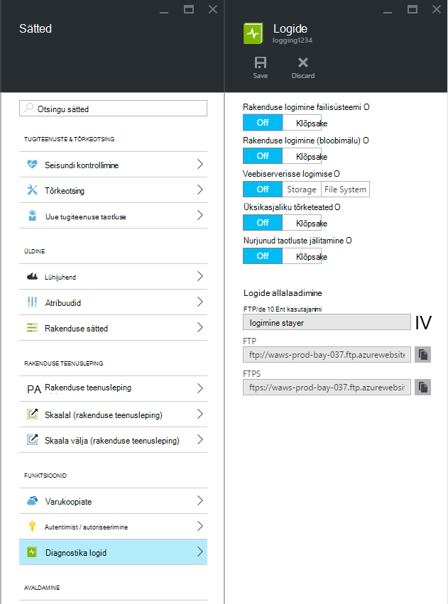
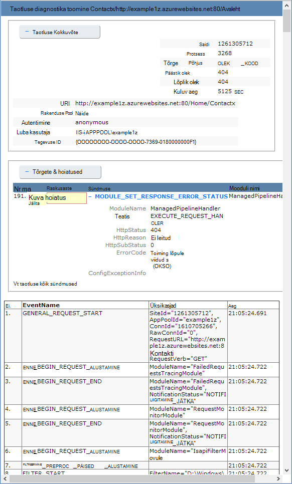

<properties
    pageTitle="Veebirakenduste teenuses Azure rakenduse diagnostika logimise lubamine"
    description="Saate teada, kuidas diagnostikalogimise lubamiseks ja lisada instrumentation rakenduse, samuti, kuidas teave juurdepääsu sisse logitud Azure."
    services="app-service"
    documentationCenter=".net"
    authors="cephalin"
    manager="wpickett"
    editor="jimbe"/>

<tags
    ms.service="app-service"
    ms.workload="na"
    ms.tgt_pltfrm="na"
    ms.devlang="na"
    ms.topic="article"
    ms.date="06/06/2016"
    ms.author="cephalin"/>

# Veebirakenduste teenuses Azure rakenduse diagnostika logimise lubamine

## Ülevaade

Azure'i pakub sisseehitatud diagnostika aidata silumine [rakenduse teenuse web appi](http://go.microsoft.com/fwlink/?LinkId=529714). Selles artiklis saate teada, kuidas diagnostikalogimise lubamiseks ja lisada instrumentation rakenduse, samuti, kuidas teave juurdepääsu sisse logitud Azure.

Selles artiklis kasutab [Azure portaali](https://portal.azure.com), Azure PowerShelli ja Azure käsurea liides (Azure'i CLI) diagnostikalogid töötamiseks. Visual Studio abil diagnostikalogide töötamise kohta leiate teemast [Tõrkeotsing Azure'i Visual Studios](web-sites-dotnet-troubleshoot-visual-studio.md).

[AZURE.INCLUDE [app-service-web-to-api-and-mobile](../../includes/app-service-web-to-api-and-mobile.md)]

## Web serveri diagnostika- ja rakenduse diagnostika

Rakenduse teenuse veebirakenduste, annab veebiserver nii veebirakenduse logiteabe diagnostika funktsioonid. Need on loogiliselt jagatud **web serveri diagnostika** - ja **rakenduse diagnostika**.

### Web serveri diagnostika

Saate lubada või keelata järgmist tüüpi logid:

- **Tõrke üksikasjalik logimine** - tõrke üksikasjalik teave HTTP olek koode, mis tähistavad tõrke (olekukoodi 400 või suurem). See võib sisaldada teavet, mis aitab kindlaks teha, miks server tagastas tõrkekoodi.
- **Nurjus taotluse jälitamine** - üksikasjalikku teavet nurjunud taotlusi, sh IIS-i komponendid kasutada taotluse ja iga komponendi kulunud aja jälgi. See võib olla kasulik, kui proovite saidi jõudluse suurendamine või eristada, mis võib põhjustada teatud HTTP tõrge tagastatakse.
- **Web serveri logimine** - teavet HTTP kannete [W3C laiendatud logifaili vormingut](http://msdn.microsoft.com/library/windows/desktop/aa814385.aspx). See on kasulik, kui määratlemine üldine saidi mõõdikute näiteks töödeldud taotluste või mitu taotlused teatud IP-aadress on arv.

### Rakenduse diagnostika

Rakenduse diagnostika võimaldab teil jäädvustada veebirakenduse andmed. ASP.net-i rakendusi saate kasutada [System.Diagnostics.Trace](http://msdn.microsoft.com/library/36hhw2t6.aspx) logige teavet rakenduse diagnostika Logi. Näiteks:

    System.Diagnostics.Trace.TraceError("If you're seeing this, something bad happened");

Käitusajal saate tuua need logid aidata tõrkeotsing. Lisateabe saamiseks vt [tõrkeotsing Azure'i veebirakenduste Visual Studios](web-sites-dotnet-troubleshoot-visual-studio.md).

Rakenduse teenuse veebirakenduste ka Logi juurutamine sisu avaldamisel web appi. See juhtub automaatselt ja juurutamise logimiseks pole konfiguratsiooni sätteid. Juurutamise logimine võimaldab teil määrata, miks juurutamine nurjus. Näiteks kui kasutate juurutamise kohandatud skript, võite kasutada juurutamise logimine määratlemiseks, miks skripti nurjub.

## Kuidas lubada diagnostika

Diagnostika [Azure portaali](https://portal.azure.com)lubamiseks avage tera veebirakenduse jaoks ja klõpsake nuppu **Sätted > diagnostika logid**.

<!-- todo:cleanup dogfood addresses in screenshot -->

Kui lubate **rakenduse diagnostika** valida ka **tase**. See säte võimaldab teil filtreerida **informatiivsed**, **hoiatuse** või **tõrketeate** teabe salvestatud teave. Selle määramine **Paljusõnaline** logib rakenduse kõik andmed.

> [AZURE.NOTE] Erinevalt muutmise fail, ei lubada rakenduse diagnostika või muutmine Logi diagnostika tasemed prügikastis rakenduse domeeni, et rakendus töötab sees.

[Klassikaline portaali](https://manage.windowsazure.com) Web Appi **konfigureerimine** vahekaardil saate valida **salvestusruumi** või **veebiserverisse logimise** **failisüsteemis** . Valige **salvestusruumi** võimaldab valida salvestusruumi konto ja seejärel bloobimälu container, mida logid kirjutada. Kõik muud **saidi diagnostika** logid kirjutada ainult failisüsteemis.

[Klassikaline portaali](https://manage.windowsazure.com) Web Appi **konfigureerimine** menüü on ka rakenduse diagnostika täiendavad sätted.

* **Failisüsteemi** - salvestatakse rakenduse diagnostika teave failisüsteemi web app. Neid faile saab juurde FTP või alla Zip Arhiiv Azure PowerShelli või Azure käsurea liides (Azure'i CLI) abil.
* Rakenduse diagnostika teave talletatakse **tabelimälu** - määratud Azure Storage konto ja tabeli nimi.
* Rakenduse diagnostika teave talletatakse **bloobimälu** - määratud Azure Storage konto ja bloobimälu ümbris.
* **Säilitusperiood** - vaikimisi logid pole kustutatakse **bloobimälu**. Valige **säilituspoliitika määramine** ja sisestage logid hoida, kui soovite automaatselt kustutada logid päevade arv.

>[AZURE.NOTE] Kui te [taastada salvestusruumi konto kiirklahvide](storage-create-storage-account.md#view-copy-and-regenerate-storage-access-keys), peate reset vastav logimine konfiguratsiooni värskendatud abil. Soovitud toiming
>
> 1. Vahekaardil **konfigureerimine** seatud vastav logimisfunktsioon **välja**. Salvestage oma säte.
> 2. Luba logimine salvestusruumi konto bloobimälu või tabeli uuesti. Salvestage oma säte.

Suvalist kombinatsiooni failisüsteemi, tabelimälu või bloobimälu saab samal ajal lubada ja on üksikud log taseme konfiguratsioone. Näiteks võite tõrgete ja hoiatuste Bloobivahemälu salvestusruumi logimine pikaajalise lahendusena, võimaldades faili süsteemi logimine taseme Paljusõnaline sisse logida.

Kui kõigi kolme salvestusruumi kohtade logitud sündmusi sama põhiteave, **tabeli salvestus** - ja **bloobimälu** logige täiendavat teavet, nt eksemplari ID-d, sõnumilõime ID ja täpsema ajatempli (rist vorming), kui logimine **failisüsteemis**.

> [AZURE.NOTE] Andmed salvestatakse **tabelimälu** või **bloobimälu** pääseb ainult salvestusruumi kliendi või rakendus, mida saate töötada otse tarvilikud salvestusruumi abil. Näiteks Visual Studio 2013 sisaldab salvestusruumi Explorer, tabel või bloobimälu salvestusruumi avastamiseks kasutatavate ja Hdinsightiga pääsevad bloobimälu talletatavad andmed. Samuti saate kirjutada rakendus, mis kasutab Azure Storage, kasutades ühte järgmistest [Azure'i SDK-d](/downloads/#).

> [AZURE.NOTE] Diagnostika saab lubada ka: Azure'i PowerShelli cmdlet-käsu **Set-AzureWebsite** abil. Kui olete installinud Azure PowerShelli või ei ole konfigureeritud seda kasutada Azure tellimuse kohta leiate teemast [Azure PowerShelli kasutamine](/develop/nodejs/how-to-guides/powershell-cmdlets/).

##Kuidas: logid allalaadimine

Salvestatud web appi failisüsteemi diagnostikateave pääseb otse FTP abil. Samuti saate alla laadida nimega Zip-arhiivist Azure PowerShelli või Azure käsurea liides.

Kataloogide struktuur, mis on talletatud logid on järgmine:

* **Logid** - /LogFiles/rakendus /. See kaust sisaldab ühe või mitme rakenduse logimine andmed sisaldavad tekstifailidest.

* **Taotluse jälgi nurjus** - / LogFiles/W3SVC ### /. See kaust sisaldab XSL-faili ja üks või mitu XML-failid. Veenduge, et laadida xsl-fail sama kataloogi nagu XML-i d failid, kuna xsl-fail pakub funktsiooni vormingu ja XML-i failid Internet Exploreris vaatamisel sisu filtreerimiseks.

* **Üksikasjalikud Tõrkelogide** - /LogFiles/DetailedErrors /. See kaust sisaldab ühe või mitme .htm failid, mille olulisel teavet ilmnenud HTTP tõrgete kohta.

* **Web logid** - /LogFiles/http/RawLogs. See kaust sisaldab ühe või mitme tekstifailid vormindatud [W3C laiendatud logifaili vormingut](http://msdn.microsoft.com/library/windows/desktop/aa814385.aspx).

* **Juurutamise logid** - / LogFiles/Git. See kaust sisaldab sisemine juurutamine protsessid kasutavad veebirakendusi Azure genereeritud logide, samuti Git juurutuste logib.

### FTP

Diagnostikateave FTP kaudu juurdepääsemiseks külastage **armatuurlaua** oma veebirakenduse [klassikaline portaalis](https://manage.windowsazure.com). **Kiire ülevaade** jaotises kasutada **FTP diagnostika logid** link logifailide FTP abil. **Juurutamise/FTP kasutaja** kirje on loetletud kasutaja nimi, mida tuleks kasutada FTP saidi.

> [AZURE.NOTE] Kui **Juurutamise/FTP kasutaja** kirje on seatud või olete selle kasutaja parooli unustanud, saate luua uus kasutaja ja parooli abil **kiire ülevaade** jaotises **armatuurlaua** **juurutuse identimisteabe lähtestamine** link.

### Azure'i PowerShelliga alla laadida

Logifailide allalaadimiseks Azure PowerShell uue seansi käivitamine ja kasutage järgmist käsku:

    Save-AzureWebSiteLog -Name webappname

See säästab logid määratud veebirakenduse jaoks soovitud **-nime** parameetri faili nimega **logs.zip** praegust kausta.

> [AZURE.NOTE] Kui olete installinud Azure PowerShelli või ei ole konfigureeritud seda kasutada Azure tellimuse kohta leiate teemast [Azure PowerShelli kasutamine](/develop/nodejs/how-to-guides/powershell-cmdlets/).

### Azure'i käsurea kasutajaliidese allalaadimine

Azure'i käsk rea liidest kasutades logifailide allalaadimiseks avage uus Käsuviip PowerShelli Bash või Terminal seansi ning sisestage järgmine käsk:

    azure site log download webappname

See säästab web app nimega "webappname" faili nimega **diagnostics.zip** praegust kausta logid.

> [AZURE.NOTE] Kui olete installinud Azure'i käsurea liides (Azure'i CLI) või pole konfigureeritud seda kasutada Azure tellimuse, vaadake, [Kuidas kasutada Azure CLI](../xplat-cli-install.md).

## Kuidas: View logitakse rakenduse ülevaated

Visual Studio rakenduse ülevaated annab teie käsutusse tööriistad, filtreerimine ja logid otsimine ja tõestusmeetodid logid taotlused ja muid sündmusi.

1. Rakenduse ülevaateid SDK lisamine projekti Visual Studios.
 * Solution Exploreris projekti paremklõps ja valige käsk Lisa rakenduse ülevaated. Teid juhendatakse juhised, mis sisaldavad loomise on rakenduse ülevaated ressurss. [Lisateave](../application-insights/app-insights-asp-net.md)
2. Jälita kuulajale paketi lisamine projekti.
 * Paremklõpsake oma projekti ja valige käsk Halda NuGet-paketid. Valige `Microsoft.ApplicationInsights.TraceListener` [Lisateavet](../application-insights/app-insights-asp-net-trace-logs.md)
3. Laadige oma projekti ja käivitage see logiandmed loomiseks.
4. Otsige sirvides üles oma uue rakenduse ülevaated ressursi [Azure portaali](https://portal.azure.com/)ja avage **Otsing**. Kuvatakse andmete Logi koos kasutus- ja muude telemeetria taotlus. Mõned telemeetria võib kuluda mõni minut jõuda: klõpsake nuppu Värskenda. [Lisateave](../application-insights/app-insights-diagnostic-search.md)

[Lisateavet rakenduse ülevaated jälituse jõudlus](../application-insights/app-insights-azure-web-apps.md)

##Kuidas: voona logid

Samal ajal rakenduse arendamine on sageli kasulik logiteabe lähedal reaalajas näha. Seda saab teha streaming edastada oma arenduskeskkond Azure PowerShelli või Azure käsurea liides.

> [AZURE.NOTE] Teatud tüüpi logimine puhvri kirjutada logifaili, mis võib põhjustada vales järjestuses sündmuste voos. Näiteks võidakse kuvada rakenduse Logi kirje, mis ilmneb siis, kui kasutaja külastamine lehe voo enne vastavate HTTP logikirjet lehe kutse.

> [AZURE.NOTE] Log streaming ka voona kirjutada mis tahes tekstifail, mis on talletatud teabe soovitud **D:\\home\\LogFiles\\ ** kausta.

### Streaming Azure PowerShelli abil

Voona logiteabe, Azure PowerShell uue seansi käivitamine ja kasutada järgmine käsk:

    Get-AzureWebSiteLog -Name webappname -Tail

See loob ühenduse määratud veebirakenduse soovitud **-nime** parameetri ja alustage streaming PowerShelli akna teavet sündmuste logi ilmnemisel web Appile. Failid, mille nimi lõpeb .txt, .log või .htm /LogFiles kataloogis (d:/Avaleht/logfiles) kirjutatud teavet kuvatakse voona kohaliku konsooli.

Filtreerida teatud sündmuste, nt tõrgete, kasutage funktsiooni **– sõnumi** parameeter. Näiteks:

    Get-AzureWebSiteLog -Name webappname -Tail -Message Error

Filtreerida teatud log tüüpi, näiteks HTTP, kasutage funktsiooni **-tee** parameeter. Näiteks:

    Get-AzureWebSiteLog -Name webappname -Tail -Path http

Saadaval teed loendi kuvamiseks kasutage parameetrit - ListPath.

> [AZURE.NOTE] Kui olete installinud Azure PowerShelli või ei ole konfigureeritud seda kasutada Azure tellimuse kohta leiate teemast [Azure PowerShelli kasutamine](/develop/nodejs/how-to-guides/powershell-cmdlets/).

### Azure'i käsurea liides voogesitus

Voona logiteabe, avage uus Käsuviip PowerShelli Bash või seansi Terminal ja sisestage järgmine käsk:

    azure site log tail webappname

See ühenduse web app nimega "webappname" ja alustage streaming akna teavet sündmuste logi ilmnemisel web Appile. Failid, mille nimi lõpeb .txt, .log või .htm /LogFiles kataloogis (d:/Avaleht/logfiles) kirjutatud teavet kuvatakse voona kohaliku konsooli.

Filtreerida teatud sündmuste, nt tõrgete, kasutage funktsiooni **--Filter** parameeter. Näiteks:

    azure site log tail webappname --filter Error

Filtreerida teatud log tüüpi, näiteks HTTP, kasutage funktsiooni **--tee** parameeter. Näiteks:

    azure site log tail webappname --path http

> [AZURE.NOTE] Kui olete installinud Azure'i käsurea liides või pole konfigureeritud seda kasutada Azure tellimuse, vaadake, [Kuidas soovite kasutada Azure käsurea liides](../xplat-cli-install.md).

##Kuidas: mõista diagnostika logid

### Diagnostika logid

Rakenduse diagnostika talletatud teabe .NET rakenduste, olenevalt sellest, kas talletada logid failisüsteemi, tabelimälu või bloobimälu kindlas vormingus. Base talletatud andmed on sama üle kõik salvestusruumi kolmeks – kuupäev ja kellaaeg sündmusele, toodeti sündmus, sündmuse tüüp (teave, hoiatus, tõrge) ja sündmuse sõnumi protsessi ID-d.

__Failisüsteemis__

Iga rida logitud failisüsteemi või vastuvõetud streaming tuleb järgmises vormingus:

    {Date}  PID[{process id}] {event type/level} {message}

Näiteks sündmuse tõrge ilmneb järgmine:

    2014-01-30T16:36:59  PID[3096] Error       Fatal error on the page!

Logimise failisüsteemi pakub kõige põhiteabe saadaval kolm võimalust, pakkudes ainult kellaaja, protsessi id, sündmuse tase ja sõnum.

__Tabelimälu__

Tabelimälu sisselogimisel kasutatakse täiendavad atribuudid hõlbustamiseks otsimise tabeli kui ka sündmuse kohta täpsema teabe talletatud andmed. Iga üksuse (rida) talletatud tabelis kasutatakse järgmisi atribuute (veerge).

Atribuudi nimi|Väärtus/vormindamine
---|---
PartitionKey|YyyyMMddHH vormingus sündmuse kuupäev/kellaaeg
RowKey|GUID väärtus, mis tuvastab kordumatult see üksus
Ajatempli|Kuupäeva ja kellaaja sündmusele
EventTickCount|Kuupäeva ja kellaaja sündmusele rist-vormingus (suurema täpsusega)
ApplicationName|Web app nimi
Tase|Sündmuse tase (nt tõrge, hoiatus, teave)
EventId|Sel juhul sündmuse ID-d

Vaikeväärtus on 0, kui määratud pole
InstanceId|Veebirakenduse, mis isegi toimus eksemplari
PID|Protsessi ID
Tid|Teema, mis toodeti sündmuse jutulõnga ID-d
Sõnumi|Sündmuse üksikasjade sõnumi

__Bloobimälu__

Logimise Bloobivahemälu salvestusruumi, talletatakse andmeid komaga eraldatud väärtuste (CSV) vormingus. Sarnane tabelimälu, logitakse lisaväljade sündmuse kohta täpsema teabe. CSV iga rea puhul kasutatakse järgmised atribuudid:

Atribuudi nimi|Väärtus/vormindamine
---|---
Kuupäev|Kuupäeva ja kellaaja sündmusele
Tase|Sündmuse tase (nt tõrge, hoiatus, teave)
ApplicationName|Web app nimi
InstanceId|Klõpsake sündmusele veebirakenduse eksemplari
EventTickCount|Kuupäeva ja kellaaja sündmusele rist-vormingus (suurema täpsusega)
EventId|Sel juhul sündmuse ID-d

Vaikeväärtus on 0, kui määratud pole
PID|Protsessi ID
Tid|Teema, mis toodeti sündmuse jutulõnga ID-d
Sõnumi|Sündmuse üksikasjade sõnumi

Mõne bloobimälu talletatud andmed näeks umbes järgmine:

    date,level,applicationName,instanceId,eventTickCount,eventId,pid,tid,message
    2014-01-30T16:36:52,Error,mywebapp,6ee38a,635266966128818593,0,3096,9,An error occurred

> [AZURE.NOTE] Selles näites on kujutatud Logi esimene rida sisaldab veerupäiste.

### Taotluse jälgi nurjus

Nimega __fr ## .xml__XML-failid talletatakse jälgi taotlus nurjus. Oleks lihtsam logitud teabe kuvamiseks, XSL-i laadileht, mis nimega __freb.xsl__ on toodud XML-failidena samas kaustas. XML-failide avamine Internet Exploreris kasutada XSL-laadileht vormindatud Kuva Jälita teavet pakkuda. See kuvatakse järgmine:

### Tõrke üksikasjalik logid

Tõrke üksikasjalik logid HTML-dokumentidest, mis HTTP ilmnenud tõrgete kohta täpsemat teavet. Kuna need on lihtsalt HTML-dokumentidest, ta saab vaadata veebibrauseris.

### Web logid

Web logid on vormindatud [W3C laiendatud logifaili vormingut](http://msdn.microsoft.com/library/windows/desktop/aa814385.aspx). Seda teavet lugeda tekstiredaktoris või sõeluda Utiliidid nagu [Log parseri](http://go.microsoft.com/fwlink/?LinkId=246619)kasutamine.

> [AZURE.NOTE] Azure'i veebirakenduste toodetud logid ei toeta __s-arvutinimi__, __s-ip__või __cs versiooni__ väljad.

##Järgmised sammud

- [Kuidas jälgida Web Apps](/manage/services/web-sites/how-to-monitor-websites/)
- [Azure'i veebirakenduste Visual Studio tõrkeotsing](web-sites-dotnet-troubleshoot-visual-studio.md)
- [Analüüsi veebirakenduse logib Hdinsightiga](http://gallery.technet.microsoft.com/scriptcenter/Analyses-Windows-Azure-web-0b27d413)

> [AZURE.NOTE] Kui soovite alustada Azure'i rakendust Service enne Azure'i konto kasutajaks, minge [Proovige rakenduse teenus](http://go.microsoft.com/fwlink/?LinkId=523751), kus saate kohe luua lühiajaline starter web app rakenduse teenus. Nõutav; krediitkaardid kohustusi.

## Mis on muutunud
* Muuda juhend veebisaitide rakenduse teenusega leiate: [Azure'i rakendust Service ja selle mõju olemasoleva Azure'i teenused](http://go.microsoft.com/fwlink/?LinkId=529714)
* Vana portaali uue portaali muutmine juhendi leiate: [viide Azure portaali navigeerimiseks](http://go.microsoft.com/fwlink/?LinkId=529715)
 
