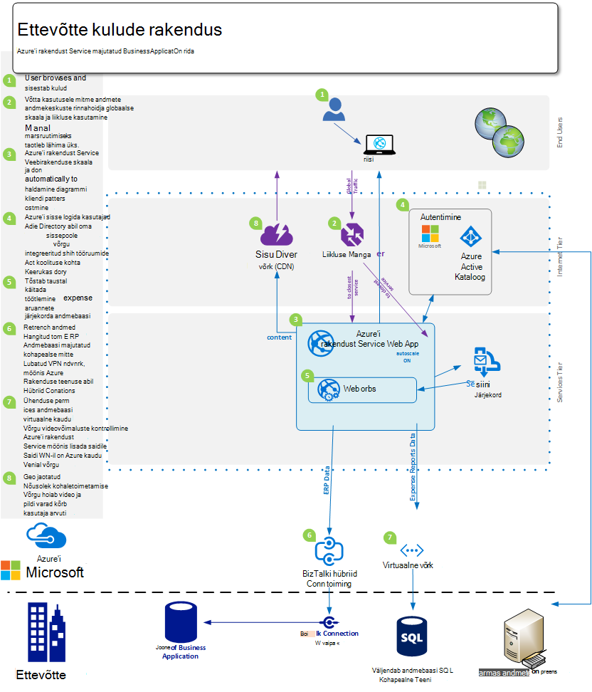
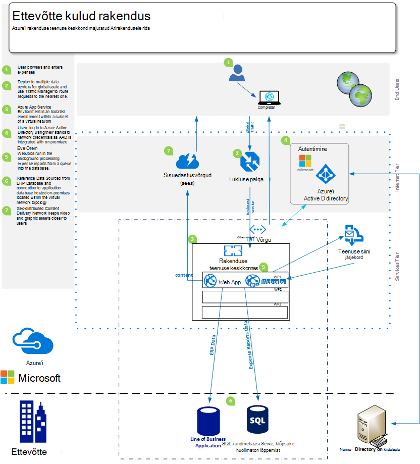
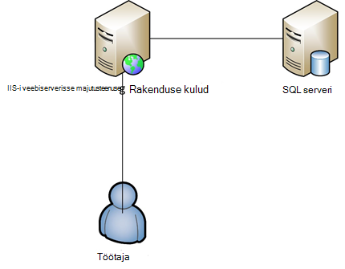

<properties 
    pageTitle="Azure'i rakenduse Web Apps raames pakutav teenus Enterprise'i jaoks" 
    description="Näitab, kuidas luua ettevõtte veebisaidi lahendused teie ettevõttele Azure'i rakenduse teenuse veebirakenduste abil" 
    services="app-service\web" 
    documentationCenter="" 
    authors="apwestgarth" 
    manager="wpickett" 
    editor=""/>

<tags 
    ms.service="app-service-web" 
    ms.workload="web" 
    ms.tgt_pltfrm="na" 
    ms.devlang="na" 
    ms.topic="article" 
    ms.date="07/29/2016" 
    ms.author="anwestg"/>

# Azure'i rakenduse Web Apps raames pakutav teenus for Enterprise lühiülevaade #

Vajate kulude vähendamiseks ja esitamisel lahenduste kiirem kiiresti muutuvate keskkonnas loob uusi probleeme arendajad, IT-spetsialistid ja haldurid. Kasutajad otsivad järjest rea Business (LOB) veebirakendustega kiire, reageeri ja mis tahes seadme kaudu saadaval olla. Samal ajal ettevõtted üritavad tootlikkuse ja tõhusust, mis pärineb integreerimine pilve ja mobiilside, see võib olla midagi sama lihtne kui ühekordse sisselogimise kõigis seadmetes Active Directory abil koostöö Teenusekomplektis Office 365 abil andmete tõmmatakse sisemise LOB rakendus, mis omakorda tõmbab Salesforce'i rakendamine ettevõtte andmeid. [Azure'i rakenduse teenuse Web Apps](http://go.microsoft.com/fwlink/?LinkId=529714) on äriklassi pilveteenusesse, arendamise, katsetamine ja töötab web ning mobiilirakenduste, veebi-API-d ja veebilehed üldise. Seda saab kasutada ettevõtete veebilehed, sisevõrgu saidid, ärirakendusi ja digitaalse turunduskampaaniate käivitamiseks globaalne võrgustik andmekeskuste optimeeritud skaala ja kättesaadavus koos tugi pidev integratsioon ja kaasaegse DevOps tavade.  

Selle lühiülevaade tõstab esile võimaluste [Veebirakenduste](/services/app-service/web/) teenuse spetsiaalselt värskendustest LOB veebirakendusi, mis hõlmab olemasolevate veebirakenduste migreerimine ja uue LOB web rakenduste platvormi töötab. 

## Sihtrühma ##

IT-spetsialistidele, arhitektid ja kes soovivad migreerimine pilve web töökoormus töötavad kohapealse. Web töökoormus võib hõlmata kas Business töötajale või partnerite veebirakenduste Business.

## Sissejuhatus ##

Rakenduse teenuse Web Apps on aluseks majutada nii sise- ja veebirakenduste ja teenuseid, nagu pakub kuluefektiivseid, väga paindlik, hallatava lahenduse saate keskenduda pakkuda ettevõtte väärtus kasutajate asemel kulutuste märkimisväärset palju aega ja raha haldamine ja toetavad eraldi keskkonnas. Web Apps pakub paindlik platvorm, kus juurutada oma ettevõtte veebirakendusi, pakkudes võimalust jätkata autentimiseks kohapealse Active Directory kaudu integreerimine Microsoft Azure Active Directory toetavad tegemine kiire ja lihtne kasutuselevõttu kasutada oma sisemise pidev integratsioon ja juurutamise tavad, samas automaatselt skaleerimist kasvab ärivajaduste – kõik hallatavate platvormil, mis võimaldab teil keskenduda rakenduse ja pole taristule. 

## Probleemi määratlemine ##

IT horisontaalpaigutus muutmine kiiresti liikuda eemale hosting traditsiooniline serverites oma kõrge omakapitali kulud pikki üks, mis kasutab nõudmisel kasutamine mastaapimiseks automaatselt käsitlema laadi teenuste kohta. IT-osakondade on taasavamiseks maksumuse ja taristu jalajälje vähendamiseks ja hooldus veedavad keskendudes vähendamise investeeringute suurendades ka agility. Kasutuselt kõrvaldatud vanemate taristu platvormide, näiteks Windows Server 2003, viib see osakondade pilveteenusesse migreerimiseks võimalikud nii, et vältida uus pikaajaline omakapitali kulud üle vaadata. Varem CIOs oleks otsuste ostmiseks muu osakondades; siiski järjest CMOs- ja muude business ühiku manustama võtab rohkem aktiivset, kuidas oma eelarvet, ja mis on nende investeeringutasuvuse. Järjest, peate ettevõtetele oma töötajate olema palju ühendatud töötajaga töötamise kaugühenduse teel, veedavad rohkem aega klientidega süsteemide probleemideta tasuta juurdepääsu.

Ettevõtte vajadused muutuvad, iga kuu, iga nädal, iga päev. Ettevõtted otsivad kiirsõnumite globaalne tavaline täielik uusi funktsioone, ettevõttesiseselt või muu tootja värskendatud teenuste skaala.  Mõnel juhul ettevõtetele otsin eristada nende rakenduste ja juurdepääsu ressursid samal ajal ka muuta võimaluste kasutamine avaliku pilve. Kasutajatel on suurem ootustele, paljude, kes kasutavad oma eraelu, nt Office365 teenuseid koos. Need oodata on sarnane, ajakohane, funktsioon rikas teenustele juurdepääsu oma töö elu. See vajadusel toimetulekuks vaatama aitab äri valiku piires lubamiseks ja kolmanda osapoole integreerimine teenuseid, platvormid, mis saab kohandada ärivajaduste, olles usaldusväärne vähendatud maksumus omandiõiguse samas õige valik.

Arendusmeeskondadel otsivad esitamisel kohe business kasu, pakkuda pidevalt uusi funktsioone. Otsitakse tõhus, usaldusväärseid platvormi, mis ühendab olemasoleva tööriistad ja juhistega – arengu, test, vabastage; ja IT-osakondade koostööd automatiseerib juurutamine, haldus ja kõik null tööseisakute eesmärgiga teavitamine.

<a href="highlevel" />
## Kõrge taseme lahendus ##

Web platvormid ning raamistiku järjest kasutatakse arendamise, katsetamine ja läbiviimine ärirakenduste.  Tüüpilised joonega business rakenduse, näiteks ettevõtte töötaja kulude system, sageli, mis on web app koos rakendusega ühendatud andmete talletamiseks andmebaasi varundamise.

Rakenduse teenuse Web Apps on hea valik hosting selliseid rakendusi, pakkudes skaleeritav ja usaldusväärne taristu, mis on hallatavad ja paigatud koos null manuaalset ja tööseisakute lähedal. Microsoft Azure'i platvormi annab paljude andmete talletussuvandite veebirakenduste majutatud Web Apps kaudu Microsoft Azure'i SQL-andmebaasi, hallatavate scalable relatsiooniline andmebaasi-kui-a-teenus, meie partnerite ClearDB MySQL-i andmebaas ja MongoDB näiteks populaarsed teenused toetavad.

Alternatiivne lähenemine on teha oma olemasoleva investeeringu kohapealne kasutada. Näide stsenaariumi töötajate kulude süsteemi soovite säilitada oma andmesalve oma sisemise infrastruktuuri sees. See võib olla integreerimiseks sisemise süsteemidega (aruandluse, palgad, arveldus jne) või mõne IT-juhtimise nõue vastavaks.  Web Apps pakub mitmesuguseid viise, mis võimaldab teil ühenduse loomiseks oma sees tööruumide taristu:

- [Rakenduse teenuse keskkonnas](app-service-app-service-environment-intro.md) - rakenduse teenuse keskkonnas (ASE) on uus Premium funktsioon, mis on viimati lisamine Microsoft Azure'i rakenduse teenuse pakkumine.  Praeguseks pakuvad täielikult isoleeritakse-pühendunud keskkonna turvaliselt ei tööta Azure'i rakendust Service rakenduste kõrge samas ka eraldi ja turvaline võrgupääs   
- [Hübriidjuurutuse ühendused](../biztalk-services/integration-hybrid-connection-overview.md) -hübriid ühendused on funktsioon Microsoft Azure'i BizTalki teenuste ja veebirakenduste ühenduse loomiseks kohapealse ressursid turvaliselt, näiteks SQL Server, MySQL-i, veebi-API-d ja kohandatud web services lubamine. 
- [Virtuaalse võrgu integreerimine](https://azure.microsoft.com/blog/2014/09/15/azure-websites-virtual-network-integration/) – veebirakendustes integreerimine Azure virtuaalse võrgu võimaldab teil oma veebirakenduse ühenduse Azure virtuaalse võrgu, mis omakorda võib ühendada oma sees tööruumide taristu VPN saitide kaudu. 

Järgmisel skeemil kujutatakse näide üksikasjalik lahenduse ühenduvuse võimalusi tööruumid ressursid.  Esimene näide näitab, kuidas seda saavutada standardsed funktsioonid Azure'i rakenduse teenuse kasutamise ja teine näitab, kuidas see saab kasutades lisatasu pakkuv rakenduse teenuse keskkonnas.

Standardse rakenduse teenuse funktsioonide abil:

Kasutades rakendust Service keskkonnas:

## Eelised ettevõtetele ##

Rakenduse teenuse Web Apps pakub mitmeid business eeliseid, mis võimaldavad palju ja dünaamilised ettevõtte vajadustele pakkuda oma funktsioon. 

### PaaS mudel ###

Kui teenus mudelit, mida pakub mitmesuguseid maksumuse ja tõhusust säästude on rakenduse teenuse Web Apps ehitatud platvormi.  Enam peate tundide haldamine VMs, lappimine operatsioonisüsteemide ja raamistiku. Web Apps on automaatselt paigatud keskkond, mis võimaldab teil keskenduda pole VMs, jättes meeskondadel esitada väärtusega täiendav tasuta ja veebirakenduste haldamine.

PaaS mudeli aluseks veebirakenduste võimaldab spetsialistide DevOps meetodite oma eesmärke täita. Äri Järelikult täielik haldus ja integreerimise rakendus kogu toote elutsükli, sh arengu, katsetada, väljaanne, jälgimise ja halduse ja tugi. 

Arendusmeeskondadel, saate Visual Studio Team Services, GitHub, TeamCity, Hudson või BitBucket, automatiseeritud koostamine, testimine ja juurutamise lubamine Väljalaske kiirem tsüklit samal ajal vähendada hõõrdumist kaasatud olemasoleva infrastruktuuri vabastamine olema konfigureeritud pidev integratsioon ja juurutamise töövood. Web Apps ka toetab mitut testimine ja lavastus keskkonnas väljaanne töövoo jaoks luua, enam peate reserveerida või riistvara eesmärgil eraldada, saate luua nii palju keskkonnas, kui soovite ja määratleda oma edutamine töövoo versioon. Otsustate võib andmeallika juhtelemendi testi pesa vabastamine, mitu kontrollib ja edukaks äri edendada etapi pesa ning lõpuks Vaheta mis pole tööseisakute lisatud kasu veebirakenduste majutatud Web Apps on eellaaditud ning kuum esitada kõige võimaliku klientide programmikasutuskogemuse.  Lisaks ettevõtted saavad kasutada testimine tootmisvõimsust rakenduse teenuse Web Appsi rakenduses suunaks liikluse erinevaid pesa osa, kinnitage enne aktiveerida kogu liikluse uue juurutamise ega taastamist kogu liikluse eelmise juurutamise soovitud muudatused. 

Toimingute meeskondadel võite olla kindel, et need on kõige paremini võimalik asukoht reageerida probleemidest, mis tahes veebirakendustega majutatud Web Apps koos sisseehitatud funktsioonid jälgimise ja teatised. Peaks toimingute meeskonnad on juba investeerida analüüsi- ja sellised Microsoft Visual Studio rakenduse ülevaated, reliikvia uus ja AppDynamics jälgimisega seotud lahendused. Need on ka täielikult toetatud lubamisega järjepidevuse ja tuttavad keskkonnas, millest soovite jälgida oma veebirakenduste veebirakenduste kohta.

Lõpuks veebirakenduste pakub funktsiooni automaatselt varundada oma minirakendust ja majutatud andmebaase suunata ka Azure'i bloobimälu ümbrises. Teile pakkuda lihtne viis ja väga kulude tõhus meetod, mille abil taastada katastroofi vähendamine kompleksarvu tööruumide riistvara ja tarkvara.

### Migreerimise hõlpsamaks ###

Riistvara hooldus ja pööre on klahv probleemi ettevõtetele kiirendamiseks väljaanne tsüklid riistvara ja operatsioonisüsteemid. Võib-olla on teil mitu Windows Server 2003 R2 serverites, mis tulevad tugi 2015 lõpuni, kuid nad on endiselt hosting võtme veebirakenduste oma ettevõtte jaoks? Rakenduse teenuse Web Apps on hea testversiooni, kus majutada nende veebirakenduste ja teile tõhustada ärirakenduses riistvaralise kinnisvara. Web Apps kaudu pääsete juurde mitmesuguseid riistvara tehnilised andmed, mis haldavad ja teenuse, ei pea tegur asendamine- ja halduskulud taristu eelarve osana osana säilitada.  Migreerimise saate olla lihtsad, sisaldades koopia ja kleepige oma olemasoleva juurutuse toimingu veebirakenduste või keerukamaid migreerimise kus Web Appsi migreerimise abimehe abil lisab väärtust. Migreeritud veebirakenduste nautida veebirakenduste täiendavate teenuste integreerimine Azure teenuste täielik dokumendialase. Näiteks võite kaaluda lisamine Azure Active Directory põhjal kasutajate ühendus lisamine rakenduse juurdepääsu reguleerimine. Teine näide lisamise saate parandada jõudlust ning latentsuse vähendada, pakkudes vahemälu teenuste üldist parem kasutuskogemus. 

### Ettevõtte klassi majutusteenuse ###

Rakenduse teenuse Web Apps pakub ühed, usaldusväärseid platvormi, mis on tõendada, on võimalik teha mitmesuguseid business peab väike sisemine Arendus ja testimine teenustest, mastaabitud väga kõrge liikluse veebisaitide. Veebirakenduste abil saate kasutavad sama ettevõte klassi hosting platvormi Microsofti kui ettevõte kasutab kõrge väärtus web töökoormus. Veebirakenduste koos kõigi teenuste Azure'i platvormil, on ehitatud turvalisus ja nõuetele vastavust; näiteks ISO (ISO/IEC 27001: 2005); SOC1 ja SOC2 SSAE 16/ISAE 3402 hilisemaks, HIPAA BAA, PCI ja Fedramp keskmes väga iga element ja funktsioonide kohta lisateabe saamiseks lugege teemat [http://aka.ms/azurecompliance](/support/trust-center/compliance/). 

Microsoft Azure'i platvormi võimaldab rolli vastavalt autoriseerimine juhtelementide lubamine enterprise tasemed juhtelemendi veebirakenduste ressursse. RBAC annab suurettevõtete rakendada oma Accessi teabehalduspoliitikate kõigi nende varade Azure keskkonnas, kasutajate määramine rühmadesse ja omakorda vajalike õiguste määramine nende rühmade suhtes varade näiteks web appi. Azure RBAC kohta leiate lisateavet teemast [http://aka.ms/azurerbac](../active-directory/role-based-access-control-configure.md). Kasutades veebirakenduste, võib olla kindel, et teie veebirakenduste juurutatud turvalise keskkonna ja teil on täielik kasutusõigus, mis saabunud oma varasid juurutatud. 

Azure'i rakenduse teenuse keskkonnas [http://aka.ms/aseintro](http://aka.ms/aseintro) on uus premium teenuse leping võimalus ettevõtte klientidele, kes soovivad Azure'i rakenduse teenust kasutada ning need on täielikult eraldatud ja pühendunud keskkond on.  See võimaldab ettevõtte kliendid juurutada rakendused, mida saate ära väga kõrge skaala samal ajal ka võttes sissetulevate ja väljaminevate võrguliiklust üle täielik kontroll ja praeguseks lubada rakendused on kiire turvalist ühendust üle virtuaalse võrgu kohapealse ressurssidele.

Rakenduse teenuse veebirakenduste saavad kasutada täielikult oma sees tööruumide investeeringute pakkudes võimalus ühenduse uuesti oma sisemise ressursse, nt andmebaas või SharePointi keskkonnas. Nagu on kirjeldatud [kõrge lahenduse](#highlevel) saate kasutada hübriid ühendused ja virtuaalse võrguühendus ühenduste tööruumide taristu ja teenuste loomiseks.

### Globaalne skaala ###

Rakenduse teenuse Web Apps on üld- ja scalable platvormi, mis võimaldab teie veebirakenduste kasvada ja kiiresti minimaalsete pikaajaline plaanimine ja maksumus koos kasvab ettevõtte vajadustele kohandada. Tüüpilised tööruumide taristu stsenaariumid, laiendamise ja vajadusel suurenemine nii kohalikult ja geograafiliselt oleks suurt hulka haldus, kavandamise ja kulud sätte nõua ja täiendavad taristu haldamise. Web Apps pakub võimalust mastaapimiseks oma veebirakenduste mõõn ja kulgemist teie vajadustele. Enamik kuu näiteks, näiteks kulud rakenduse abil kasutajate on hele kasutajate rakenduse, kuid tähtaja kulude edastuste tuleb sisestada iga kuu ja kasutus suureneb oma taotlus, veebirakenduste on võimalus automaatselt ettevalmistamise rohkem taristu rakenduse ja seejärel pärast kasutamine taandumist uuesti seda saab skaala tagasi võrdlusalus infrastruktuuri määratlete.

Web Apps on saadaval globaalselt kogu maailmas ja kasvab 24 andmekeskuste. Viimati värskendatud loendi piirkondade ja kohta leiate teemast [http://aka.ms/azlocations](http://aka.ms/azlocations). Web Apps, võite saavutada oma ettevõtte hõlpsalt globaalne REACHi ja skaala. Ettevõtte kasvab uus piirkondadesse, aruandlus rakenduse armatuurlaudade, mida kasutate ja host Web Apps sisse täiendavad andmekeskuste hõlpsalt loovad ja teeni kohaliku kasutajaid palju kiiresti veebirakenduste ja Azure liikluse haldur kõik lisatud kasu scalable infrastruktuuri all on võimalik lepingu ja laiendamine kui piirkondlike büroode muutmine vajab kombinatsiooni.
 
## Lahenduse üksikasjad ##

Vaatame näide on rakenduse migreerimise stsenaariumi. See kirjeldab, kuidas rakenduse teenuse Web Apps uusimaid funktsioone jõudnud koos hea lahenduse ja ettevõtte väärtus üksikasjad.
 
Kogu selles näites me ei arutada ärirakendusele on oluline kuluaruande rakendus, mis võimaldab esitada oma kulude hüvitamine töötajad. Rakendus on majutatud Windows Server 2003 R2 töötab IIS6 ja andmebaas on SQL Server 2005 andmebaasi. Põhjus, miks valisime vanemate serveri rahuldamine järgmistel SQL Server 2005 ja Lõpeta, teenuse Windows Server 2003 R2 on ja meil [ja [juhised](http://aka.ms/websitesmigrationresources) automaatselt migreerida töökoormus Azure'i sisse](http://aka.ms/websitesmigration) . Seda silmas pidades, rakendada mudelit, mis on selles näites kasutatakse kummilehti migreerimise stsenaariumid. 

### Olemasoleva rakenduse migreerimine ###

Etapp teisaldamine ärivaldkonna rakenduse veebirakenduste üldine lahendus on olemasoleva rakenduse varad ja arhitektuur. ASP.net-i veebirakenduse majutatud ühes IIS-i serveris majutatud eraldi SQL Serveri andmebaas, nagu on näidatud alloleval joonisel on näide selles dokumendis. Töötajad login süsteemi kasutajanime ja parooli abil, need Sisestage kulude üksikasjad ja laadige üles skannitud koopiate lugemisteatised, andmebaasi, iga üksuse kulu. 
 

#### Üksuste silmas pidada? ####

Kui migreerimise rakendus asutusesiseses keskkonnas, võite meeles pidada, mitu veebirakenduste piiranguid. Siin on mõned peamised teemades teadma, kui migreerimine veebirakenduste veebirakenduste ([http://aka.ms/websitesmigrationresources](http://aka.ms/websitesmigrationresources)).

-   Pordi seosed-toetab Web Apps ainult pordi 80 HTTP ja HTTPS-liikluse pordi 443. Kui teie rakendus kasutab mõnda muud porti ja seejärel üks kord viiakse taotluse teeb pordi 443 HTTPS-liikluse ja kasutamisega pordi 80 http. See on sageli ohutu probleem, nagu on tavaline, et juurutustes kasutamine eri pordid selleks, et ületada Kasuta domeeninimede keskkonnas Arendus ja testimine
-   Autentimine – Web Apps toetab anonüümne autentimine vaikimisi ja vormide autentimist rakenduse määratletud. Kui rakendus on integreeritud Azure Active Directory ja ADFS-i ainult pakkuda Web Apps Windowsi autentimist. See on funktsioon, mis on lähemalt kirjeldatud [allpool](http://aka.ms/azurebizapp) 
-   GAC vastavalt assemblereid – veebirakendustes ei võimalda assemblereid abil globaalsesse vahemällu (GAC) juurutust. Seetõttu, kui migreerida rakendus kasutab seda funktsiooni kohapealse, teisaldage koosolekutel rakenduse kausta Prügikast.
-   IIS5 Ühilduvusrežiim – Web Apps ei toeta IIS5 ühilduvusrežiim ja sellisena iga veebirakenduste eksemplari ja kõigi veebirakenduste jaotises ema veebirakenduste eksemplari töötavad sama töötaja protsessi ühes rakenduses rakenduskausta sees.
-   COM teekide – Web Apps kasutamine ei võimalda COM komponendid registreerimise platvormi. Seetõttu kui rakendus on kasutades COM-komponendid, need oleks vaja kirjutatakse üle hallatavat koodi ja rakenduse juurutatud.
-   ISAPI filtrid – ISAPI filtrid saate toetatud Web Apps. Need on vaja rakenduse osana kasutusele võtta ja registreeritud veebirakenduse web.config failis. Lisateavet leiate teemast [http://aka.ms/azurewebsitesxdt](web-sites-transform-extend.md). 

Kui järgmisi teemasid pidanud oma veebirakenduse peaks olema valmis pilv. Ja ärge muretsege, kui mõned teemad on täielikult täidetud, Migreerimistööriista annab parima migreerimise. 

Järgmised sammud migreerimisprotsessi on rakenduse teenuse web app ja Azure SQL-andmebaasi loomiseks. On mitme erineva arvu CPU valdkond veebirakenduste eksemplarid suuruses ja RAM saadaval, saate valida põhinevad teie web rakenduste nõue. Rohkem teavet ja hinnad, vt [http://aka.ms/azurewebsitesskus](/pricing/details/websites/). Samuti näeb Microsoft Azure'i SQL-andmebaasi, et kõik ettevõtte vajadustele erinevate astme teenuse ja jõudluse tasemed nõuete täitmiseks. Lisateavet leiate [http://aka.ms/azuresqldbskus](/pricing/details/sql-database/). Kui loodud, rakenduse App teenuse veebirakenduste, kas FTP või WebDeploy üles laadida ja seejärel liigutage andmebaasi.

Lahendus selle migreerimise kasutab Azure'i SQL-andmebaasi, kuid see on mitte ainult andmebaasi, mis on toetatud Azure. Ettevõtetes teha ka MySQL-i, MongoDB, Azure'i DocumentDB kasutus ja palju muud lisandmooduleid, mida saab osta [Azure'i poe](/marketplace/partner-program/)kaudu. 

Azure'i SQL-andmebaasi loomisel mitmeid määratavaid suvandeid on saadaval kohapealse serverist alla skripti abil [andmete taseme rakenduse eksportimine ja importimine](http://aka.ms/dacpac)mõne olemasoleva andmebaasi loomine olemasoleva andmebaasi importida. 

Kulude rakenduse andmebaas on loodud uue SQL Azure'i andmebaasi loomisega, SQL Server Management Studio ning seejärel käivitage skripti andmebaasiga ühenduse loomisel koostada andmebaasi skeemi ja asustada andmete kohapealse andmebaasist.

Viimane toiming esimesel etapil migreerimise jaoks on vaja ühendusstringi rakenduse andmebaasi uuendamine. Selle saavutamiseks Azure portaali kaudu. Iga web app saate muuta rakenduse teatud sätted, sh mis tahes ühendusstringi kasutavad rakenduse mis tahes kasutatava andmebaasiga ühenduse loomiseks.

### Võimalusi kasutades Azure SQL-andmebaas ###

Azure'i platvormi pakub mitmesuguseid võimalusi kasutades Azure'i SQL-andmebaasi nimega rakenduste esmane veebiandmebaasi, see on erinevate töökoormus st lubamine Kasutage NoSQL lahenduse või lubada platvormi ettevõtte andmete vajadustele. Näiteks ettevõtte võib olla andmeid, mis peavad olema talletatud väljaspool või avaliku cloud keskkonnas ja seetõttu oleks vaadata oma kohapealse andmebaasi kasutada.

#### Tööruumide ressursid Ühenduvus ####
Rakenduse teenuse Web Apps pakub mitmeid võimalusi tööruumid ressursid, nt andmebaase, ühenduse, võimaldades taaskasutuse infrastruktuuri kõrge väärtus. Suvandid on loetletud allpool.

- Rakenduse teenuse keskkonnas eraldatud ja loodud alamvõrgu virtuaalse võrgu, seetõttu lubamine privaatne lõpp-punktid asuvad samas virtuaalse võrgu - [http://aka.ms/appserviceasenetworking](http://aka.ms/appserviceasenetworking) suhelda keskkonnas
- Web Appsi virtuaalse võrgu integreerimine toetab veebirakenduste ja muu Azure virtuaalse kaudu, saate juurdepääsu ressursse, mis töötab teie virtuaalse võrku, mis sees VPN saitide, tööruumide võrku ühendatud võimaldab ühenduvuse otse oma sees tööruumide süsteemide integreerimine.
- Hübriid ühendused on Azure BizTalki teenuste funktsioon ning pakuvad on lihtne viis ühenduse loomiseks üksikute asutusesisese SQL Server, MySQL-i, HTTP Web API-d ja kohandatud Web Services.

#### Ulatuse ja paindlikkust ####

Ettevõtte kasvab oma töötajate kaudu omandamise või loomuliku orgaaniline kasvu, seega peab liiga web rakenduste skaala nende uute nõudmistele täita. Tõepoolest täna on tavaline, et näha on veelgi ümbruses asuvate asuvad meeskondi ja remote töötajad, nt ettevõtete asuvate Ameerika Ühendriigid, Euroopa ja Aasia mobiilsideseadmete müügiga jõustamine paljudel rohkem territooriume. Web Apps on võimalus käsitlema skaala elastne muudatuste mugavalt ja automaatselt.

Rakenduse teenuse Web Apps võimaldab veebirakenduste tuleb konfigureerida mastaapimiseks automaatselt Azure portaali, olenevalt vektorid – ajastatud aegade või CPU hõivatus kaudu. Web Appsi muutmine võimaldab tõhus ja väga paindlik suurem muudatuste kõik äri rakendusi, nagu meie kuluaruande süsteemi turundus veebilehed, mis kõrge plahvatuse liikluse kogemus edendamine lühiajaline veebirakenduste kasutamise jaoks. Lisateavet ja skaleerimist oma veebirakenduste veebirakenduste kasutamise juhised leiate teemast [skaala veebisaitide](web-sites-scale.md).

Lisaks skaleerimise paindlikkust veebirakenduste, võimaldab üldine platvormi mitmesse andmekeskuste ja geograafiliste piirkondade järjepidevuse ja paindlikkust võimalike jaotuse veebirakenduste ning varad kaudu.

## Kokkuvõte ##
Rakenduse teenuse Web Apps pakub paindlik, tõhus reageeri lahendus dünaamiliste kiiresti muutuvate keskkonnas ettevõtte vajadustele. Web Appsi aitab ettevõtetele tootlikkuse suurendamiseks ja tõhus tegemine kasutada hallatavate platvormi tänapäevane DevOps võimaluste ja vähendatud käed haldus, tagades ärifunktsioonide skaala, paindlikkus, turvalisus ja kohapealse varad integreerimine.

## Helistage toiming ##
Lisateavet teenuse Azure rakenduse teenuse veebirakenduste, külastage [http://aka.ms/enterprisewebsites](/services/websites/enterprise/) , kus saate hangitud lisateabe saamiseks ja Logi prooviversiooni juba täna aadressil [http://aka.ms/azuretrial](/pricing/free-trial/) teenust hinnata ja oma ettevõttele kasu avastada üles.

[AZURE.INCLUDE [app-service-web-whats-changed](../../includes/app-service-web-whats-changed.md)]

[AZURE.INCLUDE [app-service-web-try-app-service](../../includes/app-service-web-try-app-service.md)]
 
 
