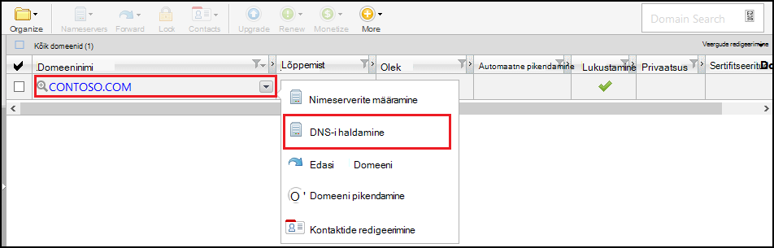
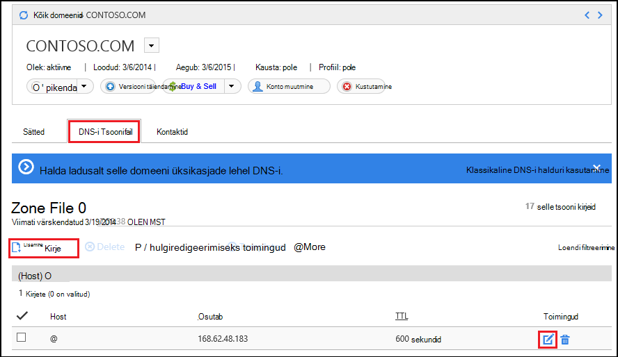
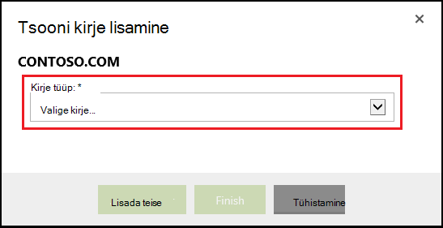
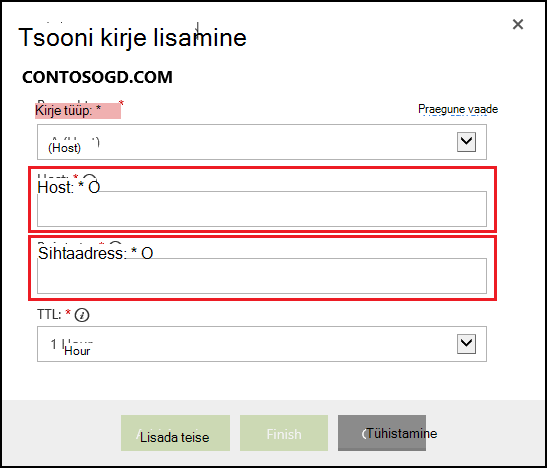

<properties
    pageTitle="Kohandatud domeeninime Azure'i rakendust Service (GoDaddy) konfigureerimine"
    description="Saate teada, kuidas kasutada domeeninime GoDaddy Azure Web Apps"
    services="app-service"
    documentationCenter=""
    authors="erikre"
    manager="wpickett"
    editor="jimbe"/>

<tags
    ms.service="app-service"
    ms.workload="na"
    ms.tgt_pltfrm="na"
    ms.devlang="na"
    ms.topic="article"
    ms.date="01/12/2016"
    ms.author="cephalin"/>

# Kohandatud domeeninime Azure'i rakendust Service (ostetud otse GoDaddy) konfigureerimine

[AZURE.INCLUDE [web-selector](../../includes/websites-custom-domain-selector.md)]

[AZURE.INCLUDE [intro](../../includes/custom-dns-web-site-intro.md)]

Kui ostsite domeeni kaudu Azure'i rakenduse teenuse veebirakenduste seejärel viidata viimasel etapil [Osta domeeni Web Apps](custom-dns-web-site-buydomains-web-app.md).

Selles artiklis antakse juhiseid kasutades kohandatud domeeni nimi, mis ostnud otse [GoDaddy](https://godaddy.com) [rakenduse teenuse Web](http://go.microsoft.com/fwlink/?LinkId=529714)apps.

[AZURE.INCLUDE [introfooter](../../includes/custom-dns-web-site-intro-notes.md)]

##DNS-i kirjete mõistmine

[AZURE.INCLUDE [understandingdns](../../includes/custom-dns-web-site-understanding-dns-raw.md)]

## Kohandatud domeeni DNS-i kirje lisamine

Kohandatud domeeni seostada web app rakenduse teenus, peate lisama uue kirje tabelis DNS-i oma kohandatud domeeni GoDaddy tööriista abil. Otsige üles DNS-i tööriistade jaoks GoDaddy.com järgmiste juhiste abil

1. Logige sisse oma konto GoDaddy.com ja valige **Minu konto** ja seejärel **oma domeenide haldamiseks**. Lõpetuseks, valige domeeni nimi, mida soovite kasutada koos oma Azure web appi ja valige **Halda DNS-i**rippmenüü.

    

2. Leidke lehel **Domain details** vahekaarti **DNS Zone File** . See on osa kasutatakse lisamine ja muutmine DNS-i kirjed teie domeeni nimi.

    

    Valige **Kirje lisamine** olemasoleva kirje lisamiseks.

    **Redigeeri** olemasoleva kirje, valige pliiats ja paberi ikoon kirje kõrval.

    > [AZURE.NOTE] Enne uute kirjete lisamise Märkus GoDaddy on juba loodud populaarsed alamdomeenide (nn **Host** redaktoris) näiteks **e-posti**, **faile**, **e-posti**ja teistele DNS-i kirjeid. Kui nimi, mida soovite kasutada juba olemas, muutke olemasoleva kirje asemel luua uue eksemplari.

4. Kirje lisamine esmalt Valige kirje tüüp.

    

    Järgmiseks peate sisestama **Host** (kohandatud domeeni või alamdomeeni) ja mida see **osutab**.

    

    * On **(host) kirje** - lisamisel peate määrama välja **Host** kas **@** (See tähistab root domeeni nimi, nt **contoso.com**,) *(metamärgiga sobitamine mitme alamdomeenide,) või alamdomeeni, mida soovite kasutada (nt * *www**.) Peate seadma selle * *osutab** välja oma Azure veebirakenduse IP-aadress.

    * **CNAME (pseudonüüm) kirje** - lisamine peab saate seada välja **Host** alamdomeeni, mida soovite kasutada. Näiteks **www**. Peate määrama välja **osutab** väärtuseks on **. azurewebsites.net** domeeninime oma Azure veebirakenduse. Näiteks **contoso.azurewebsites.net**.

5. Klõpsake **Lisa teise**.
6. Valige kirje tüübiks **TXT** ja seejärel määrake väärtus **Host** **@** ja **osutab** väärtus ** &lt;yourwebappname&gt;. azurewebsites.net**.

    > [AZURE.NOTE] TXT-kirje kasutavad Azure'i valideerimiseks mis kirjeldatud A-kirje või esimese TXT-kirje Domeen kuulub teile. Kui domeen on vastendatud veebirakenduse Azure'i portaalis, saate selle TXT-kirje kirje eemaldada.

5. Kui olete sisestamise lõpetanud või kirjete muutmine, klõpsake muudatuste salvestamiseks **valmis** .

## Domeeninime teie veebirakendus lubamine

[AZURE.INCLUDE [modes](../../includes/custom-dns-web-site-enable-on-web-site.md)]

>[AZURE.NOTE] Kui soovite alustada Azure'i rakendust Service enne Azure'i konto kasutajaks, minge [Proovige rakenduse teenus](http://go.microsoft.com/fwlink/?LinkId=523751), kus saate kohe luua lühiajaline starter web app rakenduse teenus. Nõutav; krediitkaardid kohustusi.

## Mis on muutunud
* Muuda juhend veebisaitide rakenduse teenusega leiate: [Azure'i rakendust Service ja selle mõju olemasoleva Azure'i teenused](http://go.microsoft.com/fwlink/?LinkId=529714)
