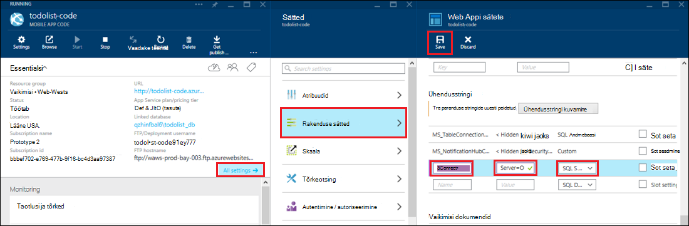

<properties 
    pageTitle="Accessi kohapealse ressursid Azure'i rakendust Service hübriid ühenduste kasutamine" 
    description="Veebirakenduse teenuses Azure rakendus ja kohapealse ressurss, mis kasutab staatilised TCP-pordid vahelise ühenduse loomine" 
    services="app-service" 
    documentationCenter="" 
    authors="cephalin" 
    manager="wpickett" 
    editor="mollybos"/>

<tags 
    ms.service="app-service" 
    ms.workload="na" 
    ms.tgt_pltfrm="na" 
    ms.devlang="na" 
    ms.topic="article" 
    ms.date="02/03/2016" 
    ms.author="cephalin"/>

#Accessi kohapealse ressursid Azure'i rakendust Service hübriid ühenduste kasutamine

Saate luua ühenduse rakenduse Azure'i rakendust Service mis tahes kohapealse ressurss, mis kasutab staatiline TCP pordi, nt SQL Server, MySQL-i, HTTP Web API-d ja enamik kohandatud veebiteenused. Selles artiklis kirjeldatakse, kuidas luua rakenduse teenuse ja asutusesisese SQL Serveri andmebaas vahelise ühenduse hübriid.

> [AZURE.NOTE] Funktsiooni hübriid ühendused veebirakenduste osa on saadaval ainult [Azure portaali](https://portal.azure.com). BizTalki teenuste ühenduse loomiseks vaadake teemat [Hübriid ühendused](http://go.microsoft.com/fwlink/p/?LinkID=397274). 
> 
> Selle sisutüübiga kehtib ka mobiilirakenduste kohta teenuses Azure rakendus. 

## Eeltingimused
- Azure'i tellimuse. Tasuta tellimuse, leiate [Azure'i tasuta prooviversioon](https://azure.microsoft.com/pricing/free-trial/). 
 
    Kui soovite alustada Azure'i rakendust Service enne Azure'i konto kasutajaks, minge [Proovige rakenduse teenus](http://go.microsoft.com/fwlink/?LinkId=523751), kus saate kohe luua lühiajaline starter web app rakenduse teenus. Nõutav; krediitkaardid kohustusi.

- Ühenduse hübriid asutusesisese SQL serveri või SQL Server Express andmebaasi kasutamiseks peab olema lubatud staatiline porti TCP/IP. Vaikimisi näiteks SQL serveri kasutamine on soovitatav, kuna see kasutab staatilised pordid 1433. Installimist ja konfigureerimist SQL Server Express hübriid ühenduste jaoks kohta leiate teavet teemast [ühenduse loomine asutusesisese SQL Server Azure'i veebisaidilt kasutamine hübriid ühendused](http://go.microsoft.com/fwlink/?LinkID=397979).

- Arvuti, kuhu installite selle artikli kirjeldatud kohapealse hübriid haldur agent:

    - Peate saama ühenduse Azure'i Port 5671
    - Peab olema jõudnud *hostname (hostinimi)*:*portnumber* oma kohapealse ressursi. 

> [AZURE.NOTE] Selle artikli juhistes eeldatakse, et kasutate brauseri kohapealse hübriid ühenduse agendi majutavad arvutist.

## Luua veebirakenduse Azure'i portaalis ##

> [AZURE.NOTE] Kui olete juba loonud web appi või mobiilirakenduse kirjutamata Azure'i portaalis, mida soovite kasutada selles õpetuses, saate luua [ühenduse hübriid ja BizTalki teenuse](#CreateHC) edasi vahele jätta ja alustada sealt.

1. [Azure portaali](https://portal.azure.com)vasakus ülanurgas nuppu **Uus** > **Web + Mobile** > **Web App**.
    
    ![Uue veebirakenduse][NewWebsite]
    
2. Enne **veebirakenduse** , URL-i ja klõpsake nuppu **Loo**. 
    
    ![Veebisaidi nimi][WebsiteCreationBlade]
    
3. Pärast mõne hetke veebirakenduse loomist ja selle web appi tera kuvatakse. Tera on vertikaalselt keritavaks armatuurlaud, mille abil saate hallata oma saidile.
    
    ![Veebisaidile, kus töötab][WebSiteRunningBlade]
    
4. Veenduge, et sait on reaalajas, võite klõpsata vaikimisi lehe kuvamiseks **liikuge** ikooni.
    
    ![Klõpsake nuppu Sirvi, et näha oma veebirakenduse][Browse]
    
    ![Vaikimisi rakenduse veebileht][DefaultWebSitePage]
    
Järgmiseks loote ühenduse hübriid ja BizTalki teenuse web app.

## Ühenduse hübriid ja BizTalki teenuse loomine ##

1. Klõpsake oma web appi blade **Kõik sätted** > **Networking** > **konfigureerimine hübriid ühenduse lõpp-punktid**.
    
    ![Hübriidjuurutuse ühendused][CreateHCHCIcon]
    
2. Enne hübriid ühendused, klõpsake nuppu **Lisa**.
    
    <!-- ![Add a hybrid connnection][CreateHCAddHC]
-->
    
3. **Lisa ühenduse hübriid** tera avaneb.  Kuna see on esimene hübriid ühendust, suvandi **uus hübriid ühendus** on juba ja klõpsamisel avatakse **ühenduse loomine hübriid** tera.
    
    ![Saate luua ühenduse hübriid][TwinCreateHCBlades]
    
    **Loo hü ühenduse blade**:
    - Sisestage **nimi**nimi, ühendus.
    - **Hostname (hostinimi)**, sisestage asutusesisese arvuti, mis hostib teie ressursi nime.
    - **Portide**, sisestage pordi number, et teie asutusesisese ressursi kasutab (1433 SQL serveri vaikimisi astme).
    - Klõpsake **ettevõtetele rääkida teenus**

4. **Luua BizTalki teenuse** tera avaneb. Sisestage BizTalki teenuse nimi ja seejärel klõpsake nuppu **OK**.
    
    ![BizTalki teenuse loomine][CreateHCCreateBTS]
    
    **Luua BizTalki teenuse** tera suletakse ja naasete **ühenduse loomine hübriid** tera.
    
5. Loo hü ühendust enne, klõpsake nuppu **OK**. 
    
    ![Klõpsake nuppu OK][CreateBTScomplete]
    
6. Kui protsess jõuab lõpule, teatiste ala portaalis annab teada, et ühendus on loodud.
    <!---TODO

    Kõik selles etapis nurjub. Ma ei saa luua BizTalki teenuse dogfood portaalis. Ma aktiveerimine (täielik portaali) klassikaline portaali ja BizTalki teenuse loonud, kuid ei tundu teile connnect neid – kui olete lõpetanud loomine hübriid conn etappi, mida kuvatakse järgmine tõrketeade nurjunud luua ühenduse hübriid RelecIoudHC. Ressursi tüüp nimeruumi "Microsoft.BizTaIkServices API versiooni 2014-06-01" ei leitud.
    
    See tõrketeade viitab sellele, et see ei saanud tüüp, näiteks ei leia.
    ![Edu teatis][CreateHCSuccessNotification]
    -->
7. Web appi tera, **hübriid ühendused** ikoon kuvatakse nüüd 1 hübriid ühenduse loomist.
    
    ![Ühe hübriid ühenduse loonud][CreateHCOneConnectionCreated]
    
Selles etapis on lõpule hübriid ühenduse pilvetaristu oluline osa. Seejärel looge vastavate kohapealse meilisõnumeid.

## Ühenduse loomiseks kohapealse hübriid ühenduse halduri installimine ##

1. Web appi tera, klõpsake nuppu **Kõik sätted** > **Networking** > **konfigureerimine hübriid ühenduse lõpp-punktid**. 
    
    ![Hübriidjuurutuse ühendused ikoon][HCIcon]
    
2. Enne **hübriid ühendused** , hiljuti lisatud lõpp-punkti veerg **olek** annab märku **pole ühendatud**. Klõpsake ühenduse konfigureerida.
    
    ![Pole ühendatud][NotConnected]
    
    Ühenduse hübriid tera avaneb.
    
    ![NotConnectedBlade][NotConnectedBlade]
    
3. Enne, klõpsake nuppu **Kuulajale häälestus**.
    
    ![Klõpsake nuppu kuulajale häälestamine][ClickListenerSetup]
    
4. Avaneb tera **hübriid ühenduse atribuudid** . Valige jaotises **Kohapealse hübriid haldur** **installimiseks klõpsake siin**.
    
    ![Klõpsake siin, et installida][ClickToInstallHCM]
    
5. Käivitage rakendus turvalisus hoiatus dialoogiboksis, valige **Käivita** jätkata.
    
    ![Valige jätkamiseks Käivita][ApplicationRunWarning]
    
6.  **Kasutajakonto kontroll** dialoogiboksis nuppu **Jah**.
    
    ![Valige Jah][UAC]
    
7. Hübriidjuurutuse ühenduse halduri alla ja installida. 
    
    ![Installimine][HCMInstalling]
    
8. Kui installimine on lõpule jõudnud, klõpsake nuppu **Sule**.
    
    ![Klõpsake nuppu Sule][HCMInstallComplete]
    
    Enne **hübriid ühendusi** , kuvatakse veerus **olek** nüüd **ühendatud**. 
    
    ![Ühendatud olek][HCStatusConnected]

Nüüd, kui hübriid ühenduse taristu on lõpule jõudnud, saate luua hübriid rakendus, mis kasutab seda. 

>[AZURE.NOTE]Järgmistes jaotistes näitab teile, kuidas kasutada ühenduse hübriid Mobile'i rakendused .NET-taustväärtus projekti.

## SQL Serveri andmebaasiga ühenduse loomiseks Mobile'i rakendus .NET taustväärtus projekti konfigureerimine

Rakenduse teenus, Mobile'i rakendused .NET taustväärtus projekt on lihtsalt ASP.net-i web app on täiendavad Mobile'i rakendused SDK installitud ja lähtestada. Soovite kasutada oma veebirakenduse mobiilirakenduste kirjutamata, peate [alla laadida ja käivitada Mobile'i rakendused .NET taustväärtus SDK](../app-service-mobile/app-service-mobile-dotnet-backend-how-to-use-server-sdk.md#install-sdk).  

Mobiilirakenduste kohta, peate määratlemine kohapealse andmebaasi ühendusstringi ja muutke seda ühendust kasutada taustväärtus. 

1. Visual Studio Solution Exploreris avage fail jaoks oma Mobile'i rakendus .NET kirjutamata, otsige üles jaotis **connectionStrings** , lisage uus kirje SqlClient umbes järgmist teavet, mis osutab asutusesisese SQL serveri andmebaasi:

        <add name="OnPremisesDBConnection"
         connectionString="Data Source=OnPremisesServer,1433;
         Initial Catalog=OnPremisesDB;
         User ID=HybridConnectionLogin;
         Password=<**secure_password**>;
         MultipleActiveResultSets=True"
         providerName="System.Data.SqlClient" />

    Ärge unustage `<**secure_password**>` selle stringi *HybridConnectionLogin*jaoks loodud parool.

3. Klõpsake nuppu **Salvesta** Visual Studio salvestada fail.

    > [AZURE.NOTE]See säte ühenduse kasutatakse kohaliku arvuti käivitamisel. Azure'i käivitamisel see säte on overriden ühenduse säte määratletud portaalis.

4. Laiendage kausta **mudelite** ja avage mudeli faili, mis lõpeb *Context.cs*.

6. Muuta **DbContext** eksemplari ehitaja edasi väärtus `OnPremisesDBConnection` base **DbContext** konstrukturile umbes järgmist koodilõigu:

        public class hybridService1Context : DbContext
        {
            public hybridService1Context()
                : base("OnPremisesDBConnection")
            {
            }
        }

    Nüüd kasutada teenust SQL Serveri andmebaasiga uue ühenduse.

## Mobiilirakenduse kirjutamata kasutamiseks kohapealse ühendusstringi värskendamine

Järgmiseks peate lisama rakenduse määramise selle uue ühendusstringi nii, et seda saab kasutada Azure.  

1. Tagasi [Azure portaali](https://portal.azure.com) web appi kirjutamata kood oma Mobile rakenduse nuppu **Kõik sätted**ja seejärel valige **rakendus sätted**.

3. **Web Appi sätete** tera, liikuge kerides jaotiseni **ühendusstringi** ja lisage uus **SQL serveris** ühendusstring, nimega `OnPremisesDBConnection` väärtusega, nt `Server=OnPremisesServer,1433;Database=OnPremisesDB;User ID=HybridConnectionsLogin;Password=<**secure_password**>`.

    Asendage `<**secure_password**>` kohapealse andmebaasi turvaline parool.

    

2. Vajutage **salvestamine** ühenduse hübriid ja äsja loodud ühendusstringi salvestada.

Selles etapis saate uuesti avaldada server project ja testida uus ühendus klientidega olemasoleva mobiilirakenduste kohta. Andmeid lugeda ja kirjutada kohapealse andmebaasiga ühenduse hübriid abil.

## Järgmised sammud ##

- ASP.net-i veebirakenduse, mis kasutab hübriid ühenduse loomise kohta leiate teavet teemast [ühenduse loomine asutusesisese SQL Server Azure'i veebisaidilt kasutamine hü ühendused](http://go.microsoft.com/fwlink/?LinkID=397979). 

### Lisaressursid

[Hübriidjuurutuse andmeühenduste ülevaade](http://go.microsoft.com/fwlink/p/?LinkID=397274)

[Josh Twist tutvustab hübriid ühendused (kanali 9 video)](http://channel9.msdn.com/Shows/Azure-Friday/Josh-Twist-introduces-hybrid-connections)

[Hübriidjuurutuse ühendused veebisait](https://azure.microsoft.com/services/biztalk-services/)

[BizTalki Services: Vahekaartidel armatuurlaud, kuvar, skaala, konfigureerimine ja ühenduse hübriid](../biztalk-services/biztalk-dashboard-monitor-scale-tabs.md)

[Koostamise tegelike hübriid pilve koos sujuvalt rakenduse teisaldamist (kanali 9 video)](http://channel9.msdn.com/events/TechEd/NorthAmerica/2014/DCIM-B323#fbid=)

[Azure'i Mobile teenuste kasutamine hü ühendused (kanali 9 video) asutusesisese SQL serveriga ühenduse loomine](http://channel9.msdn.com/Series/Windows-Azure-Mobile-Services/Connect-to-an-on-premises-SQL-Server-from-Azure-Mobile-Services-using-Hybrid-Connections)

## Mis on muutunud
* Muuda juhend veebisaitide rakenduse teenusega leiate: [Azure'i rakendust Service ja selle mõju olemasoleva Azure'i teenused](http://go.microsoft.com/fwlink/?LinkId=529714)

<!-- IMAGES -->
[New]:./media/web-sites-hybrid-connection-get-started/B01New.png
[NewWebsite]:./media/web-sites-hybrid-connection-get-started/B02NewWebsite.png
[WebsiteCreationBlade]:./media/web-sites-hybrid-connection-get-started/B03WebsiteCreationBlade.png
[WebSiteRunningBlade]:./media/web-sites-hybrid-connection-get-started/B04WebSiteRunningBlade.png
[Browse]:./media/web-sites-hybrid-connection-get-started/B05Browse.png
[DefaultWebSitePage]:./media/web-sites-hybrid-connection-get-started/B06DefaultWebSitePage.png
[CreateHCHCIcon]:./media/web-sites-hybrid-connection-get-started/C01CreateHCHCIcon.png
[CreateHCAddHC]:./media/web-sites-hybrid-connection-get-started/C02CreateHCAddHC.png
[TwinCreateHCBlades]:./media/web-sites-hybrid-connection-get-started/C03TwinCreateHCBlades.png
[CreateHCCreateBTS]:./media/web-sites-hybrid-connection-get-started/C04CreateHCCreateBTS.png
[CreateBTScomplete]:./media/web-sites-hybrid-connection-get-started/C05CreateBTScomplete.png
[CreateHCSuccessNotification]:./media/web-sites-hybrid-connection-get-started/C06CreateHCSuccessNotification.png
[CreateHCOneConnectionCreated]:./media/web-sites-hybrid-connection-get-started/C07CreateHCOneConnectionCreated.png
[HCIcon]:./media/web-sites-hybrid-connection-get-started/D01HCIcon.png
[NotConnected]:./media/web-sites-hybrid-connection-get-started/D02NotConnected.png
[NotConnectedBlade]:./media/web-sites-hybrid-connection-get-started/D03NotConnectedBlade.png
[ClickListenerSetup]:./media/web-sites-hybrid-connection-get-started/D04ClickListenerSetup.png
[ClickToInstallHCM]:./media/web-sites-hybrid-connection-get-started/D05ClickToInstallHCM.png
[ApplicationRunWarning]:./media/web-sites-hybrid-connection-get-started/D06ApplicationRunWarning.png
[UAC]:./media/web-sites-hybrid-connection-get-started/D07UAC.png
[HCMInstalling]:./media/web-sites-hybrid-connection-get-started/D08HCMInstalling.png
[HCMInstallComplete]:./media/web-sites-hybrid-connection-get-started/D09HCMInstallComplete.png
[HCStatusConnected]:./media/web-sites-hybrid-connection-get-started/D10HCStatusConnected.png
 