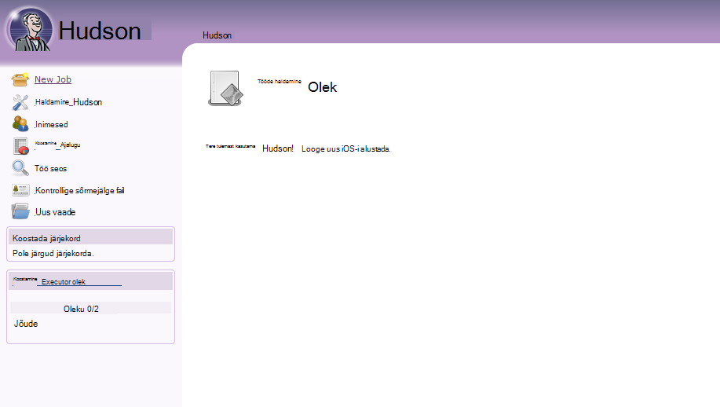
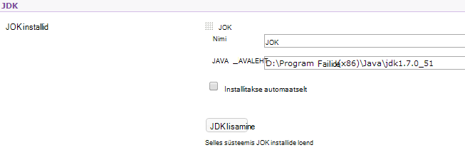
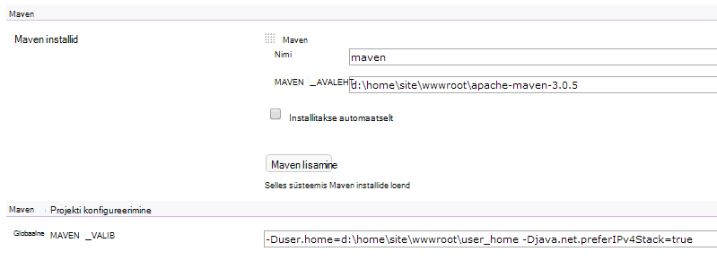

<properties 
    pageTitle="Kohandatud Java veebirakenduse Azure'i üleslaadimine" 
    description="Selle õpetuse näidatakse, kuidas üles laadida kohandatud Java veebirakenduse Azure'i rakenduse teenuse Web Apps." 
    services="app-service\web" 
    documentationCenter="java" 
    authors="rmcmurray" 
    manager="wpickett" 
    editor=""/>

<tags 
    ms.service="app-service-web" 
    ms.workload="web" 
    ms.tgt_pltfrm="na" 
    ms.devlang="Java" 
    ms.topic="article" 
    ms.date="08/11/2016" 
    ms.author="robmcm"/>

# Kohandatud Java veebirakenduse Azure'i üleslaadimine

See teema selgitab, kuidas kohandatud Java veebirakenduse üleslaadimiseks [Azure'i rakendust Service] Web Apps. Kuulub teave, mis kehtib Java veebisaidi või web app ja ka teatud rakenduste mõned näited.

Pange tähele, et Azure'i annab loomise Java veebirakenduste abil Azure portaali konfiguratsiooni Kasutajaliidese ja Azure turuplatsilt, nagu seda [Azure'i rakendust Service Java veebirakenduse loomine](web-sites-java-get-started.md). Selles õpetuses on stsenaariumid, kus te ei soovi kasutada Azure portaali konfiguratsiooni UI või Azure'i turuplatsilt.  

## Konfigureerimise juhised

Järgnevalt oodatud jaoks kohandatud Java veebirakenduste Azure sätted.

- Java protsessi kasutatava HTTP pordi on määratud.  Protsessi tuleb kasutada pordi kaudu keskkonna muutuja `HTTP_PLATFORM_PORT`.
- Keelatud, kõik kuulata pordid peale ühe HTTP kuulajale.  Tomcat, mis sisaldab sulgumist, HTTPS ja AJP pordid.
- Ümbris peab olema konfigureeritud IPv4 liikluse ainult.
- Rakenduse **käivitamisel** käsk peab olema seatud konfiguratsiooni.
- Rakendusi, mis nõuavad kataloogid kirjutage õigus vajadust asuma Azure veebirakenduse sisu kataloogis, mis on **D:\home**.  Keskkonna muutuja `HOME` viitab D:\home.  

Keskkonna muutujate saab määrata vastavalt vajadusele fail.

## Web.config httpPlatform konfigureerimine

Järgmine teave kirjeldatakse **httpPlatform** vormingu web.config sees.
                                 
**argumendid** (Vaikimisi = ""). Argumendid käivitatava või skripti **processPath** sätetes määratud.

Näiteid (koos **processPath** sisalduv):

    processPath="%HOME%\site\wwwroot\bin\tomcat\bin\catalina.bat"
    arguments="start"
    
    processPath="%JAVA_HOME\bin\java.exe"
    arguments="-Djava.net.preferIPv4Stack=true -Djetty.port=%HTTP\_PLATFORM\_PORT% -Djetty.base=&quot;%HOME%\site\wwwroot\bin\jetty-distribution-9.1.0.v20131115&quot; -jar &quot;%HOME%\site\wwwroot\bin\jetty-distribution-9.1.0.v20131115\start.jar&quot;"

**processPath** - tee käivitatava või skripti, mis käivitab protsessi listening HTTP-päringud.

Näited:

    processPath="%JAVA_HOME%\bin\java.exe"

    processPath="%HOME%\site\wwwroot\bin\tomcat\bin\startup.bat"

    processPath="%HOME%\site\wwwroot\bin\tomcat\bin\catalina.bat"
                                                                                       
**rapidFailsPerMinute** (Vaikimisi = 10.) Mitu korda protsessi määratud **processPath** on lubatud ootamatult sulguda minutis. Kui see piirang on ületatud, katkestab **HttpPlatformHandler** käivitamine minutid ülejäänud protsess.
                                    
**requestTimeout** (Vaikimisi = "00: 02:00".) Kestus, mille **HttpPlatformHandler** ootama vastust kuulamise protsessi `%HTTP_PLATFORM_PORT%`.

**startupRetryCount** (Vaikimisi = 10.) Mitu korda **HttpPlatformHandler** proovib käivitada määratud **processPath**. Vaadake lisateavet **startupTimeLimit** .

**startupTimeLimit** (Vaikimisi = 10 sekundit.) Kestus, mille ootama **HttpPlatformHandler** käivitatava/skript alustamiseks pordi kuulamise.  Selle tähtaja ületamise korral **HttpPlatformHandler** tappa protsessi ja proovige uuesti **startupRetryCount** korda käivitada.
                                                                                      
**stdoutLogEnabled** (Vaikimisi = "true".) Kui täidetud, **stdout** ja **stderr** **processPath** sätetes määratud protsessi suunatakse **stdoutLogFile** määratud fail (vt jaotist **stdoutLogFile** ).
                                    
**stdoutLogFile** (Default="d:\home\LogFiles\httpPlatformStdout.log".) Absoluutne faili tee, mille logitakse **stdout** ja **stderr** määratud **processPath** protsessist.
                                    
> [AZURE.NOTE] `%HTTP_PLATFORM_PORT%`on vaja **argumente** osana või osana **httpPlatform** **environmentVariables** loendi teisiti kohatäite. See asendatakse mõne ettevõttesiseselt loodud portide, **HttpPlatformHandler** nii, et protsessi määratud **processPath** saate kuulata seda porti.

## Juurutamine

Java vastavalt veebirakenduste hõlpsalt juurutatud suurema sama tähendab, et kasutatakse koos Internet Information Services (IIS) vastavalt veebirakenduste.  FTP, Git Kudu on toetatud ja juurutamise vahendeid, nagu on integreeritud SCM võimalus web apps. Protocol (protokoll), töötab WebDeploy, nagu Java on välja töötatud Visual Studio WebDeploy ei sobi Java web appi juurutamise kasutamise juhtudel.

## Rakenduse konfigureerimise näited

Järgmiste rakenduste, faili web.config ja rakenduse konfigureerimine on saadaval näited kuvamiseks rakenduse teenuse Web Apps Java rakenduse lubamise kohta.

### Tomcat
Samas on kaks Tomcat variatsioonid, mis on kaasas rakenduse teenuse veebirakenduste, on endiselt täiesti võimalik üles laadida klientide teatud juhtudel. Allpool on kujutatud installi kõuts koos mõne muu Java virtuaalse masina töötab.

    <?xml version="1.0" encoding="UTF-8"?>
    <configuration>
      <system.webServer>
        <handlers>
          <add name="httpPlatformHandler" path="*" verb="*" modules="httpPlatformHandler" resourceType="Unspecified" />
        </handlers>
        <httpPlatform processPath="%HOME%\site\wwwroot\bin\tomcat\bin\startup.bat" 
            arguments="">
          <environmentVariables>
            <environmentVariable name="CATALINA_OPTS" value="-Dport.http=%HTTP_PLATFORM_PORT%" />
            <environmentVariable name="CATALINA_HOME" value="%HOME%\site\wwwroot\bin\tomcat" />
            <environmentVariable name="JRE_HOME" value="%HOME%\site\wwwroot\bin\java" /> <!-- optional, if not specified, this will default to %programfiles%\Java -->
            <environmentVariable name="JAVA_OPTS" value="-Djava.net.preferIPv4Stack=true" />
          </environmentVariables>
        </httpPlatform>
      </system.webServer>
    </configuration>

Küljel Tomcat on mõned konfiguratsiooni muudatusi, mida tuleb teha. Selle server.xml vajab redigeerida seadmiseks tehke järgmist.

-   Sulgumist port = -1
-   HTTP konnektor port = ${port.http}
-   HTTP konnektor aadress = "127.0.0.1"
-   HTTPS-ja AJP välja kommenteerimine
-   Sätte IPv4 saab määrata ka catalina.properties faili, mille kaudu saate lisada`java.net.preferIPv4Stack=true`
    
Rakenduse teenuse veebirakenduste Direct3d kõned ei toetata. Need keelamiseks lisage järgmine Java suvand rakenduse peaksid olema selliseid kõnesid.`-Dsun.java2d.d3d=false`

### Jetty

Nagu Tomcat puhul, kliendid saate üles laadida ja oma eksemplari Jetty. Puhul töötab täielik install Jetty, konfiguratsiooni näeb välja järgmine:

    <?xml version="1.0" encoding="UTF-8"?>
    <configuration>
      <system.webServer>
        <handlers>
          <add name="httppPlatformHandler" path="*" verb="*" modules="httpPlatformHandler" resourceType="Unspecified" />
        </handlers>
        <httpPlatform processPath="%JAVA_HOME%\bin\java.exe" 
             arguments="-Djava.net.preferIPv4Stack=true -Djetty.port=%HTTP_PLATFORM_PORT% -Djetty.base=&quot;%HOME%\site\wwwroot\bin\jetty-distribution-9.1.0.v20131115&quot; -jar &quot;%HOME%\site\wwwroot\bin\jetty-distribution-9.1.0.v20131115\start.jar&quot;"
            startupTimeLimit="20"
          startupRetryCount="10"
          stdoutLogEnabled="true">
        </httpPlatform>
      </system.webServer>
    </configuration>

Jetty konfiguratsiooni tuleb muuta määramiseks start.ini `java.net.preferIPv4Stack=true`.

### Springboot
Selleks, et saada vastuseks Springboot rakendus, mida peate oma JAR või sõda faili üles laadida ja lisage järgmised fail. Fail läheb wwwroot kausta. Web.config reguleerida argumendid osutamiseks failiga JAR JAR fail asub kaustas wwwroot ka järgmises näites.  

    <?xml version="1.0" encoding="UTF-8"?>
    <configuration>
      <system.webServer>
        <handlers>
          <add name="httpPlatformHandler" path="*" verb="*" modules="httpPlatformHandler" resourceType="Unspecified" />
        </handlers>
        <httpPlatform processPath="%JAVA_HOME%\bin\java.exe"
            arguments="-Djava.net.preferIPv4Stack=true -Dserver.port=%HTTP_PLATFORM_PORT% -jar &quot;%HOME%\site\wwwroot\my-web-project.jar&quot;">
        </httpPlatform>
      </system.webServer>
    </configuration>

### Hudson

Meie katse Hudson 3.1.2 sõda ja vaikimisi Tomcat 7.0.50 eksemplari, kuid häälestamise UI kasutamata.  Kuna Hudson on tarkvara koostada tööriista, on soovitatav installida spetsiaalne eksemplaride, kus **AlwaysOn** lipu saate seada web appi.

1. Oma veebirakenduse juurkaust, st **d:\home\site\wwwroot**, luua **veebirakenduste** kataloog (kui see on juba olemas) ja paigutada Hudson.war **d:\home\site\wwwroot\webapps**.
2. Laadige alla apache maven 3.0.5 (ühildu Hudson) ja paigutamine **d:\home\site\wwwroot**.
3. **D:\home\site\wwwroot** web.config loomine ja selle järgmised sisu kleepimine.
    
        <?xml version="1.0" encoding="UTF-8"?>
        <configuration>
          <system.webServer>
            <handlers>
              <add name="httppPlatformHandler" path="*" verb="*" 
        modules="httpPlatformHandler" resourceType="Unspecified" />
            </handlers>
            <httpPlatform processPath="%AZURE_TOMCAT7_HOME%\bin\startup.bat"
        startupTimeLimit="20"
        startupRetryCount="10">
        <environmentVariables>
          <environmentVariable name="HUDSON_HOME" 
        value="%HOME%\site\wwwroot\hudson_home" />
          <environmentVariable name="JAVA_OPTS" 
        value="-Djava.net.preferIPv4Stack=true -Duser.home=%HOME%/site/wwwroot/user_home -Dhudson.DNSMultiCast.disabled=true" />
        </environmentVariables>            
            </httpPlatform>
          </system.webServer>
        </configuration>

    Selles etapis tuleb uuesti veebirakenduse muudatuste tegemiseks.  Ühenduse http://yourwebapp/hudson Hudson käivitamiseks.

4. Pärast Hudson konfigureerib ise, peaksite nägema järgmine Kuva:

    
    
5. Hudson konfiguratsiooni lehele: klõpsake **Hudson haldamine**, ja seejärel nuppu **Süsteemi konfigureerimine**.
6. Konfigureerimine on JDK, nagu allpool näidatud:

    

7. Konfigureerige Maven, nagu allpool näidatud:

    

8. Sätted salvestada. Hudson peaks nüüd olema konfigureeritud ja kasutamiseks valmis.

Hudson kohta lisateabe saamiseks vt [http://hudson-ci.org](http://hudson-ci.org).

### Liferay

Rakenduse teenuse veebirakenduste Liferay on toetatud. Kuna Liferay saate jaoks on vaja olulist mälu, veebirakenduse peab töötama keskmise suurusega ja suurte sihtotstarbeline töötaja, mis annab mälu. Liferay võtab ka mitu minutit alustada. Seetõttu on soovitatav seada veebirakenduse **Alati**.  

Kasutamisel koos Tomcat Liferay 6.1.2 ühenduse väljaande GA3 kombineeritud pärast allalaadimist Liferay redigeeriti järgmised failid:

**Server.XML**

- Saate muuta sulgumist pordi -1.
- Muuda HTTP konnektor      `<Connector port="${port.http}" protocol="HTTP/1.1" connectionTimeout="600000" address="127.0.0.1" URIEncoding="UTF-8" />`
- Kommentaaride välja AJP konnektor.

Klõpsake kaustas **liferay\tomcat-7.0.40\webapps\ROOT\WEB-INF\classes** looge fail nimega **portaali-ext.properties**. See fail peab sisaldama ühe rea, nagu järgmisel joonisel:

    liferay.home=%HOME%/site/wwwroot/liferay

Samal tasemel directory tomcat-7.0.40 kaustaga, looge fail nimega **web.config** sisu on järgmine:

    <?xml version="1.0" encoding="UTF-8"?>
    <configuration>
      <system.webServer>
        <handlers>
    <add name="httpPlatformHandler" path="*" verb="*"
         modules="httpPlatformHandler" resourceType="Unspecified" />
        </handlers>
        <httpPlatform processPath="%HOME%\site\wwwroot\tomcat-7.0.40\bin\catalina.bat" 
                      arguments="run" 
                      startupTimeLimit="10" 
                      requestTimeout="00:10:00" 
                      stdoutLogEnabled="true">
          <environmentVariables>
      <environmentVariable name="CATALINA_OPTS" value="-Dport.http=%HTTP_PLATFORM_PORT%" />
      <environmentVariable name="CATALINA_HOME" value="%HOME%\site\wwwroot\tomcat-7.0.40" />
            <environmentVariable name="JRE_HOME" value="D:\Program Files\Java\jdk1.7.0_51" /> 
            <environmentVariable name="JAVA_OPTS" value="-Djava.net.preferIPv4Stack=true" />
          </environmentVariables>
        </httpPlatform>
      </system.webServer>
    </configuration>

**HttpPlatform** plokk, **requestTimeout** on seatud "00: 10.00".  Saab vähendada, kuid siis tõenäoliselt ajal Liferay on eellaadimisel vigu ajalõpp kuvamiseks.  Kui selle väärtuseks on muutnud, siis **connectionTimeout** tomcat server.xml sisse ka tuleb muuta.  

Tuleb märkida, et JRE_HOME environnment varariable on määratud ülaltoodud Web.config 64-bitine JDK osutamiseks. Vaikimisi on 32-bitine, kuid kuna Liferay võib olla vaja mälu kõrge, on soovitatav kasutada JDK 64-bitine.

Pärast nende muudatuste, taaskäivitage rakendus töötab Liferay veebi, avage http://yourwebapp. Liferay portaal on saadaval juurest web app. 

## Järgmised sammud

Liferay kohta leiate lisateavet teemast [http://www.liferay.com](http://www.liferay.com).

Java kohta leiate lisateavet teemast [Java Arenduskeskus](/develop/java/).

[AZURE.INCLUDE [app-service-web-whats-changed](../../includes/app-service-web-whats-changed.md)]

[AZURE.INCLUDE [app-service-web-try-app-service](../../includes/app-service-web-try-app-service.md)]
 
 
<!-- External Links -->
[Azure'i rakendust Service]: http://go.microsoft.com/fwlink/?LinkId=529714
