<properties 
    pageTitle="Migreerimine Azure'i rakendust Service enterprise web app" 
    description="Näitab, kuidas kasutada kiiresti migreerimine olemasoleva IIS-i veebisaitide Azure'i rakenduse teenuse veebirakenduste Web Appsi migreerimise Plaanimisabimees" 
    services="app-service" 
    documentationCenter="" 
    authors="cephalin" 
    writer="cephalin" 
    manager="wpickett" 
    editor=""/>

<tags 
    ms.service="app-service" 
    ms.workload="na" 
    ms.tgt_pltfrm="na" 
    ms.devlang="na" 
    ms.topic="article" 
    ms.date="07/01/2016" 
    ms.author="cephalin"/>

# Migreerimine Azure'i rakendust Service enterprise web app

Olemasoleva veebisaidiga käivitada, klõpsake Internet Information Service (IIS) 6 või uuem versioon [Rakenduse teenuse veebirakenduste](http://go.microsoft.com/fwlink/?LinkId=529714)saate hõlpsalt migreerida. 

>[AZURE.IMPORTANT] Windows Server 2003 lõppenud juuli 14 2015 tugi. Kui olete IIS-i serveris teie veebisaiti praegu hosting mis on Windows Server 2003, Web Apps on madal risk, madala hinnaga ja madala hõõrdumisega viis hoida oma veebisaiti internetis ja Web Apps migreerimise abiline aitab migreerimisprotsessi automatiseerimiseks saate. 

[Web Appsi migreerimise Plaanimisabimees,](https://www.movemetothecloud.net/) saate analüüsida installi IIS-i server, tuvastada, milliseid saite migreeritud rakenduse teenusega, mis tahes elemente, mida ei saa migreerida või pole toetatud platvormil esile tõsta ja seejärel oma veebisaitide ja seotud andmebaase Azure migreerida.

[AZURE.INCLUDE [app-service-web-to-api-and-mobile](../../includes/app-service-web-to-api-and-mobile.md)]

## Ühilduvus analüüsi käigus elemendid ##
Migreerimise Assistant loob valmisoleku aruande mis tahes võimalikud põhjused muret või blokeerimise probleemid, mis võivad takistada eduka migreerimine kohapealsesse IIS-i Azure rakenduse teenuse veebirakenduste tuvastamiseks. Võtme üksused, millega peaks arvestama osa on:

-   Pordi seosed-Web Apps toetab ainult pordi 80 HTTP ja pordi 443 HTTPS-liikluse. Erinevate portide ignoreeritakse ja liikluse suunatakse 80 ja 443. 
-   Autentimine – Web Apps toetab anonüümne autentimine vaikimisi ja vormide autentimist rakenduse ette. Integreerimine Azure Active Directory ja ADFS-i ainult saate kasutada Windowsi autentimist. Kõik muud liiki autentimine – näiteks Elementaarautentimine – pole praegu toetatud. 
-   Globaalne komplekti vahemälu (GAC) – veebirakendustes GAC-s ei toetata. Kui teie taotlus viitab assemblereid, mis tavaliselt on GAC juurutamist, peate võtta kasutusele veebirakendustes kausta Prügikast. 
-   IIS5 Ühilduvusrežiimi – seda ei toetata veebirakendustes. 
-   Rakenduse kaustu – veebirakenduste, iga saidil ja selle rakenduste lapse töötavad sama rakenduse pool. Kui saidil on mitu lapse rakenduste kasutades mitme rakenduse kaustu, konsolideerida need ühtse taotluse rakenduskausta levinud sätetega või konkreetse rakenduse eraldi web appi migreerida.
-   COM-komponendid – Web Apps ei luba COM komponendid registreerimise platvormi. Kui veebilehed või rakendused kasutada COM-komponendid, tuleb kirjutada need hallatavat koodi ja neid veebisaidi või rakenduse juurutamine.
-   ISAPI filtrid – toetab Web Apps kasutamine ISAPI filtrid. Peate tegema järgmist:
    -   DLL-teekidega web app juurutamine 
    -   DLL-teekidega, kasutades [Web.config](http://www.iis.net/configreference/system.webserver/isapifilters) registreerimine
    -   Asetage applicationHost.xdt failina saidi juursait allpool sisuga:

            <?xml version="1.0"?>
            <configuration xmlns:xdt="http://schemas.microsoft.com/XML-Document-Transform">
            <configSections>
                <sectionGroup name="system.webServer">
                  <section name="isapiFilters" xdt:Transform="SetAttributes(overrideModeDefault)" overrideModeDefault="Allow" />
                </sectionGroup>
              </configSections>
            </configuration>

        Veel näiteid, kuidas kasutada XML-i dokumenditeisenduste veebisaidiga, leiate [Microsoft Azure veebisaidi muuta](http://blogs.msdn.com/b/waws/archive/2014/06/17/transform-your-microsoft-azure-web-site.aspx).

-   Muud komponendid, näiteks SharePoint esilehel laiendid (FPSE) FTP, SSL-sertide pole migreeritakse.

## Kuidas kasutada Web Appsi migreerimise Plaanimisabimees ##
Selle jaotise juhiseid – näiteks mõne veebisaitide juurde migreerimiseks, mis kasutavad SQL serveri andmebaasi ja kohapealne Windows Server 2003 R2 (IIS 6.0) arvutis töötab:

1.  Liikuge IIS-i serveris või teie kliendi seadme [https://www.movemetothecloud.net/](https://www.movemetothecloud.net/) 

    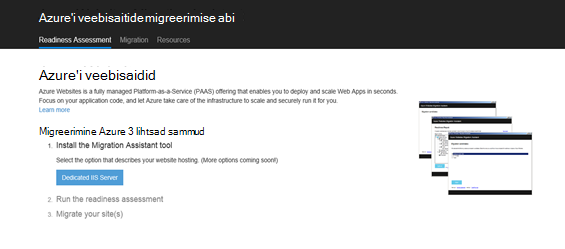

2.  Installige Web Appsi migreerimise Plaanimisabimees, klõpsates nuppu **Spetsiaalne IIS-i Server** . Rohkem suvandeid saab tulevikus suvandid. 
4.  Nuppu **Tööriista installida** oma arvutisse installida Web Appsi migreerimise Plaanimisabimees.

    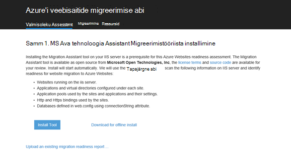

    >[AZURE.NOTE] Võite klõpsata ka **ühenduseta installi Laadige alla** laadida alla ZIP faili installimist serverites Interneti-ühendus pole. Või saate klõpsata **üles laadida olemasoleva migreerimise valmisoleku aruande**, mis on täpsemalt suvandit töötamine olemasoleva migreerimise valmisoleku aruande teie varem loodud (hiljem ülevaade).

5.  Klõpsake **Rakenduse installimise** Kuva **installida** oma arvutisse installida. Vajaduse korral see vastavate sõltuvused Web juurutada, DacFX ja IIS-i, nagu ka installida. 

    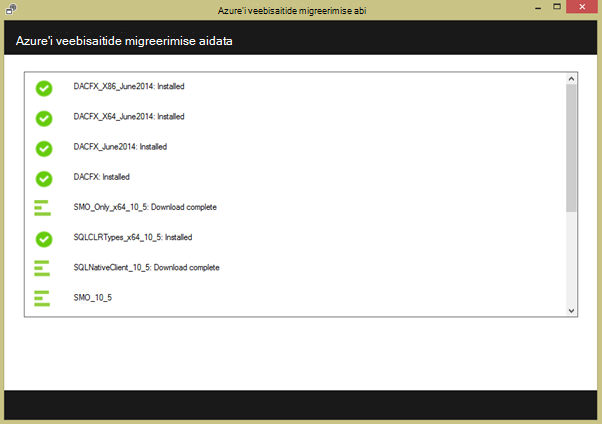

    Pärast installimist Web Appsi migreerimise Plaanimisabimees, käivitub automaatselt.
  
6.  Valige **migreerimine saidid ja serverist Azure'i andmebaasid**. Sisestage serveri administraatori identimisteave ja klõpsake nuppu **Jätka**. 

    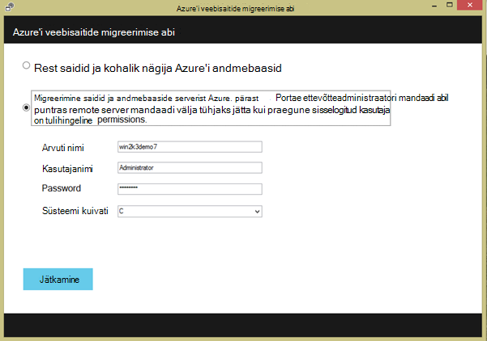

    Saate valida muidugi migreerimine kohaliku serverist. Remote suvand on kasulik, kui soovite migreerida veebisaitide tootmise IIS-i server.
 
    Selles etapis Migreerimistööriista kontrollib selle IIS-i serveri konfiguratsioon, näiteks saitide, rakenduste, rakenduse kaustu ja sõltuvused tuvastamiseks testversiooni veebisaitide migreerimise jaoks. 

8.  Alloleval pildil on kolm veebilehed – **Vaikeveebisait**, **TimeTracker**ja **CommerceNet4**. Kõik need on seotud andmebaasi, mille soovime migreerida. Valige kõik saidid, mida soovite hinnata ja seejärel klõpsake nuppu **edasi**.

    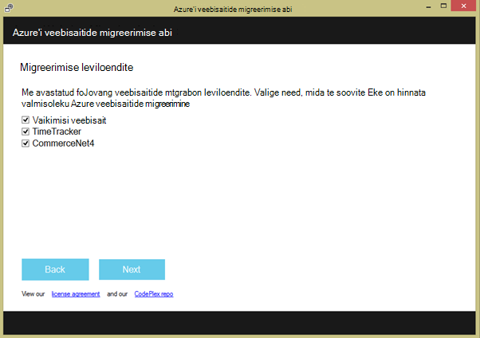
 
9.  Klõpsake **üles** laadida valmisoleku aruande. Kui klõpsate **faili kohalikult salvestada**, võite käivitada Migreerimistööriista hiljem uuesti ja üleslaadimine nagu varem salvestatud valmisoleku aruanne.

    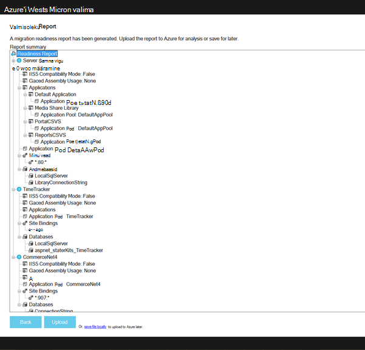
 
    Kui laadite aruande valmisoleku, Azure'i sooritab valmisoleku analüüsi ja kuvab tulemid. Lugege hindamise üksikasjad iga veebisaidi ja veenduge, et mõista või on adresseeritud kõik probleemid enne jätkamist. 
 
    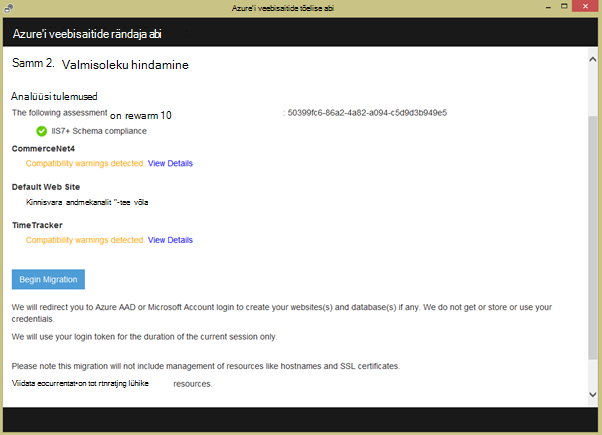

12. **Alustage migreerimise** üleviimise alustamiseks klõpsake. Teid suunatakse nüüd Azure'i kontosse sisse logida. On oluline, logite sisse kontoga, millel on aktiivne Azure'i tellimus. Kui teil on konto Azure seejärel saate kasutajaks on tasuta prooviversiooni [siin](https://azure.microsoft.com/pricing/free-trial/?WT.srch=1&WT.mc_ID=SEM_). 

13. Valige rentnikukonto, Azure tellimuse ja regiooni oma migreeritud Azure veebirakenduste ja andmebaaside jaoks, ja seejärel klõpsake nuppu **Käivita migreerimine**. Valige veebisaitide hiljem migreerida.

    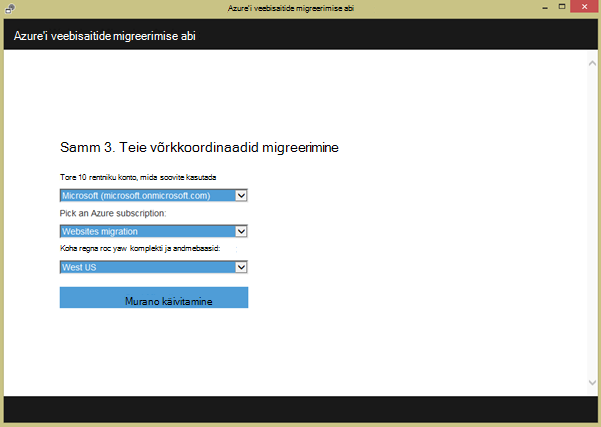

14. Klõpsake järgmisel kuval saate muuta migreerimise vaikesätted, näiteks:

    - kasutada olemasoleva SQL Azure'i andmebaasi või luua uue SQL Azure'i andmebaasi ja oma mandaadi konfigureerimine
    - Valige veebisaitide migreerimine
    - Azure'i veebirakenduste ja nende lingitud SQL andmebaase nimede määratlemine
    - Globaalsätete ja saidi tasemel sätete kohandamine

    Pildil kuvatakse kõik valitud migreerimise vaikesätetega veebisaidid.

    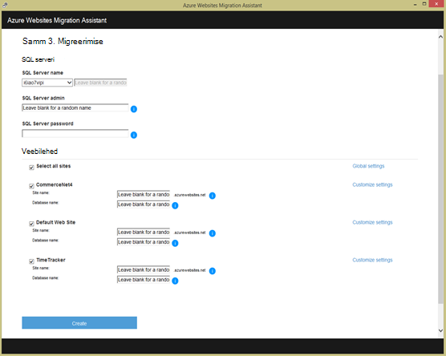

    >[AZURE.NOTE] kohandatud sätted ruut **Luba Azure Active Directory** ühendab Azure web appi [Azure Active Directory](active-directory-whatis.md) ( **Vaikimisi kataloogi**). Azure Active Directory sünkroonimise oma kohapealne Active Directory kohta leiate lisateavet teemast [kataloogi integreerimise](http://msdn.microsoft.com/library/jj573653).

16.  Kui olete teinud soovitud muudatused, klõpsake nuppu **Loo** migreerimisprotsessi käivitamiseks. Migreerimistööriista Azure'i SQL-andmebaasi ja Azure veebirakenduse loomine ja avaldage veebisaidi sisu ja andmebaasid. Migreerimise edenemist näitab selgelt Migreerimistööriista, ja te näete kokkuvõtte ekraan lõpus, milliseid üksikasju saitide viiakse, kas õnnestus, lingid vastloodud Azure veebirakenduste. 

    Mis tahes tõrke ilmnemisel migreerimisel Migreerimistööriista selgelt näitab tõrge ja tagasipööramine soovitud muudatused. Samuti saab saata tõrkearuande otse engineering meeskonnatöö klõpsates nuppu **Saada tõrkearuanne** koos jäädvustatud tõrge kõne virnas ja koostada sõnumi kehasse. 

    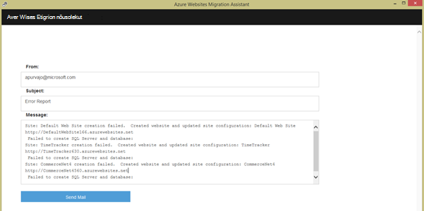

    Kui migreerimine õnnestus vigadeta, võite klõpsata ka nuppu **Anda tagasisidet** , et anda tagasisidet otse. 
 
20. Klõpsake Azure veebirakenduste linke ja veenduge, et migreerimise õnnestus.

21. Nüüd saate hallata migreeritud veebirakenduste teenuses Azure rakendus. Selleks sisse logida [Azure portaali](https://portal.azure.com).

22. Azure'i portaalis avamine veebirakenduste tera migreeritud veebisaidiga (näidatakse veebirakenduste) kuvamiseks ja seejärel klõpsake ühte neist, et hakata haldama web appi, nt pidev avaldamine, luua varukoopiate, autoscaling, ja jälgimisega seotud kasutus ja jõudluse konfigureerimine.

    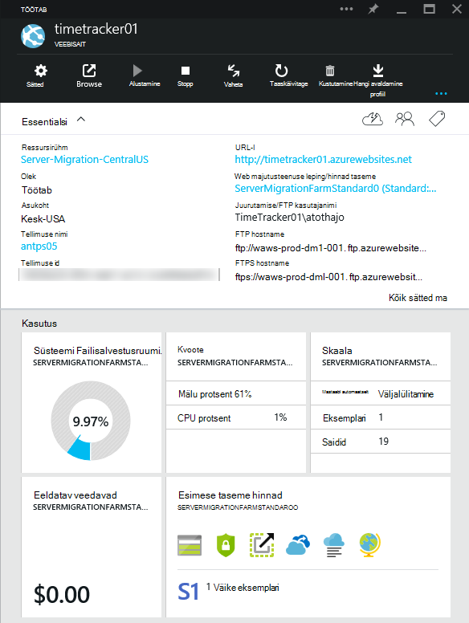

>[AZURE.NOTE] Kui soovite alustada Azure'i rakendust Service enne Azure'i konto kasutajaks, minge [Proovige rakenduse teenus](http://go.microsoft.com/fwlink/?LinkId=523751), kus saate kohe luua lühiajaline starter web app rakenduse teenus. Nõutav; krediitkaardid kohustusi.

## Mis on muutunud
* Muuda juhend veebisaitide rakenduse teenusega leiate: [Azure'i rakendust Service ja selle mõju olemasoleva Azure'i teenused](http://go.microsoft.com/fwlink/?LinkId=529714)
 
