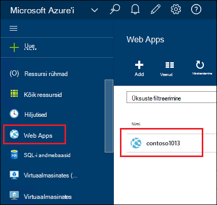
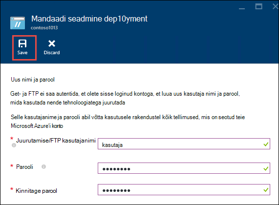
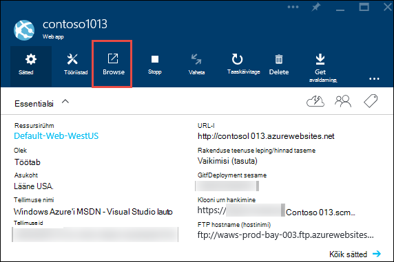
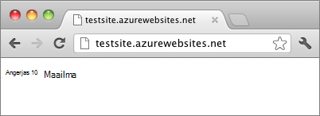

<properties
    pageTitle="Luua Node.js veebirakenduse teenuses Azure rakendus | Microsoft Azure'i"
    description="Saate teada, kuidas Node.js rakenduse web appi teenuses Azure rakenduse juurutamine."
    services="app-service\web"
    documentationCenter="nodejs"
    authors="rmcmurray"
    manager="wpickett"
    editor=""/>

<tags
    ms.service="app-service-web"
    ms.workload="web"
    ms.tgt_pltfrm="na"
    ms.devlang="nodejs"
    ms.topic="hero-article"
    ms.date="08/11/2016"
    ms.author="robmcm"/>

# Azure'i rakendust Service Node.js web appi loomine

> [AZURE.SELECTOR]
- [.Net-i](web-sites-dotnet-get-started.md)
- [Node.js](web-sites-nodejs-develop-deploy-mac.md)
- [Java](web-sites-java-get-started.md)
- [PHP - Git](web-sites-php-mysql-deploy-use-git.md)
- [PHP - FTP](web-sites-php-mysql-deploy-use-ftp.md)
- [Python](web-sites-python-ptvs-django-mysql.md)

Selle õpetuse näitab, kuidas luua lihtne [Node.js](http://nodejs.org) rakendus ja kasutusele võtta teenuses [Azure rakenduse](../app-service/app-service-value-prop-what-is.md) [web appi](app-service-web-overview.md) abil [Git](http://git-scm.com). Mis tahes operatsioonisüsteem, mis on kasutatav Node.js saate järgida selles õpetuses juhiseid.

Saate teada:

* Kuidas luua veebirakenduse Azure'i rakenduse teenuses Azure portaali kaudu.
* Kuidas juurutada Node.js rakenduse web Appi abil web appi Git hoidla.

Täidetud taotluse kirjutab lühike "Tere, maailm" stringi brauseris.

![Brauseris kuvada teade "Tere, maailm".][helloworld-completed]

Õpetused ja proovi kood keerukamaid Node.js rakendustega või muud teemad, mis on Azure Node.js kasutamise kohta leiate [Node.js Arenduskeskus](/develop/nodejs/).

> [AZURE.NOTE]
> Selle õpetuse tegemiseks on vaja Microsoft Azure'i kontosse. Kui teil pole kontot, saate [aktiveerida oma Visual Studio abonendi kasu](/en-us/pricing/member-offers/msdn-benefits-details/?WT.mc_id=A261C142F) või [tasuta prooviversiooni kasutajaks](/en-us/pricing/free-trial/?WT.mc_id=A261C142F).
>
> Kui soovite alustada Azure'i rakendust Service enne Azure'i konto kasutajaks, minge [Proovige rakenduse teenus](http://go.microsoft.com/fwlink/?LinkId=523751). Olemas, saate kohe luua lühiajaline starter web appi rakendust Service – pole vaja krediitkaarti ja kohustusi.

## Luua veebirakenduse ja Git avaldamise lubamine

Järgmiste juhiste abil luua veebirakenduse teenuses Azure rakenduse ja Git avaldamise lubamine. 

[Git](http://git-scm.com/) on jaotatud versiooni kontrolli süsteem, mille abil saate juurutada Azure veebisaidi. Salvestate kirjutamise kohaliku Git hoidla veebirakenduse jaoks koodi ja kuvatakse teie koodi abil serveri hoidla Azure juurutamine. Selle meetodi kasutamise funktsioon rakenduse teenuse veebirakenduste.  

1. [Azure'i portaali](https://portal.azure.com)sisse logima.

2. Klõpsake vasakus ülanurgas **+ Uus** ikoonile Azure'i portaal.

3. Klõpsake **Web + Mobile**ja seejärel suvandit **Web app**.

    ![][portal-quick-create]

4. Sisestage väljale **veebirakenduse** veebirakenduse nimi.

    See nimi peab olema kordumatu azurewebsites.net domeen, sest web appi URL on {nimi}. azurewebsites.net. Kui teie sisestatud nimi pole kordumatud, kuvatakse punane hüüumärk tekstiväljale.

5. Valige **tellimus**.

6. Valige **Ressursirühm** või looge uus.

    Ressursi rühmade kohta leiate lisateavet teemast [Azure ressursihaldur ülevaade](../azure-resource-manager/resource-group-overview.md).

7. Valige soovitud **Rakenduse leping/asukoht** või looge uus.

    Rakenduse teenuse lepingute kohta leiate lisateavet teemast [Azure rakenduse teenuse lepingute ülevaade](../azure-web-sites-web-hosting-plans-in-depth-overview.md)

8. Klõpsake nuppu **Loo**.
   
    ![][portal-quick-create2]

    Lühike kellaaeg tavaliselt vähem kui minutiga, lõpetab Azure, uue veebirakenduse loomine.

9. Klõpsake **veebirakendusi > {oma uue veebirakenduse}**.

    

10. Klõpsake **veebirakenduse** labale **juurutamise** osa.

    ![][deployment-part]

11. **Pideva** tera, klõpsake **Allikat, valige**

12. Klõpsake **Kohaliku Git hoidla**ja seejärel klõpsake nuppu **OK**.

    ![][setup-git-publishing]

13. Kui te pole seda juba teinud, häälestage juurutamise mandaat.

    lisamine. Klõpsake labale Web Appi **Sätted > juurutamise identimisteabe**.

    ![][deployment-credentials]
 
    b. Looge kasutajanimi ja parool. 
    
    

14. Web Appi tera, klõpsake nuppu **sätted**ja seejärel klõpsake käsku **Atribuudid**.
 
    Avaldada, tuleb vajutada serveri Git hoidla. URL-i hoidla on loetletud **GIT URL-i**. Saate kasutada seda URL-i hiljem õpetuse.

    ![][git-url]

## Koostamine ja testige rakendust kohalikult

Selles jaotises saate luua **server.js** faili, mis sisaldab veidi muudetud versiooni, näiteks 'Tere, maailm' [nodejs.org] kaudu. Koodi lisab process.env.PORT pordi kuulata Azure web app käivitamisel.

1. Looge kaust nimega *helloworld*.

2. Looge uus fail nimega **server.js** kataloogis *helloworld* tekstiredaktoris abil.

2. Kopeerige järgmine kood **server.js** faili ja seejärel salvestage fail.

        var http = require('http')
        var port = process.env.PORT || 1337;
        http.createServer(function(req, res) {
          res.writeHead(200, { 'Content-Type': 'text/plain' });
          res.end('Hello World\n');
        }).listen(port);

3. Avage käsurea ja kasutage järgmist käsku veebirakenduse kohalikult käivitamiseks.

        node server.js

4. Avage veebibrauser ja liikuge http://localhost:1337. 

    Veebilehele, kus on kuvatud "Tere, maailm" kuvatakse, nagu on näidatud järgmises kuvatõmmis.

    ![Brauseris kuvada teade "Tere, maailm".][helloworld-localhost]

## Rakenduse avaldamine

1. Kui te pole seda juba teinud, installige Git.

    Installimisjuhised teie platvorm, vt [Git lehe alla laadida](http://git-scm.com/download).

1. Käsureale, muuta kataloogide **helloworld** kataloogi ja sisestage järgmine käsk Lähtesta kohaliku Git hoidla.

        git init

2. Failide lisamiseks hoidla kasutada järgmisi käske:

        git add .
        git commit -m "initial commit"

3. Remote jaoks värskenduste lükkamine web appi varem loodud järgmise käsu abil Git lisamiseks tehke järgmist.

        git remote add azure [URL for remote repository]

4. Vajutage muudatuste Azure abil järgmine käsk:

        git push azure master

    Küsitakse parooli, et varem loodud. Väljund sarnaneb järgmises näites.

        Counting objects: 3, done.
        Delta compression using up to 8 threads.
        Compressing objects: 100% (2/2), done.
        Writing objects: 100% (3/3), 374 bytes, done.
        Total 3 (delta 0), reused 0 (delta 0)
        remote: New deployment received.
        remote: Updating branch 'master'.
        remote: Preparing deployment for commit id '5ebbe250c9'.
        remote: Preparing files for deployment.
        remote: Deploying Web.config to enable Node.js activation.
        remote: Deployment successful.
        To https://user@testsite.scm.azurewebsites.net/testsite.git
         * [new branch]      master -> master

5. Rakenduse vaatamiseks klõpsake **Veebirakenduse** osa Azure'i portaalis nuppu **Sirvi** .

    

    

## Rakenduse muudatuste avaldamine

1. Tekstiredaktoris **server.js** faili avada ja muuta "Tere maailm!" "Tere Azure\n". 

2. Salvestage fail.

2. Käsureale, muuta kataloogide **helloworld** kataloogi ja käivitage järgmine käsk:

        git add .
        git commit -m "changing to hello azure"
        git push azure master

    Küsitakse oma parool uuesti.

3. Värskendage brauseriakna, kus te viibite, web appi URL-i.

    ![Veebilehe kuvamine "Tere Azure"][helloworld-completed]

## Taastage juurutamine

Saate klõpsata **Web Appi** keelest **Sätted > pideva** **juurutuste** tera juurutamise ajaloo kuvamiseks. Kui vajate varasemates juurutusega tagasi pöörata, saate valige see ja klõpsake **ümberkorraldamine** tera **Juurutamise üksikasjad** .

## Järgmised sammud

Juurutamist Node.js rakenduse web appi teenuses Azure rakendus. Rakenduse teenuse veebirakenduste Node.js rakenduste käitamise kohta leiate lisateavet teemast [Azure rakenduse teenuse veebirakenduste: Node.js](http://blogs.msdn.com/b/silverlining/archive/2012/06/14/windows-azure-websites-node-js.aspx) ja [täpsustades Node.js versioon Azure rakenduses](../nodejs-specify-node-version-azure-apps.md).

Node.js pakub rikkaliku ökosüsteemi moodulid, mida saate kasutada rakenduste. Veebirakenduste toimimine moodulid leiate teemast [abil Node.js moodulid Azure rakendustega](../nodejs-use-node-modules-azure-apps.md).

Kui teil esineb probleeme rakenduse pärast seda kasutusele võetud Azure, vaadake, [Kuidas silumine Node.js rakenduse teenuses Azure rakenduse](web-sites-nodejs-debug.md) diagnoosimise probleemi kohta teavet.

Selles artiklis kasutab Azure portaali loomine web appi. Saate kasutada ka [Azure käsurea liides](../xplat-cli-install.md) või [Azure PowerShelli](../powershell-install-configure.md) sama toimingute tegemiseks.

Lisateavet selle kohta, kuidas koostada Node.js Azure [Node.js Arenduskeskus](/develop/nodejs/).

[helloworld-completed]: ./media/web-sites-nodejs-develop-deploy-mac/helloazure.png
[helloworld-localhost]: ./media/web-sites-nodejs-develop-deploy-mac/helloworldlocal.png
[portal-quick-create]: ./media/web-sites-nodejs-develop-deploy-mac/create-quick-website.png
[portal-quick-create2]: ./media/web-sites-nodejs-develop-deploy-mac/create-quick-website2.png
[setup-git-publishing]: ./media/web-sites-nodejs-develop-deploy-mac/setup_git_publishing.png
[go-to-dashboard]: ./media/web-sites-nodejs-develop-deploy-mac/go_to_dashboard.png
[deployment-part]: ./media/web-sites-nodejs-develop-deploy-mac/deployment-part.png
[deployment-credentials]: ./media/web-sites-nodejs-develop-deploy-mac/deployment-credentials.png
[git-url]: ./media/web-sites-nodejs-develop-deploy-mac/git-url.png
