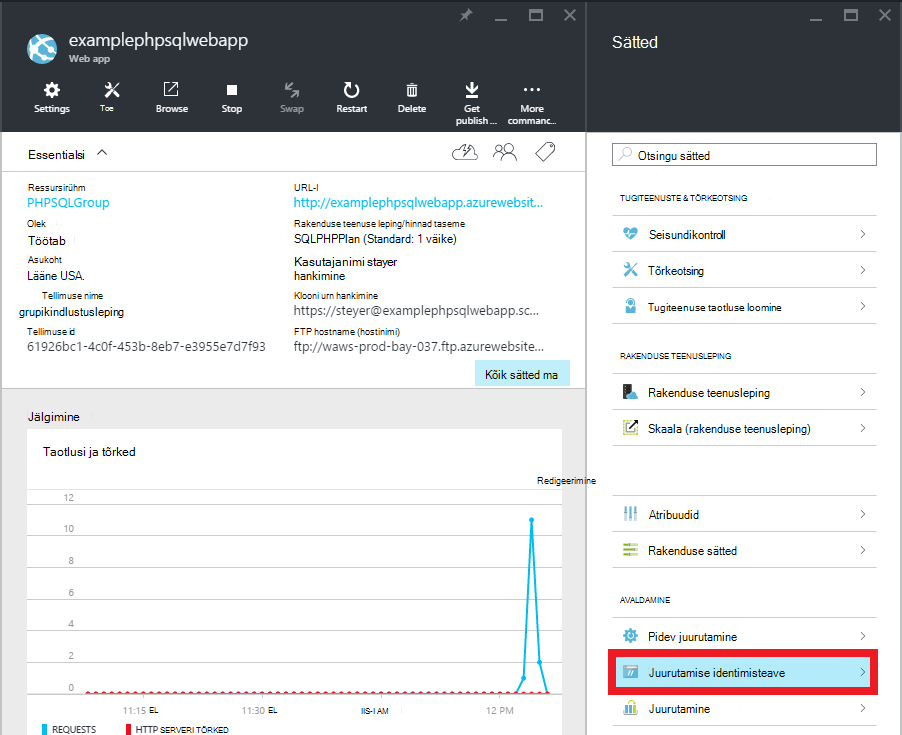

<properties 
    pageTitle="PHP-SQL web appi loomine ja juurutamine Azure'i rakendust Service Git abil" 
    description="Õppeteema, mis näitab, kuidas PHP web appi, mis salvestab andmed Azure'i SQL-andmebaasi loomine ja kasutamine Git juurutamise Azure'i rakenduse teenusega." 
    services="app-service\web, sql-database" 
    documentationCenter="php" 
    authors="rmcmurray" 
    manager="wpickett" 
    editor=""/>

<tags 
    ms.service="app-service-web" 
    ms.workload="web" 
    ms.tgt_pltfrm="na" 
    ms.devlang="PHP" 
    ms.topic="article" 
    ms.date="08/11/2016" 
    ms.author="robmcm"/>

# PHP-SQL web appi loomine ja juurutamine Azure'i rakendust Service Git abil

Selles õpetuses näete, kuidas luua PHP web appi [Azure'i rakenduse teenus](http://go.microsoft.com/fwlink/?LinkId=529714) , mis loob ühenduse Azure'i SQL-andmebaasi ja juurutamise Git abil. Selle õpetuse eeldab, et teil on [PHP][install-php], [SQL Server Express][install-SQLExpress], [Microsoft SQL Server php draiverid](http://www.microsoft.com/download/en/details.aspx?id=20098)ja [Git] [ install-git] teie arvutisse installitud. Selle juhendi vormistamisel on teil PHP-SQL-i web appi Azure töötab.

> [AZURE.NOTE]
> Saate installida ja konfigureerida PHP, SQL Server Express ja Microsoft Drivers SQL serveri php, kasutades [Microsoft Web platvormi Installer](http://www.microsoft.com/web/downloads/platform.aspx).

Saate:

* Kuidas luua Azure web app ja SQL-andmebaasi [Azure portaali](http://go.microsoft.com/fwlink/?LinkId=529715). Kuna PHP on vaikimisi rakenduse teenuse veebirakendustes, on vaja midagi erilist oma PHP koodi käivitada.
* Kuidas avaldada ja avaldada oma rakenduse abil Git Azure.
 
Selle õpetuse järgides koostate lihtsa registreerimise veebirakenduse php. Rakendus on majutatud on Azure veebisaidil. Allpool on täidetud taotluse kuvatõmmis.

[AZURE.INCLUDE [create-account-and-websites-note](../../includes/create-account-and-websites-note.md)]

>[AZURE.NOTE] Kui soovite alustada Azure'i rakendust Service enne Azure'i konto kasutajaks, minge [Proovige rakenduse teenus](http://go.microsoft.com/fwlink/?LinkId=523751), kus saate kohe luua lühiajaline starter web app rakenduse teenus. Nõutav; krediitkaardid kohustusi.

##Azure'i web rakenduse loomine ja häälestamine Git avaldamine

Azure'i web app ja SQL-andmebaasi loomiseks tehke järgmist

1. [Azure'i portaali](https://portal.azure.com/)sisse logida.

2. Ava Azure'i turuplatsi, klõpsake ikooni **Uus** ülemises vasakus armatuurlaua, klõpsake nupu **Vali kõik** turuplatsi ja valides **Web + Mobile**kõrval.
    
3. Valige kuvatakse Marketplace'ist **Web + Mobile**.

4. **Veebirakenduse + SQL-i** ikooni.

5. Pärast lugemist kirjeldust veebirakenduse + SQL-i rakendus, valige **Loo**.

6. Klõpsake iga osa (**Ressursirühm**, **Veebirakenduse**, **andmebaasi**ja **tellimuse**) ja sisestage või valige väärtused jaoks nõutavad väljad:
    
    - Sisestage URL-i nimi oma valik   
    - Andmebaasi serveri identimisteavet konfigureerimine
    - Valige teile piirkond

    

7. Veebirakenduse määratlemine lõpetades klõpsake nuppu **Loo**.

    Veebirakenduse loomisel nupp **teatised** flash roheline **edu** ja ressursside rühma tera avatud web appi ja SQL-andmebaasi jaotises kuvamine.

4. Klõpsake ikooni web appi ressursi rühma tera web appi blade avamiseks.

    

5. Jaotises **sätted** nuppu **pidev juurutamine** > **konfigureerimine vajalik sätted**. Valige **Kohalik Git hoidla** ja klõpsake nuppu **OK**.

    

    Kui te pole seadistanud Git hoidla enne, peate sisestama kasutajanime ja parooli. Selleks valige **sätted** > web appi blade**juurutamise mandaat** .

    

6. Klõpsake **atribuutide** kuvamiseks peate kasutama rakenduse PHP hiljem juurutamiseks serveri URL Git **sätted** .

##SQL-andmebaasi ühenduse teavet

Ühenduse loomiseks oma veebirakenduse oma on lingitud eksemplar SQL-andmebaasi ühenduse teavet, mis teie määratud andmebaasi loomisel on vaja. SQL-andmebaasi ühendus teabe saamiseks tehke järgmist.

1. Tagasi ressursi rühma tera, klõpsake ikooni SQL-andmebaasi.

2. SQL-andmebaasi tera, klõpsake nuppu **sätted** > **Atribuudid**ja seejärel klõpsake nuppu **Kuva andmebaasi ühendusstringi**. 

    
    
3. Avanevas dialoogis **PHP** jaotises märkige väärtused `Server`, `SQL Database`, ja `User Name`. Kasutage neid väärtusi hiljem kui avaldada oma PHP veebirakenduse Azure'i rakendust Service.

##Koostamine ja testige rakendust kohalikult

Registreerimise taotlus on lihtne PHP rakendus, mis võimaldab teil registreeruda sündmuse esitada oma nimi ja meiliaadress. Teavet eelmise registreerijad kuvatakse tabeli. Andmed on salvestatud SQL-andmebaasi eksemplari. Rakendus koosneb kaks faili (kopeerige/kleepige kood saadaval allpool).

* **index.php**: kuvatakse vormi registreerimise ja tabel, mis sisaldab registreerija teavet.
* **CreateTable.php**: loob rakenduse SQL-andmebaasi tabelisse. Selle faili kasutatakse ainult üks kord.

Käivitage rakendus kohalikult, järgige alltoodud juhiseid. Pange tähele järgmist Oletame, on PHP ja SQL Server Express häälestamine oma kohalikus arvutis ja et teil on lubatud [KPN laiend SQL serveri][pdo-sqlsrv].

1. SQL serveri andmebaasi nimega loomine `registration`. Saate seda teha on `sqlcmd` käsuviipa need käsud:

        >sqlcmd -S localhost\sqlexpress -U <local user name> -P <local password>
        1> create database registration
        2> GO   

2. Kahe faile see - ühte nimetatakse luua rakenduse juurkaust `createtable.php` ja üks nimetatakse `index.php`.

3. Avage soovitud `createtable.php` faili tekstiredaktoris või IDE ja lisada alljärgnev kood. Järgmine kood kasutatakse loomiseks on `registration_tbl` tabeli soovitud `registration` andmebaasi.

        <?php
        // DB connection info
        $host = "localhost\sqlexpress";
        $user = "user name";
        $pwd = "password";
        $db = "registration";
        try{
            $conn = new PDO( "sqlsrv:Server= $host ; Database = $db ", $user, $pwd);
            $conn->setAttribute( PDO::ATTR_ERRMODE, PDO::ERRMODE_EXCEPTION );
            $sql = "CREATE TABLE registration_tbl(
            id INT NOT NULL IDENTITY(1,1) 
            PRIMARY KEY(id),
            name VARCHAR(30),
            email VARCHAR(30),
            date DATE)";
            $conn->query($sql);
        }
        catch(Exception $e){
            die(print_r($e));
        }
        echo "<h3>Table created.</h3>";
        ?>

    Pange tähele, et peate värskendama väärtused <code>$user</code> ja <code>$pwd</code> teie kohaliku SQL serveri kasutajanime ja parooliga.

4. Veebisaidil juurkaust rakenduse terminal tippige järgmine käsk:

        php -S localhost:8000

4. Avage veebibrauser ja liikuge **http://localhost:8000/createtable.php**. See loob soovitud `registration_tbl` andmebaasi tabelisse.

5. Avage tekstiredaktoris või IDE **index.php** fail ja lisage lihtsa HTML-i ja CSS-i kood lehe (PHP kood lisatakse hiljem juhiseid).

        <html>
        <head>
        <Title>Registration Form</Title>
        
        </head>
        <body>
        <h1>Register here!</h1>
        
Fill in your name and email address, then click <strong>Submit</strong> to register.

        <form method="post" action="index.php" enctype="multipart/form-data" >
              Name  <input type="text" name="name" id="name"/> 
              Email <input type="text" name="email" id="email"/> 
              <input type="submit" name="submit" value="Submit" />
        </form>
        <?php

        ?>
        </body>
        </html>

6. Sees PHP sildid, lisada PHP koodi andmebaasiga ühenduse loomisel.

        // DB connection info
        $host = "localhost\sqlexpress";
        $user = "user name";
        $pwd = "password";
        $db = "registration";
        // Connect to database.
        try {
            $conn = new PDO( "sqlsrv:Server= $host ; Database = $db ", $user, $pwd);
            $conn->setAttribute( PDO::ATTR_ERRMODE, PDO::ERRMODE_EXCEPTION );
        }
        catch(Exception $e){
            die(var_dump($e));
        }

    Uuesti, peate värskendama väärtused <code>$user</code> ja <code>$pwd</code> teie kohaliku MySQL-i kasutajanime ja parooliga.

7. Pärast andmebaasi ühenduse koodi, lisada koodi lisamine andmebaasi andmed.

        if(!empty($_POST)) {
        try {
            $name = $_POST['name'];
            $email = $_POST['email'];
            $date = date("Y-m-d");
            // Insert data
            $sql_insert = "INSERT INTO registration_tbl (name, email, date) 
                           VALUES (?,?,?)";
            $stmt = $conn->prepare($sql_insert);
            $stmt->bindValue(1, $name);
            $stmt->bindValue(2, $email);
            $stmt->bindValue(3, $date);
            $stmt->execute();
        }
        catch(Exception $e) {
            die(var_dump($e));
        }
        echo "<h3>Your're registered!</h3>";
        }

8. Lõpuks pärast ülaltoodud koodi lisada koodi andmete toomine andmebaasist.

        $sql_select = "SELECT * FROM registration_tbl";
        $stmt = $conn->query($sql_select);
        $registrants = $stmt->fetchAll(); 
        if(count($registrants) > 0) {
            echo "<h2>People who are registered:</h2>";
            echo "<table>";
            echo "<tr><th>Name</th>";
            echo "<th>Email</th>";
            echo "<th>Date</th></tr>";
            foreach($registrants as $registrant) {
                echo "<tr><td>".$registrant['name']."</td>";
                echo "<td>".$registrant['email']."</td>";
                echo "<td>".$registrant['date']."</td></tr>";
            }
            echo "</table>";
        } else {
            echo "<h3>No one is currently registered.</h3>";
        }

Nüüd saate sirvida **http://localhost:8000/index.php** test taotluse.

##Rakenduse avaldamine

Kui olete rakenduse kohalik testinud, saate selle avaldada rakenduse teenuse Web Appsi kasutamise Git. Siiski, peate esmalt andmebaasi ühenduse teavet rakenduse värskendamine. Andmebaasi ühenduse teavet hankisite varasemas versioonis (jaotises **saada SQL-andmebaasi ühenduse teavet** ) abil värskendada **nii** järgmine teave on `createdatabase.php` ja `index.php` failide väärtused:

    // DB connection info
    $host = "tcp:<value of Server>";
    $user = "<value of User Name>";
    $pwd = "<your password>";
    $db = "<value of SQL Database>";

> [AZURE.NOTE]
> Klõpsake soovitud <code>$host</code>, serveri väärtus peab täiendatud tähisega <code>tcp:</code>.

Nüüd olete valmis Git avaldamise luua ja avaldada rakendus.

> [AZURE.NOTE]
> Need on **Azure web rakenduse loomine ja häälestamine Git avaldamise** ülaltoodud lõpus märkida samu juhiseid.

1. Avage GitBash (või terminal, kui Git on teie `PATH`), muuta kataloogide juurkaust rakenduse ( **registreerimise** kataloogi) ja käivitage järgmine käsk:

        git init
        git add .
        git commit -m "initial commit"
        git remote add azure [URL for remote repository]
        git push azure master

    Teil palutakse varem loodud parool.

2. Liikuge sirvides **http://[web rakenduse name].azurewebsites.net/createtable.php** rakenduse SQL-i andmebaasi tabeli loomiseks.
3. Liikuge sirvides **http://[web rakenduse name].azurewebsites.net/index.php** alustada rakenduse abil.

Pärast seda, kui teie taotlus on avaldatud, saate alustada muudatuste tegemist ja avaldada need Git abil. 

##Rakenduse muudatuste avaldamine

Rakenduse muudatuste avaldamine, toimige järgmiselt.

1. Rakenduse kohalik muudatusi teha.
2. Avage GitBash (või terminal, it Git on teie `PATH`), muuta kataloogide juurkaust rakenduse ja käivitage järgmine käsk:

        git add .
        git commit -m "comment describing changes"
        git push azure master

    Teil palutakse varem loodud parool.

3. Liikuge sirvides **http://[web rakenduse name].azurewebsites.net/index.php** muutuste vaatamiseks.

## Mis on muutunud
* Muuda juhend veebisaitide rakenduse teenusega leiate: [Azure'i rakendust Service ja selle mõju olemasoleva Azure'i teenused](http://go.microsoft.com/fwlink/?LinkId=529714)

[install-php]: http://www.php.net/manual/en/install.php
[install-SQLExpress]: http://www.microsoft.com/download/details.aspx?id=29062
[install-Drivers]: http://www.microsoft.com/download/details.aspx?id=20098
[install-git]: http://git-scm.com/
[pdo-sqlsrv]: http://php.net/pdo_sqlsrv
 
