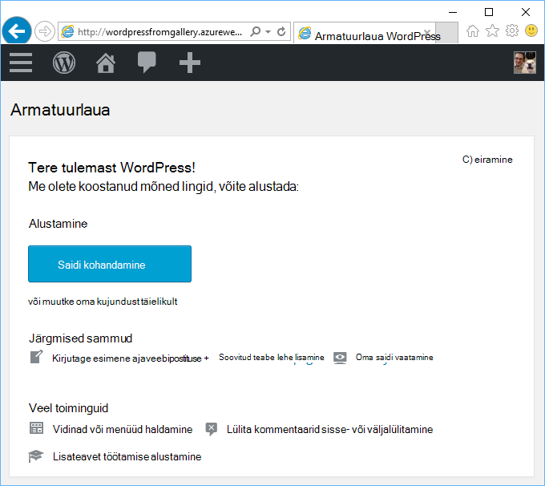
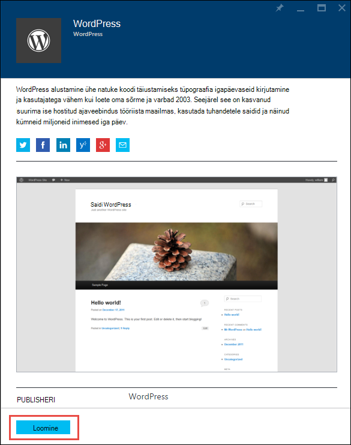
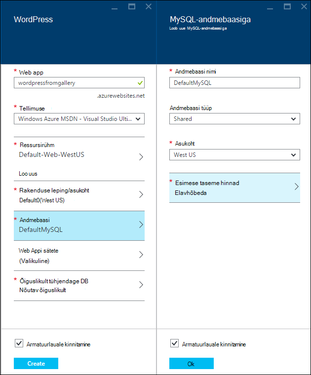
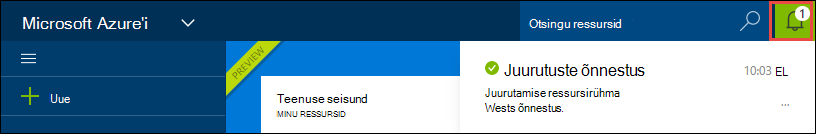
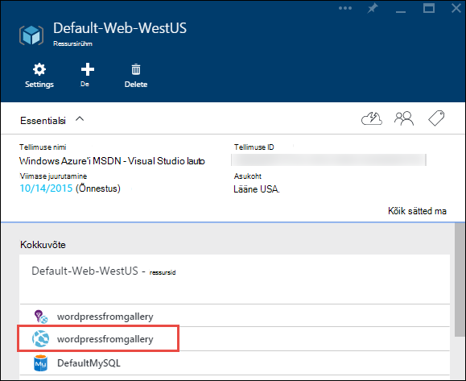
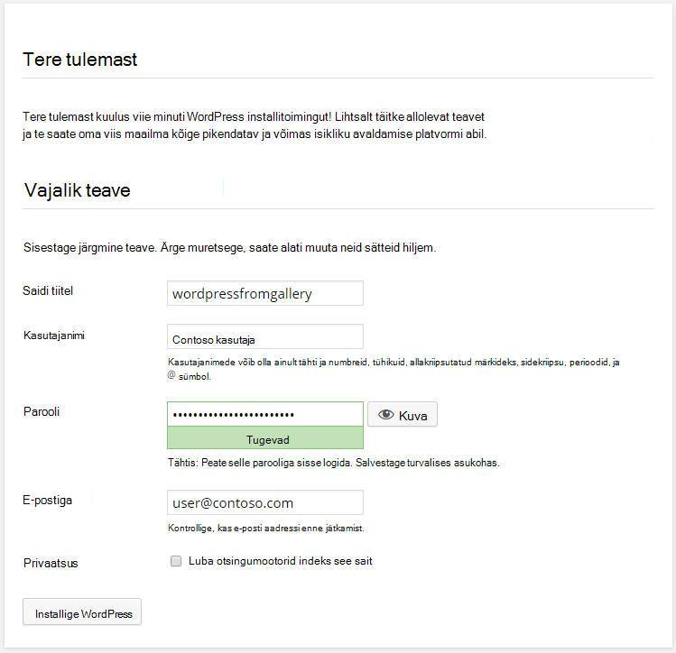

<properties
    pageTitle="Luua WordPress veebirakenduse teenuses Azure rakendus | Microsoft Azure'i"
    description="Saate teada, kuidas luua uus Azure veebirakenduse WordPress ajaveebi Azure'i portaalis."
    services="app-service\web"
    documentationCenter="php"
    authors="rmcmurray"
    manager="wpickett"
    editor=""/>

<tags
    ms.service="app-service-web"
    ms.workload="na"
    ms.tgt_pltfrm="na"
    ms.devlang="PHP"
    ms.topic="hero-article"
    ms.date="08/11/2016"
    ms.author="robmcm"/>

# WordPress web appi teenuses Azure rakenduse loomine

[AZURE.INCLUDE [tabs](../../includes/app-service-web-get-started-nav-tabs.md)]

Selle õpetuse kuvatakse juurutamise WordPress ajaveebisaidi Azure'i turuplatsilt.

Kui olete lõpetanud õpetuse peate oma WordPress ajaveebisaidi üles ja töötab pilveteenuses.

Saate teada:

* Kuidas leida mõni rakenduse Mall Azure'i turuplatsilt.
* Kuidas luua web appi Azure'i rakenduse teenus, mis põhineb mall.
* Kuidas seadistada Azure rakenduse Teenusesätted uue veebirakenduse ja andmebaasi.

Azure'i turuplatsi tehakse kättesaadavaks mitmesuguseid populaarsed veebirakenduste töötanud Microsoft, kolmanda osapoole ettevõtetele ja avatud allika tarkvara algatused. Veebirakenduste on ehitatud populaarsed raamistik, nagu see WordPress näide, [.NET](/develop/net/), [Node.js](/develop/nodejs/), [Java](/develop/java/)ja [Python](/develop/python/), nimi mõne [PHP](/develop/nodejs/) mitmeid. Loomiseks vajate vaid tarkvara Azure'i turuplatsilt web app on brauseris kasutatav [Azure portaali](https://portal.azure.com/). 

WordPress saidi, mida selles õpetuses juurutada kasutab MySQL-i andmebaasist. Kui soovite selle asemel kasutada andmebaasi SQL-andmebaasiga, lugege teemat [Projekti Nami](http://projectnami.org/). **Projekti Nami** on saadaval, kuni kuvatakse Marketplace'ist.

> [AZURE.NOTE]
> Selle õpetuse tegemiseks on vaja Microsoft Azure'i kontosse. Kui teil pole kontot, saate [aktiveerida oma Visual Studio abonendi kasu](/pricing/member-offers/msdn-benefits-details/?WT.mc_id=A261C142F) või [tasuta prooviversiooni kasutajaks](/en-us/pricing/free-trial/?WT.mc_id=A261C142F).
>
> Kui soovite alustada Azure'i rakendust Service enne Azure'i konto kasutajaks, minge [Proovige rakenduse teenus](http://go.microsoft.com/fwlink/?LinkId=523751). Olemas, saate kohe luua lühiajaline starter web appi rakendust Service – pole vaja krediitkaarti ja kohustusi.

## Valige WordPress ja Azure'i rakendust Service konfigureerimine

1. [Azure'i portaali](https://portal.azure.com/)sisse logida.

2. Klõpsake nuppu **Uus**.
    
    ![Loo uus][5]
    
3. **WordPress**otsida, ja klõpsake **WordPress**. Kui soovite kasutada SQL-andmebaasi asemel MySQL-i, otsige **Projekti Nami**.

    ![WordPress loendist][7]
    
5. Pärast lugemist WordPress rakenduse kirjelduse, klõpsake nuppu **Loo**.

    

4. Sisestage väljale **veebirakenduse** veebirakenduse nimi.

    See nimi peab olema kordumatu azurewebsites.net domeen, sest web appi URL on {nimi}. azurewebsites.net. Kui teie sisestatud nimi pole kordumatud, kuvatakse punane hüüumärk tekstiväljale.

8. Kui teil on mitu tellimust, valige see, mida soovite kasutada. 

5. Valige **Ressursirühm** või looge uus.

    Ressursi rühmade kohta leiate lisateavet teemast [Azure ressursihaldur ülevaade](../azure-resource-manager/resource-group-overview.md).

5. Valige soovitud **Rakenduse leping/asukoht** või looge uus.

    Rakenduse teenuse lepingute kohta leiate lisateavet teemast [Azure rakenduse teenuse lepingute ülevaade](../azure-web-sites-web-hosting-plans-in-depth-overview.md) 

7. Klõpsake **andmebaasi**ja siis **MySQL-andmebaasiga** tera sisestage nõutav väärtused konfigureerida MySQL-andmebaasiga.

    lisamine. Sisestage uus nimi või jätta vaikenime.

    b. Jätke **Andmebaasi tüüp** väärtuseks **ühiskasutuses**.

    c. Valige veebirakenduse jaoks valitud üks samasse asukohta.

    d. Valige hinnakirjad taseme. Selles õpetuses mõeldud on hea elavhõbeda (tasuta minimaalsete lubatud ühendused ja kettaruumi).

8. **MySQL-andmebaasiga** tera, klõpsake nuppu **OK**. 

8. **WordPress** labale juriidiline nõustumine ja seejärel klõpsake nuppu **Loo**. 

    

    Azure'i rakenduse teenus loob veebirakenduse, tavaliselt vähem kui minutiga. Saate vaadata, klõpsates portaali lehe ülaosas kellaikooni edenemist.

    

## Käivitada ja hallata oma WordPress web app
    
7. Web appi loomine lõpetades Azure'i portaalis, mille lõite rakenduse ressursirühma liikumine ja näete web app ja andmebaas.

    Täiendav ressurss lihtversioon pirnid ikoon on [Rakenduse ülevaated](/services/application-insights/), mis osutab jälgimisega seotud oma veebirakenduse.

1. Klõpsake **ressursirühm** labale web appi joon.

    

2. Web Appi tera, klõpsake nuppu **Sirvi**.

    ![saidi URL-i][browse]

3. WordPress **Tere tulemast** lehel, sisestage nõutud WordPress konfiguratsiooni teave ja klõpsake **Installida WordPress**.

    

4. Logige sisse lehel **Tere tulemast** loodud mandaadi abil.  

5. Oma saidi Armatuurlaua leht.    

    

## Järgmised sammud

Näete, kuidas luua ja juurutada PHP web appi galeriist. Azure PHP kasutamise kohta leiate lisateavet teemast [PHP Arenduskeskus](/develop/php/).

Rakenduse teenuse Web Apps töötamise kohta leiate lisateavet teemast linkide (lai brauseri Windowsi jaoks) lehe vasakus servas või ülaosas, lehe (kitsas brauseri Windowsi jaoks). 

## Mis on muutunud
* Juhendi muudatusele veebisaitide rakenduse teenusega leiate [Azure'i rakendust Service ja Azure olemasolevad teenused mõju](http://go.microsoft.com/fwlink/?LinkId=529714).

[5]: ./media/web-sites-php-web-site-gallery/startmarketplace.png
[7]: ./media/web-sites-php-web-site-gallery/search-web-app.png
[browse]: ./media/web-sites-php-web-site-gallery/browse-web.png
