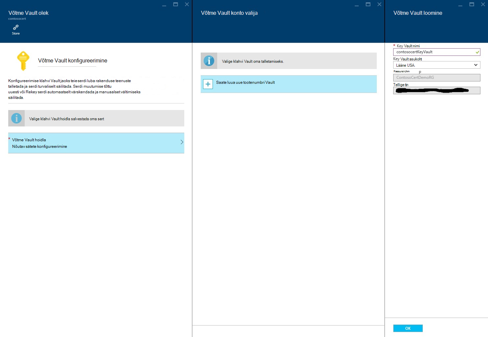
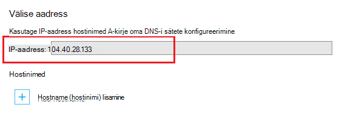

<properties
    pageTitle="Osta ja Azure rakenduse teenust SSL-serdi konfigureerimine"
    description="Saate teada, kuidas osta ja Azure rakenduse teenust SSL-serdi konfigureerimine."
    services="app-service"
    documentationCenter=".net"
    authors="apurvajo"
    manager="stefsch"
    editor="cephalin"
    tags="buy-ssl-certificates"/>

<tags
    ms.service="app-service"
    ms.workload="na"
    ms.tgt_pltfrm="na"
    ms.devlang="na"
    ms.topic="article"
    ms.date="09/19/2016"
    ms.author="apurvajo"/>

#Osta ja Azure rakenduse teenust SSL-serdi konfigureerimine

> [AZURE.SELECTOR]
- [SSL-i cert Azure ostmine](web-sites-purchase-ssl-web-site.md)
- [Kasutage SSL cert mujalt](web-sites-configure-ssl-certificate.md)

Vaikimisi **[Azure'i rakendust Service](http://go.microsoft.com/fwlink/?LinkId=529714)** võimaldab juba HTTPS oma veebirakenduse jaoks soovitud *sertifikaadiga metamärkide. azurewebsites.net domeeni. Kui te ei plaani konfigureerida kohandatud domeeni, siis teil saate kasutada vaikimisi HTTPS-i serdi. Siiski, nagu kõik * [metamärkide domeene](https://casecurity.org/2014/02/26/pros-and-cons-of-single-domain-multi-domain-and-wildcard-certificates), ei ole võimalikult turvaliseks kohandatud domeeni kasutamine oma sert. Azure'i rakendust Service pakub teile kohe väga lihtsustatud viis osta ja hallata SSL-serdi Azure'i portaalist portaali väljumata.  
Selles artiklis selgitatakse, kuidas osta ja SSL-serdi konfigureerimine oma **[Azure'i rakendust Service](http://go.microsoft.com/fwlink/?LinkId=529714)** 3 lihtsad juhised. 

> [AZURE.NOTE]
> Tasuta ja ühiskasutuses web app ei saa kasutada kohandatud domeeninime SSL-sertide. Oma veebirakenduse Basic, Standard või Premium režiimi, mis võivad muutuda, kui palju on arve tellimuse jaoks tuleb konfigureerida. Lisateabe saamiseks vaadake **[Web Appsi hinnad üksikasjad](https://azure.microsoft.com/pricing/details/web-sites/)** .

##Ülevaade
> [AZURE.NOTE]
> Palun proovige osta tellimus, mis on aktiivne krediitkaardiga seotud abil SSL-sert. See võib põhjustada teie tellimus on keelatud. 

##<a>Osta, talletada ja määrata oma kohandatud domeeni SSL-sert</a>
HTTPS-i lubamine kohandatud domeeni, nt contoso.com, peate esmalt ** [konfigureerida kohandatud domeeninime Azure'i rakendust Service.](web-sites-custom-domain-name.md)**

Enne taotluse SSL-sert, tuleb kõigepealt määratleda, millist domeeninimede on tagatud sert. See määratleb, millist tüüpi tunnistust peate hankima. Kui teil on vaja vaid ühe domeeni nimi, nt contoso.com või www.contoso.com secure Standard (tavaline) piisab sert. Kui teil on vaja secure mitme domeeninime, nt contoso.com, www.contoso.com ja mail.contoso.com, siis saate ** [metamärkide sert](http://en.wikipedia.org/wiki/Wildcard_certificate)**

##Samm 0: Tellimuse SSL-i serdi

Selles etapis tuleb teil teada, kuidas tellimuse jaoks SSL-serdi oma valik.

1.  **[Azure portaali](https://portal.azure.com/)**, klõpsake nuppu Sirvi ja tippige "Rakenduse teenuse serdid" otsinguriba ja valige "Rakenduse teenuse serdid" tulem ja klõpsake nuppu Lisa. 

    

    

2.  Sisestage **sõbralik nimi** SSL-sert.

3.  Sisestage **hostinimi**
> [AZURE.NOTE]
    See on üks kõige osadesse ostu protsess. Veenduge, et sisestada õige hosti nimi (domeeni), mida soovite kaitsta selle serdiga. **Tehke ei** lisa hosti nimi koos WWW. Näiteks kui teie domeeni nimi on www.contoso.com, seejärel sisestage väljale hosti nimi contoso.com, kõnealuse sertifikaadi kaitsta nii www-d ja juurkausta domeene. 
    
4.  Valige oma **tellimus**. 

    Kui teil on mitu tellimust, siis veenduge, et luua oma kohandatud domeeni või veebirakenduse jaoks kasutatud ühe tellimuse SSL-serdi kõnealuse.
       
5.  Valige või looge **Ressursirühma**.

    Ressursi rühmade abil saate hallata Azure seotud ressursid üksusena ja on kasulik, kui eeskirjad Rollipõhine pääsu juhtimine (RBAC) rakenduste. Lisateabe saamiseks vaadake teemat haldamine oma Azure ressursse.
     
6.  Valige **sert SKU-ga** 

    Lõpetuseks, valige sert SKU-ga, mis vastab teie vajadustele ja klõpsake nuppu Loo. Täna, Azure'i rakendust Service võimaldab teil osta kaks erinevat SKU-de jaoks • S1 – 1 aasta kehtivust ja automaatse pikendamise standardne sert  
           • W1 – looduses kaardi serdi 1-aastane kehtivust ja automaatne uuendamine      
    Lisateabe saamiseks vaadake **[Web Appsi hinnad üksikasjad](https://azure.microsoft.com/pricing/details/web-sites/)** .

> [AZURE.NOTE]
> SSL-i serdi loomine võtab kõikjal 1 – 10 minutit. Selle protsessi teostab mitme juhiseid taustal, mis on üsna tülikas teha käsitsi.  

##Samm 1: Azure'i klahvi Vault sert salvestada

Selles etapis tuleb teil teada, kuidas paigutamiseks poest Azure'i klahvi Vault teie valitud ostetud SSL-sert.

1.  Kui SSL-serdi ostmine on lõpule viidud peate käsitsi avada **Rakenduse teenuse serdid** ressursi blade sirvides selle uuesti (vt samm 1 ülal)   

    

    Märkate, et serdi olek on **"ootel emissiooni"** veel mõned toimingud, peate täitma, enne kui saate hakata selle serdid.
 
2. Klõpsake **"serdi konfigureerimine"** blade serdi atribuudid ja klõpsake selle serdi talletamiseks Azure'i klahvi võlvkelder **"samm 1: talletada"** sees.

3.  **"Võti Vault Status"** Blade, klõpsake nuppu **"klahvi Vault hoidla"** valimiseks klahvi olemasolev Vault salvestada selle serdi **või "luua uus võti Vault"** uus võti Vault sees sama tellimust ja ressursside rühma loomiseks.
 
    
 
    > [AZURE.NOTE]
    Azure'i klahvi Vault on väga väike kulude selle serdi talletamiseks. Lisateavet leiate **[Azure'i klahvi Vault hinnad üksikasjad](https://azure.microsoft.com/pricing/details/key-vault/)** .

4. Kui olete valinud klahvi Vault hoidla salvestada see tunnistus, minna ja salvestada selle **"Talletada"** klõpsake nuppu **"klahvi Vault Status"** blade ülaosas.  

    See peaks toimingut talletamise serdi ostsite Azure'i klahvi Vault oma valik. Pärast värskendamist tera, peaksite nägema roheline märkige vastu selles etapis tuleb märkida.
    
##Samm 2: Domeeni omandiõiguse

Selles etapis tuleb teil teada, kuidas teha domeeni omandiõiguse kinnitamine SSL-sert, mida saate just tellimuse jaoks. 

1.  Klõpsake nuppu **"samm 2: kinnitamine"** samm keelest **"Serdi konfigureerimine"** . On 4 tüüpi domeeni kinnitamine rakenduse teenuse serdid ei toeta.

    * **Rakenduse teenuse kontrollimine** 
    
        * See on kõige mugavam protsessi, kui teil on juba **rakendused rakendus teenuse määratud kohandatud domeeni.** See meetod loetleb kõik vastavad kriteeriumid rakenduse teenuse rakendused välja. 
           Näiteks sel juhul **contosocertdemo.com** rakenduse teenuse App nimega **"ContosoCertDemo"** määratud kohandatud domeeni ja seega mis on siin loetletud ainult rakenduse teenuse rakendus. Kui oli mitme piirkond juurutus, siis selle loendi need kõik regiooniti.
        
           Kontrollimise meetod on ainult saadaval ostmiseks Standardne (tavaline) sert. Looduses kaardi sertifikaatide kohta, vahele jätta ja liikuda valik B, C ja D allpool.
        * Valige **"Kinnita"** nuppu, et seda toimingut.
        * Klõpsake **"Värskenda"** serdi oleku värskendamiseks, kui kinnitamine on lõpule jõudnud. Võib kuluda mõni minut kinnitamiseks lõpuleviimiseks.
        
             

    * **Domeeni kinnitamine** 

        * See on **ainult siis, kui** teil on kõige mugavam protsessi **[ostetud kohandatud domeeni Azure'i rakendust Service.](custom-dns-web-site-buydomains-web-app.md)**
        
        * Valige **"Kinnita"** nuppu, et seda toimingut.
        
        * Klõpsake **"Värskenda"** serdi oleku värskendamiseks, kui kinnitamine on lõpule jõudnud. Võib kuluda mõni minut kinnitamiseks lõpuleviimiseks.

    * **E-posti kontrollimine**
        
        * Kinnitusmeil on juba saadetud seda kohandatud domeeniga seotud e-posti aadress.
         
        * Avage meilisõnum ja klõpsake linki meilikinnituse juhise kinnitamine. 
        
        * Kui teil on vaja uuesti kontrollida e-posti, klõpsake nuppu **"meilisõnumi uuesti saatmine"** .
         
    * **Käsitsi kontrollimine**    
                 
        1. **HTML-i veebileht kontrollimine**
        
            * HTML-fail nimega **{Domeeni kinnitamine Turbeloa}**.html (saate kopeerida luba ta domeeni kinnitamise oleku Blade) loomine
            
            * Sisu selle faili peaks olema **Domeeni kinnitamine Turbeloa**täpselt sama nime.
            
            * Laadige oma domeeni veebiserver juurtasemel seda faili.
            
            * Klõpsake **"Värskenda"** serdi oleku värskendamiseks, kui kinnitamine on lõpule jõudnud. Võib kuluda mõni minut kinnitamiseks lõpuleviimiseks.
            
            Näiteks kui ostate standardne-sert contosocertdemo.com koos domeeni kinnitamine Turbeloa **'cAGgQrKc'** siis web taotlus **'http://contosocertdemo.com/cAGgQrKc.html'** peaks tagastama **cAGgQrKc.**
        2. **DNS-i TXT-kirje, kinnitamine**

            * Oma DNS-i halduris luua TXT-kirje väärtus **'DZC'** alamdomeen võrdne soovitud **domeeni kinnitamine Turbeloa.**
            
            * Klõpsake **"Värskenda"** serdi oleku värskendamiseks, kui kinnitamine on lõpule jõudnud. Võib kuluda mõni minut kinnitamiseks lõpuleviimiseks.
                              
            Näiteks täitmiseks valideerimine metamärkide serdi hostinime jaoks ** \*. contosocertdemo.com** või ** \*. subdomain.contosocertdemo.com** ja domeeni kinnitamine Turbeloa **cAGgQrKc**, peate dzc.contosocertdemo.com väärtusega TXT-kirje loomiseks **cAGgQrKc.**     

##Samm 3: Rakenduse teenuse rakenduse serdi määramine

Selles etapis tuleb teil teada, kuidas määrata see äsja ostetud sert oma rakenduse teenuse rakendusi. 

> [AZURE.NOTE]
> Selle jaotise juhiseid sooritamiseks teil peab on seotud kohandatud domeeninime oma rakendusega. Lisateabe saamiseks vt ** [konfigureerida kohandatud domeeni nimi web appi.](web-sites-custom-domain-name.md)**

1.  Brauseris avada selle ** [Azure portaali.](https://portal.azure.com/)**
2.  Klõpsake lehe vasakus servas **Rakenduse teenuse** suvandit.
3.  Klõpsake selle nime, millele soovite määrata selle serdi rakenduse. 
4.  **Sätted**, klõpsake nuppu **SSL-sertide**
5.  Klõpsake nuppu **Impordi rakenduse teenuse sert** ja valige sert, mida te ostnud

    

6. **SSL-i sidumiste** lahtris klõpsake **sidumiste lisamine**
7. **Lisada SSL-i Köitmine** tera domeeninime turvamiseks SSL-i ja serdi, et kasutada valimiseks kasutage funktsiooni rippmenüüst. Saate valida, kas kasutada **[Serveri teave (SNI)](http://en.wikipedia.org/wiki/Server_Name_Indication)** või IP-põhise SSL-i.

    

       •    IP based SSL associates a certificate with a domain name by mapping the dedicated public IP address of the server to the domain name. This requires each domain name (contoso.com, fabricam.com, etc.) associated with your service to have a dedicated IP address. This is the traditional          method of associating SSL certificates with a web server.
       •    SNI based SSL is an extension to SSL and **[Transport Layer Security](http://en.wikipedia.org/wiki/Transport_Layer_Security)** (TLS) that allows multiple domains to share the same IP address, with separate security certificates for each domain. Most modern browsers (including Internet Explorer, Chrome, Firefox and Opera) support SNI, however older browsers may not support SNI. For more information on SNI, see the **[Server Name Indication](http://en.wikipedia.org/wiki/Server_Name_Indication)** article on Wikipedia.
       
7. Klõpsake muudatuste salvestamiseks ja lubada SSL-i **Lisamine Köitmine** .

Kui valisite **IP-põhise SSL-i** ja kohandatud domeeni on konfigureeritud, kasutades A-kirje, peate tegema järgmised täiendavad toimingud:

* Kui olete konfigureerinud IP-põhise SSL-i sidumine, eriotstarbeline IP-aadress on määratud rakenduse. **Kohandatud domeeni** lehel jaotises sätted rakenduse **hostinimed** jaotise kohal leiate IP-aadress. See kirjas **Välise IP-aadress**
    
    

    Pange tähele, et IP-aadress erinevas virtuaalse IP-aadressi varem kasutatud konfigureerida A-kirje oma domeenile. Kui teie arvuti on konfigureeritud kasutama SNI SSL-i põhiste või pole konfigureeritud SSL-i, pole aadress on loetletud sõnadest.
    
2. Domeeninimeregistraatori esitatud tööriistade abil muuta oma kohandatud domeeninime IP-aadressi osutama eelmises juhises A-kirje.
Selles etapis peaks oskama külastage rakenduse abil HTTPS:// mitte HTTP:// Veenduge, et sert on õigesti konfigureeritud.

##Kordusvõtme ja serdi sünkroonimine

1. Turvalisuse põhjustel kui teil kunagi vaja kordusvõtme teie sert, siis lihtsalt valige suvand **"kordusvõtme ja sünkroonimine"** **"Serdi atribuudid"** Blade. 

2. Klõpsake protsessi käivitamiseks nuppu **"Kordusvõtme"** . See võib kuluda 1-10 minutit. 

    

3. Uuesti tippimisel raisatavat teie serdi pöörab uue serdiga asutuselt serdi väljaandja sert.
4. Te ei võeta Rekeying serdi eluiga. 
5. Uuesti tippimisel raisatavat teie serdi läheb läbi ootel emissiooni olekus. 
6. Kui sert on valmis veenduge, et saate sünkroonida oma ressursse serdiga teenuse katkemise vältimiseks.
7. Sünkroonimine suvand pole saadaval on veel määratud veebirakenduse serdid. 

## Veel ressursse ##
- [Azure'i rakendust Service rakenduse HTTPS-i lubamine](web-sites-configure-ssl-certificate.md)
- [Osta ja kohandatud domeeninime Azure'i rakendust Service konfigureerimine](custom-dns-web-site-buydomains-web-app.md)
- [Microsoft Azure'i usalduskeskuses](/support/trust-center/security/)
- [Lukustamata Azure veebisaitide konfigureerimine suvandid](http://azure.microsoft.com/blog/2014/01/28/more-to-explore-configuration-options-unlocked-in-windows-azure-web-sites/)
- [Azure'i haldusportaal](https://manage.windowsazure.com)

>[AZURE.NOTE] Kui soovite alustada Azure'i rakendust Service enne Azure'i konto kasutajaks, minge [Proovige rakenduse teenus](http://go.microsoft.com/fwlink/?LinkId=523751), kus saate kohe luua lühiajaline starter web app rakenduse teenus. Nõutav; krediitkaardid kohustusi.

