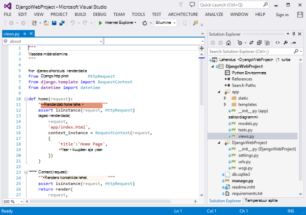
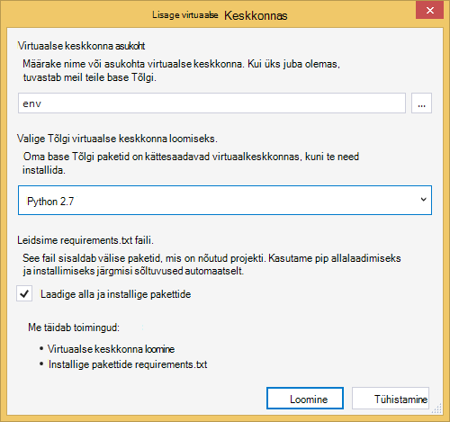
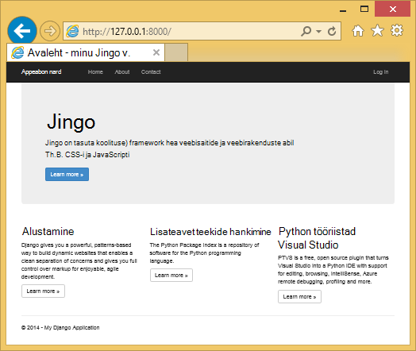
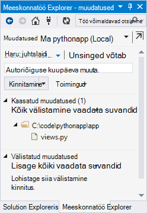
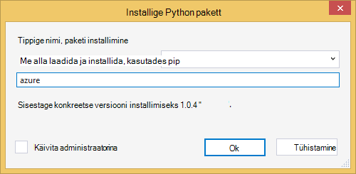
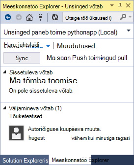
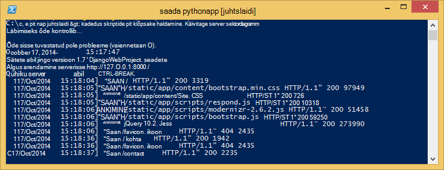
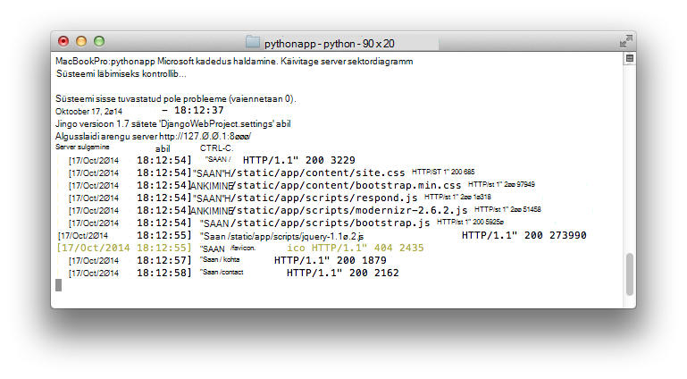
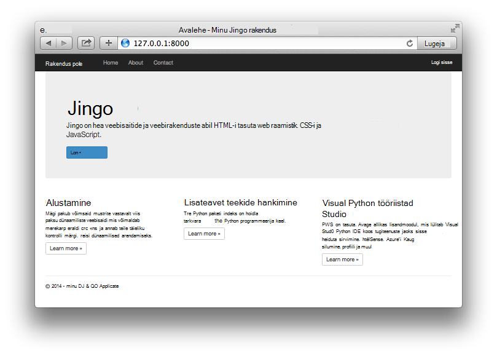

<properties
    pageTitle="Azure Django veebirakenduste loomine"
    description="Õppeteema, mis tutvustab töötab Python web appi Azure'i rakenduse teenuse veebirakendustes."
    services="app-service\web"
    documentationCenter="python"
    tags="python"
    authors="huguesv" 
    manager="wpickett" 
    editor=""/>

<tags
    ms.service="app-service-web"
    ms.workload="web"
    ms.tgt_pltfrm="na"
    ms.devlang="python"
    ms.topic="hero-article" 
    ms.date="02/19/2016"
    ms.author="huvalo"/>

# Azure Django veebirakenduste loomine

Selles õppetükis kirjeldatakse, kuidas alustada Python töötavate [Azure'i rakenduse teenuse Web Apps](http://go.microsoft.com/fwlink/?LinkId=529714). Web Apps pakub piiratud tasuta hosting ja kiire ja saate kasutada Python! Rakenduse kasvab, mida saab vahetada makstud hosting ja saate ka kõik Azure'i teenuste integreerimine.

Loote kasutav Django web raames (vt alternatiivse versiooni selles õpetuses [lisatakse](web-sites-python-create-deploy-flask-app.md) ja [pudel](web-sites-python-create-deploy-bottle-app.md)). Kuvatakse veebirakenduse loomine Azure'i turuplatsilt, Git juurutamise häälestamine ja klooni hoidla kohalikult. Seejärel kuvatakse käivitage rakendus kohalikult, teha muudatusi, Kinnita ja murravad Azure. Õpetuse näitab, kuidas seda teha Windowsi või Mac-arvutisse ja Linux.

[AZURE.INCLUDE [create-account-and-websites-note](../../includes/create-account-and-websites-note.md)]

>[AZURE.NOTE] Kui soovite alustada Azure'i rakendust Service enne Azure'i konto kasutajaks, minge [Proovige rakenduse teenus](http://go.microsoft.com/fwlink/?LinkId=523751), kus saate kohe luua lühiajaline starter web app rakenduse teenus. Nõutav; krediitkaardid kohustusi.

## Eeltingimused

- Windowsi, Maci või Linuxi
- Python 2.7 või 3.4
- setuptools, pip, virtualenv (ainult Python 2.7)
- Git
- [Python Tools for Visual Studio][] (PTVS) – Märkus: see pole kohustuslik

**Märkus**: TFS avaldamise pole praegu toetatud Python projektide jaoks.

### Windows

Kui teil pole veel Python 2.7 või 3.4 installitud (32-bitine), Soovitame installida [Azure SDK Python 2,7] või [Azure SDK Python 3.4] Web platvormi Installeri abil. See installib 32-bitise versiooni Python setuptools, pip, virtualenv, jne (32-bitine Python on, mis on installitud Azure hosti masinad). Teise võimalusena saate avada Python [python.org]kaudu.

Git, soovitame [Git for Windows] või [GitHub for Windows]. Kui kasutate Visual Studio, saate kasutada integreeritud Git tugi.

Soovitame [Python tööriistad 2.2 Visual Studio]installimisel. See pole kohustuslik, kuid kui teil on [Visual Studios], sh tasuta Visual Studio ühenduse 2013 või Visual Studio Express 2013 Web, siis see annab teile hästi Python-IDE.

### Mac/Linux

Peaks olema Python ja Git juba installitud, kuid veenduge, et teil on kas Python 2.7 või 3.4.

## Web Appi loomine portaalis

Kõigepealt rakenduse loomisel on [Azure portaali](https://portal.azure.com)kaudu veebirakenduse loomine.

1. Azure portaali sisse logida ja alumises vasakus nurgas nuppu **Uus** .
3. Tippige otsinguväljale "püüton".
4. Otsingutulemustes, valige **Django** (avaldatud PTVS) ja seejärel käsku **Loo**.
5. Uus Django rakendus, näiteks luua uus rakendus teenuse leping ja uue ressursirühma seda konfigureerida. Klõpsake nuppu **Loo**.
6. Git avaldamise vastloodud veebirakenduse jaoks konfigureerida veebisaidil [Kohaliku Git juurutamine Azure'i rakendust Service](app-service-deploy-local-git.md)juhiste järgi.

## Rakenduste ülevaade

### Git hoidla sisu

Siit leiate ülevaate leiate algse Git hoidla, mis kuvatakse me klooni järgmises jaotises failid.

    \app\__init__.py
    \app\forms.py
    \app\models.py
    \app\tests.py
    \app\views.py
    \app\static\content\
    \app\static\fonts\
    \app\static\scripts\
    \app\templates\about.html
    \app\templates\contact.html
    \app\templates\index.html
    \app\templates\layout.html
    \app\templates\login.html
    \app\templates\loginpartial.html
    \DjangoWebProject\__init__.py
    \DjangoWebProject\settings.py
    \DjangoWebProject\urls.py
    \DjangoWebProject\wsgi.py

Rakenduse allikast. Koosneb 3 juhtslaidi paigutus lehed (indeks kontakti kohta). Staatiliseks sisuks ja skriptide sisaldavad alglaaduri, jquery, modernizr ja vasta.

    \manage.py

Kohaliku juhtimise ja arengu serveri tugi. Kasutage seda kohalikult rakenduse käivitada, andmebaasi jne sünkroonida.

    \db.sqlite3

Vaikimisi andmebaasi. Sisaldab vajalikud tabelite jaoks rakenduse käivitamiseks, kuid ei sisalda kõik kasutajad (kasutaja loomiseks andmebaasi).

    \DjangoWebProject.pyproj
    \DjangoWebProject.sln

Projekti failide [Python Tools for Visual Studio]jaoks.

    \ptvs_virtualenv_proxy.py

IIS-i puhverserveri virtuaalkeskkonnas ja PTVS Kaug silumine tugi.

    \requirements.txt

Välise pakettide selle rakenduse jaoks vajalik. Juurutamise script on pip installige loendis selle faili paketid.

    \web.2.7.config
    \web.3.4.config

IIS-i failid. Juurutamise skripti kasutab vastav web.x.y.config ja kopeeritakse web.config.

### Valikuline failide - kohandamise juurutamine

[AZURE.INCLUDE [web-sites-python-django-customizing-deployment](../../includes/web-sites-python-django-customizing-deployment.md)]

### Valikuline failide - Python käitusaja

[AZURE.INCLUDE [web-sites-python-customizing-runtime](../../includes/web-sites-python-customizing-runtime.md)]

### Täiendavad failid serveris

Mõned failid serveris olemas, kuid ei lisata git hoidla. Need on loodud juurutamise skript.

    \web.config

IIS-i konfigureerimise faili. Loodud web.x.y.config iga juurutuse.

    \env\

Python virtuaalse keskkonnas. Kui ühilduvad virtuaalse keskkonna pole veel olemas web app loodud käigus juurutamist. Loendis requirements.txt on pip installitud, kuid pip vahele jätta installi, kui paketid on juba installitud.

Järgmiseks 3 jaotistes kirjeldatakse jätkata web app areng 3 viibite alusel:

- Windowsi Python Tools for Visual Studio abil
- Windowsi käsurea
- Mac/Linux käsurea

## Web app areng - Windows - Python tööriistad Visual Studio

### Klooni hoidla

Esmalt klooni hoidla Azure'i portaalis esitatud URL-i. Lisateabe saamiseks vt [Kohaliku Git juurutamise Azure'i rakenduse teenusega](app-service-deploy-local-git.md).

Avage lahenduse fail (.sln), mis sisaldab root hoidla.

### Virtuaalse keskkonna loomine

Nüüd saame luua virtuaalse keskkonna arengu. Paremklõpsake **Python keskkonnas** valige **Lisada virtuaalse keskkonna …**.

- Veenduge, et keskkonna nimi on `env`.

- Valige base Tõlgi. Veenduge, et kasutada sama versiooni Python, mis on valitud oma web app (runtime.txt või Azure'i portaalis oma veebirakenduse tera **Rakenduse sätted** ).

- Veenduge, et alla laadima ja installima paketid on valitud.

Klõpsake nuppu **Loo**. See loomine virtuaalse keskkonna ja installige loendis requirements.txt sõltuvused.

### Eeliskasutaja loomine

Andmebaasi kaasas rakendus ei saa mis tahes superkasutaja määratletud. Rakenduse või Django admin liides (kui te otsustate selle taas lubada) sisselogimise funktsiooni kasutamiseks peate eeliskasutaja loomiseks.

Käivitage see käsurea projekti kaustast:

    env\scripts\python manage.py createsuperuser

Järgige viipasid Määrake kasutajanimi, parool jne.

### Käivitage arengu serveri kasutamine

Silumine käivitamiseks vajutage klahvi F5 ja veebibrauseris avatakse automaatselt töötab kohalikult lehele.

Saate määrata katkestuspunktid allikad, kasutage vaadata windows jne. [Python Tools for Visual Studio dokumentatsiooni kohta] lisateabe saamiseks vt teemat erinevaid funktsioone.

### Muudatuste tegemine

Nüüd saate proovida tehes muudatusi rakenduse allikatest ja/või mallid.

Kui olete muudatuste testinud, kinnita need Git hoidla:

### Lisateavet pakettide installimine

Rakenduse võib-olla Lisaks Python ja Django sõltuvused.

Saate installida pakette pip abil. Paketi installimiseks paremklõpsake virtuaalse keskkonna ja valige **Installida Python pakett**.

Näiteks installida Azure SDK Python, mis annab teile juurdepääsu Azure storage, teenuse siini ja muude Azure'i teenuste, sisestage `azure`:

Paremklõpsake virtuaalse keskkonna ja valige **Genereeri requirements.txt** requirements.txt värskendada.

Seejärel kinnitage muudatused requirements.txt Git hoidla.

### Azure'i juurutamine

Juurutamine käivitamiseks nuppu **Sünkrooni** või **Push**. Sünkroonimine ei nii push ja tõmmake.

Esimese juurutamise võtab aega, nagu see loob virtuaalse keskkonnas, installi-pakettide jne.

Visual Studio ei kuvata juurutamise edenemist. Kui soovite selle väljundi üle vaatama kohta leiate jaotisest [tõrkeotsing – juurutamise](#troubleshooting-deployment)kohta.

Liikuge sirvides Azure'i URL-i muudatuste vaatamiseks.

## Web app arengu - Windows - käsurea

### Klooni hoidla

Esmalt klooni Azure'i portaalis esitatud URL-i hoidla ning lisage Azure hoidla Interneti. Lisateabe saamiseks vt [Kohaliku Git juurutamise Azure'i rakenduse teenusega](app-service-deploy-local-git.md).

    git clone <repo-url>
    cd <repo-folder>
    git remote add azure <repo-url>

### Virtuaalse keskkonna loomine

Loome uue virtuaalse keskkonna arengu eesmärgil (ei saa lisada see hoidla). Virtuaalkeskkonnas Python ei ole liigutatavat, nii, et iga arendaja, töötate rakenduse saab luua oma kohalikult.

Veenduge, et kasutada sama versiooni Python, mis on valitud oma web app (runtime.txt või Azure'i portaalis oma veebirakenduse tera rakenduse sätted).

Jaoks Python 2.7:

    c:\python27\python.exe -m virtualenv env

Jaoks Python 3.4:

    c:\python34\python.exe -m venv env

Mis tahes välise pakettide nõutud rakenduse installida. Hoidla juurtasemel requirements.txt faili abil saate installida paketid virtuaalse keskkond:

    env\scripts\pip install -r requirements.txt

### Eeliskasutaja loomine

Andmebaasi kaasas rakendus ei saa mis tahes superkasutaja määratletud. Rakenduse või Django admin liides (kui te otsustate selle taas lubada) sisselogimise funktsiooni kasutamiseks peate eeliskasutaja loomiseks.

Käivitage see käsurea projekti kaustast:

    env\scripts\python manage.py createsuperuser

Järgige viipasid Määrake kasutajanimi, parool jne.

### Käivitage arengu serveri kasutamine

Taotlemiseks arengut server järgmise käsu abil saate käivitada:

    env\scripts\python manage.py runserver

Konsooli kuvatakse URL-i ja pordi server on kuulata.

Avage see URL oma veebibrauseri.

### Muudatuste tegemine

Nüüd saate proovida tehes muudatusi rakenduse allikatest ja/või mallid.

Kui olete muudatuste testinud, kinnita need Git hoidla:

    git add <modified-file>
    git commit -m "<commit-comment>"

### Lisateavet pakettide installimine

Rakenduse võib-olla sõltuvused Python ning Django.

Saate installida pakette pip abil. Näiteks tippige Python, mis annab teile juurdepääsu Azure storage, teenuse siini ja muude Azure'i teenuste, installige Azure'i SDK:

    env\scripts\pip install azure

Veenduge, et värskendada requirements.txt.

    env\scripts\pip freeze > requirements.txt

Muudatuste kinnitamine:

    git add requirements.txt
    git commit -m "Added azure package"

### Azure'i juurutamine

Juurutamine käivitamiseks vajutage muudatuste Azure:

    git push azure master

Kuvatakse väljund juurutamise skripti, sealhulgas virtuaalse keskkonna loomine installimise paketid, web.config loomine.

Liikuge sirvides Azure'i URL-i muudatuste vaatamiseks.

## Web app arengu - Mac/Linux - käsurea

### Klooni hoidla

Esmalt klooni Azure'i portaalis esitatud URL-i hoidla ning lisage Azure hoidla Interneti. Lisateabe saamiseks vt [Kohaliku Git juurutamise Azure'i rakenduse teenusega](app-service-deploy-local-git.md).

    git clone <repo-url>
    cd <repo-folder>
    git remote add azure <repo-url>

### Virtuaalse keskkonna loomine

Loome uue virtuaalse keskkonna arengu eesmärgil (ei saa lisada see hoidla). Virtuaalkeskkonnas Python ei ole liigutatavat, nii, et iga arendaja, töötate rakenduse saab luua oma kohalikult.

Veenduge, et kasutada sama versiooni Python, mis on valitud oma web app (runtime.txt või Azure'i portaalis oma veebirakenduse tera rakenduse sätted).

Jaoks Python 2.7:

    python -m virtualenv env

Jaoks Python 3.4:

    python -m venv env

või

    pyvenv env

Mis tahes välise pakettide nõutud rakenduse installida. Hoidla juurtasemel requirements.txt faili abil saate installida paketid virtuaalse keskkond:

    env/bin/pip install -r requirements.txt

### Eeliskasutaja loomine

Andmebaasi kaasas rakendus ei saa mis tahes superkasutaja määratletud. Rakenduse või Django admin liides (kui te otsustate selle taas lubada) sisselogimise funktsiooni kasutamiseks peate eeliskasutaja loomiseks.

Käivitage see käsurea projekti kaustast:

    env/bin/python manage.py createsuperuser

Järgige viipasid Määrake kasutajanimi, parool jne.

### Käivitage arengu serveri kasutamine

Taotlemiseks arengut server järgmise käsu abil saate käivitada:

    env/bin/python manage.py runserver

Konsooli kuvatakse URL-i ja pordi server on kuulata.

Avage see URL oma veebibrauseri.

### Muudatuste tegemine

Nüüd saate proovida tehes muudatusi rakenduse allikatest ja/või mallid.

Kui olete muudatuste testinud, kinnita need Git hoidla:

    git add <modified-file>
    git commit -m "<commit-comment>"

### Lisateavet pakettide installimine

Rakenduse võib-olla Lisaks Python ja Django sõltuvused.

Saate installida pakette pip abil. Näiteks tippige Python, mis annab teile juurdepääsu Azure storage, teenuse siini ja muude Azure'i teenuste, installige Azure'i SDK:

    env/bin/pip install azure

Veenduge, et värskendada requirements.txt.

    env/bin/pip freeze > requirements.txt

Muudatuste kinnitamine:

    git add requirements.txt
    git commit -m "Added azure package"

### Azure'i juurutamine

Juurutamine käivitamiseks vajutage muudatuste Azure:

    git push azure master

Kuvatakse väljund juurutamise skripti, sealhulgas virtuaalse keskkonna loomine installimise paketid, web.config loomine.

Liikuge sirvides Azure'i URL-i muudatuste vaatamiseks.

## Tõrkeotsing – paketi installimine

[AZURE.INCLUDE [web-sites-python-troubleshooting-package-installation](../../includes/web-sites-python-troubleshooting-package-installation.md)]

## Tõrkeotsing – virtuaalse keskkonnas

[AZURE.INCLUDE [web-sites-python-troubleshooting-virtual-environment](../../includes/web-sites-python-troubleshooting-virtual-environment.md)]

## Tõrkeotsing – staatilise failid

Django on staatiline failide kogumine mõiste. See viib kõik staatiline failid oma algsest asukohast ning kopeerib neid ühe kausta. Selle rakenduse kopeerimist `/static`.

Seda tehakse, kuna see on staatiline failid võivad pärineda eri Django "rakendused". Näiteks virtuaalkeskkonnas alamkaustas Django teegis asuvad staatilise failid Django administraator liideste kaudu. Staatilise määratletud selle rakenduse failid on `/app/static`. Kui kasutate rohkem Django "rakendused", on teil staatilise failid, mis asuvad mitmes kohas.

Kui rakendus töötab silumine režiimis, pakutakse rakenduse staatilisi faile oma algsest asukohast.

Väljalaske režiimis rakenduse käivitamisel rakenduse ei **ei** Teeni staatilise failid. Et failid veebiserver vastutab. Selle rakenduse IIS-i aitab staatilise faile `/static`.

Saidikogumi staatilise faile, mis tehakse automaatselt varem kogutud juurutamise skripti, tühjendada osa faile. See tähendab kogumine ilmneb iga juurutuse aeglustavad juurutamise natuke, kuid see tagab, et aegunud faile ei saa kasutada, võimalike turvalisus probleemi vältimiseks.

Kui soovite saidikogumi staatiliste failide Django rakenduse vahele jätta.

    \.skipDjango

Seejärel peate tegema saidikogumi käsitsi oma kohalikus arvutis:

    env\scripts\python manage.py collectstatic

Seejärel eemaldage selle `\static` kausta `.gitignore` ja lisage see Git hoidla.

## Tõrkeotsing – sätted

Rakenduse eri sätteid saab muuta `DjangoWebProject/settings.py`.

Arendaja mugavuse huvides silumine režiim on lubatud. Ühe kena pool mõju, mis on küll vaadata, piltide ja muude staatiliseks sisuks käivitamisel kohalikult, ilma kogumiseks staatilisi faile.

Silumine režiimis keelamiseks tehke järgmist.

    DEBUG = False

Kui silumine on keelatud, väärtus `ALLOWED_HOSTS` tuleb värskendada lisada Azure hosti nimi. Näiteks:

    ALLOWED_HOSTS = (
        'pythonapp.azurewebsites.net',
    )

või mis tahes lubamine.

    ALLOWED_HOSTS = (
        '*',
    )

Praktikas soovite midagi keerukamaid tegeleda vaheldumisi silumine ja vabastage režiimi ja saada hosti nimi.

Keskkonna muutujate lehe **KONFIGUREERIMINE** Azure portaali kaudu saate seada jaotises **rakenduse sätted** .  See võib olla kasulik häälestuse väärtused, mis te võib-olla soovite kuvada allikad (ühendusstringi, paroolid jne) või mille soovite seada teisiti Azure ja teie kohaliku arvuti vahel. Klõpsake `settings.py`, keskkonna muutujate abil saate teha päringuid `os.getenv`.

## Andmebaasi kasutamine

Andmebaasi, mis on kaasas rakendus on sqlite andmebaas. See on mugav ja kasulik vaikimisi andmebaasi kasutama arengu, mis nõuab peaaegu häälestus. Andmebaas on salvestatud faili db.sqlite3 projekti kausta.

Azure'i pakub andmebaasi teenused on lihtne kasutada Django rakendusest. Õpetused [SQL-andmebaasi] ja [MySQL-i] kaudu Django rakenduse kuva juhiseid vaja luua andmebaasi teenuse, muutke sätteid andmebaasi `DjangoWebProject/settings.py`, ja installimiseks vaja teekidega.

Muidugi, kui soovite hallata oma andmebaasi serverid, saate teha nii abil Windowsi või Linuxi töötavate Azure'i virtuaalmasinates.

## Kasutajaliidese Django administraator

Kui hakkate oma mudelite koostamise, mida soovite andmebaasi mõned andmetega asustada. Lihtne viis lisada ja redigeerida sisu interaktiivseks on Django Administreerimine kasutajaliides.

Administraator kasutajaliidese kood on kommenteerinud välja allikad rakenduse, kuid seda selgelt märgitud nii saate hõlpsasti lubada (Otsi 'admin').

Kui see on lubatud, andmebaasi sünkroonimiseks, käivitage rakendus ja avage `/admin`.

## Järgmised sammud

Järgmiste linkide kaudu Lisateavet Django ja Python Tools for Visual Studio:

- [Django dokumentatsioon]
- [Python Tools for Visual Studio dokumentatsioon]

SQL-andmebaasi ja MySQL-i kasutamise kohta teavet:

- [Django ja MySQL-i Azure Python Tools for Visual Studio abil]
- [Django ja Python Tools for Visual Studio abil Azure SQL-i andmebaasiga]

Lisateavet leiate teemast [Python Arenduskeskus](/develop/python/).

## Mis on muutunud
* Muuda juhend veebisaitide rakenduse teenusega leiate: [Azure'i rakendust Service ja selle mõju olemasoleva Azure'i teenused](http://go.microsoft.com/fwlink/?LinkId=529714)

<!--Link references-->
[Django ja MySQL-i Azure Python Tools for Visual Studio abil]: web-sites-python-ptvs-django-mysql.md
[Django ja Python Tools for Visual Studio abil Azure SQL-i andmebaasiga]: web-sites-python-ptvs-django-sql.md
[SQL-andmebaas]: web-sites-python-ptvs-django-sql.md
[MySQL-i]: web-sites-python-ptvs-django-mysql.md

<!--External Link references-->
[Azure'i SDK Python 2.7]: http://go.microsoft.com/fwlink/?linkid=254281
[Azure'i SDK Python 3.4]: http://go.microsoft.com/fwlink/?linkid=516990
[Python.org]: http://www.python.org/
[Git for Windows]: http://msysgit.github.io/
[GitHub for Windows]: https://windows.github.com/
[Python Tools for Visual Studio]: http://aka.ms/ptvs
[Python tööriistade 2.2 Visual Studio]: http://go.microsoft.com/fwlink/?LinkID=624025
[Visual Studio]: http://www.visualstudio.com/
[Python Tools for Visual Studio dokumentatsioon]: http://aka.ms/ptvsdocs
[Django dokumentatsioon]: https://www.djangoproject.com/
