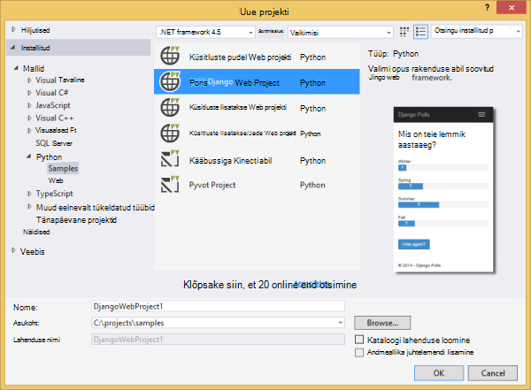
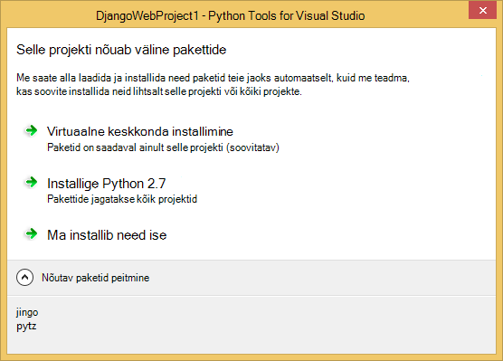
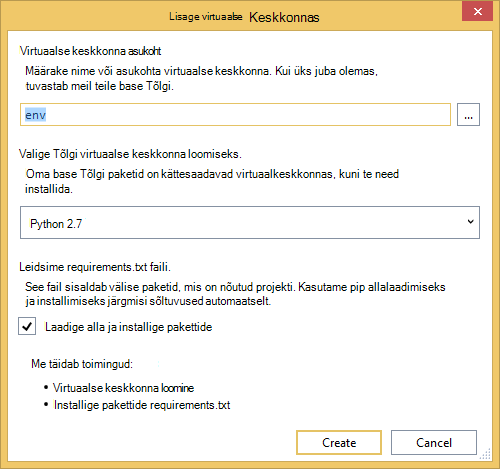
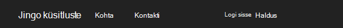
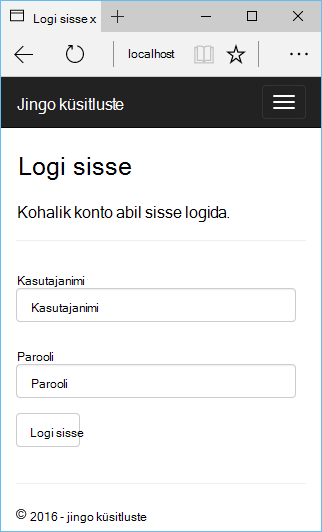
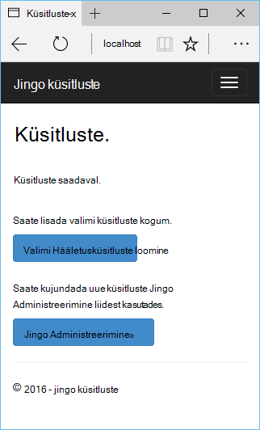
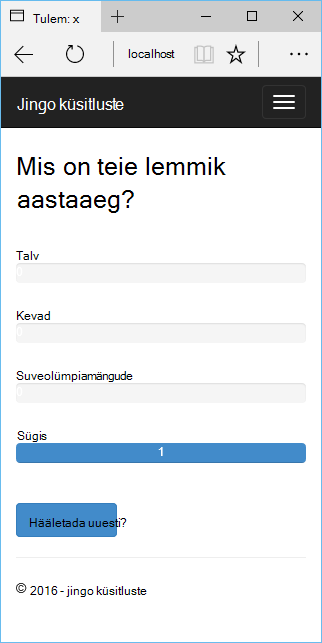
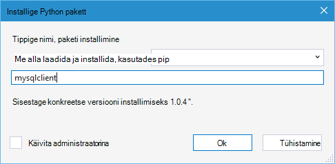
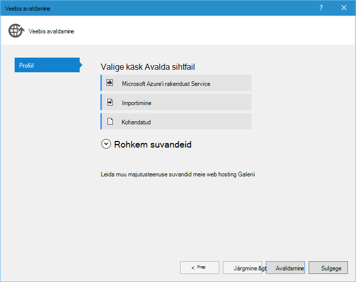
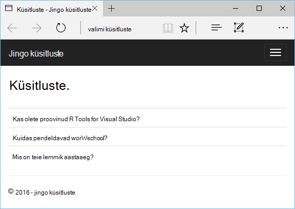

<properties 
    pageTitle="Django ja MySQL-i Azure Python tööriistu 2.2 Visual Studio" 
    description="Saate teada, kuidas luua Django veebirakenduse, mis salvestab andmed MySQL-i andmebaasi eksemplari Python Tools for Visual Studio abil ja selle juurutama Azure'i rakenduse teenuse Web Apps." 
    services="app-service\web" 
    documentationCenter="python" 
    authors="huguesv" 
    manager="wpickett" 
    editor=""/>

<tags 
    ms.service="app-service-web" 
    ms.workload="web" 
    ms.tgt_pltfrm="na" 
    ms.devlang="python"
    ms.topic="get-started-article" 
    ms.date="07/07/2016"
    ms.author="huvalo"/>

# Django ja MySQL-i Azure Python tööriistu 2.2 Visual Studio 

[AZURE.INCLUDE [tabs](../../includes/app-service-web-get-started-nav-tabs.md)]

Selles õppetükis saate kasutada [Python Tools for Visual Studio] (PTVS) luua lihtsa küsitluste veebirakenduse, kasutades ühte järgmistest PTVS Näidismallid. Saate teada, majutatud Azure'i MySQL-i teenuse kasutamise kohta, veebirakenduse kasutama MySQL-i konfigureerimine ja kuidas avaldada veebirakenduse [Azure'i rakenduse teenuse](http://go.microsoft.com/fwlink/?LinkId=529714)veebirakenduste.

> [AZURE.NOTE] Selles õppetükis sisalduvat teavet pakutakse ka järgmisest videost:
> 
> [PTVS 2.1: Django rakenduse MySQL-i abil][video]

Vaadake veel artikleid, mis hõlmavad Azure rakenduse teenuse veebirakenduste abil pudel, lisatakse ja Django web raamistik Azure'i Tabelimälu, MySQL-i ja SQL-andmebaasi teenustega PTVS arendamine [Python Arenduskeskus] . Kuigi see artikkel keskendub rakendust Service, juhiseid on sarnased väljatöötamisel [Azure'i pilveteenustega].

## Eeltingimused

 - Visual Studio 2015
 - [Python 2.7 32-bitine] või [Python 3.4 32-bitine versioon]
 - [Python tööriistade 2.2 Visual Studio]
 - [Python tööriistade 2.2 Visual Studio näidised VSIX jaoks]
 - [Azure'i SDK tööriistad VS 2015]
 - Django 1,9 või uuem versioon

[AZURE.INCLUDE [create-account-and-websites-note](../../includes/create-account-and-websites-note.md)]

<!-- This note should not render as part of the the previous include. -->

> [AZURE.NOTE] Kui soovite alustada Azure'i rakendust Service enne Azure'i konto kasutajaks, minge [Proovige rakenduse teenus](http://go.microsoft.com/fwlink/?LinkId=523751), kus saate kohe luua lühiajaline starter web app rakenduse teenus. Krediitkaarti on vaja ja kohustusi on vaja.

## Projekti loomine

Selles jaotises saate luua Visual Studio projekti valimi malli abil. Saate luua virtuaalse keskkonna ja installige nõutav paketid. Saate luua kohaliku andmebaasi sqlite abil. Seejärel kuvatakse rakenduse käivitada kohalikult.

1. Visual Studio, valige **fail**, **Uue projekti**.

1. Projekti Mallid: [Python tööriistad 2.2 for Visual Studio näidised VSIX] on saadaval jaotises **Python**, **näidiseid**. Valige **Küsitluste Django Web projekti** ja projekti loomiseks klõpsake nuppu OK.

    

1. Teil palutakse välise pakettide installimiseks. Valige **virtuaalse keskkonda installida**.

    

1. Valige **Python 2.7** või **Python 3.4** base Tõlgi.

    

1. **Lahenduste Explorer**, paremklõpsake projekti sõlm ja valige **Python**ja valige **Django migreerimine**.  Valige **Django loomine superkasutaja**.

1. See avada Django Management Console ja sqlite andmebaasi loomine projekti kausta. Järgige viipasid kasutaja loomiseks.

1. Veenduge, et rakendus töötab, vajutades `F5`.

1. Ülaosas navigeerimisribal nuppu **Logi sisse** .

    

1. Sisestage mandaat, saate luua, kui teie sünkroonitud andmebaasi kasutaja jaoks.

    

1. Klõpsake nuppu **proovi Hääletusküsitluste loomine**.

    

1. Klõpsake küsitluse ja hääletada.

    

## MySQL-i andmebaasi loomine

Andmebaasi, saate luua ClearDB MySQL-i majutatud andmebaasi Azure.

Teise võimalusena saate luua oma virtuaalse masina Azure, kus töötab ja seejärel installige ja MySQL-i ise hallata.

Saate luua andmebaasi tasuta plaan järgmiste juhiste järgi.

1. [Azure'i portaali]sisse logida.

1. Navigeerimispaani ülaosas nuppu **Uus**, seejärel klõpsake **andmete + salvestusruumi**ja klõpsake **MySQL-andmebaasiga**. 

1. Valige selle jaoks sobivasse konfigureerimine uue MySQL-andmebaasiga, luues uue ressursirühma.

1. Kui MySQL-i andmebaas on loodud, klõpsake andmebaasi tera nuppu **Atribuudid** .

1. **ÜHENDUSSTRINGI** väärtus sellele lõikelaua nupp Kopeeri abil.

## Projekti konfigureerimine

Selles jaotises saate konfigureerida meie web appi kasutamine vastloodud MySQL-andmebaasiga. Saate installida ka Python pakette kasutama MySQL-i andmebaaside Django. Seejärel käivitate veebirakenduse kohalikult.

1. Visual Studio, avage **settings.py**, *ProjectName* kaustast. Kleepige ajutiselt redaktori ühendusstring. Ühendusstringi on selles vormingus:

        Database=<NAME>;Data Source=<HOST>;User Id=<USER>;Password=<PASSWORD>

    Muutke vaikimisi andmebaasi MySQL-i kasutada **mootori** ja **nime**, **kasutaja**, **parool** ja **HOST** väärtused seadmine **CONNECTIONSTRING**.

        DATABASES = {
            'default': {
                'ENGINE': 'django.db.backends.mysql',
                'NAME': '<Database>',
                'USER': '<User Id>',
                'PASSWORD': '<Password>',
                'HOST': '<Data Source>',
                'PORT': '',
            }
        }

1. Solution Exploreris jaotises **Python keskkonnas**, paremklõpsake virtuaalse keskkonna ja valige **Installida Python pakett**.

1. Installige pakett `mysqlclient` **pip**abil.

    

1. **Lahenduste Explorer**, paremklõpsake projekti sõlm ja valige **Python**ja valige **Django migreerimine**.  Valige **Django loomine superkasutaja**.

    See loob eelmises tööetapis loodud MySQL-i andmebaasi tabelid. Järgige viipasid kasutaja, mis ei vasta kasutaja loodud esimene jaotis käesoleva artikli sqlite andmebaasi loomiseks.

1. Käivitage rakendus koos `F5`. Küsitlused, mis on loodud **Valimi hääletuste loomine** ja andmete alusel hääletamine on seeriasertide MySQL-i andmebaasist.

## Azure'i rakendust Service veebirakenduse avaldamine

Azure'i .NET SDK abil on lihtne juurutada oma veebirakenduse Azure'i rakendust Service.

1. **Lahenduste Explorer**, paremklõpsake projekti sõlm ja valige käsk **Avalda**.

    

1. Klõpsake **Microsoft Azure'i rakendust Service**.

1. Klõpsake **Uus** uue veebirakenduse loomine.

1. Täitke järgmised väljad ja klõpsake nuppu **Loo**.
    - **Web App nimi**
    - **Rakenduse teenusleping**
    - **Ressursirühm**
    - **Piirkond**
    - Jätke **andmebaasi server** **pole andmebaasi** määramine

1. Aktsepteeri kõik muud vaikesätted ja klõpsake nuppu **Avalda**.

1. Veebibrauseris avatakse automaatselt avaldatud web appi. Peaksite nägema veebirakenduse tööta oodatud viisil, kasutades majutatud Azure'i **MySQL** -andmebaasiga.

    

    Palju õnne! MySQL-i-põhine veebirakenduse on edukalt avaldatud Azure.

## Järgmised sammud

Järgmiste linkide kaudu Lisateavet Python tööriistad Visual Studio, Django ja MySQL-i jaoks.

- [Python Tools for Visual Studio dokumentatsioon]
  - [Veebi projektid]
  - [Pilveteenuse teenuse projektid]
  - [Microsoft Azure Remote silumine]
- [Django dokumentatsioon]
- [MySQL-i]

Lisateavet leiate teemast [Python Arenduskeskus](/develop/python/).

<!--Link references-->

[Python Arenduskeskus]: /develop/python/
[Azure pilveteenused]: ../cloud-services-python-ptvs.md

<!--External Link references-->

[Azure'i portaal]: https://portal.azure.com
[Python Tools for Visual Studio]: http://aka.ms/ptvs
[Python tööriistade 2.2 Visual Studio]: http://go.microsoft.com/fwlink/?LinkID=624025
[Python tööriistade 2.2 Visual Studio näidised VSIX jaoks]: http://go.microsoft.com/fwlink/?LinkID=624025
[Azure'i SDK tööriistad VS 2015]: http://go.microsoft.com/fwlink/?LinkId=518003
[Python 2.7 32-bitine versioon]: http://go.microsoft.com/fwlink/?LinkId=517190 
[Python 3.4 32-bitine versioon]: http://go.microsoft.com/fwlink/?LinkId=517191
[Python Tools for Visual Studio dokumentatsioon]: http://aka.ms/ptvsdocs
[Microsoft Azure Remote silumine]: http://go.microsoft.com/fwlink/?LinkId=624026
[Veebi projektid]: http://go.microsoft.com/fwlink/?LinkId=624027
[Pilveteenuse teenuse projektid]: http://go.microsoft.com/fwlink/?LinkId=624028
[Django dokumentatsioon]: https://www.djangoproject.com/
[MySQL-i]: http://www.mysql.com/
[video]: http://youtu.be/oKCApIrS0Lo
