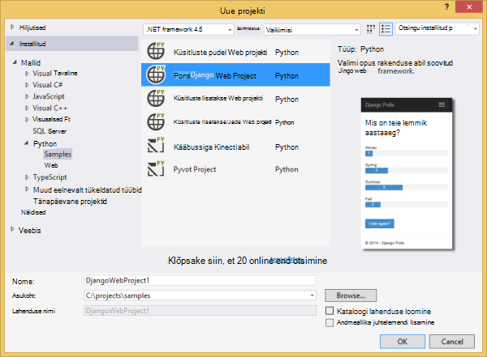
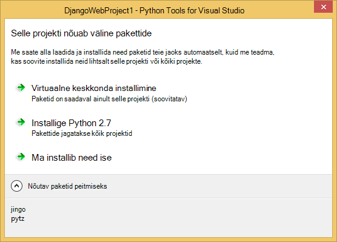
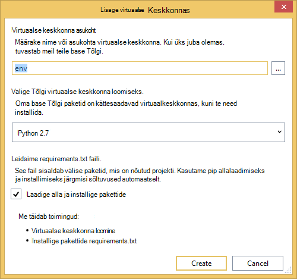
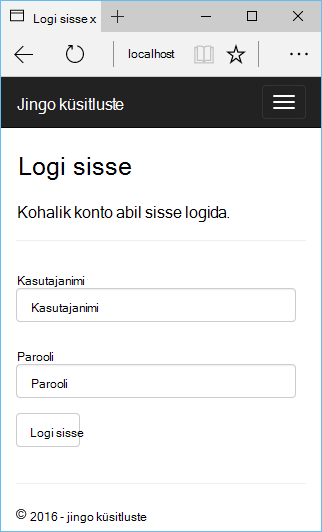
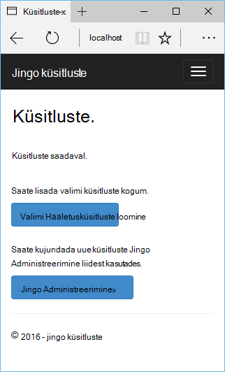
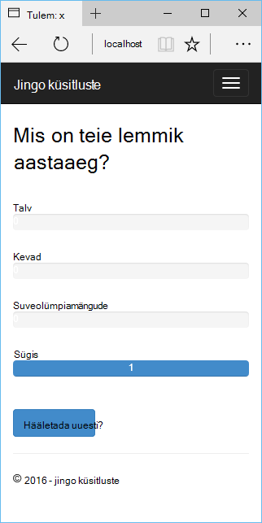
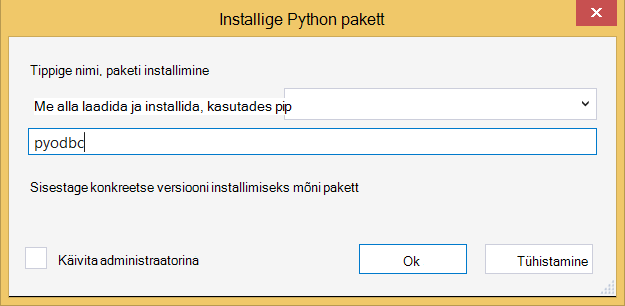
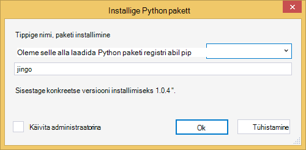
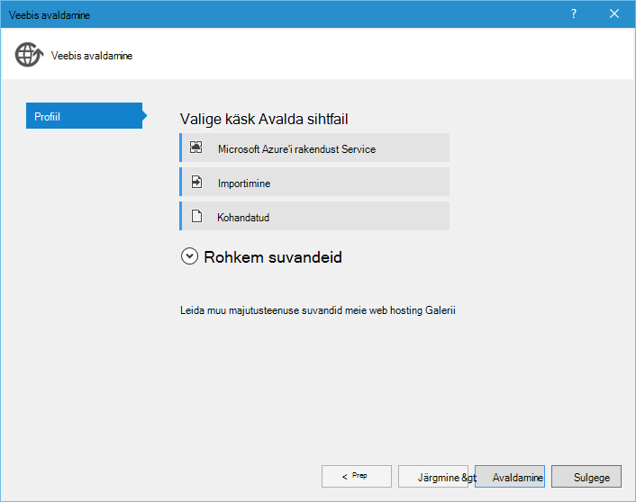
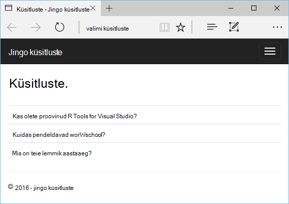

<properties 
    pageTitle="Django ja Python tööriistu 2.2 Visual Studio Azure SQL-i andmebaasiga" 
    description="Saate teada, kuidas luua Django veebirakenduse, mis salvestab andmed SQL-andmebaasi eksemplari Python Tools for Visual Studio abil ja selle juurutama Azure'i rakenduse teenuse Web Apps." 
    services="app-service\web" 
    tags="python"
    documentationCenter="python" 
    authors="huguesv" 
    manager="wpickett" 
    editor=""/>

<tags 
    ms.service="app-service-web" 
    ms.workload="web" 
    ms.tgt_pltfrm="na" 
    ms.devlang="python" 
    ms.topic="article" 
    ms.date="07/07/2016"
    ms.author="huguesv"/>

# Django ja Python tööriistu 2.2 Visual Studio Azure SQL-i andmebaasiga 

Selles õpetuses kasutame [Python Tools for Visual Studio] abil luua lihtsa küsitluste veebirakenduse, kasutades ühte järgmistest PTVS Näidismallid. Selles õpetuses on ka [video](https://www.youtube.com/watch?v=ZwcoGcIeHF4)saadaval.

Me õpite kasutamine majutatud Azure SQL-andmebaasi, web appi kasutamine SQL-andmebaasi konfigureerimine ja kuidas avaldada veebirakenduse [Azure'i rakenduse teenuse](http://go.microsoft.com/fwlink/?LinkId=529714)veebirakenduste.

Vaadake veel artikleid, mis hõlmavad Azure rakenduse teenuse veebirakenduste abil pudel, lisatakse ja Django web raamistik Azure'i Tabelimälu, MySQL-i ja SQL-andmebaasi teenustega PTVS arendamine [Python Arenduskeskus] . Kuigi see artikkel keskendub rakendust Service, juhiseid on sarnased väljatöötamisel [Azure'i pilveteenustega].

## Eeltingimused

 - Visual Studio 2015
 - [Python 2.7 32-bitine versioon]
 - [Python tööriistade 2.2 Visual Studio]
 - [Python tööriistade 2.2 Visual Studio näidised VSIX jaoks]
 - [Azure'i SDK tööriistad VS 2015]
 - Django 1,9 või uuem versioon

[AZURE.INCLUDE [create-account-and-websites-note](../../includes/create-account-and-websites-note.md)]

>[AZURE.NOTE] Kui soovite alustada Azure'i rakendust Service enne Azure'i konto kasutajaks, minge [Proovige rakenduse teenus](http://go.microsoft.com/fwlink/?LinkId=523751), kus saate kohe luua lühiajaline starter web app rakenduse teenus. Nõutav; krediitkaardid kohustusi.

## Projekti loomine

Selles jaotises loome Visual Studio projekti valimi malli abil. Vaatame luua virtuaalse keskkonna ja installige nõutav paketid. Loome kohaliku andmebaasi sqlite abil. Seejärel kuvatakse veebirakenduse Käivita kohalikult.

1.  Visual Studio, valige **fail**, **Uue projekti**.

1.  Projekti Mallid: [Python tööriistad 2.2 for Visual Studio näidised VSIX] on saadaval jaotises **Python**, **näidiseid**. Valige **Küsitluste Django Web projekti** ja projekti loomiseks klõpsake nuppu OK.

    

1.  Teil palutakse välise pakettide installimiseks. Valige **virtuaalse keskkonda installida**.

    

1.  Valige **Python 2.7** base Tõlgi.

    

1.  **Lahenduste Explorer**, paremklõpsake projekti sõlm ja valige **Python**ja valige **Django migreerimine**.  Valige **Django loomine superkasutaja**.

1.  See avada Django Management Console ja sqlite andmebaasi loomine projekti kausta. Järgige viipasid kasutaja loomiseks.

1.  Veenduge, et rakendus töötab, vajutage <kbd>klahvi F5</kbd>.

1.  Ülaosas navigeerimisribal nuppu **Logi sisse** .

    

1.  Sisestage mandaat, saate luua, kui teie sünkroonitud andmebaasi kasutaja jaoks.

    

1.  Klõpsake nuppu **proovi Hääletusküsitluste loomine**.

    

1.  Klõpsake küsitluse ja hääletada.

    

## SQL-i andmebaasi loomine

Andmebaasi, loome Azure'i SQL-andmebaasiga.

Järgmiste juhiste järgi saate luua andmebaasi.

1.  Logige [Azure portaali].

1.  Navigeerimispaani allosas nuppu **Uus**. , klõpsake **andmete + salvestusruumi** > **SQL-andmebaasi**.

1.  Uue ressursirühma loomisega uue SQL-andmebaasi konfigureerimine ja valige sobiv asukoht seda.

1.  Kui SQL-andmebaas on loodud, klõpsake **Visual Studios avatud** andmebaasi tera.
2.  Klõpsake nuppu **Konfigureeri tulemüüri**.
3.  **Tulemüüri sätete** tera, lisage tulemüüri reegli **Alustada IP** -ja **LÕPPAEG IP** seadmine avaliku arendamist arvuti IP-aadress. Klõpsake nuppu **Salvesta**.

    See võimaldab ühendused andmebaasiserveriga arengu teie arvutist.

4.  Olles tagasi kohas andmebaasi labale nuppu **Atribuudid**ja seejärel klõpsake nuppu **Kuva andmebaasi ühendusstringi**. 

2.  **ADO.net-i** väärtus sellele Lõikelaud nuppu Kopeeri abil.

## Projekti konfigureerimine

Selles jaotises configure meie web appi me äsja loodud SQL-andmebaasi kasutama. Installida kuvatakse ka Python pakette kasutama SQL andmebaase Django. Seejärel kuvatakse veebirakenduse Käivita kohalikult.

1.  Visual Studio, avage **settings.py**, *ProjectName* kaustast. Kleepige ajutiselt redaktori ühendusstring. Ühendusstringi on selles vormingus:

        Server=<ServerName>,<ServerPort>;Database=<DatabaseName>;User ID=<UserName>;Password={your_password_here};Encrypt=True;TrustServerCertificate=False;Connection Timeout=30;

Redigeeri määratlus `DATABASES` kasutada ülaltoodud väärtused.

        DATABASES = {
            'default': {
                'ENGINE': 'sql_server.pyodbc',
                'NAME': '<DatabaseName>',
                'USER': '<UserName>',
                'PASSWORD': '{your_password_here}',
                'HOST': '<ServerName>',
                'PORT': '<ServerPort>',
                'OPTIONS': {
                    'driver': 'SQL Server Native Client 11.0',
                    'MARS_Connection': 'True',
                }
            }
        }

1.  Solution Exploreris jaotises **Python keskkonnas**, paremklõpsake virtuaalse keskkonna ja valige **Installida Python pakett**.

1.  Installige pakett `pyodbc` **pip**abil.

    

1.  Installige pakett `django-pyodbc-azure` **pip**abil.

    

1.  **Lahenduste Explorer**, paremklõpsake projekti sõlm ja valige **Python**ja valige **Django migreerimine**.  Valige **Django loomine superkasutaja**.

    See loob lõime eelmises jaotises SQL-andmebaasi tabelid. Järgige viipasid kasutaja, mis ei vasta kasutaja loodud esimene jaotis sqlite andmebaasi loomiseks.

1.  Käivitage rakendus koos `F5`. Küsitlused, mis on loodud **Valimi hääletuste loomine** ja andmete alusel hääletamine on seeriasertide SQL-andmebaasis.

## Azure'i rakendust Service veebirakenduse avaldamine

Azure'i .NET SDK abil on lihtne juurutada oma veebirakenduse web Azure'i rakenduse teenuse Web Apps.

1.  **Lahenduste Explorer**, paremklõpsake projekti sõlm ja valige käsk **Avalda**.

    

1.  Klõpsake **Microsoft Azure'i Web Apps**.

1.  Klõpsake **Uus** uue veebirakenduse loomine.

1.  Täitke järgmised väljad ja klõpsake nuppu **Loo**.
    -   **Web App nimi**
    -   **Rakenduse teenusleping**
    -   **Ressursirühm**
    -   **Piirkond**
    -   Jätke **andmebaasi server** **pole andmebaasi** määramine

1.  Aktsepteeri kõik muud vaikesätted ja klõpsake nuppu **Avalda**.

1.  Veebibrauseris avatakse automaatselt avaldatud web appi. Peaksite nägema tööta eeldatud, veebirakenduse abil majutatud Azure **SQL** -andmebaasi.

    Palju õnne!

    

## Järgmised sammud

Järgmiste linkide kaudu Lisateavet Python tööriistad Visual Studio, Django ja SQL-andmebaasi.

- [Python Tools for Visual Studio dokumentatsioon]
  - [Veebi projektid]
  - [Pilveteenuse teenuse projektid]
  - [Microsoft Azure Remote silumine]
- [Django dokumentatsioon]
- [SQL-andmebaas]

## Mis on muutunud
* Muuda juhend veebisaitide rakenduse teenusega leiate: [Azure'i rakendust Service ja selle mõju olemasoleva Azure'i teenused](http://go.microsoft.com/fwlink/?LinkId=529714)

<!--Link references-->
[Python Arenduskeskus]: /develop/python/
[Azure pilveteenused]: ../cloud-services-python-ptvs.md

<!--External Link references-->
[Azure'i portaal]: https://portal.azure.com
[Python Tools for Visual Studio]: http://aka.ms/ptvs
[Python tööriistade 2.2 Visual Studio]: http://go.microsoft.com/fwlink/?LinkID=624025
[Python tööriistade 2.2 Visual Studio näidised VSIX jaoks]: http://go.microsoft.com/fwlink/?LinkID=624025
[Azure'i SDK tööriistad VS 2015]: http://go.microsoft.com/fwlink/?LinkId=518003
[Python 2.7 32-bitine versioon]: http://go.microsoft.com/fwlink/?LinkId=517190 
[Python Tools for Visual Studio dokumentatsioon]: http://aka.ms/ptvsdocs
[Microsoft Azure Remote silumine]: http://go.microsoft.com/fwlink/?LinkId=624026
[Veebi projektid]: http://go.microsoft.com/fwlink/?LinkId=624027
[Pilveteenuse teenuse projektid]: http://go.microsoft.com/fwlink/?LinkId=624028
[Django dokumentatsioon]: https://www.djangoproject.com/
[SQL-andmebaas]: /documentation/services/sql-database/
