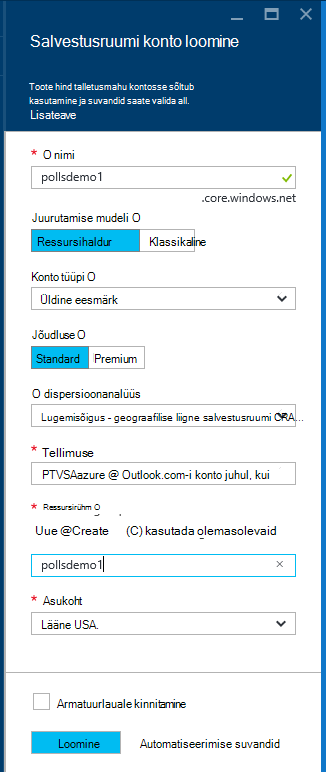
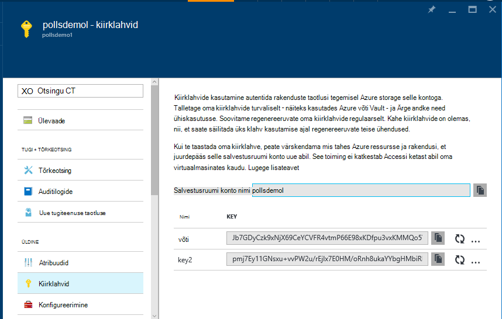

<properties 
    pageTitle="Lisatakse ja Azure Python tööriistu 2.2 Visual Studio Azure'i Tabelimälu" 
    description="Saate teada, kuidas luua lisatakse veebirakenduse, mis salvestab andmed Azure'i Tabelimälu Python Tools for Visual Studio abil ja selle juurutama Azure'i rakenduse teenuse Web Apps." 
    services="app-service\web"
    tags="python"
    documentationCenter="python" 
    authors="huguesv" 
    manager="wpickett" 
    editor=""/>

<tags 
    ms.service="app-service-web" 
    ms.workload="web" 
    ms.tgt_pltfrm="na" 
    ms.devlang="python" 
    ms.topic="article" 
    ms.date="07/07/2016"
    ms.author="huvalo"/>

# Lisatakse ja Azure Python tööriistu 2.2 Visual Studio Azure'i Tabelimälu 

Selles õpetuses kasutame [Python Tools for Visual Studio] abil luua lihtsa küsitluste veebirakenduse, kasutades ühte järgmistest PTVS Näidismallid. Selles õpetuses on ka [video](https://www.youtube.com/watch?v=qUtZWtPwbTk)saadaval.

Veebirakenduse küsitluste määratleb mõne selle hoidla võtmiseks nii saate hõlpsasti vaheldumisi eri tüüpi hoidlate (-mälu, Azure'i Tabelimälu, MongoDB).

Me õpite Azure Storage konto loomise kohta, konfigureerimine veebirakenduse kasutama Azure'i Tabelimälu ja kuidas avaldada veebirakenduse [Azure'i rakenduse teenuse](http://go.microsoft.com/fwlink/?LinkId=529714)veebirakenduste.

Vaadake veel artikleid, mis hõlmavad Azure rakenduse teenuse veebirakenduste abil pudel, lisatakse ja Django web raamistik MongoDB, Azure'i Tabelimälu, MySQL-i ja SQL-andmebaasi teenustega PTVS arendamine [Python Arenduskeskus] . Kuigi see artikkel keskendub rakendust Service, juhiseid on sarnased väljatöötamisel [Azure'i pilveteenustega].

## Eeltingimused

 - Visual Studio 2015
 - [Python tööriistade 2.2 Visual Studio]
 - [Python tööriistade 2.2 Visual Studio näidised VSIX jaoks]
 - [Azure'i SDK tööriistad VS 2015]
 - [Python 2.7 32-bitine] või [Python 3.4 32-bitine versioon]

[AZURE.INCLUDE [create-account-and-websites-note](../../includes/create-account-and-websites-note.md)]

>[AZURE.NOTE] Kui soovite alustada Azure'i rakendust Service enne Azure'i konto kasutajaks, minge [Proovige rakenduse teenus](http://go.microsoft.com/fwlink/?LinkId=523751), kus saate kohe luua lühiajaline starter web app rakenduse teenus. Nõutav; krediitkaardid kohustusi.

## Projekti loomine

Selles jaotises loome Visual Studio projekti valimi malli abil. Vaatame luua virtuaalse keskkonna ja installige nõutav paketid. Seejärel kuvatakse Käivita vaike-mälu hoidla kohalikult kasutav.

1.  Visual Studio, valige **fail**, **Uue projekti**.

1.  Projekti Mallid: [Python tööriistad 2.2 for Visual Studio näidised VSIX] on saadaval jaotises **Python**, **näidiseid**. Valige **Küsitluste lisatakse Web projekti** ja projekti loomiseks klõpsake nuppu OK.

    

1.  Teil palutakse välise pakettide installimiseks. Valige **virtuaalse keskkonda installida**.

    

1.  Valige **Python 2.7** või **Python 3.4** base Tõlgi.

    

1.  Veenduge, et rakendus töötab, vajutades `F5`. Vaikimisi rakendus kasutab-mälu hoidla, mis ei nõua konfiguratsiooni. Kõik andmed lähevad kaotsi, kui veebiserver lõpetada.

1.  **Valimi hääletuste loomine**, klõpsake käsku küsitlus ja hääletada.

    

## Azure'i salvestusruumi konto loomine

Salvestusruumi toimingute kasutamiseks on vaja Azure storage konto. Järgmiste juhiste järgi saate luua salvestusruumi konto.

1.  Logige [Azure portaali](https://portal.azure.com/).

2. Klõpsake vasakus ülanurgas ikooni **Uus** portaali, klõpsake **andmete + salvestusruumi** > **Salvestusruumi konto**. **Loo**, klõpsake nuppu ja seejärel andke salvestusruumi konto kordumatu nimi ja selle jaoks looma uue [Ressursirühma](../azure-resource-manager/resource-group-overview.md) .

    

    Salvestusruumi konto loomisel kuvatakse nupp **teatised** flash roheline **edu** ja salvestusruumi konto blade on avatud, et olete loonud uue ressursirühma kuulub kuvamiseks.

5. Klõpsake salvestusruumi konto blade **Kiirklahvide** osa. Pange tähele konto nimi ja selle võti1.

    

    Me tuleb see teave projekti konfigureerida järgmises jaotises.

## Projekti konfigureerimine

Selles jaotises configure meie salvestusruumi konto me äsja loodud rakendust. Vaatame hankimine ühendusesätete Azure'i portaal. Seejärel kuvatakse Käivita rakendus kohalikult.

1.  Visual Studios, paremklõpsake Solution Exploreris teie projekti sõlm ja valige **Atribuudid**. Klõpsake vahekaardil **silumine** .

    

1.  Määrake **Serveri käsk silumine** **keskkond, mis**nõuab keskkonna muutujate väärtusi.

        REPOSITORY_NAME=azuretablestorage
        STORAGE_NAME=<storage account name>
        STORAGE_KEY=<primary access key>

    Keskkonna muutujate seatakse kui saate **Alustada silumine**. Kui soovite määrata, kui saate **Alustada ilma silumine**, määratud samad väärtused jaotises **Serveri käsk Käivita** ka muutujaid.

    Teise võimalusena saate määratleda keskkonna muutujate Windowsi juhtpaneeli kaudu. See on parem valik, kui soovite vältida lähtekoodi mandaadi talletamine / projekti fail. Pange tähele, et teil tuleb taaskäivitada Visual Studio jaoks uued väärtused keskkond, mis on saadaval rakenduse.

1.  **Models/azuretablestorage.py**on kood, mis rakendab Azure'i Tabelimälu hoidla. Vaadake, kuidas kasutada tabeli teenuse Python [dokumentatsiooni] kohta lisateabe saamiseks.

1.  Käivitage rakendus koos `F5`. Küsitlused, mis on loodud **Valimi hääletuste loomine** ja andmete alusel hääletamine on seeriasertide Azure´i Tabelimäluga.

    > [AZURE.NOTE] Python 2.7 virtuaalse keskkonna võib põhjustada on erand leheküljepiiri Visual Studios.  Vajutage `F5` laadimine web project jätkata.

1.  Liikuge lehele **teave** , veenduge, et rakendus kasutab **Azure'i Tabelimälu** hoidla.

    

## Azure'i Tabelimälu uurimine

See on lihtne, vaadata ja redigeerida Cloud Exploreriga Visual Studio salvestusruumi tabelid. Selles jaotises kasutame Server Explorer küsitluste rakenduse tabelite sisu kuvamiseks.

> [AZURE.NOTE] Selleks on vaja Microsoft Azure'i tööriistad ja installitud, mis on saadaval [Azure SDK .net-i]osana.

1.  Avage **Cloud Explorer**. Laiendage **Salvestusruumi kontod**, salvestusruumi konto, siis **tabelid**.

    

1.  Topeltklõpsake **küsitluste** või **valikuid** tabeli akna ning Lisa/eemalda/Muuda üksuste kuvamiseks tabeli sisu.

    

## Azure'i rakendust Service veebirakenduse avaldamine

Azure'i .NET SDK abil on lihtne juurutada oma veebirakenduse Azure'i rakendust Service.

1.  **Lahenduste Explorer**, paremklõpsake projekti sõlm ja valige käsk **Avalda**.

    

1.  Klõpsake **Microsoft Azure'i Web Apps**.

1.  Klõpsake **Uus** uue veebirakenduse loomine.

1.  Täitke järgmised väljad ja klõpsake nuppu **Loo**.
    -   **Web App nimi**
    -   **Rakenduse teenusleping**
    -   **Ressursirühm**
    -   **Piirkond**
    -   Jätke **andmebaasi server** **pole andmebaasi** määramine

1.  Aktsepteeri kõik muud vaikesätted ja klõpsake nuppu **Avalda**.

1.  Veebibrauseris avatakse automaatselt avaldatud web appi. Kui avate selle lehe kohta kuvatakse kasutab **- Mälu** hoidla, mitte **Azure'i Tabelimälu** hoidla.

    On põhjus keskkonna muutujate pole määratud veebirakenduste eksemplari Azure'i rakenduse teenus, nii, et see kasutab määratud **settings.py**vaikeväärtused.

## Veebirakenduste eksemplari konfigureerimine

Selles jaotises configure keskkonna muutujate veebirakenduste eksemplari.

1.  [Azure portaali](https://portal.azure.com), avage web appi blade, klõpsates nuppu **Sirvi** > **Teenuste rakendus** > teie web rakenduse nimi.

1.  Oma veebirakenduse labale **Kõik sätted**, seejärel käsku **Rakenduse sätted**.

1.  Liikuge kerides jaotiseni **rakenduse sätete** ja väärtused **HOIDLA\_nimi**, **salvestusruumi\_nimi** ja **salvestusruumi\_klahvi** **konfigureerimine projekt** jaotises eespool kirjeldatud.

    

1.  Klõpsake **Salvesta**. Kui olete saanud teatised, et muudatused on rakendatud, klõpsake **Sirvi** rakenduse peamised keelest.

1.  Peaksite nägema tööta oodatud viisil, kasutades **Azure'i Tabelimälu** hoidla veebirakenduse.

    Palju õnne!

    

## Järgmised sammud

Järgmiste linkide kaudu Lisateavet Python tööriistad Visual Studio, lisatakse ja Azure´i Tabelimäluga.

- [Python Tools for Visual Studio dokumentatsioon]
  - [Veebi projektid]
  - [Pilveteenuse teenuse projektid]
  - [Microsoft Azure Remote silumine]
- [Lisatakse dokumentatsioon]
- [Azure'i salvestusruum]
- [Azure'i SDK Python]
- [Kuidas kasutada tabeli salvestusteenus Python kaudu]

## Mis on muutunud
* Muuda juhend veebisaitide rakenduse teenusega leiate: [Azure'i rakendust Service ja selle mõju olemasoleva Azure'i teenused](http://go.microsoft.com/fwlink/?LinkId=529714)

<!--Link references-->
[Python Arenduskeskus]: /develop/python/
[Azure pilveteenused]: ../cloud-services-python-ptvs.md
[dokumentatsioon]: ../storage-python-how-to-use-table-storage.md
[Kuidas kasutada tabeli salvestusteenus Python kaudu]: ../storage-python-how-to-use-table-storage.md

<!--External Link references-->
[Azure Portal]: https://portal.azure.com
[Azure'i SDK .net-i jaoks]: http://azure.microsoft.com/downloads/
[Python Tools for Visual Studio]: http://aka.ms/ptvs
[Python tööriistade 2.2 Visual Studio]: http://go.microsoft.com/fwlink/?LinkID=624025
[Python tööriistade 2.2 Visual Studio näidised VSIX jaoks]: http://go.microsoft.com/fwlink/?LinkID=624025
[Azure'i SDK tööriistad VS 2015]: http://go.microsoft.com/fwlink/?linkid=518003
[Python 2.7 32-bitine versioon]: http://go.microsoft.com/fwlink/?LinkId=517190 
[Python 3.4 32-bitine versioon]: http://go.microsoft.com/fwlink/?LinkId=517191
[Python Tools for Visual Studio dokumentatsioon]: http://aka.ms/ptvsdocs
[Lisatakse dokumentatsioon]: http://flask.pocoo.org/
[Microsoft Azure Remote silumine]: http://go.microsoft.com/fwlink/?LinkId=624026
[Veebi projektid]: http://go.microsoft.com/fwlink/?LinkId=624027
[Pilveteenuse teenuse projektid]: http://go.microsoft.com/fwlink/?LinkId=624028
[Azure'i salvestusruum]: http://azure.microsoft.com/documentation/services/storage/
[Azure'i SDK Python]: https://github.com/Azure/azure-sdk-for-python
 
