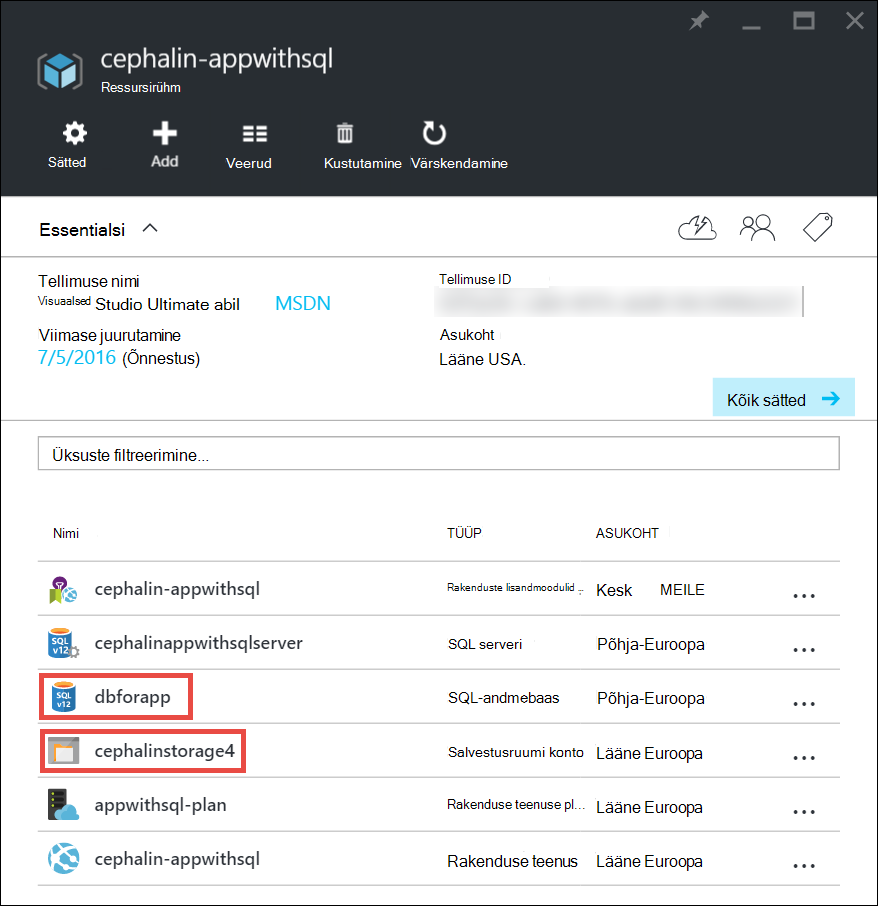

<properties
    pageTitle="Rakenduse Azure skaalal | Microsoft Azure'i"
    description="Saate teada, kuidas mastaapimiseks üles rakendus Azure'i rakendust Service võimsus ja funktsioonide lisamine."
    services="app-service"
    documentationCenter=""
    authors="cephalin"
    manager="wpickett"
    editor="mollybos"/>

<tags
    ms.service="app-service"
    ms.workload="na"
    ms.tgt_pltfrm="na"
    ms.devlang="na"
    ms.topic="article"
    ms.date="07/05/2016"
    ms.author="cephalin"/>

# Rakenduse Azure skaalal #

Selles artiklis kirjeldatakse, kuidas mastaapimiseks rakenduse teenuses Azure rakenduse. Häälestamine on kaks töövoogusid skaleerimise, skaala ja skaala läbi ja selles artiklis selgitatakse skaala üles töövoog.

- [Skaalal](https://en.wikipedia.org/wiki/Scalability#Horizontal_and_vertical_scaling): CPU, mälu, kettaruumi ja lisafunktsioone nagu sihtotstarbeline virtuaalmasinates (VM), kohandatud domeene ja sertifikaatide kohta, lavastus slots, autoscaling ja muud. Skaalal, muutes oma rakenduse kuuluva rakenduse teenusleping hinnakirjad astme.
- [Välja skaala](https://en.wikipedia.org/wiki/Scalability#Horizontal_and_vertical_scaling): VM eksemplarid, mis töötavad rakenduse arvu suurendada.
Saate muudate koguni 20 eksemplarides, sõltuvalt teie hinnakirjad taseme. [Rakenduse teenuse keskkonnas](../app-service/app-service-app-service-environments-readme.md) **Premium** astme suurendada oma skaala-out arvu 50 eksemplaridesse. Skaala läbi kohta leiate lisateavet teemast [mastaapimiseks arvu automaatselt või käsitsi](../monitoring-and-diagnostics/insights-how-to-scale.md). Seal leiate teada, kuidas kasutada autoscaling, mis on arvu põhjal automaatselt eelmääratletud reeglid ja ajakava skaala.

Skaala sätteid ainult rakendamine ja muutmine mõjutab kõiki rakendusi oma [rakenduse teenusleping](../app-service/azure-web-sites-web-hosting-plans-in-depth-overview.md)hetke aega võtta.
Nad ei vaja, saate muuta oma kood või ümberkorraldamine rakenduse.

Hinnad ja funktsioonide üksikute rakenduse teenuse lepingute kohta leiate teavet teemast [Rakenduse hinnad üksikasjad](/pricing/details/web-sites/).  

> [AZURE.NOTE] Enne: **tasuta** taseme rakenduse teenusleping vahetamiseks tuleb esmalt eemaldada [kulutuste piirangud](/pricing/spending-limits/) kohas Azure tellimuse. Vaadata või muuta suvandid tellimuse Microsoft Azure'i rakendust Service, vt [Microsoft Azure'i tellimused][azuresubscriptions].

## Üles oma hinnakirjad taseme skaala

1. Avage brauseris [Azure portaali][portal].

2. Oma rakenduse tera, klõpsake nuppu **Kõik sätted**ja klõpsake nuppu **Skaala üles**.

    ![Liikuge skaala kuni Azure rakenduse.][ChooseWHP]

4. Valige oma taseme, ja klõpsake **Valige**.

    Vahekaarti **teatised** kuvatakse flash roheline **edu** pärast selle toimingu lõpuleviimist.

## Mastaapimiseks seotud ressursid
Kui teie rakendus sõltub muude teenustega, nt Azure'i SQL-andmebaasi või Azure Storage, saate ka skaalal nende ressursside vastavalt oma vajadustele. Järgmiste ressursside koos rakenduse teenusleping suurust pole muudetud ja peab mastaabitud eraldi.

1. **Essentials**, klõpsake linki **Ressursirühma** .

    

2. **Ressursirühm** tera **Kokkuvõte** osa nuppu ressurss, mida soovite skaala. Järgmine pilt kuvatakse SQL-andmebaasi ressursi ja on Azure Storage ressurss.

    

3. SQL-andmebaasi ressursi, klõpsake nuppu **sätted** > **hinnakirjad taseme** skaala hinna taseme.

    

    Saate ka lülitate [geo-dispersioonanalüüs](../sql-database/sql-database-geo-replication-overview.md) SQL-andmebaasi eksemplari puhul.

    Azure Storage ressurss, klõpsake nuppu **sätted** > **konfiguratsiooni** skaalal oma talletamise võimalused.

    

## Lisateavet arendusfunktsioonid
Hinnakirjad taseme kohta, olenevalt arendaja rakendusse järgmised funktsioonid on saadaval.

### Bitness ###

- **Tavaline**, **Standard**ja **Premium** astme toetada 64-bitist ja 32-bitine rakendusi.
- **Tasuta** ja **ühiskasutuses** leping astme toetavad ainult 32-bitised rakendused.

### Siluri tugi ###

- Siluri tugi on saadaval **tasuta**, **ühiskasutuses**ja **lihtsa** režiimi veebisaidil ühe ühenduse rakenduse teenusleping kohta.
- Siluri tugi on saadaval veebisaidil viis samaaegseid ühendused kohta rakenduse teenusleping **Standard** ja **Premium** režiimi.

## Lisateavet muude funktsioonide

- Kõigi ülejäänud funktsioonid rakenduse plaanidest, sh hinnad ja funktsioonide (sh arendajate) kõigi kasutajate huvi kohta üksikasjaliku teabe saamiseks vt [Rakenduse hinnad üksikasjad](/pricing/details/web-sites/).

>[AZURE.NOTE] Kui soovite alustada Azure'i rakendust Service enne registreerumist Azure'i konto jaoks, avage [Proovige rakenduse teenus](http://go.microsoft.com/fwlink/?LinkId=523751) , kus saate kohe luua lühiajaline starter web app rakenduse teenus. Samuti ei ole krediitkaardid on nõutav.

## Järgmised sammud

- Alustage Azure, lugege teemat [Microsoft Azure'i tasuta prooviversioon](/pricing/free-trial/).
- Tasuline tugi ja SLA kohta teabe saamiseks külastage järgmisi linke.

    [Andmete edastamine hinnakirjad üksikasjad](/pricing/details/data-transfers/)

    [Microsoft Azure'i tugiteenuse lepingud](/support/plans/)

    [Teenuse teenusetaseme lepinguid](/support/legal/sla/)

    [SQL-i andmebaasi hinnad üksikasjad](/pricing/details/sql-database/)

    [Virtuaalse masina ja pilvepõhise teenuse suurused Microsoft Azure][vmsizes]

    [Rakenduse hinnad üksikasjad](/pricing/details/app-service/)

    [Rakenduse teenuse hinnad üksikasjad – SSL-i ühendused](/pricing/details/web-sites/#ssl-connections)

- Lisateabe saamiseks Azure'i rakendust Service põhitõed, sh koostamise scalable ja olles arhitektuur, vaadake teemat [head tavad: Azure'i rakenduse teenuse veebirakenduste](http://blogs.msdn.com/b/windowsazure/archive/2014/02/10/best-practices-windows-azure-websites-waws.aspx).

- Videote skaleerimist rakendust Service rakenduste kohta, leiate järgmistest teemadest:

    - [Millal mastaapimiseks Azure veebisaite - Stefan Schackow](/documentation/videos/azure-web-sites-free-vs-standard-scaling/)
    - [Automaatne skaleerimist Azure veebisaitide CPU või ajastatud - Stefan Schackow abil](/documentation/videos/auto-scaling-azure-web-sites/)
    - [Kuidas Azure veebisaitide skaalal - Stefan Schackow](/documentation/videos/how-azure-web-sites-scale/)

<!-- LINKS -->
[vmsizes]:/pricing/details/app-service/
[SQLaccountsbilling]:http://go.microsoft.com/fwlink/?LinkId=234930
[azuresubscriptions]:http://go.microsoft.com/fwlink/?LinkID=235288
[portal]: https://portal.azure.com/

<!-- IMAGES -->
[ChooseWHP]: ./media/web-sites-scale/scale1ChooseWHP.png
[ChooseBasicInstances]: ./media/web-sites-scale/scale2InstancesBasic.png
[SaveButton]: ./media/web-sites-scale/05SaveButton.png
[BasicComplete]: ./media/web-sites-scale/06BasicComplete.png
[ScaleStandard]: ./media/web-sites-scale/scale3InstancesStandard.png
[Autoscale]: ./media/web-sites-scale/scale4AutoScale.png
[SetTargetMetrics]: ./media/web-sites-scale/scale5AutoScaleTargetMetrics.png
[SetFirstRule]: ./media/web-sites-scale/scale6AutoScaleFirstRule.png
[SetSecondRule]: ./media/web-sites-scale/scale7AutoScaleSecondRule.png
[SetThirdRule]: ./media/web-sites-scale/scale8AutoScaleThirdRule.png
[SetRulesFinal]: ./media/web-sites-scale/scale9AutoScaleFinal.png
[ResourceGroup]: ./media/web-sites-scale/scale10ResourceGroup.png
[ScaleDatabase]: ./media/web-sites-scale/scale11SQLScale.png
[GeoReplication]: ./media/web-sites-scale/scale12SQLGeoReplication.png
