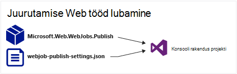
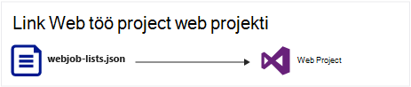
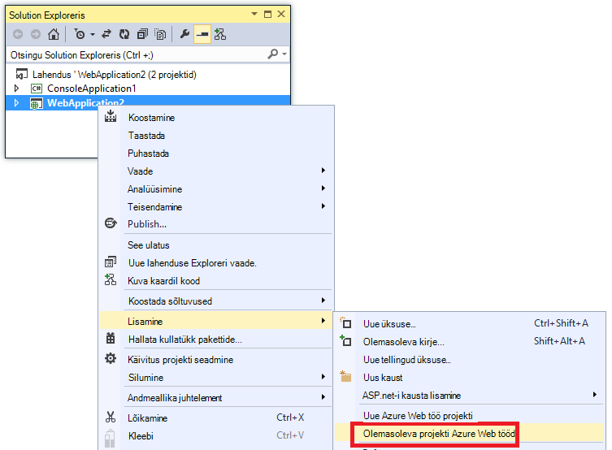
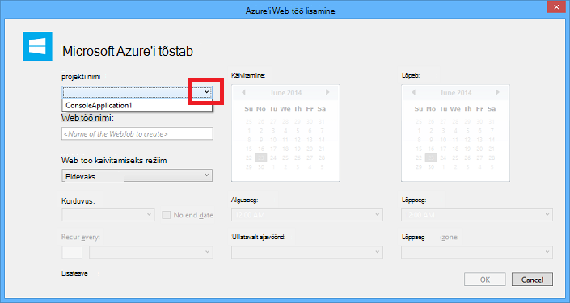
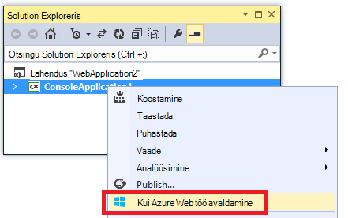
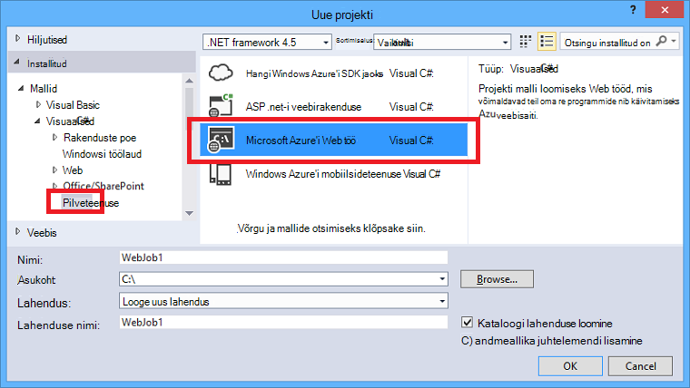
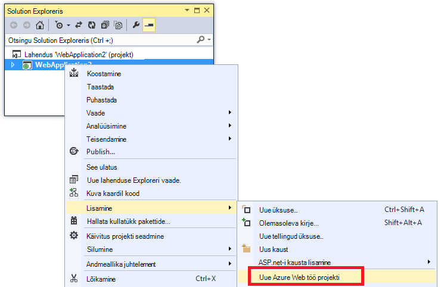
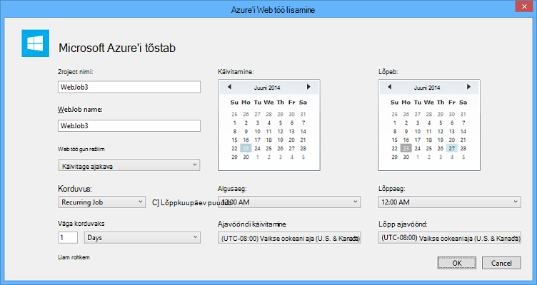

<properties 
    pageTitle="Visual Studio abil WebJobs juurutamine" 
    description="Saate teada, kuidas juurutada Azure WebJobs Visual Studio abil Azure'i rakenduse Web Apps." 
    services="app-service" 
    documentationCenter="" 
    authors="tdykstra" 
    manager="wpickett" 
    editor="jimbe"/>

<tags 
    ms.service="app-service" 
    ms.devlang="dotnet" 
    ms.topic="article" 
    ms.tgt_pltfrm="na" 
    ms.workload="na" 
    ms.date="04/27/2016" 
    ms.author="tdykstra"/>

# Visual Studio abil WebJobs juurutamine

## Ülevaade

Selles teemas selgitatakse, kuidas kasutada Visual Studio juurutada konsooli rakenduse project web appi [Rakenduse teenus](http://go.microsoft.com/fwlink/?LinkId=529714) on [Azure WebJob](http://go.microsoft.com/fwlink/?LinkId=390226)nimega. Juurutamise WebJobs [Azure portaali](https://portal.azure.com)kaudu leiate lisateavet teemast [WebJobs ülesannete taustal käitada](web-sites-create-web-jobs.md).

Kui Visual Studio kasutab WebJobs lubatud konsooli rakendus projekti, tehtav kahe toimingu:

* Koopiate käitusaja failide kausta web Appis (*App_Data/töö/pidev* pidev WebJobs jaoks, *App_Data/töö/vallandanud* ajastatud ja vajadusel WebJobs jaoks).
* Häälestab [Azure'i ajasti töö](#scheduler) jaoks WebJobs, mis on ajastatud teatud ajal. (See on vajalik pidev WebJobs jaoks.)

Projekti WebJobs lubatud on lisatud järgmist.

* [Microsoft.Web.WebJobs.Publish](http://www.nuget.org/packages/Microsoft.Web.WebJobs.Publish/) Nugeti pakett.
* [Webjob avaldamine settings.json](#publishsettings) faili, mis sisaldab juurutus- ja Toiminguajasti sätted. 

Saate lisada need üksused konsooli rakendus projekti või malli abil saate luua uue projekti WebJobs lubatud konsooli rakendus. 

Saate juurutada projekti nimega on WebJob ise või linkida selle projekti web nii, et see avaneb automaatselt iga kord, kui juurutate web project. Projektide linkimiseks sisaldab Visual Studio [webjobs-list.json](#webjobslist) faili rakenduses web project WebJobs lubatud projekti nime.

## Eeltingimused

WebJobs juurutamise funktsioonid on saadaval Visual Studio 2015 Azure'i SDK installimisel .net-i jaoks:

* [Azure'i SDK .net-i (Visual Studio 2015)](http://go.microsoft.com/fwlink/?linkid=518003).

## Lubada olemasoleva konsooli rakendus projekti WebJobs juurutamine

Teil on kaks võimalust.

* [Luba automaatne juurutus, nii et web projekti](#convertlink).

    Konfigureerige konsooli rakendus projekti nii, et see automaatselt avaneb nimega on WebJob web projekti juurutamisel. Kasutage seda suvandit, kui soovite käivitada oma WebJob seotud veebirakenduse käivitate sama web Appis.

* [Luba juurutamise web projekti puudumisel](#convertnolink).

    Olemasoleva konsooli rakendus projekti juurutamiseks on WebJob nimega, pole link web projekti konfigureerimine. Kasutage seda suvandit, kui soovite käivitada soovitud WebJob web Appis, pole veebirakendusega töötab web Appis. Võite seda teha, et saama ulatuse sõltumata teie rakenduse veebiressursid oma WebJob ressursse.

### Luba automaatne WebJobs juurutus, nii et web projekti
  
1. Paremklõpsake **Solution**Exploreris web projekti ja seejärel klõpsake nuppu **Lisa** > **Azure'i WebJob nimega projekti**.

    
    
    Kuvatakse dialoogiboks [Lisamine Azure'i WebJob](#configure) .

1. Valige ripploendist **projekti nime** konsooli rakendus projekti lisamiseks on WebJob.

    

2. Täitke dialoogiboksi [Lisamine Azure WebJob](#configure) ja seejärel klõpsake nuppu **OK**. 

### Luba WebJobs juurutamise web projekti puudumisel
  
1. Paremklõpsake **Solution**Exploreris konsooli rakendus projekti ja seejärel klõpsake nuppu **Avalda Azure'i WebJob nimega**. 

    
    
    Kuvatakse dialoogiboks [Lisamine Azure'i WebJob](#configure) , **projekti nime** väljal valitud projekti.

2.  Täitke dialoogiboksi [Lisamine Azure WebJob](#configure) ja seejärel klõpsake nuppu **OK**.

    Kuvatakse viisard **Avaldamine veebis** .  Kui te ei soovi kohe avaldada, sulgege viisard. Kui soovite [projekti juurutada](#deploy), salvestatakse neid sätteid, mille olete sisestanud jaoks.

## Uue WebJobs lubatud projekti loomine

WebJobs lubatud uue projekti loomiseks saate kasutada konsooli rakendus projekti malli ja lubada WebJobs juurutamise [eelmises jaotises](#convert)kirjeldatud. Teise võimalusena saate WebJobs uue projekti mall:

* [Mõne sõltumatu WebJob WebJobs uue projekti malli kasutamine](#createnolink)

    Projekti loomine ja konfigureerimine seda ise nimega on WebJob puudub seos web projekti juurutamine. Kasutage seda suvandit, kui soovite käivitada soovitud WebJob web Appis, pole veebirakendusega töötab web Appis. Võite seda teha, et saama ulatuse sõltumata teie rakenduse veebiressursid oma WebJob ressursse.

* [WebJob, mis on seotud web projekti jaoks WebJobs uue projekti malli kasutamine](#createlink)

    Mis on konfigureeritud automaatselt mõne WebJob juurutamine sama lahendust web projekti juurutamisel projekti loomine. Kasutage seda suvandit, kui soovite käivitada oma WebJob seotud veebirakenduse käivitate sama web Appis.

> [AZURE.NOTE] WebJobs uue projekti Mall automaatselt installib Nugeti pakettide ja sisaldab koodi *Program.cs* [WebJobs SDK](http://www.asp.net/aspnet/overview/developing-apps-with-windows-azure/getting-started-with-windows-azure-webjobs). Kui ei soovitud WebJobs SDK või soovite kasutada ajastatud, mitte pidev WebJob, eemaldada või muuta selle `host.RunAndBlock` *Program.cs*aruanne.

### Mõne sõltumatu WebJob WebJobs uue projekti malli kasutamine
  
1. Klõpsake menüü **fail** > **Uue projekti**ja siis klõpsake dialoogiboksis **Uus projekt** **pilve** > **Microsoft Azure'i WebJob**.

    
    
2. Järgige kuvatud varem [Konsooli rakenduse project iseseisva WebJobs projekti](#convertnolink)teha.

### WebJob, mis on seotud web projekti jaoks WebJobs uue projekti malli kasutamine

1. Paremklõpsake **Solution**Exploreris web projekti ja seejärel klõpsake nuppu **Lisa** > **Uue Azure'i WebJob projekti**.

    

    Kuvatakse dialoogiboks [Lisamine Azure'i WebJob](#configure) .

2. Täitke dialoogiboksi [Lisamine Azure WebJob](#configure) ja seejärel klõpsake nuppu **OK**.

## Dialoogiboksi lisamine Azure WebJob

Dialoogiboksi **Lisamine Azure WebJob** võimaldab teil sisestada WebJob ja oma WebJob sätete plaanimine. 

Selle dialoogiboksi väljad vastavad väljade dialoogiboksis **Uus töökoht** Azure portaali. Lisateabe saamiseks vt [WebJobs ülesannete taustal käitada](web-sites-create-web-jobs.md).

Ajastatud WebJob (mitte jaoks pidev WebJobs), loob Visual Studio on [Azure ajasti](/services/scheduler/) töö saidikogumi, kui üks pole veel olemas ja loob töö kogumine:

* Ajasti töö saidikogumi nimega *WebJobs-{regionname}* kui *{regionname}* viitab piirkonna web app on majutatud. Näide: WebJobs-WestUS.
* Ajasti töö nimega *{webappname} – {webjobname}*. Näide: MyWebApp-MyWebJob. 
 
>[AZURE.NOTE]
> 
>* Käsurea juurutamise kohta leiate teavet teemast [käsurea lubamine või pidev kohaletoimetamise Azure'i WebJobs](/blog/2014/08/18/enabling-command-line-or-continuous-delivery-of-azure-webjobs/).
>* Kui konfigureerimine **Korduv töö** ja korduvussagedust määramine minutite arv, Azure'i toiminguajasti teenus ei ole tasuta. Teised väärtused (tundi, päeva ja jne) on tasuta.
>* Kui soovitud WebJob juurutada ja seejärel Otsustage, soovite muuta tüüpi WebJob ja ümberkorraldamine, peate webjobs avaldamine settings.json faili kustutada. Sel juhul saate muuta WebJob tüüpi Visual Studio funktsiooni Avaldamissuvandid uuesti kuvada.
>* Kui soovitud WebJob juurutada ja hiljem muuta Käivita alates pidev-pidev või vastupidi, loob Visual Studio uue WebJob Azure, kui te ümberkorraldamine. Kui muudate muud ajastamise sätted, kuid lahku käivitada režiimis sama või ajastatud ja On Demand vaheldumisi, Visual Studio värskendab olemasoleva töö asemel uue konto loomiseks.

## webjob avaldamine settings.json

Konsooli rakendus WebJobs juurutamiseks konfigureerimisel Visual Studio [Microsoft.Web.WebJobs.Publish](http://www.nuget.org/packages/Microsoft.Web.WebJobs.Publish/) Nugeti pakett installitakse ja talletatakse ajastamise teave projekti *atribuutide* kausta WebJobs projekti *webjob avaldamine settings.json* faili. Siin on näide faili:

        {
          "$schema": "http://schemastore.org/schemas/json/webjob-publish-settings.json",
          "webJobName": "WebJob1",
          "startTime": "2014-06-23T00:00:00-08:00",
          "endTime": "2014-06-27T00:00:00-08:00",
          "jobRecurrenceFrequency": "Minute",
          "interval": 5,
          "runMode": "Scheduled"
        }

Saate redigeerida selle faili otse ja Visual Studio pakub IntelliSense'i. Faili skeemi talletuskohaks oleval veebisaidil [http://schemastore.org](http://schemastore.org/schemas/json/webjob-publish-settings.json) ja seal vaadata.  

>[AZURE.NOTE]
>
>* Kui konfigureerimine **Korduv töö** ja korduvussagedust määramine minutite arv, Azure'i toiminguajasti teenus ei ole tasuta. Teised väärtused (tundi, päeva ja jne) on tasuta.

## WebJobs-list.json

Kui lingite WebJobs lubatud project web projekti, talletab Visual Studio WebJobs projekti nime *webjobs-list.json* web projekti *atribuutide* kausta failiga. Loend võib sisaldada mitut WebJobs projektide, nagu on näidatud järgmises näites:

        {
          "$schema": "http://schemastore.org/schemas/json/webjobs-list.json",
          "WebJobs": [
            {
              "filePath": "../ConsoleApplication1/ConsoleApplication1.csproj"
            },
            {
              "filePath": "../WebJob1/WebJob1.csproj"
            }
          ]
        }

Saate redigeerida selle faili otse ja Visual Studio pakub IntelliSense'i. Faili skeemi talletuskohaks oleval veebisaidil [http://schemastore.org](http://schemastore.org/schemas/json/webjobs-list.json) ja seal vaadata.
  
## Projekti WebJobs juurutamine

Web projekti lingitud WebJobs projekti kasutab automaatselt rakendusega web project. Web projekti juurutamise kohta leiate teemast [veebirakenduste juurutamine](web-sites-deploy.md).

Juurutamiseks WebJobs projekti ise, paremklõpsake **Solution**Exploreris projekt ja klõpsake nuppu **Avalda Azure'i WebJob nimega**. 

    
Sõltumatu WebJob, samas **Veebis avaldamine** viisardi web projektide jaoks kasutatava kuvatakse, kuid vähem sätetega kättesaadavaks muuta.

## Järgmised sammud

Selles artiklis on selgitatud juurutamise WebJobs Visual Studio abil. Azure'i WebJobs juurutamise kohta lisateabe saamiseks leiate [Azure'i WebJobs - ressursid on soovitatav - juurutamise](http://www.asp.net/aspnet/overview/developing-apps-with-windows-azure/azure-webjobs-recommended-resources#deploying).
