<properties
    pageTitle=".NET WebJob loomist Azure'i rakendust Service | Microsoft Azure'i"
    description="Mitmekihilise rakenduse abil MVC ASP.net-i ja Azure loomine. Eesmise end käivitatakse web appi teenuses Azure rakendus ja selle kirjutamata töötab soovitud WebJob. Rakendus kasutab üksuse raames, SQL-andmebaasi ja Azure storage järjekorrad ja plekid."
    services="app-service"
    documentationCenter=".net"
    authors="tdykstra"
    manager="wpickett"
    editor="mollybos"/>

<tags
    ms.service="app-service"
    ms.workload="na"
    ms.tgt_pltfrm="na"
    ms.devlang="na"
    ms.topic="article"
    ms.date="10/28/2016"
    ms.author="tdykstra"/>

# Azure'i rakendust Service .NET WebJob loomine

Selle õpetuse näitab, kuidas kirjutada lihtne mitmekihilise ASP.net-i MVC 5 rakendus, mis kasutab [WebJobs SDK](websites-dotnet-webjobs-sdk.md)koodi.

[WebJobs SDK](websites-webjobs-resources.md) eesmärk lihtsustada koodi kirjutamise levinud toiminguid, mida on WebJob saate teha, näiteks pilditöötluse, järjekorda töötlemine RSS-i koondamine, faili, ja hooldus e-kirjade saatmine. WebJobs SDK on valmisfunktsioone Azure Storage ja teenuse siini töötamiseks, ajastamist ja tõrgete ja jaoks mitme levinud stsenaariumi. Lisaks see on mõeldud olema laiendatav ja on mõni [avage allikas hoidla laiendid](https://github.com/Azure/azure-webjobs-sdk-extensions/wiki/Binding-Extensions-Overview).

Valimi rakendus on mõne reklaami teadete tahvel. Kasutajad saavad reklaamide piltide üles laadimine ja taustväärtus protsess teisendab pildid pisipildid. Ad lehe list näitab pisipildid ja ad üksikasjade lehe täissuuruses pilt. Siin on pilt:

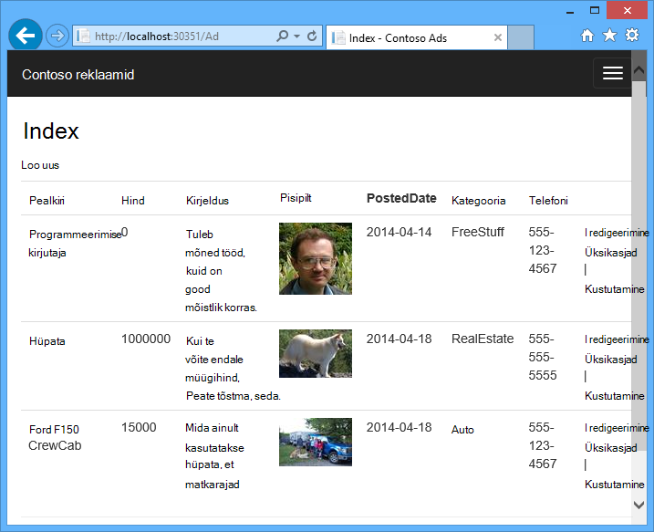

See näide rakendus töötab [Azure järjekorrad](http://www.asp.net/aspnet/overview/developing-apps-with-windows-azure/building-real-world-cloud-apps-with-windows-azure/queue-centric-work-pattern) ja [Azure plekid](http://www.asp.net/aspnet/overview/developing-apps-with-windows-azure/building-real-world-cloud-apps-with-windows-azure/unstructured-blob-storage). Õpetuse näitab, kuidas rakenduse [Azure'i rakendust Service](http://go.microsoft.com/fwlink/?LinkId=529714) ja [Azure SQL-andmebaas](http://msdn.microsoft.com/library/azure/ee336279).

## Eeltingimused

Õpetuse eeldab, et teate, kuidas töötada [ASP.net-i MVC 5](http://www.asp.net/mvc/tutorials/mvc-5/introduction/getting-started) projekti Visual Studios.

Õpetuse on kirjutatud Visual Studio 2013. Kui teil pole veel Visual Studios, see installitakse teie jaoks automaatselt Azure'i SDK installimisel .net-i jaoks.

Õpetuse saab kasutada Visual Studio 2015, kuid enne, kui käivitate rakenduse kohalik tuleb muuta selle `Data Source` osa faile Web.config ja App.config ühendusstringi SQL serveri LocalDB `Data Source=(localdb)\v11.0` abil `Data Source=(LocalDb)\MSSQLLocalDB`. 

> [AZURE.NOTE] Peate selle õpetuse lõpuleviimiseks Azure'i konto.
  >
  > + Saate [avada Azure'i konto tasuta](https://azure.microsoft.com/pricing/free-trial/?WT.mc_id=A261C142F): saate krediiti abil saate proovida makstud Azure'i teenuste ja isegi juhul, kui nad kasutada kuni hoiate konto ja kasutage tasuta Azure teenused, nt veebisaidid. Krediitkaardi kunagi tuleb tasuda, kui te just teiega sätete muutmine ja paluge võetakse.
  >
  > + Saate [aktiveerida MSDN-i abonendi eelised](https://azure.microsoft.com/pricing/member-offers/msdn-benefits-details/?WT.mc_id=A261C142F): teie MSDN-i tellimuse annab teile krediiti iga kuu makstud Azure'i teenuste kasutatavad.
  >
  >Kui soovite alustada Azure'i rakendust Service enne Azure'i konto kasutajaks, minge [Proovige rakenduse teenus](http://go.microsoft.com/fwlink/?LinkId=523751), kus saate kohe luua lühiajaline starter web app rakenduse teenus. Nõutav; krediitkaardid kohustusi.

## Käsitletavad

Õpetuse näitab, kuidas teha järgmisi toiminguid:

* Luba Azure arengu arvuti, installides Azure'i SDK.
* Mida automaatselt kasutab mõni Azure WebJob nimega seotud web projekti juurutamisel konsooli rakendus projekti loomine.
* Testige WebJobs SDK kirjutamata kohalikku arvutisse arengu.
* Veebirakenduse rakenduse teenuses WebJobs kirjutamata taotluse avaldada.
* Failide üleslaadimine ja salvestaks need Azure'i bloobimälu teenus.
* Töötamine Azure Storage järjekorrad ja plekid Azure WebJobs SDK abil.

## Rakenduse arhitektuur

Valimi rakendus kasutab [järjekorda-kesksele töö mustri](http://www.asp.net/aspnet/overview/developing-apps-with-windows-azure/building-real-world-cloud-apps-with-windows-azure/queue-centric-work-pattern) off-koormus luua pisipildid kirjutamata protsessi Protsessori jaoks mahukat tööd.

Rakenduse salvestab reklaamid SQL-andmebaasis, abil üksus Framework koodi esimene tabelite loomine ja juurdepääsu andmetele. Andmebaasi salvestab iga ad kaks URL-ide: üks täissuuruses pilt ja üks pisipilti.

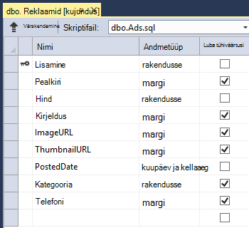

Kui kasutaja on lisatud pildi, veebirakenduse talletab pilt on [Azure Bloobivahemälu](http://www.asp.net/aspnet/overview/developing-apps-with-windows-azure/building-real-world-cloud-apps-with-windows-azure/unstructured-blob-storage)ja selle ad teave talletatakse URL, mis viitab selle bloobimälu andmebaasi. Samal ajal, kirjutab see sõnumi on Azure järjekorda. Taustväärtus protsess töötab ka Azure WebJob, WebJobs SDK küsitlused järjekorra uute sõnumite jaoks. Uue sõnumi kuvamisel on WebJob loob pildi pisipilt ja pisipildi URL-i andmebaas väljal selle ad värskendused. Siin on diagramm, mis näitab, kuidas kasutada rakenduse osad:

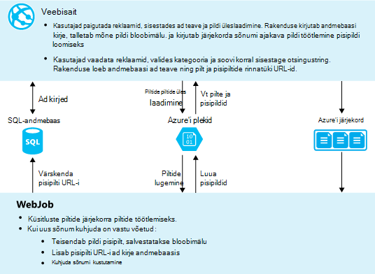

[AZURE.INCLUDE [install-sdk](../../includes/install-sdk-2015-2013.md)]

Õpetus juhised kehtivad Azure'i SDK .net-i 2.7.1 või uuem versioon.

## Azure Storage konto loomine

Azure'i salvestusruumi konto pakub järjekord ja bloobimälu andmete salvestamine pilves ressursid. Seda kasutatakse ka WebJobs SDK armatuurlaua logimine andmete talletamiseks.

Tegelike rakenduses, loote tavaliselt eraldi kontod rakenduse andmete võrreldes logimine andmed ja eraldi moodustab testi andmete või andmeid. Selle õpetuse puhul saate kasutada ainult ühe kontoga.

1. Visual Studio **Serveri Exploreri** akna avamine

2. Paremklõpsake sõlme **Azure** ja klõpsake nuppu **Loo ühendus Microsoft Azure'i**.
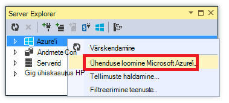

3. Logige sisse oma Azure mandaadi abil.

5. **Paremklõpsake Azure sõlme all** ja seejärel nuppu **Loo salvestusruumi konto**.
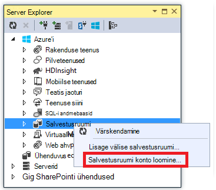

3. Sisestage dialoogiboksis **Talletusmahu konto loomine** salvestusruumi konto nimi.

    Nimi peab olema peab olema kordumatu (muu Azure storage konto võib olla sama nimi). Kui sisestate nimi on juba kasutusel, saate seda muuta võimalus.

    URL-i salvestusruumi kontole juurdepääsuks on *{nimi}*. core.windows.net.

5. Määrake **piirkonnas või osaleja** ripploendist alale teile.

    See säte määrab, millist Azure andmekeskuse kuvatakse majutada konto salvestusruumi. Selles õpetuses mõeldud tehtud valikust ei tee märgatav erinevus. Siiski tootmise veebiversiooni soovite oma veebiserverisse ja konto salvestusruumi olema sama piirkonna latentsus ja andmete sealt kulude minimeerimiseks. Veebirakenduse (mille saate luua hiljem) andmekeskuse peaks olema juurdepääs veebirakenduse latentsus minimeerimiseks brauserid võimalikult lähedal.

6. Seadke **Dispersioonanalüüs** ripploendist **kohalikult liigsed**.

    Geo-dispersioonanalüüs lubamisel salvestusruumi konto talletatud sisu on kopeeritud teisene andmekeskuse Tõrkesiirde sinna korral katastroof esmane asukohta. Geo-dispersioonanalüüs saate tasulised. Katse- ja kontode puhul üldiselt ei soovi geo-dispersioonanalüüs eest maksta. Lisateavet leiate teemast [loomine, haldamine, või salvestusruumi konto kustutada](../storage-create-storage-account/#replication-options).

5. Klõpsake nuppu **Loo**.

    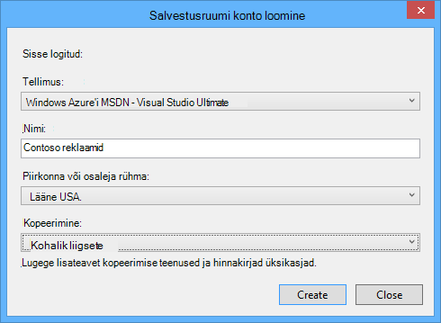

## Rakenduse allalaadimine

1. Laadige alla ja pakkige see lahti [lõpetatud lahendus](http://code.msdn.microsoft.com/Simple-Azure-Website-with-b4391eeb).

2. Käivitage Visual Studio.

3. Klõpsake menüü **fail** **avage > projekti/lahenduse**, liikuge kui laadisite lahendus ja seejärel lahenduse faili avada.

4. Vajutage klahvikombinatsiooni CTRL + SHIFT + B koostamiseks lahendus.

    Vaikimisi Visual Studio automaatselt taastab Nugeti pakett sisu, mis on kaasatud *ZIP* -faili. Kui paketid ei taastamiseks installige need käsitsi **Haldamine Nugeti pakettide lahenduse** dialoogiboks kui klõpsate paremas ülanurgas nuppu **Taasta** .

5. **Solution Exploreris**, veenduge, et **ContosoAdsWeb** on valitud käivitus projekt.

## Konfigureerige rakenduse salvestusruumi kontoga

1. Avage *fail rakenduses* ContosoAdsWeb projekt.

    Fail sisaldab SQL-i ühendusstringi ja Azure storage ühendusstring, plekid ja järjekorrad töötamiseks.

    SQL-i ühendusstringi osutab [SQL Server Express LocalDB](http://msdn.microsoft.com/library/hh510202.aspx) andmebaasi.

    Ühendusstringi salvestusruumi on näide, millel on kohatäited salvestusruumi konto nimi ja Accessi võti. Saate selle asendada ühendusstring, mis sisaldab nime ja klahvi konto salvestusruumi.  

    <pre class="prettyprint">&lt;connectionStrings&gt;
   &lt;lisada nimi = "ContosoAdsContext" connectionString = "andmeallika = \v11.0 (localdb); Esialgne kataloogi = ContosoAds; Integreeritud turvalisus = True; MultipleActiveResultSets = True; "providerName="System.Data.SqlClient "/&gt;
   &lt;lisada nimi ="AzureWebJobsStorage"connectionString =" DefaultEndpointsProtocol = https; Account_name =<mark>[account_name]</mark>; AccountKey<mark>[accesskey]</mark>= "/&gt; 
    &lt;/connectionStrings      &gt;</pre>

    Ühendusstringi salvestusruumi nimeks AzureWebJobsStorage kuna see on nime WebJobs SDK kasutab vaikimisi. Sama nimi on siin kasutada nii, et teil on ainult üks ühenduse stringi väärtuse määramiseks Azure keskkonnas.

2. **Server Explorer**, Paremklõpsake sõlme **salvestusruumi** konto salvestusruumi ja seejärel klõpsake käsku **Atribuudid**.

    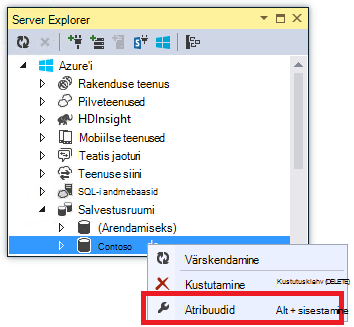

3. **Atribuutide** aknas nuppu **Salvestusruumi konto võtmed**ja klõpsake kolmikpunkti.

    

4. Kopeerige **ühendusstring**.

    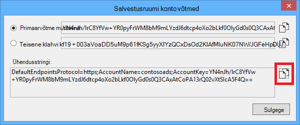

5. Asendage *fail* salvestusruumi ühendusstringi kopeerisite ühendusstring. Veenduge, et valite kogu jutumärkides, kuid välja arvatud jutumärke enne kleepimist.

6. Avage fail *App.config* ContosoAdsWebJob Projectis.

    See fail on kaks salvestusruumi ühendusstringi, rakenduse andmete ja logimiseks. Saate rakenduse andmete ja logimine eraldi salvestusruumi kontod ja saate kasutada [andmete mitmelt salvestusruumi](https://github.com/Azure/azure-webjobs-sdk/blob/master/test/Microsoft.Azure.WebJobs.Host.EndToEndTests/MultipleStorageAccountsEndToEndTests.cs). Selle õpetuse puhul saate kasutada ühe salvestusruumi konto. Ühenduse stringid on salvestusruumi konto klahve kohatäited. 
    <pre class="prettyprint">&lt;konfiguratsiooni&gt; 
    &lt;connectionStrings&gt;
   &lt;lisada nimi = "AzureWebJobsDashboard" connectionString = "DefaultEndpointsProtocol = https; Account_name =<mark>[account_name]</mark>; AccountKey<mark>[accesskey]</mark>= "/&gt;
   &lt;lisada nimi ="AzureWebJobsStorage"connectionString =" DefaultEndpointsProtocol = https; Account_name =<mark>[account_name]</mark>; AccountKey<mark>[accesskey]</mark>= "/&gt;
   &lt;lisada nimi ="ContosoAdsContext"connectionString =" andmeallika = \v11.0 (localdb); Esialgne kataloogi = ContosoAds; Integreeritud turvalisus = True; MultipleActiveResultSets = True; " /&gt; 
    &lt;/connectionStrings&gt;
   &lt;käivitus&gt;
   &lt;supportedRuntime versioon = "v4.0" sku = ". NETFramework, versioon = v4.5 "/&gt; 
    &lt;/startup&gt;
&lt;/configuration                             &gt;</pre>

    Vaikimisi otsib WebJobs SDK ühendusstringi nimega AzureWebJobsStorage ja AzureWebJobsDashboard. Teise võimalusena saate [poe ühenduse string aga soovite ning andke see konkreetselt juurde selle `JobHost` objekti](websites-dotnet-webjobs-sdk-storage-queues-how-to.md#config).

7. Asendage nii salvestusruumi ühendusstringi varem kopeeritud ühendusstring.

8. Salvestage muudatused.

## Käivitage rakendus kohalikult

1. Rakenduse web frontend alustamiseks vajutage klahvikombinatsiooni CTRL + F5.

    Vaikebrauseriks avatakse avalehele. (Web project jookseb, kuna olete teinud käivitus projekt.)

    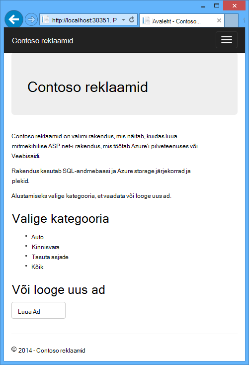

2. WebJob taustväärtus rakenduse käivitamiseks paremklõpsake **Solution**Exploreris ContosoAdsWebJob projekti ja klõpsake **silumine** > **uue seansi käivitamine**.

    Konsooli rakenduse akna avatakse ja kuvab logimine sõnumid, mis näitab, WebJobs SDK JobHost objekti käivitas käivitamiseks.

    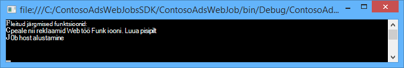

3. Klõpsake brauseri nuppu **Loo reklaami**.

4. Mõned testi andmete sisestamine ja valige pilt üles laadida, ja seejärel klõpsake nuppu **Loo**.

    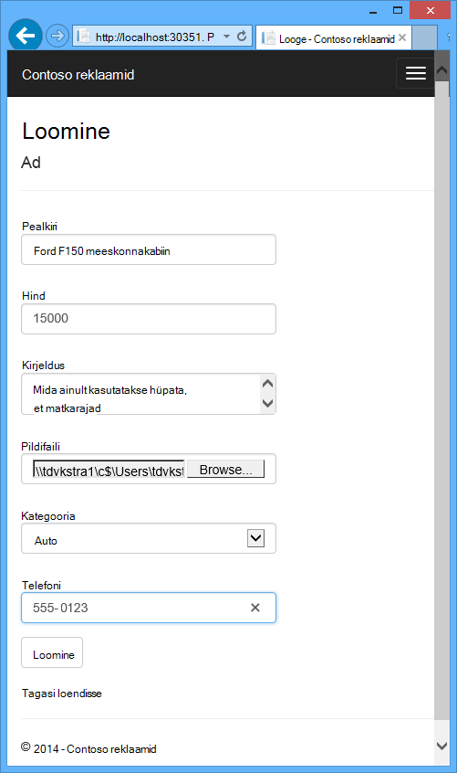

    Rakenduse läheb esilehele, kuid seda ei kuvata uue ad pisipilti, kuna töötlemise pole veel juhtunud.

    Samal ajal kuvatakse teade logimine konsooli rakenduse akna pärast lühike ootama, et järjekorda sõnumi vastu võttis ja töödeldud.

    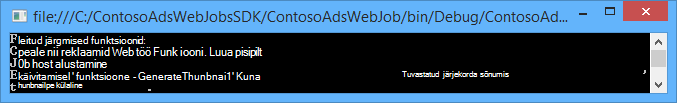

5. Kui näete konsooli rakenduse akna logimine sõnumid, värskendada Esilehele pisipilt kuvamiseks.

    

6. Klõpsake nuppu **üksikasjad** oma ad täissuuruses pildi nägemiseks.

    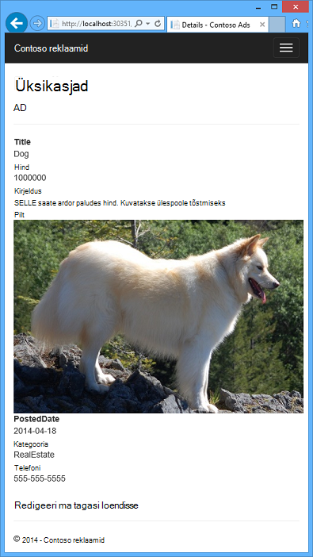

Olete käitanud kohalikus arvutis ja see rakendus kasutab SQL Serveri andmebaasiga, mis asub teie arvutis, kuid see ei tööta koos järjekorrad ja plekid pilveteenuses. Järgmises jaotises käivitate rakenduse pilves, cloud andmebaasi kui ka pilveteenuses plekid- ja järjekorrad abil.  

## Käivitage rakendus pilveteenuses

Tehke käivitage rakendus pilveteenuses tehke järgmist.

* Veebirakenduste juurutada. Visual Studio loob uue veebirakenduse automaatselt rakenduse ja SQL-andmebaasi eksemplari.
* Saate konfigureerida veebirakenduse SQL Azure'i andmebaas ja salvestusruumi konto kasutamiseks.

Kui olete loonud pilveteenuses käitamise ajal mõned reklaamid, vaatate WebJobs SDK armatuurlaua järelevalve pakume funktsioone rikas kuvamiseks.

### Veebirakenduste juurutamine

1. Sulgege brauser ja konsooli rakenduse akna.

2. Paremklõpsake ContosoAdsWeb projekti **Solution Exploreris**, ja seejärel klõpsake nuppu **Avalda**.

3. Klõpsake **Veebis avaldamine** viisardi juhises **profiili** **Microsoft Azure'i veebirakenduste**.

    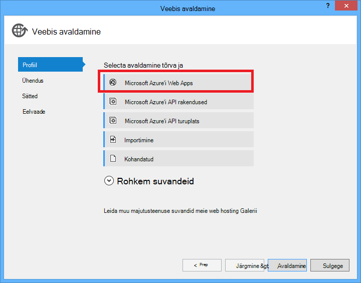

4. Kui te pole veel sisse loginud, logige sisse Azure.

5. Klõpsake nuppu **Uus**.

    Dialoogiboksi võib välja näha sõltuvalt sellest, millist versiooni Azure'i SDK .net-i jaoks olete installinud veidi teistsugused.

    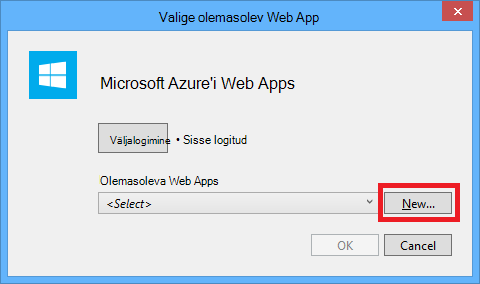

6. Sisestage dialoogiboksis **veebirakenduse loomine Microsoft Azure** kordumatu nimi väljale **nimi Web app** .

    Täielik URL koosneb te siia pluss. azurewebsites.net (nagu on näidatud **Web app nimi** tekst kõrval). Näiteks kui web app nimi on ContosoAds, URL on ContosoAds.azurewebsites.net.

7. Valige ripploendist [rakenduse teenusleping](../app-service/azure-web-sites-web-hosting-plans-in-depth-overview.md) **Loo uus rakendus teenusleping**. Sisestage nimi rakenduse teenusleping, nt ContosoAdsPlan.

8. Valige ripploendist [ressursirühm](../azure-resource-manager/resource-group-overview.md) **loomine uue ressursirühma**.

9. Sisestage nimi, nt ContosoAdsGroup ressursirühma.

10. Valige ripploendist **piirkond** piirkonna valisite konto salvestusruumi.

    See säte määrab, mis kestab oma veebirakenduse Azure andmekeskuse. Latentsus ja andmete sealt kulude säilitamise web app ja salvestusruumi konto sama andmekeskuses minimeeritakse.

11. Valige ripploendist **Andmebaasiserveri** **Loo uus server**.

12. Sisestage andmebaasi server, nt contosoadsserver + arv või oma nime muuta serveri nimi kordumatu nimi. 

    Serveri nimi peab olema kordumatu. See võib sisaldada sidekriipse väiketähed tähed ja kahekohalise arvuna. See ei tohi sisaldada sidekriipsu lõpunullid. 

    Teine võimalus, kui tellimuse juba on serveris, saate valida selle serveri rippmenüü loendist.

12. Sisestage administraatori **andmebaasi kasutajanimi** ja **parool andmebaasi**.

    Kui olete valinud **SQL-andmebaasi server** pole sisestamine, mõne olemasoleva nimi ja parool, sisestate uus nimi ja parool, mida te olete nüüd määratlemine edaspidi kasutada, kui avate andmebaasi. Kui valisite varem loodud server, palutakse teil juba loodud administraatoriõigustega kasutaja konto parooli.

13. Klõpsake nuppu **Loo**.

    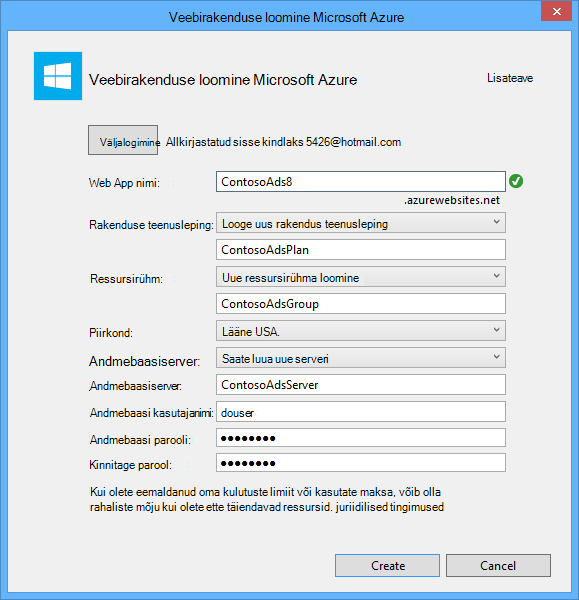

    Visual Studio loob lahenduse, web project, web appi Azure ja Azure SQL-andmebaasi eksemplari.

14. **Veebis avaldamine** viisardi juhises **ühenduse** klõpsake nuppu **edasi**.

    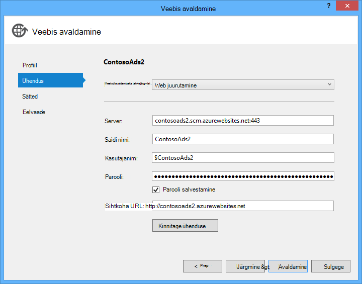

15. Juhises **sätted** tühjendage ruut **Kasuta seda käitusajal ühendusstring** ja klõpsake nuppu **edasi**.

    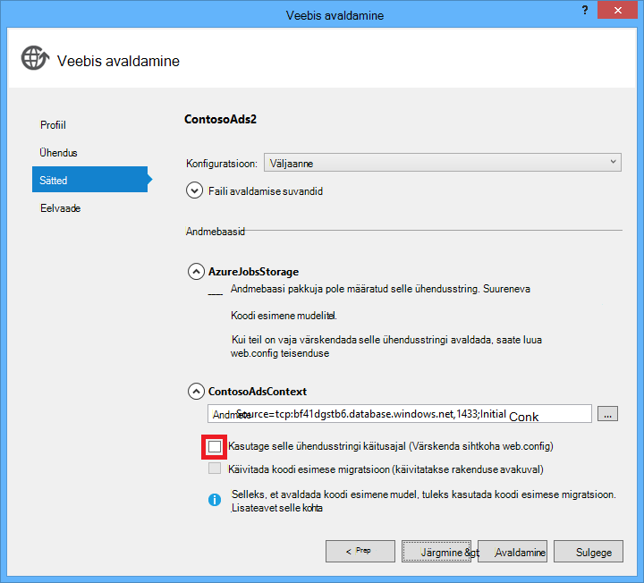

    Teil pole vaja avalda dialoogiboksi abil saate määrata ühendusstring SQL-i, kuna saate määrata selle väärtuse Azure keskkonnas hiljem.

    Hoiatused sellel lehel saate ignoreerida.

    * Tavaliselt salvestusruumi konto kasutada Azure töötab oleks erineb kasutate kohalikult käivitamisel, kuid selles õpetuses kasutate mõlemas keskkonnas sama üks. Nii ei pea AzureWebJobsStorage ühendusstringi ümber. Isegi juhul, kui soovite ei kasutada eri salvestusruumi pilveteenuses, ei peate muuta ühendusstring, kuna rakendus kasutab mõne sätte Azure keskkonnas Azure. Näete seda hiljem sisse õpetuse.

    * Te ei kavatse olla ContosoAdsContext andmebaasi kasutatava andmemudeli muudatuste tegemist selles õpetuses mõeldud nii ei ole vaja kasutada Üksus Framework koodi esimese migratsioon juurutamiseks. Koodi esmalt loob automaatselt uue andmebaasi esimene aja rakendus proovib juurde pääseda SQL-i andmeid.

    Selles õpetuses mõeldud jaotises **Faili Avaldamissuvandid** vaikeväärtused on hea.

16. Juhises **Eelvaade** nuppu **Eelvaade käivitamine**.

    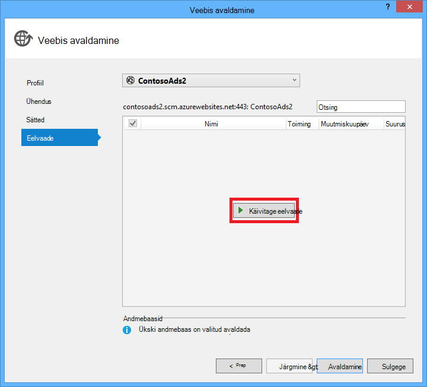

    Võite ignoreerida hoiatust pole andmebaasid on avaldatud. Üksuse raamistiku koodi esimene loob andmebaasi; See ei pea olema avaldatud.

    Eelvaateaknas kuvatakse kahendfaile ja WebJob projekti failid kopeeritud *app_data\jobs\continuous* kausta web app.

    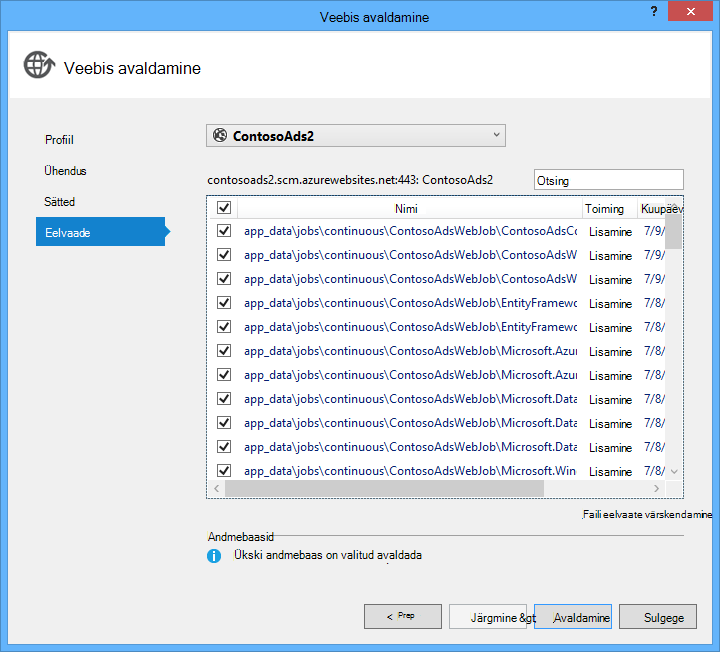

17. Klõpsake nuppu **Avalda**.

    Visual Studio rakendus kasutab ja avatakse brauseris avalehe URL-i.

    Te ei saa kasutada veebirakenduse seate ühendusstringi Azure keskkonnas järgmises jaotises. Kuvatakse tõrge lehel ega avalehe sõltuvalt rakenduse ja andmebaasi loomine Veebisuvandid valisite varasemas versioonis.

### Saate konfigureerida veebirakenduse SQL Azure'i andmebaas ja salvestusruumi konto kasutamiseks.

See on levinud [lihtsate tundlikku teavet nagu ühendusstringi failides, mis on talletatud source code hoidlate](http://www.asp.net/aspnet/overview/developing-apps-with-windows-azure/building-real-world-cloud-apps-with-windows-azure/source-control#secrets)vältimiseks. Azure'i võimaldab teha: saate määrata ühendusstring ja muude väärtuste säte Azure keskkonnas ja ASP.net-i konfigureerimine API-de automaatselt kättesaamine need väärtused kui rakendus töötab Azure. Saate need väärtused Azure **Serveri Explorerit**, Azure portaali, Windows PowerShelli või mitu platvormi käsurea liides. Lisateabe saamiseks lugege teemat [Kuidas rakenduse stringide ja ühenduse stringide töö](/blog/2013/07/17/windows-azure-web-sites-how-application-strings-and-connection-strings-work/).

Selles jaotises saate seada ühenduse stringiväärtust Azure **Server Explorer** .

7. **Server Explorer**, paremklõpsake oma veebirakenduse jaotises **Azure > rakenduse teenus > {ressursirühma}**, ja seejärel klõpsake nuppu **Vaate sätted**.

    **Azure'i veebirakenduse** akna avaneb menüü **konfigureerimine** .

9. ContosoAdsContext DefaultConnection ühendusstringi nime muuta.

    Azure'i luuakse automaatselt selle ühendusstring, kui lõite veebirakenduse ka seotud andmebaasi nii, et see on juba õige ühendus stringiväärtus. Teie kood otsin muudetav Domeen ainult nimi.

9. Lisage kaks uut ühendusstringi, nimega AzureWebJobsStorage ja AzureWebJobsDashboard. Kohandatud tüüp seatud ja seatud stringiväärtuse ühenduse sama väärtuse, mida kasutasite varem *Web.config* ning *App.config* failid. (Veenduge, et kaasata kogu ühendusstring, mitte ainult kiirklahv ja ei sisalda jutumärke.)

    Nende ühendusstringi kasutavad WebJobs Tarkvaraarenduskomplektist, üks rakenduse andmete ja üks logimine. Kui teile kuvati varasemas versioonis, rakenduse andmete jaoks kasutatakse web esiosa koodi.

9. Klõpsake nuppu **Salvesta**.

    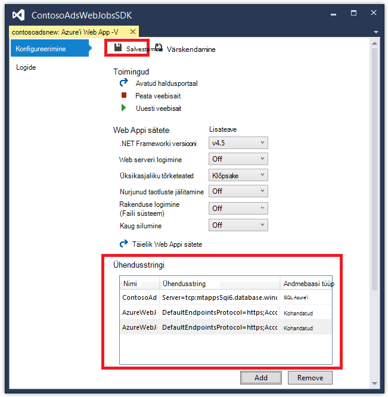

10. **Server Explorer**, paremklõpsake web appi ja seejärel klõpsake nuppu **Lõpeta**.

12. Pärast veebirakenduse lõpetab, paremklõpsake web appi uuesti ja seejärel klõpsake nuppu **Käivita**.

    Funktsiooni WebJob käivitub automaatselt, kui avaldate, kuid see peatub, kui teete konfiguratsiooni muutmine. Taaskäivitage see saate veebirakenduse taaskäivitage või taaskäivitage soovitud WebJob [Azure portaali](http://go.microsoft.com/fwlink/?LinkId=529715). Soovitatav on üldiselt taaskäivitage veebirakenduse pärast konfiguratsiooni muuta.

9. Värskendage brauseriakent, mis sisaldab web appi URL aadressiribale oma.

    Avalehel kuvatakse.

10. Kui käivitasite rakenduse kohalik reklaami, luua.

    Registri lehel kuvatakse ilma esimene pisipildi.

11. Värskendage lehte mõne sekundi pärast ja Pisipilt kuvatakse.

    Kui pisipilti ei kuvata, peate oodake paar minutit nii WebJob taaskäivitama. Kui pärast on aega ei näe sellegipoolest pisipilti lehe värskendamisel, on WebJob pole käivitatud automaatselt. Sel juhul Avage vahekaart WebJobs [klassikaline portaalis](https://manage.windowsazure.com) lehel veebirakenduse jaoks ja klõpsake nuppu **Alusta**.

### WebJobs SDK armatuurlaua kuvamine

1. [Klassikaline portaali](https://manage.windowsazure.com), valige oma veebirakenduse.

2. Klõpsake vahekaarti **WebJobs** .

3. Klõpsake veerus logid URL-i oma WebJob.

    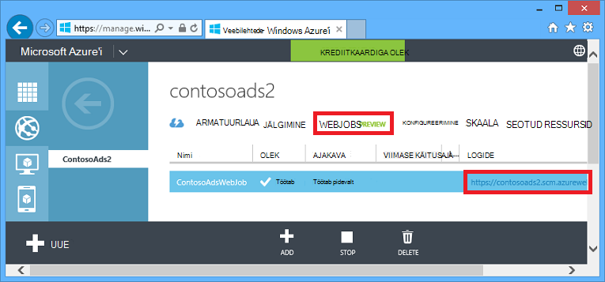

    Veebibrauseri uuel vahekaardil avaneb WebJobs SDK armatuurlaud. Armatuurlaua näitab, et selle WebJob töötab, ja kuvab funktsioonide loendi WebJobs SDK käivitanud koodi.

4. Klõpsake ühte ülesannete täitmise üksikasjade kuvamiseks.

    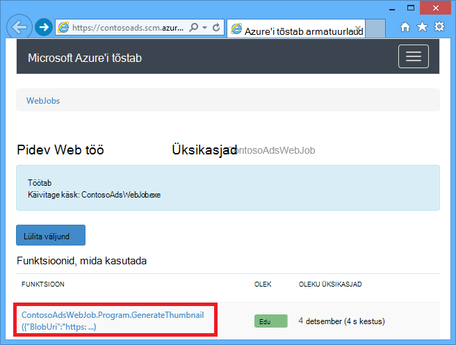

    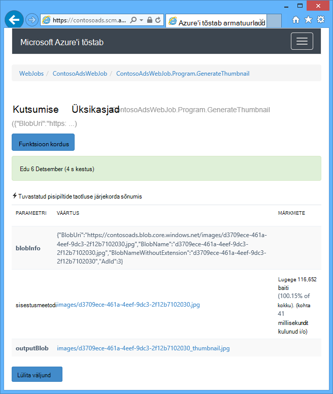

    Sellel lehel nupp **Kordus funktsioon** põhjustab WebJobs SDK raames helistamiseks funktsiooni uuesti ja see pakub võimalust esmalt funktsioonile edastatud andmeid muuta.

>[AZURE.NOTE] Kui olete lõpetanud katsetamine, web app ja SQL-andmebaasi eksemplari kustutada. Veebirakenduse on tasuta, kuid SQL-andmebaasi eksemplar ja salvestusruumi konto lisada kulude (minimaalsed väike suurusest). Ka, kui jätate töötab veebirakenduse, keegi leiab teie URL-i saate luua ja vaadata reklaamid. Klassikaline portaalis, avage vahekaart **armatuurlaud** veebirakenduse jaoks ja seejärel klõpsake lehe allosas nuppu **Kustuta** . Seejärel saate märkeruudu samal ajal SQL-andmebaasi eksemplari kustutada. Kui soovite lihtsalt ajutiselt takistada teistel juurdepääsu veebirakenduse, klõpsake nuppu **Peata** selle asemel. Sel juhul jätkub kulude konto SQL-andmebaasi ja salvestusruumi lisada. SQL-i andmebaas ja salvestusruumi konto kustutamiseks, kui te enam ei vaja neid sarnaseid protseduuri võite järgida.

## Rakenduse loomine algusest peale

Selles jaotises saate teha järgmisi toiminguid:

* Looge lahenduse Visual Studio web projekti.
* Saate lisada klassi teegi projekti andmed Accessi kiht, mis on jagatud ees- ja taustväärtus.
* Lisage konsooli rakendus projekti jaoks kirjutamata, WebJobs juurutuse lubatud.
* Lisage Nugeti paketid.
* Viited määramine projekti.
* Kopeerige allalaaditud rakendus, mida te töötanud õpetuse eelmises jaotises rakenduse koodi ja konfiguratsiooni failid.
* Vaadake üle koodi osad, et Azure plekid ja järjekorrad ja WebJobs SDK töötamine.

### Web projekti ja klassi Raamatukogu projekti lahenduse Visual Studio loomine

1. Visual Studio, valige **Uus** > **projekti** menüü **fail** .

2. Valige dialoogiboksis **Uue projekti** **Visual C#** > **Web** > **ASP.net-i veebirakenduse**.

3. Projekti ContosoAdsWeb, nimi lahendus ContosoAdsWebJobsSDK (muutmine juhul, kui salvestate seda samas kaustas allalaaditud lahendus lahendus nimi) nimi ja seejärel klõpsake nuppu **OK**.

    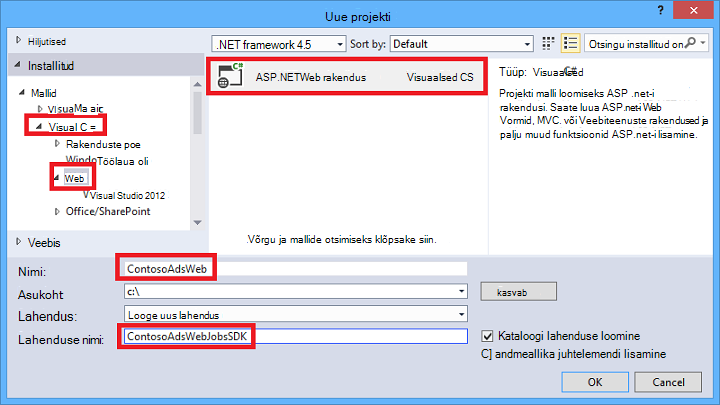

5. Dialoogiboksis **Uue ASP.net-i projekti** MVC malli valimine ja tühjendage ruut **Host pilveteenuses** jaotises **Microsoft Azure'i**.

    Valides **Host pilveteenuses** võimaldab automaatselt luua uue Azure veebirakenduse Visual Studio ja SQL-andmebaasi. Kuna olete juba loonud need varasemas versioonis, peate ei nüüd ajal projekti loomine. Kui soovite luua uue, märkige ruut. Saate konfigureerida uue veebirakenduse ja SQL-andmebaasi samamoodi nagu varem rakendus juurutamisel.

5. Klõpsake nuppu **Muuda autentimist**.

    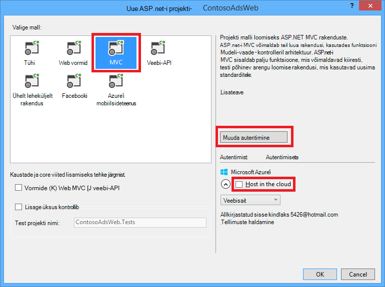

7. Dialoogiboksi **Muuda autentimist** valige **Ei autentimine**ning seejärel klõpsake nuppu **OK**.

    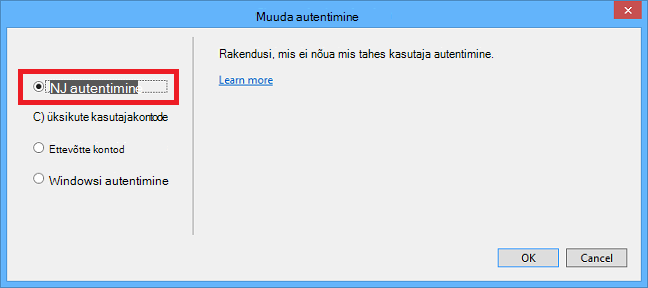

8. **ASP.net-i uue projekti** dialoogiboksis nuppu **OK**.

    Visual Studio loob lahendus ja web project.

9. **Lahenduste Explorer**, paremklõpsake lahendus (mitte projekt) ja valige **Lisa** > **Uue projekti**.

11. Valige dialoogiboksis **Lisa uus projekt** **Visual C#** > **Windowsi töölaua** > **Klassiteek** malli.  

10. Projekti *ContosoAdsCommon*nimi ja seejärel klõpsake nuppu **OK**.

    Selle projekti sisaldab andmemudelit, mis kasutab nii ees ja tagasi end ja üksuse raames kontekstis. Asemel võite määratleda EF seotud klassid rakenduses web project ning viide selle projekti WebJob projekti. Kuid seejärel WebJob projekti oleks viide web assemblereid, mis seda ei vaja.

### Lisage konsooli rakendus projekt, millel on lubatud WebJobs juurutamine

1. Paremklõpsake web projekt (mitte lahendus või klassi teegi projekt) ja seejärel klõpsake nuppu **Lisa** > **Uue Azure'i WebJob projekti**.

    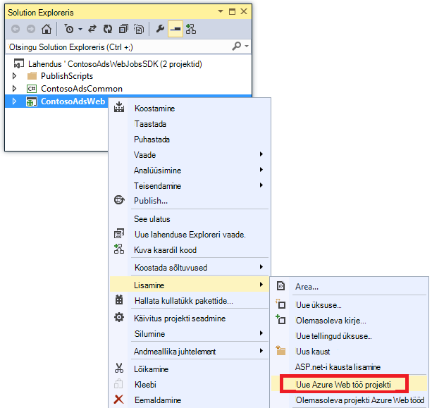

2. Sisestage dialoogiboksis **Lisamine Azure'i WebJob** ContosoAdsWebJob nii **projekti nime** ja **WebJob nimi**. Jätke **WebJob käivitada režiimis** **Käivitada pidevalt**määramine.

3.  Klõpsake nuppu **OK**.

    Visual Studio loob konsooli rakendus, mis on konfigureeritud juurutamine nimega on WebJob iga kord, kui juurutate web project. Selleks, et teha see projekti loomise järel järgmisi toiminguid:

    * Lisatud *webjob avaldamine settings.json* faili kaustas WebJob projekti atribuudid.
    * Projekti atribuutide veebikausta *webjobs-list.json* faili lisada.
    * Installitud Microsoft.Web.WebJobs.Publish Nugeti pakett WebJob projekt.

    Muudatuste kohta leiate lisateavet teemast [juurutamise WebJobs Visual Studio abil](websites-dotnet-deploy-webjobs.md).

### Lisage Nugeti paketid

Uue projekti malli WebJob projekti installitakse automaatselt WebJobs SDK Nugeti pakett [Microsoft.Azure.WebJobs](http://www.nuget.org/packages/Microsoft.Azure.WebJobs) ja sõltuvustega.

Üks WebJobs SDK sõltuvused, mis installitakse automaatselt WebJob projekt on Azure salvestusruumi kliendi teek (SCL). Siiski peate lisamiseks web projekti plekid ja järjekorrad töötamiseks.

1. Lahendus **Haldamine Nugeti pakettide** dialoogiboksi avamine

2. Valige vasakul paanil **installitud paketid**.

3. Leida *Azure Storage* pakett ja klõpsake siis käsku **Halda**.

4. **Projektide valige** väljal **ContosoAdsWeb** märkige ruut ja seejärel klõpsake nuppu **OK**.

    Kõigi kolme projekti abil andmete kasutamine SQL-andmebaasi üksuse raames.

5. Valige vasakul paanil **Online**.

6. Otsige *EntityFramework* Nugeti pakett ja installige see kõigi kolme projektides.

### Sea projekti viited

Nii veebi ja WebJob projektide töötada nii, et mõlemad on vaja viide ContosoAdsCommon projekti SQL-andmebaasi.

1. Määrake ContosoAdsWeb projekti ContosoAdsCommon projekti viide. (ContosoAdsWeb projekti paremklõpsake ja seejärel klõpsake nuppu **Lisa** > **viide**. Valige dialoogiboksis **Nimehaldur viide** **lahenduse** > **projektide** > **ContosoAdsCommon**, ja seejärel klõpsake nuppu **OK**.)

1. Määrake ContosoAdsWebJob projekti ContosAdsCommon projekti viide.

    Projekti WebJob vajab viited piltidega töötamiseks ja juurdepääs ühendusstringi.

3. Projectis ContosoAdsWebJob määratud viite `System.Drawing` ja `System.Configuration`.

### Koodi ja konfiguratsiooni failide lisamine

Selles õpetuses ei kuvata [MVC kontrollerid ja vaadete abil tellingud loomine](http://www.asp.net/mvc/tutorials/mvc-5/introduction/getting-started), kuidas [kirjutada üksuse raames koodi, mis töötab SQL serveri andmebaasi](http://www.asp.net/mvc/tutorials/getting-started-with-ef-using-mvc)või [põhitõdesid asünkroonne programmeerimine ASP.net-i 4.5](http://www.asp.net/aspnet/overview/developing-apps-with-windows-azure/building-real-world-cloud-apps-with-windows-azure/web-development-best-practices#async). Nii teha jääb kood ja konfiguratsiooni sisse uus lahendus lahendus allalaaditud faile kopeerida. Pärast seda, järgmistes jaotistes kuvamine ja selgitada põhiosadele kood.

Lisada faile projekti või kausta, paremklõpsake project või kaust ja klõpsake nuppu **Lisa** > **Olemasoleva kirje**. Valige failid, mida soovite ja klõpsake nuppu **Lisa**. Kui teilt küsitakse, kas soovite olemasoleva faili asendada, klõpsake nuppu **Jah**.

1. Projectis ContosoAdsCommon *Class1.cs* faili kustutada ja lisada selle asemel allalaaditud projekti järgmised failid.

    - *AD.cs*
    - *ContosoAdscontext.cs*
    - *BlobInformation.cs*  

2. ContosoAdsWeb projekt, lisage järgmised failid allalaaditud projekt.

    - *Web.config*
    - *Global.asax.cs*  
    - *Kontrollerid* kausta: *AdController.cs*
    - *Views\Shared* kausta: *_Layout.cshtml* fail
    - *Views\Home* kausta: *Index.cshtml*
    - *Views\Ad* kausta (Loo kaust esmalt): viis *.cshtml* faili  

3. ContosoAdsWebJob projekt, lisage järgmised failid allalaaditud projekt.

    - *App.config* (Muuda faili tüüpi filter **Kõik**failid)
    - *Program.cs*
    - *Functions.cs*

Nüüd saate koostada, käivitada ja rakenduse juurutamine on õpetuses juhistele. Enne kui saate seda teha, aga peatada WebJob, kus töötab endiselt esimese web app saate juurutatud. Muul juhul töötleb selle WebJob luuakse kohalik või rakendus töötab uue veebirakenduse, kuna kõik on sama kontoga salvestusruumi kirjad järjekorda.

## Vaadake üle rakenduse koodi

Järgmistes jaotistes kirjeldatakse seotud WebJobs SDK ja Azure Storage plekid ja järjekorrad töötamine tähist.

> [AZURE.NOTE] Teatud WebJobs SDK kood, minge [Program.cs ja Functions.cs](#programcs) jaotised.

### ContosoAdsCommon - Ad.cs

Ad.cs faili määratleb on loetelu reklaami kategooria ja POCO üksuse klassi ad teavet.

        public enum Category
        {
            Cars,
            [Display(Name="Real Estate")]
            RealEstate,
            [Display(Name = "Free Stuff")]
            FreeStuff
        }

        public class Ad
        {
            public int AdId { get; set; }

            [StringLength(100)]
            public string Title { get; set; }

            public int Price { get; set; }

            [StringLength(1000)]
            [DataType(DataType.MultilineText)]
            public string Description { get; set; }

            [StringLength(1000)]
            [DisplayName("Full-size Image")]
            public string ImageURL { get; set; }

            [StringLength(1000)]
            [DisplayName("Thumbnail")]
            public string ThumbnailURL { get; set; }

            [DataType(DataType.Date)]
            [DisplayFormat(DataFormatString = "{0:yyyy-MM-dd}", ApplyFormatInEditMode = true)]
            public DateTime PostedDate { get; set; }

            public Category? Category { get; set; }
            [StringLength(12)]
            public string Phone { get; set; }
        }

### ContosoAdsCommon - ContosoAdsContext.cs

Klassi ContosoAdsContext saate määrata, et Ad klassi kasutatakse DbSet kogumi, mis üksuse raames salvestab SQL-andmebaasis.

        public class ContosoAdsContext : DbContext
        {
            public ContosoAdsContext() : base("name=ContosoAdsContext")
            {
            }
            public ContosoAdsContext(string connString)
                : base(connString)
            {
            }
            public System.Data.Entity.DbSet<Ad> Ads { get; set; }
        }

Klassi on kaks ehitajatel. Esimene kasutab web project ja määrab nime ühendusstring, mis on talletatud fail või Azure käitusaja keskkonnas. Teine ehitaja võimaldab teil läbida tegelik ühendusstring. Mida on vaja WebJob projekti kuna seda pole faili Web.config. Eespool kuvatud kus see ühendusstringi talletatud ja näete, kuidas hiljem koodi toob ühendusstring, kui see instantiates DbContext klassi.

### ContosoAdsCommon - BlobInformation.cs

Funktsiooni `BlobInformation` klassi kasutatakse järjekorda sõnumis mõne pildi bloobimälu teabe talletamiseks.

        public class BlobInformation
        {
            public Uri BlobUri { get; set; }

            public string BlobName
            {
                get
                {
                    return BlobUri.Segments[BlobUri.Segments.Length - 1];
                }
            }
            public string BlobNameWithoutExtension
            {
                get
                {
                    return Path.GetFileNameWithoutExtension(BlobName);
                }
            }
            public int AdId { get; set; }
        }

### ContosoAdsWeb - Global.asax.cs

Koodi, mida nimetatakse funktsiooni `Application_Start` meetod loob mõne *pildid* bloobimälu container ja mõne *piltide* järjekorra kui need pole juba olemas. See tagab, et iga kord, kui alustate uue salvestusruumi konto kaudu, nõutav bloobimälu container ja järjekorda luuakse automaatselt.

Koodi saab juurdepääsu salvestusruumi konto abil salvestusruumi ühendusstringi *fail* või Azure käitusaja keskkonnas.

        var storageAccount = CloudStorageAccount.Parse
            (ConfigurationManager.ConnectionStrings["AzureWebJobsStorage"].ToString());

Seejärel seda saab viide *piltide* bloobimälu ümbris, loob ümbris, kui see pole juba olemas ja juurdepääsuõigused oleval uue määrab. Vaikimisi uue ümbriste luba ainult klientidele salvestusruumi konto identimisteave plekid juurdepääsu. Veebirakenduse peab olema avalik, et see saab kuvada pilte, kasutades URL-id, mis viitavad pilt plekid plekid.

        var blobClient = storageAccount.CreateCloudBlobClient();
        var imagesBlobContainer = blobClient.GetContainerReference("images");
        if (imagesBlobContainer.CreateIfNotExists())
        {
            imagesBlobContainer.SetPermissions(
                new BlobContainerPermissions
                {
                    PublicAccess = BlobContainerPublicAccessType.Blob
                });
        }

Sarnase kood saab viide *thumbnailrequest* kuhjuda ja loob uue järjekorra. Sel juhul ei muuda õigusi on vaja. 

        CloudQueueClient queueClient = storageAccount.CreateCloudQueueClient();
        var imagesQueue = queueClient.GetQueueReference("thumbnailrequest");
        imagesQueue.CreateIfNotExists();

### ContosoAdsWeb - _Layout.cshtml

*_Layout.cshtml* faili seab rakenduse nime päise ja jaluse ning loob "Reklaamid" menüü kirje.

### ContosoAdsWeb - Views\Home\Index.cshtml

*Views\Home\Index.cshtml* fail kuvatakse kategooria lingid avalehel. Linke edasi täisarvu väärtus on `Category` kellaajavälju päringustringi muutuja reklaamid Index leht.

        <li>@Html.ActionLink("Cars", "Index", "Ad", new { category = (int)Category.Cars }, null)</li>
        <li>@Html.ActionLink("Real estate", "Index", "Ad", new { category = (int)Category.RealEstate }, null)</li>
        <li>@Html.ActionLink("Free stuff", "Index", "Ad", new { category = (int)Category.FreeStuff }, null)</li>
        <li>@Html.ActionLink("All", "Index", "Ad", null, null)</li>

### ContosoAdsWeb - AdController.cs

Faili sisse *AdController.cs* ehitaja kõned on `InitializeStorage` meetod luua Azure'i salvestusruumi kliendi teek objektid, mis pakuvad API plekid ja järjekorrad töötamiseks.

Seejärel koodi saab *piltide* bloobimälu container viite nagu varem rakenduses *Global.asax.cs*kuvatud. Seeläbi, et seda määrab vaikimisi [proovige poliitika](http://www.asp.net/aspnet/overview/developing-apps-with-windows-azure/building-real-world-cloud-apps-with-windows-azure/transient-fault-handling) vastav web appi. Eksponentsiaalse backoff uuesti vaikepoliitika võib hanguda veebirakenduse rohkem kui minutiks sisse korduvate korduskatsed siirdamiseks viga. Proovi uuesti poliitika määratud Siin ootab sekundi pärast iga proovida kuni 3 korda.

        var blobClient = storageAccount.CreateCloudBlobClient();
        blobClient.DefaultRequestOptions.RetryPolicy = new LinearRetry(TimeSpan.FromSeconds(3), 3);
        imagesBlobContainer = blobClient.GetContainerReference("images");

Sarnase kood saab *piltide* järjekorra viide.

        CloudQueueClient queueClient = storageAccount.CreateCloudQueueClient();
        queueClient.DefaultRequestOptions.RetryPolicy = new LinearRetry(TimeSpan.FromSeconds(3), 3);
        imagesQueue = queueClient.GetQueueReference("blobnamerequest");

Enamik kontrolleril kood on tüüpilised üksuse raames andmemudeli abil DbContext klassi töötamiseks. Erandiks on selle HttpPost `Create` meetod, mis on lisatud faili ja salvestub bloobimälu. Mudeli sideaine pakub meetodiga [HttpPostedFileBase](http://msdn.microsoft.com/library/system.web.httppostedfilebase.aspx) objekti.

        [HttpPost]
        [ValidateAntiForgeryToken]
        public async Task<ActionResult> Create(
            [Bind(Include = "Title,Price,Description,Category,Phone")] Ad ad,
            HttpPostedFileBase imageFile)

Kui kasutaja valitud faili üles laadida, koodi, laaditakse fail, salvestub on bloobimälu ja värskendab Ad andmebaasi kirje URL, mis osutab selle bloobimälu.

        if (imageFile != null && imageFile.ContentLength != 0)
        {
            blob = await UploadAndSaveBlobAsync(imageFile);
            ad.ImageURL = blob.Uri.ToString();
        }

Kas üles koodis on selle `UploadAndSaveBlobAsync` meetod. See loob soovitud bloobimälu GUID nimi, lisatud ja salvestab faili ja tagastab viite salvestatud bloobimälu.

        private async Task<CloudBlockBlob> UploadAndSaveBlobAsync(HttpPostedFileBase imageFile)
        {
            string blobName = Guid.NewGuid().ToString() + Path.GetExtension(imageFile.FileName);
            CloudBlockBlob imageBlob = imagesBlobContainer.GetBlockBlobReference(blobName);
            using (var fileStream = imageFile.InputStream)
            {
                await imageBlob.UploadFromStreamAsync(fileStream);
            }
            return imageBlob;
        }

Pärast selle HttpPost `Create` meetod on bloobimälu laadib ja värskendab andmebaasi, loob järjekorda sõnumi tagaandmebaas protsessi teavitada, kas pilt on valmis üleminekuks pisipilt.

        BlobInformation blobInfo = new BlobInformation() { AdId = ad.AdId, BlobUri = new Uri(ad.ImageURL) };
        var queueMessage = new CloudQueueMessage(JsonConvert.SerializeObject(blobInfo));
        await thumbnailRequestQueue.AddMessageAsync(queueMessage);

Funktsiooni HttpPost kood `Edit` meetod on sarnane, kuid kui kasutaja valib uue pildi faili mis tahes plekid, mis on juba olemas selle reklaami kustutamist.

        if (imageFile != null && imageFile.ContentLength != 0)
        {
            await DeleteAdBlobsAsync(ad);
            imageBlob = await UploadAndSaveBlobAsync(imageFile);
            ad.ImageURL = imageBlob.Uri.ToString();
        }

Siin on kustutab plekid reklaami kustutamisel koodis:

        private async Task DeleteAdBlobsAsync(Ad ad)
        {
            if (!string.IsNullOrWhiteSpace(ad.ImageURL))
            {
                Uri blobUri = new Uri(ad.ImageURL);
                await DeleteAdBlobAsync(blobUri);
            }
            if (!string.IsNullOrWhiteSpace(ad.ThumbnailURL))
            {
                Uri blobUri = new Uri(ad.ThumbnailURL);
                await DeleteAdBlobAsync(blobUri);
            }
        }
        private static async Task DeleteAdBlobAsync(Uri blobUri)
        {
            string blobName = blobUri.Segments[blobUri.Segments.Length - 1];
            CloudBlockBlob blobToDelete = imagesBlobContainer.GetBlockBlobReference(blobName);
            await blobToDelete.DeleteAsync();
        }

### ContosoAdsWeb - Views\Ad\Index.cshtml ja Details.cshtml

*Index.cshtml* fail kuvatakse muude ad andmetega pisipildid.

        

*Details.cshtml* fail kuvatakse täissuuruses pilt.

        

### ContosoAdsWeb - Views\Ad\Create.cshtml ja Edit.cshtml

Failide *Create.cshtml* ja *Edit.cshtml* määrata vormi kodeering, mis võimaldab saada kontrolleril on `HttpPostedFileBase` objekti.

        @using (Html.BeginForm("Create", "Ad", FormMethod.Post, new { enctype = "multipart/form-data" }))

Mõne `<input>` elemendi teada anda faili valimise dialoogis brauseris.

        <input type="file" name="imageFile" accept="image/*" class="form-control fileupload" />

### ContosoAdsWebJob - Program.cs

Funktsiooni WebJob käivitamisel, on `Main` nõuab WebJobs SDK `JobHost.RunAndBlock` meetod, et täitmise alustada vallandanud funktsioonid praeguse teema.

        static void Main(string[] args)
        {
            JobHost host = new JobHost();
            host.RunAndBlock();
        }

### ContosoAdsWebJob - Functions.cs - GenerateThumbnail meetod

WebJobs SDK kõned seda meetodit järjekorda sõnumi saabumisel. Meetod loob pisipilt ning paneb pisipilti URL-i andmebaasist.

        public static void GenerateThumbnail(
        [QueueTrigger("thumbnailrequest")] BlobInformation blobInfo,
        [Blob("images/{BlobName}", FileAccess.Read)] Stream input,
        [Blob("images/{BlobNameWithoutExtension}_thumbnail.jpg")] CloudBlockBlob outputBlob)
        {
            using (Stream output = outputBlob.OpenWrite())
            {
                ConvertImageToThumbnailJPG(input, output);
                outputBlob.Properties.ContentType = "image/jpeg";
            }

            // Entity Framework context class is not thread-safe, so it must
            // be instantiated and disposed within the function.
            using (ContosoAdsContext db = new ContosoAdsContext())
            {
                var id = blobInfo.AdId;
                Ad ad = db.Ads.Find(id);
                if (ad == null)
                {
                    throw new Exception(String.Format("AdId {0} not found, can't create thumbnail", id.ToString()));
                }
                ad.ThumbnailURL = outputBlob.Uri.ToString();
                db.SaveChanges();
            }
        }

* Funktsiooni `QueueTrigger` , suunab atribuut WebJobs SDK helistamiseks seda meetodit, kui uus sõnum on thumbnailrequest järjekorda.

        [QueueTrigger("thumbnailrequest")] BlobInformation blobInfo,

    Funktsiooni `BlobInformation` objekti järjekorra sõnum on automaatselt deserialized sisse soovitud `blobInfo` parameeter. Kui meetod on lõpule jõudnud, järjekorra sõnum on kustutatud. Meetodit nurjumisel lahkudes järjekorda sõnum on kustutatud; pärast aegumist 10-minutilise rendilepingu sõnum välja, kui te soovite uuesti ja töödeldud. Järjestusel ei saa lõputult korrata, kui sõnumi alati põhjustab erandi. Pärast sõnumi töötlemine proovib 5 õnnestu, sõnum järjekorda nimega {queuename}-mürki. Katsete maksimumarv on konfigureeritav.

* Kahe `Blob` atribuute pakuvad objekte, mis on seotud plekid: üks olemasoleva pildi bloobimälu ja üks uus pisipiltide bloobimälu, mis loob meetodit.

        [Blob("images/{BlobName}", FileAccess.Read)] Stream input,
        [Blob("images/{BlobNameWithoutExtension}_thumbnail.jpg")] CloudBlockBlob outputBlob)

    Bloobimälu nimed on pärit atribuudid on `BlobInformation` objekti, mis on saadud sõnumi järjekorda (`BlobName` ja `BlobNameWithoutExtension`). Saada salvestusruumi kliendi teek, saate kasutada kõiki funktsioone on `CloudBlockBlob` klassi plekid töötamiseks. Kui soovite uuesti kasutada koodi töötamiseks koostatud `Stream` objektide, saate kasutada funktsiooni `Stream` klassi.

Kuidas kirjutada funktsioonid, mida kasutada WebJobs SDK atribuutide kohta leiate lisateavet leiate järgmistest teemadest.

* [Kuidas kasutada Azure järjekorda salvestusruumi WebJobs SDK](websites-dotnet-webjobs-sdk-storage-queues-how-to.md)
* [Kuidas kasutada WebJobs SDK Azure'i bloobimälu](websites-dotnet-webjobs-sdk-storage-blobs-how-to.md)
* [Kuidas kasutada WebJobs SDK Azure'i tabelimälu](websites-dotnet-webjobs-sdk-storage-tables-how-to.md)
* [Kuidas kasutada Azure teenuse siini WebJobs SDK](websites-dotnet-webjobs-sdk-service-bus.md)

> [AZURE.NOTE]
>
> * Kui teie web app töötab mitu VMs, mitme WebJobs töötab samal ajal ja mõnel juhul võib see põhjustada töödelda korduvalt samu andmeid. See ei ole probleem, kui kasutate sisseehitatud järjekorda, bloobimälu ja teenuse siini päästikute. SDK tagab, et teie funktsioonide töödeldakse iga sõnumi või bloobimälu ainult üks kord.
>
> * Kuidas rakendada graatsiline sulgemise kohta leiate teemast [Graatsiline sulgumist](websites-dotnet-webjobs-sdk-storage-queues-how-to.md#graceful).
>
> * Koodi selle `ConvertImageToThumbnailJPG` meetod (ei kuvata) kasutab tunde soovitud `System.Drawing` nimeruumi lihtne. Siiski tunnid selle nimeruumi on mõeldud kasutamiseks Windowsi vormidega. Ei toetata Windowsi või ASP.net-i teenuse kasutamiseks. Pilditöötluse suvandite kohta leiate lisateavet teemast [Dünaamiline pilt genereerimine](http://www.hanselman.com/blog/BackToBasicsDynamicImageGenerationASPNETControllersRoutingIHttpHandlersAndRunAllManagedModulesForAllRequests.aspx) ja [Sügav sees pildi suuruse muutmiseks](http://www.hanselminutes.com/313/deep-inside-image-resizing-and-scaling-with-aspnet-and-iis-with-imageresizingnet-author-na).

## Järgmised sammud

Selles õpetuses olete näinud lihtne mitmekihilise rakendus, mis kasutab WebJobs SDK taustväärtus töötlemiseks. See pakub rohkem teada ASP.net-i mitmekihilise rakenduste ja WebJobs mõned soovitused.

### Puuduvad funktsioonid

Rakendus on hoida lihtne töö alustamine õpetuse. Tegelike rakenduses oleks rakendada [sõltuvus süsti](http://www.asp.net/mvc/tutorials/hands-on-labs/aspnet-mvc-4-dependency-injection) ja [hoidla ja üksuse töötada mustrite](http://www.asp.net/mvc/tutorials/getting-started-with-ef-using-mvc/advanced-entity-framework-scenarios-for-an-mvc-web-application#repo), [liidest logimiseks](http://www.asp.net/aspnet/overview/developing-apps-with-windows-azure/building-real-world-cloud-apps-with-windows-azure/monitoring-and-telemetry#log)kasutage, [EF koodi esimese migratsioon](http://www.asp.net/mvc/tutorials/getting-started-with-ef-using-mvc/migrations-and-deployment-with-the-entity-framework-in-an-asp-net-mvc-application) abil saate hallata andmeid mudel muudatused ning [EF ühenduse paindlikkust](http://www.asp.net/mvc/tutorials/getting-started-with-ef-using-mvc/connection-resiliency-and-command-interception-with-the-entity-framework-in-an-asp-net-mvc-application) abil saate hallata siirdamiseks võrgu tõrkeid.

### Skaleerimise WebJobs

WebJobs web appi kontekstis Käivita ja pole scalable eraldi. Näiteks, kui teil on ühe standardse veebi rakenduse eksemplari, teil on ainult üks eksemplar oma tausta protsess töötab ja see on mõne serveri ressursid (CPU, mälu jne), mis muidu oleks saadaval web sisu abil.

Kui liikluse riigiti nädalapäev ajal ja taustväärtus töötlemine peate ootama saate, võib te plaanite oma WebJobs madal-liikluse ajal käivitada. Kui laadi on endiselt liiga suur lahenduse, saate käivitada soovitud taustväärtus nimega on WebJob eraldi web Appis sihtotstarbeline selleks. Saate siis skaala oma kirjutamata veebirakenduse sõltumatult frontend web Appist.

Lisateavet leiate teemast [Skaleerimist WebJobs](websites-webjobs-resources.md#scale).

### Web appi ajalõpp automaatsüsteeme vältimine

Veendumaks, et teie WebJobs alati töötab ja töötab kõik eksemplarid oma veebirakenduse, tuleb lubada [AlwaysOn](http://weblogs.asp.net/scottgu/archive/2014/01/16/windows-azure-staging-publishing-support-for-web-sites-monitoring-improvements-hyper-v-recovery-manager-ga-and-pci-compliance.aspx) funktsiooni.

### Väljaspool WebJobs WebJobs SDK abil

Programmi, mis kasutab WebJobs SDK pole käivitamiseks on WebJob Azure. Käitamise kohalikult ja saab käivitada ka muud keskkonnas, nt pilveteenuses töötaja roll või teenuse Windows. Siiski saate ainult kasutada WebJobs SDK armatuurlaua Azure web app kaudu. Armatuurlaua kasutamiseks peate web appi kontoga ühenduse loomiseks soovitud salvestusruumi te kasutate AzureWebJobsDashboard ühendusstringi seades **konfigureerimine** menüüd classic portaali. Seejärel saate armatuurlaual järgmist URL-i abil:

https://{webappname}.SCM.azurewebsites.net/azurejobs/#/Functions

Lisateabe saamiseks vaadake [armatuurlaua arengu WebJobs SDK saamine](http://blogs.msdn.com/b/jmstall/archive/2014/01/27/getting-a-dashboard-for-local-development-with-the-webjobs-sdk.aspx), kuid Pange tähele, et see on vana ühenduse stringi nimi.

### Lisateavet WebJobs dokumentatsioon

Lisateavet leiate [Azure'i WebJobs dokumentatsiooni ressurssidest](http://go.microsoft.com/fwlink/?LinkId=390226).
