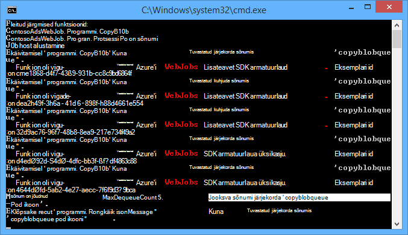
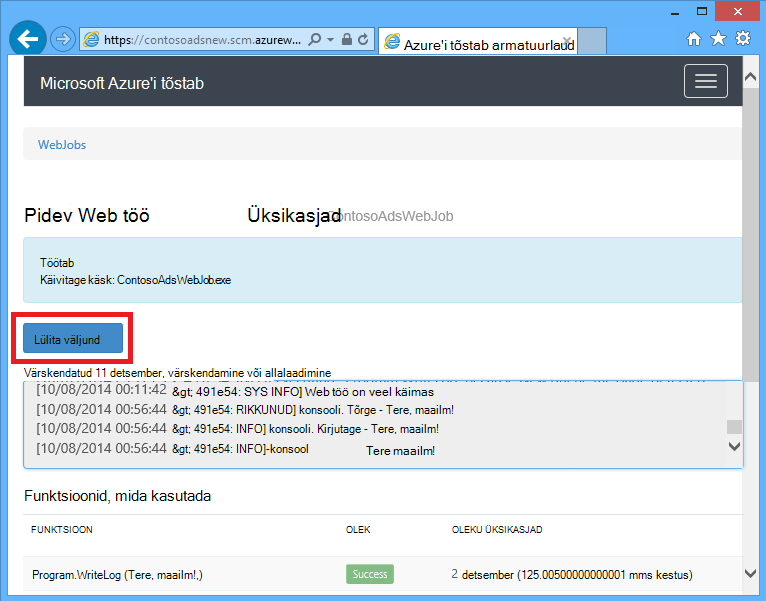
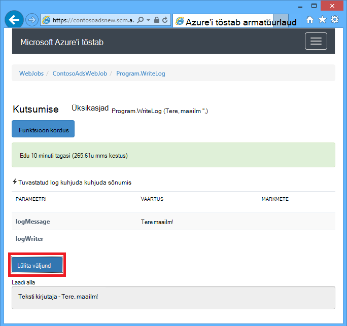
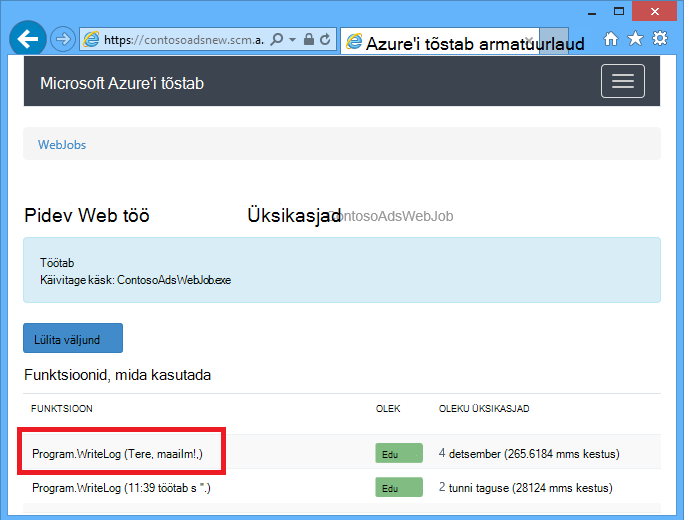
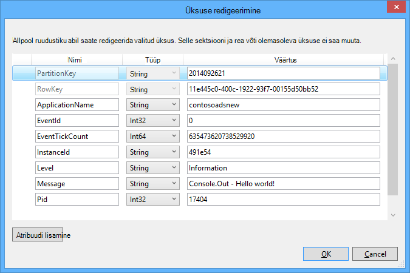
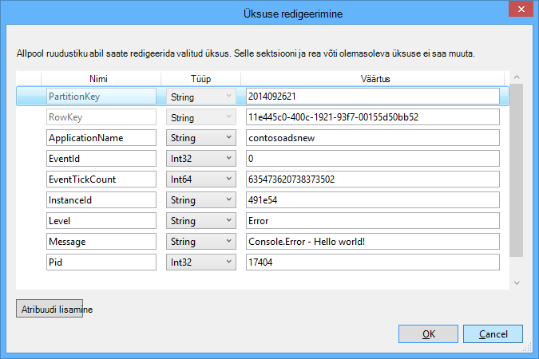

<properties 
    pageTitle="Kuidas kasutada Azure järjekorda salvestusruumi WebJobs SDK" 
    description="Saate teada, kuidas kasutada Azure järjekorda salvestusruumi WebJobs SDK. Loomine ja kustutamine järjekorrad; lisa, peek, hankimine ja kustutamine järjekorda sõnumeid ja palju muud." 
    services="app-service\web, storage" 
    documentationCenter=".net" 
    authors="tdykstra" 
    manager="wpickett" 
    editor="jimbe"/>

<tags 
    ms.service="app-service-web" 
    ms.workload="web" 
    ms.tgt_pltfrm="na" 
    ms.devlang="dotnet" 
    ms.topic="article" 
    ms.date="06/01/2016" 
    ms.author="tdykstra"/>

# <a name="how-to-use-azure-queue-storage-with-the-webjobs-sdk"></a>Kuidas kasutada Azure järjekorda salvestusruumi WebJobs SDK

## <a name="overview"></a>Ülevaade

Sellest juhendist leiate C# koodi näidised, mis näitab, kuidas kasutada Azure WebJobs SDK versioon 1.x teenusega Azure järjekorda salvestusruumi.

Juhend eeldab, et teate, [Kuidas luua WebJob projekti Visual Studios koos ühendusstringi, mis osutage salvestusruumi konto](websites-dotnet-webjobs-sdk-get-started.md#configure-storage) või [mitme salvestusruumi](https://github.com/Azure/azure-webjobs-sdk/blob/master/test/Microsoft.Azure.WebJobs.Host.EndToEndTests/MultipleStorageAccountsEndToEndTests.cs)kontod.

Enamik on koodilõigud kuvada ainult funktsioone, koodi, mis loob soovitud `JobHost` objekti, nagu järgmises näites:

        static void Main(string[] args)
        {
            JobHost host = new JobHost();
            host.RunAndBlock();
        }
        
Juhend hõlmab järgmisi teemasid:

-   [Kuidas funktsiooni käivitamiseks järjekorda sõnumi saabumisel](#trigger)
    - Stringi järjekorda sõnumid
    - POCO järjekorra sõnumid
    - Asünkroonse funktsioonid
    - Atribuut QueueTrigger töötab koos tüübid
    - Küsitlused algoritmi
    - Mitmes eksemplaris
    - Paralleelne
    - Saada järjekorda või järjekorda sõnumi metaandmed
    - Graatsiline sulgemine
-   [Kuidas luua järjekorra sõnumi järjekorra sõnumi töötlemise ajal](#createqueue)
    - Stringi järjekorra sõnumid
    - Sõnumite POCO järjekord
    - Mitme meilisõnumi loomine või asünkroonse funktsioonid
    - Atribuut järjekorda töötab koos tüübid
    - Kasutage funktsiooni kehas WebJobs SDK atribuudid
-   [Kuidas lugeda ja kirjutada plekid järjekorda sõnumi töötlemise ajal](#blobs)
    - Stringi järjekorda sõnumid
    - Sõnumite POCO järjekord
    - Atribuut bloobimälu töötab tüübid
-   [Mürki sõnumite reageerimine](#poison)
    - Sõnumite automaatse mürki töötlemine
    - Käsitsi mürki sõnumite töötlemine
-   [Kuidas konfiguratsiooni suvandite määramine](#config)
    - Koodi SDK ühendusstringi määramine
    - QueueTrigger sätete konfigureerimine
    - Määrata väärtused WebJobs SDK ehitaja parameetrite kood
-   [Kuidas funktsiooni käsitsi käivitamine](#manual)
-   [Kuidas kirjutada logid](#logs) 
-   [Vigade ja ajalõpud konfigureerimine](#errors)
-   [Järgmised sammud](#nextsteps)

## <a id="trigger"></a>Kuidas funktsiooni käivitamiseks järjekorda sõnumi saabumisel

Kirjutage WebJobs SDK kõned kui järjekorda sõnum on funktsiooni, kasutage funktsiooni `QueueTrigger` atribuut. Atribuut ehitaja võtab päringustringi parameetri, mis määrab nime järjekorra küsitlus. Samuti saate [määrata dünaamiliselt järjekorra nimi](#config).

### <a name="string-queue-messages"></a>Stringi järjekorda sõnumid

Järgmises näites kuhjuda sisaldab stringi sõnumi, seega `QueueTrigger` stringi parameetrit, mille nimi on rakendatud `logMessage` mis sisaldab järjekorda sõnumi sisu. Selle funktsiooni [kirjutab log sõnumi armatuurlaud](#logs).
 

        public static void ProcessQueueMessage([QueueTrigger("logqueue")] string logMessage, TextWriter logger)
        {
            logger.WriteLine(logMessage);
        }

Lisaks `string`, parameetri võib olla baitide massiivis, on `CloudQueueMessage` objekti või POCO, et määratleda.

### <a name="poco-plain-old-clr-objecthttpenwikipediaorgwikiplainoldclrobject-queue-messages"></a>POCO [(tavaline vana CLR-i objekti](http://en.wikipedia.org/wiki/Plain_Old_CLR_Object)) sõnumite järjekord

Järgmises näites järjekorda sõnum sisaldab JSON jaoks soovitud `BlobInformation` objekti, mis sisaldab soovitud `BlobName` atribuut. SDK deserializes automaatselt objekti.

        public static void WriteLogPOCO([QueueTrigger("logqueue")] BlobInformation blobInfo, TextWriter logger)
        {
            logger.WriteLine("Queue message refers to blob: " + blobInfo.BlobName);
        }

SDK kasutab [Newtonsoft.Json Nugeti pakett](http://www.nuget.org/packages/Newtonsoft.Json) serialiseerida ja andmeatribuutide sõnumeid. Kui loote programmis, mis ei kasuta WebJobs SDK järjekorda sõnumeid, saate kirjutada koodi, nagu järgmises näites POCO järjekorda sõnumi SDK saab sõeluda loomiseks. 

        BlobInformation blobInfo = new BlobInformation() { BlobName = "log.txt" };
        var queueMessage = new CloudQueueMessage(JsonConvert.SerializeObject(blobInfo));
        logQueue.AddMessage(queueMessage);

### <a name="async-functions"></a>Asünkroonse funktsioonid

Kuvatakse järgmised asünkroonse funktsioon [kirjutab Logi armatuurlaud](#logs).

        public async static Task ProcessQueueMessageAsync([QueueTrigger("logqueue")] string logMessage, TextWriter logger)
        {
            await logger.WriteLineAsync(logMessage);
        }

Asünkroonse funktsioonid võib kuluda [loobumise luba](http://www.asp.net/mvc/overview/performance/using-asynchronous-methods-in-aspnet-mvc-4#CancelToken), nagu on näidatud järgmises näites, mis on bloobimälu kopeeritakse. (Selgitused selle `queueTrigger` kohatäite jaotisest [plekid](#blobs) .)

        public async static Task ProcessQueueMessageAsyncCancellationToken(
            [QueueTrigger("blobcopyqueue")] string blobName, 
            [Blob("textblobs/{queueTrigger}",FileAccess.Read)] Stream blobInput,
            [Blob("textblobs/{queueTrigger}-new",FileAccess.Write)] Stream blobOutput,
            CancellationToken token)
        {
            await blobInput.CopyToAsync(blobOutput, 4096, token);
        }

### <a id="qtattributetypes"></a>Atribuut QueueTrigger töötab koos tüübid

Saate kasutada `QueueTrigger` koos järgmist tüüpi:

* `string`
* Kui JSON seeriasertide POCO tüüp
* `byte[]`
* `CloudQueueMessage`

### <a id="polling"></a>Küsitlused algoritmi

SDK rakendab on juhusliku eksponentsiaalse tagasi välja algoritmi jõude järjekorda küsitlused salvestusruumi tehingu kulude mõju vähendada.  Kui sõnum on leitud, SDK ootab kaks sekundit, ja seejärel kontrollimise teise sõnumi; Kui leitakse teadet selle ootab umbes neli sekundit enne uuesti. Pärast nurjunud edasiste katsete järjekorda teade, et, ajal jätkuvalt suurendada, kuni see jõuab maksimaalne ootama aega, mis on vaikimisi üks minut. [Suurim lubatud ajal on konfigureeritav](#config).

### <a id="instances"></a>Mitmes eksemplaris

Kui teie web app töötab mitmes eksemplaris, pidev WebJob töötab igas arvutis, ja igas arvutis, kuvatakse oodata päästikute ja proovite käitada funktsioonid. WebJobs SDK järjekorra päästik takistab automaatselt funktsiooni töötlemine järjekorra sõnumi mitu korda; funktsioonid ei pea olema idempotent kirjutada. Juhul, kui soovite tagada, et ainult ühe eksemplari funktsiooni käivitatakse isegi kui on mitu eksemplari host web appi, saate selle `Singleton` atribuut. 

### <a id="parallel"></a>Paralleelne

Kui teil on mitme eri järjekordadesse listening funktsioone, SDK kutsuvad neid samal ajal kui saadetud meilisõnumid korraga. 

Sama kehtib, kui ühe järjekorra saadetud mitme meilisõnumid. Vaikimisi SDK paketi 16 järjekorda sõnumeid saab korraga ja käivitab funktsiooni, mis töötleb neid samal ajal. [Paketi maht on konfigureeritav](#config). Arvu, et töödelda saab pool partii suurust, SDK saab teise paketi kui käivitatakse nende sõnumite töötlemist. Samaaegseid sõnumite kohta funktsioon töödelda maksimumarv on seega poolteist korda paketi suurus. See piirang kehtib eraldi iga funktsiooni, mis sisaldab soovitud `QueueTrigger` atribuut. 

Kui te ei soovi paralleelne ühe järjekorra saadud sõnumite jaoks, saate paketi suurus 1. Vt ka [Azure WebJobs SDK 1.1.0 RTM](/blog/azure-webjobs-sdk-1-1-0-rtm/) **töötlemine üle rohkem kontrolli** .

### <a id="queuemetadata"></a>Saada järjekorda või järjekorda sõnumi metaandmed

Saate oma sõnumi järgmised atribuudid, lisades parameetrite meetodit allkirja.

* `DateTimeOffset`expirationTime
* `DateTimeOffset`insertionTime
* `DateTimeOffset`nextVisibleTime
* `string`queueTrigger (sisaldab sõnumi tekst)
* `string`ID
* `string`popReceipt
* `int`dequeueCount

Kui soovite töötada Azure storage API, saate lisada mõne `CloudStorageAccount` parameeter.

Järgmises näites kirjutab kõik selle metaandmete soovitud teave rakenduse Logi. Näites nii logMessage ja queueTrigger sisaldavad järjekorda sõnumi sisu.

        public static void WriteLog([QueueTrigger("logqueue")] string logMessage,
            DateTimeOffset expirationTime,
            DateTimeOffset insertionTime,
            DateTimeOffset nextVisibleTime,
            string id,
            string popReceipt,
            int dequeueCount,
            string queueTrigger,
            CloudStorageAccount cloudStorageAccount,
            TextWriter logger)
        {
            logger.WriteLine(
                "logMessage={0}\n" +
            "expirationTime={1}\ninsertionTime={2}\n" +
                "nextVisibleTime={3}\n" +
                "id={4}\npopReceipt={5}\ndequeueCount={6}\n" +
                "queue endpoint={7} queueTrigger={8}",
                logMessage, expirationTime,
                insertionTime,
                nextVisibleTime, id,
                popReceipt, dequeueCount,
                cloudStorageAccount.QueueEndpoint,
                queueTrigger);
        }

Siin on näide samamoodi kirjutanud proovi kood:

        logMessage=Hello world!
        expirationTime=10/14/2014 10:31:04 PM +00:00
        insertionTime=10/7/2014 10:31:04 PM +00:00
        nextVisibleTime=10/7/2014 10:41:23 PM +00:00
        id=262e49cd-26d3-4303-ae88-33baf8796d91
        popReceipt=AgAAAAMAAAAAAAAAfc9H0n/izwE=
        dequeueCount=1
        queue endpoint=https://contosoads.queue.core.windows.net/
        queueTrigger=Hello world!

### <a id="graceful"></a>Graatsiline sulgemine

Funktsioon, mis töötab pidev WebJob saaksid vastu võtta mõne `CancellationToken` parameeter, mis võimaldab operatsioonisüsteemi funktsiooni teavitada, kui selle WebJob on lõpetada. See teatis abil saate veenduge, et funktsioon ei nii, et jäetakse andmed vastuolu ootamatult lõpetada.

Järgmises näites kujutatakse eelseisva WebJob lõpetamiseks funktsioonis kontrollida.

    public static void GracefulShutdownDemo(
                [QueueTrigger("inputqueue")] string inputText,
                TextWriter logger,
                CancellationToken token)
    {
        for (int i = 0; i < 100; i++)
        {
            if (token.IsCancellationRequested)
            {
                logger.WriteLine("Function was cancelled at iteration {0}", i);
                break;
            }
            Thread.Sleep(1000);
            logger.WriteLine("Normal processing for queue message={0}", inputText);
        }
    }

**Märkus:** Armatuurlaua võidakse kuvada õigesti, oleku ja väljundi funktsioone, mis on sulgeda.
 
Lisateavet leiate teemast [WebJobs graatsiline sulgumist](http://blog.amitapple.com/post/2014/05/webjobs-graceful-shutdown/#.VCt1GXl0wpR).   

## <a id="createqueue"></a>Kuidas luua järjekorda sõnumi järjekorda sõnumi töötlemise ajal

Funktsioon, mis loob uue järjekorda sõnumi kirjutamiseks saate kasutada funktsiooni `Queue` atribuut. Nagu `QueueTrigger`, te kaotate järjekorra nimi stringina või saate [määrata dünaamiliselt järjekorra nimi](#config).

### <a name="string-queue-messages"></a>Stringi järjekorra sõnumid

Järgmine kood näidis asünkroonse loob uue sõnumi järjekorda nimega "outputqueue" sama sisuga saanud nimega "inputqueue" järjekorras kuhjuda sõnumina järjekorda. (Asünkroonse funktsioonide kasutamiseks `IAsyncCollector<T>` nagu on näidatud selles jaotises allpool.)


        public static void CreateQueueMessage(
            [QueueTrigger("inputqueue")] string queueMessage,
            [Queue("outputqueue")] out string outputQueueMessage )
        {
            outputQueueMessage = queueMessage;
        }
  
### <a name="poco-plain-old-clr-objecthttpenwikipediaorgwikiplainoldclrobject-queue-messages"></a>POCO [(tavaline vana CLR-i objekti](http://en.wikipedia.org/wiki/Plain_Old_CLR_Object)) sõnumite järjekord

Luua järjekorra sõnum, mis sisaldab soovitud POCO asemel tekstistring, andke POCO tüüp parameetrina väljundi abil soovitud `Queue` atribuut ehitaja.
 
        public static void CreateQueueMessage(
            [QueueTrigger("inputqueue")] BlobInformation blobInfoInput,
            [Queue("outputqueue")] out BlobInformation blobInfoOutput )
        {
            blobInfoOutput = blobInfoInput;
        }

SDK serializes automaatselt JSON objekti. Sõnumi järjekorda luuakse alati, isegi juhul, kui objekt on tühi.

### <a name="create-multiple-messages-or-in-async-functions"></a>Mitme meilisõnumi loomine või asünkroonse funktsioonid

Mitme sõnumi koostamiseks tehke parameetri tüüp väljundi järjekorra `ICollector<T>` või `IAsyncCollector<T>`, nagu on näidatud järgmises näites.

        public static void CreateQueueMessages(
            [QueueTrigger("inputqueue")] string queueMessage,
            [Queue("outputqueue")] ICollector<string> outputQueueMessage,
            TextWriter logger)
        {
            logger.WriteLine("Creating 2 messages in outputqueue");
            outputQueueMessage.Add(queueMessage + "1");
            outputQueueMessage.Add(queueMessage + "2");
        }

Iga sõnumi järjekorda luuakse kohe kui selle `Add` meetod on kutsutud.

### <a name="types-that-the-queue-attribute-works-with"></a>Tüübid, mis töötab järjekorra atribuut

Saate kasutada funktsiooni `Queue` atribuut järgmiste parameetrite puhul:

* `out string`(kui parameetri väärtus on tühi, funktsioon lõppemisel loob järjekorra sõnumi)
* `out byte[]`(töötab nagu `string`) 
* `out CloudQueueMessage`(töötab nagu `string`) 
* `out POCO`(sarjadesse jaotatav tüüp, loob sõnumi null objekti kui selle paramter on null, funktsioon lõppemisel)
* `ICollector`
* `IAsyncCollector`
* `CloudQueue`(sõnumite käsitsi loomise abil Azure Storage API otse)

### <a id="ibinder"></a>Kasutage funktsiooni kehas WebJobs SDK atribuudid

Kui teil on vaja teha mõned tööd oma funktsiooni enne kasutamine WebJobs SDK atribuut, näiteks `Queue`, `Blob`, või `Table`, saate kasutada funktsiooni `IBinder` kasutajaliidese.

Järgmises näites võtab meilisõnumi Sisestuskeel kuhjuda ja loob uue sõnumi, millel on sama sisu ja väljundi. Väljundi järjekorra nimi on määratud koodi funktsiooni kehas.

        public static void CreateQueueMessage(
            [QueueTrigger("inputqueue")] string queueMessage,
            IBinder binder)
        {
            string outputQueueName = "outputqueue" + DateTime.Now.Month.ToString();
            QueueAttribute queueAttribute = new QueueAttribute(outputQueueName);
            CloudQueue outputQueue = binder.Bind<CloudQueue>(queueAttribute);
            outputQueue.AddMessage(new CloudQueueMessage(queueMessage));
        }

Funktsiooni `IBinder` kasutajaliidese saab kasutada ka funktsiooni `Table` ja `Blob` atribuute.

## <a id="blobs"></a>Kuidas lugeda ja kirjutada plekid ja tabelite järjekorda sõnumi töötlemise ajal

Funktsiooni `Blob` ja `Table` atribuute võimaldavad lugemine ja kirjutamine plekid ja tabeleid. Selles jaotises näidised rakendada plekid. Koodinäiteid, mis näitab, kuidas, mis käivitab protsessid plekid on loodud või värskendatud, vaadake, [Kuidas kasutada Azure'i bloobimälu WebJobs SDK](websites-dotnet-webjobs-sdk-storage-blobs-how-to.md)ja koodinäiteid, mille lugemine ja kirjutamine tabelid, leiate [Azure'i tabelimälu WebJobs SDK kasutamise kohta](websites-dotnet-webjobs-sdk-storage-tables-how-to.md).

### <a name="string-queue-messages-triggering-blob-operations"></a>Stringi järjekorda sõnumite käivitamise bloobimälu toimingud

Järjekorra sõnum, mis sisaldab stringi, `queueTrigger` kohatäide saate kasutada funktsiooni `Blob` atribuudi `blobPath` parameeter, mis sisaldab sõnumi sisu. 

Järgmises näites kasutatakse `Stream` objektide lugemine ja kirjutamine plekid. Järjekorra sõnum on nimi on bloobimälu asub textblobs ümbrises. Koopia bloobimälu koos "-uus" lisatud nimi luuakse samasse container. 

        public static void ProcessQueueMessage(
            [QueueTrigger("blobcopyqueue")] string blobName, 
            [Blob("textblobs/{queueTrigger}",FileAccess.Read)] Stream blobInput,
            [Blob("textblobs/{queueTrigger}-new",FileAccess.Write)] Stream blobOutput)
        {
            blobInput.CopyTo(blobOutput, 4096);
        }

Funktsiooni `Blob` ehitaja võtab atribuut on `blobPath` parameeter, mis määrab container ja bloobimälu nimi. Lisateavet selle kohatäite leiate [Azure'i bloobimälu WebJobs SDK kasutamise kohta](websites-dotnet-webjobs-sdk-storage-blobs-how-to.md), 

Kui atribuut kaunistab on `Stream` objekti teise konstruktori parameeter on `FileAccess` lugemine, kirjutamine või lugemis-ja kirjutamisõigusega režiim. 

Järgmine näide kasutab mõnda `CloudBlockBlob` objekti kustutamiseks on bloobimälu. Järjekorra sõnum on selle bloobimälu nime.

        public static void DeleteBlob(
            [QueueTrigger("deleteblobqueue")] string blobName,
            [Blob("textblobs/{queueTrigger}")] CloudBlockBlob blobToDelete)
        {
            blobToDelete.Delete();
        }

### <a id="pocoblobs"></a>POCO [(tavaline vana CLR-i objekti](http://en.wikipedia.org/wiki/Plain_Old_CLR_Object)) sõnumite järjekord

POCO, mis salvestatud JSON järjekorda sõnumis, saate kasutada nime objekti atribuudid kohatäited on `Queue` atribuudi `blobPath` parameeter. Samuti saate [järjekorda metaandmete atribuutide nimesid](#queuemetadata) kohatäidetena. 

Järgmises näites on bloobimälu kopeerib uue bloobimälu erineva laiendiga. Järjekorra sõnum on mõne `BlobInformation` objekti, mis sisaldab `BlobName` ning `BlobNameWithoutExtension` atribuudid. Kasutatakse atribuutide nimesid kohatäidetena bloobimälu tee jaoks soovitud `Blob` atribuute. 
 
        public static void CopyBlobPOCO(
            [QueueTrigger("copyblobqueue")] BlobInformation blobInfo,
            [Blob("textblobs/{BlobName}", FileAccess.Read)] Stream blobInput,
            [Blob("textblobs/{BlobNameWithoutExtension}.txt", FileAccess.Write)] Stream blobOutput)
        {
            blobInput.CopyTo(blobOutput, 4096);
        }

SDK kasutab [Newtonsoft.Json Nugeti pakett](http://www.nuget.org/packages/Newtonsoft.Json) serialiseerida ja andmeatribuutide sõnumeid. Kui loote programmis, mis ei kasuta WebJobs SDK järjekorda sõnumeid, saate kirjutada koodi, nagu järgmises näites POCO järjekorda sõnumi SDK saab sõeluda loomiseks.

        BlobInformation blobInfo = new BlobInformation() { BlobName = "boot.log", BlobNameWithoutExtension = "boot" };
        var queueMessage = new CloudQueueMessage(JsonConvert.SerializeObject(blobInfo));
        logQueue.AddMessage(queueMessage);

Kui teil on vaja teha mõned tööd oma funktsiooni enne objekti lisamine bloobimälu sidumine, saate kasutada atribuuti kehas funktsiooni, [nagu on näidatud varem järjekorra atribuudi jaoks](#ibinder).

### <a id="blobattributetypes"></a>Saate kasutada atribuuti bloobimälu tüübid
 
Funktsiooni `Blob` atribuut saab kasutada järgmist tüüpi:

* `Stream`(lugeda või kirjutada, kasutades parameetrit FileAccess ehitaja määratud)
* `TextReader`
* `TextWriter`
* `string`(lugege)
* `out string`(kirjutamine; loob mõne bloobimälu ainult siis, kui päringustringi parameetri on tühi, tagastab funktsioon)
* POCO (vt)
* välja POCO (kirjutamine; alati loob mõne bloobimälu, loob null objektina, kui parameeter POCO on null, tagastab funktsioon)
* `CloudBlobStream`(kirjutamine)
* `ICloudBlob`(lugeda või kirjutada)
* `CloudBlockBlob`(lugeda või kirjutada) 
* `CloudPageBlob`(lugeda või kirjutada) 

## <a id="poison"></a>Mürki sõnumite reageerimine

Sõnumid, mille sisu põhjustab nurjumise funktsiooni nimetatakse *mürki sõnumeid*. Kui funktsioon nurjub, järjekorra sõnum on kustutatud ja lõpuks on peale uuesti, põhjustades tsükli korrata. SDK saab automaatselt katkestada pärast iteratsiooni teatud tsükkel või saate seda teha käsitsi.

### <a name="automatic-poison-message-handling"></a>Sõnumite automaatse mürki töötlemine

SDK helistavad koosolekule funktsiooni 5 korda järjekorda sõnumi töötlemine. Viienda proovige nurjumisel sõnum mürki järjekorda. [Korduskatsed maksimumarv on konfigureeritav](#config). 

Mürki kuhjuda nimega *{originalqueuename}*-mürki. Saate kirjutada funktsiooni protsessi sõnumeid kaudu mürki kuhjuda logimine neid või teade selle käsitsi tähelepanu on vajalik. 

Järgmises näites on `CopyBlob` funktsioon nurjub, kui järjekorda sõnum sisaldab nime bloobimälu, mida pole olemas. Sel juhul sõnum: copyblobqueue järjekorda copyblobqueue-mürki järjekorda. Funktsiooni `ProcessPoisonMessage` seejärel logib mürki sõnumi.

        public static void CopyBlob(
            [QueueTrigger("copyblobqueue")] string blobName,
            [Blob("textblobs/{queueTrigger}", FileAccess.Read)] Stream blobInput,
            [Blob("textblobs/{queueTrigger}-new", FileAccess.Write)] Stream blobOutput)
        {
            blobInput.CopyTo(blobOutput, 4096);
        }
        
        public static void ProcessPoisonMessage(
            [QueueTrigger("copyblobqueue-poison")] string blobName, TextWriter logger)
        {
            logger.WriteLine("Failed to copy blob, name=" + blobName);
        }

Järgmisel joonisel on need funktsioonid konsooli väljund kui mürki sõnumi töötlemise.



### <a name="manual-poison-message-handling"></a>Käsitsi mürki sõnumite töötlemine

Saate mitu korda on sõnumi peale töötlemiseks, lisades mõne `int` parameeter nimega `dequeueCount` oma funktsiooni. Seejärel saate kontrollida dequeue count funktsioon koodi ning teha oma mürki sõnumite töötlemise kui arv ületab läve, nagu on näidatud järgmises näites.

        public static void CopyBlob(
            [QueueTrigger("copyblobqueue")] string blobName, int dequeueCount,
            [Blob("textblobs/{queueTrigger}", FileAccess.Read)] Stream blobInput,
            [Blob("textblobs/{queueTrigger}-new", FileAccess.Write)] Stream blobOutput,
            TextWriter logger)
        {
            if (dequeueCount > 3)
            {
                logger.WriteLine("Failed to copy blob, name=" + blobName);
            }
            else
            {
            blobInput.CopyTo(blobOutput, 4096);
            }
        }

## <a id="config"></a>Kuidas konfiguratsiooni suvandite määramine

Saate kasutada funktsiooni `JobHostConfiguration` tüübi määrata konfiguratsiooni järgmised suvandid:

* Saate seada SDK ühendusstringi kood.
* Konfigureerimine `QueueTrigger` dequeue sätteid, nt maksimaalne arv.
* Saada järjekorda nimed konfigureerimine.

### <a id="setconnstr"></a>Koodi SDK ühendusstringi määramine

Määramise SDK ühendusstringi kood võimaldab teil kasutada oma stringi nimede failid või keskkonna muutujate, nagu on näidatud järgmises näites.

        static void Main(string[] args)
        {
            var _storageConn = ConfigurationManager
                .ConnectionStrings["MyStorageConnection"].ConnectionString;
        
            var _dashboardConn = ConfigurationManager
                .ConnectionStrings["MyDashboardConnection"].ConnectionString;
        
            var _serviceBusConn = ConfigurationManager
                .ConnectionStrings["MyServiceBusConnection"].ConnectionString;
        
            JobHostConfiguration config = new JobHostConfiguration();
            config.StorageConnectionString = _storageConn;
            config.DashboardConnectionString = _dashboardConn;
            config.ServiceBusConnectionString = _serviceBusConn;
            JobHost host = new JobHost(config);
            host.RunAndBlock();
        }

### <a id="configqueue"></a>QueueTrigger sätete konfigureerimine

Saate konfigureerida selle sõnumi töötlemine rakenduvad järgmised sätted.

- Järjekorra sõnumid, mis on peale korraga samal ajal käivituma maksimumarv (vaikimisi 16).
- Korduskatsed enne järjekorda sõnumi saatmist mürki järjekorda suurima arvu (vaikimisi on 5).
- Maksimumväärtus oodake enne küsitlused uuesti, kui järjekord on tühi (vaikimisi 15 minutit).

Järgmises näites kirjeldatakse, kuidas nende sätete konfigureerimiseks.

        static void Main(string[] args)
        {
            JobHostConfiguration config = new JobHostConfiguration();
            config.Queues.BatchSize = 8;
            config.Queues.MaxDequeueCount = 4;
            config.Queues.MaxPollingInterval = TimeSpan.FromSeconds(15);
            JobHost host = new JobHost(config);
            host.RunAndBlock();
        }

### <a id="setnamesincode"></a>Määrata väärtused WebJobs SDK ehitaja parameetrite kood

Vahel soovite määrata järjekorra nimi, bloobimälu nime või container või tabeli nimi kood, mitte suur-kood. Näiteks võite soovida järjekorda nime määratlemiseks `QueueTrigger` konfiguratsiooni faili või keskkonna muutujana. 

Saate seda teha, mille sisse on `NameResolver` objekti soovitud `JobHostConfiguration` tüüp. Saate kaasata teisiti kohatäidete ümbritsetud % märgid WebJobs SDK atribuut ehitaja parameetrid, ja teie `NameResolver` kood määrab tegelike väärtuste asemel nende kohatäidete kasutada.

Oletame näiteks, et soovite kasutada nimega logqueuetest testi keskkonnas ja ühe nimega logqueueprod valmistamisel järjekorda. Asemel kõva kodeeritud järjekorra nimi, soovite määrata kirje nimi on `appSettings` saidikogumis, mis on tegelik järjekorra nimi. Kui soovitud `appSettings` klahv () asub logqueue, teie funktsiooni võib välja näha järgmine näide.

        public static void WriteLog([QueueTrigger("%logqueue%")] string logMessage)
        {
            Console.WriteLine(logMessage);
        }

Teie `NameResolver` klassi saaks siis järjekorra nimi: `appSettings` nagu on näidatud järgmises näites:

        public class QueueNameResolver : INameResolver
        {
            public string Resolve(string name)
            {
                return ConfigurationManager.AppSettings[name].ToString();
            }
        }

Olete oma ostuõiguse soovitud `NameResolver` klassi sisse, et selle `JobHost` objekti, nagu on näidatud järgmises näites.

        static void Main(string[] args)
        {
            JobHostConfiguration config = new JobHostConfiguration();
            config.NameResolver = new QueueNameResolver();
            JobHost host = new JobHost(config);
            host.RunAndBlock();
        }
 
**Märkus:** Järjekorda, tabeli ja bloobimälu nimed lahendatakse iga kord, kui nimetatakse funktsiooni, kuid bloobimälu container nimed lahendatakse ainult siis, kui käivitub. Bloobimälu container nime ei saa muuta, kui töö töötab. 

## <a id="manual"></a>Kuidas funktsiooni käsitsi käivitamine

Funktsiooni käsitsi käivitada, kasutage funktsiooni `Call` või `CallAsync` meetod, on `JobHost` objekti ja `NoAutomaticTrigger` atribuut funktsioonile, nagu on näidatud järgmises näites. 

        public class Program
        {
            static void Main(string[] args)
            {
                JobHost host = new JobHost();
                host.Call(typeof(Program).GetMethod("CreateQueueMessage"), new { value = "Hello world!" });
            }
        
            [NoAutomaticTrigger]
            public static void CreateQueueMessage(
                TextWriter logger, 
                string value, 
                [Queue("outputqueue")] out string message)
            {
                message = value;
                logger.WriteLine("Creating queue message: ", message);
            }
        }

## <a id="logs"></a>Kuidas kirjutada logid

Armatuurlaual logid kahes kohas: lehel soovitud WebJob ja kindla WebJob kutsumise leht. 





Konsooli meetodid, et helistate funktsiooni või sisse väljund on `Main()` meetod kuvatakse Armatuurlaua leht on WebJob, mitte kindla meetod kutsumise leht. TextWriterit objekt, mille saate parameetri signatuuri meetodit väljund kuvatakse meetod kutsumise Armatuurlaua leht.

Konsooli väljundi ei saa teatud meetod kutsumise lingitud, kuna konsooli on ühelõimelised, kui palju tööd funktsioonid võivad töötada samal ajal. Sellepärast SDK pakub iga funktsioon kutsumise kordumatu log kirjutaja omaette objektiga.

[Rakenduste jälgimine logid](web-sites-dotnet-troubleshoot-visual-studio.md#logsoverview)kirjutamiseks kasutada `Console.Out` (loob logid teave märgitud) ja `Console.Error` (loob logid märgitud tõrge). Teine võimalus on kasutada [Jälita või TraceSource](http://blogs.msdn.com/b/mcsuksoldev/archive/2014/09/04/adding-trace-to-azure-web-sites-and-web-jobs.aspx), mis pakub lisaks teave ja tõrge Verbose, hoiatused ja kriitiline tasemed. Web appi logifailid Azure tabelid, kuvatakse logid jälgimine või Azure plekid sõltuvalt oma Azure veebirakenduse konfigureerimise. Nagu kõik konsooli väljundi kehtib viimase 100 logid kuvatakse ka armatuurlaua lehe jaoks WebJob, mitte lehe funktsioon kutsumise jaoks. 

Konsooli väljundi kuvatakse ainult siis, kui programm töötab ka Azure'i WebJob ei, kui programm töötab kohalikult armatuurlaua või mõne muu keskkonnas.

Kõrge läbilaskevõime stsenaariumid armatuurlaua logimise keelamiseks. Vaikimisi SDK kirjutab logid salvestusruumi ja selle tegevuse võivad jõudlust halvendada, kui teil on palju sõnumite töötlemist. Logimise keelamiseks määrake armatuurlaua ühendusstring null, nagu on näidatud järgmises näites.

        JobHostConfiguration config = new JobHostConfiguration();       
        config.DashboardConnectionString = "";        
        JobHost host = new JobHost(config);
        host.RunAndBlock();

Järgmises näites on kujutatud logid kirjutamiseks mitu võimalust:

        public static void WriteLog(
            [QueueTrigger("logqueue")] string logMessage,
            TextWriter logger)
        {
            Console.WriteLine("Console.Write - " + logMessage);
            Console.Out.WriteLine("Console.Out - " + logMessage);
            Console.Error.WriteLine("Console.Error - " + logMessage);
            logger.WriteLine("TextWriter - " + logMessage);
        }

WebJobs SDK armatuurlaual väljund on `TextWriter` objekti näitab üles, kui lähete lehele konkreetse funktsioon kutsumise ja klõpsake nuppu **Lülita väljund**:




Armatuurlaual WebJobs SDK väljund on viimase 100 ridade konsooli kuva üles minge lehele WebJob (mitte funktsioon kutsumise) jaoks ja klõpsake nuppu **Lülita väljundi**.
 


Pidev WebJob, klõpsake logid ilmu/andmete/töö/pidev /*{webjobname}*/job_log.txt web appi failisüsteemis.

        [09/26/2014 21:01:13 > 491e54: INFO] Console.Write - Hello world!
        [09/26/2014 21:01:13 > 491e54: ERR ] Console.Error - Hello world!
        [09/26/2014 21:01:13 > 491e54: INFO] Console.Out - Hello world!

Mõne Azure Bloobivahemälu rakenduse logide näevad välja sellised: 2014-09-26T21:01:13,Information,contosoadsnew,491e54,635473620738373502,0,17404,17,Console.Write - Tere, maailm!, 2014-09-26T21:01:13,Error,contosoadsnew,491e54,635473620738373502,0,17404,19,Console.Error - Tere, maailm!, 2014-09-26T21:01:13,Information,contosoadsnew,491e54,635473620738529920,0,17404,17,Console.Out - Tere, maailm!,

Azure'i tabeli ja selle `Console.Out` ja `Console.Error` logid välja nägema selline:





Kui soovite oma puuraidur lisandmoodul, lugege [käesoleva näite](http://github.com/Azure/azure-webjobs-sdk-samples/blob/master/BasicSamples/MiscOperations/Program.cs).

## <a id="errors"></a>Vigade ja ajalõpud konfigureerimine

WebJobs SDK sisaldab ka [ajalõpp](http://github.com/Azure/azure-webjobs-sdk-samples/blob/master/BasicSamples/MiscOperations/Functions.cs) atribuut, mille abil saate tühistada, kui funktsiooni põhjustada ei määratud aja jooksul lõpule viia. Ja kui soovite tõsta teatise, kui liiga palju tõrkeid ilmneda teatud aja jooksul, saate selle `ErrorTrigger` atribuut. Siin on [näide ErrorTrigger](https://github.com/Azure/azure-webjobs-sdk-extensions/wiki/Error-Monitoring).

```
public static void ErrorMonitor(
[ErrorTrigger("00:01:00", 1)] TraceFilter filter, TextWriter log,
[SendGrid(
    To = "admin@emailaddress.com",
    Subject = "Error!")]
 SendGridMessage message)
{
    // log last 5 detailed errors to the Dashboard
   log.WriteLine(filter.GetDetailedMessage(5));
   message.Text = filter.GetDetailedMessage(1);
}
```

Saate ka dünaamiliselt keelamine ja lubamine funktsioonide kontrollida, kas ta saab käivitada, kasutades konfiguratsiooni lülitit, mis võib olla mõni rakendus säte või keskkonna muutuja nimi. Proovi kood, leiate selle `Disable` atribuut [WebJobs SDK näidised hoidla](https://github.com/Azure/azure-webjobs-sdk-samples/blob/master/BasicSamples/MiscOperations/Functions.cs).

## <a id="nextsteps"></a>Järgmised sammud

Sellest juhendist on andnud koodinäiteid, reageerimine tavastsenaariumid töötamine Azure järjekorrad kuvavate. Azure'i WebJobs ja WebJobs SDK kasutamise kohta leiate lisateavet teemast [Azure WebJobs Soovitatavad ressursid](http://go.microsoft.com/fwlink/?linkid=390226).
 
