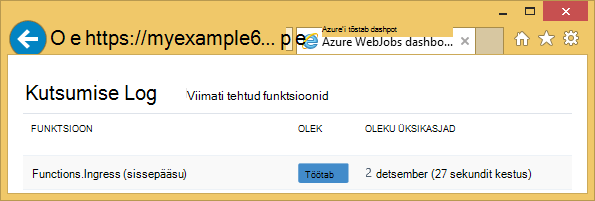
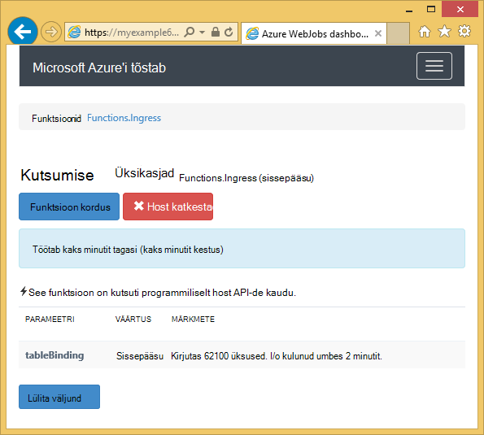
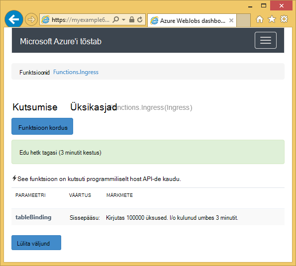

<properties 
    pageTitle="Kuidas kasutada WebJobs SDK Azure'i tabelimälu" 
    description="Saate teada, kuidas kasutada Azure'i tabelimälu WebJobs SDK. Tabelite loomine, tabelitele lisada üksused ja lugeda olemasolevaid tabeleid." 
    services="app-service\web, storage" 
    documentationCenter=".net" 
    authors="tdykstra" 
    manager="wpickett" 
    editor="jimbe"/>

<tags 
    ms.service="app-service-web" 
    ms.workload="web" 
    ms.tgt_pltfrm="na" 
    ms.devlang="dotnet" 
    ms.topic="article" 
    ms.date="06/01/2016" 
    ms.author="tdykstra"/>

# Kuidas kasutada WebJobs SDK Azure'i tabelimälu

## Ülevaade

Selles juhendis antakse C# koodi näidised, mis näitab, kuidas lugeda ja kirjutada, kasutades [WebJobs SDK](websites-dotnet-webjobs-sdk.md) versioon Azure storage tabelite 1.x.

Juhend eeldab, et teate, [Kuidas luua WebJob projekti Visual Studios koos ühendusstringi, mis osutage salvestusruumi konto](websites-dotnet-webjobs-sdk-get-started.md) või [mitme salvestusruumi](https://github.com/Azure/azure-webjobs-sdk/blob/master/test/Microsoft.Azure.WebJobs.Host.EndToEndTests/MultipleStorageAccountsEndToEndTests.cs)kontod.
        
Mõned Koodilõigud Kuva kood on `Table` atribuuti funktsioone, mis pole [nimetatakse käsitsi](websites-dotnet-webjobs-sdk-storage-queues-how-to.md#manual), st, kasutades ühte järgmistest päästik atribuute. 

## Üksuste lisamine tabelisse

Üksuste lisamine tabelisse, kasutage soovitud `Table` atribuut koos mõne `ICollector<T>` või `IAsyncCollector<T>` parameetri kus `T` määrab skeemi üksused, mille soovite lisada. Atribuut ehitaja võtab päringustringi parameetri, mis määrab tabeli nimi. 

Järgmine kood näidis lisab `Person` üksuste nimega *sissepääsu*tabelisse.

        [NoAutomaticTrigger]
        public static void IngressDemo(
            [Table("Ingress")] ICollector<Person> tableBinding)
        {
            for (int i = 0; i < 100000; i++)
            {
                tableBinding.Add(
                    new Person() { 
                        PartitionKey = "Test", 
                        RowKey = i.ToString(), 
                        Name = "Name" }
                    );
            }
        }

Tavaliselt tüüp kasutamisel `ICollector` tuleneb `TableEntity` või rakendab `ITableEntity`, kuid see ei pea. Ükskõik kumba järgmistest `Person` klassile töö koos eelmise näidatud koodi `Ingress` meetod.

        public class Person : TableEntity
        {
            public string Name { get; set; }
        }

        public class Person
        {
            public string PartitionKey { get; set; }
            public string RowKey { get; set; }
            public string Name { get; set; }
        }

Kui soovite töötada Azure storage API, saate lisada mõne `CloudStorageAccount` meetod allkirja-parameeter.

## Reaalajas jälgimine

Kuna sissepääsu andmefunktsioonid töötlemine sageli suuri andmemahtusid, pakub WebJobs SDK armatuurlaua reaalajas jälgimisega seotud andmed. Jaotise **Kutsumise Log** ütleb, kui funktsioon töötab endiselt.

**Kutsumise üksikasjade** lehe aruannete funktsiooni edenemist (kirjutada üksuste arv) Kuigi see töötab ja pakub teile võimalust katkestada seda. 

Kui funktsioon lõpetab, **Kutsumise üksikasjade** lehe aruannete kirjutada ridade arv.

## Kuidas lugeda mitme üksuste tabelist

Tabeli lugemiseks kasutada funktsiooni `Table` atribuut koos mõne `IQueryable<T>` parameeter kus tippige `T` tuleneb `TableEntity` või rakendab `ITableEntity`.

Järgmine kood näidis loeb ja logib kõigist ridadest on `Ingress` tabeli:
 
        public static void ReadTable(
            [Table("Ingress")] IQueryable<Person> tableBinding,
            TextWriter logger)
        {
            var query = from p in tableBinding select p;
            foreach (Person person in query)
            {
                logger.WriteLine("PK:{0}, RK:{1}, Name:{2}", 
                    person.PartitionKey, person.RowKey, person.Name);
            }
        }

### Kuidas lugeda ühe üksuse tabelist

On mõne `Table` atribuut konstruktorit kaks täiendavaid parameetreid, mis võimaldavad teil määrata partition klahvi ja klahvi rea, kui soovite siduda ühe tabeli üksusele.

Järgmine kood näidis loeb tabelirea jaoks soovitud `Person` üksuse põhjal sektsiooni võti ja rea väärtused järjekorra meilisõnumi:  

        public static void ReadTableEntity(
            [QueueTrigger("inputqueue")] Person personInQueue,
            [Table("persontable","{PartitionKey}", "{RowKey}")] Person personInTable,
            TextWriter logger)
        {
            if (personInTable == null)
            {
                logger.WriteLine("Person not found: PK:{0}, RK:{1}",
                        personInQueue.PartitionKey, personInQueue.RowKey);
            }
            else
            {
                logger.WriteLine("Person found: PK:{0}, RK:{1}, Name:{2}",
                        personInTable.PartitionKey, personInTable.RowKey, personInTable.Name);
            }
        }

Funktsiooni `Person` klassi selles näites ei ole kasutusele `ITableEntity`.

## Kuidas kasutada .NET salvestusruumi API otse tabeli töötamine

Saate kasutada ka funktsiooni `Table` koos atribuut on `CloudTable` objekti suurema paindlikkuse tagamiseks tabeli töötamine.

Järgmine kood näide kasutab mõnda `CloudTable` objekti *sissepääsu* tabelisse lisada ühe üksuse. 
 
        public static void UseStorageAPI(
            [Table("Ingress")] CloudTable tableBinding,
            TextWriter logger)
        {
            var person = new Person()
                {
                    PartitionKey = "Test",
                    RowKey = "100",
                    Name = "Name"
                };
            TableOperation insertOperation = TableOperation.Insert(person);
            tableBinding.Execute(insertOperation);
        }

Lisateavet selle kohta, kuidas kasutada funktsiooni `CloudTable` objekti, siis vaadake, [Kuidas kasutada Tabelimälu .net-i kaudu](../storage/storage-dotnet-how-to-use-tables.md). 

## Seotud teemad järjekorrad juhise järgi

Lisateavet reageerimine tabeli töötlemine vallandanud järjekorda sõnumi või WebJobs SDK stsenaariumid, pole teatud tabeli töötlemine leiate [Azure'i järjekorda salvestusruumi WebJobs SDK kasutamise kohta](websites-dotnet-webjobs-sdk-storage-queues-how-to.md). 

Selle artikli teemad on järgmised:

* Asünkroonse funktsioonid
* Mitmes eksemplaris
* Graatsiline sulgemine
* Kasutage funktsiooni kehas WebJobs SDK atribuudid
* Ühendusstringi SDK-koodi määramine
* Määrata väärtused WebJobs SDK ehitaja parameetrite kood
* Funktsiooni käsitsi käivitamine
* Logide kirjutamine

## Järgmised sammud

Sellest juhendist on andnud koodinäiteid kuvavate reageerimine tavastsenaariumid Azure tabelitega töötamine. Azure'i WebJobs ja WebJobs SDK kasutamise kohta leiate lisateavet teemast [Azure WebJobs Soovitatavad ressursid](http://go.microsoft.com/fwlink/?linkid=390226).
 
