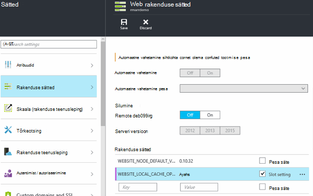

<properties
   pageTitle="Azure'i rakenduse teenuse kohaliku vahemälu ülevaade | Microsoft Azure'i"
   description="Selles artiklis kirjeldatakse, kuidas lubada, suurust ja päringu funktsiooni Azure'i rakenduse kohaliku vahemälu teenuse olek"
   services="app-service"
   documentationCenter="app-service"
   authors="SyntaxC4"
   manager="yochayk"
   editor=""
   tags="optional"
   keywords=""/>

<tags
   ms.service="app-service"
   ms.devlang="multiple"
   ms.topic="article"
   ms.tgt_pltfrm="na"
   ms.workload="na"
   ms.date="03/04/2016"
   ms.author="cfowler"/>

# <a name="azure-app-service-local-cache-overview"></a>Azure'i rakenduse teenuse kohaliku vahemälu ülevaade

Azure'i web appi sisu on talletatud Azure Storage ja on uurinud üles püsival selliselt, nagu sisu ühiskasutus. See kujundus on mõeldud rakenduste mitmesuguseid töötamise ja sisaldab järgmisi atribuute:  

* Sisu jagatakse veebirakenduse mitu eksemplari virtuaalse masina (VM).
* Sisu on püsival ja veebirakenduste abil muuta.
* Logifailide ja Diagnostikaandmete failid on saadaval jaotises sama ühiskausta sisu.
* Uue sisu avaldamise otse värskendab sisu kausta. Saate kohe vaadata sama sisu SCM veebisaidi ja käivitatud web appi kaudu (tavaliselt mõningaid tehnoloogiaid, nt ASP.net-i algatada web appi uuesti tegema mõned muudatused faili uusima sisu).

Kuigi palju veebirakenduste kasutada ühte või kõiki neid funktsioone, on vaja mõned veebirakenduste ainult suure jõudlusega, kirjutuskaitstud sisu poe, mis ta saab käivitada kõrge kättesaadavus. Need rakendused saavad VM eksemplari teatud kohaliku vahemälu.

Azure'i rakenduse teenuse kohaliku vahemälu funktsioon pakub veebivaate rolli sisu. Selle sisu on oma salvestusruumi sisu, mis on loodud asünkroonselt saidi käivitamisel vahemälu kirjutamine, kuid ja tühistamiseks nuppu Hülga. Kui vahemälu on valmis, lülitatakse saidi vastuolus vahemällu talletatud sisu. Veebirakenduste, mis töötavad kohaliku vahemälu on järgmised eelised:

* Need on latentsused toimuvate sisu Azure Storage juurdepääsemisel immuunne.
* Need on immuunne kavandatud täienduste või planeerimata seisakutest ja muude katkestuste Azure Storage, mis ilmnevad serverites, et sisu ühiskasutus.
* Neil on vähem rakenduse taaskäivitamist muudatustel salvestusruumi ühiskasutus.

## <a name="how-local-cache-changes-the-behavior-of-app-service"></a>Kuidas muudab kohaliku vahemälu teenuse rakendus

* Kohaliku vahemälu on web appi kaustade /site ja /siteextensions. See on loodud VM kohaliku eksemplari web app käivitamisel. Kohaliku vahemälu kohta veebirakenduse suurus võib olla kuni 300 MB vaikimisi, kuid võite seda suurendada kuni 1 GB.
* Kohaliku vahemälu on lugemis-ja kirjutamisõigusega. Kõik muudatused hüljatakse veebirakenduse viib virtuaalmasinates või saab uuesti käivitada. Ärge kasutage kohaliku vahemälu rakendusi, mis olulise andmete talletamiseks sisu pood.
* Kirjutage logifailid ning Diagnostikaandmete, nagu need praegu veebirakenduste edasi. Logifailide ja andmed, aga on talletatud kohalik VM. Seejärel kopeerimist üle perioodiliselt ühiskasutusse antud sisu pood. Kopeeri ühiskasutusse antud sisu pood on muutujatel--kirjutamine toetab kaduda tähtaja ootamatu krahhi VM astme.
* Muutub LogFiles ja andmete kaustade web apps, mis kasutavad kohaliku vahemälu kausta struktuuri. Salvestusruumi LogFiles ja andmete kaustad, mis järgivad nime "kordumatut tunnust" + ajatempel on nüüd alamkaustad. Kõik alamkaustad vastavad VM eksemplari, kus veebirakenduse töötab ja on käivitamine.  
* Avaldamise muudatuste web appi kaudu avaldamise menetlustele avaldab ühiskasutusse antud sisu pood. See on kujundus, kuna soovime püsival olema avaldatud sisu. Veebirakenduse kohaliku vahemälu värskendamine, tuleb taaskäivitada. Kas see on liigne lisatoiming tunduda? Elutsükli sujuvalt, vaadake selle artikli teave.
* Kohaliku vahemälu osutab D:\Home. D:\Local kasutab ka edaspidi osutab ajutine VM teatud salvestusruumi.
* SCM saidi sisu vaikevaade on jätkuvalt mis ühiskasutusse antud sisu pood.

## <a name="enable-local-cache-in-app-service"></a>Kohaliku vahemälu rakenduse teenuses lubamine

Konfigureerige kohaliku vahemälu kombinatsiooni reserveeritud rakenduse sätete abil. Saate konfigureerida rakenduse sätete abil järgmistest meetoditest.

* [Azure'i portaal](#Configure-Local-Cache-Portal)
* [Azure'i ressursihaldur](#Configure-Local-Cache-ARM)

### <a name="configure-local-cache-by-using-the-azure-portal"></a>Kohaliku vahemälu Azure portaali kaudu konfigureerimine
<a name="Configure-Local-Cache-Portal"></a>

Lubate kohaliku vahemälu kohta web appi alus selle sätte rakenduse abil:`WEBSITE_LOCAL_CACHE_OPTION` = `Always`  



### <a name="configure-local-cache-by-using-azure-resource-manager"></a>Kohaliku vahemälu, kasutades Azure ressursihaldur konfigureerimine
<a name="Configure-Local-Cache-ARM"></a>

```
...

{
    "apiVersion": "2015-08-01",
    "type": "config",
    "name": "appsettings",
    "dependsOn": [
        "[resourceId('Microsoft.Web/sites/', variables('siteName'))]"
    ],
    "properties": {
        "WEBSITE_LOCAL_CACHE_OPTION": "Always",
        "WEBSITE_LOCAL_CACHE_SIZEINMB": "300"
    }
}

...
```

## <a name="change-the-size-setting-in-local-cache"></a>Kohaliku vahemälu suurus soovitud sätet muuta.

Kohaliku vahemälu maht on vaikimisi **300 MB**. See hõlmab soovitud /site ja /siteextensions kaustad, mis on kopeeritud sisu poe kui ka kohalik loodud logide ja andmete kaustad. Selle piirmäära suurendamiseks kasutage rakenduse säte `WEBSITE_LOCAL_CACHE_SIZEINMB`. Te saate suurendada kuni **1 GB** (1000 MB) web appi kohta.

## <a name="best-practices-for-using-app-service-local-cache"></a>Rakenduse teenuse kohaliku vahemälu kasutamise head tavad

Soovitame kasutada funktsiooni [Lavastus keskkonnas](../app-service-web/web-sites-staged-publishing.md) koos kohaliku vahemälu.

* _Sticky_ säte rakenduse lisamine `WEBSITE_LOCAL_CACHE_OPTION` väärtusega `Always` oma **tootmise** pesa. Kui kasutate `WEBSITE_LOCAL_CACHE_SIZEINMB`, lisada ka oma tootmise pesa sticky sätteks.
* **Lavastus** pesa luua ja avaldada oma lavastus pesa. Saate kasutada kohaliku vahemälu võimaldavad sujuvalt Koosta juurutamine test elutsükli jaoks kohaliku vahemälu eelised teenuskomplekti tootmise pesa vahekausta pesa tavaliselt ei määrata.
*   Testige oma saidi oma lavastus pesa suhtes.  
*   Kui olete valmis, välja [teostatud](../app-service-web/web-sites-staged-publishing.md#to-swap-deployment-slots) oma lavastus ja tootmise teenindusaegade vahel.  
*   Sticky sätted sisaldavad nime ja sticky pesa. Nii kui lavastus pesa saab vahetatud tootmisse, see pärivad kohaliku vahemälu rakenduse sätted. Äsja vahetasid tootmise pesa vastuolus kohaliku vahemälu mõne minuti pärast ja kuvatakse soojendada pesa warmup osana pärast vahetamine. Nii kui pesa vahetamine on lõpule jõudnud, teie tootmise pesa töötab kohaliku vahemälu suhtes.

## <a name="frequently-asked-questions-faq"></a>Korduma kippuvad küsimused (KKK)

### <a name="how-can-i-tell-if-local-cache-applies-to-my-web-app"></a>Kuidas kindlaks teha, kui kohaliku vahemälu kehtib minu web appi?

Kui oma veebirakenduse vajab suure jõudlusega, usaldusväärseid sisu poe, ei kasuta sisu poe käitusajal kriitiliste andmete kirjutamiseks ja on väiksem kui 1 GB kokku suurus, seejärel vastus on "Jah"! Suuruse kaustade /site ja /siteextensions saamiseks kasutage saidi laiend "Azure Web Apps ketta kasutamine".  

### <a name="how-can-i-tell-if-my-site-has-switched-to-using-local-cache"></a>Kuidas kindlaks teha, kui minu sait on kohaliku vahemälu abil vahetada?

Kui kasutate funktsiooni kohaliku vahemälu lavastus keskkonnas, Vaheta toimingut ei lõpule kuni kohaliku vahemälu ihne. Märkige ruut, kui teie sait töötab kohaliku vahemälu vastu, saate kontrollida töötaja protsessi keskkonna muutuja `WEBSITE_LOCALCACHE_READY`. Kasutage juhiseid lehel [töötaja protsessi muutuja](https://github.com/projectkudu/kudu/wiki/Process-Threads-list-and-minidump-gcdump-diagsession#process-environment-variable) juurdepääsu töötaja protsessi keskkonna muutuja mitmes eksemplaris.  

### <a name="i-just-published-new-changes-but-my-web-app-does-not-seem-to-have-them-why"></a>Ma just avaldatud muudatusi, kuid minu web app ei tundu võtma. Miks?

Kui oma veebirakenduse kasutab kohaliku vahemälu, siis peate oma saidile viimaste muudatuste saada taaskäivitama. Ei soovi tootmiskohaga muudatused avaldada? Vt eelmise heade tavade jaotisest pesa suvandid.

### <a name="where-are-my-logs"></a>Kus on mu logid?

Kohaliku vahemälu, kus teie logid ja andmete kaustade vaadata pisut teistsugused. Siiski struktuuri oma alamkaustu jääb samaks, välja arvatud, et alamkaustad on asudes jaotises Vorming "VM ainuidentifikaator" + ajatempel alamkausta.

### <a name="i-have-local-cache-enabled-but-my-web-app-still-gets-restarted-why-is-that-i-thought-local-cache-helped-with-frequent-app-restarts"></a>Mul on lubatud kohaliku vahemälu, kuid minu web appi endiselt taaskäivitada. Miks see on? Mõtlesin kohaliku vahemälu aitas sagedased rakenduse taaskäivitamist.

Kohaliku vahemälu vältida salvestusruumi seotud web appi taaskäivitamist. Siiski võib oma veebirakenduse endiselt analüüsida taaskäivitamist kavandatud taristu uuendamine VM. Üldine rakenduse taaskäivitamist ilmneda koos kohaliku vahemälu lubatud peaks olema vähem.
