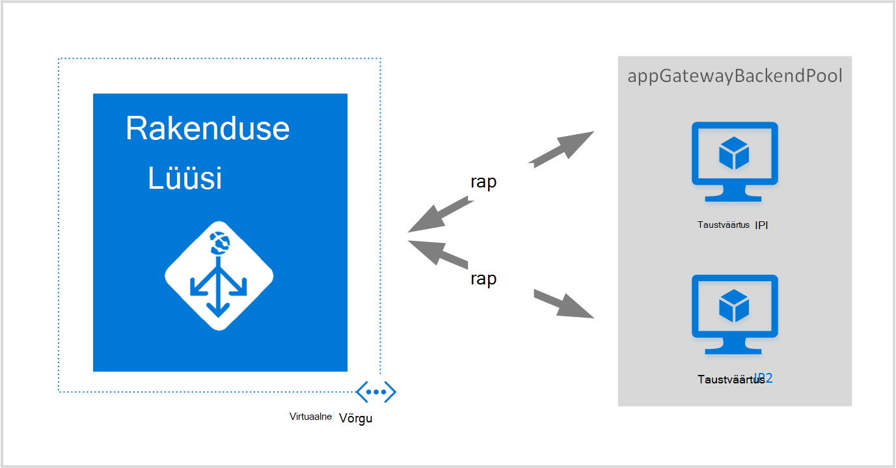
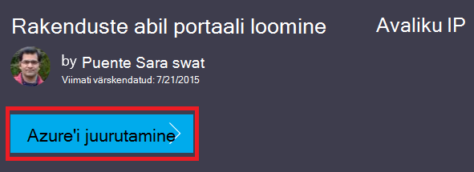
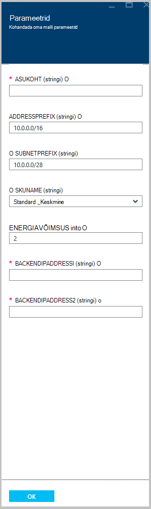

<properties
   pageTitle="Rakenduste portaali loomine Azure ressursihaldur mallide abil | Microsoft Azure'i"
   description="Sellelt lehelt leiate juhiseid, et luua Azure rakenduste portaali Azure'i ressursihaldur malli abil"
   documentationCenter="na"
   services="application-gateway"
   authors="georgewallace"
   manager="carmonm"
   editor="tysonn"/>
<tags
   ms.service="application-gateway"
   ms.devlang="na"
   ms.topic="article"
   ms.tgt_pltfrm="na"
   ms.workload="infrastructure-services"
   ms.date="10/25/2016"
   ms.author="gwallace"/>

# Rakenduste portaali loomine Azure ressursihaldur malli abil

> [AZURE.SELECTOR]
- [Azure'i portaal](application-gateway-create-gateway-portal.md)
- [Azure'i ressursihaldur PowerShelli](application-gateway-create-gateway-arm.md)
- [Azure'i klassikaline PowerShelli](application-gateway-create-gateway.md)
- [Azure'i ressursihaldur Mall](application-gateway-create-gateway-arm-template.md)
- [Azure'i CLI](application-gateway-create-gateway-cli.md)

Azure'i rakenduse lüüs on kiht-7 laadi koormusetasakaalustusteenuse. Kas nad on kohapealse ja pilveteenuse pakub Tõrkesiirde jõudlus marsruutimine HTTP päringuid serveritest, vahel. Rakenduse lüüsi pakub paljusid rakenduse kohaletoimetamise kontrolleril (ADC) funktsioonid, sh HTTP koormusetasakaalustuseks, seansi küpsise vastavalt osaleja, turvasoklite kiht (SSL) offload, kohandatud seisund sondid, mitme saidi tugi ja paljud teised. Toetatud funktsioonide täieliku loendi saamiseks külastage [Rakenduse lüüsi ülevaade](application-gateway-introduction.md)

Saate teada, kuidas alla laadida ja muuta olemasoleva Azure'i ressursihaldur malli põhjal GitHub ja malli GitHub, PowerShelli ja Azure CLI kaudu.

Kui juurutate lihtsalt Azure'i ressursihaldur malli otse GitHub muutmata, jätkake juurutamine GitHub malli.

## Stsenaarium

Selle stsenaariumi siis:

- Looge kaks versiooni rakenduste portaali.
- Luua nimega VirtualNetwork1 koos reserveeritud CIDR plokk 10.0.0.0/16 virtuaalse võrgu.
- Looge alamvõrku, mis on nimega Appgatewaysubnet, mis kasutab 10.0.0.0/28 oma CIDR plokk.
- Kaks häälestamine eelnevalt konfigureeritud tagaandmebaas IP-d soovite laadida saldo web serverid liiklus. Selles näites malli tagaandmebaas IP-d on 10.0.1.10 ja 10.0.1.11.

>[AZURE.NOTE] Selle malli parameetrid on need sätted. Malli kohandamiseks saate muuta reegleid, kuulajale ja SSL-i, mis avab selle azuredeploy.json.

## Laadige alla ja Azure ressursihaldur malli mõistmine

Saate alla laadida olemasoleva Azure'i ressursihaldur malli loomine virtuaalse võrgu ja kahe alamvõrku GitHub, tehke soovitud muudatused, võite soovi ja uuesti kasutada. Selleks tehke järgmist:

1. Liikuge [rakenduste portaali loomine](https://github.com/Azure/azure-quickstart-templates/tree/master/101-application-gateway-create).
2. Klõpsake **azuredeploy.json**ja seejärel käsku **RAW**.
3. Salvestage fail kohalikus kaustas teie arvutis.
4. Kui olete tuttav Azure'i ressursihaldur Mallid, jätkake juhisega 7.
5. Avage fail, mille salvestasite ja vaadake jaotises 5 **parameetrite** sisu. Kohatäite ette Azure'i ressursihaldur malli parameetrite väärtused, mida saate täita käigus juurutamist.

  	| Parameetri | Kirjeldus |
  	|---|---|
  	| **asukoht** | Kus luuakse rakenduse lüüsi Azure piirkond |
  	| **VirtualNetwork1** | Uue virtuaalse võrgu nimi |
  	| **addressPrefix** | Aadressiruumi on virtuaalse võrgu CIDR vormingus |
  	| **ApplicationGatewaysubnet** | Rakenduse lüüsi alamvõrgu nimi |
  	| **subnetPrefix** | Rakenduse lüüsi alamvõrgu jaoks CIDR blokeerimine |
  	| **skuname** | SKU eksemplari suurus |
  	| **võimsus** | Eksemplaride arv |
  	| **backendaddress1** | Esimene veebiserver IP-aadress |
  	| **backendaddress2** | Teine veebiserver IP-aadress |

    >[AZURE.IMPORTANT] Azure'i ressursihaldur Mallid säilitada GitHub saate aja jooksul muutuda. Veenduge, et mallis enne selle kasutamist kontrollida.

6. Märkige jaotises **ressursid** sisu ja pange tähele järgmist:

    - **Tüüp**. Ressursi on loodud malli tüüp. Sel juhul tüüp on **Microsoft.Network/applicationGateways**, mis tähistab rakenduste portaali.
    - **nimi**. Ressursi nimi. Pange tähele, **[parameters('applicationGatewayName')]**, mis tähendab, et nimi on esitatud sisendina teie või parameetri faili juurutamisel kasutamine.
    - **Atribuudid**. Ressursi atribuutide loendi. See mall kasutab virtuaalse võrgu- ja avaliku IP-aadressi rakenduse lüüsi loomise ajal.

7. Otsige üles [https://github.com/Azure/azure-quickstart-templates/blob/master/101-application-gateway-create/](https://github.com/Azure/azure-quickstart-templates/blob/master/101-application-gateway-create).
8. Klõpsake **azuredeploy-paremeters.json**ja klõpsake **RAW**.
9. Salvestage fail kohalikus kaustas teie arvutis.
10. Avage fail, mille salvestasite ja redigeerida parameetrite väärtused. Kasutage meie stsenaariumi kirjeldatud lüüsi rakenduse järgmised väärtused.

        {
        "$schema": "http://schema.management.azure.com/schemas/2015-01-01/deploymentParameters.json#",
        {
        "location" : {
        "value" : "West US"
        },
        "addressPrefix": {
        "value": "10.0.0.0/16"
        },
        "subnetPrefix": {
        "value": "10.0.0.0/24"
        },
        "skuName": {
        "value": "Standard_Small"
        },
        "capacity": {
        "value": 2
        },
        "backendIpAddress1": {
        "value": "10.0.1.10"
        },
        "backendIpAddress2": {
        "value": "10.0.1.11"
        }
        }

11. Salvestage fail. JSON valideerimine võrgutööriistad nagu [JSlint.com](http://www.jslint.com/)abil saate testida JSON Mall ja parameetri malli.

## Azure'i ressursihaldur malli PowerShelli abil

Kui te pole kunagi varem Azure PowerShelli, vaadake, [Kuidas installida ja konfigureerida Azure PowerShell](../powershell-install-configure.md) ja järgige juhiseid Azure'i sisse logida ja valige oma tellimuse.

### Samm 1

    Login-AzureRmAccount

### Samm 2

Kontrollige konto tellimused.

    Get-AzureRmSubscription

Teil palutakse autentimiseks mandaat.

### Samm 3

Valida Azure tellimuste kasutada.

    Select-AzureRmSubscription -Subscriptionid "GUID of subscription"

### Samm 4

Vajadusel Looge **Uus-AzureResourceGroup** cmdleti abil ressursirühma. Järgmises näites loote ressursirühma nimega AppgatewayRG Ida-USA asukohta.

    New-AzureRmResourceGroup -Name AppgatewayRG -Location "East US"

Käivitage **Uus-AzureRmResourceGroupDeployment** cmdlet-käsk uue virtuaalse võrgu juurutada, kasutades eelmises malli ja parameetri faile alla laadida ja muuta.

    New-AzureRmResourceGroupDeployment -Name TestAppgatewayDeployment -ResourceGroupName AppgatewayRG `
        -TemplateFile C:\ARM\azuredeploy.json -TemplateParameterFile C:\ARM\azuredeploy-parameters.json

## Azure'i ressursihaldur malli abil Azure'i CLI

Malli Azure'i ressursihaldur laadisite Azure'i CLI abil, järgige alltoodud juhiseid:

### Samm 1

Kui te pole kunagi varem Azure'i CLI, lugege teemat [installida ja konfigureerida Azure CLI](../xplat-cli-install.md) ja järgige selle kohani, kus saate valida oma Azure'i konto ja tellimus.

### Samm 2

Käsu **azure config režiimi** ressursihaldur lülitumine, nagu allpool näidatud.

    azure config mode arm

Siin on oodatud väljundi ülaltoodud käsk:

    info:   New mode is arm

### Samm 3

Vajadusel käsu **azure rühma loomine** luua uue ressursirühma, nagu allpool näidatud. Pange tähele käsu väljund. Pärast väljund selgitatakse kasutatud parameetrite loend. Ressursi rühmade kohta lisateabe saamiseks külastage [Azure'i ressursihaldur ülevaade](../azure-resource-manager/resource-group-overview.md).

    azure group create -n appgatewayRG -l eastus

**-n (või - nimi)**. Uue ressursirühma nimi. Meie stsenaariumi puhul on *appgatewayRG*.

**-l (või - asukoht)**. Azure'i piirkond, kus on loodud uue ressursirühma. Meie stsenaariumi puhul on *eastus*.

### Samm 4

Käivitage juurutada uue virtuaalse võrgu Mall ja parameetri failid alla laadida ning muudetud kohal cmdlet **juurutamise azure rühma loomine** . Pärast väljund selgitatakse kasutatud parameetrite loend.

    azure group deployment create -g appgatewayRG -n TestAppgatewayDeployment -f C:\ARM\azuredeploy.json -e C:\ARM\azuredeploy-parameters.json

## Azure'i ressursihaldur malli abil, klõpsake nuppu juurutamine

Klõpsake nuppu juurutamine on teine võimalus kasutada Azure ressursihaldur malle. See on lihtne viis Azure'i portaalis mallide kasutamise kohta.

### Samm 1

Minge [rakenduste avaliku IP portaali loomine](https://azure.microsoft.com/documentation/templates/101-application-gateway-public-ip/).

### Samm 2

Klõpsake **Azure juurutamine**.

### Samm 3

Täitke parameetrid juurutamise malli portaali ja klõpsake nuppu **OK**.

### Samm 4

**Juriidiline termineid** ja klõpsake nuppu **osta**.

### Juhis 5

Enne kohandatud juurutus, klõpsake nuppu **Loo**.

## Järgmised sammud

Kui soovite konfigureerida SSL offload, lugege teemat [konfigureerimine rakenduste portaali SSL offload](application-gateway-ssl.md).

Kui soovite rakenduste portaali kasutamiseks on sisemine laadi koormusetasakaalustusteenuse konfigureerimine, lugege teemat [rakenduste abil on sisemine laadi koormusetasakaalustusteenuse (ILB) portaali loomine](application-gateway-ilb.md).

Kui soovite lisateavet laadimine tasakaalustavad suvandid üldiselt, külastage:

- [Azure'i laadi koormusetasakaalustusteenuse](https://azure.microsoft.com/documentation/services/load-balancer/)
- [Azure'i liikluse haldur](https://azure.microsoft.com/documentation/services/traffic-manager/)
