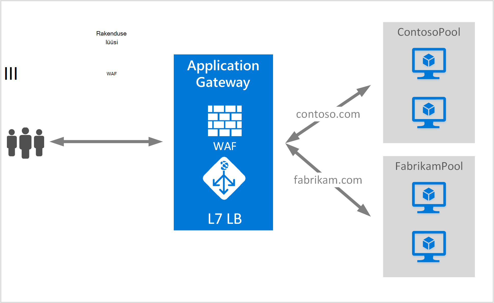

<properties
   pageTitle="Mitme saitide majutamiseks rakenduste portaali loomine | Microsoft Azure'i"
   description="Sellelt lehelt leiate juhiseid, et luua, Azure rakenduste portaali hosting mitme veebirakenduste sama lüüsi konfigureerimine."
   documentationCenter="na"
   services="application-gateway"
   authors="amsriva"
   manager="rossort"
   editor="amsriva"/>
<tags
   ms.service="application-gateway"
   ms.devlang="na"
   ms.topic="article"
   ms.tgt_pltfrm="na"
   ms.workload="infrastructure-services"
   ms.date="10/25/2016"
   ms.author="amsriva"/>

# Rakenduste portaali hosting mitme veebirakenduste loomine

> [AZURE.SELECTOR]
- [Azure'i portaal](application-gateway-create-multisite-portal.md)
- [Azure'i ressursihaldur PowerShelli](application-gateway-create-multisite-azureresourcemanager-powershell.md)

Mitme saidi hosting võimaldab teil rohkem kui üks veebirakenduse sama rakenduse lüüsi juurutamine. See tugineb hosti päise sissetulevate HTTP-päringu, kindlaks teha, millised kuulajale saaksid liikluse olemasolu. Kuulajale siis suunab liikluse vastav kirjutamata rakenduskausta konfigureeritud lüüsi määratluses reeglid. SSL-i lubatud veebirakendusi, sõltub rakenduse lüüsi serveri teave (SNI) laiendamiseks valige õige kuulajale web liikluse. Ühise kasutamise mitme saidi hosting on laadimiseks jaoks eri web domains eri tagaandmebaas server kaustu. Samuti võib mitme alamdomeenide sama juurdomeeni majutatud rakenduse samas lüüsis.

## Stsenaarium

Järgmises näites on rakenduse lüüsi serveeritakse liiklus contoso.com ja fabrikam.com kaks tagaandmebaas serveri kaustu: contoso serveri pool ja fabrikam serveri pool. Sarnane setup võib kasutada host alamdomeene nagu app.contoso.com ja blog.contoso.com.

## Enne alustamist

1. Installige uusim versioon Azure PowerShelli cmdletid Web platvormi Installeri abil. Saate alla laadida ja installida **Windows PowerShelli** jaotisest [allalaadimiste lehe](https://azure.microsoft.com/downloads/)uusima versiooni.
2. Serverid lisatakse tagaandmebaas rakenduskausta lüüsi rakenduse kasutamiseks peab olemas või nende lõpp-punktid loonud kas virtuaalse võrgu eraldi alamvõrgu või avaliku IP/VIP määratud.

## Nõuded

- **Tagaandmebaas serveri pool:** Tagaandmebaas serverite IP-aadresside loend. IP-aadresside loetletud kuuluma kas virtuaalse alamvõrku või tuleks avaliku IP/VIP. Saate kasutada ka FQDN.
- **Tagaandmebaas serverisätete pool:** Igal pool on sätted, nt portide, Protocol (protokoll) ja küpsise vastavalt osaleja. Need sätted on seotud on ja rakendatakse kõikides serverites maksimaalselt pool.
- **Ees port:** See port on avatud rakenduse lüüsi avaliku port. Liikluse tabab seda porti ja seejärel ümbersuunamist üks tagaandmebaas serverid.
- **Kuulajale:** Kuulajale on ees port, protokolli (Http- või Https need väärtused on tõstutundlik), ja SSL-i serdi nimi (kui offload SSL-i konfigureerimine). Mitme saidi lubatud rakenduse lüüside jaoks ka lisatakse hosti nimi ja SNI näidikuid.
- **Reegel:** Reegli seob kuulajale, tagaandmebaas serveri pool, ja millist tagaandmebaas serveri rakenduskausta liiklus tuleks suunata kui see tabab kindla kuulajale määratleb.

## Rakenduste portaali loomine

Järgnevalt on vaja luua rakenduste portaali juhiseid.

1. Looge ressursirühma ressursihaldur jaoks.
2. Virtuaalse võrk, alamvõrku ja avaliku IP rakenduse lüüsi loomine.
3. Looge rakenduse lüüsi konfigureerimise objekti.
4. Lüüsi ressurssi luua.

## Ressursihaldur jaoks ressursi rühma loomine

Veenduge, et kasutate Azure PowerShelli uusim versioon. Lisateavet on saadaval [Koos ressursihaldur Windows PowerShelli kasutamine](../powershell-azure-resource-manager.md).

### Samm 1

Azure'i sisse logida

    Login-AzureRmAccount

Teil palutakse autentimiseks mandaat.

### Samm 2

Kontrollige konto tellimused.

    Get-AzureRmSubscription

### Samm 3

Valida Azure tellimuste kasutada.

    Select-AzureRmSubscription -SubscriptionName "Name of subscription"

### Samm 4

Looge ressursirühma (Jäta see juhis, kui kasutate ressursside olemasolevasse rühma).

    New-AzureRmResourceGroup -Name appgw-RG -location "West US"

Teise võimalusena saate luua ka siltide jaoks rakenduse lüüsi ressursirühma:

    $resourceGroup = New-AzureRmResourceGroup -Name appgw-RG -Location "West US" -Tags @{Name = "testtag"; Value = "Application Gateway multiple site"}

Azure'i ressursihaldur nõuab kõigi asukoha määramiseks. Selle asukoha kasutatakse vaikeasukoha selle ressursi jaotises ressursid. Veenduge, et kõik käsud rakenduste portaali loomiseks kasutada ühte ressursirühma.

Ülaltoodud näites lõime ressursirühma nimega "appgw RG" asukoht "Lääne USA".

>[AZURE.NOTE] Kui teil on vaja konfigureerida kohandatud juures lüüsi rakenduse jaoks, vaadake teemat [loomine rakenduste portaali kohandatud sondid PowerShelli abil](application-gateway-create-probe-ps.md). [Kohandatud sondid ja seisundi jälgimine](application-gateway-probe-overview.md) lisateabe saamiseks külastage.

## Virtuaalse võrgu ja alamvõrku loomine

Järgmises näites kujutatakse luua virtuaalse võrgu ressursihaldur abil. Selles juhises loodud kaks alamvõrku. Esimese alamvõrgu on rakenduse lüüsi ise. Rakenduse lüüsi nõuab eraldi alamvõrgu hoida oma eksemplarid. Selle alamvõrgu saab kasutada ainult muude rakenduste lüüsid. Teine alamvõrgu kasutatakse pikalt rakenduse taustväärtus serverid.

### Samm 1

Määrata aadress vahemiku 10.0.0.0/24 alamvõrgu muutuja kasutada hoidke rakenduste portaali.

    $subnet = New-AzureRmVirtualNetworkSubnetConfig -Name appgatewaysubnet -AddressPrefix 10.0.0.0/24

### Samm 2

Määrata aadress vahemiku 10.0.1.0/24 subnet2 muutuja kasutatakse kirjutamata kaustu.

    $subnet2 = New-AzureRmVirtualNetworkSubnetConfig -Name backendsubnet -AddressPrefix 10.0.1.0/24

### Samm 3

Luua nimega "appgwvnet" ressursi rühma "appgw-rg" Lääne USA piirkonna 10.0.0.0/16 eesliite kasutamine alamvõrgu 10.0.0.0/24, virtuaalse võrgu ja 10.0.1.0/24.

    $vnet = New-AzureRmVirtualNetwork -Name appgwvnet -ResourceGroupName appgw-RG -Location "West US" -AddressPrefix 10.0.0.0/16 -Subnet $subnet,$subnet2

### Samm 4

Määrake alamvõrgu muutuja jaoks järgmised toimingud, mis loob rakenduste portaali.

    $appgatewaysubnet = Get-AzureRmVirtualNetworkSubnetConfig -Name appgatewaysubnet -VirtualNetwork $vnet
    $backendsubnet = Get-AzureRmVirtualNetworkSubnetConfig -Name backendsubnet -VirtualNetwork $vnet

## Luua avaliku IP-aadressi ees konfigureerimine

Saate luua avaliku IP ressursi "publicIP01" ressursi rühma "appgw-rg" Lääne USA regiooni jaoks.

    $publicip = New-AzureRmPublicIpAddress -ResourceGroupName appgw-RG -name publicIP01 -location "West US" -AllocationMethod Dynamic

IP-aadress on määratud rakenduse lüüsi teenuse käivitamisel.

## Saate luua rakenduse lüüsi konfigureerimine

Kõigi konfiguratsiooni üksuste peab häälestamine enne rakenduste portaali loomine. Järgmiste juhiste loomine konfiguratsiooni üksused, mida on vaja rakenduse lüüsi ressurss.

### Samm 1

Looge rakenduse gateway IP konfiguratsiooni nimega "gatewayIP01". Lüüsi rakenduse käivitamisel jätkab kaudu alamvõrku, mis on konfigureeritud IP-aadress ja IP-aadresside tagaandmebaas IP kogumi võrguliiklust marsruutida. Pidage meeles, et iga eksemplari võtab IP-aadress.

    $gipconfig = New-AzureRmApplicationGatewayIPConfiguration -Name gatewayIP01 -Subnet $appgatewaysubnet

### Samm 2

Konfigureerimine tagaandmebaas IP address pool nimega "pool01" ja "pool2" IP-aadressid koos "10.0.1.100, 10.0.1.101,10.0.1.102" "pool1" ja "10.0.1.103, 10.0.1.104, 10.0.1.105" "pool2" jaoks.

    $pool1 = New-AzureRmApplicationGatewayBackendAddressPool -Name pool01 -BackendIPAddresses 10.0.1.100, 10.0.1.101, 10.0.1.102
    $pool2 = New-AzureRmApplicationGatewayBackendAddressPool -Name pool02 -BackendIPAddresses 10.0.1.103, 10.0.1.104, 10.0.1.105

Selles näites on kaks tagaandmebaas rühmituse võrguliikluse nõutud saidi põhjal. Ühe kausta saab liiklust saidilt "contoso.com" ja muud rakenduskausta saab liiklust saidilt "fabrikam.com". Peate asendama eelmise IP-aadresside lisamiseks oma rakenduse IP address lõpp-punktid. Sisemise IP-aadresside asemel võib kasutada ka avaliku IP-aadressid, FQDN või mõne VM NIC taustväärtus eksemplaride. Kasuta "-BackendFQDNs" parameeter PowerShell määramiseks FQDN-i asemel IP-d.

### Samm 3

Rakenduse lüüsi sätte "poolsetting01" ja "poolsetting02" konfigureerimine tagaandmebaas rakenduskausta koormusetasakaalustusega võrguliiklust. Selles näites saate tagaandmebaas kaustu erinevate tagaandmebaas rakenduskausta sätete konfigureerimine. Iga tagaandmebaas kaust võib olla oma tagaandmebaas rakenduskausta säte.

    $poolSetting01 = New-AzureRmApplicationGatewayBackendHttpSettings -Name "besetting01" -Port 80 -Protocol Http -CookieBasedAffinity Disabled -RequestTimeout 120
    $poolSetting02 = New-AzureRmApplicationGatewayBackendHttpSettings -Name "besetting02" -Port 80 -Protocol Http -CookieBasedAffinity Enabled -RequestTimeout 240

### Samm 4

Konfigureerida ees IP avaliku IP lõpp-punkti.

    $fipconfig01 = New-AzureRmApplicationGatewayFrontendIPConfig -Name "frontend1" -PublicIPAddress $publicip

### Juhis 5

Rakenduste portaali ees port konfigureerimine.

    $fp01 = New-AzureRmApplicationGatewayFrontendPort -Name "fep01" -Port 443

### Juhist 6

Kahe SSL-sertide kahe veebilehed toetamiseks selles näites me konfigureerimine. Üks sert on contoso.com liikluse ja teine on fabrikam.com liikluse. Need serdid peaks olema antud serdid veebisaitide sertimisorgan. Iseallkirjastatud serdid on toetatud, kuid pole soovitatav tootmise liikluse.

    $cert01 = New-AzureRmApplicationGatewaySslCertificate -Name contosocert -CertificateFile <file path> -Password <password>
    $cert02 = New-AzureRmApplicationGatewaySslCertificate -Name fabrikamcert -CertificateFile <file path> -Password <password>

### Juhis 7

Selles näites kaks kuulajatele kaks veebilehtede jaoks konfigureerida. Selles etapis tuleb konfigureerib kuulajatele jaoks avaliku IP-aadress, portide ja host liiklust saama kasutada. Hostname (hostinimi) parameeter on vaja mitut saidile tugiteenuste ja seadma vastav veebisait, mille liiklus on saanud. RequireServerNameIndication parameeter on seatud tõene veebisaite, mida vajate abi SSL-i hosti mitme stsenaarium. SSL-i tugi on nõutav, peate ka liikluse veebirakenduse turvamiseks kasutatakse SSL-serdi määrata. FrontendIPConfiguration, FrontendPort ja hostname (hostinimi) kombinatsioon peab olema kordumatu on kuulajale. Iga kuulajale toetab üks sert.

    $listener01 = New-AzureRmApplicationGatewayHttpListener -Name "listener01" -Protocol Https -FrontendIPConfiguration $fipconfig01 -FrontendPort $fp01 -HostName "contoso11.com" -RequireServerNameIndication true  -SslCertificate $cert01
    $listener02 = New-AzureRmApplicationGatewayHttpListener -Name "listener02" -Protocol Https -FrontendIPConfiguration $fipconfig01 -FrontendPort $fp01 -HostName "fabrikam11.com" -RequireServerNameIndication true -SslCertificate $cert02

### Samm 8

Selles näites kahe reegli säte kaks veebirakenduste loomine Reegli seob koos album, kirjutamata kaustu ja http sätted. Selles etapis tuleb konfigureerib rakenduste lüüsi lihtsa marsruutimise reeglite, üks iga veebisaidi jaoks kasutada. Iga veebisaidi liikluse oma konfigureeritud kuulajale kätte ja siis suunatakse selle konfigureeritud taustväärtus pool, on BackendHttpSettings määratud atribuutide abil.

    $rule01 = New-AzureRmApplicationGatewayRequestRoutingRule -Name "rule01" -RuleType Basic -HttpListener $listener01 -BackendHttpSettings $poolSetting01 -BackendAddressPool $pool1
    $rule02 = New-AzureRmApplicationGatewayRequestRoutingRule -Name "rule02" -RuleType Basic -HttpListener $listener02 -BackendHttpSettings $poolSetting02 -BackendAddressPool $pool2

### Samm 9

Konfigureerida eksemplarid ja suurus rakenduse lüüsi arv.

    $sku = New-AzureRmApplicationGatewaySku -Name "Standard_Medium" -Tier Standard -Capacity 2

## Rakenduste portaali loomine

Kõigi objektide konfiguratsiooni eelmist toimingut rakenduste portaali loomine.

    $appgw = New-AzureRmApplicationGateway -Name appgwtest -ResourceGroupName appgw-RG -Location "West US" -BackendAddressPools $pool1,$pool2 -BackendHttpSettingsCollection $poolSetting01, $poolSetting02 -FrontendIpConfigurations $fipconfig01 -GatewayIpConfigurations $gipconfig -FrontendPorts $fp01 -HttpListeners $listener01, $listener02 -RequestRoutingRules $rule01, $rule02 -Sku $sku -SslCertificates $cert01, $cert02

>[AZURE.IMPORTANT] Rakenduse lüüsi ettevalmistamise on toiming ja võib võtta aega.

## Saada rakenduse lüüsi DNS-i nimi

Kui lüüsi on loodud, on järgmiseks esiosa side konfigureerimine. Avaliku IP kasutamisel nõuab rakenduse lüüsi dünaamiliselt DNS-i nimi, mis ei ole lubatud. Lõppkasutajad tabab rakenduse lüüsi CNAME-kirje tagamiseks saab rakenduse lüüsi avaliku lõpp-punkti. [Kohandatud domeeni nimi Azure konfigureerimine](../cloud-services/cloud-services-custom-domain-name-portal.md). Selleks saate tuua rakenduste portaali ja selle seotud IP/DNS-i nimi abil PublicIPAddress element, mis on seotud rakenduse lüüsi üksikasjad. CNAME-kirje, mis suunab selle DNS-i nimi kaks veebirakenduste loomiseks tuleks kasutada rakenduse lüüsi DNS-i nimi. A-kirjete kasutamine ei ole soovitatav, kuna VIP võivad muutuda taaskäivitamisel rakenduse lüüsi.
    
    Get-AzureRmPublicIpAddress -ResourceGroupName appgw-RG -Name publicIP01
        
    Name                     : publicIP01
    ResourceGroupName        : appgw-RG
    Location                 : westus
    Id                       : /subscriptions/<subscription_id>/resourceGroups/appgw-RG/providers/Microsoft.Network/publicIPAddresses/publicIP01
    Etag                     : W/"00000d5b-54ed-4907-bae8-99bd5766d0e5"
    ResourceGuid             : 00000000-0000-0000-0000-000000000000
    ProvisioningState        : Succeeded
    Tags                     : 
    PublicIpAllocationMethod : Dynamic
    IpAddress                : xx.xx.xxx.xx
    PublicIpAddressVersion   : IPv4
    IdleTimeoutInMinutes     : 4
    IpConfiguration          : {
                                 "Id": "/subscriptions/<subscription_id>/resourceGroups/appgw-RG/providers/Microsoft.Network/applicationGateways/appgwtest/frontendIP
                               Configurations/frontend1"
                               }
    DnsSettings              : {
                                 "Fqdn": "00000000-0000-xxxx-xxxx-xxxxxxxxxxxx.cloudapp.net"
                               }

## Järgmised sammud

Saate teada, kuidas kaitsta teie veebisaiti [rakenduse](application-gateway-webapplicationfirewall-overview.md) Gateway - Web rakenduse tulemüüri