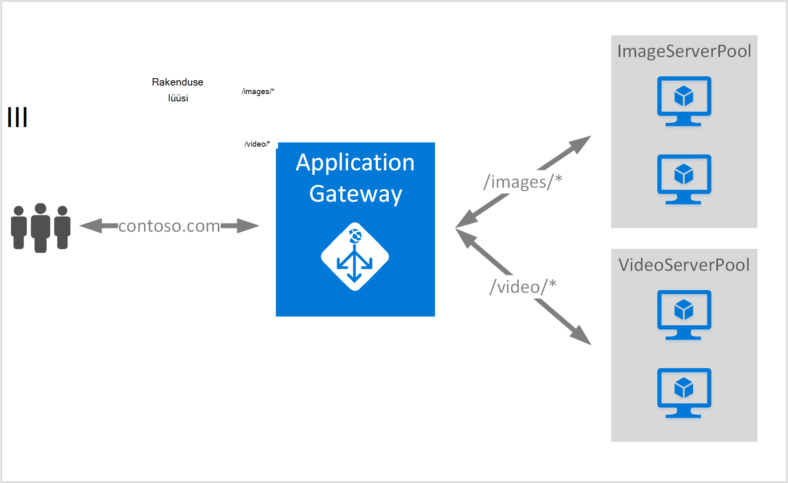

<properties
   pageTitle="URL-i marsruutimise reeglite kasutamine rakenduste portaali loomine | Microsoft Azure'i"
   description="Sellelt lehelt leiate juhiseid, et luua, konfigureerida Azure rakenduste portaali URL-i marsruutimise reeglite kasutamine"
   documentationCenter="na"
   services="application-gateway"
   authors="georgewallace"
   manager="jdial"
   editor="tysonn"/>
<tags
   ms.service="application-gateway"
   ms.devlang="na"
   ms.topic="article"
   ms.tgt_pltfrm="na"
   ms.workload="infrastructure-services"
   ms.date="10/25/2016"
   ms.author="gwallace"/>

# Rakenduste abil tee põhinev marsruutimine portaali loomine 

> [AZURE.SELECTOR]
- [Azure'i portaal](application-gateway-create-url-route-portal.md)
- [Azure'i ressursihaldur PowerShelli](application-gateway-create-url-route-arm-ps.md)

URL-i tee põhinev marsruutimine võimaldab seostada marsruudib URL-i tee Http-päringu põhjal. See kontrollib, kas marsruudi tagaandmebaas pool konfigureeritud rakenduste portaali URL-i loendite ja saata määratletud tagaandmebaas rakenduskausta võrguliiklust. Ühise kasutamise marsruutimiseks URL-i-põhine on laadimiseks eri sisutüüpide abil muu tagaandmebaas serveri kaustu.

Rakenduste portaali URL-i-põhine marsruutimine tutvustab uue reegli tüüp. Rakenduse lüüsi sisaldab kahte tüüpi toiminguid reeglit: lihtne ja PathBasedRouting. Põhilised reeglitüübi pakub round-jaan teenust Lisaks round jaan jaotuse ajal PathBasedRouting tagaandmebaas kaustu, arvestatakse ka taotluse URL-i tee mustri kirjutamata pool valimise ajal.

>[AZURE.IMPORTANT] PathPattern: Loendi tee mustrite vastavaks. Iga peab algama / ja ainult mõne "\*" on lubatud on lõpus. /Xyz, /xyz* või /xyz/*on lubatud. Ei sisalda stringi söötmiseks tee otsingul teksti pärast esimest "?" või "#" ja neid märke pole lubatud. 

## Stsenaarium
Järgmises näites on rakenduse lüüsi serveeritakse suunatakse contoso.com kaks tagaandmebaas serveri kaustu: video serveri pool ja pildi serveri pool.

Http://contoso.com/image* marsruuditakse pilt serveri pool (pool1) ja http://contoso.com/video* taotlused marsruuditakse video serveri pool (pool2). Vaikimisi serveri pool (pool1) on märgitud, kui ükski tee mustrite vasta.

## Enne alustamist

1. Installige uusim versioon Azure PowerShelli cmdletid Web platvormi Installeri abil. Saate alla laadida ja installida **Windows PowerShelli** jaotisest [allalaadimiste lehe](https://azure.microsoft.com/downloads/)uusima versiooni.
2. Rakenduse lüüsi jaoks luua virtuaalse võrgu ja alamvõrgu. Veenduge, et kasutate cloud kasutuselevõttu ega virtuaalmasinates alamvõrgu. Lüüsi rakendus peab olema ise virtuaalse alamvõrku.
3. Serverid lisatakse tagaandmebaas rakenduskausta lüüsi rakenduse kasutamiseks peab olemas või nende lõpp-punktid loonud kas virtuaalse võrgu või avaliku IP/VIP määratud.

## Mida on vaja luua rakenduste portaali?

- **Tagaandmebaas serveri pool:** Tagaandmebaas serverite IP-aadresside loend. IP-aadresside loetletud kuuluma kas virtuaalse alamvõrku või tuleks avaliku IP/VIP.
- **Tagaandmebaas serverisätete pool:** Igal pool on sätted, nt portide, Protocol (protokoll) ja küpsise vastavalt osaleja. Need sätted on seotud on ja rakendatakse kõikides serverites maksimaalselt pool.
- **Ees port:** See port on avatud rakenduse lüüsi avaliku port. Liikluse tabab seda porti ja seejärel ümbersuunamist üks tagaandmebaas serverid.
- **Kuulajale:** Kuulajale on ees port, protokolli (Http- või Https need tõstutundlik), ja SSL-i serdi nimi (kui offload SSL-i konfigureerimine).
- **Reegel:** Reegli seob kuulajale, tagaandmebaas server pargis ja määratleb, milliseid tagaandmebaas serveri rakenduskausta liiklus tuleks suunata kui see tabab kindla kuulajale.

## Rakenduste portaali loomine

Klassikaline Azure ja Azure ressursihaldur abil vahe on, kus saate luua rakenduse lüüsi ja üksused, mida tuleb konfigureerida.

Ressursi halduri kõik üksused, mis muudavad rakenduste portaali on konfigureeritud eraldi ja seejärel panete koostööd, et luua rakenduse lüüsi ressursi.

Siin on toimingud, mida on vaja rakenduste portaali loomine.

1. Looge ressursirühma ressursihaldur jaoks.
2. Luua virtuaalse võrgu, alamvõrgu ja avaliku IP rakenduse lüüsi.
3. Looge rakenduse lüüsi konfigureerimise objekti.
4. Lüüsi ressurssi luua.

## Ressursihaldur jaoks ressursi rühma loomine

Veenduge, et kasutate Azure PowerShelli uusim versioon. Lisateave on saadaval [Koos ressursihaldur Windows PowerShelli kasutamine](../powershell-azure-resource-manager.md).

### Samm 1

Azure'i sisse logida

    Login-AzureRmAccount

Teil palutakse autentimiseks mandaat. 

### Samm 2

Kontrollige konto tellimused.

    Get-AzureRmSubscription

### Samm 3

Valida Azure tellimuste kasutada.  

    Select-AzureRmSubscription -Subscriptionid "GUID of subscription"

### Samm 4

Looge ressursirühma (Jäta see juhis, kui kasutate ressursside olemasolevasse rühma).

    New-AzureRmResourceGroup -Name appgw-RG -Location "West US"

Teise võimalusena saate luua ka siltide jaoks rakenduse lüüsi ressursirühma:
    
    $resourceGroup = New-AzureRmResourceGroup -Name appgw-RG -Location "West US" -Tags @{Name = "testtag"; Value = "Application Gateway URL routing"} 

Azure'i ressursihaldur nõuab kõigi asukoha määramiseks. Seda kasutatakse vaikeasukohaks selle ressursi jaotises ressursid. Veenduge, et kõik käsud rakenduste portaali loomiseks kasutada sama ressursirühma.

Ülaltoodud näites lõime ressursirühma nimega "appgw RG" ja asukoht "Lääne meie".

>[AZURE.NOTE] Kui teil on vaja konfigureerida kohandatud juures lüüsi rakenduse jaoks, vaadake teemat [loomine rakenduste portaali kohandatud sondid PowerShelli abil](application-gateway-create-probe-ps.md). Tutvuge [kohandatud sondid ja seisundi jälgimine](application-gateway-probe-overview.md) lisateabe saamiseks.

## Virtuaalse võrgu ja alamvõrgu, lüüsi rakenduse loomine

Järgmises näites kujutatakse luua virtuaalse võrgu ressursihaldur abil.

### Samm 1

Määrata aadress vahemiku 10.0.0.0/24 alamvõrgu muutuja virtuaalse võrgu loomiseks kasutada.

    $subnet = New-AzureRmVirtualNetworkSubnetConfig -Name subnet01 -AddressPrefix 10.0.0.0/24

### Samm 2

Luua virtuaalse võrgu nimega "appgwvnet" ressursi rühma "appgw-rg" 10.0.0.0/16 eesliite kasutamine alamvõrgu 10.0.0.0/24 Lääne USA regiooni jaoks.

    $vnet = New-AzureRmVirtualNetwork -Name appgwvnet -ResourceGroupName appgw-RG -Location "West US" -AddressPrefix 10.0.0.0/16 -Subnet $subnet

### Samm 3

Määrake alamvõrgu muutuja jaoks järgmised toimingud, mis loob rakenduste portaali.

    $subnet=$vnet.Subnets[0]

## Luua avaliku IP-aadressi ees konfigureerimine

Saate luua avaliku IP ressursi "publicIP01" ressursi rühma "appgw-rg" Lääne USA regiooni jaoks.

    $publicip = New-AzureRmPublicIpAddress -ResourceGroupName appgw-RG -name publicIP01 -location "West US" -AllocationMethod Dynamic

IP-aadress on määratud rakenduse lüüsi teenuse käivitamisel.

## Saate luua rakenduse lüüsi konfigureerimine

Kõigi konfiguratsiooni üksuste luuakse enne rakenduste portaali loomine. Järgmiste juhiste loomine konfiguratsiooni üksused, mida on vaja rakenduse lüüsi ressurss.

### Samm 1

Looge rakenduse gateway IP konfiguratsiooni nimega "gatewayIP01". Lüüsi rakenduse käivitamisel jätkab kaudu alamvõrku, mis on konfigureeritud IP-aadress ja IP-aadresside tagaandmebaas IP kogumi võrguliiklust marsruutida. Pidage meeles, et iga eksemplari võtab IP-aadress.

    $gipconfig = New-AzureRmApplicationGatewayIPConfiguration -Name gatewayIP01 -Subnet $subnet

### Samm 2

Konfigureerimine tagaandmebaas IP address rakenduskausta nimega "pool01" ja "pool2" IP-aadressid koos "134.170.185.46, 134.170.188.221,134.170.185.50" jaoks "pool1" ja "134.170.186.46, 134.170.189.221,134.170.186.50" "pool2" jaoks.

    $pool1 = New-AzureRmApplicationGatewayBackendAddressPool -Name pool01 -BackendIPAddresses 134.170.185.46, 134.170.188.221,134.170.185.50

    $pool2 = New-AzureRmApplicationGatewayBackendAddressPool -Name pool02 -BackendIPAddresses 134.170.186.46, 134.170.189.221,134.170.186.50

Selles näites on kaks tagaandmebaas rühmituse võrguliikluse põhjal URL-tee. Ühe kausta saab liikluse URL-tee "/ video" ja muud kausta tee liikluse saadud "/ pilt". Asendage eelnev IP-aadresside lisamiseks oma rakenduse IP address lõpp-punktid. 

### Samm 3

Rakenduse lüüsi sätte "poolsetting01" ja "poolsetting02" konfigureerimine tagaandmebaas rakenduskausta koormusetasakaalustusega võrguliiklust. Selles näites saate tagaandmebaas kaustu erinevate tagaandmebaas rakenduskausta sätete konfigureerimine. Iga tagaandmebaas kaust võib olla oma tagaandmebaas rakenduskausta säte.

    $poolSetting01 = New-AzureRmApplicationGatewayBackendHttpSettings -Name "besetting01" -Port 80 -Protocol Http -CookieBasedAffinity Disabled -RequestTimeout 120

    $poolSetting02 = New-AzureRmApplicationGatewayBackendHttpSettings -Name "besetting02" -Port 80 -Protocol Http -CookieBasedAffinity Enabled -RequestTimeout 240

### Samm 4

Konfigureerida ees IP avaliku IP lõpp-punkti.

    $fipconfig01 = New-AzureRmApplicationGatewayFrontendIPConfig -Name "frontend1" -PublicIPAddress $publicip

### Juhis 5 

Rakenduste portaali ees port konfigureerimine.

    $fp01 = New-AzureRmApplicationGatewayFrontendPort -Name "fep01" -Port 80
### Juhist 6

Konfigureerige kuulajale. Selles etapis tuleb konfigureerib kuulajale avaliku IP-aadress ja port, mida kasutatakse vastuvõtmiseks sissetulevat võrguliiklust. 
 
    $listener = New-AzureRmApplicationGatewayHttpListener -Name "listener01" -Protocol Http -FrontendIPConfiguration $fipconfig01 -FrontendPort $fp01

### Juhis 7 

Konfigureerige URL-i reegli teed tagaandmebaas kaustu. Selles etapis tuleb konfigureerib kasutatavaid rakenduste portaali URL-tee ja millised tagaandmebaas rakenduskausta on määratud käsitlema sissetulevaid liikluse kaardistamine määratlemiseks suhteline tee.

Järgmises näites luuakse kaks reegleid: üks "/ pildi /" tee marsruutimise liikluse tagaandmebaas "pool1" ja "/ video /" tee marsruutimise liikluse tagaandmebaas "pool2" teine.
    
    $imagePathRule = New-AzureRmApplicationGatewayPathRuleConfig -Name "pathrule1" -Paths "/image/*" -BackendAddressPool $pool1 -BackendHttpSettings $poolSetting01

    $videoPathRule = New-AzureRmApplicationGatewayPathRuleConfig -Name "pathrule2" -Paths "/video/*" -BackendAddressPool $pool2 -BackendHttpSettings $poolSetting02

Reegli tee kaart konfiguratsiooni konfigureerib ka vaikimisi tagaandmebaas aadress pool kui tee ei sobi ühegi eelmääratletud tee reegleid. 

    $urlPathMap = New-AzureRmApplicationGatewayUrlPathMapConfig -Name "urlpathmap" -PathRules $videoPathRule, $imagePathRule -DefaultBackendAddressPool $pool1 -DefaultBackendHttpSettings $poolSetting02

### Samm 8

Looge reegel säte. Selles etapis tuleb konfigureerib rakenduse lüüs kasutama URL-i tee põhinev marsruutimist.

    $rule01 = New-AzureRmApplicationGatewayRequestRoutingRule -Name "rule1" -RuleType PathBasedRouting -HttpListener $listener -UrlPathMap $urlPathMap

### Samm 9

Konfigureerida eksemplarid ja suurus rakenduse lüüsi arv.

    $sku = New-AzureRmApplicationGatewaySku -Name "Standard_Small" -Tier Standard -Capacity 2

## Rakenduste portaali loomine

Kõigi objektide konfiguratsiooni eelmist toimingut rakenduste portaali loomine.

    $appgw = New-AzureRmApplicationGateway -Name appgwtest -ResourceGroupName appgw-RG -Location "West US" -BackendAddressPools $pool1,$pool2 -BackendHttpSettingsCollection $poolSetting01, $poolSetting02 -FrontendIpConfigurations $fipconfig01 -GatewayIpConfigurations $gipconfig -FrontendPorts $fp01 -HttpListeners $listener -UrlPathMaps $urlPathMap -RequestRoutingRules $rule01 -Sku $sku

## Saada rakenduse lüüsi DNS-i nimi

Kui lüüsi on loodud, on järgmiseks ots side konfigureerimine. Avaliku IP kasutamisel nõuab rakenduse lüüsi dünaamiliselt DNS-i nimi, mis ei ole lubatud. Lõppkasutajad tabab rakenduse lüüsi CNAME-kirje tagamiseks saab rakenduse lüüsi avaliku lõpp-punkti. [Kohandatud domeeni nimi Azure konfigureerimine](../cloud-services/cloud-services-custom-domain-name-portal.md). Selleks saate tuua rakenduste portaali ja selle seotud IP/DNS-i nimi abil PublicIPAddress element, mis on seotud rakenduse lüüsi üksikasjad. CNAME-kirje, mis suunab selle DNS-i nimi kaks veebirakenduste loomiseks tuleks kasutada rakenduse lüüsi DNS-i nimi. A-kirjete kasutamine ei ole soovitatav, kuna VIP võivad muutuda taaskäivitamisel rakenduse lüüsi.
    
    Get-AzureRmPublicIpAddress -ResourceGroupName appgw-RG -Name publicIP01
        
    Name                     : publicIP01
    ResourceGroupName        : appgw-RG
    Location                 : westus
    Id                       : /subscriptions/<subscription_id>/resourceGroups/appgw-RG/providers/Microsoft.Network/publicIPAddresses/publicIP01
    Etag                     : W/"00000d5b-54ed-4907-bae8-99bd5766d0e5"
    ResourceGuid             : 00000000-0000-0000-0000-000000000000
    ProvisioningState        : Succeeded
    Tags                     : 
    PublicIpAllocationMethod : Dynamic
    IpAddress                : xx.xx.xxx.xx
    PublicIpAddressVersion   : IPv4
    IdleTimeoutInMinutes     : 4
    IpConfiguration          : {
                                 "Id": "/subscriptions/<subscription_id>/resourceGroups/appgw-RG/providers/Microsoft.Network/applicationGateways/appgwtest/frontendIP
                               Configurations/frontend1"
                               }
    DnsSettings              : {
                                 "Fqdn": "00000000-0000-xxxx-xxxx-xxxxxxxxxxxx.cloudapp.net"
                               }

## Järgmised sammud

Kui soovite teavet offload turvasoklite kiht (SSL), lugege teemat [konfigureerimine rakenduste portaali SSL offload](application-gateway-ssl-arm.md).