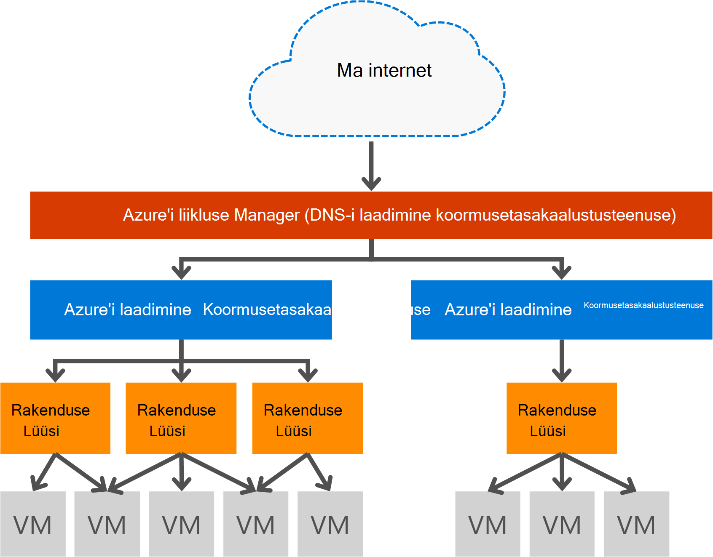

<properties
   pageTitle="Sissejuhatus rakenduse lüüsi | Microsoft Azure'i"
   description="Sellel lehel antakse ülevaade sellest rakenduse lüüsi teenus layer 7 koormusetasakaalustuseks, sh lüüsi suurused, HTTP laadimine tasakaalustavad, küpsise seansi osaleja ja SSL offload."
   documentationCenter="na"
   services="application-gateway"
   authors="georgewallace"
   manager="carmonm"
   editor="tysonn"/>
<tags
   ms.service="application-gateway"
   ms.devlang="na"
   ms.topic="hero-article"
   ms.tgt_pltfrm="na"
   ms.workload="infrastructure-services"
   ms.date="10/25/2016"
   ms.author="gwallace"/>

# Rakenduse lüüsi ülevaade

## Mis on rakenduse lüüsi

Microsoft Azure'i rakenduse lüüsi pakub rakenduse kohaletoimetamise kontrolleril (ADC) teenust, pakub erinevate layer 7 laadi tasakaalustamiseks võimaluste rakenduse. See võimaldab klientidel optimeerida web serveripargi productivity mahalaadimine CPU intensiivne SSL-i lõpetamine rakenduse lüüsi. See sisaldab ka teiste Layer 7 marsruutimise võimalused, sh round jaan jaotuse liiklust, küpsise põhinev seansi osaleja, URL-i põhiste tee marsruutimist ja võimalus taha ühe rakenduse lüüsi mitme veebisaidi majutada. Rakenduse lüüsi on ka web rakenduse tulemüüri (WAF), mida kaitseb teie taotlus on OWASP ülemine 10 levinud web kohtade kõige suhtes. Rakenduse lüüsi saate konfigureerida internet suunatud lüüsi, sisemine ainult lüüsi või mõlemaid. Rakenduse lüüs on täielikult Azure õnnestus, scalable ja tugevalt saadaval. Diagnostika ja logimise võimalusi pakub parema juhitavuse jaoks. Lüüsi rakendus töötab virtuaalmasinates, pilveteenustega ja sise- või suunatud veebirakenduste.

Rakenduse lüüsi on spetsiaalne virtuaalse seadme rakenduse ja koosneb mitme töötaja eksemplari skaleeritavus ja kõrge kättesaadavus. Rakenduste portaali loomisel lõpp (avaliku VIP või sisemine ILB IP) on seotud ja sissepääsu võrguliikluse jaoks kasutada. Selle VIP või ILB IP pakub Azure'i laadimine koormusetasakaalustusteenuse transport tasemel (TCP/UDP) ja millel on koormus tasakaalustatud rakenduse lüüsi töötaja eksemplarides sissetulevat võrguliiklust. Rakenduse lüüsi siis kas see on virtuaalse masina, selle konfiguratsiooni põhjal HTTP-või HTTPS-liikluse marsruudib cloud teenuse sisemise või välise IP-aadressi. SLA jaoks ja hinnad, vaadake [SLA](https://azure.microsoft.com/support/legal/sla/) ja [hinnakirjad](https://azure.microsoft.com/pricing/details/application-gateway/) lehekülgi.

## Funktsioonid

Lüüsi rakendus toetab praegu layer 7 rakenduse kohaletoimetamise järgmised funktsioonid:

- **[Web rakenduse tulemüüri (eelvaade)](application-gateway-webapplicationfirewall-overview.md)** – web rakenduse tulemüüri (WAF) Azure'i rakenduse lüüsi kaitseb veebirakenduste levinud veebipõhine eest nagu SQL süst, saitidevaheline skriptimine eest ja seansi hijacks.
- **HTTP laadi tasakaalustamiseks** - rakenduste portaali pakub round jaan koormusetasakaalustuseks. Koormusetasakaalustuseks toimub Layer 7 ja kasutatakse HTTP (S) liikluse ainult.
- **Seansi küpsise vastavalt osaleja** – see funktsioon on kasulik, kui soovite hoida kasutaja seansi sama tagaandmebaas. Lüüsi hallatavate küpsised abil rakenduse lüüsi on võimalik sama tagaandmebaas töötlemiseks kasutaja seansi edaspidised liikluse suunamiseks. See funktsioon on oluline, juhul kui seansi olek on salvestatud kohalikult serveris tagaandmebaas kasutaja seansi jaoks.
- **[Turvasoklite kiht (SSL) offload](application-gateway-ssl-arm.md)** – see funktsioon võtab kulukas ülesanne dekrüptimine HTTPS-liikluse veebi serveri välja. Rakenduse Gateway SSL-ühenduse lõpetamine ja taotluse edastamise un krüptitud serveriga, on veebiserver unburdened abil soovitud dekrüptimine.  Rakenduse lüüsi krüptib vastus uuesti enne saatmist kliendile. See funktsioon on kasulik, kui selle tagaandmebaas asub sama turvatud virtuaalse võrgu rakenduse lüüsi Azure stsenaariumide.
- **[Lõpuni SSL](application-gateway-backend-ssl.md)** - rakenduste portaali toetab krüptimist lõpuni liikluse. Rakenduse lüüsi see lõpetades rakenduse Gateway SSL-ühenduse. Lüüsi seejärel marsruutimise reeglite kehtib liiklus, uuesti krüptib paketi ja edastab paketi et vastav taustväärtus, mis on määratletud marsruutimise reeglite alusel. Veebiserver vastuse läheb läbi sama protsessi tagasi lõppkasutaja.
- **[URL-i-põhine sisu marsruutimise](application-gateway-url-route-overview.md)** – see funktsioon võimaldab kasutada erinevaid liikluse serveritest tagaandmebaas. Mõne muu tagaandmebaas, vähendada mittevajaliku laadi tagaserveris, mis ei teeni kindla sisu võib marsruutida liikluse veebiserverisse kausta või CDN-ID.
- **[Mitme saidi marsruutimine](application-gateway-multi-site-overview.md)** - rakenduste lüüsi võimaldab teil konsolideerimine kuni 20 veebisaidid ühes rakenduses lüüsi.
- **[Websocket tugi](application-gateway-websocket.md)** - teine suur omadus rakenduse lüüsi on Websocket kohalikke tugi.
- **[Seisundi jälgimine](application-gateway-probe-overview.md)** – rakenduse lüüsi annab vaikimisi seisundi jälgimine kirjutamata ressursside ja kohandatud sondid täpsemale stsenaariumid jälgimiseks.

## Eelised

Rakenduse lüüsi on kasulik:

- Rakendusi, mis nõuavad taotlusi sama/klient seansi saavutamiseks tagaandmebaas virtual samasse arvutisse. Näiteid nende rakenduste oleks ostmine ostukorv rakenduste ja web meiliserverid.
- Rakendused, mida soovite vabastada web serveri parkides SSL-i lõpetamise pea kohal.
- Rakendused, näiteks sisuedastusvõrgud, mis nõuab mitu HTTP päringuid sama pikaajalisi TCP ühendust marsruutida või laadimine tasakaalus serveritest tagaandmebaas.
- Rakendusi, mis toetavad websocket liikluse
- Levinud veebipõhine eest kaitsmise veebirakenduste nagu SQL süsti, saitidevaheline skriptimine eest ja seansi hijacks.

Rakenduse lüüsi laadimine tasakaalustamiseks teenuse Azure haldusega võimaldab ettevalmistamise, kiht 7 laadi koormusetasakaalustusteenuse Azure tarkvara koormust koormusetasakaalustusteenuse taha. Liikluse haldur saab seda stsenaariumi lõpuleviimiseks, nagu järgmisel pildil näha. Kui liikluse haldur ümbersuunamise ja kättesaadavust, laadi koormusetasakaalustusteenuse annab piirkond skaleeritavus ja kättesaadavus, ja rakenduse lüüsi rist piirkond layer 7 koormusetasakaalustuseks.

[AZURE.INCLUDE [load-balancer-compare-tm-ag-lb-include.md](../../includes/load-balancer-compare-tm-ag-lb-include.md)]

## Lüüsi suurused ja eksemplari

Rakenduse lüüsi on praegu saadaval kolmes suuruses: väike, Keskmine ja suur. Väike eksemplari suurused on mõeldud arendamise ja testimise stsenaariumid.

Praegu on kaks SKU-de jaoks rakenduse Gateway: WAF ja standardne.

Saate luua kuni 50 rakenduse lüüside tellimuse kohta ja iga rakenduse lüüsi võib olla kuni 10 eksemplari. Iga rakenduse lüüsi võivad koosneda 20 http kuulajatele. Rakenduse lüüsi piirangud täieliku loendi lehelt [Teenuste piirangud](../azure-subscription-service-limits.md#application-gateway) .

Järgmine tabel sisaldab mõnda Keskmine jõudluse läbilaskevõime iga rakenduse lüüsi eksemplari.

| Tagaandmebaas lehe vastus | Small | Keskmine | Suure|
|---|---|---|---|
| 6K | 7.5 Mbps | 13 Mbps | 50 Mbps |
|100K | 35 Mbps | 100 Mbps| 200 Mbps |

>[AZURE.NOTE] Need väärtused on ligikaudne väärtused on rakenduse lüüsi läbilaskevõime. Tegelik läbilaskevõime sõltub erinevate keskkonna üksikasjad, näiteks average lehe suurus, tagaandmebaas eksemplarid ja töötlemise ajal olla lehe asukoht. Täpse jõudluse numbrite, peaksite oma testide, need väärtused on mõeldud ainult valmisoleku kavandamine juhised.

## Seisundi jälgimine

Azure'i rakenduse lüüsi jälgib automaatselt tagaandmebaas eksemplarid basic kaudu või kohandatud seisund sondid. Seisund sondid abil see tagab, et ainult terve hosts vastata liikluse. Lisateabe saamiseks vt [rakenduse lüüsi seisundi jälgimine ülevaade](application-gateway-probe-overview.md).

## Konfigureerimine ja haldamine

Selle lõpp-punkti, saate rakenduse lüüsi on avaliku IP, Privaatne IP või mõlemad kui see on konfigureeritud. Rakenduse lüüsi on konfigureeritud oma alamvõrgu virtuaalse võrgu sees. Alamvõrgu loodud või kasutada rakenduse lüüsi ei tohi sisaldada mis tahes muud tüüpi ressursid, ainult ressursse, mis on lubatud alamvõrgu on muude rakenduste lüüsid. Tagada teie kirjutamata ressursid on kirjutamata serverid saate sisalduvad erinevate alamvõrgu rakenduse lüüsi virtuaalse samasse võrku sisse. Selle täiendavad alamvõrgu seda ei pea taustväärtus rakenduste, seni, kuni jõuate rakenduse gateway ip-aadress, rakenduse lüüs on võimalik kirjutamata serverid ette ADC võimalusi.

Saate luua ja hallata rakenduste portaali REST API-d, PowerShelli cmdletid Azure'i CLI või [Azure portaali](https://portal.azure.com/)kaudu.

## Järgmised sammud

Pärast õppida rakenduse lüüsi, saate [luua rakenduste portaali](application-gateway-create-gateway-portal.md) või saate [luua rakenduste portaali SSL offload](application-gateway-ssl-arm.md) laadi – Topeltdegressiivse HTTPS ühendusi.

Rakenduste portaali URL-i-põhine sisu marsruutimise abil loomise kohta leiate lisateavet [rakenduste portaali URL-i-põhine marsruutimine abil](application-gateway-create-url-route-arm-ps.md) luua.

