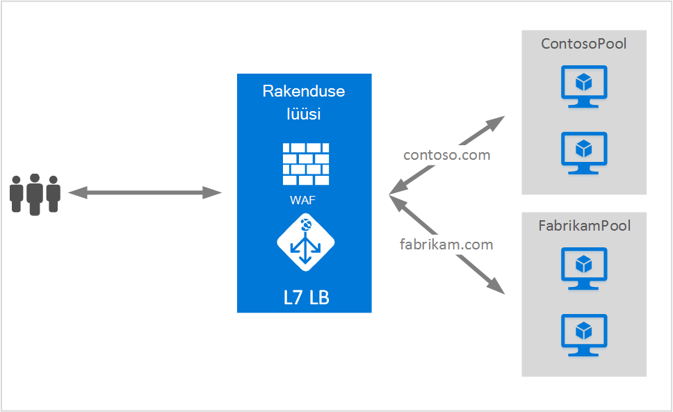

<properties
   pageTitle="Mitme saitidel rakenduse lüüsi majutusteenuse | Microsoft Azure'i"
   description="Sellel lehel antakse ülevaade rakenduse lüüsi mitme saidi tugi."
   documentationCenter="na"
   services="application-gateway"
   authors="amsriva"
   manager="rossort"
   editor="amsriva"/>
<tags
   ms.service="application-gateway"
   ms.devlang="na"
   ms.topic="hero-article"
   ms.tgt_pltfrm="na"
   ms.workload="infrastructure-services"
   ms.date="10/25/2016"
   ms.author="amsriva"/>

# Rakenduse lüüsi mitme saidi hosting

Mitme saidi hosting võimaldab teil konfigureerida rohkem kui üks veebirakenduse sama rakenduse lüüsi eksemplari. See funktsioon võimaldab teil konfigureerida tõhusam topoloogia oma juurutuste, lisades kuni 20 veebilehed ühe taotluse lüüsi. Iga veebisaidi saate suunata enda taustväärtus pool. Järgmises näites on rakenduse lüüsi serveeritakse liiklus contoso.com ja fabrikam.com alates kaks tagaandmebaas serveri rühmituse nimega ContosoServerPool ja FabrikamServerPool.

Http://contoso.com taotlused marsruuditakse ContosoServerPool ja http://fabrikam.com marsruuditakse FabrikamServerPool.

Samuti saate kaks sama ema domeeni alamdomeenide majutatud sama rakenduse lüüsi juurutamine. Domeenide kasutamine võivad olla näiteks http://blog.contoso.com ja http://app.contoso.com majutatud ühes rakenduses lüüsi juurutamine.

## Hosti päised ja serveri teave (SNI)

On kolm levinud menetlustele mitme saidi hosting sama infrastruktuuri, mis võimaldab.

1. Majutada mitme veebirakendused iga kordumatu IP-aadress.
2. Hostinimi majutada mitme veebirakenduste sama IP-aadressi.
3. Erinevate pordid abil majutada mitme veebirakenduste sama IP-aadressi.

Praegu saab rakenduste portaali ühe avalik IP-aadress mille kuulab liikluse. Seetõttu toetavad mitme rakendusi, igal versioonil oma IP-aadress pole praegu toetatud. Rakenduse lüüsi toetab majutusteenuse mitme rakenduste iga kuulata erinevad pordid, kuid sel juhul nõuaks rakenduste aktsepteerimiseks liiklus mittestandardsed pordid ja pole sageli soovitud konfiguratsioon. Rakenduse lüüsi tugineb HTTP 1.1 hosti päised majutada samas avaliku IP-aadress ja pordi rohkem kui üks veebisaiti. Samuti saate majutatud rakenduse lüüsi saitide toe SSL offload serveri teave (SNI) TLS-laiendiga. See stsenaarium tähendab, et kliendi brauseri ja kirjutamata web serveripargi peab toetama HTTP/1.1 ja TLS laiend RFC 6066 määratletud.

## Elemendi kuulajale konfigureerimine

Olemasoleva HTTPListener konfiguratsiooni elemendi täiustatud toetavad hosti nimi ja serveri nimi märge elemente, mis kasutab rakenduse lüüsi vastav kirjutamata rakenduskausta liikluse marsruutimiseks. Järgmine kood näide on koodilõigu HttpListeners elemendi malli failist.

    "httpListeners": [
                {
                    "name": "appGatewayHttpsListener1",
                    "properties": {
                        "FrontendIPConfiguration": {
                            "Id": "/subscriptions/<subid>/resourceGroups/<rgName>/providers/Microsoft.Network/applicationGateways/applicationGateway1/frontendIPConfigurations/DefaultFrontendPublicIP"
                        },
                        "FrontendPort": {
                            "Id": "/subscriptions/<subid>/resourceGroups/<rgName>/providers/Microsoft.Network/applicationGateways/applicationGateway1/frontendPorts/appGatewayFrontendPort443'"
                        },
                        "Protocol": "Https",
                        "SslCertificate": {
                            "Id": "/subscriptions/<subid>/resourceGroups/<rgName>/providers/Microsoft.Network/applicationGateways/applicationGateway1/sslCertificates/appGatewaySslCert1'"
                        },
                        "HostName": "contoso.com",
                        "RequireServerNameIndication": "true"
                    }
                },
                {
                    "name": "appGatewayHttpListener2",
                    "properties": {
                        "FrontendIPConfiguration": {
                            "Id": "/subscriptions/<subid>/resourceGroups/<rgName>/providers/Microsoft.Network/applicationGateways/applicationGateway1/frontendIPConfigurations/appGatewayFrontendIP'"
                        },
                        "FrontendPort": {
                            "Id": "/subscriptions/<subid>/resourceGroups/<rgName>/providers/Microsoft.Network/applicationGateways/applicationGateway1/frontendPorts/appGatewayFrontendPort80'"
                        },
                        "Protocol": "Http",
                        "HostName": "fabrikam.com",
                        "RequireServerNameIndication": "false"
                    }
                }
            ],

Külastage [ressursihaldur malli abil mitme saidi hosting](https://github.com/Azure/azure-quickstart-templates/blob/master/201-application-gateway-multihosting) lõpuni Mall põhinev juurutamine.

## Marsruutimise reeglite

Ei muutu marsruutimise reeglite nõutav. Marsruutimise reeglite 'Basic' jätkama valitakse siduda vastavate taustväärtus aadress pool kuulajale vastav sait.

    "requestRoutingRules": [
    {
        "name": "<ruleName1>",
        "properties": {
            "RuleType": "Basic",
            "httpListener": {
                "id": "/subscriptions/<subid>/resourceGroups/<rgName>/providers/Microsoft.Network/applicationGateways/applicationGateway1/httpListeners/appGatewayHttpsListener1')]"
            },
            "backendAddressPool": {
                "id": "/subscriptions/<subid>/resourceGroups/<rgName>/providers/Microsoft.Network/applicationGateways/applicationGateway1/backendAddressPools/ContosoServerPool')]"
            },
            "backendHttpSettings": {
                "id": "/subscriptions/<subid>/resourceGroups/<rgName>/providers/Microsoft.Network/applicationGateways/applicationGateway1/backendHttpSettingsCollection/appGatewayBackendHttpSettings')]"
            }
        }

    },
    {
        "name": "<ruleName2>",
        "properties": {
            "RuleType": "Basic",
            "httpListener": {
                "id": "/subscriptions/<subid>/resourceGroups/<rgName>/providers/Microsoft.Network/applicationGateways/applicationGateway1/httpListeners/appGatewayHttpListener2')]"
            },
            "backendAddressPool": {
                "id": "/subscriptions/<subid>/resourceGroups/<rgName>/providers/Microsoft.Network/applicationGateways/applicationGateway1/backendAddressPools/FabrikamServerPool')]"
            },
            "backendHttpSettings": {
                "id": "/subscriptions/<subid>/resourceGroups/<rgName>/providers/Microsoft.Network/applicationGateways/applicationGateway1/backendHttpSettingsCollection/appGatewayBackendHttpSettings')]"
            }
        }

    }
    ]

## Järgmised sammud

Pärast mitme saidi hosting õppida, minge rakenduste portaali toetavad rohkem kui üks veebirakenduse võimalus luua [rakenduste abil mitme saidi hosting portaali loomine](application-gateway-create-multisite-azureresourcemanager-powershell.md) .
