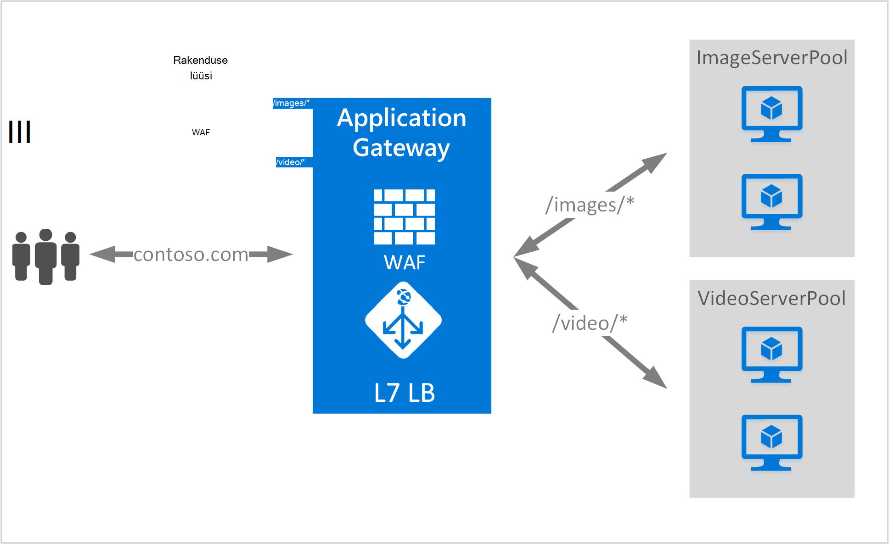

<properties
   pageTitle="URL-i-põhine sisu marsruutimise ülevaade | Microsoft Azure'i"
   description="Sellel lehel antakse ülevaade lüüsi URL-i-põhine sisu marsruutimine, UrlPathMap konfiguratsiooni ja PathBasedRouting reegel."
   documentationCenter="na"
   services="application-gateway"
   authors="georgewallace"
   manager="carmonm"
   editor="tysonn"/>
<tags
   ms.service="application-gateway"
   ms.devlang="na"
   ms.topic="hero-article"
   ms.tgt_pltfrm="na"
   ms.workload="infrastructure-services"
   ms.date="10/25/2016"
   ms.author="gwallace"/>

# URL-i tee vastavalt marsruutimise ülevaade

URL-i tee vastavalt marsruutimine võimaldab teil-liikluse marsruutimiseks tagaandmebaas serveri kaustu teed URL-i taotluse põhjal. Üks stsenaariumid on marsruudi taotlusi sisutüübiga erinevate taustväärtus serveri kaustu.
Järgmises näites on rakenduse lüüsi serveeritakse suunatakse contoso.com kolmest tagaandmebaas serveri kaudu näiteks: VideoServerPool, ImageServerPool ja DefaultServerPool.

Http://contoso.com/video* marsruuditakse VideoServerPool, ja http://contoso.com/images* taotlused marsruuditakse ImageServerPool. DefaultServerPool on märgitud, kui ükski tee mustrite vasta.

## Elemendi UrlPathMap konfigureerimine

UrlPathMap elemendi abil saate määrata tee mustrite tagaandmebaas serveri pool vastendused. Järgmine kood näide on koodilõigu urlPathMap elemendi malli failist.

    "urlPathMaps": [
    {
    "name": "<urlPathMapName>",
    "id": "/subscriptions/<subscriptionId>/../microsoft.network/applicationGateways/<gatewayName>/ urlPathMaps/<urlPathMapName>",
    "properties": {
        "defaultBackendAddressPool": {
            "id": "/subscriptions/<subscriptionId>/../microsoft.network/applicationGateways/<gatewayName>/backendAddressPools/<poolName>"
        },
        "defaultBackendHttpSettings": {
            "id": "/subscriptions/<subscriptionId>/../microsoft.network/applicationGateways/<gatewayName>/backendHttpSettingsList/<settingsName>"
        },
        "pathRules": [
            {
                "paths": [
                    <pathPattern>
                ],
                "backendAddressPool": {
                    "id": "/subscriptions/<subscriptionId>/../microsoft.network/applicationGateways/<gatewayName>/backendAddressPools/<poolName2>"
                },
                "backendHttpsettings": {
                    "id": "/subscriptions/<subscriptionId>/../microsoft.network/applicationGateways/<gatewayName>/backendHttpsettingsList/<settingsName2>"
                },

            },

        ],

    }
    }
    

>[AZURE.NOTE] PathPattern: See säte on tee mustrite, et need vastaksid loendit. Iga peab algama / ja ainult mõne "*" on lubatud on end pärast on "/". Tee otsingul söötmiseks stringi ei tohi sisaldada teksti pärast esimest? või # ja nende tähemärki siin pole lubatud. 

Saate vaadata [ressursihaldur malli abil URL-i-põhine marsruutimine](https://azure.microsoft.com/documentation/templates/201-application-gateway-url-path-based-routing) lisateavet.

## PathBasedRouting reegel

RequestRoutingRule tüüpi PathBasedRouting kasutatakse on kuulajale sidumiseks mõne urlPathMap. Kõik kutsed, mis on saanud selle kuulajale marsruuditakse vastavalt määratud urlPathMap poliitika.
Koodilõik PathBasedRouting reegel:

    "requestRoutingRules": [
    {

    "name": "<ruleName>",
    "id": "/subscriptions/<subscriptionId>/../microsoft.network/applicationGateways/<gatewayName>/requestRoutingRules/<ruleName>",
    "properties": {
        "ruleType": "PathBasedRouting",
        "httpListener": {
            "id": "/subscriptions/<subscriptionId>/../microsoft.network/applicationGateways/<gatewayName>/httpListeners/<listenerName>"
        },
        "urlPathMap": {
            "id": "/subscriptions/<subscriptionId>/../microsoft.network/applicationGateways/<gatewayName>/ urlPathMaps/<urlPathMapName>"
        },

    }
    
## Järgmised sammud

Pärast õppida URL-i-põhine sisu marsruutimine, minge [rakenduste portaali URL-i-põhine marsruutimine abil luua](application-gateway-create-url-route-portal.md) rakenduste portaali URL-i marsruutimise reeglite loomiseks.
