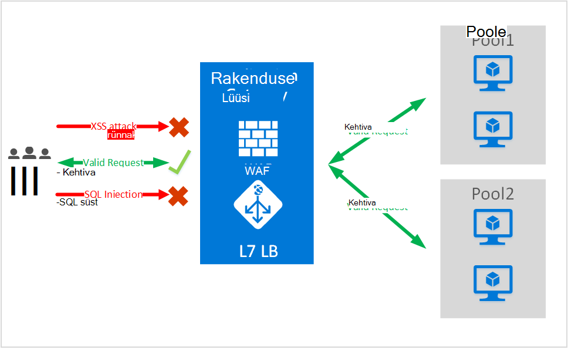
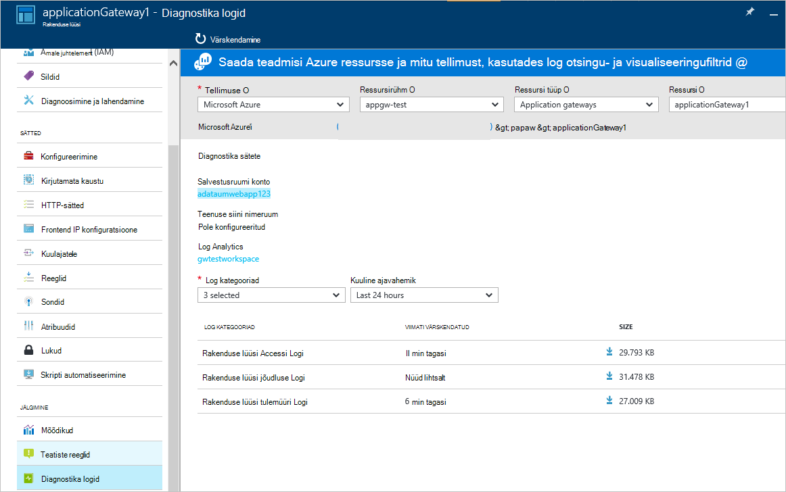

<properties
   pageTitle="Sissejuhatus rakenduse Web (WAF) tulemüüri rakenduse lüüsi | Microsoft Azure'i"
   description="Sellel lehel antakse ülevaade Web rakenduse tulemüüri (WAF) rakenduse lüüsi "
   documentationCenter="na"
   services="application-gateway"
   authors="amsriva"
   manager="rossort"
   editor="amsriva"/>
<tags
   ms.service="application-gateway"
   ms.devlang="na"
   ms.topic="hero-article"
   ms.tgt_pltfrm="na"
   ms.workload="infrastructure-services"
   ms.date="10/25/2016"
   ms.author="amsriva"/>

# Rakenduse lüüsi Web rakenduse tulemüüri (eelvaade)

Web rakenduse tulemüüri (WAF) funktsioon azure rakenduse lüüsi, mis pakub veebirakenduste, mida kasutada rakenduse lüüsi standardse rakenduse kohaletoimetamise juhtelemendi (ADC) funktsioonide kaitse. Web rakenduse tulemüüri see kaitsevad selle OWASP ülemine 10 levinud web kohtade kõige suhtes. Veebirakenduste üha ründetarkvara eest, mida kasutada levinud teadaolevad nõrkade kohtade eesmärgid. Neid kasutab levinud SQL-i süsti eest, rist saidi skriptimine rünnakud nimi mõne. Vältimine sellise eest rakenduse koodi võib olla keeruline ja võib olla vaja range hooldus, paikamine ja jälgida mitut tüüpi Otsingurakenduse topoloogia juures. Tsentraliseeritud web rakenduse tulemüüri web eest kaitsta muudab turvalisus halduse lihtsam ja annab parema kinnituse, sissemurdmisest ohtude rakendusse. WAF lahenduse ka reageerida kiirem ohtu turvalisusele, lappimine veebisaidil ühes keskses kohas võrreldes turvaliseks iga üksiku veebirakenduste teadaolevad haavatavust. Olemasoleva rakenduse lüüside saab teisendada rakenduste portaali web rakenduse tulemüüriga hõlpsalt.

Rakenduse lüüsi toimib ka rakenduse kohaletoimetamise domeenikontrolleri ja pakub SSL-i lõpetamise, seansi küpsise vastavalt osaleja, round-jaan laadi jaotuse, sisu marsruutimine, võimalus majutada mitme veebisaitide ja turve täiustused. Pakutavate rakenduste portaali turbeparandusi kaasata SSL-i lõpuni SSL-i tugiteenuste poliitika haldus. Me muudavad rakenduse turvalisus võimaluste meie teenuste WAF (web rakenduse tulemüür) otse integreeritud pakub ADC tutvustus. See pakub hõlpsalt konfigureerimiseks keskses kohas hallata ja oma veebirakenduste selliste levinud web nõrkuste kaitsta.

Järgmised benefit konfigureerimise WAF rakenduse Gateway teile pakub.

- Web kohtade ja ilma koodi kirjutamata muudatuste eest kaitsta oma veebirakenduse.
- Kaitse taha rakenduste portaali korraga mitme veebirakenduste. Rakenduse lüüsi toetab majutusteenuse kuni 20 veebisaitide taha ühe lüüsi, mis võivad kõik tuleb kaitsta web eest.
- Saate jälgida oma veebirakenduse abil loodud lüüsi WAF logid reaalajas aruande eest.
- Teatud vastavuse juhtelementide jaoks on vaja kõik Interneti suunatud lõpp-punkti kaitstakse WAF lahenduse. Kasutades rakenduse lüüsi WAF lubatud, saate vasta nendele nõuetele vastavuse.

## Ülevaade

Rakenduse lüüsi WAF uute SKU-ga (WAF SKU) on saadaval ja tuleb eelkonfigureeritud ModSecurity ja OWASP Core toodud pakkuda võrdlusalus kõige soovitud OWASP ülemine 10 levinud web kohtade kaitset.

- SQL-i süsti kaitse
- Cross saidi skriptimine kaitse
- Levinud Web ründab kaitse nagu käsk süsti, salakaubavedu, HTTP vastuse jagamine, HTTP-päring ja Kaug-faili lisamine rünnak
- HTTP-protokoll rikkumised kaitse
- HTTP protokolli kõrvalekaldeid nagu puuduvad kaitset majutada kasutajaagendi ja nõustuge päised
- HTTP DoS kaitstud, sh HTTP üleujutus ja aeglane HTTP DoS vältimine
- Eest, indeksoijat ja skanneri vältimine
- Tuvastamise rakenduse väärkonfiguratsioone (st Apache, IIS-i jne)

## WAF režiimi

Rakenduse lüüsi WAF saate konfigureerida käivitamiseks järgmised kaks viisi:

- **Tuvastamise režiim** – tuvastamise režiimis, rakenduse lüüsi WAF konfigureerimisel jälgib ja logifaili logib kõik ohtu teatised. Vajadust tagada, et rakenduse Gateway diagnostika logimine on sisse lülitatud jaotises diagnostika abil. Samuti peate veenduge, et WAF log on valitud ja sisse lülitatud.
- **Vältimise režiimiga** – käivitamiseks vältimise režiim, rakenduse lüüsi aktiivselt konfigureerimisel blokeerib sissemurdmisest ja eest, mis on avastatud töökorras. Ründaja saab 403 volitamata juurdepääsu erand ja ühendus katkes. Vältimise režiimiga endiselt sisse logida sellise eest WAF logid.

## Rakenduse lüüsi WAF aruanded

Rakenduse lüüsi WAF pakub üksikasjalik aruandlus iga ohtu, tuvastatakse. Logimine on integreeritud Azure diagnostika logid ja teatiste on salvestatud json-vormingus.

    {
        "resourceId": "/SUBSCRIPTIONS/<subscriptionId>/RESOURCEGROUPS/<resourceGroupName>/PROVIDERS/MICROSOFT.NETWORK/APPLICATIONGATEWAYS/<applicationGatewayName>",
        "operationName": "ApplicationGatewayFirewall",
        "time": "2016-09-20T00:40:04.9138513Z",
        "category": "ApplicationGatewayFirewallLog",
        "properties":     {
            "instanceId":"ApplicationGatewayRole_IN_0",
            "clientIp":"108.41.16.164",
            "clientPort":1815,
            "requestUri":"/wavsep/active/RXSS-Detection-Evaluation-POST/",
            "ruleId":"OWASP_973336",
            "message":"XSS Filter - Category 1: Script Tag Vector",
            "action":"Logged",
            "site":"Global",
            "message":"XSS Filter - Category 1: Script Tag Vector",
            "details":{"message":" Warning. Pattern match "(?i)(<script","file":"/owasp_crs/base_rules/modsecurity_crs_41_xss_attacks.conf","line":"14"}}
    }

## Rakenduse lüüsi WAF SKU hinnad

Eelvaate, on rakenduse lüüsi WAF kasutuse ei lisatasud. Saate jätkuvalt veebisaidil olemasoleva elementaarne SKU kulud. Edastame WAF SKU kulude GA ajal. Kliendid, kes on otsustanud juurutada rakenduse lüüsi WAF SKU hakkaks WAF SKU hinnad alles pärast GA teadet, mis pärinevad.

## Järgmised sammud

Pärast õppimist WAF võimaluste kohta lisateavet, külastage [Web rakenduse tulemüür rakenduse lüüsi konfigureerimine](application-gateway-web-application-firewall-portal.md).
