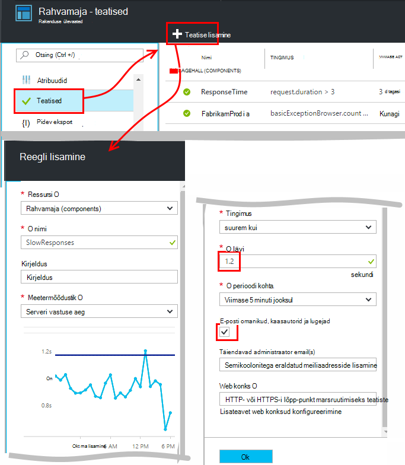
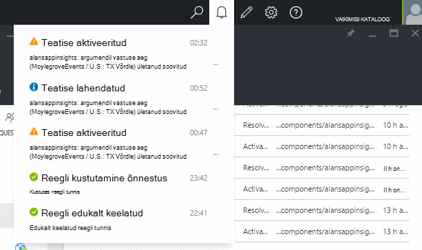
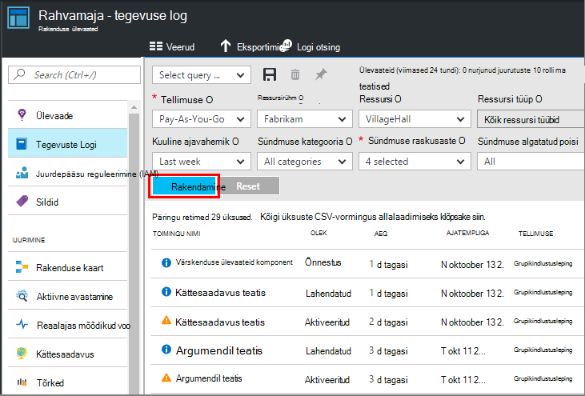

<properties 
    pageTitle="Teatiste seadmine rakenduse ülevaated | Microsoft Azure'i" 
    description="Teatise saamine kindla aeglane vastuse korda, erandid ning muude jõudluse või oma veebirakenduse kasutus muudatuste kohta." 
    services="application-insights" 
    documentationCenter=""
    authors="alancameronwills" 
    manager="douge"/>

<tags 
    ms.service="application-insights" 
    ms.workload="tbd" 
    ms.tgt_pltfrm="ibiza" 
    ms.devlang="na" 
    ms.topic="article" 
    ms.date="10/14/2016" 
    ms.author="awills"/>
 
# Rakenduse ülevaated teatiste seadmine

[Visual Studio rakenduse ülevaated] [ start] teid teavitada muutuste jõudlust või kasutus mõõdikute teie web Appis. 

Rakenduse ülevaated jälgib [mitmesuguste platvormide jaoks loodud] rakenduse reaalajas[ platforms] aitavad jõudlusega seotud probleemide diagnoosimine ja mustreid mõista.

On kolme tüüpi teatised.

* **Argumendil teatiste** öelda, kui mõni meetermõõdustik ületab läve teatud ajaks – näiteks vastuse korda, erandi loendab, CPU hõivatus või lehe vaated. 
* [**Web testide** ] [ availability] kindlaks teha, kui teie sait on saadaval Internetis või reageeri aeglaselt. [Lisateavet][availability].
* [**Aktiivne diagnostika**](app-insights-proactive-diagnostics.md) on konfigureeritud automaatselt teavitada ebatavalised jõudluse mustrite.

Me keskenduda argumendil teatisi selle artikli.

## Argumendil teatise määramine

Avage teatiste reeglid tera ja seejärel kasutage nuppu Lisa. 

* Määrata muid atribuute enne ressursi. Kui soovite jõudluse ega kasutus mõõdikute teatiste seadmine **Valige ressursi "(komponendid)"** .
* Nimi, mida te anda teatise peab olema kordumatu ressursi rühmast (mitte ainult rakenduse).
* Olge ettevaatlik, et üksused, kus teil palutakse sisestada piirmäärast Märkus.
* Kui märgite ruudu "E-posti omanikud...", saadetakse teatised e-posti teel kõigile, kellel on juurdepääs selle ressursirühma. Nende inimeste laiendamiseks lisada need [ressursirühm või tellimuse](app-insights-resources-roles-access-control.md) (mitte ressurss).
* Kui määrate "Täiendavad kirjad", saadetakse teatised sobivatele isikutele või rühmadele (kas märgitud ruut "e-posti omanikud..."). 
* Määrake a [webhook aadress](../monitoring-and-diagnostics/insights-webhooks-alerts.md) , kui olete seadistanud web appi, mis vastab teatised. Seda nimetatakse kui teatise on aktiveeritud (mis käivitatakse) ja kui see on lahendatud. (Kuid Pange tähele, et praegu, päringu parameetrid on möödas kaudu webhook atribuutidena.)
* Saate keelata või lubada teatise: vt tera ülaservas nuppe.

*Ma ei näe nupp Lisa teatis.* 

- Kas kasutate organisatsioonikonto? Kui teil on omanik või juurdepääs rakenduse ressurss kaasautor, saab teatised määrata. Heitke pilk tera juurdepääsu reguleerimine. [Lisateavet juurdepääsu reguleerimine][roles].

> [AZURE.NOTE] Teatiste tera, näete, et seal on juba teatiste: [Aktiivne diagnostika](app-insights-proactive-failure-diagnostics.md). See on automaatne teatis, mis jälgib ühe kindla argumendil, taotluse ebaõnnestumiste määra. Kui te otsustate aktiivne teatise keelamine, ei peate määrama oma teatise taotluse nurjumise määra. 

## Vaadake oma teatised

Saate e-posti, kui on teatis muudatused olekus passiivne ja aktiivne. 

Iga teatise praegune olek kuvatakse teatis reeglid tera.

Ripploendis on tehtud tegevuse teatiste Kokkuvõte:

Muutuste ajalugu on tegevuste Logi:

## Teatiste tööpõhimõtted

* Teatise on kolm olekut: "Mitte kunagi aktiveeritud", "Aktiveeritud" ja "Lahendada". Aktiveeritud tähendab määratud tingimustele on true, kui see on viimase hinnata.

* Teatis luuakse oleku muutumisel teatise. (Kui teatiste tingimus oli juba täidetud teatise loomisel, ei pruugi te saada teatis kuni tingimus läheb väär.)

* Iga teade loob e-posti, kui märgitud ruut e-kirju või esitatud meiliaadressid. Saate vaadata ka ripploendist teatised.

* Teatise hinnatakse iga kord, kui saabub mõõdiku, kuid mitte mingil viisil.

* Väärtustamise eelmisel perioodil mõõdiku liitmise ja võrdleb lävi määrata uue riigi.

* Periood, mille valimisel saate määrata intervalli, mis on koondatud mõõdikute. See ei mõjuta, kui sageli teatise hinnatakse: see sõltub mõõdikute saabumise sagedus.

* Kui andmed saabub kindla mõõdiku jaoks juba mõnda aega, vahe on erinevate mõju teatiste hindamise ja diagrammide argumendil Exploreris. Argumendil Exploreris, kui andmed on näha rohkem kui diagrammi valimite intervall, diagramm kuvatakse väärtus 0. Kuid teatise, mis põhineb samal meetermõõdustik pole uuesti hinnata ja selle teatise riik ei muutu. 

    Lõpuks saabumisel andmete diagrammi viib tagasi nullist erinev väärtus. Teatise hindab saadaval määratud perioodi andmete põhjal. Kui uus andmepunkti on ainult üks ajavahemikul, liitmise põhineb just, et andmepunkt.

* Teatise saate värelus sageli teatis ja terve riikide, isegi siis, kui seate pika aja. See võib juhtuda siis, kui argumendil väärtus hovers ringi läve. Piirmäär on hüsterees puudub: üleminek teatise juhtub sama väärtuse, mis üleminekut terve.

## Mis on hea teatiste seadmine?

See sõltub teie rakendus. Et alustada, on parem pole liiga palju mõõdikute seadmine. Veedavad aega vaadates argumendil diagramme, kui teie rakendus töötab saate teada, kuidas see toimib tavalisel viisil. See aitab teil selle jõudluse parandamiseks. Seejärel häälestada teatisi kindlaks teha, kui mõõdikud minna tavaline tsooni. 

Populaarsed teatiste järgmised.

* [Brauseri mõõdikute][client], eriti brauseri **laadimise ajal**, on soovitatav veebirakenduste. Kui teie lehel on palju skripte, mida soovite otsida **brauseri erandid**. Nende mõõdikute ja teatiste saamiseks peate häälestamine [veebilehe jälgimise][client].
* Serveripoolne veebirakendusi **serveri aega** . Teatiste seadistamine, samuti hoida silma peal selle mõõdiku kuvamiseks, kui see muutub ebaproportsionaalselt kõrge taotluse määr: võib mis näitavad, et rakenduse salvestusruum hakkab otsa ressursid. 
* **Serveri erandid** - neid näha, mida on vaja teha mõned [täiendavad häälestus](app-insights-asp-net-exceptions.md).

Ärge unustage seda [aktiivne tõrge määr diagnostika](app-insights-proactive-failure-diagnostics.md) automaatselt määr, kus teie rakendus faili tõrge koodiga jälgimine. 

## Automatiseerimine

* [PowerShelli kasutamine automatiseerimiseks häälestamise teatised](app-insights-powershell-alerts.md)
* [Kasutada webhooks automatiseerimiseks teatistele vastamine](../monitoring-and-diagnostics/insights-webhooks-alerts.md)

## Vt ka

* [Kättesaadavus web testide](app-insights-monitor-web-app-availability.md)
* [Teatiste häälestamise automatiseerimine](app-insights-powershell-alerts.md)
* [Aktiivne diagnostika](app-insights-proactive-diagnostics.md) 

<!--Link references-->

[availability]: app-insights-monitor-web-app-availability.md
[client]: app-insights-javascript.md
[platforms]: app-insights-platforms.md
[roles]: app-insights-resources-roles-access-control.md
[start]: app-insights-overview.md

 