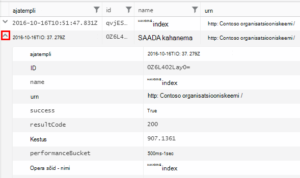

<properties 
    pageTitle="Tutvustusele Analyticsi kaudu rakenduse ülevaated | Microsoft Azure'i" 
    description="Lühike näidised peamised suhtes, Analytics, rakenduse ülevaated tööriista võimas otsing." 
    services="application-insights" 
    documentationCenter=""
    authors="alancameronwills" 
    manager="douge"/>

<tags 
    ms.service="application-insights" 
    ms.workload="tbd" 
    ms.tgt_pltfrm="ibiza" 
    ms.devlang="na" 
    ms.topic="article" 
    ms.date="10/15/2016" 
    ms.author="awills"/>


 
# <a name="a-tour-of-analytics-in-application-insights"></a>Klõpsake rakenduse ülevaated Analytics tutvustus


[Analytics](app-insights-analytics.md) on [Rakenduse ülevaated](app-insights-overview.md)võimsaid otsingufunktsiooni. Nende lehtede kirjeldada Analytics päringu lanquage.


* **[Vaata tutvustavat videot](https://applicationanalytics-media.azureedge.net/home_page_video.mp4)**.
* Kui teie rakendus pole andmete saatmine veel rakenduse ülevaated **[test drive Analytics meie jäljendatud andmeid](https://analytics.applicationinsights.io/demo)** .


Vaatame kõndida läbi mõne lihtsa päringud, võite alustada.

## <a name="connect-to-your-application-insights-data"></a>Oma rakenduse ülevaated andmetega ühenduse loomine

Klõpsake rakenduse ülevaated oma rakenduse [Ülevaade tera](app-insights-dashboards.md) kaudu avatud Analytics:


    
## <a name="takeapp-insights-analytics-referencemdtake-operator-show-me-n-rows"></a>[Võtta](app-insights-analytics-reference.md#take-operator): n rida Kuva

Andmepunktid, mis Logige kasutaja toimingud (tavaliselt edastatud oma veebirakenduse HTTP-taotluste) on talletatud tabelis, mida nimetatakse `requests`. Iga rida on rakenduse ülevaateid SDK rakenduse saadud telemeetria andmepunkti.

Alustame uurides mõne valimi tabeli read:


> [AZURE.NOTE] Asetage kursor kuskil lauses enne, kui klõpsate nuppu Mine. Te saate tükeldada märge üle rohkem kui ühe rea, kuid ei panna lauses tühje ridu. Tühjad read on mugav viis hoida päringute eraldi aknas.


Valige veerud, lohistage need veerud, Rühmita ja filtreerida: 


Laiendage iga üksuse üksikasjade kuvamiseks:
 


> [AZURE.NOTE] Klõpsake veeru ümber korraldada veebibrauseris saadaval tulemused juhataja. Kuid võtke arvesse, et suur tulemihulga alla laadida brauseri ridade arv on piiratud. Sortimine sellisel viisil ei Kuva alati saate tegelike suurimate või madalam üksused. Üksuste sortimiseks usaldusväärselt, kasutage funktsiooni `top` või `sort` tehtemärk. 

## <a name="topapp-insights-analytics-referencemdtop-operator-and-sortapp-insights-analytics-referencemdsort-operator"></a>[Üla](app-insights-analytics-reference.md#top-operator) - ja [sortimine](app-insights-analytics-reference.md#sort-operator)

`take`on kasu saada kiire proovi tulemit, kuid see näitab tabeli ridade ei kindlas järjekorras. Rakenduse järjestatud vaate saamiseks kasutage `top` (proovi) jaoks või `sort` (üle kogu tabel).

Kuva mulle n esimese ridu, kindla veeru tellitud:

```AIQL

    requests | top 10 by timestamp desc 
```

* *Süntaks:* Enamik tehtemärke on märksõna parameetrite nagu `by`.
* `desc`= laskuvas järjestuses, `asc` = tõusvas järjestuses.


`top...`on veel kiire viis öelda `sort ... | take...`. Meil on kirjutatud:

```AIQL

    requests | sort by timestamp desc | take 10
```

Tulemus oleks sama, kuid see ei läheks veidi aeglasemalt. (Võib ka kirjutamise `order`, mis on pseudonüümi, `sort`.)

Veerupäiste tabeli vaates saate kasutada ka Kuva tulemite sortimise järjestuse. Muidugi, kui te pole varem kasutanud, kuid `take` või `top` tuua ainult osa tabeli sa kuvatakse ainult uuesti, et te olete otsitud.


## <a name="projectapp-insights-analytics-referencemdproject-operator-select-rename-and-compute-columns"></a>[Projekti](app-insights-analytics-reference.md#project-operator): valige, ümber nimetada ja arvutada veerud

Kasutage [`project`](app-insights-analytics-reference.md#project-operator) välja lihtsalt veerud, mida soovite valida:

```AIQL

    requests | top 10 by timestamp desc
             | project timestamp, name, resultCode
```


Saate ka veergude ümbernimetamine ja määratlevad uusi faile.

```AIQL

    requests 
  	| top 10 by timestamp desc 
  	| project  
            name, 
            response = resultCode,
            timestamp, 
            ['time of day'] = floor(timestamp % 1d, 1s)
```


* [Veeru nimed](app-insights-analytics-reference.md#names) võivad sisaldada tühikuid või sümbolid, kui need on sulgudes nagu siin: `['...']` või`["..."]`
* `%`tavaline modulo operaator on. 
* `1d`(see on üks, numbri ja seejärel soovitud oli ") on kuuline ajavahemik, mis on sõnasõnaline tähendab üks päev. Siin on mõned rohkem kuuline ajavahemik literaalide: `12h`, `30m`, `10s`, `0.01s`.
* `floor`(pseudonüümi `bin`) Ümardab arvu allapoole lähima kordseni esitate alus väärtus väärtus. Nii `floor(aTime, 1s)` Ümardab arvu allapoole lähima teise kellaaja.

[Avaldiste](app-insights-analytics-reference.md#scalars) võivad hõlmata tavaline tehtemärgid (`+`, `-`,...), ja seal on mitmeid kasulikke funktsioone.

    

## <a name="extendapp-insights-analytics-referencemdextend-operator-compute-columns"></a>[Laienda](app-insights-analytics-reference.md#extend-operator): arvutada veerud

Kui soovite lihtsalt olemasolevaid veerge lisada, kasutage [`extend`](app-insights-analytics-reference.md#extend-operator):

```AIQL

    requests 
  	| top 10 by timestamp desc
  	| extend timeOfDay = floor(timestamp % 1d, 1s)
```

Kasutades [`extend`](app-insights-analytics-reference.md#extend-operator) on väiksem kui Paljusõnaline [`project`](app-insights-analytics-reference.md#project-operator) kui soovite säilitada kõik olemasolevad veerud.


## <a name="summarizeapp-insights-analytics-referencemdsummarize-operator-aggregate-groups-of-rows"></a>[Funktsiooni Summarize](app-insights-analytics-reference.md#summarize-operator): ridade rühmade liitmine

`Summarize`rakendab määratud *koondamine funktsioon* rühmad ridade kohale. 

Näiteks oma veebirakenduse suunab vastuseks aeg on esitatud välja `duration`. Vaatame Keskmine vastus aega, et kõik kutsed:


Või me võib tulemi omaette taotlusi erinevaid nimesid.


`Summarize`kogub voo andmepunktide rühmadesse, mille on `by` klausel hindab võrdselt. Iga väärtus on `by` - iga toimingu nimi eeltoodud näites - avaldise tulemuseks tulemus tabelis rea. 

Või me võivad tulemused Rühmitusalus kellaajal.


Pöörake tähelepanu sellele, kuidas me kasutame funktsiooni `bin` funktsioon (ehk `floor`). Kui lihtsalt kasutasime `by timestamp`, igal Sisestuskeel real oleks lõpuks oma väike rühm. Jaoks mis tahes pidev scalar nagu korda või arvud, meil pidevas vahemikus leheküljepiiri eraldatud väärtuste mõistliku mitmeks ja `bin` -mis on tõesti ainult selle tuttavad ümardamise alla `floor` funktsioon - on kõige lihtsam viis seda teha.

Kasutame sama võtet vahemike stringide vähendamiseks:


Teade, mida saate kasutada `name=` seadmiseks tulemi veeru liitmine avaldiste või klausel, nimi.

## <a name="counting-sampled-data"></a>Andmete loendamine valimisse

`sum(itemCount)`on soovitatav liitmine loendamiseks sündmused. Paljudel juhtudel itemCount == 1, nii, et funktsioon loendab lihtsalt üles jaotises ridade arv. Kuid kui [valimite](app-insights-sampling.md) on kasutusel, ainult osa algse sündmuste säilitatakse andmepunktid rakenduse ülevaated, kui nii, et iga andmepunkti, näete, on `itemCount` sündmused. 

Näiteks kui valimite hüljatakse 75% algse sündmused ja seejärel itemCount == 4 säilitatud dokumendid - st iga säilitata kirje oli nelja algse kirje. 

Kohandatavad valimite põhjustab itemCount olla suurem kui rakenduse tugevalt kasutab perioodide.

Liitmise itemCount annab seetõttu hea hinnanguline algse sündmuste arv.


Samuti on `count()` koondamine (ja count toiming), juhtudel, kuhu soovite rühma ridade arvu.


On mitmeid [liitmisfunktsioonid](app-insights-analytics-reference.md#aggregations).


## <a name="charting-the-results"></a>Diagrammide tulemused


```AIQL

    exceptions 
       | summarize count()  
         by bin(timestamp, 1d)
```

Vaikimisi kuvatakse tulemused tabelina:


Me saame teha paremini tabeli kuvamine. Heitkem pilk diagrammivaate tulemusi vertikaalne lint suvand:


Pange tähele, et kuigi me ei sortida tulemused aeg (nagu näete kuva tabel), diagrammi Kuva alati näitab kuupäevade ja kellaaegade õiges järjestuses.


## <a name="whereapp-insights-analytics-referencemdwhere-operator-filtering-on-a-condition"></a>[Kus](app-insights-analytics-reference.md#where-operator): tingimuse alusel filtreerimine

Kui olete häälestanud rakenduse ülevaated jälgimine [Klient](app-insights-javascript.md) ja server poolele rakenduse osa telemeetria andmebaasi pärineb brauserites.

Vaatame lihtsalt erandid teatatud brauseritest:

```AIQL

    exceptions 
  	| where client_Type == "Browser" 
  	|  summarize count() 
       by client_Browser, outerMessage 
```


Funktsiooni `where` tehtemärk võtab loogikaavaldis. Siin on mõned olulisemaid aspekte.

 * `and`, `or`: Toetatud brauserid
 * `==`, `<>` : võrdne ja ei võrdu
 * `=~`, `!=` : väiketähed stringi võrdne ja ei ole võrdne. Veel stringi võrdlusmärgid on palju.

Loe kõiki [skalaarse avaldised](app-insights-analytics-reference.md#scalars).

### <a name="filtering-events"></a>Filtreerimine sündmused

Kahjuks taotlusi leidmiseks tehke järgmist.

```AIQL

    requests 
  	| where isnotempty(resultCode) and toint(resultCode) >= 400
```

`responseCode`on tippige stringi, ning seetõttu peame [siirata](app-insights-analytics-reference.md#casts) arvuline võrdlus.

Erinevate vastuste Kokkuvõte

```AIQL

    requests
  	| where isnotempty(resultCode) and toint(resultCode) >= 400
  	| summarize count() 
      by resultCode
```

## <a name="timecharts"></a>Timecharts

Mitmel võistlusalal seal on iga päeva kuvamine

```AIQL

    requests
      | summarize event_count=count()
        by bin(timestamp, 1d)
```

Valige diagrammi kuvamissuvandit.


## <a name="multiple-series"></a>Mitut andmesarja 

Mitme avaldiste soovitud `summarize` loob mitu veergu.

Mitme avaldiste soovitud `by` klausel loob mitu rida, üks iga väärtuste kombinatsioon.


```AIQL

    requests
  	| summarize count(), avg(duration) 
      by bin(timestamp, 1d), client_StateOrProvince, client_City 
  	| order by timestamp asc, client_StateOrProvince, client_City
```


### <a name="segment-a-chart-by-dimensions"></a>Diagrammi mõõtmete segmendi

Kui te diagrammi tabel, milles on string veeru ja arvuveerg, saab jagada ainult arvulised andmed eraldi sarja punktide string. Kui seal on rohkem kui ühte stringi veergu, saate valida, millise veeru kasutamiseks on diskrimineerijaks. 


### <a name="display-multiple-metrics"></a>Mitme mõõdikute kuvamine

Kui diagramm tabelisse arvväärtusega rohkem kui ühe veeru Lisaks ajatempli, saate kuvada suvalist kombinatsiooni.


Valige ära tükeldatud enne samaaegselt mitu arvuveerg kuvamise saate valida mitme arvulised veerud ei saa tükeldada stringi veeru järgi. 


## <a name="daily-average-cycle"></a>Igapäevane Keskmine tsükkeldiagramm

Kuidas kasutus Keskmine päeva jooksul muutub?

Count taotlusi modulo üks päev, siis binned sisse tundi:

```AIQL

    requests
  	| extend hour = floor(timestamp % 1d , 1h) 
          + datetime("2016-01-01")
  	| summarize event_count=count() by hour
```


>[AZURE.NOTE] Pange tähele, et meil on praegu kellaaja kestused teisendamiseks kuupäevade ja kellaaegade kuvamiseks klõpsake soovitud diagrammi.


## <a name="compare-multiple-daily-series"></a>Mitu päeva sarja võrdlus

Kuidas kasutus muutub päeva jooksul eri riikides?

```AIQL

 requests  | where tostring(operation_SyntheticSource)
     | extend hour= floor( timestamp % 1d , 1h)
           + datetime("2001-01-01")
     | summarize event_count=count() 
       by hour, client_CountryOrRegion 
     | render timechart
```


## <a name="plot-a-distribution"></a>Leviloendi diagrammile

Mitu seanssi on erineva pikkusega?

```AIQL

    requests 
  	| where isnotnull(session_Id) and isnotempty(session_Id) 
  	| summarize min(timestamp), max(timestamp) 
      by session_Id 
  	| extend sessionDuration = max_timestamp - min_timestamp 
  	| where sessionDuration > 1s and sessionDuration < 3m 
  	| summarize count() by floor(sessionDuration, 3s) 
  	| project d = sessionDuration + datetime("2016-01-01"), count_
```

Viimane rida on vajalik teisendamiseks kuupäev ja kellaaeg. Praegu kuvatakse diagrammi x-telje skalaarväärtus ainult siis, kui see on soovitud kuupäev ja kellaaeg.

Funktsiooni `where` klausel välistab ühekordseks seansid (sessionDuration == 0) ja määrab x-telje pikkus.


## <a name="percentilesapp-insights-analytics-referencemdpercentiles"></a>[Protsentiilid](app-insights-analytics-reference.md#percentiles)

Millist lahtrivahemike kestused katab erinev protsent seansid?

Ülaloleval päringul kasutada, kuid Viimane rida asendada.

```AIQL

    requests 
  	| where isnotnull(session_Id) and isnotempty(session_Id) 
  	| summarize min(timestamp), max(timestamp) 
      by session_Id 
  	| extend sesh = max_timestamp - min_timestamp 
  	| where sesh > 1s
  	| summarize count() by floor(sesh, 3s) 
  	| summarize percentiles(sesh, 5, 20, 50, 80, 95)
```

Me eemaldatakse ka ülempiiri where-klauslis, et saada õiged arvud, sh kõik eksemplarid rohkem kui ühe taotlusega:


Kust me näeme, et:

* seansid 5% on väiksem kui 3 minutit 34s; kestus 
* 50% seansid viimati vähem kui 36 minnutes;
* 5% seansid viimased üle 7 päeva

Saada eraldi jaotus tuua on iga riigi me lihtsalt client_CountryOrRegion veergu eraldi – nii Kokkuvõte tehtemärgid

```AIQL

    requests 
  	| where isnotnull(session_Id) and isnotempty(session_Id) 
  	| summarize min(timestamp), max(timestamp) 
      by session_Id, client_CountryOrRegion
  	| extend sesh = max_timestamp - min_timestamp 
  	| where sesh > 1s
  	| summarize count() by floor(sesh, 3s), client_CountryOrRegion
  	| summarize percentiles(sesh, 5, 20, 50, 80, 95)
      by client_CountryOrRegion
```


## <a name="joinapp-insights-analytics-referencemdjoin"></a>[Liitumine](app-insights-analytics-reference.md#join)

Meil on mitu tabelit, sh taotlusi ja erandid juurdepääsu.

Koosolekukutse, mis tagastatakse tõrge vastuse seotud erandid leidmiseks saame liituda tabelid `session_Id`:

```AIQL

    requests 
  	| where toint(responseCode) >= 500 
  	| join (exceptions) on operation_Id 
  	| take 30
```


See on mõistlik kasutada `project` lihtsalt läheb vaja enne ühendust veergude valimine.
Sama punktides, saame ajatempli veeru ümbernimetamiseks.


## <a name="letapp-insights-analytics-referencemdlet-clause-assign-a-result-to-a-variable"></a>[Andke](app-insights-analytics-reference.md#let-clause): muutuja tulemuseks määramine

Kasutage [lasta](./app-insights-analytics-reference.md#let-statements) eraldi eelmise avaldise osad välja. Tulemused ei muutu:

```AIQL

    let bad_requests = 
      requests
        | where  toint(resultCode) >= 500  ;
    bad_requests
  	| join (exceptions) on session_Id 
  	| take 30
```

> Näpunäide: Ei Analyticsi klient, Pange tühje ridu, mis on osa vahel. Veenduge, et käivitada kõik.


## <a name="accessing-nested-objects"></a>Juurdepääs pesastatud objektid

Pesastatud objektide saate hõlpsalt juurde. Näiteks erandid voo näete liigendatud objektide umbes järgmine:


Säilitades see, valides käsu atribuudid, mis teile huvi:

```AIQL

    exceptions | take 10
  	| extend method1 = tostring(details[0].parsedStack[1].method)
```

Pange tähele, et peate kasutama [cast](app-insights-analytics-reference.md#casts) vastav tüüp.

## <a name="custom-properties-and-measurements"></a>Kohandatud atribuudid ja mõõdud

Kui rakenduse manustab [kohandatud mõõtmed (Atribuudid) ja kohandatud mõõtmed](app-insights-api-custom-events-metrics.md#properties) sündmusi, siis kuvatakse need on `customDimensions` ja `customMeasurements` objektid.


Näiteks kui teie rakendus sisaldab:

```C#

    var dimensions = new Dictionary<string, string> 
                     {{"p1", "v1"},{"p2", "v2"}};
    var measurements = new Dictionary<string, double>
                     {{"m1", 42.0}, {"m2", 43.2}};
    telemetryClient.TrackEvent("myEvent", dimensions, measurements);
```

Eraldamiseks Analytics need väärtused:

```AIQL

    customEvents
  	| extend p1 = customDimensions.p1, 
      m1 = todouble(customMeasurements.m1) // cast to expected type

``` 

## <a name="tables"></a>Tabelid

Telemeetria saadud rakenduse voo pääseb mitu tabelit. Skeemi saadaval iga tabeli atribuudid kuvatakse akna vasakul.

### <a name="requests-table"></a>Taotlusi tabel

Count HTTP päringuid web appi ja lõigu lehe nime järgi:


Nõuab, et enamik nurjuda leidmiseks tehke järgmist.


### <a name="custom-events-table"></a>Kohandatud sündmused tabel

Kui kasutate [TrackEvent()](app-insights-api-custom-events-metrics.md#track-event) saata oma sündmused, saate neid lugeda sellest tabelist. 

Vaatame näide, kus teie rakendus kood sisaldab need read:

```C#

    telemetry.TrackEvent("Query", 
       new Dictionary<string,string> {{"query", sqlCmd}},
       new Dictionary<string,double> {
           {"retry", retryCount},
           {"querytime", totalTime}})
```

Need sündmused sagedus kuvamiseks tehke järgmist.
 


Mõõdud ja dimensioonid ekstraktida sündmused:


### <a name="custom-metrics-table"></a>Kohandatud mõõdikute tabel

Kui kasutate [TrackMetric()](app-insights-api-custom-events-metrics.md#track-metric) saata oma argumendil väärtused, leiate selle tulemused **customMetrics** voo. Näiteks:  


> [AZURE.NOTE] [Mõõdikute Explorer](app-insights-metrics-explorer.md)kuvatakse koos kõigi kohandatud mõõtmed manustatud mis tahes tüüpi telemeetria mõõdikute tera koos mõõdikute abil saadetud `TrackMetric()`. Kuid Analytics, kohandatud mõõtmed veel on lisatud sellest, millist tüüpi telemeetria need tehtud - sündmused või taotluste ja jne - ajal saadetud TrackMetric mõõdikute kuvada oma voo.

### <a name="performance-counters-table"></a>Jõudluse hinnale tabel

[Jõudluse hinnale](app-insights-performance-counters.md) näitab teile lihtsa süsteemi mõõdikute oma rakenduse, nt CPU, mälu ja võrgu kasutamine. Saate konfigureerida täiendavaid hinnale, sh oma kohandatud hinnale saatmiseks SDK.

**PerformanceCounters** skeemi seab selle `category`, `counter` nimi ja `instance` iga Jõudluseloenduri nimi. Counter näiteks nimed rakenduvad ainult teatud jõudluse hinnale ja tavaliselt näitab arvu seotud protsessi nimi. Telemeetria iga rakenduse, kuvatakse teile ainult hinnale, see rakendus. Näiteks näha millised hinnale on saadaval. 


Diagrammi saadaoleva mäluga viimase jooksul saamine 


Nagu muude telemeetria **performanceCounters** on ka veeru `cloud_RoleInstance` mis näitab, et andmed host arvutisse, kus teie rakendus töötab. Näiteks, et võrrelda rakenduse erinevate seadmetega: 


### <a name="exceptions-table"></a>Erandid tabel

[Rakenduse esitatud erandid](app-insights-asp-net-exceptions.md) on saadaval selle tabeli. 

HTTP-päring, mis teie rakendus on töötlemise, kui selle ilmnes erand leidmiseks Liitu operation_Id:


### <a name="browser-timings-table"></a>Brauseri ajastuste tabel

`browserTimings`kuvatakse lehe laadimise kogutud teie kasutajate brauserites.

Selleks, et näha nende mõõdikute [kliendipoolne telemeetria oma rakenduse häälestamine](app-insights-javascript.md) . 

Sisaldab skeemi [mõõdikute, mis näitab, lehe laadimise protsessi eri pikkusega](app-insights-javascript.md#page-load-performance). (Need pole märkida aeg kasutajate lugeda lehele.)  

Erinevate lehtede popularities kuvamine ja iga lehe laadimise.


### <a name="availbility-results-table"></a>Availbility tulemuste tabelis

`availabilityResults`kuvatakse teie [web kontrollib](app-insights-monitor-web-app-availability.md). Iga katse testide iga katse asukohast esitatakse eraldi. 


### <a name="dependencies-table"></a>Tabeli sõltuvused

Sisaldab tulemuste rakenduse teeb andmebaasid ja REST API-d, ja muude kõnede TrackDependency() abil.

### <a name="traces-table"></a>Jälgi tabel

Sisaldab telemeetria saadetud rakenduse TrackTrace() või [muu logimine raamistiku](app-insights-asp-net-trace-logs.md)abil.

## <a name="dashboards"></a>Armatuurlauad

Saate kinnitada armatuurlauale tulemused koondamiseks kõik teie kõige olulisem diagramme ja tabeleid.

* [Azure'i ühiskasutusega armatuurlaua](app-insights-dashboards.md#share-dashboards): klõpsake ikooni Kinnita. Enne selle tegemist, peab teil olema ühiskasutusega armatuurlaud. Azure'i portaalis avamine või loomine armatuurlaua ja klõpsake nuppu Anna ühiskasutusse.
* [Power BI armatuurlaua](app-insights-export-power-bi.md): klõpsake käsku ekspordi, Power BI päringu. Selle asemel eelis on see, et kuvada päringu koos mõne muu tulemustega väga laia allikatest.


## <a name="next-steps"></a>Järgmised sammud

* [Kasutusanalüüsi keele viide](app-insights-analytics-reference.md)

[AZURE.INCLUDE [app-insights-analytics-footer](../../includes/app-insights-analytics-footer.md)]


